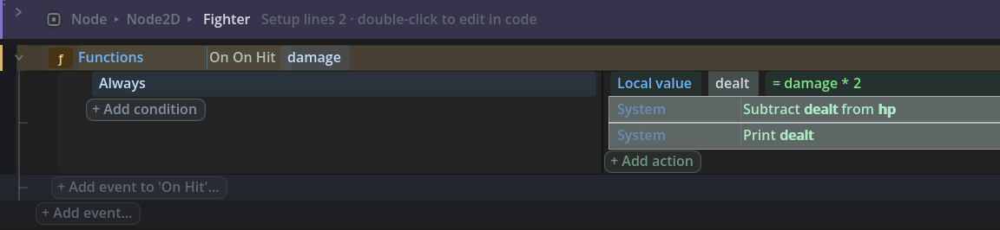
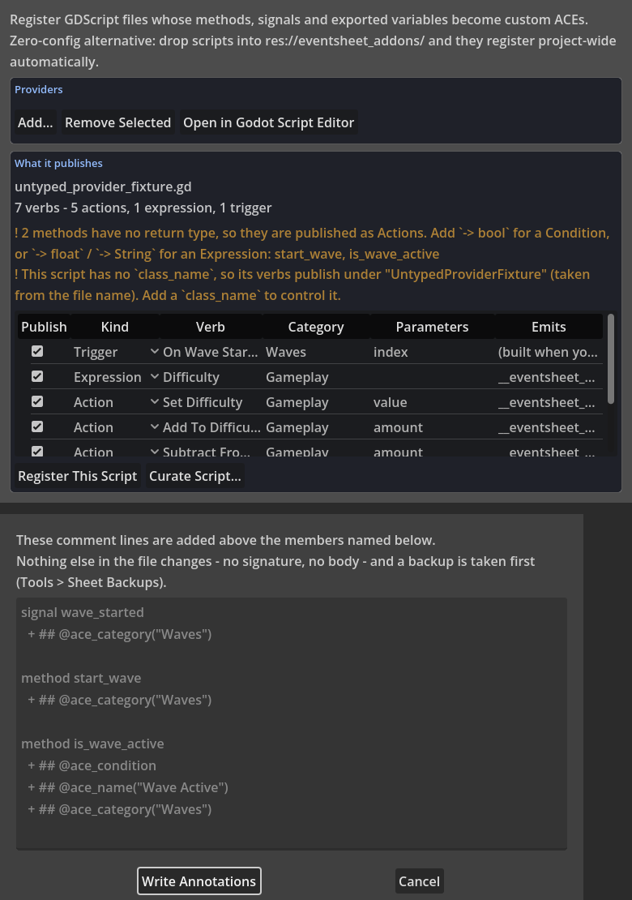
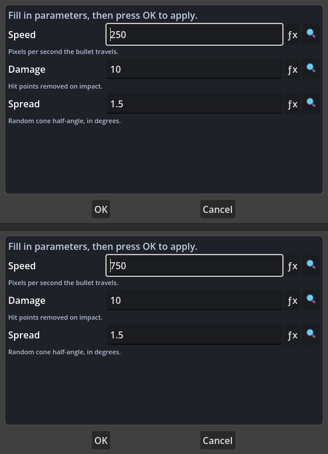

# Changelog

## [Unreleased]

### An object's states are a variable, declared once

- **Declare states, on the sheet head.** The states band's **Declare states…** asks the two questions
  a state machine really has - what the states are called, and which one the object starts in - and
  writes ORDINARY declarations: `enum State { PATROL, CHASE, STAGGER }`, the `state` variable with the
  setter that announces a change, `previous_state`, `state_entered_msec`, and
  `signal state_changed(from_state: int, to_state: int)`. Nothing is stored anywhere else, so an
  object whose author typed those lines by hand already has this feature, and uninstalling the plugin
  takes none of it away. One declaration is one machine; a second machine on the same object is
  simply a second declared state variable.
- **The band is the diagram.** The head reads `states: Patrol · Chase · Stagger, starts in Patrol`,
  derived from the declaration and echoing the enum line the compiler writes. There is no graph view,
  no wires drawn over rows and no canvas of boxes anywhere in this feature - a state is the variable
  pattern every event sheet already builds, so it reads as a line.
- **Five ordinary rows on the object.** **Is in `<state>`** (`state == State.X`), **Is in `<state>`
  for over `<seconds>`s** (the timed variant, off the clock the setter restarts), **Was in
  `<state>`** (`previous_state == State.X`), **Go to `<state>`** (`state = State.X`, one plain
  assignment that announces itself through the variable's own setter), and the two triggers **On
  entering `<state>`** / **On leaving `<state>`**. For one change, leaving fires first, and both
  descriptions say so. Every state is picked from a dropdown filled by the object's own declarations,
  so a state is chosen rather than spelled.
- **One handler for the moment.** The two triggers share `_on_state_changed(from_state, to_state)`
  wired to `state_changed`, with every leaving row emitted before every entering one - the same
  emitter the game's mode change uses, now shared between them rather than written twice.
- **Two Doctor findings.** A declared state no row can reach (nothing goes to it and the object does
  not start in it), and a row naming a state this object never declared - which the dropdown will not
  write, so it is what hand-written code, or a state borrowed from another object's family, looks
  like when it is read back.
- **It opens both ways.** A file this plugin compiled opens as those rows and re-emits byte for byte,
  and an object somebody wrote by hand - `enum State`, `var state`, `if state == State.PATROL` - opens
  with its states read and its rows lifted.
- **Authored, saved, reopened - and unmoved.** The two shapes that used to come back as something
  else now come back as themselves. The timed question is claimed WHOLE (`state == State.STAGGER and
  (Time.get_ticks_msec() - state_entered_msec) / 1000.0 > 2.0` is one row, not "Is in Stagger" plus a
  wall of arithmetic), and a `_on_state_changed` whose arms run in the order the compiler writes them
  - every `from_state` arm before every `to_state` arm - is adopted back into the On leaving / On
  entering rows that wrote it. A sheet authored with the whole vocabulary, saved, closed and reopened
  is now row-for-row the sheet it was.
- **A `match state:` reads as the states.** The arms of the shape a tutorial writes - `match state:`
  with `State.PATROL:` arms - read as **Is in Patrol**, **Is in Chase**, **Is in Stagger**: the Is In
  State row's own words, taken from that row rather than spelled a second time, so an opened machine
  and an authored one cannot say one idea two ways. A `state = State.CHASE` inside an arm reads as
  **Go to Chase**. The arm's body is kept verbatim, which is what lets the match re-emit to the byte.
- **`self.state` is the same step.** `self.state = State.CHASE` and `self.state == State.PATROL` lift
  to Go to and Is in, with the author's own spelling ridden back out untouched.
- **And what stays code, stays code, precisely.** A machine whose arms bind a name, whose
  `_on_state_changed` runs entering before leaving, or that reaches its states through a helper the
  file wrote itself, is somebody else's design: it keeps the ordinary reading it already had and not
  one byte of it moves. Three hand-written machines - the `match` shape, the announcing-setter shape,
  and one deliberately non-canonical one - are fixtures in the suite, byte-gated on every run.
- **How it relates to what already shipped.** This is the Game State family (`enum Mode`, In mode X,
  Go to mode X) one level down: same declarations, same announcing setter, same trigger order, and
  the spelling rule that turns a member into a word is shared rather than copied. The State Machine
  behaviour pack is untouched and keeps working; the difference is that its state is a String a typo
  can spell wrong and this one is an enum member a dropdown fills in. Groups stay plain organisation:
  naming a group after a state is a convention, never a semantics.

### Play mode makes the sheet the debugger

- **The states band carries the state the game is actually in.** Run the game with the sheet open and
  `Patrol · Chase · Stagger, starts in Patrol` gains `current: Chase · 3.2 s` after it - after it, not
  instead of it, so the band still reads as the declaration it stands for. With two copies of the
  game running, each reading says which window it is describing.
- **A timed row shows its progress where the question is asked.** `Is in Stagger for over 6s` gains
  `3.2 of 6` right after the cell. The left-hand number is not a second clock kept by the editor: it
  is the very quantity that row compares, streamed as the left-hand side of the line the row
  compiles to. A wait written as an expression shows no progress rather than an invented one.
- **On the stream that already shipped, and no other.** Both facts ride the Live Values frame the
  running game was already flushing (`"state", State.keys()[state]` and the seconds beside it), under
  the same rule the game's own mode follows one level up. This feature opens no channel, defines no
  message and adds no protocol.
- **Zero cost when nobody is watching.** A sheet compiled without the debug switch carries no
  instrumentation at all - no timer, no message, no branch - and an object with no states adds
  nothing to a frame even when the switch is on. Pinned as bytes on both sides.
- **Strictly read-only, and nothing over your game.** Play mode never edits: stop the game and the
  document is exactly what it was, to the byte. Every word of it renders in the sheet and the panels
  that already exist - there is no overlay on the running game's viewport and no window in front of
  it. Both are gates in the suite rather than promises in a paragraph.
- **At a stated cadence.** The running game flushes a frame every 0.25 s and the band is written only
  when one arrives - nothing counts or extrapolates on an editor frame, so a number on the band is a
  number the game reported. The band says so on hover.

### The trail: what the machine just did

- **A list of sentences, in the sheet's own grammar.** The Debugger's new **Trail** tab says what an
  object's state machine has been doing, in the past tense and oldest first: `1 s · On Hit fired -
  went from Chase to Stagger`. It reads DOWN, the way the sheet reads. There is no timeline, no
  scrubber, no replay and no picture of a machine anywhere in it - a state is a variable, so its
  history is a list of sentences about a variable. Double-click a line to go to the row it names.
- **Two deterministic pattern notes, read from the trail alone.** A **re-entry** - the object put
  into the state it was already in - says that the hold went back to 0, names the timed row that is
  now counting again, and names the **On leaving** row that never ran, because the object never left.
  A row that fired **twice inside one game frame** says so, names it, and says that only the first of
  those changed anything. A pattern that happened again is said once with how often, because "this
  happened 11 times in this run" is the half that explains why a timed row never came true.
- **Nothing new goes over the wire.** The whole feature is the editor's own reading of the two
  messages the running game was already flushing: the Live Values frame that carries the state, and
  the Event Trace's tally of rows that fired. The game is not asked for one extra byte, no message is
  defined, and a run with the trace off still builds a trail - it simply cannot name the row that did
  it, and then it does not pretend to.
- **A row is named only about a fire the run reported.** Two rows that could both have gone to that
  state, and both fired in the window? The line names neither. It still opens on the row that answers
  the change, because a line a reader cannot follow is half a line - and the door and the name are
  two separate questions on purpose.
- **A stated clock.** Each moment is the game's own report cadence and nothing finer, so a trail line
  is accurate to a quarter of a second and says so on the tab. Two changes inside one frame cannot be
  ordered by it and it does not claim to. With two copies of the game running, each line says which
  window it is describing and names no row, because the fired-events message says which rows fired
  and not which window they fired in.
- **It belongs to the Run.** The ring is bounded - a trail is the recent past, not a log - and it is
  emptied where the Event Trace's hit counts and timings are emptied, at the start of a new run.
  Stopping the game leaves it standing so it can be read, which is when it is read.

### One search that knows what the sheet knows

- **The Quick add field answers as well as adds.** Type two characters or more into the toolbar's
  **Quick add or find** field and a list opens under it holding the states, rows, variables,
  functions, signals, declared modes and Doctor findings that match - each one labelled with WHAT
  KIND of thing it is and WHERE IT LIVES. Enter goes to the highlighted answer. A name crossing your
  mind used to mean choosing between four windows first; now it is one field and one keystroke.
- **Answering is additive, and Enter still adds.** The first line of the list is the sentence exactly
  as typed and runs the very same add the field's Enter has always run, so nothing anybody already
  types has changed meaning. Down arrow reaches the answers, Escape keeps what was typed - the same
  four keys as every other suggestion list, on the shipped popup, in no new window.
- **Grouped, and the best answer decides which group leads.** Answers of one kind stand together
  under their own heading, and the group holding the best answer is on top - so a state's name puts
  **States** first and a phrase out of a finding puts **Findings** first, without either having been
  declared more important. An exact name always outranks the same word found inside a sentence, and a
  group says how much of itself is shown (**Rows - 4 of 9**) rather than burying what follows.
- **The Doctor's inbox becomes searchable.** A finding surfaces the moment its subject crosses
  somebody's mind, said in the Doctor's own words with its severity and the file it is about, and
  opening it lands where the Doctor's own page lands. Typing never starts an audit: the answers are
  what the last run reported, and with no run behind them there is simply no Findings group.
- **No new index and no second store.** Every answer is a read of something the editor already holds:
  what a sheet declares and what a sheet says are two more per-sheet completion lists, built once and
  dropped by the same two invalidations as every other one; the row matching goes through the Find
  window's own collection, so the field and the window can never disagree about what a sheet says;
  the findings are the ones the Project bar already badges with. The join happens when you ask and is
  thrown away after.
- **The edges are stated, not hidden.** Rows are the rows of the sheet in front of you - what a sheet
  says is every parameter of every row, and ranking that per open tab per keystroke is how a search
  stops being used - so the Rows group ends in **Find "…" in every sheet…**, which opens Find in
  Project on the same query and does read every sheet. Every answer either arrives somewhere or says
  on the status line what it could not reach, and none of them holds a row across an edit: an answer
  carries a uid or a name and re-finds it in the live sheet when it is opened.
- **It stays inside a frame.** A keystroke joining six kinds over eight open sheets, the one in front
  holding three thousand findable strings, measures 4.3 ms against a 16 ms budget, and the suite pins
  it against the huge-project fixture beside the completion budget. Two shipped things got faster on
  the way: a rank no longer lowers every candidate's text on every keypress, and the word-boundary
  test no longer builds two strings and an array to answer a yes-or-no question.

### Nouns in a comment are doors

- **A word a project index can prove becomes a door.** A note beside an event that says
  "%HealthBar drives this. Patrol is where it starts" now underlines `%HealthBar` and `Patrol` with a
  hairline, and one click goes there - the node selected in the Scene dock, the `enum State`
  declaration revealed on its own row. Five kinds of name qualify: a `$Node` or `%Unique` reference,
  a function this sheet publishes, a state this object declares, a mode the game declares, and the
  file name of another sheet.
- **Grounded, never guessed.** A name nothing matches stays plain prose - no mark, no message, no
  hover. A word spelled exactly like a state that is not one ("retreat") is left alone, and a file
  name two files answer to opens neither, because an ambiguous door is a guess. Both spellings of a
  note get doors, `#` and `##`, and so does a comment written inside an event's action flow.
- **The comment is untouched.** A door is something a reader is shown; the file knows nothing about
  it. The `CommentRow`'s own text is never rewritten and the line the compiler emits is the same line
  it always was - which is what the echo at the right edge of the row goes on showing.
- **No new index, and no work while you read.** The five lists are the ones the completion popup
  already builds and caches; this joins them into a name table once per sheet, and finds the doors of
  a line when the comment row is BUILT. Nothing is scanned per frame, per hover or per keystroke: the
  hit-test reads the rectangles the renderer stamped as it drew, the same way the colour swatch and
  the object label already work. The table rebuilds itself when any list underneath it does, so there
  is nothing extra to invalidate.
- **Converged with the ask rather than beside it.** A state, a mode and a function door are handed to
  the Quick Add field's own answer ladder, so a name opened from a comment and the same name opened
  from the ask arrive in the same place, and say the same thing on the status line when they cannot.

### States, documented

- **A guide for the whole story: [States: What One Object Is Doing Right Now](docs/GUIDE-STATES.md).**
  Why a state is a variable and what follows from that, declaring the states on the head and the five
  ordinary declarations the dialog writes, the four rows and the two triggers, the timed question and
  the clock the setter restarts, the compiled shape as the file it becomes, the hand-written `enum` +
  `match` machine that opens as those rows, watching it run, the trail, the two doors that find a
  state by name, and the two Doctor findings. Both worked examples are whole little scripts hung from
  lifecycle handlers, so a reader sees the compiled shape and the page draws it as a figure.
- **The group convention is stated AS a convention, in three places.** Naming a group after a state
  is organisation and carries no semantics: the rows inside it each ask **Is in** for themselves, and
  that condition is the only visible reason any of them run. The guide says why it is deliberately
  not the mode band's *runs in* word one level up - a game has one mode, and a level has fifty
  objects with a state each, so a group that quietly meant "only while this object is chasing" would
  be a rule you could not see in the row obeying it.
- **The reading a row really has, said rather than idealised.** A row shows the state as the enum
  MEMBER it stores (`Is in PATROL`), and the band, the live readings, the trail and a lifted `match`
  arm say it as a word (`Patrol`). The guide states the difference where a reader meets it instead of
  showing one spelling and shipping the other.
- **The concept map gains its row and the reading list gains six.** The map answers an object's own
  state - the instance variable and the group-per-state a reader arrives holding - with the band, the
  four rows and the convention. The GDScript word list answers the other direction, headed by the
  match-FSM lift: `match state:`, `enum State` + `var state`, the assignment, the two comparisons,
  the timed line claimed whole, and the change handler whose arm order is what makes it On leaving /
  On entering.
- **The sibling pages say the same thing once.** The patterns guide's state-machine section now leads
  with the declared states and keeps the State Machine pack as the older answer, with the one-sentence
  difference between them (a String a typo can misspell against an enum member a dropdown fills in);
  the sheet-head guide gains the **states** band row and the rule about where it is offered; and the
  Setting And Changing Variables module guide gains the Object State reference table, which is where
  the module's own guide mapping already pointed.
- **Nine languages, in lockstep.** The Object State vocabulary is fully keyed - the six display names,
  the category, the six reads-as sentences and both parameter labels - in `TEMPLATE.csv` and all eight
  translations, and the module joins the coverage ratchet, so a verb added to it later drops the
  module out of the list and fails by name.
- **The numbers, re-measured off this tree.** The front page said 1,821 verbs across 82 modules and
  94 triggers; measured module by module today it is **1,827 verbs across 83 modules, 96 of them
  triggers, with zero blank descriptions and zero blank parameter descriptions** over every parameter
  of every one. The reads-itself census re-run over the whole corpus of `addons/` and `tools/`:
  **863 files, 861 at zero script blocks, 9 block lines, 254,748 lines and 186,771 rows, 89% of those
  rows in the sheet's own words** - the block lines did not move and neither did the share. The pack
  count is unchanged at **113 behavior packs, 94 of them with a guide**, the other 19 companion data
  assets and loaders.
- Vocabulary reference regenerated, and the help bundle re-baked last over this changelog.

### Fixed in the states pass

- **A change started from inside a change is stated, and pinned by running it.** The `state` setter
  announces as it assigns, so a **Go to** written under **On entering** is a second change that
  happens immediately: its own leaving-then-entering rows run to the end, and only then do the first
  row's remaining rows resume - by which time the object is somewhere else. The four places that said
  "leaving fires first, always" with no qualifier now say what actually happens, the guide draws the
  order out, and `object_state_test` BUILDS the emitted machine, loads it and moves it, so the order
  is pinned by observation rather than by a claim about emitted text.

### A path says which place it is in

- **Every path field states its place.** Under each path box in the Files vocabulary sits a muted
  line naming where that path really is: `user://` - the player's folder, writable, one per player,
  and it survives the game being updated - or `res://`, the game's own files, read-only the moment
  the game is exported. A path built while the game runs still says which place it begins in, and a
  path whose place cannot be read says nothing at all rather than guessing. The Parameters strip adds
  what each place allows and where `user://` really is on Windows, macOS and Linux.
- **Completion for the player's folder.** A path field now completes against BOTH places: what is in
  `user://` at the time you are typing, then the project's own files. `user://` leads, because that
  is where a path in this vocabulary almost always belongs.
- **Open The Player's Data Folder.** One action that opens the real folder `user://` stands for, on
  the player's own machine, while the game runs - `OS.shell_open` over the globalized path.
- **The Doctor's Files section, with three one-click fixes.** A write aimed at a `res://` path is the
  export trap: it works in the editor and fails in every exported build, silently, because `res://`
  is a packed archive once the game is built. An absolute path (`D:/games/...`, `/home/...`) names a
  folder on one computer and on no other. And a read of a `user://` file that does not say what to
  use when the file is missing meets a first run with no save, no settings and no log. Each fix shows
  what the value read as and what it reads as now, and lands as one undo step.
- **The visible guard.** **Read Text File (or a fallback)** takes what to use when the file is not
  there as its SECOND PARAMETER - the familiar default argument, not a clause bolted onto the
  sentence - and compiles to the `file_exists` check written into the line, which the row echoes.
  Leave that parameter blank and it compiles to the plain read, unchanged. The frozen Read Text File
  beside it is untouched.
- **The folder is made where you can see it.** **Write Text File (in a folder)** carries the stated
  choice "make the folder first", which emits the `make_dir_recursive_absolute` line above the write
  and shows it on the row. Godot does not create folders on the way to opening a file, and a folder
  appearing out of nowhere would be the kind of magic this plugin does not do.
- **What a project already wrote still opens.** The plain read, the `open` / `get_as_text` pair, the
  hand-written `file_exists` ternary with its own fallback, and a `make_dir_recursive_absolute`
  prelude above a write all open as rows and save back byte-identically.
- Game saves are still the Save System's territory - slots, formats, backups - and the guide says
  where the line between the two is.

### Tables read by the engine itself, and the files band

- **Table Of File** reads a `.csv` with **Godot's own CSV reader** - `FileAccess.get_csv_line`, one
  line at a time, no new parser - so its quoting is whatever the engine does with a quote rather than
  whatever this plugin decided. It is an ordinary expression: put it in a Set action and you have the
  rows. Its **First line** parameter is a stated choice with two answers - *the first line names the
  columns*, which gives one record per row (`row["price"]`), and *every line is a row*, which is what
  a headerless export needs and what the shipped Table From File cannot say.
- **Write Table To File** is its inverse, through `store_csv_line`. A cell holding the separator or a
  quote is quoted the way the engine quotes it, so a file read by one and written by the other comes
  back byte for byte - which the suite asserts on the file's actual bytes, not on the values. When a
  header line is written, the columns come from the FIRST record's own field order: the only order
  the sheet ever stated.
- **For Each Line In File** walks a text file line by line in the loop lane, the line riding as
  `line`. The file is read once and the loop then walks text in memory, so nothing stays open behind
  it; blank lines are skipped and Windows and old-Mac endings are both handled.
- The shipped **Table From File**, **Table From Text**, **Column Of Table** and **Row Where** are
  untouched: a shipped `ace_id` and its template are a compatibility promise, so the engine-reader
  pair sits beside them, and the guide says which to pick and why.
- **The files band.** The head of a sheet now says what that sheet touches on disk: every path its own
  rows hold, exactly as the row holds it - place and all - with one word for what it does to it,
  **written**, **read**, or **read and written** when the same file is both. A row that stops and asks
  the player for a file says so once, however many rows do it. The band is derived rather than listed:
  path fields are found by the hint every path field carries, and each row is classified by the engine
  calls its own emitted line makes, so a path field a behaviour pack ships is on the band the day the
  pack ships. It obeys the band scale law - four paths named, the rest counted - and is joined from
  rows already in memory when the sheet opens, never scanned for.
- Game saves remain the Save System's territory; the guide states the line between the two rather
  than restating its verbs.

### The two doors user content comes in through

- **On Files Dropped** is the window's own `files_dropped` signal as an event: the sheet connects it
  in `_ready` on `get_window()`, exactly as a hand-written project already writes it, and the paths
  ride into the event as a chip. It is **desktop only** - Windows, macOS and Linux raise it and a web
  or mobile build never does - and the row itself says so, not a doc nobody opened.
- **Ask For A File To Open** and **Ask Where To Save** open the platform's own file chooser where
  the platform has one, through `DisplayServer.file_dialog_show`. Where it has none, the filesystem
  access `FileDialog` fallback is emitted as a **visible `else`** - both spellings are in the code a
  reader can see, because a row that quietly picked one of two very different windows would be a row
  nobody could debug.
- **The answer is an event, never a return value.** A chooser is a separate window and the player
  answers it long after the row ran, so both Ask rows end in **On A File Chosen** (the path riding as
  a chip) or **On The Ask Cancelled**, and the emitted line calls those two events' functions by
  name. A sheet that asks needs both events; the guide says so and the row's own description says so.
- **Image From File** and **Sound From File** read content from outside the project, each with the
  **fallback in the second slot** - the familiar default argument, not a clause grafted onto the
  sentence. Leave it blank and the plain load is emitted, unchanged. The image reader is
  `Image.load_from_file` into an `ImageTexture`; the sound reader names one engine reader per format
  the engine decodes at runtime and picks by extension, which is exactly three: `.mp3`, `.ogg` and
  `.wav`. **No import pipeline is involved and none is wanted** - a loaded image is a texture in a
  variable, and it lives only as long as something holds it.
- **The lift half.** A hand-written `get_window().files_dropped.connect(_on_files_dropped)` and its
  handler open as the drop event, and the two answer functions open as their own events, all
  re-emitting the file byte for byte. `get_window()` is now a connect source the reading knows, which
  also gives the shipped **On Window Close Requested** a spelling it can be opened back from.
- **The files band hears the new ask.** A row that opens the platform's chooser is found by the call
  its emitted line makes rather than by an id, so it joins the band beside the `FileDialog` rows that
  were already on it.
- The shipped **Open File Chooser** verb and the twelve frozen file verbs are untouched: these sit
  beside them. Game saves remain the Save System's territory - the guide states the line rather than
  restating its verbs. **User content is data, never code**: nothing here loads a script, a scene or
  a resource, and nothing here evaluates what it read.

### The honest watcher, and one file that is many files

- **Folder Watcher** is a new behavior pack that notices a file in one folder appearing, changing or
  going away, raising **On A File Appeared / Changed / Removed** with the whole path. Godot has no
  file-change notification at run time on any platform it ships for, so the pack does the only honest
  thing and **polls**: it reads the folder on the interval you name and compares the reading with the
  one before it, by file name and by modified time. **A poll calls itself a poll** - the row says
  `Watch folder "user://mods" every 2.0 s`, and so does the band.
- **It costs what it says.** One look is one `DirAccess.get_files_at` plus one modified-time question
  per file that passes the name filter; between looks it costs nothing, and **Stop Watching** parks
  the per-frame tick with `set_process(false)`, the fleet convention, so a stopped watcher is a node
  the engine no longer visits. The directory walk is sorted, so two machines raise the same events in
  the same order. The first look is the **baseline** and raises nothing: a folder that already holds
  two hundred files is not two hundred things that just happened.
- **Pack Folder Into Zip** and **Unpack Zip Into Folder** sit beside the twelve frozen file verbs,
  over the engine's own `ZIPPacker` and `ZIPReader`. Both loops are emitted into your script, where
  they can be read. The pack walks the files directly in one folder, not its subfolders, and the row
  says so rather than surprising the first person whose folder had a directory in it.
- **The unpack guard is the feature, and it is visible in the emitted code.** An archive entry names
  its own path, and one spelled `../../autoexec.cfg` resolves outside the folder the player pointed
  at - which is how an unpack becomes a write anywhere on their disk. So every entry's resolved path
  is compared against the target folder before a single byte is written (both sides globalized and
  simplified, the folder keeping its trailing slash so `user://mods` cannot accept
  `user://mods_of_mine`), and an entry that climbs out closes the archive, stops the whole unpack and
  raises **On Unpack Refused** with the entry and the reason on it.
- **A huge archive meets a progress bar, not a frozen game.** **On Unpack Progress** reports the
  entries and the bytes that have landed, once per entry; **On Unpack Finished** ends a run that
  reached the last entry. Like the Ask rows, the emitted loop calls all three answers **by name**, so
  a sheet that unpacks needs an event for each or the script does not compile.
- **The band grew a watch reading.** A folder read once and a folder read every two seconds for the
  rest of the session are not the same thing to say about a sheet, so a row that starts a watch reads
  as `watching user://mods every 2.0 s` - the interval included, because that is the half a path
  cannot say. A verbatim block sitting inside an event's lane is now read for file facts too, the way
  one between events already was.
- **The loops open again.** Both archive templates span lines, which the reverse index does not
  claim, so an opened file keeps them as verbatim blocks with the adopt door - and the promise that
  matters is gated: opening such a file and saving it untouched reproduces its bytes, with the three
  answer functions opening as their own events.
- The shipped `file_aces` verbs, the `json_aces` family and **Open File Chooser** are untouched.
  Game saves remain the Save System's territory. **User content is data, never code**: an archive
  entry is read as bytes and stored as bytes, and nothing here loads, parses or runs what came out.

### Safe names, the path that is still free, and the line between a file and a program

- **Safe File Name** answers with a name a file system will actually take, over the engine's own
  `String.validate_filename`: the characters it refuses become underscores, the ends are trimmed. It
  is an EXPRESSION, so it sits in the path slot of the write that was already there rather than
  becoming a second way to save a file. The second slot is the **familiar default argument** - a name
  that comes out empty (a blank box, or spaces) answers with it, so a player who typed nothing gets a
  file instead of an error. The guarded form wears its own brackets, because a bare `a if b else c`
  spliced between two `+` signs binds the whole join into the branches, and that is a wrong path
  rather than a parse error.
- **Free File Path** answers with the nearest path nothing is sitting at yet, so a second screenshot
  does not erase the first. The rule is the one every desktop uses and **it is spelled out in the
  emitted line**: `shot.png`, then `shot_1.png`, then `shot_2.png`, up to the number in the slot. The
  path expression is read **once** and the numbers are only tried when the path you wanted is taken.
  A path with no extension gets no stray dot, and a run that fills every number answers the path you
  asked for - which the row's own help says out loud, because that next write overwrites.
- **Show In The File Manager** opens the player's own file browser with the file selected, over
  `OS.shell_show_in_file_manager`. **Desktop only**, said on the row: a web or mobile build does
  nothing at all, so say on screen where the file went as well.
- **The Doctor now draws the trust boundary nothing else in the engine draws.** A path that came in
  through one of the game's own doors - dropped on the window, chosen by the player, found in a
  watched folder, written out of an unpacked archive - handed to `load()` or `ResourceLoader.load()`
  is reported. That line works, which is exactly why nothing else mentions it: a scene or a resource
  file can name a **script**, so loading one runs its author's code with everything this game can
  reach. The finding says that in plain words and offers the three data-shaped doors - **Image From
  File** for a picture, **Read Text File (or a fallback)** for text, **Table From File** for rows and
  columns - because data cannot carry behaviour. It is a **warning and not an error**: a game whose
  mods are code is a decision, and the decision is yours. What is not a decision is making it without
  knowing.
- **It reads text, so hand-written code gets the same finding.** The trace follows NAMES inside one
  file: a parameter of a door's own handler, anything assigned from one, anything a `for` walks out
  of one, and any path written under a folder that file watches or unpacks into. It keeps one set of
  names per file rather than per function, which finds the very common shape where one handler stores
  the path on the object and another loads it. It does **not** follow a path across files or through
  a call into another body - so a quiet file is not a proof, and the check says so rather than
  implying otherwise.

### Files, documented

- **A guide for the whole story: [Files and Folders](docs/GUIDE-FILES-AND-FOLDERS.md).** The two
  places and why the export trap survives testing, where `user://` really is on each platform, the
  guard written into the emitted line rather than performed behind it, the two CSV readers and which
  question each one answers, the drop and the ask with the reason an ask ends in an event, the
  watcher that calls itself a poll, the unpack guard, the name a player typed, and the mods chapter.
  Every worked example is a whole little script hung from a lifecycle handler, so the reader sees the
  compiled shape and the page draws it as a figure.
- **The mod rule is stated positively.** A mod format is DATA THE GAME INTERPRETS, and the worked
  example is a kinds table: the file lists entries with a `kind` your game knows, and your sheet
  answers each kind with rows you wrote. What `load()` does instead is said plainly beside it - a
  scene or a resource can name a script - so the Doctor's warning reads as the boundary it is rather
  than as a scolding. The three data-shaped doors are named as the alternatives they are.
- **The line between this and the save pack is one sentence, in both directions**: the save system is
  for state your game produced, these rows are for content that arrives from outside it. The guide
  says it once and never restates the save pack's verbs.
- **The Folder Watcher guide reaches the house standard** - a table of contents, seven core concepts
  (a poll not a subscription, two readings and one difference, the baseline, running or stopped with
  nothing between, the filter applied first, whole paths out of triggers against bare names out of
  expressions, and an interval as a promise about the worst case), the ACE reference split per kind
  with each verb's own description, the Self section, and the sixteen worked cases it already had.
- **The concept map gains six rows and the existing-code reading list gains a section.** The map
  answers project files and the two places, the chooser and desktop drag-and-drop, a `.csv` of game
  data, watching a folder, one `.zip` of content, and mod support. The reading list answers the other
  direction: the table of file spellings and the rows they open as, the window as a connect source,
  the answer function that opens from its header alone, and the multi-line loops that stay verbatim
  blocks with the adopt door - said out loud rather than left to be discovered.
- **The numbers, re-measured off this tree.** The front page said 1,800 verbs across 82 modules and
  88 triggers; measured module by module today it is **1,821 verbs across 82 modules, 94 of them
  triggers, 2,900 parameters between them, and zero blank descriptions and zero blank parameter
  descriptions**. The reads-itself census re-run over the whole corpus of `addons/` and `tools/`:
  **847 files, 845 at zero script blocks, 9 block lines, 251,221 lines and 184,147 rows, 89% of
  those rows in the sheet's own words** - the block lines did not move and neither did the share.
  The pack count moves by exactly the watcher: **113 behavior packs, 94 of them with a guide**, the
  other 19 companion data assets and loaders. Assertions **20,067 across 704 test files**, counted off the runner's own total rather than from a grep.
- Vocabulary reference regenerated, and the help bundle re-baked last over this changelog.

### The files pass, read back adversarially

An independent review read every line the pass shipped against every sentence it wrote about itself.
These are the places the two disagreed.

#### Fixed

- **The unpack counted entries it never wrote.** The entry count, the byte total and the progress
  call sat OUTSIDE the `if __file:` guard, so an entry the machine refused to write - a name the file
  system will not take, a folder it could not make, a full disk - still moved the progress bar and
  still counted into **On Unpack Finished**, while the guide promised "the entries and bytes that
  have landed". All three are inside the guard now: the numbers are what landed.
- **The unpack's refusal no longer leaves by `return`.** Inside a sheet function that answers with a
  value, that emitted `return` was a script Godot could not parse - and the compile reported no error
  at all, because the emitted text is only read when the engine reads it. Inside an ordinary handler
  it silently abandoned every later row of the same event. The guard now records the entry and leaves
  the loop; the archive closes once, and the line after the loop raises whichever of the two events
  the run earned.
- **The guarded read wears its own brackets.** **Read Text File (or a fallback)**, **Image From File**
  and the Doctor's respelling fix all emitted a BARE `a if b else c`, while Safe File Name and Sound
  From File beside them wrapped theirs. An expression answers inside somebody else's sentence, and a
  bare ternary spliced between two operators binds them into its branches: dropped into one side of a
  Compare Values row, the guarded read quietly BECAME the file's text instead of a comparison of it.
  Wrong answer, not a parse error, so nothing would ever have said so. All three are bracketed now,
  and the suite runs a guarded read inside a comparison to prove it.
- **The Doctor's fixes read the vocabulary rather than a list of it.** The table naming each verb's
  path fields was hand-kept, and it had already drifted from the verbs shipped beside it: nine path
  fields - both loaders, both archive verbs, the engine's CSV pair and the line loop - were invisible
  to both one-click fixes, so a **Write Table To File** aimed at `res://` raised the export-trap
  warning and the chip beside it then answered that there was nothing to fix. Path fields are now
  DERIVED from the same `file_path` hint the files band reads, spelled once for both. Which verbs
  WRITE stays a written-down table, because no hint can say that - and the suite now fails when a
  verb whose emitted line makes a write call is missing from it.
- **An archive written to `res://` is the export trap too.** The sweep never learned `ZIPPacker`, so
  a **Pack Folder Into Zip** aimed at `res://runs.zip` produced no finding at all while the files
  band at the top of the same sheet called that row *written*. It is followed by the name the packer
  is bound to, so a reader's identical `open(` stays silent - reading an archive out of `res://` is
  what `res://` is for.
- **Three smaller misreadings in the same checks.** The absolute-path check read every quoted string
  on a statement rather than the ones a file call was handed, so a trailing comment naming an old
  path raised a warning about a path the code does not use. The literal scan did not honour a
  backslash-escaped quote, so one string carrying one pushed every literal after it out of step. And
  the unguarded-read check fell silent on the WORDS `file_exists` wherever they appeared, so a line
  guarding one file and reading another read as guarded. Each is pinned on a fixture.
- **The outside-content trace follows the shape its own header names.** `self.chosen = path` in one
  handler and `load(self.chosen)` in another - the store-it-on-the-object shape the trace exists for -
  went unseen, because the rule that keeps somebody else's `config.path` out was reading `self` as
  somebody else. A watched folder held in a name (`var folder = "user://mods"`, then
  `watch_folder(folder, 2.0)`) went unseen for the same kind of reason. Both are followed now, and
  the finding states its own reach: it reads names inside ONE file, and a file it says nothing about
  is not a file it has cleared.
- **The files band obeys its own scale law about watches.** The band capped paths at four and then
  appended one reading per watch with no cap at all, so a sheet starting ten watches wore ten bands
  plus four paths plus the ask - a head longer than the sheet, which is the thing the law in the
  file's own header forbids. Watches are capped now, with the same "and N more" line.
- **Two walks the band was making narrower than the Doctor's.** A chooser somebody wrote by hand in a
  verbatim block never read as *asks the player to pick a file*, though the band already reads
  verbatim blocks for the paths in them and finds the ask by the line it opens. And both band walks
  read a function's `events` only, while a function lifted out of a hand-written file keeps its rows
  in `rows` - exactly the shape this plugin is for.
- **Safe File Name neutralises `..`.** It is the one thing a player can type that a file system
  accepts and that is not a name at all: `String.validate_filename` leaves it exactly as it is, and
  the documented next step is joining the answer onto a folder, where `"user://saves"` joined with
  `..` is `user://` - the folder above the one the row meant. Leading dots come off, so `..` answers
  with the fallback and `.hidden` answers `hidden`. The Windows reserved device names (`con`, `nul`,
  `com1`) still survive it, which the module page now says out loud along with the fix.
- **Sound From File keeps the promise printed on it.** Its fallback said it answered "when its
  extension is none of the three", and it did not: a `.flac` that existed fell off the end of the
  reader chain into `AudioStreamWAV.load_from_file`, which answered null with an engine error on the
  console. The guarded form now asks about the third extension too and ends at the fallback. A file
  that is THERE but unreadable still reaches its reader and answers null - true of all three loaders,
  and now stated in the module page rather than nowhere.
- **The watcher no longer reports a missing folder as an empty one.** A deleted folder, an unmounted
  share and an unplugged drive all answer with an empty list exactly as an empty folder does, so a
  look taken then raised **On A File Removed** for every file the folder held - and **On A File
  Appeared** for every one of them when it came back. The folder is asked whether it is still there
  before anything is compared, and the last reading is kept.
- **The watcher's interval stops drifting.** Each look restarted its count from zero, throwing away
  the overshoot, so the real gap was the interval plus up to one frame every time and the watcher
  kept a slower clock than the number on the row. At most one interval is carried now, so a long
  stall does not turn into a directory read every frame either. The page also says two things it did
  not: what happens when the folder itself goes, and that the name filter is case-sensitive.
- **Path completion sees the folder as it is now.** The `user://` half of the list was filed with the
  project-scoped lists, which are dropped when the `res://` filesystem changes - and nothing in the
  editor watches `user://`, so the list kept answering with the folder as it was at the first ask for
  the rest of the session, while its own comment claimed it read the folder as it stands. It is
  dropped when a field starts completing: once per dialog, never once per keystroke, so the walk
  stays off the typing path.
- **Both Ask rows are filed where they compile.** The fallback half of their branch calls
  `add_child` and `popup_centered` on the host, so a sheet whose script is not a Node cannot run
  them - and they declared no node scope at all, unlike **On Files Dropped** beside them. They are
  filed on `Node` now. Nothing they emit changes: the cross-node "On node" target is only added to a
  template whose every line is a member operation, and theirs leads with `if`.
- **Every one of those checks now says what it cannot see.** All three read the path literal a call
  was handed, so a path built out of pieces or held in a variable is one they have nothing to say
  about. That was true from the start and stated only in a source comment; it is in the finding and
  in the guide's Doctor chapter now, because a quiet report that reads as a clean project is the one
  way an honest check misleads.

### Every call on a known class is a row

- **The API is vocabulary too.** A call whose receiver's class the sheet can KNOW now derives an
  object-verb row on the spot: the receiver in the object column, the method as the verb, the
  arguments named by the method's own parameter names. It can know it far more often than it used
  to - `self` is the class the script extends, an `@onready` node carries its declared type, a
  `var beat: Timer` says so in the declaration, an autoload is a script at a known path, and a bare
  class name is a class - and a project script's own methods are read out of the file, so
  `hero.take_damage(3)` reads with the author's own parameter names rather than a bare 3. The row IS
  the line it read: nothing is translated, and the byte round-trip is gated on it anyway.
- **The two layers are visibly different.** A derived reading keeps the plainer call style - the verb
  unbolded, drawn a shade back - and carries the class it was read off muted beside the object, so a
  reader always knows whether they are looking at words a person wrote or words the API gave. Where a
  curated recogniser claims the line, the curated sentence wins exactly as before; landing a curated
  table later upgrades the derived rows in place on the next open, with the file untouched. Same
  bytes, better words.
- **A receiver nothing can name is never guessed at.** `get_parent().thing()`, an untyped local, a
  name only ever assigned at run time - the reading declines, the row keeps whatever plainer view it
  already had, and the ledger goes on counting the line. A method the class does not have is not the
  class's method either, whatever it is spelled like.
- **The method's own words ride on the row.** Hovering a derived row shows what the verb does - the
  engine's own class reference for a built-in member, with the credit its licence requires, or the
  `##` lines above the declaration for a method in your own script - with the exact line of code
  underneath it, where it always was. `F1` on a built-in member opens its page in the Manual. No new
  store: both come through doors that already existed.
- **And the writing half.** The picker grows a **Methods in this project** section: one entry per
  method your own scripts declare, filed under the node or the autoload it belongs to, with the
  target, the method name and the arguments already answered off the declaration - a parameter's own
  default where the author wrote one, the empty value of its declared type where they did not - and
  the author's `##` line as its description. What used to be a Call Method row with a typed string in
  it is a first-class entry.

### Every property too

- **The Inspector's own three columns, on a row.** A write to a property of an object whose class
  the sheet can KNOW now reads as object, property, value - `torch.shadow_filter_smooth = 0.5` is
  *torch ▸ Set shadow_filter_smooth to 0.5*, with `Light2D` muted beside the object. Same receivers
  the derived calls already resolve (`self`, an `@onready` node, a typed declaration, an autoload, a
  bare class name), and a project script's own `var` lines are read out of the file, so an `@export`
  somebody documented answers with the words they wrote above it.
- **A comparison is a question in the left lane.** `torch.shadow_filter_smooth > 1.0` reads
  *torch ▸ shadow_filter_smooth > 1* - the compared-variable rendering every sheet variable already
  gets, generalised to an object's own property. Before, such a line read as the whole expression
  under System, with the object it is really about nowhere on the row.
- **A read answers where it stands.** A value that is itself a property of something the sheet can
  name is drawn in the same plainer style the property on the left wears, and its own description
  rides on the row beside the one being written - which is where the grammar says an expression
  answers: inside the slot it fills.
- **Curated word maps still outrank the raw property name.** `torch.energy = 1.2` on a light stays
  *Set brightness to 1.2*, because somebody wrote those words; the property beside it that no map
  claims is read off the class instead, in the plainer derived style. Landing a word map later
  upgrades those rows in place on the next open, with the file untouched - same bytes, better words.
- **And the same three refusals.** A receiver whose class nothing can name, a property the class does
  not have, and a bare `hp = 5` with no receiver written down at all: none is guessed at. Each keeps
  the plainer view it already had, and the ledger goes on counting the line.
- **The property's own words ride on the row.** Hovering shows the engine's class reference for a
  built-in property, with the credit its licence requires, or the `##` lines above the declaration in
  your own script - an `@export` annotation between the two no longer breaks the block. `F1` on a
  built-in property opens its page in the Manual.

### Four hand-written idioms the sheet had no words for

- **The input handler asks the event now.** `if event.is_action_pressed("jump"):` inside `_input` or
  `_unhandled_input` used to open as *Expression Is True* - the honest catch-all, and the plainest
  thing a sheet could say about the commonest input shape there is. It reads as *this event is "jump" going down*,
  beside three more: the press widened to include a held key's repeats, the release, and the question
  of which action an event belongs to at all. Both of Godot's quotings answer to the same row, because
  the `&` is a spelling rather than a value and rides back out untouched, and the action names come
  from the project's own Input Map exactly as the polled Input rows' do. These are the rows for the
  inside of a handler; the Input section's rows ask the keyboard how things stand right now, which is
  what an every-tick event wants.
- **A property that names its accessors is a property.** Godot has two spellings for a guarded value,
  and the sheet only read one. `var health: int = 100:` followed by `set = _set_health,` opens as the
  variable row it is, with a *On health set → _set_health* sub-row under it saying which function runs
  and when - and the functions themselves go on reading as the functions they are, where they were
  written, rather than being copied under the declaration twice. Before, those two accessor lines were
  not statements, so nothing could lift them and they took the declaration above them into a code
  block. Every shape the emitter would not write back the same way - the other order, a trailing comma
  with nothing after it, a name that is not one name - still stays the verbatim block it was.
- **A connect that binds values still wires a trigger.** `pressed.connect(_on_open.bind(3))` was
  refused by the connect reader outright, which stranded the handler as a helper function nobody could
  see the caller of. It reads as the trigger it is, and the bound values land on the payload chips
  paired with the arguments they fill - `slot = 3` rather than a bare `slot` a reader then has to go
  and look up. Godot appends bound values to the end of a handler's arguments, which is what makes
  that a pairing rather than a guess. A function the file publishes as a VERB is never re-read as a
  handler, however it is wired: the verb says what it IS, everywhere, and a trigger could only ever
  describe one of its wirings.
- **The four notifications a game reacts to have names.** Paused, unpaused, the window's close
  request and an object about to be freed are pickable rows now, filed under Notifications, and every
  one of them compiles into the same `match what:` the engine's one-callback design asks for. They
  have lifted out of hand-written files since the notification reading shipped; what they lacked was a
  name, so the reading called them by their constant. `NOTIFICATION_PREDELETE` also stops reading *On
  destroyed*: that is what a node LEAVING THE TREE reads as, which can happen more than once and is
  not this, so it reads *On object freed* and the two moments stop sharing one sentence.
- **Two more files in the corpus, both at 100%.** `pause_menu.gd` (an input handler, buttons wired
  with bound values, and the pause notifications) went from 40 lines of code to none, with four of its
  lines now claimed by a lift entry by name; `player_stats.gd` (properties in both spellings) went
  from 75% and two lines of code to 100% and none.
- **Two things the reading was quietly getting wrong, found on the way.** Measuring a buffer used to
  SAVE it: the reading compiled to the file it had been asked to read, which is invisible while a file
  round-trips byte-identically and is exactly wrong the moment one does not - the byte gate would have
  overwritten the fixture with the drifted bytes and passed on the next run. And the half-lifted view
  a whole-file fact is read from was a hand-maintained list of row ids, so a fact stopped working the
  day the line it was about gained a row: an input window could no longer say which control it was
  waiting for. Rows answer for themselves now, through the same emitters the file is saved with.

### A pack can teach the reader the lines its verbs are written as

- **`## @ace_lift_example` beside a verb, and somebody's hand-written file reads as your pack.** A
  pack ships verbs, and whoever used it before they used the sheet wrote those verbs by hand: their
  `_ready` says `flicker.start_flickering()`, and opening it read as the generic *call a method* row
  every unclaimed call lands on. Honest, and the floor rather than the ceiling - the pack knows what
  it would rather that line said. Now it can say so, as an EXAMPLE rather than as a pattern: the line
  the way a person writes it, with the value spans marked (`[[target|receiver: $LightFlickerBehavior]].start_flickering([[after_seconds|argument: 0.5]])`),
  which is the same by-example form the built-in tables are authored in. The Light Flicker pack ships
  the first four: start and stop, each with its argument and without it, so all five spellings of
  those two verbs - a node path, a `%unique` name, a `get_node("…")`, a bare variable, with or without
  the number - read as the pack's own rows.
- **The words change and the bytes do not.** The line the author wrote is baked onto the lifted row as
  its template, exactly as the built-in spelling families bake theirs, so saving writes their file
  back byte for byte. That is what makes a table landing LATE safe: the same file opens, the same
  file saves, and the rows in between read better. With no table installed at all it still opens - as
  the generic call, which is pinned beside the upgraded reading so the floor stays visible.
- **An entry that cannot keep the promise never ships.** Pack spellings pass the SAME auto-generated
  gate the built-in tables do, at pack-build time: every entry generates its own fixture line, has to
  be claimed by itself, and has to re-emit byte for byte (`audited=… drifted=0` now prints
  `spellings=… problems=0` beside it). Shadowing a built-in spelling is an error naming both. Two
  packs that answer to one line are a Project Doctor note rather than an error - the answer is well
  defined, the pack first in folder order claims it, and the one that lost is told. An example above
  no verb, on a condition rather than an action, or that cannot be built at all comes back as a
  refusal carrying the sentence that says why.
- **Where the structured reading stops is now pinned, on purpose.** Multi-line enums and inner classes
  have read as structure for some time (an enum row that remembers its explicit values and its
  trailing comma; a data-class or class block whose members read as the rows they would be at top
  level). What was never written down is the other side of that gate: a comment among an enum's
  members, an enum with no name, a class inside a class. Each stays honest code, and each is now
  pinned as both the reading it gets and the file coming back byte for byte either way.
- The editor's own rotating corpus gate reached a Manual page it had never measured
  (`doc_editor_words.gd`, whose body is one dictionary literal of key to sentence), so the manual
  group's wordless-row ceiling is 26 rather than 21 - the number read off the worst file in the
  group, as every ceiling there is, with the file and the reason named beside it.

### The sheet goes quiet about what is wrong

- **Every finding now speaks from two places, and neither is inside the sheet.** The networking,
  lighting, effects, spawning and performance findings used to hang a note row under the event they
  were about, so a sheet with three things worth saying grew three rows nobody wrote. All five
  families now do what the collision findings already did: the affected row wears the quiet amber
  state - a faint warning tint over the row and a thin inset just inside its edge - and that is the
  whole of the sheet's signal. The words and the finding's one door live in the Doctor's triage
  inbox and in the help strip under the row once it is selected, and the strip's button runs the
  very dock operation the inbox chip runs. Anchors are unchanged: a value's finding sits on the line
  that declares it and a message's on its function head, in the same amber. The optimiser's receipt
  ("did that fix work") still reads under its row while the costs lens is on, because a receipt is
  an answer somebody asked for, not a complaint.
- **The Doctor's Collision Layers section reaches the rows.** Its two notes - a layer the project
  does not name, and a number that is not a layer at all - were filed against whole script files.
  The same wording, with the same gates, is now also asked of the lines each sheet row emits, so the
  one row that says the number wears the amber state and its strip says the section's own sentence.
  No door on these: naming a layer is a Project Settings decision, and the strip does not pretend
  otherwise.

### One grammar for reading somebody else's code

- **The capture spans are a vocabulary now, not a copied regex.** Opening a hand-written script as a
  sheet means recognising the spellings people used, and every recogniser table in the plugin kept
  re-spelling the same handful of spans: a receiver that may or may not be written, a message name in
  either of the two quotings Godot accepts, a whole quoted literal, one argument of a call, the
  expression that runs to the end of the line, and one bare identifier. Those six are one shared
  grammar, each pinned on a table of what it accepts and what it refuses, and each carrying both of
  its halves - the pattern it matches AND the slot it re-emits as - so a span cannot be widened
  without its shape following. The messaging family, whose spellings are the best-tested in the set,
  is migrated onto it as the proof: same bytes, same rows, one place that says what a name is.
- **A recogniser can be written as the line itself.** Hand over the line as a person writes it with
  the value spans marked - `create_timer([[seconds|argument: 2.0]]).timeout.connect(...)` - and the
  whole table entry is derived: the pattern anchored at both ends with everything outside a mark
  escaped literally, the captures named after the marks, the canonical spelling with slots where the
  marks were, and the sample values the test harness generates its fixture line from. Two spellings
  are two examples, never one example with a choice in it. And it never guesses: a span with no name,
  a name used twice, a fragment word that does not exist, text that is not the fragment it claims to
  be, two spans wide enough to swallow each other - each comes back as a refusal carrying the
  sentence that says why, and a table that asked for something impossible fails the suite naming
  itself instead of shipping a spelling that never matches.
- **Five questions asked of every entry, old and new.** Does the pattern anchor to the whole
  statement, is every group in it named, is every value the canonical spelling shows backed by a
  capture, is every value the row shows answered by the spelling or given a default, and is the
  entry's own fixture line its own rather than one an earlier entry already claims. A malformed entry
  fails the suite by name, with the sentence that says which of the five it got wrong.
- **Two families that were being tested by nobody now are.** The landing-check spellings and the
  filtered-overlap questions kept their entries under a name the harness does not scan for, so eight
  entries were shipping without the generated fixture and the byte round-trip every other entry gets.
  They are found now, and they pass.

### The bench a recogniser is written on, and the code it is measured against

- **Tools > Lift Workbench.** Paste hand-written GDScript into a buffer and the window
  answers three questions about it as you type: what claims each line (the lift family and entry id
  that recognised it, the plainer name of the row it otherwise arrived as, or "stays code"), the rows
  it opens as (drawn by the real viewport, read-only, not a mock-up of it), and what it saves back as
  (green when the bytes come back identical, red with the exact two lines when they do not). The
  refresh is debounced and the buffer is the whole scope - it never touches the project - so the
  window costs nothing to leave open, and nothing at all until it is first asked for.
- **Draft an example, from the line that motivated it.** Select a line nothing claims and the
  by-example form opens pre-filled with it: mark the value spans, and the derived entry comes back to
  be read - pattern, canonical spelling, sample values - or refused with the sentence that says why.
  Adding it holds the entry in the open panel, where it is asked first on every refresh and marked
  "draft" while it claims anything, so a draft is never mistaken for a shipped spelling. It lasts
  exactly as long as the panel does: nothing is written anywhere.
- **A corpus of whole files, and the pins that make coverage a visible diff.** `tests/corpus/` holds
  four scripts a real Godot developer would plausibly have written - a tutorial-style player
  controller, an enum-and-match door state machine, a networking lobby autoload, and a pickup with
  tweens and a camera shake. One gate opens and saves every one of them byte-identically, and pins
  each file's reading as numbers: the share that reads as rows, the lines a lift entry claims by
  name, and the lines that stay honest code. Moving a pin means editing the test, which is the point -
  a coverage change arrives as a deliberate diff with the delta stated instead of a floor quietly
  absorbing it.
- **One reader, three callers.** The workbench's claim question and the corpus's percentage both run
  through the walk the head bar's reading-coverage chip already uses, so the number a developer is
  shown on a buffer, the number the gate pins on a file, and the number a reader sees on the Include
  bar cannot drift apart.

### The verbatim ledger: what the lines nothing claims look like

- **A stays-code line has a SHAPE now.** The same statement with the author's own words taken out -
  identifiers, numbers, strings and node paths blanked, keywords and punctuation kept - so
  `pop.chain().tween_callback(queue_free)` reads as `name.name().name(name)` and
  `enum State {CLOSED, OPENING, OPEN, LOCKED}` as `enum name{name,name,name,name}`. Spacing is not
  part of a shape, so a project that writes `x = 1` and one that writes `x=1` land in one group
  rather than two, and the name atom is the lifter's own - the suite holds the character test and the
  recogniser grammar's identifier pattern against each other so neither can widen alone. It is not a
  new analysis pass: it rides the reading that already happens, one character scan per line that the
  reading already handed back as code.
- **Project Doctor > Reading.** The one section that reports nothing wrong. It groups the project's
  stays-code lines by the shape they share, ranks them commonest first, and opens each group's own
  lines as doors into the files they are in - which is where a curated table would pay next, said as
  a ledger rather than as a hunch. The head number is the project's reads-as percentage through the
  same shared reader the head bar's chip and the corpus pins use, and it is said APART from the count
  underneath it on purpose: the percentage answers the DRAWING question (how much of the file the
  canvas shows as rows), the count answers the NAMING question (how many lines no vocabulary claims),
  and a page printing only the first would publish a figure that is true and misleading at once.
- **The one-off tail is counted, never expanded.** Lines whose shape nothing else in the project
  repeats get one entry saying how many there are and nothing more. A line said once is nobody's
  table, and it is meant to stay code - general purpose includes the right to just be code, and
  listing two hundred of those would bury the eleven shapes that matter. The band scale law does the
  rest: the commonest shapes are named, each opens three of its lines, and everything past that is a
  count.
- **The same census, headless, over any folder.**
  `tools/reading_shape_census.gd` walks a directory (the showcases by default), runs the same reader,
  and prints the ranked shapes as plain text with a sample line under each - the input for deciding
  where the next curated table goes. Byte-stable across runs: the walk is sorted and the ranking
  breaks ties on the shape's own text, never on the order a filesystem handed the files back.

### The three layers, written down

- **A guide for how your code reads.** Every line of an opened file arrives through one of three
  layers - a curated sentence somebody wrote, a derived row the API already carried, or honest code
  that no layer claims - and until now that model was visible in the rows and nowhere in the
  documentation. `docs/GUIDE-HOW-CODE-READS.md` is those three layers: the two marks that separate a
  curated sentence from a derived one at a glance (the bold weight against the plainer call style,
  and the class muted beside the object), where a derived row gets its words (the engine's class
  reference with its credit, or the `##` lines above your own declaration), the ranking that only
  ever goes one way, and the upgrade-in-place promise that makes shipping the floor first safe.
- **The ledger and the shape, said for a reader rather than for a maintainer.** The guide carries
  the Doctor's Reading page as a section: why the two numbers are said apart (the drawing question
  and the naming question, both true and measuring different things), the four worked shapes with
  the statements they come from, the six named shapes with three lines each and the counted one-off
  tail, and the headless census with the sentence that says why it is byte-stable across machines.
- **Six idioms, each with the reading it used to get.** Any call on a known class, any property on
  one, the input handler asking its event, a property that names its accessors, a connect that binds
  values, and the four notifications - each as the line a person really writes, the row it arrived as
  before, and the row it arrives as now.
- **The boundary is stated rather than implied.** A reading recognises spellings; it does not
  understand programs. Semantics stays code, and that is correct rather than a gap waiting to be
  closed - which is why a statement no layer claims is still an editable row, a shape the compiler
  could not reproduce is deliberately left as a script block instead of being reformatted behind an
  author's back, and both are counted out loud.
- **The concept map and the reading list gained every new family.** A reader arriving from another
  event-sheet editor now finds the derived layer as its own headline row ("any call on a class the
  sheet can name is already a row"), the instance variable with a setter, the two input families
  filed apart, and the pause / resume / window-close notifications. The existing-code guide's reading
  list gained the accessor spelling that names its functions, the handler that asks its event, the
  four notifications by name, the stays-code ledger and the pack-taught spellings.
- **The contributor half is in the playbook, where contributor material lives.**
  `docs/internal/SLICE-PLAYBOOK.md` gains the bench a recogniser is written on (its three answers and
  why the buffer is the whole scope), the draft-an-example loop and its panel-lifetime drafts, the pack's own
  `@ace_lift_example` and the gate it passes at build time, and the corpus rule - a new family adds
  the file that motivated it, pins move up, and the commit that moves one states the delta.
- **The front-page figures are re-measured, and the census re-run.** 1,800 built-in verbs across 82
  vocabulary modules, 88 of them triggers, and 2,863 parameters between them - where the page said
  1,791, 80 and 84, which was the count before this pass. The parameter figure is every parameter of
  every registered row, the receiver a node-scoped row carries included, which is a wider rule than
  the 2,429 the page carried; the rule is written down here so the jump is a counting decision rather
  than an unexplained number. Descriptions were measured at the same time: **zero blank descriptions
  and zero blank parameter descriptions**, which is what lets any of these be published rather than
  only counted. The assertion figure is re-measured off the run that earned this pass its verdict:
  19,856 across 699 test files.
- **And the repository's own reading, published honestly.** Measured over the 832 files of
  `addons/` and `tools/`: 830 of them at zero script blocks, 9 block lines in all, 248,042 lines and
  181,542 rows. The page said 709 files and 234,574 lines, which was a smaller tree; the nine block
  lines did not move, and neither did the 89% of rows in the sheet's own words. That last number is
  worth saying plainly rather than quietly: it counts a row whose own CODE says nothing of itself, so
  a derived reading gives a row better WORDS without changing what that counter counts. The number
  this pass moved is the corpus's - `pause_menu.gd` from 40 lines of code to none, `player_stats.gd`
  from 75% and two code lines to 100% and none - which is exactly the measure that was built to move
  as a visible diff.

### Collisions, written down

- **A guide for what touches what.** It leads with the decision the rest of the subject hangs off -
  detect only is an Area, blocks and is driven by your rows is a CharacterBody, blocks and is thrown
  by physics is a RigidBody, blocks and stands still is a StaticBody - and each row of that table
  names the triggers and conditions that come alive with the choice, which is what the picker filing
  rows by node class means in practice. Then the asymmetry, taught once and plainly: a layer is where
  an object sits, a mask is what it watches, and A notices B when A's mask covers a layer B sits on,
  which is why a perfect mask on the bullet does nothing for an enemy nobody put on a layer. Then the
  filtered sentences, the edges, the deep verbs woven in rather than re-documented, the readings, and
  the two Doctor sections with the receipt each door leaves.
- **The concept map has collision rows.** A reader arriving from another event-sheet editor looks up
  Solid, Jump-thru, "on collision with `<object type>`" and "is on floor", and found a bare pair of
  signal names. All four are rows now, beside the node-family table and the layer vocabulary, and the
  lane-one table gains the line for "my collision event never fires" - which is the Doctor's section,
  said where somebody looks for it.
- **The reading list says what a collision script opens as.** Three entries in the existing-code
  guide: the guard-first handler in both of its spellings and what is deliberately not claimed, the
  was-on-floor pattern with the two-variable form and every name a project gives its own memory, and
  the four layer calls with the number that stays in the file while the name is resolved at read
  time.
- **The figures are re-measured, module by module.** 1,791 built-in verbs across 80 vocabulary
  modules, 84 of them triggers, and 2,429 parameters between them - where the front page still said
  1,755 and 68, which was the count before this pass. Descriptions were measured at the same time and
  are the reason the number can be published: zero blank descriptions and zero blank parameter
  descriptions, over every verb of every module.

### The step something changed

- **On landed / On left the ground.** The two moments a platformer is built out of, said as rows.
  Neither is a signal - Godot answers "am I on the floor?" as a standing question, and the MOMENT it
  changed is this step's answer against last step's. So the row carries the memory every platformer
  already writes by hand: a was-on-the-floor variable, the comparison, and the update after it, in
  that order and visible in the row's echo. The ordering is the whole of it - a memory brought up to
  date before the question is asked always agrees with the present, and the row could never be true.
  Landing lives in the physics step it is a moment of, so a landing event and a plain physics event
  share one `_physics_process` rather than asking for two.
- **On first overlap / On last overlap ended.** The same idea where the engine already does the
  remembering: an area's arrivals and departures ARE signals, and the overlap list is already up to
  date when one is raised - so "this is the first one in" is a list of exactly one, and "that was the
  last one out" is an empty list. The pressure plate, the room waking up, the room going quiet.
- **The edge is a row, not a wrapper.** Picking any of the eight puts an ordinary condition
  underneath - *just landed*, *is the first one in* - which you can read, edit, disable and delete
  like any other, and which is a plain condition on disk.
- **The landing check every platformer already contains opens as that row.**
  `if is_on_floor() and not was_on_floor:` reads back as **On landed** with *just landed* under it,
  and the file is written back byte-for-byte - including the name the project gave its own memory,
  because the name is the author's spelling and not a value the row shows. Both orders of the two
  halves are claimed, and so is the two-variable form where this step's footing went into a local
  first. An `if` that asks for more than the edge is deliberately left alone.
- **A touch row on a scene that cannot touch says what to add.** The entry stays listed and greys,
  and its reason is the fix: "Nothing in this scene can touch anything yet - this row needs an
  Area2D", with the Add button turning into *Add an Area2D to the scene*, performed through the
  editor's own undo and then carrying on to the row you wanted.
- **Every touch row's dialog teaches its own node family.** Four answers where there were two: an
  area DETECTS, a character body is DRIVEN by your rows, a rigid body is THROWN by physics, a static
  body STANDS still. Which one a row is filed under decides what you may expect of it, and that is
  the fact a beginner is missing while they fill the form in.

### The touch, with a filter on it

- **On collision with `<Group>` / On stopped colliding with `<Group>`, and their Area twins.** The
  bare touch triggers say THAT something arrived; a game nearly always wants to know that the player
  arrived, or a bullet, or a pickup. The group is now the row's own **With** field, picked from the
  project's node groups - a parameter, never a clause. What is emitted is the line the author would
  have written: the handler's FIRST statement is a visible `is_in_group` early return, and what did
  arrive rides on into the rows underneath as the trigger's payload. Two groups on one signal become
  two handlers, each opening with its own guard. Filed twice on purpose - a body BLOCKS what it hits
  and reads as a collision, an area only NOTICES and reads as an overlap - with 3D twins for both.
- **is touching `<Group>`.** The standing question beside the two arrivals, for when what matters is
  the state now rather than the moment it changed. A plain condition, so the sheet's own NOT reads it
  the other way without a second row existing.
- **The dialog says which kind of node this is.** While the With field has focus, the help strip
  teaches the one thing its author has to know: an area notices what arrives and lets it through, a
  body stops it and only reports the hit while Contact Monitor is on. The sentence is read off the
  node class the row is filed under, so it is about the node in front of the reader.
- **A hand-written guard-first handler opens as that row.** `body_entered` wired to a handler whose
  first statement is the group early return reads back as **On collision with `<Group>`**, filter and
  all, and the file is written back byte-for-byte - in the author's own spelling, whether they wrote
  the guard on two lines or one. An `if` that asks for more than the group is deliberately not
  claimed. Both hand-written spellings of the standing question open as **is touching `<Group>`** the
  same way.
- **Every trigger row now shows its payload.** A signal-backed trigger picked from the list draws the
  same chips a lifted handler's row draws, read off the signature the compiler is going to emit, so a
  reader sees what the event hands them without opening the code. A slot the trigger's own sentence
  fills is not payload and is left out of the chips: the group is the field you filled in, and the
  row already says it.
- **Two of these reading changes are sheet-wide, not collision work.** A parameterised trigger now
  reads as its FILLED sentence rather than as its display name wherever it appears, and every picked
  signal-backed trigger that records no argument list derives its chips from the compiler's own
  signature. Both are needed by the rows above, and both change how sheets that have nothing to do
  with collision read - which is why they are named here rather than left inside a section about
  touching.

### Who sees whom

- **A collisions band at the top of a sheet whose node collides.** "sees Enemies, Walls · seen by
  Player · monitoring on" - the layers this object's mask covers, the layers of everything in the
  project whose own mask covers one of its layers, and, for an Area, whether the switch that reports
  touches is even on. All three are facts of the `.tscn` that nothing in the editor puts in front of
  the person writing the row that depends on them. The band lists what fits and counts the rest, its
  echo is the lines of the scene file it came from and nothing else, and its control selects the node
  in the scene. A sheet whose node does not collide grows no band.
- **The dead trigger, found before the game runs.** A sheet waits on **On body entered** and the
  node's mask does not cover the layer the bodies it is waiting for actually sit on - so the trigger
  is correct, the game starts, and nothing ever happens. For a trigger filtered by group, the layers
  are the ones that group's members really sit on, read through the project's scene index; for a bare
  trigger it is every layer anything at all sits on, which is weaker, and the sentence says so. The
  finding names the layers, and its door writes the one mask bit through the editor's own undo with
  the before and after said back.
- **The three beside it.** An Area whose monitoring switch is off in a sheet that waits on its
  touches (one click switches it on, same receipt, same undo); a collision object with no
  CollisionShape child, carrying Godot's own configuration warning to the sheet that depends on it
  with a way to the node in the scene; and a one-way collider turned over, so bodies fall through it
  from above and are stopped from below, said as an advisory beside the rows that are waiting for the
  landing it blocks.
- **None of it renders in the sheet.** A row a finding is about wears a quiet amber stripe and
  nothing else: no note row, no icon, no inline sentence, and nothing at all on a sheet with nothing
  wrong. The words and the doors live in the two places a reader goes on purpose - the Doctor's
  triage inbox, and the help strip under the row once the row is selected. A sheet is a place to read
  what the game does rather than a place to be told off in.
- **A new Doctor section, Collisions.** The four checks above as one section of the triage inbox,
  registered through the same public seam a pack uses, with the same words the row's help strip says.
  A project whose scripts never wait on a touch pays one substring test per script and hears nothing.

### Layers speak their names

- **Five collision rows that say the layer's name instead of its number.** **Collide with `<Layer>`**
  and **Stop colliding with `<Layer>`** set what an object notices; **Be on layer `<Layer>`** and
  **Leave layer `<Layer>`** set what notices it; **is set to collide with `<Layer>`** asks. The
  Layer field is a live picker over the layer names this project declared in Project Settings, and a
  layer the project never named shows as its number with a field beside it to name it - written to
  Project Settings through the editor's own undo, with the before and after said back on the
  dialog's help strip. The pair ships for both dimensions (`CollisionObject2D` and
  `CollisionObject3D`), because Godot keeps two lists of layer names and the picker files rows by
  node class; the parameter's own hint is what decides which list a row reads.
- **What is emitted is the engine's own call with the number in it.**
  `set_collision_mask_value(2, true)`, `set_collision_layer_value(3, false)`,
  `get_collision_mask_value(2)` - no comment residue, no name in the file. The names live in
  project.godot where Godot keeps them, and the sentence resolves the number back to the name when
  the row is drawn, so renaming a layer renames every row about it and moves no file. The frozen bit
  verbs (**Set Collision Layer Bit**, **Set Collision Mask Bit**, **Is On Collision Layer**) are
  untouched and stand beside them for the number-first spelling.
- **The same calls, written by hand, open as those sentences.** A hand-written
  `set_collision_mask_value(2, true)` lifts to **Collide with Enemies**, with the number resolved to
  the project's word at read time - and to the 3D row when the file extends a 3D body, because the
  two calls are spelled identically in both dimensions and only the file's own `extends` can say
  which list of names it means. A layer number the project does not name reads as the number, which
  is honest. Raw bit arithmetic on `collision_layer` / `collision_mask` is untouched: it is about a
  set of layers rather than one, and it keeps the readings it already had.
- **A new Doctor section, Collision Layers.** A row about a layer number this project does not name
  - renamed away, renumbered, or never named - is a note in the triage inbox, and a number outside
  1-32 is a warning, because Godot has thirty-two layers and that call silently does nothing. Both
  say nothing at all in a project that names no layers: numbers are a perfectly good way to work,
  and the note exists because the project already speaks in names and one row cannot.

### Spawning, said in sentences

- **A spawn is a sentence with a name in it.** **Spawn A Copy** makes one copy of a scene, adds it
  under a parent and puts it where you say - three plain statements, in the order Godot wants them.
  The row asks what to call the copy, and that name becomes a real local variable in the emitted
  code, so every following row in the same event can simply say it. There is no spawning system
  behind this, no registry and no manager node: the row writes
  `var new_enemy = Enemy.instantiate()`, an `add_child`, and a placement line, which is exactly what
  the same three lines written by hand look like. The parent is stated on the row even when it is
  this node, because a copy that quietly ends up somewhere else is the hardest kind of spawn to find
  later. The frozen path-string **Spawn Scene** rows are untouched and stay the answer for a scene
  path built at runtime.
- **The deferred spelling says so on the row.** **Spawn A Copy Safely** writes
  `call_deferred("add_child", …)` and reads `…, added on the next idle moment`. Godot refuses to add
  a child while the physics server is flushing, which is most of what a collision handler is, so
  this is the row that handler wants - and it admits the deferral in its own sentence rather than
  doing it quietly. It sets the place before handing the copy over, because the copy is not in a
  tree yet when that line runs.
- **The name a spawn row gives a copy is offered to the rows after it.** Any expression field in the
  sheet suggests it, said with the scene it is a copy of, beside the trigger parameters and the
  sheet's own variables. **Make A Copy** is the same name-minting statement on its own, for a copy
  that needs setting up before it joins the tree - and it is the row a hand-written
  `var b = Bullet.instantiate()` opens as, so an opened file keeps the author's own name for the
  thing, down to the byte. Every row that mints a name is offered, wherever it sits: the three crowd
  spawns name their copy in exactly the same field, and a spawn under a condition or inside a
  function declares exactly the same local, so all of them are suggested and none of them is
  offered only for having been written at the top of the sheet.
- **Four words for where it lands, each one expression.** **Place Of** reads a node's own place (drop
  a Marker2D and move the spawn without touching the sheet); **Random Place Along Path** samples a
  Path2D's curve by distance travelled, so a long straight is exactly as likely as a tight corner;
  **Random Place Inside Shape** scatters inside a CollisionShape2D - rectangles and circles measured
  directly and evenly in one step, with no rejection sampling and no retries, and every other shape
  giving its own centre rather than a guess; **Random Place Off Screen Edge** gives a point just
  outside one of the four edges in world coordinates. Each is plain GDScript and works in any field
  that takes a position, not only in a spawn row.

### Destroying, without leaving ghosts

- **Three destroy verbs, all of them `queue_free`, each saying WHEN.** **Destroy Now** writes the
  plain call and teaches the thing people get wrong about it: Godot deletes the node at the END of
  the frame, not on this line, so the rows after it in the same event still run and the node is
  still there while they do. **Destroy After Seconds** hangs the free off a scene-tree timer, which
  never blocks and is safe if something else destroyed the node first - Godot drops the connection
  along with the object, and the timer fires at nothing. **Fade Out Then Destroy** walks `modulate:a`
  down with a tween, awaits it, and then destroys; the event waits for the fade, so everything after
  it runs once the fade is done. Nothing new is invented for any of them: the emitted code is the
  same code somebody would write by hand.
- **The guard is written where it is needed, and shown where it is written.** A destroy row whose
  object is a name that outlives the line that set it - a variable typed as a node - compiles inside
  `if is_instance_valid(…):`, which is Godot's own answer to a reference that may already be gone. It is never a hidden wrapper: the
  guard line is echoed at the end of the row in the script editor's own colours, exactly as a
  variable row echoes its declaration, so the sheet shows the line the file holds and you can see
  which name asked for it. It stands down entirely when the sheet already asked - an **Is Still
  Here** or **Object Still Exists** condition on the event, or on an enclosing one, is the only
  question written - which is also what lets a file guarded by hand open and save back byte for
  byte. `self` and node paths are never guarded, and no row outside these three is touched.
- **Is Still Here** asks `is_instance_valid` in the sheet's own words, beside the shipped **Object
  Still Exists** row that writes the same line. A node that wants to hear about its OWN destruction
  still uses the shipped **On Exit Tree** trigger; that is a lifecycle handler, not a destroy verb,
  and it stays where it is.
- **The two chains people write by hand open as these rows.**
  `get_tree().create_timer(2.0).timeout.connect(queue_free)` and the one-line tween-then-free
  spelling are recognised as Destroy After Seconds and Fade Out Then Destroy, each carrying the
  author's own spelling so the file saves back unchanged. A tween that fades one node and frees a
  different one is somebody else's line and keeps the reading it already had.
- **These rows say DESTROY, not remove.** The three verbs and the crowd trigger were authored as
  Remove Now, Remove After Seconds, Fade Out Then Remove and On The Last One Removed, and they read
  as Destroy Now, Destroy After Seconds, Fade Out Then Destroy and On The Last One Destroyed - the
  word the shipped **On Created** / **On Destroyed** triggers already use, so a sheet says one thing
  for the act and one thing for hearing about it. The `ace_id`s moved with the names, which is only
  possible because none of them has been in a release; the emitted code, the templates and every
  hand-written spelling that lifts into these rows are byte-for-byte what they were. **Is Still
  Here** keeps its name.

### Crowds, counted by the tree itself

- **The copies a sheet spawned, said in the plural.** **Spawn A Copy Into The Crowd** is the spawn
  sentence with one line more: the copy joins a Godot group named after the scene it is a copy of.
  There is still no crowd system - a crowd IS the group, which is the scene tree's own index, so the
  rows join it and then ask the tree and there is no second place for the two to disagree. A member
  that is freed leaves the group as it leaves the tree, so nothing goes stale and nothing is
  remembered anywhere.
- **The persistent flag, because the alternative fails silently.** The row writes
  `add_to_group("enemies", true)`. `add_to_group(name)` on its own is not persistent, and
  `PackedScene.pack()` saves persistent groups ONLY - so a group joined without the flag disappears
  the moment its branch is packed back into a `.tscn`, after which every count in the sheet answers
  zero with nothing else failing anywhere.
- **The cap is on the row, and so is the policy.** "At most twelve alive" is two different games
  depending on what happens at twelve, so there is a row per answer and each says which it is in its
  own sentence rather than hiding behind a setting. **Spawn A Copy, The First Makes Room** reads the
  crowd once, destroys members from the front until the new one fits and then spawns, so the new copy
  always appears - what a bullet, a footstep or a skid mark wants; `maxi({cap}, 1)` is what makes
  `pop_front()` always safe, whatever number was typed. Both cap rows read the members that are
  STAYING: `queue_free()` leaves a node in its group until the end of the frame, so a read that took
  them all would count ghosts and would hand the same ghost to the next spawn of the same frame. **Spawn A Copy Unless The Crowd Is Full** does
  nothing at all when the crowd is full - what an enemy wave wants - and declares the name BEFORE
  its branch, so the rows after it can still say it and an **Is Still Here** row can tell a skipped
  spawn from a real one.
- **How Many Alive** is the group's own size, `get_tree().get_node_count_in_group(…)`, as an
  expression that goes in any field: a comparison, a HUD label, a difficulty curve.
- **On The Last One Destroyed runs once per emptying, with no tick and no memory.** It is the scene
  tree's own `node_removed` signal, and the question that narrows it to one crowd is an ORDINARY
  CONDITION ROW added underneath it when the trigger is picked - visible, editable, deletable, and a
  plain `if` on disk rather than a wrapper the compiler writes behind the row. The question reads
  `node.is_in_group("enemies") and node.is_queued_for_deletion() and get_tree().get_nodes_in_group("enemies") == [node]`,
  because a leaving node is still listed in its groups at that moment: a crowd down to just the one
  that is going, and really going, is exactly a crowd that was about to be empty. The shipped **On Group Emptied** condition is
  untouched and stays the answer when you would rather the check rode a per-frame trigger.

### What a sheet spawns, and the four crashes found before the game runs

- **The head says what this sheet puts into the world.** A new **spawns** band per scene, above the
  first event, read back out of the sheet's own rows: the scene a spawn row names, the crowd and cap
  a crowd row puts on it, and the pool an Object Pool row takes it from. It is joined once when the
  sheet opens with what the attached scene already says - the scenes a MultiplayerSpawner in it may
  make - through the very index the "spawned by" band beside it reads, so nothing new is scanned. A
  scene with neither cap nor pool reads as its own name and nothing more, because that is what the
  absence of a cap means. The band scale law does the rest: the head names what fits and counts the
  remainder on one line, so a sheet that spawns twenty things still has a head you can read. Clicking
  a band shows that scene in the FileSystem dock. Hand-written spawning is on the band too, because
  the band is read off the emitted line rather than off a row's name. One pool is one band whichever
  of its two calls the sheet says first: declaring a pool and taking copies out of it are the two
  halves of the same spawning, so the declaring call's scene lands on the band the other one opened
  rather than beside it, and a sheet that only takes copies out still says the pool's own name,
  which is all that line knows.
- **Four spawning mistakes, found by reading the sheet.** A new **Spawning** section in the Doctor,
  registered through the same public seam a pack uses, and every one of its findings is also said in
  place: an amber note under the row that has it, with its one click at the right edge.
  - **A node added while physics is busy.** Godot refuses to parent a node while the physics server
	is flushing, which is most of what a collision callback is. One click respells it: a verbatim
	line becomes `call_deferred("add_child", …)` in place, and a Spawn A Copy row is swapped for
	Spawn A Copy Safely, which takes the same parameters. The status line shows the line before and
	the line after, and the change is one undo step.
  - **A reference that may already be gone.** A node kept in a variable that this sheet also destroys
	somewhere, reached into by a row that never asks. "Guard it" adds an Is Still Here condition to
	the event - an ordinary row you can see, edit and delete, and a plain `if` on disk. The three
	destroy rows are never noted, because the compiler already writes their guard.
  - **A scene that spawns itself.** Reported as an error, by reachability rather than by matching
	text: only a spawn of this sheet's own scene that is reached unconditionally when a copy is
	created. A spawn of the same scene under a condition is a game, not a loop. It carries no repair,
	because the answer is a decision about the game.
  - **Freed, and still booked.** A destroy, and a later row in the same event that hangs a timer or a
	tween on the very node it destroyed. "Move the destroy last" puts it after everything that reads
	it, and the note names destroying after a delay as the other way.
- Each check is pinned twice - on a sheet that has the bug and on the sheet beside it that does not -
  so neither a check that only fires nor one that never does can pass. Run over this repository's own
  showcases and packs with no ceiling on it, the four report five things and all five are real:
  `add_child` inside `_physics_process` in three generated showcases, and a behaviour that frees the
  host it goes on reading afterwards.
- **The project sweep is SAMPLED, and says so.** Reading a script's rows means opening it as a sheet,
  which costs about half a second, so the section pre-reads the text per FUNCTION - the two words a
  rule needs inside one body, not merely somewhere in the file - ranks what survives by how much its
  own text says it could earn, and opens the strongest few under a COUNT. Its summary line says how
  many candidates there were AND how many were read, so a sampled run reads as a partial one rather
  than as a clean bill of health. The notes
  on a sheet's own rows are never sampled: they are derived from that one sheet whenever the canvas
  rebuilds, so the sheet in front of a reader is always fully checked.

### Spawning, documented

- **Spawning Copies Of Scenes gained its other halves, and its worked examples now draw themselves.**
  The spawn and the safe spawn, both destroy chains people write by hand, the guard on a stored
  reference, the capped crowd and the crowd that announces its own end are compiled-shape examples
  hung from lifecycle handlers, so each one is a live figure in the reader's own theme with an Insert
  button rather than a picture of rows. Three subjects the page did not cover are on it: **many kinds
  from one row**, where a table of scenes at the top of the sheet is indexed in the Scene field and a
  wave becomes data; **routing through a pool**, where the bundled Object Pool pack replaces the two
  ends of a spawn and the head's spawns band is where you see that the routing took (a row you meant
  to route and did not still reads as a plain scene, in the same list); and **the same sentences over
  the network**, which is the shipped `MultiplayerSpawner` family - Spawn A Scene, Despawn, On
  Spawned, On Despawned - and never a second spawning vocabulary. Which one to reach for is decided
  by who has to see the copy, and Destroy Now is named as the row not to mix into either.
- **The concept map answers what a reader arriving from another event-sheet editor searches for.**
  Create object, create object at a place, destroy, wait-or-fade-then-destroy, object count and on
  destroyed are six rows now rather than one line reading `Queue Free`, each naming the sentence, the
  code it ships as, and the thing about it that surprises people - the end-of-frame deletion, the
  persistent flag on a group, the policy living on the capped row.
- **The reading list says what spawning and destroying code opens as.** Your own name for the copy kept
  through the three rows an instantiate becomes, the deferred add still saying it defers, the crowd
  join and the count read as themselves, both destroy one-liners as one row each (the fade only when
  all three mentions name the same object, and never when its object is left implicit), and a guard
  written by hand staying the guard the sheet asked for, byte for byte.
- **Front-page figures re-measured off this tree**: 1,755 native ACEs and 68 triggers, summed module
  by module over the 78 vocabulary modules rather than read off an aggregate registry. The pack count
  did not move and is the folder's own in every place it appears: 112, of which 93 have a guide of
  their own and 19 are companion data assets documented inside a partner's guide.

### Fixed

- **One malformed pack spelling no longer claims every line in the project.** A refused lift entry
  carries the sentence saying why instead of a pattern, and the empty string is a pattern that
  matches every line ever written - so a single bad `@ace_lift_example` in any installed pack turned
  every statement in every opened file into a row under an id no registry has heard of. The table
  engine now skips an entry that has no table on it, which is where the check belongs: a pack's
  spellings are read off disk at run time, with no validator between them and the match.
- **A pack's spelling claims a node, not every object in the language.** Every by-example receiver
  span silently compiled to the widest set the capture grammar has - the one that also matches a bare
  variable - so a pack teaching `start_flickering` claimed the verb by NAME ALONE on any receiver at
  all, `audio_manager.start_flickering(0.5)` and a bare self-call included. That is the one thing the
  grammar's own rule forbids without a second way to be sure, and an annotation has nowhere to write
  one. Examples now say which width they mean: `node` takes `$Path`, `%Unique` and
  `get_node("Path")`, and is what the shipped spellings take; a pack asking for the wide `receiver`
  is refused by name, at the same gate every other bad example fails. A bare-variable call keeps the
  generic reading it always had, which is the floor and is honest.
- **A pack-taught claim shows as the entry it is.** The reader that says which vocabulary claimed
  which line - the workbench's per-line claim, the Doctor's Reading page, the corpus tally - walked
  only the recogniser families inside the plugin, so a line a PACK claimed fell through to the
  plainer general reading and the entry count under-reported by the same amount. A pack spelling is a
  lift-table entry, with a file and an id a developer can go and open, and it is now asked in the
  same order the lifter asks it: after the built-in families, before the general reading.
- **A member a parameter shadows is answered for by nobody.** The declared-type map holds a file's
  SCRIPT-LEVEL declarations and carries no function scope, so a member called `body` beside
  `func _on_body_entered(body):` - the commonest handler shape in Godot - answered for the parameter
  too, and every row inside that handler was read against a class the parameter is not: the object
  column showed it, the hover described it. A name the file uses both ways is now in none of the
  declaration maps, so those rows keep the plainer view they already had. The bytes never moved
  either way, which is why no gate could see it.
- **The muted word beside a derived row is always the class.** Two lenses wanted that slot, and the
  wrong one was winning: for a receiver declared as a class the project itself wrote, the
  declaration lens moved the class into the object column and left the VARIABLE NAME muted - which is
  exactly what a curated row looks like - so on those rows the one mark that tells the two layers
  apart said the opposite of what it means. A derived row's muted word is now the class the verb was
  read off, on both the raw-statement and the picked-row path, and is left off only where the object
  column is already saying that class. The guide's own "telling them apart at a glance" table was
  wrong in both directions and now says what is really there.
- **A getter is an expression under both of Godot's property spellings.** A property that NAMES its
  accessors (`get = _get_health`) read its getter as a trigger row - *On health read* - while a
  property that writes its getter inline two lines further down the same file read it as the
  expression block it is. One idea, two grammatical categories, in one opened file; the corpus's own
  `player_stats.gd` holds both spellings side by side. The named getter now reads with the same
  expression header the inline one does, with the function that gives the value on the right.
- **The Doctor's capped walk says what it read, not what it will read next.** Its sentence invited a
  reader to open the Doctor again "after the rest have been read", and there is no cursor and nothing
  remembered between runs - so the same first twelve scripts in path order were read every time, and
  in a real project the alphabetically-first folder was the only thing the Reading page would ever
  see. The page now says what is true: these are the first few in path order, and the ledger is a
  sample of the project rather than the whole of it. The branch is exercised by the suite, on a
  folder bigger than the cap.
- **The ledger keeps the verb, which is the word a curated table is keyed on.** Blanking every
  identifier merged `queue_free()` with `hide()` and `_spawn_wave()` into one bucket called
  `name()`, and `velocity.y += JUMP_VELOCITY` with `health.x += MAX_ARMOUR` - so the ranking that
  says where the next curated table would pay put the bucket spanning the most unrelated verbs at
  the top by construction, and the count driving it was the misleading number. A name being called
  and a name after a dot are kept; the receiver in front of the dot, the arguments and the value
  being assigned still go, because those are the halves that vary.
- **The inside of a text block is not a statement.** A multi-line literal's continuation lines were
  shaped as though they were code, and on a real project they dominated the ledger: a template's
  `task: %s` came out as a name followed by a unique-name node path, which is a printf placeholder
  read as a scene path. The walk now carries one piece of state across the file, so a line that
  begins inside an open literal is given no shape at all, exactly as a comment is, and is counted
  with them.
- **The corpus now measures the ledger it is cited as evidence for.** Its six files yielded zero
  repeated shapes and two stays-code lines between them, so the census ranking, the band-scale
  truncation, the one-off tail and the notes counter - the whole mechanism the Doctor's Reading page
  and the census tool are built on - had no whole-file coverage, and a regression in any of them
  would not have moved a single pin. A seventh file joins it (two multi-line text templates and the
  labels they fill, which is where the lines nothing claims actually live), and the ledger over the
  whole corpus is pinned as values: the ranked shape and its count, the tail, and the lines that hold
  no statement to shape.
- **A handler's question says so on the row, not only in the picker.** The new Input Event sentences
  were one word of tense away from the polled Input rows that mean a genuinely different thing -
  *"jump" was pressed* against *"jump" just pressed* - and the defence for that was the picker's
  section heading, which does not exist on a sheet row. Every sentence in the family now opens with
  *this event is* (*this event is "jump" going down*, *coming up*, *going down, or repeating*), which
  no polled row says: one asks the event a handler was handed, the other asks the Input singleton how
  things stand right now. Display words only - the ace_ids and the code they write are untouched.
- **A gate can now see the derived layer working.** The dogfood gate's headline metric is a regex
  over a row's TEXT, and a derived reading changes a row's words without touching its code - so
  `_dock._refresh_after_edit()` scored as a wordless row whether or not the layer had named the
  method, its parameters and its description, and the pass's central claim shipped with unit coverage
  only. There is a whole-file measurement now: five NAMED files of the editor's own source (never a
  rotating sample, so the number is the same on every machine) with a floor on how many generic calls
  the derived layer names in each.
- **The workbench's drafts last as long as the panel, and are listed where they are made.** They
  were a named feature with a store behind it: written to `user://`, restored on open, asked before
  every shipped spelling on every refresh, and shown under a heading that promised a place a person
  could keep things. Nobody asked for that place. The drafts are working state now - held on the open
  panel and nowhere else, listed as a plain list with a **Clear drafts** button beside it, gone when
  the panel closes. The file, its read and write paths and the restore-on-open are removed, and the
  word the feature was named with is removed with them: a repository-wide wording sweep fails the
  suite on it now, everywhere except the changelog and what is built from the changelog, which are
  the record. And the over-wide draft itself is refused: an example that is nothing but value spans
  (`[[x: foo]]`) is not a spelling of anything, it is the whole language, so the example engine
  declines it by name like every other thing it cannot answer.
- **Two spellings of one group are one handler, not one name twice.** A filtered touch event was
  keyed on the raw group text the row holds while the handler under it was named through a
  normalisation that strips `&` and the quotes - so two rows on one Area2D filtered on `"enemies"`
  and `&"enemies"` emitted `func _on_body_entered_enemies` twice, connected it twice, and produced a
  file Godot refuses to load. The key is made of the same suffix the name is now, and the digest
  under an expression-named group is the whole hash rather than four digits of it, which was the same
  failure one step less likely.
- **A sheet that sets its own mask is no longer told nothing can reach it.** The dead-trigger check
  read the layer numbers out of the `.tscn` and nothing else, so a sheet whose first action is
  **Collide with Enemies** - the row this pass ships - was accused of watching the wrong layer. A
  sheet that writes its own layer or mask is judged by its rows: the scene file is where a node
  starts, not what it watches while the game runs.
- **The four checks see every touch trigger, not the four bare ones.** The list of ids they watched
  was hand-kept and went stale the moment the eight filtered and eight edge triggers shipped beside
  it, so picking the family's flagship sentence turned the whole safety net off - no amber state, no
  help strip, no Doctor line, on the sheets most likely to have the bug. The census is asked of the
  vocabulary itself now, and the group is read from both places a sheet can say it: a question
  underneath, or the trigger's own With field.
- **A node placed as an instance is one the reader can see.** The layer census went by the `type=` on
  a node header, and an instance site has none - the type, the groups, the shape and every property
  it did not override live in the file it points at. That is the commonest layout a real project has,
  so the census read an empty level and a gate whose mask was exactly right was told the enemies sit
  somewhere else. The shared scene parse now carries the file an instance points at, and the reader
  folds it in: the type and script from the base, the properties overridden at the site, the groups
  as the union of both, and the shapes the copy brought with it.
- **The named-layer picker hands back the expression it was given.** A layer can be a constant, a
  variable or a call, and the lift and the sentence both preserved it - but opening that row's dialog
  and pressing OK submitted layer 1, rewriting working code on the way out of a form that was only
  opened. It comes back untouched until somebody picks a layer from the list.
- **A one-way shape that still faces up is not reported as turned over.** The threshold was an eighth
  of a turn, named as a quarter and documented as a half, and the rotation was never wrapped - so a
  shape at fifty degrees read as facing down, and one written `rotation = 6.2` (five degrees short of
  a full turn, upright) read as the most turned-over shape in the project.
- **The floor gate leads its row, and the four edges of the edge are written down.** Applying an edge
  trigger to an event that already asked something added no gate at all, and a gate behind another
  question is one GDScript's `and` chain never reaches on the steps that question is false - which
  leaves the memory a step behind and reports a landing that never happened. And the four real
  behaviours of a memory of last step are now said in the module and in the guide: the first physics
  step is a landing, a body spawned airborne is right to say nothing, a paused node's memory stops
  where it was, and a flickering slope is a real leave-and-land pair with Floor Snap Length as the
  engine's own answer to it.
- **The one-way advisory is only said where a landing is expected.** Its gate admitted any sheet with
  a single touch trigger, and then told a sheet with no landing question anywhere in it that its rows
  were waiting for one. The landing question also joins the words that get a script opened by the
  Doctor, since a moving platform connects no signal at all - without which that finding was filed
  against a sheet nothing ever read.
- **Doctor ▸ Collision Layers reads code, not talk about code.** It walked raw source text, so any
  file that merely quotes a layer call earned a finding - a fixture constant, a doc string, a codegen
  template, a line commented out while somebody thinks. Over this repository it accused the plugin's
  own test. String literals and comments are blanked before the calls are looked for, and the audit
  drops from 73 warnings to 70.
- **A filtered trigger's With field is not an engine payload.** The group was baked into the
  handler's argument list, so a picked "On overlap with enemies" row drew `group` as a payload chip
  beside `body`, as though the signal had handed it over.
- **A fresh audit drops the scene answers the last one derived.** The layer census, the members of a
  group and which collidables a script sits on are held for the session while the scene parse under
  them refreshes by file stamp; the editor's filesystem hook dropped them and the audit did not - and
  outside the editor there is no filesystem signal at all.
- **Every row a finding is about wears the amber state.** "Every row waiting on one here is
  unreachable" was said over a stripe on the first row only. A finding carries the whole list of rows
  it is about now while staying one finding, so the Doctor still files one line. And the no-shape
  rule is only said to a sheet that is waiting on the node: filed against a sheet with no touch row
  in it, it rendered nowhere and was reported by a section that would never have opened the file.
- **The amber row's sentence is not said in the sheet as a hover.** The quiet sheet law names two
  places the words live - the Doctor's inbox, and the help strip when the row is selected. The
  tooltip was a third.
- **The layer-naming door leaves the receipt every other door leaves.** It said "Layer 4: 4 ▸
  "Lava""; it now says the Project Settings line as it was and as it now is, over the setting that
  was really written.
- **A name that contains a floor word is not a name that says one.** `underground` contains "ground",
  so `if underground and not was_grounded:` opened as **just landed** - a sentence about floors
  asserted over code that means something else. Bytes were never at risk; the reading was.
- **The Collisions summary points at a file even when nothing is wrong**, instead of filing against
  an empty path and rendering with a gap where the file should be. And the row help strip takes its
  warning colour from the theme in force rather than the one it was built under.

- **The whole audit runs in half the time, and says exactly the same thing.** Project Doctor had
  crept from 48 to 74-83 seconds on this repository as three passes added checks to it, and the
  budget the suite holds it to (65 seconds) is deliberately not raised - so the slow sections were
  measured and fixed instead. Three faults, all of them the same fault: work that one reader did for
  itself when the project already held the answer. "Which scenes carry this script" walked and read
  EVERY scene in the project per script asked about, and four readers ask it twice each per opened
  file - it now goes through the shared scene-script index, which is built from the same
  `[ext_resource]` table the node walk resolves against, so the answer is the same set in the same
  order (30.2s of file lifting became 16.3s). Thirty-odd checks and eight sections each read the
  project's scripts off disk for themselves - they now share one read per file per audit, dropped
  when the report is finished. And the pin notes ran a two-pass grammar read of every line of every
  script to tell two thirds of them they had nothing, where one substring test says so. Measured on
  one quiet machine, the audit alone in its own process, three runs each: **58.1s / 59.7s / 58.0s
  before, 36.7s / 36.4s / 34.8s after** - and the report is byte-identical either way (207 findings,
  0 errors, 68 warnings, 139 notes, in the same order). Under the suite, where the number the budget
  reads is taken, the same audit measured 74-83 seconds before. The heaviest sections after the fix
  are Lighting (9.0s), Multiplayer (5.1s), the hierarchy footguns (5.1s) and Effects (4.3s).
- **The cap is a cap again, on a frame that spawns more than once.** **Spawn A Copy, The First Makes
  Room** read the crowd straight out of the group, and `queue_free()` leaves a member in its group
  until the end of the frame - so a second spawn in the same frame read the same crowd, freed the
  SAME member again and added one. Under a cap of twelve, three spawns in one frame left fourteen
  alive and the next such frame sixteen: a shotgun blast, a particle burst and a wave spawned in a
  loop are exactly the shapes a capped crowd is for. Both cap rows now read the members that are
  staying, and the make-room row frees until the new copy fits rather than exactly once, so the
  sentence is true the moment the line has run. The row's ending changed with it - "the first in the
  crowd makes room" rather than "the oldest goes first", which was tree order wearing the word
  "oldest": under one parent that spawns by adding children they are the same member, and after a
  `move_child` or across two parents they are not. **How Many Alive** is deliberately still the
  group's own size, and says so: a member destroyed this frame counts until the end of it. The
  make-room row is now RUN as well as read in the suite - three spawns in one frame against a
  stand-in tree that behaves the way Godot's does about `queue_free` - because a pin on the emitted
  text cannot see this class of bug at all.

- **A crowd member that moved house no longer reads as the crowd emptying.** `node_removed` fires
  for ANY exit from the scene tree, and `Node.reparent()` is one of them: for the instant the signal
  is emitted the moved node is out of the tree, still in its groups and the only member the group
  lists - so **On The Last One Destroyed** announced the wave cleared, opened the door and paid the
  reward while the enemy was alive under another parent. Its gate asks `is_queued_for_deletion()` as
  well now, which is true for every destroy this language writes (all three destroy rows are a
  `queue_free`) and false for a move. The trade is stated on the row rather than hidden: a member
  taken out of the world without a `queue_free` of its own - its whole branch freed at once - is not
  seen by this trigger, and the shipped **On Group Emptied** condition is the row for that.

- **The two random placements answer in the world's frame.** **Random Place Along Path** and
  **Random Place Inside Shape** added a LOCAL point to `global_position`, which is only right while
  nothing above the node is rotated or scaled. Measured under a parent at (500, 500) turned a quarter
  turn and scaled twice: the path row answered (550, 500) where the point on the curve really was
  (500, 600), and the shape row put a rectangle's corner at (550, 510) where it really was
  (480, 600). Rotation alone was enough, so a spawn zone turned to face down a corridor scattered
  inside an upright box of the same size rather than inside the one drawn. Both go through
  `to_global` now, which is the one-token spelling of the transform that was missing; the sampling
  itself was always even and always one step, and still is. The empty-curve case is stated properly
  too: a Path2D with no points gives the path's own place AND prints `No points in Curve2D.` on every
  evaluation, which the page had presented as a quiet degradation.

- **The destroy guard dropped the half of its rule that could not compile.** It also fired on a copy
  a spawn row named in a DIFFERENT event, and that name is a local: scoped to the handler it was
  written in, and under a condition to that `if`. Compiled and loaded, the emitted file answered
  `Identifier "boss" not declared in the current scope` - the guard line could not see the name any
  more than the row could - and in the single shape where it did parse, two unconditioned events in
  one handler, it was a check between two lines of the same run that could only ever be true. So
  every reachable case was a broken file or a no-op, echoed on the row as protection. The rule is now
  the one situation it was always right about: a variable typed as a node. The row's own echo, the
  stand-down when the sheet already asked, and the byte-for-byte round trip of a hand-written guard
  are untouched, and the suite now LOADS the emitted script rather than only reading it.

- **A destroy inside a match case is guarded like the one beside it.** The structured switch row has
  its own emission site, and it had never been taught the rule - so one sheet, one event and one
  stored node reference compiled to `held.queue_free()` inside the case and
  `if is_instance_valid(held): held.queue_free()` one row above it, in the same file. The guarded arm
  was the branch a state machine actually puts its destroys in. Both sites ask the same function now,
  which is what "stated once and applied nowhere else" was supposed to mean; a timeline step, which
  compiles through the same helper, is covered by the same change.

- **The guard's walk reads a published verb's rows too.** It read `sheet.events` only, so a question
  asked by an event INSIDE a verb was recorded nowhere and the compiler wrapped a second
  `if is_instance_valid(…)` around the author's own one - in the same sheet where a top-level event
  got exactly one. The findings walk and the completion walk had always read `sheet.functions`; three
  walkers over one sheet disagreeing about where its names live is the shape of a bug nobody can
  reproduce. Only the asked-already map grows there, and deliberately: a node-typed local declared
  inside a verb is set and used in the same call, so a guard on it could only ever be true.

- **"Guard it" is about the name it was clicked for.** The repair deduped on the row KIND, so it
  refused whenever the event already held ANY Is Still Here condition, whatever object that one asked
  about - and it never looked for the shipped Object Still Exists spelling at all. Two stored names
  reached into by rows of one event each earn their own finding, so fixing the first made the second
  button do nothing while saying, truthfully but about something else, that the event had already
  asked. It asks the compiler's own rule now, which reads both spellings and counts a negated
  question as not asked, and the status line names the name.

- **The Spawning sweep's ceiling is a count, not a clock.** It also stopped on a wall-clock budget,
  which made the section the one part of this work whose output depended on how fast the machine
  reading it was: the same project, audited on a laptop and on a build server, could file different
  findings. The count bounds the same thing the clock was there to bound - how many scripts get
  opened - and it is the same everywhere, so two audits of an unchanged project now read the same on
  any machine. Ranking by strongest evidence, which is what makes a cut fall on the weakest
  candidates, is unchanged. (The Interop and Performance sections still keep their own clocks; those
  predate this work.)

- **The Doctor's Spawning section has a positive pin.** `report` had only ever been asked for an
  EMPTY corpus and for a plugin-folder path, both of which answer with nothing - so the shape it
  files held by nothing at all: the severity it passes through, the check id it maps a kind to, the
  path it points at, the file name in front of the sentence, the subject, and the summary line
  itself. A real script on disk now earns a real finding in the suite, and every one of those is
  pinned as a value.

- **Two troubleshooting lines in the spawning guide were wrong.** "Do not free the same node twice.
  The second call errors." is true of `free()` and not of `queue_free()`: a second `queue_free()` on
  one node in one frame prints nothing at all and the node dies once, which is precisely why a cap
  that freed the same member repeatedly left no trace in any log. And "Random Place Along Path needs
  a baked curve" understated its own case - an empty curve does give the path's own position, and it
  also prints `No points in Curve2D.` on every evaluation, which on a per-frame spawner is a flooded
  log rather than a quiet degradation. Both are measured against a running engine now, and both say
  what it actually does.

- **The session-restore test stops racing a neighbour for one file in `user://`.** It hands
  `eventsheets_session.cfg` from one dock to another, and another test writes and then deletes the
  same file; the shards are separate processes over one `user://` directory, so across two of them
  the restore could find a session somebody else had already taken away. It runs in the serial tail
  now, declared the way every other test that needs the machine to itself declares it.

### Removed

- **Scratch sheets are gone, and this is a deliberate break of the frozen public API.** A scratch
  sheet was a temporary practice surface: the Manual's tutorials, its examples and the Ask box's
  proposal could each open a tab with no file behind it, badged in the tab strip, closed without a
  prompt and thrown away at the end of the session. It is removed because a place that looks exactly
  like your project but is not one is error-prone - work done there is lost by design, and nothing
  in Godot behaves that way, so there was nothing for a reader to recognise it by. Everything it
  carried now happens where it belongs: a tutorial's steps run in the sheet you already have open,
  a figure's example arrives through **Insert** as one ordinary undo step, and the Ask box proposes
  rows for **Add these events** or **Discard**. Removed with it: the `EventSheetDocScratch` module,
  the dock's scratch tab and its close-without-asking exception, the "Try it in a scratch sheet" and
  "Try in a scratch sheet" buttons, the `eventsheets_scratch` sheet metadata, and every translation
  of those strings.
- **`EventSheets.open_scratch_sheet()` is deleted from the public API.** Method shapes on
  `EventSheets` are normally a compatibility promise kept by deprecating rather than renaming. This
  one is deleted outright: it is the only entry point to a feature judged wrong to keep, the plugin
  is pre-1.0, and leaving a call that opens nothing would be worse than leaving no call at all. This
  is a one-time exception, made on purpose and recorded here so it is not read as a precedent.

### The Manual - one search, and the engine's own words

- **A page refreshed into the search index stays in it.** Saving a sheet rebuilds that one
  page's entry rather than dropping the whole index, and the index rebuilds itself whenever the
  number of pages it was built for stops matching the number the library offers. Those two
  counts are not the same quantity - a page whose file cannot be read is offered but not
  indexed - and the refresh was recording the wrong one, so the next keystroke decided the
  corpus had changed and rebuilt, throwing the refreshed page away while the refresh itself
  had reported success. It records the library's own count now, and the test reads the index
  twice so a refresh that only survives until the next read cannot pass again.
- **The search index ships baked.** The reader's first keystroke used to build it: reading the whole
  4 MB corpus and splitting all of it into words, in the editor, on that keypress. The bundle now
  carries the table (`search.esdoc`, 1.3 MB for 191 pages - the unique words rather than the prose),
  so a keystroke searches something already in memory and touches no file. The build regenerates it
  from the pages and the suite fails on any difference, so the copy cannot quietly disagree with the
  corpus it came from. Only a pack's own `guide.md` and a project's own notes are still indexed
  live, because the bundle cannot know about them. A bundle written before this - one with no baked
  table, or one carrying a version header this build does not know - is read as having none, and the
  pages it does ship are indexed live instead: an old bundle regenerates, it does not crash.
- **A search never comes back empty.** A query nothing matches now answers with the nearest sections
  by similarity - which is what catches a misspelling or a plural - and, under them, one row
  offering to ask for the page, which opens the tracker with the search already in the title,
  through the same channel the foot of every page already uses. A blank panel tells a reader their
  question was wrong; it is far likelier that a page is missing.
- **The engine's class reference, harvested from the engine in front of you.** The running binary
  prints its own reference (`--doctool`), once, in the background, cached under `user://` keyed by
  the engine's version string - so an upgrade re-harvests and everything else never runs it again.
  Nothing runs on its own but that, nothing is downloaded unless you ask for it by name, and nothing is written by hand. It surfaces in three places and it is the
  same text in all three: a class page in the Manual, pickers describing built-in methods and
  signals in the same slot a script's `##` lines fill, and an Engine group in the search - ranked
  below the plugin's own answers, because an exact hit on a class name is still one hop further out
  than a guide about the same thing in the sheet's own words.
- **The harvest is the shape of the reference, and the reader is now told so.** `--doctool` reports
  what ClassDB knows and writes an EMPTY description for every class, property, method and signal:
  the prose is compiled into the editor binary, and no script can reach it (`EditorHelp`, `DocTools`
  and `DocData` are not registered with ClassDB in any build, and the language server's
  `nativeSymbol` answers nothing until a real client has connected over a socket). So F1 on an
  engine property used to open a page of headings over blank cells, which reads as a broken reader.
  It now opens a page that says Godot's own description is not on this machine, lists the members it
  really does know with no column it would have to leave blank, and offers the two places the words
  do exist: the editor's own class reference, opened at that member, and that class's page on
  docs.godotengine.org for the running major.minor. The credit line goes with the text and only with
  the text, so a page that quotes nothing no longer claims to. An exported static site publishes
  only the classes whose text is actually present, because an exported page has no editor to hand
  the reader to.
- **"Fetch the engine's reference text" puts the words on the machine.** One chore, ticked by name
  or run as `docs-engine-text`, reading the class reference for this exact version of Godot from the
  engine's own repository at the matching tag, over the harvest, once per version. It is the only
  thing in this plugin that opens a connection: it never runs on its own, it is not ticked by
  default, a development build fetches nothing rather than another release's sentences, a body that
  is not that class's reference is refused rather than written, and what is still missing is derived
  from the cache itself, so an interrupted fetch continues where it stopped.
- **The engine text is credited where it appears.** The Godot class reference is CC BY 4.0, so every
  page built from it carries "Godot Engine documentation, used under CC BY 4.0.", and an exported
  static site is handed the same one line for any page that quotes it.
- **The door swings back, and the guide now says so.** `##` comments are Godot's own documentation
  convention, so the descriptions written on a sheet's functions are rendered by the engine's own F1
  as well as by this Manual. One convention, two viewers, nothing written twice.

### Every row is a door, both ways

- **One answer, at three depths.** F1 on a row (and its "What does this do?" menu item) now opens
  the verb's entry, the written section that teaches it, and what the Parameters dialog says about
  each of its fields - in one panel, in that order, because they are one answer given at three
  levels of knowing and a reader who has to scroll between them is reading three pages again.
  Neither of the two new depths is a second copy of anything: the section is a join against the
  Manual's own baked search index, so a guide that renames a heading renames the link with it, and
  the field sentences are read out of the very table the dialog's foot reads. A verb the written
  guides do not cover simply gets no link, rather than one that lands on a page with nothing about
  it.
- **The Parameters dialog gained the way out.** Its help strip carries a "Learn more" link naming
  the guide section that teaches the row being written, and landing on the heading itself rather
  than at the top of the guide.
- **The door swings back: your game is the example gallery.** A reference entry now says where your
  own project already uses the verb - "Used 12 times across 3 sheets in your project" - and lists
  the rows, each one a click away from opening that sheet at that event. The walk is made fresh
  every time the entry is drawn and stored nowhere: a cached count is a count that is wrong the
  moment somebody adds a row. Sheets there is a model of (the open tabs, the `.tres` files) are
  walked exactly; the `.gd` files nobody has opened are recognised by the literal runs of the verb's
  own codegen line, because `.gd` is the default sheet format and lifting every script in a project
  would cost seconds at the moment the reader pressed a key. A verb the project has never used says
  so plainly - the absence is the answer.
- **One cross-sheet landing, not two.** Opening a row in another sheet from the Manual goes through
  the same door the Find results bar uses, including the part that is actually hard: a `.gd` opens
  on a worker thread, so the landing is remembered before the open and re-tried when the finished
  sheet swaps in.
- **The same doors from the search and the picker.** A verb found in the Manual's search box, and
  the info affordance beside an entry in the picker, resolve to the same entry a row's F1 does -
  one page rather than three surfaces each explaining a verb their own way.

### Reading becomes having - a guide's example lands in your sheet

- **Every worked example in the guides lands in your sheet wearing tune-me marks.** The Manual's
  figures already inserted themselves as real rows in one undo step; now the literals in those rows -
  every number, every string the example chose - carry a dashed rule underneath, in the same stroke
  the editor dashes a fold mark with. It says what a static picture never could: these values are the
  example's, and they are yours to replace. The marks are drawn from the row's own typed-value runs,
  so nothing new decides what a value is; they live only in the pane that is showing them, so a
  marked row and a typed row compile to the same bytes and a reopened sheet has no marks at all.
- **The picker's recipes and the guides' figures are one thing, said twice.** The recipe shelf is
  derived from the figure store rather than kept beside it, and a recipe inserts through the same
  guarded path a figure does - so it lands marked too.

### Learning paths - the guides, put in an order

- **Four named tracks.** Your first game, Coming from another editor, Multiplayer, Performance -
  each an ordered reading of guides that already exist. A track holds nothing of its own: it is a
  list in the documentation index, and the Manual's new Learning paths page draws it. Your studio
  declares its own by writing the same list in your project's own docs index.
- **Tick a page off as you read it.** Opening a guide ticks it; the page lets you take the tick back.
  The ticks live in a `user://` file - this project, this machine - so they are never committed,
  never synced, and never seen by anyone you did not show them to.
- **"Read next" is derived from your own rows.** A project whose sheets already speak a family's
  vocabulary, on a track whose page you have not opened, gets that page suggested once, on the quiet
  status line, through the same offer budget the rest of the editor spends - so a suggestion you
  ignored is never made again. The join runs against the Manual's own baked search index, so nothing
  holds a second opinion about which guide teaches which verb.

### Comments are the book

- **A comment row is one of GDScript's two kinds, and nothing else.** A row whose line opens `##` is
  DOCUMENTATION - it reads at full strength, leads with a paragraph mark, and its words become the
  prose of the manual page the sheet writes about itself. A row whose line opens a single `#` is a
  private note: dimmed, and it never leaves the sheet. There is no "publish this comment" field to
  disagree with the file, because the marker the row writes IS the setting.
- **Authoring is one checkbox.** "Shows in the manual" on the Edit Comment dialog. Ticked writes
  `##`, unticked writes `#`, and the echo now standing at the right edge of every comment row shows
  the line the row really writes, either way. A row already on the side you picked keeps its exact
  marker, so a `##` lifted from a file without a trailing space re-emits byte for byte.
- **The manual sets your `##` rows as prose**, in sheet order, each carrying the chapter it was
  written under - and the project-wide find reaches them. Neither reaches a `#` note by any route.
- **A `#` line is never documentation debt.** Coverage counts `##` paragraphs and the things you
  declared; a private note moves no number anywhere. The single exception is a note opening `TODO`
  or `FIXME`, which is listed once in "Still to do" in the Project View - a to-do list, not a book.
- **Drift reaches groups and prose.** The check that reports a function description no longer naming
  anything its rows do now judges a group's description and a `##` paragraph by the same rule, a
  paragraph being checked against the rows it introduces up to the next paragraph. And draft offers
  now spend a once-per-thing, once-per-session budget, so nothing asks twice.

### When a guide falls behind its pack - the audit becomes a Doctor page

- **The guide audit is a page now, not build noise.** The help-bundle builder already compared every
  pack guide against what its pack actually publishes, and printed the answer into a build log nobody
  reads on a tool you only run while editing a guide. That question moved into a shared reader, and
  the Doctor grew a Docs section that asks the same reader the same question - so the build output
  and the page cannot say different things about one guide. It reports four kinds of rot: a verb the
  pack publishes that the guide never names, a name in the guide that no verb answers to (with the
  nearest three that do, because it is almost always a rename), a description cell that says nothing,
  and a verb the CHANGELOG has never mentioned for a pack the CHANGELOG does - the release ritual's
  "write down what changed" step, running continuously instead of being remembered at tag time.
  Nothing here fails a build: a guide legitimately documents a friendlier name and legitimately
  leaves plumbing out, so every line is a note or a warning a person decides about.
- **The fix that refuses to fake a green page.** The chip on an undocumented verb writes a stub row
  into the guide carrying an unfilled placeholder, and that placeholder goes on reporting itself as a
  description that says nothing until somebody replaces it. It does the mechanical typing and
  declines the part that would be a lie. The thin-description chip offers a draft composed from the
  verb's own name and parameters, and says on the row that it is a draft.
- **A megabyte-long CHANGELOG no longer stalls the guide audit.** The ledger sweep reduced its text
  one character at a time in GDScript, which is minutes on a shipped changelog and looked like a hang
  rather than a wait. It reduces through the engine's own scanner now; the per-name reduction is
  unchanged, and the suite pins that the two agree.

### The documentation chores - one window, one command line, one CI file

- **The documentation chores, in one window, on a command line, and in CI - written once.** Six
  chores that a person can do by hand and therefore forgets: rewrite the page each sheet writes about
  itself, harvest the engine's class reference, draft the descriptions nothing has written yet, check
  coverage and drift, export the site, write out a translator's missing keys. Tools > Docs
  Housekeeping ticks them off with checkboxes the project remembers and shows one report at the end;
  `addons/eventsheet/cli.gd` runs the same code from a terminal with an exit code a commit hook can
  read; and a button writes you a GitHub Actions workflow - shown in full before it is written,
  pinned to the Godot version this project is open in, and yours afterwards, because the plugin never
  reads it again. `docs-check` fails on drift, where a shipped copy differs from its source and
  nobody has to judge it; coverage findings are printed and never fail, because a gate that goes red
  on a judgement call is a gate a team learns to ignore.
- **Automation that never publishes.** The drafting chore writes its suggestions to one drafts file
  and stops: nothing is written into a sheet or a guide, and the file says so at the top. Keeping the
  drafts that are true stays a person's decision.
- **Saving a sheet refreshes its own page and nothing else.** A sheet that already has a manual page
  gets that one page rewritten and that one search entry re-derived on save - never a walk of the
  project, so the cost of saving does not grow with the size of the game, and a project that never
  asked for a manual does not acquire one because somebody pressed Ctrl+S.

### The Manual as a site you can open anywhere

- **The Manual exports as a site you can open anywhere.** Guides, the dictionary, the pages your own
  sheets write - the whole corpus as a folder of plain HTML with its search in it, opened from a file
  manager with no server, no account and no build step. The search is the same baked table the editor
  searches, re-emitted as one JavaScript file, so a query that finds a page in the dock finds it in a
  browser. The same bundle in produces the same bytes out: export twice, hash the two folders, and
  they are identical, which is what lets a team commit the site and read what CHANGED about their
  documentation in a pull request. A worked example travels as a picture of its rows, drawn by the
  real renderer and cached by the hash of the fence body - so a reworded guide whose example did not
  change costs nothing to re-export, and a figure with no picture yet degrades to the code it is a
  picture of rather than failing the export. `--locale` exports a translated site with the
  untranslated pages marked on the page, and the engine's own reference carries its CC BY credit
  wherever it appears.

### Writing the docs - the pass documents itself

- **The guide to the documentation system covers everything this pass built.** Finding an answer,
  the three depths behind F1, worked examples that draw themselves, learning paths, the Doctor's
  Docs page, the chores and their three doors, and the exported site are all in
  `docs/GUIDE-WRITING-THE-DOCS.md` - the one page an author reads before writing anything here.
- **The comments rule is written where an author will look for it.** A new section shows one sheet
  carrying every description surface at once, maps each surface to the exact line of the file it is,
  and states the rule the sheet did not invent: `##` is documentation, a single `#` is private, and
  the marker the row writes is the only setting there is. Its worked examples are compiled-shape
  fences hung from lifecycle handlers, so the page that explains figures now draws them.
- **The front-page figures are measured, not remembered.** The native vocabulary is counted
  module by module off this tree rather than read off an aggregate registry, and the guide and pack
  counts are the folders' own.

### The test runner - a verdict that keeps, one suite at a time, and the ten slowest

- **A green run stamps the tree it was green for.** The launcher records the working tree's content
  identity (the commit, the porcelain status, the whole diff against `HEAD`, and a content hash of
  every untracked file, because git reports one of those by name and the name does not change when
  the file does) and, asked again on an identical tree, prints that verdict with how long ago it was
  earned instead of spending five more minutes reaching it. One byte of difference anywhere misses,
  and `-Force` always runs.
- **Two suites can no longer share a machine.** A run holds a lock file for its duration; a second
  invocation says whose lock it is and waits rather than overlapping. Overlapping runs are what
  failed a perf budget for the wrong reason, and that red reads exactly like a real regression. A
  lock whose holder is gone is broken with a note.
- **Every green summary ends with the ten slowest tests.** No gate and no threshold - the seconds
  come off the crash trail each process already writes, so suite growth is visible to whoever caused
  it rather than to whoever bisects it next year.

### Stopped behaviors cost zero frame time

- **A stopped behavior parks its own tick.** 43 behavior packs used to run their per-frame
  callback every frame and early-return while idle; each now switches the callback off at the
  moment it stops, finishes, or runs out of work, and back on in every verb that starts it. A
  behavior authored as stopped never pays for a frame at all, and a delayed start keeps ticking
  on purpose - a behavior counting down a delay or cooldown is waiting, not idle.
- **Finish points park the tick before their trigger fires**, so a row answering On Arrived, On
  Timer, On Boost Expired or On Drained can start the next run from inside the handler and the
  behavior wakes cleanly.
- **Flipping a gate property directly still wakes it.** The exported on/off knobs (Running,
  Active, Rotate Enabled, Enabled Movement and kin) carry a setter now, so the generated
  Set-property action on a sheet, the Inspector while the game runs, and any other script all
  restart processing exactly like the verb does.
- **Conditions and expressions keep answering while parked** - Is Flickering, Has Path, Speed
  and the rest read plain settled variables, checked pack by pack.
- **Packs whose whole job is watching still watch.** Character controllers applying gravity and
  polling input every frame, chases and pins tracking a target, and the monotonic clocks (Save
  System's playtime, Storylet Weaver's cooldown clock) keep ticking - the standard is that IDLE
  costs nothing, not that nothing ticks.
- A runtime smoke test pins the mechanism itself: a subprocess scene tree spawns a crowd of idle
  behavior instances and asserts every callback really is off, reading the processing flags
  rather than wall-clock time, so it cannot flake under load.

### Existing codebases - the lift walls come down

- **`func hurt(amount):` opens as a function.** A head with no return annotation is what almost
  everybody writes before they meet the style guide, and until now one of them turned its whole file
  into a wall of code: the head did not match, the function stayed verbatim, and because a refusal
  re-anchors the run it took the functions above it down with it. Measured over six beginner-shaped
  scripts the wall was total - 15 of 15 functions stayed code. All 15 now open as real function
  blocks, and the six files still come back byte for byte. The whole mechanism is one remembered
  fact: the head carried no arrow, so emission does not write one. Nothing is corrected. Over the
  264 style-guide files in this repository the change moves nothing at all, because they all
  annotate their returns.
- **A file whose first line is a function keeps its first line.** With nothing above the run there
  was no gap to measure, so emission fell back to its default separator and added a blank line the
  file never had - which failed the whole-file check and reverted every function in it. The
  no-gap-at-all case is now recorded like every other gap.
- **`signal.connect(func(): …)` becomes the event it is.** A handler written as a named function
  already opened as a trigger event; one written as a lambda inside the connect call had no name to
  find, so it stayed a line of code with a reading drawn over it. A lambda at the top of `_ready` now
  LIFTS: the signal, the emitter and the lambda's own parameters become the row, its body becomes
  the rows under it, and the statement is written back exactly as it was typed - the receiver
  spelling, the spacing, the one-line-versus-block shape are all kept, so re-emitting is
  substituting the body back between the two halves. Editing the row writes code, and a body that
  outgrows one line is written in the shape that holds it rather than dropped. A lambda the lift
  cannot re-spell - one written after other setup in `_ready`, where the statement could not come
  back where it was - stays the statement it already is, and reads exactly as it did.
- **"called by combat.gd · boss_ai.gd" on a function's head.** Who else in the project calls a
  function is a fact, and it comes off the same one indexed scan the shared-resource facts come off:
  one pass, dropped whole when the filesystem changes, and cheap to build again - what one saved
  file costs is a re-read of that file, never of the other thousand (70 ms over 1,119 scripts,
  against 970 when every script was read afresh). The band names three files and counts the rest.
- **Rename everywhere says what it did not touch.** It renames inside sheets, as it always has, and
  now lists the hand-written scripts that call the old name so the one decision the plugin must not
  make alone is made by somebody who can. Matched by name, and the words say so: a file listed is a
  file to check, because it may be calling a different function that shares the name.
- **A question about scenes no longer waits on a pass over every script.** The index reads scenes
  first and scripts after, with a readiness question each, so "who else holds this file" answers
  exactly as quickly as it did before the caller answers existed. New: `EventSheets.scripts_calling`.
- **A comment paragraph no longer costs a function its rows.** A run of `# ` notes broken by the
  bare `#` that separates two paragraphs of it stopped being read as comments at all, so the whole
  function it sat in reverted to a wall of code. The run splits where its marker changes, each part
  keeping its own, and the bare line is written back as the line it is.
- **Call Method reads the target's script.** Once the row says which object it is aimed at, the
  Method field offers that object's methods rather than a blank line: everything its script declares,
  with the arguments as written and the `##` comment above the declaration as the explanation, then
  what its engine class adds. Your programmers' doc comments become the designer's tooltips, in the
  file where they already live. Aim the row somewhere else and it is a different list - a node of the
  open scene, an Autoload, a class the project declares. The field stays editable, so a name
  reflection cannot see is still typeable and a run-time target keeps the free-text row it had; a
  name the target does not have goes amber with the nearest one offered, which is what stops a rename
  somewhere else rotting a typed string silently. Connect Signal reads the same way: once the row
  names a source, its Signal dropdown lists that object's signals rather than this sheet's own.
- **Every signal your own scripts declare is an event waiting to be picked.** Add event grows a
  "Signals in this project" shelf: one folder per scripted node of the open scene, one per Autoload,
  each declared signal listed with its parameters and its `##` line. Picking one lands the event
  wired - name, argument signature and emitter answered, the connection written in `_ready` exactly
  as a lifted trigger's is. Declared signals only: what a Button emits is already browsable under
  Button, and a copy of each per node would be a picker nobody could read.
- **A call to the file's own function reads as that call.** `restart()` written beside a
  `func restart():` in the same script is the author's own function, but a shipped verb whose
  template is also `restart()` is more specific by character count and used to win - so the row said
  "Restart particles" about a menu button, and `play("low")` beside a `func play(name)` read as a
  sound. The line emitted was identical either way; only the sentence was wrong.
- **Doctor › Interop: adopt at your own pace.** A new advisory section for a project that already had
  code: how many scripts it owns, how much of what was measured reads as rows, and the best next
  candidates first - each line saying what its number is made of and how many other scripts call
  something that file declares. It opens the smallest candidates within a wall-clock budget and says
  how many of how many it read, because a report nobody runs is worse than a short one. The score
  gates nothing; installing the plugin still changes nothing until you open a script as a sheet.
- **"Stays code" - one comment line, honoured everywhere.** `# eventsheets: stays code` in a script
  means: opened read-only as code, never lifted, never offered a behaviour, never counted against the
  adoption number. A comment on purpose, so the decision survives the plugin being uninstalled and
  reads as what it is to whoever opens the file next, in any editor.

### Declarations - one place to name things, and the Doctor hears the silence

- **Add ▸ Declare.** Every way to give something a name, gathered as one submenu: Variable,
  Constant, Node reference, Resource, Enum, Signal, Collection. Each entry opens the same dialog
  its scattered sibling opens - the Constant and Node reference entries arrive with the right
  boxes already ticked, Collection opens the variable dialog on the List type whose Items editor
  is the grid, and Enum and Signal drop a fresh row straight into its editor, the same
  insert-then-name beat Add Group uses. Nothing moved and nothing forked: the existing entries,
  keys and dialogs all still work, this is the place to FIND them.
- **The Doctor names two kinds of quiet.** An enum value nothing in the project ever writes
  ("Enum value Mode.HURT is declared but nothing ever names it") and a signal announced but never
  heard - no scene connection, no connect call, no await - each an advisory note on the generated
  script that declares it. Only compiled sheet output is judged (in hand-written code an unused
  name can be an offer to code not written yet), the usage corpus is every script in the project,
  published packs stay exempt as vocabulary, and both judgements are deliberately generous (a name
  handed around as a string counts as a listener), because accusing a working game is worse than
  missing a tidy-up.

### Self-documenting sheets - one description per thing, and no second store

- **A function, a variable, a group, a signal and the sheet itself each carry ONE description**, and
  it is the `##` documentation comment the generated GDScript already writes above the declaration -
  not a field this plugin invented. Typing it into a dialog and typing it into the file are the same
  act, the words survive a save byte for byte, and a reader who never installs the plugin sees them.
  Every reader now asks one place for it, so a list and the file can no longer disagree.
- **An undescribed thing reads "no description yet"**, in one wording, wherever it is listed - a soft
  nudge at the moment somebody is already looking at the thing, which is the only moment writing the
  line is cheap. Nothing is blocked and no count goes red.
- **Descriptions draft themselves from the thing's own rows.** A function that sets hp and prints a
  line drafts "Set self.hp = hp - amount; print hit"; a group drafts from what its rows react to; the
  sheet head drafts from its groups; a parameter drafts from the first row that uses it. Composed
  deterministically out of the rows and nothing else - no model, no network, no clock - so the same
  sheet drafts the same sentence on every machine. A long function names its first steps and counts
  the rest rather than composing a forty-clause line.
- **A draft is honest and is never written on its own.** A block of hand-written code composes to
  "runs its own code" rather than a guess, and a draft is computed fresh each time it is shown, so it
  can never overwrite words a person wrote and there is nowhere for a stale one to hide. The Function
  dialog offers the draft under the Doc comment field, and pressing the button fills the field for
  editing rather than saving anything.
- **Doctor: "describe the undescribed".** Every describable thing with no line, each carrying the
  draft its own rows compose. Notes only, because a project with no descriptions is a working
  project.
- **Doctor: the drift note.** A description a person accepted describes the rows as they were. When
  those rows are replaced, the words go on sounding authoritative while being wrong - so a
  description whose function no longer names anything it talks about is listed with a fresh draft
  beside the old words. Rewording is not drift; only losing the subject is.

### The project manual, and the Project View

- **Your game writes its own manual.** One page per sheet - what it is, what it remembers, what it
  can be asked to do, what it announces, how its rules are grouped - composed the moment it is
  opened, never stored, so it cannot be the usual documentation that was written once and wrong
  within a month. The same sheet composes the same bytes every time, so a team can export the pages,
  commit them, and read what changed about their game in a pull request.
- **The footer states coverage as a fact**: "3 of 6 described", with the names of the ones still to
  write. No colour, no bar, no grade.
- **Project View (Tools › Project View…)**: every open sheet on one page - what it runs as, how many
  events, how much of it is described, how many findings the Doctor had for it, and the milliseconds
  a stored profiler run measured. Every column is a number that already existed somewhere; the join
  happens once when the window opens, never per frame and never as a new scan of the project. A sheet
  nobody profiled shows an EMPTY milliseconds cell rather than a zero, because zero is a claim
  nobody made.
- **Find across every sheet, by what was done with the name.** `hp` written is a different fact from
  `hp` read and from `hp` compared, and the facet says which one you are hunting - plus node names,
  animations and modes. Every hit names its sheet and the function or group it sits in.
- **Merge defence.** A sheet opened from a file a merge damaged reports BOTH parents' spellings
  rather than quietly keeping one, and the sentence it states names neither as the right one.

### Animations - the name is picked, never typed

- **An animation name comes off the scene.** The attached scene lists what really exists - an
  AnimationPlayer's clips with their lengths and loop modes, an AnimatedSprite's flipbooks with
  their real frame counts and the named markers on a keyframed timeline - and every animation field
  is completed from that list, grouped by the node that declares each name and saying how long it
  runs or that it loops. A name the scene has never heard of goes amber with the nearest real one
  offered as the fix, because `play("atack")` plays nothing and reports nothing. A name built while
  the game runs is still typeable, so the shipped free-string rows keep working.
- **Play X then Y.** One row plays an animation with the next one queued behind it, so the waiting
  is the engine's own rather than a timer somebody guessed the length of. An animation that LOOPS
  never finishes, so a queue behind one is never reached - and that is now said while the row is
  being written, and on the head, rather than found at run time.
- **The `animations` band.** One line per animation node, naming the clips THIS sheet plays with
  their lengths and counting the rest ("uses idle loop · swing 0.8 s · 127 more in Anim"). The full
  list stays one click away; a character with a hundred and thirty-one clips is still a one-line
  fact.
- **The frame field is the animation.** A flipbook's frame number now has the strip of its own
  frames under it - one cell per frame, numbered from 0 the way Godot numbers them, the chosen one
  lit, hovering a cell shows it large and the arrow keys step one frame. A long strip scrolls. The
  plain number box never goes away. A keyframed clip has no frames at all, so it never gets a strip:
  its moments are the named markers on its timeline, and the new "has reached" row asks the
  animation where its marker is rather than storing a number - retiming it in the Animation panel
  moves the moment and the row does not change.
- **`play("attack")` and `queue(&"idle")` open as the rows they are.** Godot takes a plain string
  or a StringName in both calls and everybody picks by habit; the shipped templates wrote one form
  of each, so half the animation code in the world stayed a wall of text. Both spellings now lift,
  and the file gets its own bytes back.
- New: `EventSheets.values_for_hint` - every value a sheet's rows hold in one kind of field, in
  sheet order, with the row that holds it.

### Math and space - the words, with the call in the echo

- **Keep between, Move toward, Rescale, Wrap around.** The four functions every game leans on and
  the four names beginners bounce off, as whole statements rather than expressions to assemble by
  hand. Each template IS the call its echo shows, so somebody's hand-written
  `hp = clampf(hp, 0, max_hp)` opens as the Keep row and saves back byte for byte, and the row
  dropped from the picker writes exactly the line they would have typed.
- **10% is a reading, not a second value.** `lerp` takes the fraction and the row emits the
  fraction; the percentage is how the canvas says 0.1 out loud, through the same lens family that
  reads a darkness colour as "81% dark". The strip teaches the one thing the shape hides: a share of
  the gap each tick eases in and never quite arrives, and the frame-rate-independent form of the
  same idea is the row beside it.
- **THE UNIT RIDES THE VALUE.** A plain number in an angle field is degrees - there is no unit
  picker, because the unit is already in what was typed. Radians are not locked out: write `PI/4`,
  or say it out loud (`1.2 rad`), and the field keeps what you meant with exactly the one conversion
  that makes it true. The row always SHOWS which unit it ended up meaning, so the sentence and the
  code can never quietly disagree, and a per-project setting flips what a bare number means for
  teams that think in radians (what is written after that, never what is already stored).
- **Every move says whose space it means.** "Move forward 240/s · its own facing" is
  `position += transform.x * …`; "Move right 20/s · the world's way" is `global_position += …`.
  Both spellings lift. The 3D leg of the same rule already shipped, whose dropdown is the basis
  expression itself.
- **The three turns.** Turn around a point at a rate (the orbit everybody hand-rolls with sine and
  cosine), Face a target at a top speed (which never overshoots), and Swing by an amount over a time
  about the node's own origin - which is where the hinge is, and the row says so.
- **The transform facts a scene can be asked about, said where they bite.** The head names the
  scaled thing this node sits inside and does the reader's own arithmetic ("its own 10 is the
  world's 20"), the body mirrored by a negative scale whose shapes and raycasts flip with the art
  (with the sprite's own flip named as the fix), and the node scaled unevenly that turns and will
  therefore shear. All three are read from the scene at open, stored nowhere, and gone the moment
  their cause is.

### Rendering - drawing order, the long frame, and quality as a folder

- **Draw in front of X.** Drawing order set RELATIVE to another node rather than as a number two
  people have to keep in step: the row writes `crate.z_index = player.z_index + 1`, so moving the
  pair around keeps their order. A project that already had that line opens on the row, and saves
  back byte for byte.
- **Show only to a named visibility layer.** Which cameras may draw a thing is a bitmask nobody
  should be computing, so the field is the named-mask picker the collision layers already use,
  pointed at the other list Godot names in Project Settings (Layer Names > 2D Render). Tick
  "minimap" and the minimap camera draws the marker and nothing else does. A hand-written
  `visibility_layer = 2` reads back in the project's own words.
- **Is on screen.** The engine answers this with a node rather than a property, so the row works
  through a `VisibleOnScreenNotifier2D` - the node's own if it has one, and otherwise a plain child
  added the first time the row is asked, visible in the scene and yours to move, resize and keep.
- **On the frame running long / On the frame recovered.** The frame-budget conditions that shipped
  answer "is it slow right now", which is true sixty times a second and gives a row nowhere to put
  "and do something about it". These two speak ONCE: the first on the frame a run of long frames
  reaches the length you named, the second once the calm has lasted - and never at all unless
  something was long first, so a game that started well hears nothing. Two thresholds with a gap
  between them is what stops a game flicking its own quality up and down on the boundary forever.
- **Apply quality Medium, and the preset is a file.** A quality word is not a setting of its own: it
  is a set of values over settings that already exist. Each word IS a `.tres` in
  `res://settings/quality/`, the folder is the list, and adding a preset is adding a file - nothing
  registers it. Low, Medium and High are written on request, and New preset copies the one you had
  picked and opens it in the Inspector. Apply Quality writes the values as ordinary setting changes,
  so the handlers you already wrote do the work; Apply Quality One Step walks the presets' own Rank
  and stops at the ends.
- **"Custom" is worked out, never stored.** The quality label compares the values in force against
  each preset file, so nudging one graphics setting flips the label on its own and no save file
  carries a word that could go stale. Saves hold the values, which is why a custom setup survives an
  update and deleting a preset file cannot break anyone's game - their values still load, and the
  label simply reads Custom.
- **A graphics option declared later belongs in every preset.** Every key of a preset's values shows
  in the Inspector as a field of its own, named and typed by what is stored under it, so declaring
  `motion_blur` and filling it in is all it takes for every preset file to have a motion blur field.
  New: `EventSheetQualityPresets`, and the Quality Preset companion resource.

### Game state - the game's mode, declared once instead of asked a hundred times

- **Modes are four ordinary declarations, and that is the whole design.** An enum, a variable, a
  signal and a stack - lines anybody could have typed, and which most hand-written projects already
  have. Nothing is stored anywhere else. A project that wrote them by hand is already using this and
  does not know it; a project that never asked for modes has none of it, and no band, no vocabulary
  and no findings appear anywhere.
- **The modes band on the sheet head**, reading the enum and the mode the game opens in - "Playing ·
  Paused · Cutscene · Menu - starts in Menu" - with **Edit modes…** beside it. The dialog writes the
  four declarations as undoable rows, and asks each mode's policy once: does the tree keep
  processing, is the mouse shown. Those two are Godot's own documented pause pattern; "does gameplay
  input reach the game" is the first of them, and the strip says so rather than offering a third
  dropdown that writes the same line.
- **Groups say which mode they run in.** One muted word on the group head, the same shape and the
  same guard path as "runs on host", so a whole group of rows stops asking for itself and the one
  row that would have forgotten cannot. It rides in the group's own annotation and comes back on
  open.
- **Go to mode · In mode · Push mode · Go back.** Going to a mode is ONE plain assignment, because
  the announcement lives in the mode variable's own setter - which is where Godot puts "and tell
  everybody", and what makes a hand-written `mode = Mode.PLAYING` already correct. Push and Go back
  are the stack a game grows the first time a menu opens over a pause that sits over playing: the
  escape-key bug, answered in the vocabulary.
- **On entering X / On leaving X**, sharing one handler off the one signal, with leaving written
  first - always, so nobody discovers the order by bug.
- **What a running game shows.** Live Values streams the mode and the stack as names rather than
  numbers, and keeps the trail: "Menu › Playing › Cutscene", the how-did-we-get-here answer, kept in
  the editor so the game carries no history nobody reads to play it. "Why didn't this fire?" gains
  the line it could not say before: it runs in Playing, the game was in Cutscene.
- **Doctor finds the two mode bugs**: a mode rows can reach and never leave (the softlock, found at
  authoring rather than by a player), and a mode nothing uses at all.

### Options menus - one declaration, one control, and the conflict answered

- **Bind to setting: one row, both directions.** A slider that writes `music_volume` and a
  `music_volume` that moves the slider are one fact seen twice, so they are one row. The control
  shows the value in force the moment it is bound, and anything else that changes the setting - a
  quality preset, Reset To Defaults, a second menu still open - moves the control back, because the
  binding hangs off the announcement rather than off the menu. A dropdown with no items of its own
  takes the setting's declared choices.
- **The pair have to fit, and the reason is a sentence.** A checkbox bound to a percent says
  `music_volume is a percent and wants a slider - this is a checkbox.` in the output log as it binds,
  and Binding Mismatch hands the same words to a row. A control the pack does not recognise is never
  complained about - a custom one may show anything, and a wrong guess costs more than no guess.
- **The menu grows itself.** A setting declared with a page has a row on it: Menu Rows From
  Declarations fills a container with one labelled, bound control per declaration, so adding an
  option later is ONE Declare row with no scene edit and no new glue. The rows are plain Godot
  controls in a plain container, and a control you made yourself and NAMED after a setting is used
  instead of a generated one - no lock-in in either direction. Declare is now the single entry point
  for an option of any kind: difficulty, motion blur, invert Y are one Declare row plus one On
  Setting Changed reaction each.
- **The focus neighbours are wired as the page is built.** A pad's up and down and the Tab key walk
  the page in the order it is drawn, from the first frame, and Unreachable Controls names anything a
  keyboard cannot get to. An options menu that needs a mouse is a bug found at certification rather
  than in the studio.
- **Apply with a way back.** Apply a screen mode the monitor cannot show and the menu you need in
  order to undo it is the thing you cannot see. Apply With A Way Back remembers every value and
  starts a countdown; Keep These Settings answers it, and silence puts everything back through
  ordinary Set Setting changes (so the menu follows) and fires On Settings Reverted. Seconds Left To
  Keep is the countdown label.
- **Rebinding, with the conflict answered at bind time.** Controls Page From The Input Map builds one
  row per action your project declares - keyboard and pad in their own columns, a reset on each row,
  actions added later appearing on their own. A key something else already answers to fires On
  Binding Conflict instead of quietly stacking two actions on one key, and the three answers are
  three rows: Swap The Binding (the two trade, nobody ends up without a key), Take The Binding Anyway
  (honest rather than tidy - the other action really has lost its key and turns up in Unbound
  Actions), and Pick Another Key. Bindings save into the same `user://settings.cfg` as everything
  else, and a reset restores what the project ships with.
- **Doctor > Options** asks the two questions nobody thinks to: an action with no binding on any
  device, and a quality preset that says nothing about a setting its neighbours answer for - which is
  what makes Low after High a different Low from Low after Medium. Both read small files (Project
  Settings and the quality folder), so a project with neither pays almost nothing.

### Multiplayer - the wire's own words

- **The channels-and-bandwidth signatures open as rows.** `create_server` and `create_client` given
  three to five arguments - the channel count and the two bandwidth caps - stayed a script block on
  purpose, because no row could say them. Now they open as **Host a game (Advanced)** and
  **Join a game (Advanced)**: the same three-line run with the dials said out loud, writing back
  only the arguments the author wrote. ENet's own signatures, so a declaration naming any other
  peer kind still refuses the lift rather than claiming a line that would not run.
- **Compression and raw packets read too.** `peer.host.compress(ENetConnection.COMPRESS_*)` opens
  as **Compress network traffic** with the codec as a dropdown and the receiver riding back out as
  written; `multiplayer.multiplayer_peer.put_packet(bytes)` opens as **Send raw bytes**, and
  `get_packet()` is the **Next raw packet** expression. The shipped Host, Join and message rows are
  untouched - these stand beside them, and the plain rows stay the ones to reach for until a game
  needs the dials.
- All 32 new strings speak the eight bundled languages, and the three guides that named these
  spellings as the honest leftovers now name what is left: the `var error = ...` spelling that
  checks what a call answered, and a `create_client` that binds its own local port.

### No walls - the picker and the errors never dead-end

- **A fixable reason greys an entry, never hides it.** The behavior-host verbs off a plain sheet,
  the Editor object off a game sheet, and a verb whose node the open scene lacks all stay listed -
  greyed, with the one-line reason on the entry and the Add button wearing the fix ("Add an
  AnimationPlayer to the scene", "Switch Tool on for this sheet", "Make this a behavior sheet…",
  "Attach this sheet to a scene…"). Pressing the fix performs it - the node lands through the
  editor's own undo, Tool flips through the sheet's - and the row's dialog opens right after. A
  node trigger on a sheet no scene carries says that too, since a trigger without a source can
  never fire. One table holds every gate, each reason and fix speaks the eight bundled languages,
  and the suite walks every picker source and fails any entry gated without both.
- **The picker never renders an empty list.** A query that matches nothing gets the quick-add
  ranker's relaxed reading first - the nearest entries, the ones one bad word away - and then
  **Recipes**: whole worked examples enumerated from the guides' own self-drawing figures, so the
  docs and the picker share one source, inserted as real rows through the Manual's one-undo
  snippet path.
- **Creating a name is an offer, never a silence.** Declaring an unknown name from a field opens
  the declaration dialog pre-filled with the type read from how the expression uses it (compared
  to 0.5 is a float, joined to text is a String), the did-you-mean names still come first so a
  typo never mints a twin, and a control named jump is added to the Input Map already bound to
  Space - said in the answer, changed in Project Settings like any binding.
- **The tools find you, once, quietly.** Ask-why offers itself at the first never-fired trigger
  the hit counts reveal, Row Timings at the first stuttering window, and the "nothing happened at
  all" run says its own cause - the game streamed while no scene carries this sheet's script. One
  quiet status line per offer, once per session, all words in the eight languages, with a
  persisted global switch (Toggle Rescue Tips in the command palette).
- **The Doctor hears pasted error text.** A note row still speaking Godot's own words ("Invalid
  call. Nonexistent function…") gets an advisory finding so it can be re-said as the row would
  say it - or fixed and deleted.

### Troubleshooting - the two questions a stuck game gets asked

- **"Why didn't this fire?" knows about the run and about the rest of the sheet.** The answer now
  opens with what the run counted for the row itself, because a trigger that never arrived is the
  whole answer and reading three condition verdicts to reach it wastes your time. Under it, the plain
  facts from elsewhere in the sheet: the group this row sits in, whether it is switched off, and
  whether another row switches it off while the game runs. Facts, never a sentence joining them into
  a cause. Two buttons: jump to the row, and watch the value the blocking condition was about. With
  no run at all the menu item says so - "Run the game first, then ask".
- **On Something Went Wrong.** The first thing here that works in a BUILD. A sheet carrying this
  trigger declares a signal, arms a logger with the engine, and hears about every script error the
  running game hits - once per failing line, with what failed and where. A shipped game can save the
  report, show the player a "please send this", or skip the broken cosmetic and keep playing. The
  editor's error strip only ever helped while you were the one running it. A sheet without the
  trigger emits not one line of any of it, and the Doctor asks about it once per project - with
  "Never ask again" beside the question, remembered in the project.

### Performance - what the frame is being spent on, on the row that spends it

- **Milliseconds in the gutter.** The trace already knew how long each row's fires took; it kept the
  numbers in a panel and lost them when the editor closed. They are now a chip in the left margin
  beside the event number - one number per row, amber over a millisecond a fire, red over four -
  and they SURVIVE: the run is written to disk when the game stops and read back once when a sheet
  opens, so a profiled run you took last night is still on the rows this morning. Nothing is ever
  measured in the editor, and with the lens off the gutter is exactly what it always was.
- **Counts and costs are one overlay.** Hit counts and costs share the chip and the tooltip, which
  carries both plus which run they came from. A row that fired twenty times a frame is called out in
  amber; a row that never fired keeps its hollow red mark, now in the colour that means "look here".
- **Run with profiler.** One button on the run strip (and in Tools): it arms the trace, clears the
  old numbers, turns the costs lens on and plays. Play for a while, stop, and the sheet is
  annotated. Tools also has Clear Measured Costs, which deletes the stored run as well as this
  session's - "clear" has to mean the file too, or the word is a lie.
- **The optimiser: Doctor › Performance, and Tools › Optimise This Sheet…** The six classic ways a
  frame gets spent, read out of the sheet rather than out of a run: a node path resolved every frame,
  a group scanned every frame, a distance measured with a square root, a big literal loop in one
  tick, a row making copies while another frees them, and a label rewritten every frame. Each is a
  note under the row it is about (while the costs lens is on) and a line in the Doctor.
- **Fixes are visible, undoable row edits, with the diff shown first.** Two of them the plugin
  performs: a constant lookup becomes a variable resolved once at ready time (the row keeps reading
  the same, the emitted line changes), and a per-frame scan gains a "re-check every 0.2 s" condition
  the author could have added themselves. The confirm shows the line now and the line after, so what
  is approved is what happens. The safe ones apply together as ONE undo step; the ones that change
  timing stay one at a time, with the reason they are not in the batch stated beside them.
- **Receipts.** A fixed row wears what the fix actually did after the next profiled run - "2.40 ->
  0.30 ms a fire" - and says just as plainly when it did not help, with a way to put it back. An
  optimiser that never shows its receipts teaches superstition.

### Ship It - the audit learns what stops a finished game leaving the building

- **A new Doctor section that is not about whether the game works.** Every other section asks whether
  a sheet is right. This one asks whether the project can be handed to somebody else, and it reports
  six things nobody is looking at when the game is finally finished: there is **no export preset**,
  so there is nothing to build a release from; a script **writes to the console** where an exported
  release build still runs it; the game **still wears the engine's own name and icon**, so the
  taskbar shows Godot's logo; a **translation catalog is short** of keys the game asks for, so a
  player reads the raw key; the **last measured run** does not fit the 16.7 ms a 60 fps frame has;
  and, as a page rather than a warning, **what a save slot of this game actually holds**.
- **The console line has a one-click answer, and it is a word that already ships.** "Only log in
  debug builds" swaps the sheet's plain Log rows for **Log (Debug Builds Only)** in one undoable
  edit, keeping the message and the stream the author typed - the line then compiles to
  `if OS.is_debug_build(): print(…)` and is skipped entirely in a release build. The receipt says
  what the line read as before and what it reads as after, before anything is touched.
- **A short catalog comes back as a FILE.** Forty missing keys is a job, not a sentence, so "Write
  the missing keys out" writes a ready-to-fill translation CSV - one row per key, one column per
  catalog - into the user directory rather than listing them in a report line. Byte-deterministic,
  so exporting twice writes the same file and a diff between two exports is the work in between.
- **The frame budget is only ever claimed where something was measured.** The check reads the run the
  profiler already brought into memory and never loads one itself, names the costliest file and its
  share of the frame, and says nothing at all when no run has happened. Studios extend the section
  the way a pack does: it is registered through the same public Doctor seam.

### The Doctor's front page is now a triage inbox

- **One page, worst first.** The audit grew sections faster than it grew a way to read them, and
  sixty findings in the order the checks happened to run is a junk drawer. The window now opens on
  every finding from every section in one tree: errors, then warnings, then notes, each grouped under
  a heading that counts what it holds, and inside each a fixed order so two audits of an unchanged
  project read identically.
- **"New since you last looked."** Every finding carries an identity - what it is about, never where
  it appeared - and the identities of the last read are kept in the reader's own user directory. A
  finding that moved up the page because something above it was fixed is not new; a check reworded
  overnight does not flood the page; the same warning about a different file is new. The mark is a
  dot in the first column and a count on the status line, and closing the window (or "Mark all as
  read") is what "I have looked at this" means.
- **Every line is still a destination.** The section a finding came from is a column of its own, so a
  reader can see at a glance that eleven of twelve notes come from one sweep and judge the sweep
  rather than the notes; double-click still opens the sheet, and a selected finding still shows the
  one-step fixes it has.

### Documentation - every family's worked examples draw themselves

- **The new words got their worked examples, as rows rather than as prose.** The math and movement
  words, the two drawing-order lines, and the animation rows that pick their names off the scene each
  gained numbered use cases written in the COMPILED shape, so the reader sees the example drawn as
  live, insertable rows in their own theme rather than as a code card. Every one of them is a file
  somebody could have written by hand, which is the same claim the round-trip gate makes about them
  from the other side: the fence in the guide and the fixture in the suite are the same bytes.
- **Three families that had shipped without a page have one.** Add ▸ Declare and the two kinds of
  quiet the Doctor hears are in the variables guide, beside the dialog they open. Ship It and the
  Doctor's triage front page are in the recipes guide, under the debugging chapter that already held
  the profiler and the error trigger. The animation guide says the name comes off the scene, and that
  a keyframed clip has markers where a flipbook has frames.
- **The reading list and the concept map caught up.** A reader arriving from another event-sheet
  editor now finds Z elevation, layer visibility, graphics quality, layout state, the settings screen
  and the four value-shaping words in the concept map, and the existing-code guide's reading list
  names the animation spellings, the maths-and-moves lines and the two drawing-order lines - each
  saying what opens as what, and what rides back out untouched.
- **A table that had stopped being a table.** The three networking readings this pass added sat under
  a blank line inside the multiplayer reading table, which ends a markdown table: they had been
  rendering as loose text since they landed.
- **The published figures were re-measured off this tree** rather than carried forward: 1,671 native
  ACEs and 67 triggers over 75 vocabulary modules, 112 packs (93 with a guide of their own, 19
  companion data assets documented inside a partner's guide), and the test-file count. The pack count
  was stale in the migration guide in both of its halves, and in three test comments.

### Fixed - the bundled packs and their builders agree again

- **Rebuilding the bundled packs no longer rewrites them.** `eventsheet_addons/` is compiler
  output, so one run of the pack build is supposed to leave the repository untouched; it was
  rewriting 30 of the 112 packs, because those builders declared their variables in one order
  while the shipped files carried another. Member order is not a private detail - a pack's head
  bars read in file order and a `.tres` stores its properties in the script's declaration order -
  so the builders were brought to the shipped files, which are what people already have. The
  packs themselves are unchanged.
- **A builder that stops reproducing its pack now fails the suite** instead of waiting for the
  next person to run the rebuild and read the drift as their own doing. `pack_builder_matches_shipped_test`
  rebuilds two packs through their real builders, into a scratch directory so nothing in the
  repository is touched, and compares the bytes with the shipped files, naming the first line
  that differs.

### Fixed - what this pass's own review found

- **The scene list reads in path order on every platform.** The `.tscn` walk handed files back in
  whatever order the filesystem keeps them - close to alphabetical on NTFS, hash order on ext4 - so
  a material's "worn by" sentence and every other list derived from the project scan answered in a
  different order on Linux than on Windows. Continuous integration on ubuntu caught it; the list is
  sorted once where it is collected, and every consumer answers the same everywhere.
- **Every other project-wide listing reads in path order too.** The scene-list fix above was one
  walk of thirty-nine; an audit of the rest found eight more whose order reached something a person
  sees - the Find window's results, the Doctor's finding order and its "first user" picks, the
  export report's failure list, the MCP server's sheet listing, a method track's first-file-wins
  animation fact, a signal note's jump target, the scene that names a script-without-a-class_name,
  and the node picker's capped cross-scene scan, which filled its cap with different scenes per
  platform. Each is now sorted once at its collection point; walks whose order truly cannot matter
  (existence checks, counting sweeps, deletion sweeps) are left as they are, and a new
  `listing_order_test` pins the project-wide listings as path-sorted so a walk that loses its sort
  fails at home before it fails on somebody else's OS.
- **A warm project index no longer leaks "called by" chips into another test's rows.** Six
  assertions failed on continuous integration and nowhere else, and the reason was never the
  platform: the serial suite runs in one process, one test built the project share index and left
  it ready, and every function head two later tests rendered grew a "called by ..." chip their
  pinned spans never asked for - while the sharded local run split leaker and victims into
  different processes and stayed green. The leaker now clears what it warmed, and the two tests
  that pin function heads start from a cold index either way, so the suite answers the same
  however the tests are grouped.
- **The bridge autoload resolves on a fresh checkout.** `project.godot` names the EventForgeBridge
  autoload by the script's uid, but uid sidecars were ignored wholesale - so every fresh checkout
  invented a new uid for the script, booted with "Unrecognized UID" and a failed autoload, and
  rewrote `project.godot` to a value no other machine shares. The one sidecar that line depends on
  is now committed (a narrow exception to the `*.uid` ignore), so every checkout resolves the same
  uid and the file stays byte-stable through an import.
- **A uniform commented out was being offered as a dial.** The shader reader skipped a line starting
  `//` and then matched every other line, so wrapping a declaration in `/* … */` - which is how
  anybody switches a uniform off while they try the shader without it - left the text inside reading
  exactly like a declaration. The picker shelved a dial no material has, a hand-written
  `set_shader_parameter` for it lifted to a picked row instead of the free-string one, and the health
  check that exists to catch a name the shader does not declare cleared it. Block comments are taken
  out before anything is matched, and a line holding two declarations now gives up both rather than
  the first: a dial nothing reports is one every check downstream then calls a typo.
- **Member and node completion survives the next keystroke.** After `hp.` the list was that type's
  members, and after `hp.h` it was the sheet's whole vocabulary again, because the position was read
  off the last character typed rather than off where the caret sits. Accepting from it wrote
  `hp.health` - a member `hp` has never had - since the popup replaces only the word under the caret.
  The same one letter lost the scene's paths after `$` and its unique names after `%`. The position
  is now read from what comes BEFORE the word being typed, and a `%` that follows a value is still
  the modulo operator however much is typed after it.
- **The `effect` band stops counting.** "Who else wears this material" is a scan of every scene in
  the project, sliced a few milliseconds per frame so opening a sheet never waits for it, and a band
  asked mid-scan says "counting…". Nothing told anyone when the scan finished, and a band's words are
  worked out while its rows are built - so on the first sheet of a session the band said "counting…"
  until an unrelated edit rebuilt it, and the amber note about turning a dial twelve nodes share was
  silently absent. The scan now says when it is done and the view builds its rows again.
- **A slice of that scan waits for a real frame.** It re-armed itself with a deferred call, and
  Godot's message queue flush is re-entrant - so on a big project the whole scan could run inside one
  frame's flush, which is the stall the slice budget exists to prevent. The next slice rides the
  frame signal instead, which is one slice per frame exactly.
- **A two-word search keeps the shelves it names.** The scene shelves - a dial of a material one of
  your nodes wears, a verb aimed at one of its lights - were filtered by testing the whole query as
  one substring, while the rest of the picker matches word by word. So "boss dissolve", object then
  verb and the shape this vocabulary is FOR, dropped every shelf and left the general list. Both
  shelves now run the same per-word test through one shared answer.
- **Double-clicking a Call row's function name completes it.** The sheet's inline value editor
  worked out a field's kind from the parameter's hint alone, while the parameters dialog asked the
  completion seam - which is the half that knows a hint-less `function_name` field still names a
  function of this sheet. One question, one answer, in the row and in the dialog.
- **An edit drops the completion lists it changed.** They are held against the sheet OBJECT and the
  undo funnel commits by replacing that object, so the drop was being handed a brand-new resource
  with no entries and erased nothing; every superseded version's lists sat there until the cap
  evicted something still in use. The drop now happens while the sheet those lists were built for is
  still the current one.
- **Two readings of "what completes at this caret" become one.** The lint helper the completion seam
  replaced had no callers left outside the tests, and its own regex disagreed with the seam about a
  partly typed member name - so four tests went on pinning the behaviour of the path nobody used,
  which is what made the seam's own gap above look covered. It is gone; the tests ask the function
  that answers each question.
- **Two budgets that could not fail, and three figures that flattered the pass.** The Project Doctor's audit budget was set above the whole
  band the code it guards used to measure at, so losing the entire 40-second saving would still have
  passed; it is 65 s now, measured 41 to 48 across seven runs and set under the old band on purpose.
  Three later runs on a quiet machine came in at 68.7, 77.0 and 70.4, and the budget is deliberately
  left where it is rather than raised to fit a number nobody has explained: what it is asking for is
  the slow section found. The measurements and the reasoning are recorded beside the number itself.
  The Add picker's budget was measured with no sheet in the picker, so the scene shelves - the one
  path that builds an entry per node per dial per verb on every keystroke - answered null before
  doing any work; it is measured with a sheet whose scene really wears materials, the shelf count is
  pinned beside the time, and the per-keystroke tree rebuild has a budget of its own. Three published
  performance figures were below the lowest run recorded in the tests beside them and now match what
  was measured.
- **The pack count is one number again.** One half of the moving-in guide said 105 packs and the
  other said 111; 111 is what the tree holds.
- **An angle field stops eating the end of your variable's name.** The unit a reader says out loud
  was found by testing the last three letters and nothing else, so `angle_deg` - the single likeliest
  name an angle variable ever has - was read as "the value `angle_` said degrees", and the row
  compiled to a variable the game does not have. `aim_rad` and `turn_grad` went the same way. A unit
  now has to STAND ALONE to count: after a space, or straight after the number it belongs to
  (`1.2rad`), and never mid-identifier.
- **Nothing is wrapped round a PI at the end of an expression either.** `spin_speed * PI` and
  `x * TAU` name the constant as plainly as `PI/4` does, and both were being written
  `deg_to_rad(spin_speed * PI)` - the exact conversion the rule exists to prevent - because the test
  only looked at the front of the string and at a PI with a space on both sides. The constants are
  now found wherever in the expression they sit, on word boundaries, so `SPIN` and `TAUNT` still name
  nothing.
- **A stored angle reads back by what it says, which is what the setting always promised.** A project
  that thinks in radians flips what a bare number a reader TYPES means; it never meant to change how
  a stored sheet is read. But a bare number was being read back through the setting, so opening
  somebody else's sheet in a radian project showed "30 rad" on a row that compiles to
  `deg_to_rad(30.0)` - the row and the code disagreeing, which is the one outcome this rule exists to
  rule out. The reading no longer asks the setting at all: a bare number is degrees, because a bare
  number is what a degree slot stores, and a radian project's own typing is converted on the way in.

- **The safe hoist can no longer point a row at a different node.** "Remember the node once" is the
  fix that ships in the one-click batch precisely because it changes nothing about what the game
  does - and it could. The variable it writes is named after the path, readable names collapse
  (`UI/Bar`, `../UI/Bar`, `./UI/Bar` and `%Bar` all read as one), and an existing variable of that
  name was accepted without anyone comparing the path it held. So two rows aimed at two different
  nodes both ended up reading the first one's variable. A declaration is now reused only when it
  already holds the very lookup the row wants; a different path earns its own numbered neighbour,
  and a name somebody took for something else is never taken over. The dialog's before/after is
  answered by the same function that writes the fix, so the name on the receipt is the name that
  lands.

- **The shipped error reporter registers once, and gives itself back.** The debug-session reporter
  has always been guarded against arming twice, for the reason stated beside it: every logger hears
  every error, so duplicates say each failure that many times. Its shipped twin - the one that runs
  in the build a player is holding - had no such guard. Four instances of one sheet in a scene
  registered four loggers and reported each failure four times, and nothing ever took one off again,
  so a level loaded and freed twenty times left twenty dead loggers on the engine for the rest of the
  process, each of them consulted on every error. There is one now: the first instance to be ready
  arms it, it comes off the engine when that instance leaves the tree, and the next instance arms it
  afresh.

- **The "no way out of a mode" check can now find one.** It was silent in every game that enters
  more than one mode, because it answered the reachability question by asking whether the sheet
  contained some OTHER mode - which for Menu → Playing → Game Over is true the moment the second
  mode exists, so the mode nothing leaves was cleared by the two above it. It reads the rows now: a
  row is a way out of a mode when nothing shuts it out of that mode (it is inside a group that runs
  in it, or under an In mode row naming it, or gated on no mode at all) and it goes somewhere else,
  pushes, or goes back. A row gated on a different mode is shut out, and a row that runs once when
  the game starts is how the game begins rather than how a player gets unstuck.

- **Project View's Findings and Milliseconds columns have something in them.** The page joins what
  already exists and takes both numbers as arguments, which is what stops it starting a Doctor run
  to draw itself - and the one place that opened it passed neither, so both columns were empty in
  every real session while the model's own tests, which hand them in, stayed green. The dock now
  hands over what this session already has: the last Doctor run's findings, kept beside the badge
  counts they were already being reduced to, and what the last profiled run cost each open sheet,
  summed from the rows the run measured. A sheet nothing measured still shows no number at all. The
  gathering is one function, so a test reads what the window is handed rather than what the model
  does with it. The doc comment above it also claimed the sheets came from the project index; they
  come from the open tabs, as the code nine lines below always said.

- **"Only log in debug builds" changes the sheet you are looking at, and shows the line it changed.**
  The finding comes off a text scan of every script in the project, so the file it names is almost
  never the one on screen - and the chip opened it, which replaced the reader's tab without asking
  and, for a `.gd` (the default sheet format), arrived as a read-only preview whose rows have not
  been lifted yet. So the swap found no Log rows, did nothing, and told the reader the console line
  must have been written by hand. The chip now works on the OPEN sheet and says where to go
  otherwise, tells a sheet that is still opening apart from one with nothing to guard, and reports
  what it did as the receipt that was already written for it and never shown: the first line before
  and after, with the rest counted.
- **The same rule for the other two fixes that edit a sheet.** Making the environment this scene's
  own and extracting a repeated number both opened the file they named for the same reasons and with
  the same two consequences. Both now change the sheet in front of the reader or say where to go.
  The note at the top of the file no longer claims every fix goes through the sheet's undo funnel
  either: two of them change a project setting, and they say so in their own words.

- **Two new gates stop warming project caches for everybody after them.** The Interop section asks
  the project index how many other files call each function, which starts the project-wide scan and
  leaves three caches ready; the listing-order gate leaves the scene walk cached. Neither dropped
  what it warmed, which is the exact shape of the leak this pass fixed once already: it is invisible
  in the sharded local run, where leaker and victims are in different processes, and it reaches every
  later test that pins cold state on continuous integration, which runs the suite serially in one.
  Both now start cold and end cold.

- **The transform bands name three and count the rest.** A scene with fifty mirrored bodies grew
  fifty head bands, one per node, while the animations band added to the same head in the same pass
  did the right thing beside it. A head is a place to look, not an inventory: three of a kind are
  named and the others counted in one line after them. The modes band counts past six the same way.
- **A score over nothing measured is not 100%.** The Interop line reported a perfect adoption score
  for a project whose candidate scripts all failed to open - the one number nobody had taken. It says
  what happened instead: how many scripts there are, and that none of them could be opened to
  measure.
- **What a script declares is dropped when the script changes.** The cache behind the Call Method and
  Connect Signal fields said in its own comment that it was dropped on the editor's filesystem ping,
  and nothing dropped it. Its entries are keyed by the file's identity, so every save of every script
  added a key and the superseded one stayed for the rest of the session. It is now on the same hook
  as every other by-file reader, and the hook's own gate names it.
- **The picker's law is the law the picker keeps.** The note above the gate table named three things
  that may still be hidden and the picker hid a fourth. The list is closed and stated with its
  reasons - a reader's own choices, a deprecated row, and a project-scoped template whose per-scene
  copies are what the picker lists - and the picker asks one shared answer rather than deciding for
  itself, so the words and the behaviour cannot drift. The suite walks every shipped definition
  through that answer and fails on a hide outside the list, having first proved the answer on a
  definition wearing each mark: a gated entry is on screen to explain itself, and a hidden one is
  not, so the hiding path needed a gate of its own.
- **The Doctor's section headings, the run labels and the Project View speak the other eight
  languages.** The inbox argued at length that a heading nobody keyed is the one English line in a
  translated window, and then derived its own section headings from check ids without going near the
  catalog; they go through it now, so a project that names a section in its own drop-in file gets
  that name. The gutter's run labels ("last run, %s", "fired 12 times", "0.42 ms each"), everything
  the Project View window says, and the sentences the project manual writes about a sheet
  ("Behavior sheet", "3 of 8 described", "int, exported") were all bare English in a pass that keyed
  its other new words. Thirty-four keys, in all eight catalogs, in the terminology already there.

### Performance - a project ten times this one, and what the editor costs on it

- **A huge project, fabricated rather than committed.** Every timing pin in this suite used to be
  measured on this repository, which is large by most standards and is still not the tree the plugin
  has to survive: a game two years in. So a generator writes that tree instead, under `user://`, the
  first time a test asks for it - 1,000 scripts in the seven shapes real files come in (variables,
  regions, plain functions, networked rows, lighting rows, effect rows, and code no lift will
  claim), 300 scenes of which three carry 2,000 nodes, 100 shaders declaring eight described dials
  each, one 2,000-line controller, and the 111 packs this repository already ships. It is
  deterministic - every file is derived from its index, so two machines write identical bytes and a
  number measured on one means something on the other - it takes 1.2 seconds to write and 2
  milliseconds to find again, and it is never committed, so nothing here grew by 1,401 files.
- **Eleven budgets, each measured three or more times on a quiet machine before it was written
  down.** What the editor costs on that fixture: enabling the plugin **270 ms**; the first sheet tab
  of a session **2,310 ms**, of which **2,050 ms** is the once-per-session registries no later tab
  pays; opening the 2,000-line script as 1,441 rows **5,800 ms** and rebuilding those rows, which is
  what an edit costs, **2,350 ms**; the Add picker over all 5,129 registered rows **510 ms**; one
  keystroke in a completing field **2.2 ms**, comfortably inside a frame; the lights and material
  wearers of a 2,000-node scene **20 ms** cold and **0.03 ms** warm; 100 shaders **180 ms** cold and
  **0.2 ms** warm; the whole Project Doctor audit of this repository **41 s**. Every one of them is
  now a test, and `tests/run_perf.gd` runs them.
- **Boot is measured in a process that has never booted.** By the time any test runs, half the
  plugin is compiled and every registry is warm, so the work an editor start really does measures as
  zero from inside the suite - which is how a 2-second boot regression hid twice. A probe now runs
  as its own subprocess, loads the plugin the way the editor does and reports what it cost, and the
  budget over it is set far below the number the lazy-boot contract exists to prevent rather than
  just above today's.
- **An opened script stops paying for the words of rows nobody has scrolled to.** The canvas builds
  a row's words lazily on purpose, and above 1,500 rows it builds them for the rows on screen and no
  others - except that a published verb's body rows are made INERT (nothing may write to them, so
  the .gd round-trips byte-identically), and making one inert built its words there and then. So the
  one case that reaches 1,500 rows, an opened script, was the one case the laziness never applied
  to. The span builder gets its own pointer at the row's event, which nothing that writes ever looks
  at, and the verb a row's body belongs to rides on the row the way its kind already did - so a
  `return` inside one of the editor's own callbacks still reads as the answer to that callback's
  question however late its words are built. The one head that COUNTS what the rows recognised, a
  read-only pack preview's Include bar, still reads them up front, because it is composed while they
  are being built. **A 4,000-line script: 11,500 ms -> 7,400 ms to open, and 5,700 ms -> 2,400 ms to
  rebuild** - and the rebuild is what the canvas pays after every single edit. It now has a budget.
- **A warm read of a file costs nothing now.** Every by-file reader worked out its own
  `path|mtime|size` identity before it could consult its cache, and a size means opening the file -
  so a "cached" answer still cost real I/O, and a row build asking about a shader once per dial per
  row paid it thousands of times. The identity is held per file for the session and dropped on the
  editor's filesystem ping, like every other cache here. **100 warm shader reads: 90 ms -> 0.2 ms.**
- **The scene is parsed once, not once per reader.** The lights reader, the material reader, the
  replication reader, the scene view and the connection read each re-read and re-parsed the same
  `.tscn` for themselves; each then cached only what it had DERIVED. One parse is held per file and
  handed to all of them. **The lights and material wearers of a 2,000-node scene: 270 ms -> 20 ms
  cold**, and the budget over it came down from 900 ms to 150.
- **Which scenes load a script is an index, not a search.** Asking it read every scene file in the
  project, so opening a twelve-line script cost 104 ms that nothing about the file explained, and a
  whole-project sweep was quadratic - a thousand scripts meeting three hundred scenes. One pass over
  the scenes now answers it for all of them.
- **The events overlay stops repainting an editor nobody is touching.** Its Scene-dock half lies
  over the dock's Tree and follows it, and a Tree announces neither its scrolling nor its layout -
  so the mark polls. It was repainting on every poll: walking the whole dock and measuring a string
  per badge, sixty times a second, forever. It now paints when the Tree has actually moved.
- **The Project Doctor's audit is roughly half of what it was: 85 s -> 41 s** on this repository,
  with the same 175 findings. Three things were doing it: the pin reading ran over every file three
  times because "the pins I was handed are empty" and "I was handed no pins" were the same thing to
  it (46 s of the 85, on a project where almost no file pins anything); every check that wanted the
  project's script list walked the directory tree again for it (forty walks at 57 ms); and the scene
  read above sat under three of the sections. The pin grammar also stops asking five bracket-aware
  matchers about lines that carry no `=` at all.
- **One number is still pinned where it is rather than where it ought to be**, and is named here so
  the next pass has a target instead of a feeling: the once-per-session registries - every
  descriptor, the reverse index every lift matches against, the compiled matchers, the block kinds -
  are **2,050 ms of the first sheet tab's 2,310**, and about half of that is the plugin's own
  compile. They are correctly built once, and they are built on the main thread on purpose (the lift
  runs on a worker and may only read them), so making that wait smaller means building them in
  slices rather than making any one of them faster.

### Autocomplete - one list of names, one set of keys, everywhere

- **One seam behind every completing field.** `EventSheets.completions_for(sheet, field_kind,
  prefix)` answers with `{text, detail, kind}` entries ranked best first, and every field in the
  editor now asks it: the `ƒx` expression boxes, the Script block, the pick-filter fields, the ▾
  combos, and - for the first time - the value you double-click inside a row. Typing in the sheet is
  no longer blinder than typing in the dialog showing the same parameter.
- **The field kind IS the parameter's hint.** A pack shipping `"hint": "input_action"` completes
  against the project's Input Map without writing a line, and one shipping a hint nobody has heard
  of completes with nothing - an ordinary typed field, never somebody else's list. Three kinds have
  no hint behind them and are named directly (`function_name`, `class_name`, `file`), and a kind may
  carry an argument after a colon the way the hints already do: `file:PackedScene`,
  `enum_value:State`. `register_completion_source` lets a pack answer a kind of its own, or sharpen
  one the plugin already answers.
- **One popup, one keyboard model.** Tab or Enter accepts, Escape closes and keeps exactly what was
  typed, Up and Down move and wrap. They are Godot's own completion keys on purpose. In a value
  field accepting swaps only the word under the caret, so `health + ma` keeps its `health + `; in a
  name, type or file field it replaces the field, because the field holds one value. The Sheet type
  dialog's bespoke class popup is gone and its Extends field rides this one, keeping its curated
  class list and its editor icons.
- **What completes where.** Value fields: the sheet's variables with scope and type, the host
  class's members, `Autoload.member` globals, the parameters your own functions declare, the enums,
  and GDScript's own `max()` / `clamp()` / `randf()`. After a dot, only that type's members; after
  `$` or `%`, the scene's paths and unique names (and a `%` that is really the modulo operator
  offers nothing). Name fields: sheet functions, signals, node groups with their counts, enum values,
  Input Map actions with their bindings. Type fields: the project's own classes first, then the
  engine's, each with the editor's icon. File fields: `res://` paths filtered to the resource type
  the field takes, from the engine's own loader rather than a table here.
- **Ranked, not just filtered.** The whole name, then a name starting with the query, then a name
  whose WORD starts with it (`shader` finds `set_shader_parameter`), then the name containing it,
  then a hit in the explaining line, and finally letters-in-order - but only from three characters
  up, because `hp` is a subsequence of half the engine's method names and finding all of them buries
  the variable that was meant.
- **Quick add reads a whole sentence.** Type `boss fla 0.4` into the Add picker and
  **Boss ▸ Flash white for 0.4 s** comes first with the 0.4 already in it. Words match the row's
  name, the node it is aimed at, its category and its keywords, in any order, and every word has to
  hit something. A VALUE - a number, or text in quotes - is taken out of the filter (no row's name
  contains `0.4`, which is why the whole query used to find nothing) and lands in the first
  parameter that can take it and is not already answered. A dropdown, a colour or a node reference
  takes none, and nothing a picker shelf already chose is overwritten.
- **A keystroke never scans the project.** Each kind's list is built once - when a field of that
  kind is first completed - and only FILTERED afterwards. Lists are dropped at the two moments an
  answer can change: a sheet edit drops that sheet's, and the editor's filesystem ping drops all of
  them. The answers about the project (the Input Map, the groups, the class list, the file list) are
  held once and shared by every open tab.
- **Code boxes keep Godot's own popup.** A Script block is a GDScript editor and stays one; what the
  plugin contributes to it is the vocabulary, from the same seam. There is no second completion
  engine anywhere in the plugin, which is what lets the keys be identical everywhere.
- New guide: **Autocomplete and Quick Add**, and the seam is documented in the API guide.

### Effects - the shader names its own dials

- **The dial names come out of the `.gdshader`, not out of your typing.**
  `material.set_shader_parameter(&"disolve", 1.0)` is a call Godot accepts, returns from, and acts
  on in no way at all: no error, no warning, no effect, forever. So the shader file is read instead.
  One parser for uniform lines - name, type, hints (`hint_range` with its ends and step,
  `source_color`, the sampler kinds), the value the file starts it at, and the `//` comment directly
  above it as the description - cached on `path|mtime|size` exactly like the ACE definition cache. A
  declaration split across lines is left alone rather than half-read, because a wrong name is the
  very failure this exists to prevent.
- **Five rows beside the four frozen ones.** **Set** `effect.dissolve` **to 0.7**, **Fade**
  `effect.dissolve` **to 1.0 over 0.8 s** (one tween, no state to keep), the dial read back as an
  expression, the dial asked about as a condition, and **Make the effect this node's own**. The four
  shipped free-string rows are untouched and keep compiling; they are still exactly right for a
  material that only exists at run time, and the picker now shelves them as *any material, name
  typed* beside the dials.
- **The row says what the name belongs to.** A dial reads behind a muted `effect.` lead -
  **Boss ▸ Set `effect.dissolve` to 0.7** - the same device a global's row uses for `Game.HighScore`,
  and a reading rather than a pill. The row stores the plain name and compiles to the call it says.
- **"Effects in this scene", in the picker.** One shelf per node of the attached scene that wears a
  shader material, named with the shader it runs (`Boss   effect_dissolve.gdshader`), holding one
  entry per dial per verb with the node AND the dial already answered - so the parameter dialog opens
  on the value. Each entry describes itself in the shader's own words: the author's `//` comment,
  then the declaration read back (`float 0..1 = 0.0`). A material the scene keeps inside itself is
  followed exactly as far as a saved `.tres` is.
- **A dial the shader no longer declares says so.** Rename a uniform and every row holding the old
  name stops working silently; the sheet grows an amber note under the row naming the shader and the
  dial, and - when one declared dial is close enough to be what was meant - offers it as one click
  that rewrites the row in one undo step. The same note and the same gesture a misspelled variable
  already gets, because it is the same mistake.
- **A project that already has shader code opens on those rows.** Nine spellings, recognised as
  table entries and re-emitted BYTE FOR BYTE: the set call with no receiver, with `$Path`, with
  `%Unique`, with `get_node("…")` and with the variable the node was held in; the name written as a
  StringName or as a plain string; the one-line `tween_method` a fade is, with the author's own
  lambda argument name; `material = material.duplicate()`; and the two frozen spellings beside them.
  The gate is the project, twice: a line becomes a dial row only when the attached scene says the
  node wears a material AND that material's shader really declares the dial. A node wearing nothing,
  and a name the shader has never heard of, both fall through to the shipped free-string row - which
  claims nothing about any shader, and is the honest reading of a name nothing can check.
- **`EventForgeShaderUniforms`** is the project's one reader of `.gdshader` uniforms, and
  **`EventSheetSceneEffects`** walks the one chain there is - scene to material to shader - for the
  picker, the lift's guard and the health check alike. Both are pure and static, both cache for the
  session, and neither ever copies anything into a sheet.
- **`ACEDescriptor.project_scoped()`** is new and documented: a row whose CHOICES come out of the
  open project rather than out of the vocabulary. The picker offers the copies it builds from the
  scene and never the bare row (which could only ask for the name back), and the reverse index leaves
  its template alone, because deciding a line means that row takes a question only the project can
  answer. The dial rows declare it; the copy row does not, because it names nothing.
- **The dial's own declaration picks the editor its value is typed in.** Godot's Inspector already
  obeys those hints, so the dialog obeys the same ones: `hint_range` gives a slider with the shader's
  ends (and a stepper when the values are whole), `source_color` gives the colour editor - now
  opening on the saved swatch shelf, which every colour field in the dialog gained with it - a
  `sampler2D` gives a texture file field with Browse that ships the `preload` the line needs, a `bool`
  gives a tick, and a `vecN` gives one box per axis. An unanswered field opens on the value the
  SHADER starts the dial at, written as the GDScript the row emits (`vec4(1.0, 0.6, 0.2, 1.0)` opens
  as `Color(1.0, 0.6, 0.2, 1.0)`). Nothing here is a table of dial names: it is the parsed
  declaration read back, and a declaration nothing recognises - or a value the derived editor could
  not hold without changing it, like `hp / 100.0` in a slider's slot - keeps the ordinary value
  field. Never a dead end.
- **The head says what the node wears, and who else wears it.** A new `effect` band per wearing node
  of the attached scene: the material file, the shader at the end of the chain, every further
  `next_pass` in the order it is drawn, and **shared with 11 other nodes** when the `.tres` is worn
  elsewhere - the sharpest trap in Godot shader work, said before the game is run once. A material
  the scene keeps inside itself reads *kept inside this scene - nothing else wears it*, and a sheet
  that already writes **Make the effect this node's own** reads *its own copy at runtime* instead of
  a warning.
- **That count never delays an open.** "Who else uses this file" is a question about every scene in
  the project, so it runs ONE indexed scan, shared by the effect band and the lighting environment
  band alike, built a few milliseconds per idle frame and dropped whole when the editor's filesystem
  signal fires. A band asked while it is still running says *counting…* and is right a moment later;
  nothing waits for it. The lighting band's own per-resource cache is gone - one walk now files every
  resource of every scene at once, where the old one re-read them all for the next question asked.
- **Doctor ▸ Effects**, five checks, all through the same public seam a pack registers with: a dial
  the shader does not declare (with the one-click re-pick), dials turned on a material other nodes
  wear (with the row that gives this node its own copy), effect rows on a node wearing no material at
  all, a `RenderingServer` global that Project Settings ▸ Shader Globals never declared, and a
  full-screen rect whose shader samples the screen sitting visible with every dial still at rest. The
  dial checks read the same `.gdshader` parse everything else reads - there is exactly one reader of
  uniform lines in the plugin - and the first four also appear as amber notes under the row they are
  about, so the same sentence meets a reader wherever they meet the problem.
- **Six effect packs, so nobody has to write a dissolve shader to burn a boss.** **Hit Flash** (a
  white-out that mixes the sprite's own pixels towards a colour, so a dark sprite whites out as far
  as a bright one - which a modulate blink cannot do), **Dissolve** (burns away along a noise field
  with a glowing edge, and fires **On Dissolved** where the loot drops or the node is freed),
  **Outline** (a border in the shape of the art rather than of its rectangle), **Grayscale** (drains
  the colour out, with a tint that makes sepia and frozen the same two rows) and **Wave** (ripples
  the picture without moving the node, so collisions and positions are untouched). One-word verbs:
  **Flash white for 0.15 s**, **Dissolve over 0.8 s**, **Outline yellow at 2 px**, **Grayscale to 1
  over 0.25 s**, **Wave at 0.03 over 0.4 s**. The shipped modulate **Flash** stays exactly where it
  was - it needs no material, which is what makes it right for a node that has none.
- **A pack can ship files now, and adding it installs them.** An effect pack's `.gdshader` is copied
  into `res://effects/`, a `.tres` material wearing it is made beside it, and the node is dressed in
  that material through the editor's own undo - so Ctrl+Z takes the whole thing back. Nothing is ever
  overwritten: a second node added later finds your edited copy and uses it, and a node already
  wearing a shader material of its own keeps it. What a pack ships is DERIVED from its folder - the
  one `.gdshader` beside the script is its shader, the one `.tscn` is the scene adding it drops in -
  so a pack author ships an asset by putting a file in the folder, with nothing to declare. A pack
  that ships a SCENE has already dressed itself and nothing is copied for it. Public as
  `EventSheets.pack_shipped_assets` and `EventSheets.install_pack_effect`.
- **Every effect pack takes its own copy of the material before it turns anything.** The sharing trap
  the head band warns about, solved before it can happen: one goblin flashing never flashes the room.
  The `own_material` knob turns it off for the one case where sharing IS the effect - a squad flashing
  together, a body of water rippling as one surface.
- **Screen FX: full-screen effects as four rows on one rectangle.** The pack ships the whole scene (a
  `CanvasLayer` with a hidden `ColorRect` wearing a `hint_screen_texture` shader), and adding it drops
  that scene in rather than a bare node. **Shockwave at** a point in the WORLD (the camera transform
  is applied, so the ring stays on the thing that caused it), **Fade to** a colour, **Blur to** a
  number, **Chromatic pulse**. The rectangle hides itself whenever every effect is idle, so an unused
  layer costs nothing - and that is the exact shape the Doctor's fifth check looks for.
- **A row can wait for its verb.** **Fade to black over 1.5 s** emits `await $ScreenFx.fade_to(…)`, so
  the rows under it run when the fade lands: a scene transition is two rows in one event, in the same
  await shape the shipped `Wait` rows already use. Any pack verb may now author `await` in front of
  its own template and still keep the retargetable **On node** slot every pack row carries - the wait
  and the node are two separate facts about one line.
- New guide: **Visual Effects and Shaders**, whose worked examples draw themselves - eight of them are
  written as the compiled shape a sheet produces, so the Manual renders them as live, insertable rows
  in the reader's own theme and the suite compiles every one of them on every run. It covers the dials
  and the muted `effect.` lead, fading, the field a dial edits in, the shared-material trap and the row
  that fixes it, the global uniform every shader can read, the six packs, the full-screen layer, what
  the head band says, the amber note for a dial a shader stopped declaring, the table of what a project
  with shader code already in it opens as, and the five Doctor findings. Six new pack guides beside it;
  the five picked dial rows joined the module reference a dial row's F1 lands on; the effect rows joined
  the concept map and the reading list in **Using EventSheets With Existing Code**; and the API guide
  gained `pack_shipped_assets`, `install_pack_effect` and `scenes_using_resource`, with a worked example
  of shipping a shader with a pack.

### Lighting - the light is the object

- **A light is something you point at, not a parameter you fill in.** The sixteen Core lighting
  actions take the light as their first field, so a row reads *Set light energy to 1.0* and which
  light that is lives two clicks away. Thirty new node-scoped rows put the light in the object
  column instead: **Torch ▸ Set brightness to 1.2**, **Turn on** / **Turn off**, **Turn shadows on**
  / **off**, **Set reach to …**, **Set cone angle to …**, **Fade to N over S s**, the two questions
  **Is on** and **Is casting shadows**, and the expressions that read brightness, colour and reach
  back. The sixteen are untouched and keep compiling: their ids and templates are frozen, and a
  sheet saved with one of them opens with it.
- **One word, and the property your light really has.** A light has five things a game touches - how
  bright, what colour, how far, on or off, shadows or not - and Godot spells every one of them
  differently depending on which light you picked. The sheet says the one word in both dimensions
  and the code echo shows the truth: brightness is `energy` on a 2D light and `light_energy` on a 3D
  one, reach is `texture_scale`, `omni_range` or `spot_range`, and on/off is `enabled` in 2D but
  `visible` in 3D, because a Light3D has no `enabled` at all. The mapping is DERIVED from the node's
  class through ClassDB rather than kept as a table, so each row is hosted on the class that really
  answers to it - a spot light is offered a cone angle, a directional light is offered no reach, and
  a light class the engine adds resolves on the strength of ClassDB knowing it. The row's initial
  value is the engine's own default for that property, asked rather than guessed.
- **"Lights in this scene", in the picker.** The question a reader arrives with is *which of MY
  lights*, so the picker offers one folder with a sub-folder per light of the attached scene, each
  labelled with the class it is and whether it casts shadows, holding exactly the verbs that light's
  class answers to - with the light already chosen, so the parameter dialog opens on the value. The
  per-class groups and the sixteen Core actions are untouched beside it.
- **A lit project opens on those rows.** `$Torch.energy = 1.2`, `torch.light_energy = 0.5`,
  `get_node("Lantern").texture_scale = 1.5`, the on/off and shadow switches in both dimensions, and
  the one-line tween a fade is - eighteen spellings, recognised as table entries and re-emitted BYTE
  FOR BYTE, because each row stores the spelling it matched. The gate is the SCENE: a line becomes a
  light row only when the attached scene (or a typed declaration in the file) says the node it names
  really is a light. `$Door.visible = false` is a sentence half the objects in a game can say, so a
  target whose class cannot be established stays a script block rather than being relabelled - and a
  `visible` write on a 2D light is refused for the same reason, since only a 3D light switches with
  it. Measured against two whole scenes and the hand-written scripts that light them.
- **The two frozen switches read as words.** *Set light true* and *Set shadows true* were the rows
  the Core actions drew; their dropdowns now carry labels, so they read *Set light on* / *Set light
  off* and *Set shadows on* / *off* - the same words the reading already gave a hand-written
  `enabled = false`. The keys are still `true` and `false`, which is what the template writes and
  what every saved row holds.
- **`EventSheetSceneLights`** answers what the scene says about a sheet's lights - every light with
  its name, class, kind word, whether it casts shadows, its cull mask and the spelling a row
  addresses it by - and what class one node reference is. A reader, like the replication reader
  beside it: nothing is copied into the sheet, so the `.gd` round-trip is untouched.
- **Darkness is a percentage, and the file still holds the colour.** Godot darkens a 2D level with a
  `CanvasModulate`, which stores it as a colour: exactly right, and unreadable - `Color(0.3, 0.3,
  0.36)` says nothing about how dark the cave feels. **Set darkness** and **Fade darkness to N over
  S s** store the colour, all Godot stores and all a re-save writes back, and READ as the darkness
  it makes: **Level ▸ Set darkness to 70%, tinted #4d4d5c**. The percentage is how much light the
  tint takes away by the engine's own reckoning of brightness, so it agrees with the eye rather than
  with the biggest number. That reading is a new opt-in on a parameter (a *lens*), display-only by
  construction: the dialog, the code echo and the emitted line all go on showing the author's own
  GDScript, and a param that names no lens reads exactly as it always did. Set Layer Tint is
  untouched beside it.
- **The World is an object.** The fog, glow, ambient and sky rows have always taken the environment
  as their first field, so the object column said Core. Eight node-scoped rows put the
  `WorldEnvironment` in the column instead - **World ▸ Turn fog on** / **off**, **Set fog
  thickness**, **Turn glow on** / **off**, **Fade the glow to N over S s**, **Set ambient light**,
  and **Make the environment this scene's own** - and the frozen Core action reads *Set fog
  thickness* now instead of *Set fog density*, which is the word a person uses for it. Ids and
  templates are untouched.
- **The scene tells the head three things the script never says.** An attached sheet now opens with
  **lit by** (one band per light: its name, the plain word for what kind it is, *casts shadows* when
  it does), **shadows** (how many `LightOccluder2D`s can actually block them) and **environment**
  (the resource file the scene loads, and how many OTHER scenes load the same one). All three are
  read from the `.tscn` at open and stored nowhere, so the `.gd` round-trip is untouched and a
  project with no lit scenes grows no bands. Clicking a band selects that node in the Scene dock.
  When a fact is a PROBLEM the band says so in the note colour and in the words the Doctor will use:
  *Candle casts shadows and no occluder's mask matches - shadows never appear*, which is the classic
  "I turned shadows on and nothing happened", visible before the game runs.
- **A shared environment is a shared file.** A `WorldEnvironment` usually points at a `.tres`, so a
  fog row written at run time writes it for every other scene that loads the same file and the
  weather follows the player out of the room. The environment band counts those scenes and names
  them in its echo; **Make the environment this scene's own** is the row that fixes it, and what it
  writes is the engine's own answer: `environment = environment.duplicate()`.
- **A crypt somebody lit by hand opens on those rows.** Eight more spellings lift and re-emit byte
  for byte: `$Level.color = …` and the variable the CanvasModulate was held in, the colour tween,
  the four `environment.` switches, fog thickness, ambient light and the glow tween. The gate is the
  same one the lights use and matters more here, because `X.color = …` is a light's sentence too:
  which of the two a line IS depends entirely on what the attached scene says `X` is.
- **`EventSheets.scene_lights(sheet)`** publishes that reading: every light of the sheet's scene with
  its kind word, its shadow state, both cull masks and the spelling a row addresses it by. The list
  the picker shelf and the `lit by` bands are built from, and the one a pack asks before offering a
  light row of its own.
- **A flame is a behaviour, not thirty lines nobody wants on a sheet.** **Light Flicker** walks a
  light's brightness between two numbers on a noise field - related from frame to frame, which is
  what reads as fire rather than as static - and optionally breathes its reach with it. **Light
  Pulse** is the same two rows on a smooth wave instead: a beacon, a pickup, a rune. Both attach to
  ANY light, 2D or 3D, because neither names a light class: each asks its host at start-up which
  property it spells brightness with (`energy` or `light_energy`) and which of the three reaches it
  has, so a project's own subclass of a light works with nothing added. The sheet keeps the two
  moments a game cares about - **Start flickering after 1.5 s**, **Stop flickering and settle at
  0.6** - plus the question **Is flickering**; the numbers a designer tunes (between, times a
  second, also flicker reach) stay in the Inspector, where they can be dialled in while the game
  runs.
- **Day and night is one behaviour: a clock, three curves, and four moments.** **Day/Night Cycle**
  owns the part every project writes the same way - advance a clock, turn it into a sun angle, lerp
  the colours - and leaves the game the moments. A whole day passes every Day Length Minutes; the
  sun turns with the hour (sunrise on the horizon, noon overhead, whatever hours the project sets,
  because daylight and night are stretched over their own halves of the turn); and three Inspector
  curves say how bright the sun, the ambient light and the sky itself are through it. Point it at a
  light and at a WorldEnvironment for a 3D sky, or at the CanvasModulate that holds a 2D level's
  darkness - both dimensions work off the one clock, the 2D half LIFTS the colour the scene was
  authored with toward daylight rather than replacing it, and a target left empty is skipped. The
  sheet gets **On sunrise**, **On sunset**, **On midnight** and **On the hour** carrying the hour it
  struck; the questions **It is day** / **It is night**; the expression `time_of_day`; and the rows
  **Set the time to 6:00** (which does not ring the twelve hours it skipped), **Run the clock 4
  times faster**, **Pause the clock** and **Resume the clock**.
- **Five ways a light silently does nothing, found before the game is run once.** Lighting is the
  part of a game that fails without a word: the node is in the scene, the row runs, no error is
  printed, and the screen does not change. The Doctor gains a **Lighting** section that knows the
  five reasons - a 2D point light with no texture (switched on, costing a draw, lighting nothing);
  shadows turned on that no occluder's mask can block; a layer darkened to 82% that no light's RANGE
  mask reaches, which is a different property from the shadow one and the easiest of the two to
  confuse; an environment row aimed at a scene with no `WorldEnvironment` in it; and a run-time write
  to an environment `.tres` other scenes load, with those scenes named. Three of them are facts of
  the `.tscn` and need no sheet at all, because a scene whose lighting is broken is broken whether or
  not anybody wrote a row about it. Nothing is stored and nothing is written: a scene is read as
  text, measured and dropped, and a project with no lighting in it pays one substring test per scene
  and reports nothing. The section is registered through `EventSheets.register_doctor_check`, the
  same public seam a pack uses, so a weather system or a lantern kit adds its scenes to this section
  rather than inventing a second report - and that is what puts it in all four runners at once (the
  panel, the headless CLI, CI and the MCP server).
- **A finding about a row is said under the row.** The two that need the rows as well as the scene
  hang under the event they are about, in the same amber note an unknown variable already wears - one
  note look and one fix click in the sheet rather than three. The shared-environment one carries its
  repair: **Make the environment this scene's own**, written at the top of the sheet and on ready,
  because the copy has to exist before anything writes through it and a row under no trigger at all
  would take a fresh copy sixty times a second and still not be the first thing to happen. The
  report offers the same click as a chip, and a sheet that has already taken the step is not told
  about it again.
- **A lifted light row is the row the picker would have authored, down to the byte.** An authored
  row spells its receiver `{target.}` - dot inside the braces - so that clearing the optional "On
  node" field emits `energy = 1.2` rather than a line starting with a dot. Lifted rows baked
  `{target}.` instead, so a light row opened out of somebody's own file wrote `.energy = 1.2` the
  moment that field was cleared, and their script stopped parsing. The recogniser engine now knows
  the idiom: a shape that spells a param as the optional prefix takes the dot with it, and the
  eleven member spellings of the lighting table are written that way. The bytes a lift re-emits are
  unchanged - a row with its node still named writes exactly the line it was read from.
- **Stopping a flame really puts the light's reach back.** *Stop Flickering* promises "reach goes
  back to whatever the scene was authored with", and did not: the write was skipped for a scale of
  1, which is precisely the scale that means "back where you started". A torch put out mid-flicker
  kept the radius of the frame it died on, forever. The write is gated on the flame's own *Also
  Flicker Reach* knob now, so a flame that was never scaling reach still leaves it alone.
- **Light Pulse ships no plumbing for an effect it does not have.** The shared binding block was
  emitted whole into both light packs, so the pulse carried two members it never filled, a branch it
  never ran, and docstrings describing reach-scaling it does not do - in a pack the project ships as
  an editable event sheet for people to read. The block now comes with or without its reach half,
  and the pulse takes the half it uses.
- **The scene's lighting facts drop when the scene changes.** What the `.tscn` says - which lights it
  holds, which environment file it shares, and what class each node reference is - was read once and
  kept for the session, while every fact beside it was already dropped on the editor's filesystem
  ping. So a light added to the scene stayed invisible to the head bands and the picker shelf, and -
  worse - a node deleted from the scene went on being claimed as a light by the lift while a new one
  was refused, until the editor restarted. Both readers now drop with the rest.
- **A dropped row opens on the engine's number, not on its widening.** Godot stores most of these
  properties as float32 and hands the default back widened to a double, so *Set fog thickness*
  arrived reading `0.00999999977648` and *Fade the glow* `0.30000001192093` - and emitted them into
  the user's script. Both read the way a person types them (`0.01`, `0.3`), through one shared
  helper that every module's "what does this property start at" question now goes through.
- **`EventSheets.scene_lights(sheet)` hands back a list of your own.** It returned the session
  cache's own Array, so a pack that sorted or filtered its "read-only" answer in place rearranged
  the picker's shelf, the head's bands and the lift's guard for the rest of the session - exactly
  what its two neighbours already guard against.
- **The two cull-mask defaults are two numbers.** A scene file only stores a property it changed, so
  an absent mask means the engine's default - which is layer 1 for the three 2D masks and EVERY
  layer for a 3D light's `light_cull_mask`. One constant stood for all four and said so in its
  comment and in the public API doc, which would have told anyone reading a 3D light's mask that it
  reaches nothing but the first layer.
- **The darkness lens says the percentage it really produces.** Three comments and the API doc
  quoted a worked example (`Color("26304d")`) as 70% dark where the lens reads 81%, so anyone
  checking the implementation against its own documentation would have concluded it was broken. The
  numbers are pinned by a test now, beside the value a dropped darkness row starts on.
- **A guide for lighting a game.** `docs/GUIDE-LIGHTING-YOUR-GAME.md` walks it in the order a game
  needs it: the five knobs and what Godot calls them in each dimension, making a night with a
  darkness percentage, torches and the texture a 2D light needs, shadows that actually appear (and
  the two 2D masks that are different questions), the flicker and pulse behaviours, the day/night
  clock, the 3D World object and the shared-environment trap, the table of what a project you
  already lit opens as, and the six traps worth knowing first. The concept map for people arriving
  from another event-sheet editor gains its lighting rows in the same pass.
- **A guide each for the flame, the beacon and the clock.** `docs/Addons/Light-Flicker.md`,
  `Light-Pulse.md` and `Day-Night-Cycle.md` document the three new packs to the same standard as the
  other 84: what each is for, the Inspector knobs with their real defaults, sixteen numbered use
  cases apiece (a torch that catches a beat late, a corridor light that fails when the generator
  does, a lighthouse whose sweep is one number, a boss that can only be fought at midnight)
  and the traps that bite - the behaviour must be a child of the light, a directional light has no
  reach to breathe, `between` is a pair of absolute brightnesses rather than a range of a maximum.
  The reference tables are drawn from the live registry, so they cannot drift from the packs.
- **The figures on the front page are measured again.** 1,641 native ACEs and 64 triggers, 105
  behavior packs with 87 guides between them, counted off this tree rather than carried forward -
  plus the feature bullet the wave earned, in the words the sheet uses for it.
- **Fixed: a row that named no node came back as something else.** *On node* is optional on every
  node-scoped lighting row, and its own description tells you to leave it blank for this node - so a
  sheet attached to its own torch saves `energy = 1.2` and nothing more. Those lines are now
  recognised: the light rows, the darkness rows and the World rows all read back as themselves with
  the receiver still blank, so a sheet on a light keeps its light rows across a save and an open.
  The gate is unchanged and does the whole job - the scene has to say the node this script runs on
  really is a light, so the identical line in any other file stays the assignment it always was.
- **Fixed: the one-click environment fix stayed fixed.** *Make the environment this scene's own*
  writes `environment = environment.duplicate()`, and that line did not read back as the row that
  wrote it - so re-opening the file raised the same finding again, and taking the offer twice took
  the copy twice on every `_ready`. The line is now a lift of its own, on either spelling, and only
  when both halves name the same WorldEnvironment.
- **Fixed: the day/night sun turns only the light that plays the sun.** *Sun Light* accepts any
  light, and the property's own tooltip and the guide both promise that only a `DirectionalLight3D`
  turns with the hour - but the clock wrote `rotation_degrees.x` on any 3D node it was handed, so a
  spot aimed at a door swung a full revolution per game day. A directional light's rotation IS where
  the sky's light comes from; every other light now keeps the angle it was given and follows the day
  in brightness alone.
- **Fixed: the shadows band selects the light it just named.** In a scene where one light's shadows
  are blocked and another's are not, the band said the stranded light's name and its control opened
  the scene on the first shadow-caster - the one that was fine.

### Translations

- **The words two waves added speak all eight bundled languages.** 291 strings - every display name,
  description, reads-as sentence, parameter label and dropdown option of the multiplayer vocabulary,
  the light words, the darkness and World rows, and the sixteen frozen lighting actions beside them -
  now carry a row in the template and a real translation in German, Spanish, French, Italian,
  Japanese, Korean, Russian and Chinese. The four modules are held there by the ratchet that already
  guards the eleven wholly-keyed ones, so a verb added to any of them tomorrow fails the suite
  instead of quietly shipping in English: about three in ten of the shipped sentences are keyed now,
  up from a quarter, and the direction is the point.

### Tooling

- **A crashed test has a name now.** A test that takes the process down prints no `[FAIL]` line -
  the log simply stops, every test after it in that process never runs, and the only evidence is a
  file that ends in the middle. The runner leaves a trail instead: one line before each test and one
  after it, flushed as they are written, so the last start with no finish IS the test that crashed.
  The parallel launcher names it in its summary and fails the run on it whether or not anything else
  failed, and `tools/test_report.gd` says the same for a serial run.
- **A red run arrives pre-investigated.** The same tool reads the shard logs and prints, per failing
  test, the assertion with its expected and its got, the files you changed that map to that test -
  `tools/pick_tests.gd`'s own mapping, asked backwards through a new `blamed_files` - and the exact
  line that reruns that one test alone. The launcher runs it on any failure, so the three manual
  steps between a verdict and a lead are gone.
- **One test, alone, without a scratch script.** `EVENTFORGE_TEST_ONLY=<name>` (comma-separated for
  several) filters the discovered list, so the single-test recipe is the normal runner command with
  a variable in front of it. `tools/bisect_test.ps1 <test>` wraps that for `git bisect run`, with
  the shard-order incident written down beside it as the worked example of a red that no commit
  explains.
- **The shard split stays a round-robin, and the measurement is why.** Packing the shards by
  RECORDED DURATION - each run writing how long every test took, the split then sorting
  longest-first onto whichever shard is currently shortest - was built, tested and measured twice
  each on a quiet machine: 4 min 30 s round-robin against 4 min 04 s and 4 min 08 s packed, which
  is about 9%. The bar for keeping a moving part in the runner (a durations file per process,
  merged and read back by the split, wrong the first time anyone reorders a test) was 10%, so it
  came out again and the numbers are written down beside the split instead. The serial tail was
  never part of it.
- **Two iteration shapes, neither of them a verdict.** `run_tests_parallel.ps1 -Iterate` runs the
  tests the picker says your change could have broken FIRST and stops on the first red. And
  `tools/test_daemon.ps1` keeps a Godot warm: `tools/test_daemon_client.ps1 <tests…>` answers in
  well under a second where a cold run costs twenty-five, by holding the imported project open. A
  warm process carries whatever the last test left in a static, so it hands over to a fresh one the
  moment anything under `addons/` or `tools/` changes, every 25 tests, and immediately when the
  state-leak sweep fails in it - and every surface it has says, in those words, that the committed
  verdict is a cold full run.
- **A refused byte gate leaves its evidence on disk.** The round-trip gates used to report a file
  name and the word "drifted", and every diagnosis began by rebuilding what the gate already had.
  One shared helper (`tests/repro_bundle.gd`) now writes `.godot/repro/<test>/<case>/` holding the
  input, the expected bytes, what came back, and a diff of the two, and prints the path. The three
  gates that compare whole files or whole lines call it; a gate written next month gets the same
  folder by calling it too.
- **Every published row is held to the shape a row has to have.** `tests/descriptor_shape_test.gd`
  walks all 1,705 registered descriptors and asks what the compile gate cannot: that every `{slot}`
  in the code and in the sentence is a parameter of that row, that every parameter is used by one of
  them, that a dropdown has items and no item twice, that a parameter has a default, and that a host
  class is one the engine knows. It found 34 shapes on the shipped vocabulary and every one of them
  turned out to be legitimate: a trigger's parameters are what the signal hands you, `args` and
  `prompt` mean something when they are empty, and a group, a variable, a node, an input action or a
  sheet function is named from the author's own project where no default could be right. Each is a
  short list in the gate with its reason. The one real defect was in the gate's own reading: it did
  not know the `{, name}` idiom an optional trailing argument is spelled with, and reported the
  parameter behind it as unused.
- **A table of pins, and one place that says how one failed.** `tests/pin_table.gd` is the loop most
  tests were writing out per file: `Pins.check(name, {input: expected}, callable)` walks the whole
  table rather than stopping at the first failure, prints the same line every time (key, expected,
  got, test), and takes VALUES - so the house rule about `a and b` against a string cannot be
  written through it by accident. Used by this wave's own tests as the worked example; nothing
  existing was rewritten to it.
- **Every comment states its own constraint.** A feature is designed away from the code, in notes
  that number their items, and those numbers leaked: 3,654 comments across the plugin opened with a
  label - a letter and a number, with a full stop or a dash after it - or leaned on one
  mid-sentence ("the such-and-such gate", "the case such-and-such is actually about"), and one
  test file was named after one. Every one of
  them is rewritten to say the thing itself - the label carried no meaning to anyone without the
  document it came from, and the sentence beside it always could. `tests/variable_dialog_v5_test.gd`
  is `tests/variable_dialog_fields_test.gd` with the same assertions, and the pack recipes that
  EMITTED such comments into the 105 generated packs emit plain ones now (drift stays 0).
- **And it cannot leak back.** `tests/design_shorthand_test.gd` sweeps every tracked text file for a
  letter-and-digit label standing as a word, and for a comment pointing at a design drawing, with a
  short allow-list that each entry earns: the other editor's name (its own gate governs it), the
  keyboard keys, Markdown heading levels, the paper size a sheet export defaults to, a regular
  expression's character class, and the bundled Mockup Slate theme, which is a product name a user
  reads. The detector is proved on both sides - five shapes it must catch and eight it must not -
  before the live sweep is believed, and the design-notes folder is the one place the numbering
  still belongs.
- **A preloaded constant is an import, and reads as one.** Every one of the 105 pack recipes opens
  with `@tool` and `const Lib := preload(…)`, and the reading accepted the annotation but not the
  import - so a recipe whose body split cleanly was left with its prelude standing as a wall of
  code, and three of them had been written into the dogfood gate's allowlist rather than fixed. A
  `const` whose value is a `preload` is now class scaffolding like the annotations around it (a
  `const SPEED := 200.0` is a number the game plays by and stays content, which keeps the rule as
  conservative as it was), and the three allowlist entries are gone.
- **One question about a scene is one read of it.** `nodes_of_scene` opened every `.tscn` twice - once
  for its nodes and again, inside the freshly extracted `[ext_resource]` reader, for its files. It is
  the project's hottest scene read (the scene view, the object facts, every lighting fact go through
  it), so it now hands the reader the lines it already has.
- **The picker walks the vocabulary once per shelf, not once per light.** Assembling the "Lights in
  this scene" entries ran a full registry walk for every lighting node of the open scene, on every
  keystroke of the search box: a thirty-torch room cost thirty walks per character typed. Which
  verbs a shelf offers depends only on its class, so the answer is worked out once for the shelf.
- **The test that writes into the shipped tree runs alone.** `pack_dependency_doctor_test` makes a probe pack under `eventsheet_addons/` and takes it away again; `pack_icons_test` asks every pack in that folder for its own icon. In one process they never overlap, and across two shards they are a race - the shards share one filesystem, so a red run appeared with nothing wrong in the tree. It declares `PARALLEL_UNSAFE` now, which is the repository's own mechanism for exactly this, and joins the serial tail. Adding four test files was enough to change the split and expose it.
- **The slice playbook.** `docs/internal/SLICE-PLAYBOOK.md` is the working notes for one unit of work, written for whoever picks the next one up: the pace (iterate on the tests a change can plausibly break, run the full suite once before committing), the gate commands in the order they are worth running, the helpers to reach for before writing a third one, what a slice lands with, how a recogniser is written as a table entry, and the eighteen traps that have each already cost somebody an afternoon - the silent suite, the invisible new test file, the compile that writes to the sheet's own source path, the rotating dogfood sample that turns an unrelated file red the moment the corpus grows, and the per-compile scratch that changes what an unrelated file opens as minutes later.
- **Every choice in every dropdown compiles, not just the one it opens on.** The built-in ACE gate walked 1,535 templates with their default values; it now also compiles each of the 3,658 OTHER items those templates' dropdowns offer. A dropdown is a promise that each of its items writes working code, and the item nobody picked while authoring is the one whose spelling was never tried. Two tables keep it honest: the lists whose choice constrains another parameter (a local's type has to agree with its value, and a Vector2 has no z), and the four choices that really do not compile - the WebSocket and WebRTC peer kinds on Host / Join a game - written down with their cause instead of hidden.
- **Every dialog explains itself the same way, and a walk checks it.** `tests/dialog_help_walk_test.gd` finds the editor's dialogs by scanning for the call that builds a help strip (so one written next month is covered by existing), and holds each to the shape: one strip per dialog, wired to follow something, and a reading set - with the Sheet type dialog's missing READS AS written down as the deliberate exception it is. The runtime half runs through a new shared probe, `EventSheetPopupUI.probe_help_dialog(node)`, which reads a built dialog back as {strips, fields, wired, unwired, follows_focus, reads_as, in_code} - it delivers focus by emitting the signal rather than grabbing it, so it works with no display server, and a pack can point it at its own dialog. Documented in the API guide, and pointed at two deliberately broken dialogs so it is known to be able to fail.
- **The vocabulary's translation coverage only goes up.** A module whose every user-facing word is keyed is now MEASURED rather than declared, and the set of eleven that are wholly keyed is pinned: adding an untranslated verb to one of them drops it out and fails, and a module that becomes covered turns up as a surplus to be added. A percentage floor would not have noticed either.
- **One boot, a list of pictures.** A preview PNG can only be made NON-headless, and booting Godot is most of what one costs - so `tools/render_previews.gd` boots once and renders a LIST. It owns the window, the backdrop, the frames a first paint needs, the file name and the teardown; a preview MODULE under `tools/previews/` owns only the picture (`PREVIEW_NAME`, an optional `PREVIEW_SIZE`, and a `build(host)` that returns what to photograph). Two modules ship as the pattern and as something worth looking at: the one help strip in its three voices, and the shape every parameter dialog wears.
- **The tests a change could have broken, in seconds.** `tools/pick_tests.gd` reads what git says changed (staged, unstaged and untracked) and prints the tests worth running while an idea is still moving: the naming convention does most of the work (`tests/<x>_test.gd` tests `<x>.gd`, and a compound name also picks the family sharing its first word, unless that word is one half the plugin is named after), and a short override table fills in what a name cannot say - the compiler has no `sheet_compiler_test.gd`, it has five tests that compile things. Add `run` and it runs them in process. It errs toward picking too many rather than too few, and it is an ITERATION tool: the full suite is still the verdict, before every commit. `tests/impacted_tests_test.gd` pins the mapping by value on synthetic diffs, and checks that every test the override table names is a real file.
- **The compiler's leftovers are swept, not remembered one at a time.** `tests/compiler_state_leak_test.gd` finds every static the compiler and its emitters declare by REFLECTION (no list to keep in step), poisons one at a time, and asks every public emission entry point to write its output again: a compiled sheet, an opened `.gd` saved back, and the importer's two byte gates. The output must not move. A static that really does outlive a compile says so in a short override list with its reason, and the swept set is pinned by name, so the day a new static is added is the day somebody has to classify it. The sweep is pointed at a deliberately leaky emitter once, so a gate nobody has watched fail is not what guards this.
- **A lift is a table entry now, not a function.** Recognising somebody's hand-written spelling and handing it back byte for byte is the same four moves every time (match the line, pull the values out, name the row, remember the spelling), so `addons/eventforge/importer/lift_table.gd` does them once: an entry is a pattern, the row it means, the captures that are values, and a canonical shape. The stored spelling is the author's own line with each value spliced out for its slot, which makes substituting them back the exact inverse - the byte round-trip is the shape of the mechanism rather than a hope. The two single-statement multiplayer families (leaving the game, the named-message sends) are the first tables; the connection and spawn RUNS stay hand-written, because several statements that only mean something together are not a pattern. Two spellings the old matcher normalised into a byte-gate failure now come back exactly as written (`rpc("f",10)` keeps its missing space).
- **A recogniser that is not tested cannot be committed.** `tests/lift_table_test.gd` walks every family table it can find in the importer folder - found by scanning for the `lift_entries` static, so a table added by a later pass joins no list - and for every entry it GENERATES the fixture line from that entry's own shape and sample values through the real emitter, asks the engine what the line means, pins the row, the values and the stored spelling, and re-emits to assert the bytes it started from. An entry with no shape, no samples, or a param that is not a capture is named by the validator before any of that happens.
- The test suite can run sharded across several Godot processes (`tools/run_tests_parallel.ps1`; `EVENTFORGE_TEST_SHARD` in `tests/run_tests.gd`): the parallel-safe tests split by file, the timing and teardown tests run serially afterwards, and the launcher prints the serial runner's own verdict line. About three times faster on an eight-core machine.
- Two assertions that ANDed independent claims into one boolean are split, so a failure names the half that failed. One of them was also weaker than it read: `contains("hits_taken")` is implied by `contains("_hits_taken")`, so its first half could never fail on its own. The warning is pinned by its whole string now, which is what the house rule ("compare values, not boolean-and chains") is for.
- A test joins that serial tail by DECLARING it, not by what its file is called. The split routed by file name, so `doc_library_test.gd`'s 12-second parse budget ran inside a shard beside seven other Godot processes - the flaky red the tail exists to prevent, in the direction that costs the most to diagnose. A `*BUDGET_MS*` or `PARALLEL_UNSAFE` constant is now the marker, read out of the test's own source, and `tests/shard_split_test.gd` pins the invariant the split claims: across n shards plus the tail every file runs exactly once, malformed shard strings included.
- The canvas-rebuild backstop is re-measured rather than nudged. The variable sentence took the sample pack's sheet from 389 rows to 414 (the globals it borrows, and the folder strips over them), and on a quiet machine those rows rebuild in 950-1117 ms across five runs, one of them inside the full suite - so the budget moves 1600 to 1800, the same near-doubled margin every earlier figure carried over its own measurement. A budget sized while the machine is loaded is a budget everyone learns to ignore.
- The editor's translation gate reads every spelling of the call. `EventSheetSentence.translate` and `EventSheets.translate` are one-line aliases of `EventSheetL10n.translate`, and a sweep keyed to the first class name alone walked past ten of the row grammar's own words ("angle", "the file's text", "runs headless"). It matches the call by its tail now, so an alias nobody has written yet is covered too: all 725 literals the editor asks to translate carry a `TEMPLATE.csv` row, and the eight shipped locales carry all 4,412 keys with no cell left blank.
- The project-templates test sweeps its own scratch directory before it scans. It SAVES templates into `user://tpl_dir`, and Save as Template suffixes rather than overwrites, so a run that ended between the saves and the cleanup left a `boss_fight-N.tres` behind that every later run found - the scan then reported the machine's history instead of what the test wrote, and two assertions failed on a tree with nothing wrong with it.
- The hierarchy-pane render harness spells its sample children once. Its four sample nodes each wrote the same six key names out in full, so fourteen of that file's rows were literal fragments and it read at 29% wordless against its group's 24% ceiling - the rotating this-editor sample only had to draw it to go red, which it did the moment the corpus gained a file. A `_sample_child(...)` helper names the fields once and the file reads at 23%; the harness renders the same picture byte for byte.
- README's test figures are measured off this tree rather than carried over: 17,695 assertions across 624 test files, counted the way the README's own figures always are - `[PASS]` lines from one full serial suite run, and `tests/*_test.gd`.
- The message fixture's channel spelling is one Godot actually takes. `@rpc` reads its three option strings in any order, but the transfer CHANNEL is only ever the fourth argument, so `@rpc("authority", "unreliable_ordered", 2)` is a parse error and not the subset it looks like. The corpus of hand-written multiplayer scripts carried exactly that line as its channel case, and the suite could not see it: the lift reads a fixture as TEXT, so a fixture that never parses still round-trips byte for byte. It now spells all four (`@rpc("authority", "call_remote", "unreliable_ordered", 2)`), which is what the Message dialog already writes and the only shape a real project can carry. A fixture that is meant to be a spelling a project could really write only proves it under `--check-only`, which is now part of what a wave verifies before it lands.
- **A green run stops reporting two failures.** `tests/red_run_report_test.gd` prints two `[FAIL]`
  lines ON PURPOSE, to prove the red-run report formats one correctly, and it already named them
  `deliberate_probe_not_a_failure` for exactly that reason - but nothing read the name. The parallel
  launcher counted them, so every green run ended `total: 18752 pass, 2 fail` on the line directly
  above `All tests passed.`, and `tools/test_report.gd` would have listed the probe beside real
  failures on any red run. Both skip the marked lines now, and the pin that a deliberately failing
  line is claimed by nobody sits in the table beside the lines that are claimed. A summary that
  contradicts the verdict standing under it is how a verdict stops being read.
- **A sweep for a character cannot see the escape that writes it.** The compiler's
  unresolvable-condition warning built its dash out of a six-character unicode escape instead of
  typing the character, so the house rule against em-dashes, and every grep that enforces it,
  walked past a string that Godot then rendered with one in it for whoever compiled the sheet. It
  reads " - " now, and a sweep that wants to be sure has the escaped spelling to look for as well as
  the character. The six emitted strings that keep theirs are a compatibility promise about the
  bytes of a generated file; a warning shown in the editor was never one of them.

### Fixed - a dropdown writes what it shows

- **Configure Canvas wrote an undefined identifier the moment you touched its dropdown.** Its Coordinates default was `"world"` and its two options were the unquoted words, so picking either one (including re-picking the one already shown) emitted `configure(512, 512, false, world, true)`, which does not compile. The options carry their quotes now, and show the plain word in the list. Found by the option walk above on the day it was written.

### Fixed - a behaviour you compiled earlier no longer decides how the next file opens

- **A debug compile used to sink the next `.gd` you opened, too.** The event-trace flag is per-compile scratch of exactly the same kind as the host default, and the importer's two byte gates did not clear it either - so after compiling any sheet with the event trace on, the gate emitted a trace call for a line the file does not have, refused its own match, and dropped the whole opened file back to script blocks. There is now ONE reset for the whole scratch, called by every public emission entry point (the sweep above found this second case the day the reset was written, which is the argument for having it).
- **Compiling a behaviour sheet used to sink the next `.gd` you opened.** The host-targeting default
  ({host.} templates aiming at the parent instead of self) is per-compile scratch that `compile()`
  clears, but the two text emitters the importer gates every lifted function with did not - so after
  any behaviour compile in the same session, the gate emitted `host.move_and_slide()` for a file that
  says `move_and_slide()`, refused its own match, and dropped the whole file back to script blocks.
  Both emitters clear it now, and the invariant is pinned.
- **The networking count speaks every shipped language.** *every networking line reads as a row - 9
  of 9* and *%d of %d networking lines read as rows* arrived without a `TEMPLATE.csv` row; both now
  carry one, and all eight locales carry them filled.

### Changed - Variables: one sentence, one dialog, one owner

- **The reading shape is the only shape.** `name : Type = value` is gone from the canvas: every
  variable row - authored or opened, sheet member, tree declaration or event local - now reads
  `<scope> <type> <name> = <value>`, through one branch of one builder. The declaration grammar
  survives where it belongs, on the name's hover and in the code panel.
- **Scope and type are words, not pills.** The scope word leads in the theme's own lilac, the type
  word follows in plain text, and the `const` / `static` pills fold INTO the scope word ("Constant
  number MAX_HP = 100", "Static number spawned = 0"). The scope is DERIVED, never stored: an
  autoload sheet says Global, a node script Instance, a Resource script Field, a `static var`
  Static, a `const` Constant, an event's own declaration Local. `sheet.variables` is unchanged.
- **The Inspector chip became a mark.** A value a designer can edit wears a 15px sliders glyph
  beside its name, hovering "Editable in the Inspector" - a cue, not a word. The per-row Inspector
  GROUP chip is gone too: the folder draws once, as a slim labelled strip over the rows it holds,
  with the rows themselves left unindented (a bracket around rows never pushes them sideways) and
  the strip carrying the only fold in the list.
- **Variable rows are rows of their own kind, in the order you wrote them.** A flat lilac wash and a
  2px left rule mark every declaration, in the theme's own colours. The view stopped name-sorting the
  list: dragging one declaration past another WRITES the new order through the undo funnel, and
  **Sort A-Z** on the row menu writes alphabetical when it is asked for.
- **Every variable row echoes its own line.** At the right edge, muted, sits the exact declaration
  the compiler emits for that row - the emitter's own string, so it cannot drift from the file -
  coloured by a small tokeniser (keyword / annotation / type / member / number / string / symbol /
  comment) reading the script editor's colours from Editor Settings, with the sheet theme as the
  fallback. It comes up to full colour on the row under the pointer, is dropped on a canvas too
  narrow for it, and opens the code panel at that line when activated. **View ▸ Variable rows**
  dials sentence / both / code (default both; Simple Mode pins sentence) - a toolbar setting, never
  a row on the sheet.
- **What a row does while you work on it.** The value edits in place with the type word as its guide
  rail, turning amber the moment the literal cannot fit and refusing to write it; the Live Values
  chip now reads `now 73` after the initial value instead of a second `= 73` that read like the
  declaration; selection is the same blue wash every other row uses, laid over the lilac.
- **Scope comes first, as a dropdown, with a line under each choice.** Instance / Local / Global /
  Constant / Static, in the sheet's own order, each carrying the one line that says what it means and
  naming the object while it does it ("one per Player - each copy in the scene has its own"). The
  scope is the row's first word, and everything else in the dialog is gated by it, so it is the first
  thing the dialog asks. The row of scope switches it replaces is gone.
- **One help strip at the foot, following focus.** `EventSheetPopupUI.help_strip(heading, body,
  reads_as, in_code)` is a component now, so the dialogs that want the same foot cannot drift apart:
  a heading naming the focused thing, a paragraph, a **READS AS** line and an **IN CODE** line. Open
  the Type list and it describes each type before you pick it. READS AS is the row itself, composed
  through `EventSheetVariableSentence` like every other surface; IN CODE is the compiler's OWN
  emitted declaration, so the dialog can never promise a line the compiled sheet would not write.
- **The type list reads in words, and shows the GDScript spelling muted beside the field.** Number,
  Text, Boolean, then Vector, Color, List and Table, then the Godot types under their own names. The
  stored type rides as each item's metadata rather than as its text, so the words are free to read
  plainly while `.gd` round-trips unchanged.
- **"Initial value", not "Default"** - it is the value the variable starts at, and "default" is
  Godot's word for something else. Static joins Constant as a checkbox with its explanation muted
  beside it, and the Inspector polish (range, drawer, grouping) folds behind **More options
  (Inspector, range, drawer, group…)**.
- **Global reveals the write-into picker instead of handing the gesture away.** Picking Global asks
  the one extra question a global has - which autoload it lands on - and confirming writes it there
  through the same writer the Add global variable dialog uses, in one undo step. Local greys the
  Inspector tick (a local is never a property); Constant greys Static with it (GDScript has no
  `static const`).
- **A name already taken here is flagged under the field as you type**, not on OK, and a fresh
  variable opens on the scope the last one used.
- **The object column names the variable's owner.** A step that changes an instance variable used to
  read "System > Subtract 10 from health"; it now reads "Player > Subtract 10 from health", because
  the object that HAS the variable is what a reader looks for. A row reaching through an autoload
  already read as that autoload; a local still reads as System, because a local belongs to the event
  it sits in and to nothing you can select. Only the label moved: no ace_id, template or emitted line
  changed.
- **The boolean family is complete.** Two new verbs: **Set boolean** (Core/SetBool - Set value with
  true / false already in the list, so a flag is picked rather than typed) and **Is boolean set**
  (Core/IsBoolSet - the plain question, in place of comparing against `== true`). Both write exactly
  the GDScript the older rows write, so neither speaks for a line the importer already lifts.
- **The Variables group reads in the order you look for it.** Set value, Add to, Subtract from, Set
  boolean, Toggle boolean, then the two questions - and each verb names the variables it can take
  ("Add to · hp, speed"), so a verb with nothing of that kind in scope says so before you click it.
  The description panel underneath lists each of those variables in the sentence its own row reads
  with.
- **The right-click menu on a variable row gained the two verbs it was missing.** **Copy as
  Expression** puts the name a field or a hand-written line would need on the clipboard (a global as
  `Game.Score`, which is the spelling that runs), and **Show in Inspector** is one tick that adds or
  removes the `@export`. The canvas menu's Add entry is now a submenu naming the three scopes -
  Global variable, Local variable, Instance variable - because "add a variable" is really three
  different questions.
- **F2 renames a variable where it lives, and says what that will cost first.** The name is a field
  now: F2 on a variable row opens it in place with the count beside it - "renames 6 uses in 2
  sheets · Enter to apply · Esc" - read from the same project walk the Find results bar uses, before
  anything is written. Enter commits the full Rename Everywhere (the declaration, every row that
  names it, and every sheet that includes this one) in one undo step; Esc leaves the file alone.
  Nothing else about the row moved: Enter still edits the value, and a double-click still opens the
  variable dialog - the name belongs to the one key that means "rename this".
- **The menus say which key does the same thing.** Rename Everywhere… wears **F2**; the Add Variable
  submenu wears **V** and **Ctrl+Shift+V** beside the two scopes that have a key. Read off the
  shortcut table, so a rebound key hints as the key it was rebound to, and shown only as a hint -
  the keys themselves stay routed where they always were.
- **Dragging a variable row onto a parameter fills it in.** Let a declaration go on a condition or
  action's value cell and that cell takes the spelling the field actually needs: bare for the
  object's own variable or a local, `Game.Score` for a global, where the prefix is real code and
  cannot be dropped. One undo step, no dialog.
- **The Anatomy rail speaks the sheet's own sentences.** "Properties · N" and "State · N" - the code
  split, named after a flag nobody asked about - are now **Instance, of Player**, **Globals used
  here, from Game** and **Locals in view**, each line composed by the same call the rows make, so the
  rail and the canvas can never disagree about how a variable is spelled.
- **The expression picker groups variables by owner.** This object's variables first, then each
  autoload's globals, then the locals in scope, each showing its type word and what it starts at. An
  entry whose type cannot go where the parameter is asking is greyed with the reason rather than
  hidden, and a line under the tree says exactly what picking it inserts ("Inserts Game.Score").
- **The Inspector shows an object's variables.** Beside Edit Event Sheet there is now **Instance
  variables · N**, which opens the same table the sheet has, and under it a muted line naming the
  variables that are NOT in the Inspector and the one gesture that puts one there.
- **A row that names a variable the sheet does not have says so in place.** An unknown name grows a
  red note under its event - "hpp is not a variable of Player. Did you mean hp?" - with a **Use hp**
  fix that renames every use of it in one undo step. A verb handed the wrong kind of variable grows
  an amber note instead ("nickname is text - Add to wants a number. Set value fits."), because that
  line compiles and only misbehaves.

### Added - the globals a sheet borrows, and folders in an opened file

- **Globals used here.** A sheet that reads `Game.Score` anywhere - a parameter, an expression, a
  script block - now opens with one row per global it names, above the variables it declares itself:
  `Global number Score = 0`, `from Game` trailing it, and `Game.Score` echoed at the right edge,
  which is the form you would type here rather than the declaration that lives on the autoload. The
  type and the value are read off the autoload's own script, so a global reads the same here as
  where it lives. A hairline under the last of them separates what the file BORROWS from what it
  owns - a rule, not a row, so the block costs no height. Editing one opens the autoload sheet,
  because the declaration can only change where it is written; nothing on these rows edits in place,
  nothing is added to the sheet, and the file still re-emits byte for byte. The autoload that
  declares them lists none (its globals are already its rows), and neither does a read-only preview,
  whose head gathers the same list into one folder.
- **A global counts as used however the row that uses it is stored.** The list behind these rows -
  and behind the `Global variables used here` folder an opened preview has carried from the start - only
  matched a qualified `Game.Score` string. A row that has been through the picker files the object
  and the property in separate cells, so the most ordinary way to touch a global (`Game > Set Score
  to 0`) counted as no use at all and the folder under-reported. The object column is now paired
  with the cells beside it, and only when the autoload really declares that name, so a value cell
  reading `0` or one naming a variable of this sheet can never be mistaken for a global.
- **An `@export_group` in an opened `.gd` is a folder.** A run of consecutive member variables
  declared under one group now wears the same labelled, foldable strip the sheet's own variables
  wear, with the rows left at their own indent. The group carries forward exactly as it does in the
  Inspector - Godot records it on the first member of a run only - so every knob under a group line
  lands in its folder rather than only the first.

### Added - Static local: the local that keeps its value between runs

- **A local can now remember.** Tick **Static local** in the Add variable dialog - offered for the
  Local scope, and only there - and the row stays under its event reading "Static local whole number
  hits_taken = 0" while the value survives from one run of that event to the next. GDScript has no
  `static` inside a function, so the compiler hoists the declaration to a private class member beside
  the group locals (`var _hits_taken := 0`) and rewrites the event's uses - its condition header and
  its sub-events included - onto that member. Words inside a printed sentence are left exactly as
  written: only code is rewritten, never displayed text.
- **The file opens as the row again.** A `# @static_local:<name>` comment above the member says which
  row it belongs to, so reopening the `.gd` gives the Static local row back under its own name, and
  saving it untouched reproduces the file byte for byte. A private member written by hand carries no
  marker and stays exactly what it was - an ordinary variable row.
- **One event owns the name.** Two events declaring the same static local would hoist to one member,
  so the sheet declares it once and says so in a compile warning instead of writing a file that will
  not parse. A `float` default keeps its fraction (`var _cooldown := 0.0`), or `:=` would infer an int
  and refuse the first fractional assignment.
- **Dragging a Local row moves the LOCAL.** Dropped on another event it re-scopes there - the
  declaration moves and nothing else does, where before the drag moved the whole event it was drawn
  from. Dropped on the sheet head it is promoted: the Add variable dialog opens on Instance with
  everything the local already said filled in, so what you confirm is the new sentence, and the local
  is dropped only once you do - in the same undo step that writes the variable it became.
- **The flags row shows the flag that applies.** A local can never be a `static var`, so *Static* and
  *Static local* are never on screen together; the help strip carries the paragraph for whichever one
  is there, and the strip's IN CODE line is the member the tick will write.

### Changed - Comparisons: the symbol, one Compare dialog, and an invert that flips

- **`≤  at most`, not `<= (at most)`.** `COMPARISON_OPTIONS` - the one list every operator picker in
  the plugin resolves through - now leads with the symbol a reader sees on the row (≥ ≤ ≠, and `=`
  for equality) and says it in words after. The inserted tokens, the templates and the emitted code
  are untouched: a dialog showing the list now shows that token muted beside the choice, so the
  friendly wording teaches the spelling instead of hiding it. Every options dropdown whose words
  differ from the value it inserts gains the same muted note.
- **The row shows the symbol, the file keeps the spelling.** An authored comparison now renders the
  glyph a reader means - `hp ≤ 0`, `score ≥ Game.HighScore`, `state ≠ "idle"` - and equality reads
  as a single `=`, which is what a sheet row is asking. This is the same rewriting an opened script's
  readings already did; authored rows had been showing the two-character GDScript form. Templates,
  parameters and every emitted line are unchanged: `if hp <= 0:` is still exactly what compiles.
- **One Compare dialog instead of five.** Compare variable, Compare Values, Is Between Values, Is
  Outside Range and Values Are Near were five picker entries with five dialogs. They are now one
  **Compare** dialog with the three boxes the question actually has: *Compare* (this sheet's
  variables, each with its type word and what it starts at, or any expression you type), *Is* (the
  operator list, with a **ranges** group for between / not between / within ±), and *To* (one value,
  two for a range, or a value and a give-or-take). The operator you choose decides which of the
  existing conditions the row becomes - no ace_id changed, no template changed. Editing a comparison
  row reopens it in the same dialog, so turning `hp ≤ 0` into `hp between 1 and 50` is one edit.
- **And the picker files them that way too.** The Variables group now shows the one entry a reader
  comes to it for - **Compare variable**, beside Set value and Is boolean set - and the other eleven
  comparisons sit together under **Variables ▸ All comparisons** instead of being spread across
  General Conditions, Text and Numbers. Nothing was deregistered or renamed: all twelve ids, their
  templates and their place in the vocabulary doc are exactly as they were, a sheet that already
  uses one opens unchanged, and typing "begins with" still finds that row by its own name.
- **Text comparisons are the same dialog, with the words text uses.** When the left side is text the
  operator list becomes is / is not / begins with / ends with / contains / is one of / matches / is
  empty, with an **Ignore case** tick beside it. Ticking it writes `to_lower()` on both sides, which
  is what a hand-written check does; the eight existing text conditions are what it writes.
- **The help strip says both halves.** One strip at the foot of the dialog describes whatever is
  focused, and shows READS AS (the row you will get) and IN CODE (the line the compiler will write).
  The code line is produced BY the compiler from a throwaway condition, so the dialog cannot promise
  a spelling the emitter would not use.
- **Inverting a comparison flips it instead of denying it.** A condition marked Invert used to
  compile to `not (hp <= 0)` and show a mark a reader had to unwrap. When the operator has a clean
  opposite the row now simply says - and emits - `hp > 0`. Same truth table, one fewer pair of
  brackets. The importer lifts both spellings to that one row. A condition with no clean opposite
  (begins with, is on floor) is unchanged except that its mark is now the word **not** in the badge
  column rather than a symbol.
- **An OR block says "or".** Two conditions that are OR'd are separated by a small ruled `or`
  between them, in place of the OR badge each condition after the first used to wear: "or" is what
  sits between two questions, not a property of one. Right-clicking still toggles AND / OR.
- **An Else says what it follows.** An Else row now carries "neither of 9" - the number of the event
  its chain starts at - because an Else several sub-events below its `if` is the classic reading
  mistake.
- **A pick that narrows reads as a pick.** A For Each over a group with a test, an order or a limit
  now reads `Pick where hp < 10 · nearest to Player first · top 3`, with the family (Enemy) in the
  object column. A plain walk over everything is still a For each. Display only - the loop compiles
  exactly as it did.

### Changed - The parameters dialog: the title IS the row

- **A Set value that only adds to itself offers to say so.** With `hp = hp + 1` in the Value box the
  strip offers **read as Add to**, and `hp = hp - damage * 2` offers **read as Subtract from** - one
  press rewrites the row as that verb through the same replace the dialog's own OK takes, so it is
  one undo step and the compiled line is unchanged. The offer is refused whenever it would change
  what the row computes (`hp - a + b` is not `hp -= a + b`) or whenever the expression is somebody
  else's arithmetic.
- **The type-mismatch note has its own fix now.** The amber "nickname is text - Add to wants a
  number. Set value fits." grew the button that says it: **Change to Set value** swaps the verb and
  carries what was typed across to whatever the new verb calls it (`amount` becomes `value`),
  through the very path the Parameters dialog writes with.

- **The title IS the row.** The dialog every action and condition with a blank opens was titled
  "Subtract from Parameters"; it now reads **Player   Subtract damage * 2 from hp** - the object
  the row belongs to, then the ACE's own sentence with the values filled in live as they are typed,
  in the sheet's own colours. The ACE's name sits muted at the right, where it belongs once the
  sentence is doing the talking.
- **One help strip, at the foot, for the focused parameter only.** The per-field descriptions in
  11px and the tooltips repeating them are gone. The strip says what the parameter is for (the same
  string), then what THIS KIND of box takes - a table of a paragraph per hint next to the control
  each hint already builds - and then **IN CODE**: the line the compiler will write for the values
  as typed, produced by the emitter rather than formatted by hand. Tab to the next field and the
  text is replaced, never stacked, so a four-parameter dialog reads as four rows.
- **A choice explains itself, from wherever the choice came from.** An Input Map action reads with
  the keys bound to it ("jump    Space - Gamepad A"); a node group with how many nodes of the open
  scene are in it ("enemies    14 nodes in this scene", or "none yet - added at runtime?"); a
  variable with its type word and what it starts at; a true/false pair with the token it stands for.
  A pack's own list can carry a line per option by declaring `note` beside `key` and `label`.
- **Validation moved to keystroke time, into the strip.** A name that is not a variable turns the
  strip red - "hpp is not a variable of Player. Did you mean hp?" - with a **Use hp** button and an
  **Add hpp…** button that opens the Add variable dialog on that very name; coming back, the list
  has it. A required field left blank is red. A literal of the wrong kind for the verb is amber
  (`"ten"` is text. This needs a number. If you meant to join text, Set value can.). OK stays
  where it is with the reason beside it rather than going grey without explanation.
- **The "+ var" and "Use …" buttons that used to grow beside an expression field are gone**, folded
  into the strip's fixes - one place a reader looks for a problem, one wording for it, whether it
  came from the expression lint or from the parameter checks.

### Changed - The sheet head: one band per line of the file

- **The crumb trail is gone.** `▣ Node ▸ CharacterBody2D ▸ Player`, folded away by default with the
  rest of the facts behind a label/value dropdown, is replaced by a STACK: one band per line the
  file opens with, in reading order - the class name (bold, wearing the base class's own editor
  icon), `extends`, `@icon`, `@tool`, the `##` description, an autoload's `project.godot` entry, a
  behaviour's host binding, the variables kept between runs. One fact, one control and one code
  echo per band, and nothing folds: the head is its lines, always in view, the way the file is.
- **Every band matches a real line.** The echo at a band's right edge is the line itself, coloured
  by the same tokeniser a variable row's echo uses - so an autoload, which usually has no
  `class_name` at all, shows its file name muted and echoes `# no class_name - the name is the
  autoload entry` rather than inventing a declaration. An `@tool` a kind usually carries but this
  file does not shows its switch off with the echo ghosted, so the control stays findable.
- **Each band carries the one control its line needs.** F2 or a double-click on the name renames the
  class everywhere, saying "renames 9 uses in 4 sheets" before it writes anything; `change…` on
  `extends` opens the host picker; the icon swatch opens an image file dialog; `@tool` is a switch;
  the description edits in place and writes the `##` block; an autoload band points at Project
  Settings, which is the only place its name can change. A muted **+ add** row under the stack
  offers only the lines this sheet could have and does not (icon, `@tool`, description) - never
  autoload or host, which come from choosing a kind.
- **A new sheet's bands ask their questions.** The name band reads `Untitled · name it`, the extends
  band `Node · choose what it extends`, and an `attach to a node` prompt row sits under them. Each
  prompt is a muted link, not a wizard, and each disappears as it is answered.
- **An opened pack wears the same stack.** A read-only preview used to fold its bands away and let
  the Include bar be the identity instead, so the file's first lines were the one thing a reader
  could not see. The bands are now the head there too, and the bar under them keeps only what no
  line of the file says: that it is an addon pack, its version, the class it behaves on, how much of
  it read as events, which file it is, and - for a script that declares no class - the root node of
  the scene that runs it, which is a fact of the scene rather than a line. Nothing is stated twice:
  the class name left the bar, `runs in editor` left it for the `@tool` band, an autoload's name left
  it for the autoload band, and the synthesized "about" comment row is gone because the `##` band
  already says it.
- **The Sheet Type dialog took the same shape.** Kind is a dropdown first, reading the six kinds most
  sheets are, then a divider, then the kinds that make editor tooling - each described in the one
  help strip at the foot of the dialog (no READS AS line: the head above it IS the preview). Then
  Name, Extends, Icon, Description, Runs in the editor too, and More… for the composition fields.
  Every type still carries its frozen index as its item id, so a saved sheet's kind is unchanged.

### Changed - Groups and regions: one-line heads, and the two that trade places

- **The head is one line.** A group head now carries a folder mark in the badge column, its title,
  its description muted right beside it (still inline-editable), and - at the right edge - what the
  group holds and its switch. The description no longer costs a second line, so a group costs one
  row however much it says, and a FOLDED head keeps the description and adds the object names
  inside it, which is the sentence a reader needs to decide whether to open it.
- **And the head echoes the line it is.** Beside what the group holds sits the exact
  `## @ace_group(uid="combat", name="Combat", …)` declaration the compiler writes for that group,
  in the script editor's own token colours, so the head says the same thing the file does - uid,
  parent, description, colour and both flags. It comes from the compiler's own emitter through a
  new `EventSheets.group_declaration_lines(sheet)` (`{EventGroup: String}`, one walk for the whole
  sheet), so an extension that draws groups can echo them the same way and nothing here can drift.
- **The body wears a bracket, and the rows do not move.** A 2px rule in the group's own colour (the
  Colour field, or the theme's group colour) runs down the LEFT EDGE of the body, from the head's
  bottom to its last row's bottom. Nested groups inset one step each, so where a group ends is
  visible without counting indents - and nothing is pushed sideways to make room for it. A group
  that is switched off fades its whole body in the same pass.
- **The switch says what the group is.** `◍` / `◌` at the right of the head is Active on start, one
  click to throw; a ring before it means the group can also be switched while the game runs. Both
  are marks with a hover, never words.
- **Set group active picks the group from a list.** The two group rows keep their ids, their
  templates and the exact code they emit; what changed is that their Group field now offers this
  sheet's own groups (switchable ones first) written as the token the compiler addresses, with a
  one-click offer to make a group switchable when the row names one that is not. The rows read
  "Set group Tutorial inactive" and "Group Tutorial is active".
- **A group's own variables are rows.** `local_variables` render as Local rows at the top of the
  group's body, in the one variable sentence, each echoing the `var` line the compiler writes for
  it. `V` with a group head selected adds one ("in group Combat" in the dialog's title).
- **One Edit group dialog.** Name, Description, Active on start, Can be switched at runtime and
  Colour in one place, with the single help strip describing whatever field is focused and showing
  the head it is about to write. The group menu follows: Edit Group…, Active On Start (a tick),
  Open / Close Group, Open All / Close All Groups (Ctrl+Shift+G), Add Local Variable…, Group
  Color…, Ungroup - Keep The Rows. Edit Description… and Runtime Toggleable are gone - both are
  fields of the dialog now.
- **G wraps what is selected.** With rows selected, `G` groups THEM and opens the name editor (the
  existing Group Selection command, on the key people already press); with nothing selected it
  still adds an empty group at the cursor.
- **The breadcrumb became the pinned head.** Scrolled inside a group, what pins at the top of the
  canvas is that group's own head - title, description, counts and switch - so it can be folded,
  switched off or edited without scrolling back up. The parent chain shortens to the last two
  names, and the whole chain is the hover. Each of those parent names is a door: clicking one
  scrolls to that group's own head, because the name of what you are inside is exactly what you
  reach for to get back out of it.
- **A region has its own look.** A `#region` fence stopped borrowing the group bar. The opening
  fence is one ordinary-height row: a dashed `#` badge in the badge column, the name in bold, the
  description muted beside it, and the line the file really has echoed at its right edge
  (`#region Movement`), coloured by the script editor's own token colours. Everything it holds sits
  under a **dashed** 2px rule down the left edge in the region's own colour - the dashed twin of a
  group's solid bracket, and no row is pushed sideways for it. The closing fence is a slim tick
  whose only text is `#endregion`; the old "end region" prose is gone. Folded, the head says how
  much it holds and the echo shows both fences at once: `#region Movement … #endregion`.
- **A block kind can ask for that look.** `EventSheetBlockKind.row_style(entry)` is a new Custom
  Block API hook returning `"section"` (the default flat block row) or `"region"` (the fold mark),
  so a kind that stands for STRUCTURE gets a shape the sheet already has through a public, reusable
  path instead of a special case in the renderer. The built-in Region kind renders through it, and
  a kind of your own that asks for it reads with ITS OWN words - `summary()` is the title, the last
  line `emit()` writes is the echo. Display only - emission, the lift and the byte round-trip are
  untouched.
- **Turn a region into a group, and a group into a region.** `Turn Into Group` on a region's
  opening fence wraps the fenced rows in an `EventGroup` and drops both fences, carrying the name,
  description and colour across; `Turn Into Region` on a group head does the reverse. One undo step
  each, nothing inside moves, and the round trip is byte-identical. A group that holds local
  variables or can be switched at runtime says so **in the menu item itself** ("Turn Into Region -
  has 2 locals") and is greyed, because a region can carry neither.
- **A region's own menu.** Rename Region… (also F2), Open / Close Region, Open All / Close All
  Regions, Turn Into Group, Region Color… and Remove Region - Keep The Rows. No locals, no on/off
  switch, no Ungroup: a region is two lines of a file, and it now offers only what that can do. The
  colour picker is the group's, widened - a fence stores its colour as the `#rrggbb` its marker
  line carries.
- **The Project Doctor says the same three things the rows do.** Three new findings -
  `unknown-variable` (an error), `variable-type-mismatch` (a warning) and `region-fence` (a warning)
  - report for every sheet the project scan can see what a row already says under the event it is
  on. The sentences are produced by the very calls the canvas makes, so a problem met on a row and a
  line in the report can never read as two different problems.
- **An unmatched fence says so, with the fix on the row.** An opener with no closer (or a closer
  with no opener) gets an amber note directly under it: "Debug helpers never closes, so it cannot
  fold. Add #endregion after the last row you want inside." An opener's note carries a **Close
  after row N** button that writes the missing fence after the last row before the next group or
  fence - the same guess a script editor's fold would make. Amber, never red: the file still
  compiles, and the wart-not-error covenant is unchanged.

### Added - the API this design opened

Everything the new rows and dialogs read through is a public call, so a pack can say the same things
the same way instead of re-deriving them. All of it is documented in
**docs/GUIDE-BUILDING-ON-EVENTSHEETS.md** (the Custom Block hook in **docs/GUIDE-CUSTOM-BLOCKS.md**)
and each has a test that calls it.

- **`EventSheets.row_code_line(row, sheet := null)`** - ONE line of the emitted file: the line a row
  stands for, which is what the sheet echoes at that row's right edge (the name says which half of
  the pair it is - `variable_code(variable)` is all the code a variable compiles to, this is the
  single line out of it that declares). One call for any row an extension draws:
  a variable answers its declaration (never the doc comment, the `@export_group` header or a Static
  local's marker written above it), a Custom Block row the last line its kind emits, and an event
  group the `## @ace_group(...)` line it declares itself on. Every other row answers `""`: those
  three are the rows the sheet draws an echo on. Drawing many group heads still asks `group_declaration_lines(sheet)` once.
- **`EventSheets.group_declaration_lines(sheet)`** - that whole map in one walk, keyed by the
  `EventGroup`: uid, name, parent, description, colour and the two flags, exactly as emitted and
  read back.
- **`EventSheets.sheet_variables(sheet)`**, **`variable_owner(variables, name)`** and
  **`variable_sentence(variable)`** - every variable a sheet can name and who owns each, in reading
  order (this object's own, then the globals it reaches for, then the locals in scope), the object
  column a row naming one belongs in, and one entry written the way its row reads it
  (`Instance whole number hp = 100`). The rows, the picker, the Anatomy rail and the expression
  picker are all this one list.
- **`EventSheets.comparison_glyph(operator)`** and **`opposite_operator(operator)`** - the glyph a
  row shows for an operator (`<=` reads ≤, `==` reads a single `=`) and the operator that is true
  exactly when this one is false. The same table the sheet's own rows and its invert read through;
  anything that is not one of the six comes back unchanged.
- **`EventSheets.register_param_help(hint, paragraph)`** / **`param_help_for(hint)`** - what the
  Parameters dialog's help strip says about a field carrying a pack's own hint, so a pack describes
  the box only it knows instead of leaving the strip generic on the very field that needed
  explaining. A registration outranks the builtin wording.
- **An option can carry its own second line.** `EventSheets.param_spec` options accept
  `{"key", "label", "note"}`, and `combo_options()` carries the `note` through - the line that reads
  under a choice in the dialog ("double speed, keeps momentum"). Optional per option; display only.
- **`EventSheetPopupUI.help_strip(...)`** - the one explanatory foot a dialog wears, now a shared
  component rather than per-dialog scaffolding: `follow(control, heading, body)` wires a field,
  `follow_option(dropdown, describer)` describes each choice before it is picked, `set_reading()`
  fills the READS AS and IN CODE lines, and `show_note(heading, body, tone, fixes)` says something
  is wrong in its own colour with the one-click answer beside it.
- **`EventSheetPopupUI.code_noted_option(dropdown)`** / **`option_code_text(dropdown)`** - the muted
  GDScript form beside a dropdown's friendly wording, and that text computed without a widget tree.
  A list whose labels already ARE its values is returned untouched.
- **`EventSheetPopupUI.autocomplete_combo(edit, suggestions, note_provider)`** - the ▾ picker beside
  a free-text field takes an optional `note_provider(suggestion) -> String`, so a suggestion list
  can explain each choice; the pick still inserts the bare value.

### Changed - Theme: the variable row's wash and rule are tokens

- **The variable row's wash and its left rule are theme colours.** Three tokens under Reading
  marks: `variable_row_wash_color` (the flat lilac behind every declaration),
  `variable_row_rule_color` (the 2px rule down its left edge) and `variable_row_wash_end_color`,
  which lets a theme fade the wash across the row. Every bundled preset ships the end colour EQUAL
  to the wash, so all ten stay flat - the fade is an opt-in a designer can reach for, not a
  gradient the plugin draws at you. All three are dressed by the derivation, described in the
  Theme Editor, and carried by the presets, so a custom theme that predates them is filled in
  rather than left with holes.

### Changed - the design's second pass: one of everything it had grown two of

The variable/head/group work above landed as several slices, and a few answers ended up written
more than once. Nothing a row draws or a dialog writes has moved; there is simply one of each now.

- **The Compare dialog reads the same variable list as everything else.** It had listed the sheet's
  variables its own way, spelled their types through a second lookup, and named the owning object
  through a third route. It asks the one catalog now, once per open rather than per keystroke - so a
  global appears in the list, and picks as the `Game.Score` an expression actually needs. The
  expression picker and the Compare list also compose a variable's line through the same call, so
  the same variable cannot read two ways in two lists.
- **One note row.** The unmatched-region note and the unknown-variable note were built by two
  functions doing the same thing - a warning mark, a sentence, an optional fix at the right edge -
  with the same glyph declared twice. Same for the five muted notes trailing a variable row, the
  head's name badge and its `@icon` swatch, and the fold layer's four near-identical sweeps.
- **A head band's line lives in one table.** Which line of the file each band stands for was known
  in three places (the facts reader, the prelude writer, the line formatter); `LINE_SHAPES` is now
  the one table all three read - and so does the row builder's search for the prelude block a
  description edit has to rewrite, which had hand-coded the same `## ` prefix and `## @` exclusion a
  fourth time.
- **A group's child rows are asked for once.** `EventGroup.child_rows()` has answered the
  `events`/`rows` alias pair since it was written, and the compiler still spelled the alias out by
  hand at fourteen call sites; a function body's two spellings were spelled out at four more. Both
  are one call now, so a pass cannot walk one spelling and silently miss the other - which is exactly
  how the Static local under a function went undeclared.
- **An unnamed region has one name.** The block kind called it `(unnamed)` and the region facts
  called it `(unnamed region)`, so the row on the canvas and the picker (and the amber note about an
  unclosed fence) named the same fence two different things. The kind asks the facts module, which
  the row, the refactors, the menu and the tests already ask.
- **"Is this sheet an autoload?" is one question.** Three predicates answered it - one on the name
  alone, two on the kind and the name - so a sheet given a name without the kind (which
  `EventSheets.new_sheet` allows, the two being separate keys) had its variables scoped *Global* by
  the catalog that feeds the picker, the rail and the Doctor notes, and *Instance* by the row itself.
  `EventSheetResource.autoload_singleton_name()` is the one answer, and the six places that asked -
  the catalog, the instance-variable table, the row builder's two, the head band and the compiler's
  call prefix - read it.
- **The variable panel nobody could open is gone.** The dock folded its global/local variable lists
  into the viewport's own rows long ago, but the ItemLists, the entry arrays and the two activation
  handlers stayed - and were the last place a variable was still spelled `name : Type = value`. With
  them go a group gesture no menu item reached, a viewport delegate with no caller, an unused
  region helper and a constant nothing returned.

### Fixed - the variable slice's own review: the gestures that only looked like they landed

- **"Instance variable…" writes a variable of the object.** The Add submenu's item and the
  parameters dialog's "Add hp…" fix open the dialog on the scope word *Instance*, but the word is
  a READING and the dialog files its answer by STORAGE - so both were filing an instance variable
  as an event LOCAL, on whichever event happened to be selected. The dialog now reads the word as
  the storage it means, and the two callers write the sheet's own variables again.
- **"Show in Inspector" writes the flag.** The menu item handed the undo funnel a one-argument
  callback, and the funnel calls its operation with NONE - so the gesture aborted mid-frame and
  `@export` was never added or taken away. It goes through the funnel's own shape now (no
  arguments, a bool back), writes the flag on a tree declaration or on the descriptor, says which
  way it went, and undoes in one step.
- **The order the variable rows are in is the order the file is in.** The compiler re-sorted every
  sheet variable by NAME on the way out, so dragging one declaration past another - and **Sort
  A-Z** itself - rearranged the canvas and left the emitted GDScript exactly as it was, which also
  made each row's code echo sit on a line the file did not have in that place. Emission follows the
  sheet's own order now, with each Inspector section kept contiguous and the sectionless variables
  first, because `@export_group` has no closing line and would otherwise swallow everything written
  after it. The Inspector Designer previews through the same one rule.
- **The Inspector's variable census reads a hinted export.** `@export_range(0, 100) var speed` -
  the exact spelling the compiler emits - was cut at the first space, which lands INSIDE the
  argument list, so the variable vanished from **Instance variables · N** and the note under the
  buttons named variables that were in the Inspector all along. The annotation comes off by its
  brackets now, quoted arguments included. `@export_group` and its two siblings stopped vouching
  for the variable under them as well: they label a band, they export nothing.
- **Open All / Close All Groups says what it just did.** It asked "is anything open?" AFTER the
  fold, so both branches reported the opposite of the truth.
- **Editing a group's description no longer colours it.** The picker has to open on SOME colour and
  Apply wrote whatever it was showing, so a group that deliberately carried none came back lilac -
  head, bracket and all. The swatch is written only when it is moved off the colour it opened on;
  **Group Colour…** is still how a group is given one.
- **The Add variable dialog explains itself in one place.** The literal check, the greyed-out
  Constant tick and the locked type each still drew a note of their own beside the field. They speak
  through the ONE help strip now, in its own red or amber, and the strip puts the field's
  description back when the complaint is answered. Three hint labels and the tooltips the strip
  replaced went with them, the nine field paragraphs became one table, and the six confirm-time
  refusals share one helper.
- **Every string the editor asks to translate is translatable.** 103 messages had never reached the
  CSVs, so a reader on any of the eight shipped languages met them in English - whole dialogs and
  status lines half-translated. They are translated in all eight now, and a new gate reads the
  plugin's own scripts and fails the suite on the next literal that misses `TEMPLATE.csv`, on a
  locale that is short a key, and on a cell left empty.
- Two menu ids the group-menu rewrite left behind (`ROW_MENU_EDIT_GROUP_DESC`,
  `ROW_MENU_GROUP_RUNTIME`) are deleted with the items they belonged to, and so is a variable-dialog
  label that had been built, written to, and never shown.

### Fixed - the review's second wave: the file the sheet writes, and the words a translator sees

- **A Static local written inside a function is declared.** The rows of a function body are ordinary
  selectable rows, so the Add variable dialog files a Static local onto one of them - and the pass
  that hoists the member walked the sheet's events only. The uses were rewritten onto `_hits_taken`
  all the same, so the compile reported success and the emitted script would not load ("Identifier
  '_hits_taken' not declared in the current scope"). Both hoisting paths ask one collector now, and
  it walks the functions beside the events, sharing one clash check across them.
- **A Static local with no value spells its type.** The member was always written `var _x := <value>`,
  and `:=` has nothing to infer from `null` - which is exactly what a Texture2D, a Curve, a Gradient
  or any empty default parses to, so Godot refused the whole script ("Cannot infer the type of
  'variable'"). A null default is written `var _x: Curve = null`; everything else keeps the short
  spelling the row's own type word already explains.
- **A sheet variable's echo is the line the compiler writes for it.** The echo was built by handing a
  stand-in variable to the TREE-variable emitter, and a sheet variable is emitted by a different one:
  the two disagreed about `const` (the row echoed `const ammo: int = 99` where the file says
  `@export var ammo: int = 99`), about `@export_multiline`, about the read-only export, and about the
  `set(value):` block a clamp writes under its declaration. The echo asks the compiler's own emitter
  now, and the gate compares every echo against a real compile instead of against a second formatter.
- **The head, the group counts and the region notes speak the reader's language.** The three modules
  this design added drew user-visible row text with no `translate()` call between them, so a French
  or Japanese editor met an English head stack ("acts on its parent", "runs in the editor too",
  "name it", "+ add: …"), English group counts ("off · 2 events · 1 local") and English region notes
  - and the new coverage gate could not see any of it, because it swept the editor folder only while
  the region facts live beside the compiler. 22 messages are translated in all eight shipped
  languages, and the gate now reads both halves of the plugin.
- **Both spellings of an inverted comparison open as the same row.** A hand-written
  `if not (hp <= 0):` was claimed whole by the generic *Expression Is True*, so the row read as a raw
  expression and the Compare dialog, the operator glyphs and the Invert tick no longer applied to it -
  while `if hp > 0:` next to it opened as a proper comparison. The long spelling lifts as the
  comparison with Invert ticked, reading `hp > 0` like its twin, and the row remembers which spelling
  its file used so an untouched save still re-emits `not (hp <= 0)` byte for byte.
- **The `##` description band is one line of the file, and writing it keeps the rest.** A doc comment
  written over two lines was joined into one for the band, so the echo claimed a line the file does
  not have - and committing the band then DELETED every `##` line after the first, silently rewriting
  a hand-written block beyond the fact being edited. The band stands for the first `## ` line, echoes
  exactly that line, and the rewrite replaces that one line and leaves the block's other lines where
  their author put them (the sheet's own `class_description` field included).
### Multiplayer - playing together, in the sheet's own words

Nothing in this wave is a networking layer. Every row compiles to exactly the Godot call it names
(`ENetMultiplayerPeer`, `MultiplayerAPI`'s own signals, `@rpc`, `set_multiplayer_authority`,
`MultiplayerSpawner`, `MultiplayerSynchronizer`, `OS.has_feature`), every mark is READ from the
script or from the scene rather than stored a second time, and a project that never hosts compiles
to exactly what it compiled to before.

- **Hosting, joining and leaving are rows.** **Host a game on port 7777 for up to 4 players**,
  **Join a game at 127.0.0.1 port 7777** and **Leave the game** sit on the Multiplayer object beside
  the messages that were already there, and each writes exactly the Godot lines it names - a peer of
  the kind you picked (ENet, WebSocket or WebRTC), its `create_server` / `create_client`, and
  `multiplayer.multiplayer_peer`. They are one row rather than three because they are one decision:
  a reader who splits them has a half-connected game.
- **The seven things the connection tells you are seven events.** **On player joined**, **On player
  left**, **On joined the host**, **On join failed**, **On the host left**, **On player
  authenticating** and **On authentication failed** are ordinary signal triggers, connected in
  `_ready` on `multiplayer` exactly as a hand-written script connects them.
- **Add event ▸ Multiplayer sorts them onto three shelves.** *Players* (who arrived, who left, who
  is still proving who they are), *Connection* (this peer got in, was refused, or lost the host) and
  *Scenes* (what a spawner or a synchronizer just did), each with a line saying what it holds. Which
  shelf a trigger lands on is DERIVED from the trigger - one that hands you a player id is about a
  player, one that names a node in the scene is about that node - so a trigger added later is filed
  without a list being edited, and every action, condition and expression stays in the one flat
  Multiplayer section where it always was.
- **The lobby, the handshake and the questions a networked script asks are rows.** **Kick player**,
  **Stop accepting players** and **Relay messages between players off** run a lobby; **Accept
  player** / **Reject player** / **Send auth** answer the handshake; **Give Player to player 2**
  hands one object to one peer. **Is connected** and **Started as dedicated_server** ask what state
  this build is in, and **Players**, **Player count**, **Sender** and **Owner of Player** are the
  four values a networked rule reaches for. Each writes exactly one Godot call - `disconnect_peer`,
  `refuse_new_connections`, `server_relay`, `complete_auth`, `send_auth`,
  `set_multiplayer_authority`, `get_connection_status`, `OS.has_feature`, `get_peers`,
  `get_remote_sender_id`, `get_multiplayer_authority`.
- **Marking a function as a message is four questions in words, not a string nobody reads.**
  Right-click a function row and **Make It A Message…** opens a dialog in the shape every other one
  here has: **Who may send** (*Anyone* / *Only the owner*), **Where it runs** (*On the others* /
  *On the others, and here too*), **Delivery** (*Reliable* / *Fast, may drop* / *Fast, in order*)
  and **Channel** - each a dropdown with a line under every choice, one help strip at the foot that
  follows whichever choice is highlighted, and the exact `@rpc(...)` it is about to write as its IN
  CODE line. **New Function ▸ Message…** asks for the name and the parameters first and then the
  same four. A function that already is one opens the same dialog to change it.
- **The row reads the annotation, and echoes it.** A message row leads with the word `message`,
  carries its choices as the muted words they mean (`from anyone · also here · reliable`, in the
  order the annotation wrote them), and echoes the `@rpc(...)` line itself at the right edge in the
  script editor's own colours. Read as an event the same head says **On message take_damage** -
  because a message is not called from here, it arrives. An option Godot does not take reads as no
  words at all: the row shows the annotation as it stands, and an amber note under it names the
  string that stopped the reading.
- **Nothing is stored twice, and confirming an unchanged message changes no bytes.** The words and
  the annotation are one table read in both directions, so what the row says and what the dialog
  writes cannot drift apart. Pressing OK on a message whose answers still mean what the file already
  said hands the original line back verbatim - a partial `@rpc("any_peer")` stays exactly that - so
  opening a message cannot rewrite a `.gd` you did not change.
- **Sending one is a single dialog whose last answer picks the action.** The three shipped Send
  actions stay exactly as they were, and picking or editing any of them now opens one **Send
  message** dialog: which message (suggesting only the functions this sheet marks, with each one's
  words beside it), a field per parameter of that message rather than a comma-separated list, and
  **To** - *Everyone* / *The host* / *One player*, described, deciding which of the three ids the row
  is written with. Naming a function that is not marked says so in amber before the row is written.
- **A Send row belongs to the object whose function the message is.** The same rule a row that
  changes a variable already follows: `Player ▸ Send take_damage(10) to everyone`, rather than filing
  every message under the Multiplayer object.
- **Who runs these events is one word on the group, not a condition on every row.** A group carries
  **Runs on**: *Everyone* (the default, which writes nothing at all), *The host*, or *The owner*. The
  head shows the answer as one muted word beside the name, the compiler wraps the group's events in
  `multiplayer.is_server()` or `is_multiplayer_authority()` through the same guard path a
  runtime-switchable group already used, and nested groups inherit until one answers for itself -
  the innermost answer wins, because that is the one the reader put closest to the rows. A sheet that
  never says it compiles to exactly what it compiled to before.
- **Two ways to say it, one undo step.** **Edit group…** gained the *Runs on* dropdown with a line
  under each choice and the guard as its IN CODE line, and right-clicking the head offers
  **Runs On ▸** the same three directly. Picking *The host* on a group whose rows each carry their
  own **Is host** condition folds those conditions into the group's one word, so the test is asked
  once rather than twice.
- **It rides the file, and the file comes back unchanged.** The answer is written into the group's
  own `## @ace_group(name="Scoring", runs_on="host")` header, read back by the importer, and the
  guard is taken off the events on the way in - so a saved sheet reopens with the word on the group
  instead of a repeated condition, and re-saving it reproduces the file byte for byte, guard
  included. Single player is untouched either way: `multiplayer.is_server()` is true with no peer.
- **Spawn a scene on every peer, from the spawner's own row.** **Spawn a scene** on a
  `MultiplayerSpawner` asks four things - which scene, what to call the copy, where to put it, and
  which spawner is watching - and writes the four lines Godot's automatic spawning IS: make the copy,
  name it, place it, and hand it to the node the spawner watches. Named before it joins the tree,
  because the name travels with the copy and is what lets the peer it belongs to own it. **Despawn**
  is the other half and is the one line it says, `queue_free()`, run on the owner with the spawner
  replicating the removal.
- **Picking a scene the spawner does not know makes the SCENE say so too.** The *Scene* field offers
  the spawner's *Auto spawn list* and still takes any path; when the path is not in the list the help
  strip says so while the field has focus, and pressing OK adds it to the list as one step of the
  scene's own undo, beside the row's. A spawner will not replicate a scene it does not list, so
  without that step the copy would appear on one peer and nowhere else. The *Spawner* field's strip
  says the spawn limit when the spawner has one.
- **The spawner and the synchronizer raise events.** **On spawned** and **On despawned** on a
  spawner (each carrying the copy), **On synchronized** on a synchronizer - ordinary signal triggers,
  connected on the node in `_ready` exactly as a hand-written script connects them, and filed on the
  Add event picker's *Scenes* shelf.
- **Who is allowed to see it, in three rows and a function.** **Show to player** / **Hide from
  player** / **Show to everyone** on a `MultiplayerSynchronizer` write `set_visibility_for` and
  `public_visibility`; **Ask X who may see it** writes `add_visibility_filter`, and the function it
  names then leads its own row with the words `visibility filter` and says which synchronizer asks
  it. Nothing is written into the `.gd` for that mark - being a filter IS the row that hands the
  function over, so deleting the row makes it an ordinary function again.
- **The scene's half of multiplayer is read, and it is read where you already are.** Godot keeps the
  list of properties a `MultiplayerSynchronizer` replicates in the `.tscn`, written by the Inspector
  and the Replication panel, so a sheet that only read the `.gd` showed `hp` as an ordinary variable
  while the running game shipped it across the network every frame. The head now carries a
  **keeps in step** band per synchronizer - *PlayerSync · position, hp always · nickname at spawn ·
  every 0.05 s · seen by everyone* - and a **spawned by** band when another scene's spawner lists
  this one, each echoing the lines of the scene file it came from, and each opening that scene on
  that node, because the Replication panel and the Inspector are the other editors of the same fact.
- **The sync mark: 15px, and it says which mode.** A variable a synchronizer watches wears a box with
  two short bars in it after its name - solid for *always*, dotted for *on change*, dashed for
  *at spawn* - hovering "PlayerSync · on change". Editing the value in place says `set by the owner`
  beside the field, because at runtime the value comes from whoever owns the object. **Nothing is
  written into the script for any of it**: the marks and the bands are derived on every draw, so a
  `.gd` still round-trips byte for byte and a project with no scenes gains nothing at all.
- **Keep in step, from the row and from the dialog.** Right-click a variable ▸ **Keep in Step ▸**
  Off / Always / On change / At spawn only (the submenu led by the synchronizer holding the mode, or
  offering *Add a synchronizer to Player…* when the scene has none), and the same dropdown in
  **Edit variable… ▸ More options**. Every write goes into the SCENE through `EditorInterface`, as one
  step of the scene's own undo history - the Replication panel shows it immediately and Ctrl+Z there
  takes it back, so the fact is never stored twice.
- **Play as host + client, from the toolbar.** Testing a networked game needs two copies of it
  running, and Godot can already do that (Debug ▸ Run Multiple Instances) without anybody finding
  it. A button beside Run Scene sets that dialog to two instances, tags the first `host` and the
  second `client`, and plays the scene this sheet is attached to - so an **On ready ▸ Started as
  host** event opens the game in one window while the other joins it. It writes the editor's OWN
  setting, so that dialog shows what it did and unticking Enable Multiple Instances there turns it
  off again; anything else set per instance, launch arguments included, is left alone. The tooltip
  says all of that, because a button that changes a setting somewhere else has to.
- **Live values say which window they came from.** With two copies streaming, a variable row wears
  one chip per instance, headed by the tag that copy was started with: `host · now 100
  client · now 90`. A lone run is not labelled, so a single-player game's chip reads exactly as it
  did. The panel's own tree names whichever instance streamed last rather than flickering between
  two games without saying so, and the chips go the moment the run ends. Per-message send and receive
  counts stay where Godot keeps them, in Debugger ▸ Network: the editor never hands those to a
  plugin, and inventing a number would be worse than pointing at the real one.
- **The four networking mistakes, said under the row they are about.** *Sent but not a message* (a
  Send row naming a function of this sheet with no `@rpc` - it compiles and then nothing travels),
  *changed on the host, seen nowhere* (a value written in a host group that no synchronizer keeps in
  step and no message carries), *moved by everyone* (a row moving a synced object with nothing saying
  only its owner may), and *trusting the sender* (a message anyone may send that writes a synced
  value without ever asking **Sender**). The first three carry a one-click fix - **Make X a
  message…**, **Keep in step**, **Wrap in an owner group** - on the same amber note row and the same
  click an unknown variable already uses. Keep in step now adds the synchronizer itself when the
  scene has none, so the fix is one click rather than two answers to one question.
- **Nothing is stored, and single player is untouched.** Every finding is derived from the rows, the
  group attributes, the function annotations and the scene's replication config, so a fixed sheet
  stops reporting one with nothing to clean up. A sheet that says nothing about the network at all is
  never judged: the coverage census is the gate, so a project that never hosts grows no notes it did
  not have before.
- **The Doctor gained a Multiplayer section.** One line for the project - how many scripts touch the
  network and how much of what they say about it read as rows - then a line per script with
  networking the sheet could only show as code, naming the first such line and offering Adopt where
  the diff can be shown, then the four findings. It ships as an EXTENSION check registered through
  `EventSheets.register_doctor_check`, the same public seam a pack uses, so a pack that adds its own
  networking adds its scripts to this section instead of starting a second report.
- **A multiplayer project you already wrote opens as these rows, without changing a byte.** The
  importer learned the spellings people actually publish: `peer.create_server(PORT, 4)` followed by
  `multiplayer.multiplayer_peer = peer` with a peer declared at the top of the file, the three-line
  local-peer form Godot's own documentation uses, `peer.close()`, the `get_tree().get_multiplayer()`
  spelling, `multiplayer.<signal>.connect(...)` for all seven signals, `@rpc(...)` in any option
  order or subset, the message sends nothing could read before (`rpc("f", 10)`, `rpc(&"f", 10)`,
  `rpc_id(1, &"f", 10)`, `rpc_id(peer, "f", 5)`, `$Other.rpc(&"f")`), the guards that say who runs a
  function, `set_multiplayer_authority` in its three spellings, `$Spawner.spawn(id)`, the four lines
  of an automatic spawn, the spawner's own `spawned` and `despawned` connects, `synchronized`, and
  the four visibility calls. Every recogniser stores the spelling it matched ON the row and re-emits
  it, so the file that opened is the file that saves. `queue_free()` deliberately stays **Queue
  free**: it is the line every project writes to remove any node at all, and the networked meaning is
  in where it runs, not in the line.
- **What no row can say stays code, and says so.** A `create_server` with channel and bandwidth
  limits, ENet compression, packets put on the wire by hand and the error-returning `create_client`
  Godot's docs use are all refused rather than guessed at, and a per-script count -
  *every networking line reads as a row - 9 of 9* - reports honestly how much of a script arrived as
  rows.
- **The networking fields explain themselves while you fill them in.** The Parameters dialog's help
  strip now has paragraphs for an address, a port, a peer kind and a player count - which ports are
  free and which need admin rights, why 127.0.0.1 only reaches this machine, what each connected
  player costs the host every tick - and the peer-kind dropdown carries a line under each choice
  (ENet is the default, WebSocket is the one a browser export can open, WebRTC needs a signalling
  server you run). They live in the shared hint table, so a pack that ships a hosting row of its own
  gets the same words for nothing.
- **The seams are public, so a pack can do all of it too.** `EventSheets.synced_properties(sheet)`
  and `EventSheets.spawners_of(sheet)` answer what the scene keeps in step and what can spawn this
  scene (`spawn_function` read from the scene's GDScript, because Godot never stores a Callable in a
  `.tscn`); `EventSheets.sheet_messages(sheet)` and `EventSheets.message_annotation(original,
  answers)` read and write the `@rpc` words under the same byte-exact rule the dialog uses;
  `EventSheets.sheet_visibility_filters(sheet)` lists the functions a synchronizer asks; and the
  Doctor section is registered through `EventSheets.register_doctor_check`. Their shapes freeze like
  the ace ids.
- **All of it is documented where you are.** A new guide - *Multiplayer with Godot's Built-in Tools* -
  covers hosting and joining, the seven events, messages, who runs what, spawning, keeping a value in
  step, who may see it, the lobby and the handshake, testing as two players and as a dedicated
  server, the four findings, and a table of every spelling a project you already wrote opens as. Ten
  of its worked examples are live figures, drawn by the real renderer with an Insert button. The
  Manual's tutorials gained **Your first networked game** - ten steps against the real controls,
  each completing when the sheet contains what it asked for - and the migration guide's concept map
  now names where the multiplayer plugin you knew goes.
- **Fixed: one plain helper between a `_ready` and its handlers no longer sinks the whole file.**
  A lobby autoload that connects its signals in `_ready`, then defines a helper, then its handlers,
  used to lift nothing at all: the run re-anchored past the helper, a handler below still lifted to
  an event, and its connect line was then written twice - failing the byte-verify and reverting every
  function in the file to a script block. Handlers now wait for the `_ready` that wires them.
- **Fixed: a lobby with a Host row and a Join row in one place now compiles.** Both rows declared
  their peer as `__peer`, so two of them in one scope - the shape a lobby screen IS - emitted
  `var __peer` twice, which GDScript refuses: the exported project stopped parsing and nothing
  between the row and the export said so. The peer local carries the per-row id every other
  multi-statement row already bakes, and the emitted file is parse-checked by the suite.
- **Fixed: "Runs on: the host" no longer flips an *or* row's meaning.** Saying who runs a group takes
  the same test off the rows it now guards, so it is not compiled twice - but it was taking it off an
  OR row too, turning `is host or is on floor` into `is on floor` under a host guard: the opposite
  gate, in one undo step, with nothing said. Only an AND row says the guard twice, and only an AND
  row is folded.
- **Fixed: Keep in step works on a project that has never replicated anything.** Adding the
  synchronizer puts it in the scene the EDITOR is holding, and the reader was re-reading the `.tscn`
  on disk - where an unsaved node is not - so the mode was written nowhere, the status line said
  nothing, and the row's own menu went on offering to add the synchronizer it had just added. The
  scene reader now reads the open scene from the editor and the file only for scenes nobody is
  looking at, which also means a mode written a second ago shows on the row without saving first.
- **Fixed: a visibility filter inside a group is still a visibility filter.** The reading behind the
  function row's *visibility filter can_see for PlayerSync* mark walked events and sub-events but not
  groups, so tidying those events into a folder took the mark off the function and dropped it from
  `EventSheets.sheet_visibility_filters` as well.
- **Fixed: closing one of two test windows keeps the other's chips labelled.** With **Play as host +
  client** running, quitting one window cleared every instance label, so the surviving game's Live
  Values chips lost the tag naming which window they came from. Only that session's label goes now.
- **Fixed: the Replication panel band cannot select a node in the wrong scene.** Revealing a node in
  a scene that was not open re-read the edited scene root straight after asking for it to open, and a
  scene that opens a frame later left it selecting a same-named node in the previous scene and
  reporting success.
- **Fixed: Play as host + client speaks the eight shipped languages.** Its toolbar tooltip and all
  three of its status lines were English literals no translation gate could see, because a file with
  no `translate()` call in it passes a sweep that reads the calls. They carry template rows and
  translations now.
- **Fixed: the wave's own dead code and two stale figures.** Five functions no caller ever had - two
  readings the head and the lift were going to use, a guard lookup, and two one-line wrappers around
  a reading that is already public - are gone rather than pinned by tests that made them look
  shipped. The head's *owner* band and the guard-to-*runs on* lift are unbuilt, and say so. *Five*
  became *seven* where the connection triggers are counted, and the guide no longer credits
  `MultiplayerAPI` with the two signals `SceneMultiplayer` adds.

### Added - mirror and flip, in the same two words on every host that can do it

- **Set Mirrored now means something on every node, not just a sprite.** The row shipped for
  `Sprite2D` and `AnimatedSprite2D`, and everything else spelled the same idea differently. A new
  **Facing** page carries the host table: `flip_h` / `flip_v` where the node has the flag (Sprite2D,
  AnimatedSprite2D, Sprite3D, TextureRect), the object's own `scale.x` where it does not - which
  mirrors the WHOLE object, hitbox, muzzle point and ray included, and says `(whole object)` because
  that difference is the one that bites - the 3D `scale.x` with the note that a negative scale flips
  the mesh's winding, a `Control` with its pivot moved to the middle first, a `Camera2D` and a
  sub-viewport under **Mirror The View**, one tile under **Set Tile Flipped**, and a `Path2D` under
  **Mirror Path**. The picker offers each only where the host can actually do it.
- **`rotate_y(PI)` reads Turn around.** The honest 3D answer to mirroring is half a turn, not a
  negative scale, and it now has a row and a reading of its own rather than reading as a rotation
  rate of nothing per second.
- **Every hand-written spelling of facing reads as the idiom it is.** `scale.x = -1`,
  `scale.x = -scale.x`, `scale.x = sign(velocity.x)` and the `-1.0 if velocity.x < 0.0 else 1.0`
  every platformer copies all read as **Set mirrored**, with the words people actually mean:
  *to moving left*, *to target is to the left*. `flip_h = facing_left` reads **Set mirrored to facing
  left** instead of naming a Godot property nobody learns. **Is mirrored** answers from the scale
  sign and from the flag alike. A plain `scale.x = 2` is still a size, and the reverse-lifter is held
  to the same line: only the mirroring shapes are claimed.
- **Face Direction Of Movement, Face Object and Keep Upright.** The three lines the scale row is
  nearly always written for, said once instead of copied - including the one that must NOT come
  along: Keep Upright re-negates a child's scale so a name plate reads forwards while its parent
  faces left.
- **What mirroring drags along now reads, and the Doctor checks the two that go quietly wrong.** A
  ray whose reach is signed by the facing reads **Ray follows facing**, a marker **Spawn point
  follows facing**, `local_coords` particles **Particles follow facing**, and a blend tree steered by
  the facing **Animation ▸ Faces the way it moves**. A file that mirrors only its SPRITE and holds a
  ray earns the note that the ray keeps pointing one way - the "attacks only work facing right" bug -
  with the chip *Put it under the mirrored body*; a file that mirrors a whole object and holds a
  label earns *Keep it upright*.
- **A `Mirror and Flip` showcase.** A hero that faces the way it moves with its ray, its muzzle point
  and its dust coming along and its name plate staying readable, a mirrored UI panel, a mirrored
  sub-viewport, a flipped tile and a 3D twin that turns around instead of scaling itself inside out.
### Added - keycards, feel and a room that turns on itself: the shooter kit is finished

- **Keys and doors are the list words, said about keys.** A keycard is a name in a list and a door is
  a body that wants one, so **Pick Up Key**, **Has Key**, **Needs Key** and **Keys Held** are the
  ordinary list operations under names a reader recognises. **Try Door** is the whole gesture in one
  row - it reads the key the door wants off the door and either opens it or tells it it was refused -
  **Open Door** stops the door blocking and slides it out of the way once, and **On Locked Door
  Tried** is where the thud, the flash and the "you need the red keycard" line go. New Sheet ▸
  Keycard Door (3D) writes all three halves of the door contract, and a door you name a key for in
  its Object properties panel OFFERS the event that tries it the moment you drop it on the canvas.
- **Feel is five knobs, not five hundred lines.** The FPS Controller gains **Air Control** (how much
  of the run survives into the air), **Keep Momentum** (the bunny hop: land with jump held and the
  frame keeps the speed it came in with), **Bob Amount** + **Bob Period** and **Sway Amount** +
  **Sway Speed**, plus the two rows that spend them - **Bob With Movement** and **Sway With Mouse** -
  on whatever node you want bobbing and swaying. **Is Bunny Hopping** and **Set Air Control** make
  both retunable from rows, and the hand-written lerp, sine and sway shapes now READ as those knobs
  rather than as the arithmetic they are written with.
- **A room of enemies that turns on itself.** **Alert Enemies Within** is the noise words aimed at
  somebody - everything in the group close enough is told who to come for, answering with **On
  Alerted** - and **Retaliate Against Attacker** is the one line in a hurt handler that makes a rocket
  splashed across a corridor start a fight, because it only ever turns on its own kind. Nobody is
  alerted about themselves, so a hurt enemy shouting to the room never goes hunting for itself.
  **Respawn After** takes a pickup away, waits and puts it back, uncollectable while it is gone.
- **A playable level of all of it.** `demo/showcase/boomer_level/` is a small room with a red keycard,
  the door that wants it, two grunts that shout to each other and fight, a health pickup that comes
  back, a secret and the exit tally - four sheets, because opening, coming back and being alerted are
  things an object does about itself rather than things a level does to it.
### Added - a skill tree is a data asset, and the words to play it

- **A whole tree in one file.** The new **Skill Tree** data asset holds every node of a progression -
  its id, its name, what it costs in skill points, the nodes it needs unlocked first, how many levels
  it can take, what it grants and where it sits on a screen - as one `.tres` a designer fills in.
  It follows the convention the price table and the loot table already use, so it opens in Godot's
  own Inspector, opens as a TABLE in the editor, and needs no plugin at run time.
- **The Upgrades pack grew the tree half.** Load Skill Tree points it at the asset; then **Is
  Unlocked**, **Can Unlock**, **Can Afford** and **Requires** are the four questions, **Unlock** and
  **Respec** are the two verbs, and Skill Points, Skill Cost, Skill Level, Skill Requires, Skill
  Grants, Skill Depth and Unlocked Count are the numbers a screen prints. Points live in the pack or,
  with one row, in a Currency Ledger account, so a HUD, a save file and a shop read one balance.
  Respec refunds every point spent, clears every unlock and takes back every buff they applied.
- **What a skill DOES is a row, not a formula.** The asset's Grants cell is a StatForge modifier
  written as words - `speed x1.1 per level; jump +5` - and Unlock applies it to the stack you named
  once with Apply Grants To. An upgrade that touches five stats is five cells rather than five
  formulas, and a node that grants nothing at all is a perk the rest of the game asks about.
- **Active skills and passive ones share a vocabulary.** The Abilities pack answers **Use Skill**,
  **Is Skill Ready** and **Skill Charges** beside its ability wording, so a dash on a cooldown and a
  talent on a tree are asked for in the same words.
- **A hand-written tree reads as that tree.** A file that keeps a table of unlocked ids, spends a
  points number and walks a requires list now reads in the Skills object's words - `Is unlocked
  "double jump"`, `Is not unlocked required` - wherever the test appears, whether the importer lifted
  the line or left it verbatim. `base_speed * (1.0 + level_of("speed") * 0.1)` reads *base_speed
  boosted by Speed upgrade (10% per level)* and a flat `+ 5.0 * level_of("power")` reads *+5 per
  level*. All display only: the file still saves every byte it opened with, and the event offers the
  Upgrades pack as the thing to adopt.
- **The Doctor reads the graph.** A `requires` cell naming an id the tree does not hold, and a cycle
  where two nodes wait on each other, are both errors: neither says anything at run time, the unlock
  simply refuses forever. A repeated id is an error too. A node that grants nothing AND that no
  script anywhere asks about is a warning, because that one is sometimes deliberate.
- **A screen to play it on.** **New Sheet ▸ Skill Tree Screen** writes a Control that lays the asset
  out as buttons with a line drawn to each node they require, tints them locked / affordable /
  unlocked from the same three questions the rules use, makes a click one Unlock row, shows the
  Grants cell on hover and keeps a points-left label - all bound through the HUD Kit pack, and
  re-laid whenever the asset is swapped.
- **A showcase that proves it.** `demo/showcase/skill_tree/` runs a six-node tree in two branches
  with a runner whose speed is never written down: it asks its StatForge stack, so taking Swift moves
  it faster and Double Jump exists only while that perk is unlocked.

### Fixed - every starter the New Sheet menu offers is the starter it names

- The New-Sheet menu resolved a handful of ids through a stale list of its own, so two Editor Tool
  entries adopted the wrong sheet and seven game-shape starters adopted a blank one - while the
  FileSystem Create New dialog, which asks the one dock-free builder, was right all along. The menu
  now asks that builder too, so both doors open the same sheet.

### Added - Pin in every mode, in 2D and 3D, and the note for using it and parenting at once

- **Five more ways to ride something, on the row that already said "Pin to".** The Pin pack shipped
  position, angle and both; a rope, a bar, a soft follow and a spring were left as hand-written
  distance maths, which is the arithmetic every lantern, leash, cart, camera target and bouncing hat
  in the world is written out of. The mode knob grew - `rope`, `bar`, `soft`, `spring`, `size` beside
  the three it always had - and each arrived as its own row: **Pin To Rope** (free inside the length,
  pulled the moment the line goes taut), **Pin To Bar** (held at exactly that length, every tick),
  **Pin To Softly** (a share of the gap closed each second, which is what a lag is), **Pin To With
  Spring** (overshoot, wobble, settle). Nothing was renamed: the three shipped modes keep the exact
  meaning they had, written out as two lists rather than inferred from two `!=` tests.
- **Pin one axis, the size, a named point, or a place on a path.** **Pin X Position To** and **Pin Y
  Position To** follow a column or a height and leave the other alone - a shadow under a jumper is
  now one row instead of a per-frame override. **Pin Size To** copies the anchor's scale. **Pin To
  Point** rides a *named child* of the anchor - a `Marker2D`, a `Bone2D`, the hand a weapon hangs off
  - looked up fresh each frame, so a rig that re-parents its attachments cannot leave the pin holding
  a stale node. **Pin To Path** rides a point travelling a `Path2D`, making the follower once if the
  project has not, with **Set Path Progress** to drive it. **Is Taut** and **PinDistance** are the
  two questions those modes needed.
- **A Pin 3D pack, mode for mode.** 3D had no Pin at all, so every health bar over a head and every
  sword in a hand was three axes of arithmetic written again. `Pin3DBehavior` hosts a `Node3D` and
  carries the same rows plus a Z axis, with one difference worth knowing: in 3D a named point is
  usually the `BoneAttachment3D` Godot already keeps glued to a `Skeleton3D` bone, so "pin the sword
  to the hand" is one name and the skeleton does the hard half.
- **All of it reads back off hand-written code, in the mode's own word.** The rope's
  `.limit_length()` and the bar's `.normalized() * length` differ by one call and are the whole
  difference between the two behaviours, so they read as `Pin to X (rope, max length 80)` and `Pin to
  X (bar, length 80)`; `global_position.lerp(a.global_position, 10 * delta)` reads `Pin to a softly
  (speed 10)`. A variable *declared* as a point on somebody - `@onready var hand: Marker2D =
  $Player/Hand` - turns the plain place copy into `Pin to Player's hand`, and a `PathFollow2D` into
  `Pin to Track's path position`. Every one of them is authorable as the same bytes from the Pin
  section of the picker, which is the two-way gate the readings ship with.
- **The over-general spellings are gated, deliberately, and two of them get no picker row at all.**
  `scale = x.scale`, `position.x = x.position.x` and the per-second `lerp` are lines a parallax layer,
  a UI element and a solver step all write, so they read as a pin ONLY in a file that has already
  pinned that anchor another way, copies both axes from it, or declared it as a point on somebody. The
  lerp taught the rule the hard way: it is byte for byte how a **camera** scrolls toward a target, and
  an ungated version took the camera's own row away from it. And only the rope and the bar are offered
  as free picker rows, because a row's template is also what the IMPORTER matches - a row for one of
  the general spellings would re-file every such line in every project as a pin whatever the reading
  said. The four gated modes are authored by attaching the pack, and the test that pins all of this is
  the point of the whole file.
- **Pin or child, said where a reader meets it.** An object's head bar grew a **Pins** folder saying
  what it rides and in which mode (`pinned to anchor (rope)`), derived from the file's own lines
  through the same gates the rows use, so it can never announce a pin the canvas does not show. The
  Pin To row's hover now says the difference out loud: a pin follows at runtime and can let go; a
  child is structure and is destroyed with its parent.
- **Two Doctor notes for the ways those two get crossed.** **Double follow** names an object that is
  BOTH a child of X and pinned to X - the classic "it drifts twice as fast" bug, where being a child
  already carries it and the pin writes its place a second time from the same source - and offers
  both ways out. **Pin to a freed object** names a pin whose anchor the file destroys with no Unpin
  and no validity question anywhere, and offers the guard. Notes, never warnings: both files run,
  they just do something their author did not mean.
- **A showcase in both dimensions.** `demo/showcase/pin_modes/` runs six modes side by side with the
  sheet moving only the anchors, so the differences are the demo, and ships a 3D twin scene on the
  new pack. Measured over 360 physics frames: the rope's length never exceeds its 90 px and drops to
  63.8 px of slack, the bar holds 70.000 px at both ends of the run, and the soft pin trails up to
  68.7 px behind its anchor.
### Added - the traversal verbs a platformer grows after jumping, in 2D and 3D

- **Traversal Kit, and Traversal Kit 3D.** Two new behavior packs (host `CharacterBody2D` and
  `CharacterBody3D`) carrying the moves every platformer adds once jumping works: **Is At A Ledge**
  (the two-probe test - a wall ahead at chest height and nothing above it), **Grab Ledge**, **Is
  Hanging**, **Climb Up** (with no duration it lets go and jumps; with one it is a mantle that
  carries the body over the lip), **Drop**, **Slide Down Wall**, **Wall Jump** (the push follows the
  wall's own normal, so it always leaves the wall it was on), **Wall Run** (a gravity percentage and
  a minimum speed, with a time budget), **Is On Ladder** / **Climb Ladder**, **Is At A Vaultable
  Obstacle** / **Vault Over**, **Crouch** / **Stand** (the collider is swapped for a shrunk copy, so
  the shape in your scene is never edited), and the water words - **Is In Water**, **Swim**, **Is
  Above The Surface**, **Water Depth**, plus **Float** on the 3D twin. Five triggers: On Ledge
  Grabbed, On Climbed, On Vaulted, On Entered Water, On Left Water. Neither kit moves the body: it
  writes velocity and leaves the moving to the mover you already have, so it stacks on top of
  Platformer movement, the FPS Controller, or two rows of your own. The Platformer pack's coyote
  time and jump buffering were already there and are untouched.
- **Ladders and water are marked, not wired.** An `Area2D`/`Area3D` in the `ladder` or `water` group
  is the ladder or the pool - no signals to connect, no code in the volume. Marking an Area **water**
  in Object properties offers the two rows that raise and lower the flag when you drop it on a sheet.
- **Three shapes the reader already writes now have names.** The two-ray ledge test claims **Ledge
  grab**, the moves built on a wall the body is touching claim **Wall moves**, and a volume that
  raises a water flag with gravity traded for drag under it claims **Swimming** - each offering the
  kit that ships the same rows. Each is gated on the thing that makes it that shape rather than on
  the velocity write it ends in: a lone ray is not a ledge, a velocity write in a file that never
  touches a wall is not a wall move, and `velocity *= 0.9` on its own is a slowdown, not a swim.
- **Two new showcases.** `demo/showcase/traversal_course/` puts one station behind each move - a
  tower to hang from, a shaft to wall-jump up, a ladder, a low block, and a pool - with four actors
  demonstrating them on a loop with no input at all. `demo/showcase/traversal_course_3d/` does the
  same in metres with no controller pack anywhere: the sheet writes gravity and the move, the kit
  writes everything in between.
### Added - a fighting game's three timing tricks, and the animations that call back

- **The combo detector everybody writes by hand reads as the behaviour it is.** A list appended to,
  a countdown that empties it, and a `match` on the joined list is not three unrelated shapes: it is
  the Combo Box behaviour, spelled out. The push and the window beneath it read as one
  `Combo Box ▸ Press input "punch"` row with the window as its note, and every arm of the match reads
  as its own TRIGGER - `➜ Combo Box ▸ On combo "punch punch kick"` - with the clip it plays under it
  as the Set animation row the sheet already had. Emptying the buffer inside an arm leaves the action
  lane, because the trigger above already stands for it. Nothing about the file moves: it still saves
  every byte it opened with.
- **Which end of a clip a play starts from is now said out loud.** `play("x")` reads *(play from
  beginning)* and the four-argument `play("x", -1, 1.0, true)` reads *(play from end)*, a difference
  the single word "(play)" used to hide; `queue("x")` reads *Set animation to "x" after the current
  one*, which is what a combo chain is made of.
- **The move list is a table.** Combo Box gained **Set Animation For Combo** - one row per move,
  wiring a registered sequence to the clip it plays - plus **Clear Animation For Combo**, **Combo Has
  Animation** and the **Animation For Combo** expression. On Combo Matched still fires for everything
  else the move does, so a twenty-move character is twenty table rows rather than twenty events that
  each say the same thing.
- **Cancel windows have a name.** `Animation ▸ Is Between` is the slice of one named clip another
  move is allowed to interrupt it in, and the clip is part of the question on purpose - a window that
  also opened during idle would not be a window. Two hand-written comparisons on one play head read
  back as that one row.
- **Hit-stop reads as one row rather than three.** The time scale down, the REAL-TIME wait and the
  time scale back read as the shipped `Hitstop` row, with a note saying the whole game freezes and
  how far. The tell is the ignore-time-scale flag on the wait: a freeze that waits on the clock it
  just stopped never lifts, so a run missing that flag keeps reading as the three assignments it is.
  For the per-object twin - one character held still while the world runs on - `Animation ▸ Pause For`
  is new, and reads back the same way.
- **Input buffering, counted in seconds.** **Buffer Input**, **Is Input Buffered** and **Consume
  Buffered Input** are the three rows behind the jump pressed just before landing and the punch
  pressed during the last move. Seconds, on the same clock as the rest of the module, because a buffer
  written in frames is a different length of time on every machine that runs the game: six frames is
  100 ms at 60 fps and 50 ms at 120 fps, so a game tuned on one monitor feels stiff on a faster one and
  forgiving on a slower one. The default is `0.1` - about six frames at 60 fps, and that long
  everywhere. The variable holds the moment the memory expires on, so nothing has to be counted down.
- **The frame count is still available, as a row that says so.** **Buffer Input (Frames)**, **Is Input
  Buffered (Frames)** and **Consume Buffered Input (Frames)** are the same three rows measured in
  physics frames, for a game tuned against a frame-data table. Use one pair per buffer: both write the
  same variable and each reads the other's number as nonsense. Only the frame-counted spelling reads
  BACK out of a hand-written script, and deliberately so - `Time.get_ticks_msec() / 1000.0 + 0.1` is
  the line every deadline in every project is made of, including the second line Open Input Window
  writes, so letting it speak for all of them would leave a hand-written window reading as two
  unrelated rows. A line counting physics frames can only be a buffer. Both spellings author the same.
- **Animations can raise events.** **On Animation Frame** fires the moment a sprite reaches one frame
  of one clip, adding the clip-and-frame question as a condition you can see and edit; **On Animation
  Event** IS the function an AnimationPlayer's METHOD TRACK calls, so the animator can move the hit
  frame without anybody touching the sheet. Open a script whose functions an animation calls and the
  sheet says so - *On animation event "hit frame" of "punch"* - because the scene or resource holding
  the animation names the function and the sheet now reads it.
- **The Doctor catches the silent-nothing bug.** A method track that calls a function no script in
  the project defines is the one failure with no symptom at all: the key plays, nothing is called,
  and nothing is reported. It is now a warning naming the file, the clip and the function.
- **A new showcase, `demo/showcase/combo_fighter/`.** Three combos driving three animations, a cancel
  window, a buffered punch (in seconds, on a float variable - a seconds deadline assigned into an
  int would have been truncated to the whole second), and a hit frame the uppercut's own method
  track calls. Every shape in it
  is one the reading recognises, so the showcase is also the fixture.

### Added - a board keeps its speed, a rail is a curve you ride, and both read back

- **Momentum is its own movement model, and it has a pack.** A platformer controller chases a top
  speed every tick and stops the moment you let go, which is the right model for legs and the wrong
  one for a board - and it is why a skating game built on a run-and-jump controller always feels
  like it is fighting you. **Skateboard** (CharacterBody2D) and **Skateboard 3D** (CharacterBody3D)
  are the other model: **Push** adds a fixed amount once and you keep it, **Roll With The Slope**
  projects gravity along the floor normal so a downhill is free speed and an uphill is a tax, and
  friction is low because a board coasts. That one slope row is pumping, bowl carving and a
  halfpipe that returns you to the coping, with no curve anywhere in the sheet.
- **Tricks are turns with a landing test.** **Ollie** leaves the ground, **Spin Trick** and **Flip
  Trick** turn in the air and count the turns, and touching down is judged: within the landing
  tolerance of the floor and you get **On Landed Clean**, crookeder and you get **On Bailed**. You
  cannot bail a trick you never did, so rolling down a bank never wipes a beginner out on arrival.
  **Manual**, **Brake** and **Reverse** fill in the rest, and **Is Rolling** / **Is Airborne** /
  **Is In A Manual** are the questions a sheet asks about them.
- **The rail words are their own section, so a traversal pack can adopt them rather than spell them
  twice.** **Is Near Rail**, **Start Grinding**, **Grind Along Rail**, **Has Reached The End**,
  **Hop Off** and **Ride Zipline** work on any `Path2D` or `Path3D` in the layout - no script, no
  group, no marker, just a curve with two points. Keep Momentum rides at the speed you arrived
  with, and a zipline is the same lock-on with the line's own slope driving it.
- **The 3D twin is where the surface does the work.** Gravity is projected onto the floor normal,
  **Align The Board To The Surface** keeps the board flat on ramps, and leaving a transition
  steeper than the lip angle fires **On Launched Off The Lip** - a named moment a sheet can answer
  instead of a guess about velocity signs. Landings compare the board's own up-vector against the
  surface it touched down on. The pack deliberately owns nothing else: trick inputs are combos,
  trick animations are animation-tree states, the wipeout is the physics rows, and the camera is an
  orbit behaviour.
- **A trick chain, and a meter with a middle.** **Add To Chain** scores at the running multiplier
  and raises it, **Bank Chain** makes it real, **Drop Chain** is what a bail costs you - and the
  same three rows are now offered on the **Combo Box** page, because a fighter's hit chain counts
  the same way. **Start Balancing** and **Steer The Balance** are the tension every manual and
  every long rail has, and **HUD Kit** gained **Set Needle**: a value from -1 to 1 drawn as a
  needle with a mark at dead centre, which is a thing a bar cannot show.
- **Two showcases you can play.** `demo/showcase/skate_park/` is a slope, a rail and a quarterpipe
  with a chain in the HUD; `skate_park_3d/` is the same run on a surface with a bank you launch
  off. Every row in both sheets is a pack row - there is no skating math in either.

### Added - the two board shapes read back out of hand-written code

- **Gravity along the floor normal is a board, and the file says so.** A script that writes
  `velocity.x += slope * gravity * delta` off `get_floor_normal()` now reads **Roll with the
  slope**, and - only because that line is in the same file - its `move_toward` toward a top speed
  reads **Push toward max speed**, its `velocity.y = -ollie_speed` reads **Ollie**, and its
  `rotation += TAU * delta` reads **Spin one turn per second**. Those last three are among the most
  general lines in the language and belong to whoever wrote them in every project that is not
  writing a board, which is exactly why the whole-file gate exists.
- **The closest-offset snap reads as the rail words it is.** `get_closest_offset` into a
  `sample_baked` point, a distance against it, and a flag the file both raises and lowers read as
  **Is near rail** / **Start grinding** / **Is grinding** / **Has reached the end** / **Hop off**;
  and the two lines a ride is really written as - the offset walked forward and the body put on the
  curve - collapse into the single row **Grind along rail at**, with both lines on the hover. A
  file that only measures a path is measuring a path, and is left alone.
- **Both shapes are claimed.** `grind` and `skateboard` join the pattern registry with their words,
  their why, and the pack a hand-written shape could be swapped for. Every reading is display-only:
  opening one of these files and saving it untouched puts back every byte.

### Added - a menu built in code reads as the menu it is, item by item

- **The add_item run is one menu, not ten rows.** A run of `add_item("Save", 2)` calls on one menu
  collapses into a single bar, `Menu Sheet`, listing its items in the order the file adds them -
  separators as a dash, check items with a tick, submenus with the menu they open, and an item that
  was greyed out saying so. The lines are untouched: the bar is a lens, so the file still saves every
  byte it opened with.
- **Every `match id:` arm reads as the item it answers.** `0:` reads `Sheet menu ▸ On "New…" chosen`,
  with the number resolved back to the words the user clicks, so nobody has to hold "4 means Sheet
  Type" in their head while scrolling between the two halves. Both spellings of a handler are read -
  the lambda handed to `id_pressed.connect`, and the plain function a connect line named - and the
  menu each arm belongs to is worked out from the connect line, which is the only place that says it.
- **The two ways a menu goes quietly wrong now show.** An arm on an id nothing ever adds keeps its
  number and wears the warning colour, and an item whose id an earlier item already took is drawn
  with the rest and marked as never chosen. The Doctor says both out loud as notes on the project's
  own scripts - the same bug class this plugin's own View menu once shipped three times in one merge,
  where a `match` took the first arm and the second item was dead.
- **Menus are authorable.** A new **Editor Tools: Menus** page carries two rows: **Add Item**, which
  writes the `add_item` line the reading reads, and the **On Item Chosen** trigger, which compiles
  every item of one menu into a single `match id:` handler wired through the menu's own variable -
  exactly the shape a hand-written menu already has, so a picked menu and a typed one are the same
  file and open as the same rows.
### Added - the aiming words a flat game needed, and three readings that had been deferred twice

- **What the cursor is over in 2D, and which tile it is over.** The aimed-floor words answered "where
  on the floor am I pointing" for 3D only; a flat game had to write the point query by hand. `Object
  Under Cursor (2D)` asks a masked point query - the layers named by the names this project gave
  them - and `Tile Under Cursor` answers in map coordinates, which is exactly the number Set Tile At,
  Erase Tile At and Cell Is Empty all take. Both follow the one-helper discipline the 3D words use:
  a file that asks gains one small function per question, appended last so no line moves, skipped
  outright when the file already defines it, and a file that asks for neither gains neither.
- **The Add child row's `flags…` chip.** The four hierarchy ticks - transform position, transform
  angle, transform size, destroy with parent - were reachable only from the Hierarchy pane's
  right-click menu, while the row that shows them wore them as plain text. The chip at the end of
  the row now reopens exactly the ticks the run was written with and writes the answer back over
  that run through the undo funnel, so ticking twice leaves ONE set of plumbing rather than two.
  Gated in both directions: the lines the writer emits read back as the flagged row, and the ticks
  the row reports write the same lines again.
- **The ƒ chip is a link.** A function handed around as a value already read as `ƒ Open Sheet In
  Workspace`; now that chip is a span of its own carrying the raw name, and one click goes to the
  function - the same two calls the Outline panel makes. Splitting it off changes no word of the
  row, and every other reading's spans come back exactly as they went in.
- **A dialog built in code reads as a dialog and the rows that shape it.** The property writes, the
  `add_child` and the `popup_centered` that follow `var dialog := ConfirmationDialog.new()` now hang
  under the Local row that made it instead of standing as their own top-level steps. Control
  construction is the bulk of every tool file, and reading forty of them is only possible when each
  is one thing with its rows underneath. A wired-up signal is deliberately not swallowed: it keeps
  the trigger reading the sheet already gives it.
- **A pack recipe states its head facts once.** `sheet.host_class`, `custom_class_name`,
  `addon_category`, `class_description`, `addon_tags` and `behavior_mode` are what the pack IS, and
  the bar above already computes and shows them; the six Set rows that said the same thing again are
  gone from the action lane. Gated on the file being a recipe, so the identical lines in a game
  script keep every row they had.

All five are display-only lenses or new vocabulary: every file involved still opens and saves back
byte for byte, which is the gate each of them ships behind.
### Added - the deferrals nobody had a seam for, each one now attached to the seam it needed

- **A prompt cannot outlive the moment it was asking about.** `Show prompt for "dodge"` set a
  label's text and nothing ever took it off again, so a missed window left the glyph on screen for
  the rest of the level. The input WINDOW owns the prompt now: **Open Input Window** and **Close
  Input Window** each carry an optional **Prompt** parameter, so opening a window puts the control's
  key on a label and closing or missing it takes the key off. Both parameters default to nothing at
  all, which is the whole point - a window authored before this existed still writes exactly the two
  lines it always wrote, byte for byte, and that is pinned by value for the absent-key spelling as
  well as the empty one. The row never asks anyone to type code: a tick, a label and a control
  compose the line, and reading it back recomposes it, so a line somebody else wrote fills nothing.
- **A parameter that meant a file now shows what is in the file.** A `palette` parameter hint draws
  every colour set the palette asset carries side by side instead of leaving you to trust a path you
  typed. **Use palette** keeps its template; only the field is new, over a new colour-palette data
  asset that ships as a pack the way the other data assets do.
- **A node parameter offers the layout that is open right now.** The hierarchy rows took a node as
  free text, which is a spelling test. They read the open layout's tree instead, and fall back to
  the plain field with no scene open, so nothing is worse anywhere.
- **The boomer shooter's last three verbs.** **Set Move Speed While Firing** on the FPS Controller
  (a foot-planted base speed that sprint and crouch still multiply, so the pack keeps one speed
  story); a **Level Stats Screen** starter binding kills, secrets and time through the HUD Kit rows;
  and marking an Area **secret** in Object properties, after which dropping it on the canvas OFFERS
  the event that counts it - an offer, so dismissing it drops the row you asked for.
- **The arsenal's ammo is a table.** The Boomer Arsenal starter kept ammo in a Dictionary literal
  while the sheet had table words for exactly this. It is an Array of records now, found by the
  shipped **Row Where** row, so adding a weapon is adding a record. A starter body change: no
  template moved.

### Fixed

- **An optional parameter could write its own name into your game.** Filling a template left an
  unanswered `{name}` in the output verbatim, so a row saved before a parameter existed would have
  emitted `{prompt}` into the compiled file. Parameters whose shipped answer is nothing are filled
  with nothing, which can only ever replace text that was already broken GDScript.

### Changed

- **The Addon manager figure counts the packs that are actually there.** It said 91; there are 95.
  Re-rendered from the real window, and the alt text says what the picture says.


### Changed - the documentation caught up with everything the sheet learned, and the index gates it

- **The two guides nobody could find are indexed.** Anchor and Touch Gestures shipped inside the
  editor's Manual while the addon index linked neither, so the only way to reach them was to already
  know they existed. Both are listed now, and the hole is closed for good: the addon index is gated
  the way the root index has been for months - every guide in `docs/Addons/` must be linked from
  `docs/Addons/README.md`, with a sentence after the link saying what the pack is.
- **The 15-and-5 standard is gated on the folder it was written for.** Fifteen or more numbered use
  cases and exactly five bolded "Other use cases" was enforced across the Modules guides and merely
  *hoped for* across the addon guides. It is now checked over all 79 of them, counting all three
  spellings the corpus really uses (a heading per case, a bold-led paragraph, a markdown ordered
  list), and the counters themselves are pinned so a corpus that drifts away from them fails rather
  than reading as green.
- **The readings that had no heading have one.** The hierarchy words, the cursor's ray and the canvas
  distances, and the whole 3D batch - directions, orbits, blend trees, the world's look - were all
  sitting inside a section titled "Variables", unreachable by heading or by the page's own contents.
  Each is its own section now, and the hierarchy one carries the **Hierarchy pane** in full (the
  parent, the children with what each carries, the scene-file children that hand you to Godot's Scene
  dock, the drag and right-click gestures, and the three Doctor notes), so a reader who never opens
  a migration guide can still find it.
- **The 3D page is in the reference tables.** Working In 3D listed six Node3D actions and knew
  nothing of the picker's 3D page; **Move & Turn**, **Place** and **See** are documented row by row
  with what each one writes, and the three flat-plane rows that ship from the same place are named
  where they actually are filed.
- **Three surfaces that were documented nowhere.** The Scene dock and the sheet sharing one selection
  (both directions, the filter offer, **Show events**, and the setting that turns the follow off);
  **Sheet ▸ Export** to a picture, a PDF or Markdown with figures; and **Sheet ▸ Health…**. The four
  game-shape starters - Loot Chest, Stealth Guard, Boss Fight, Mission Timer - now say what each one
  actually opens with.
- **Two more counts read off the tree rather than nudged**: the built-in vocabulary is 1,520 actions,
  conditions and expressions plus 48 triggers (the README and both indexes had been carrying "1,200+"
  and "~1,090" from different years), and the pack line now says which 79 of the 95 packs carry a
  guide of their own and which 16 are companions documented inside their partner's. The README's
  status section says what the last six batches shipped instead of stopping at the readability
  program.

### Added - the Editor object's pages, the command tool as rows, and the glossary on hover

- **The command tool is authorable, not just readable.** New Sheet ▸ Command tool now starts from
  an **On run** event rather than a hand-written `_init`, and the picker's new *Editor Tools ▸
  Command tool* page carries the four rows the reading already recognised: **On run**,
  **Command tool.Arguments**, **Finish**, and **Finish with code**. Each writes exactly the line a
  hand-written `tools/*.gd` reads back as, so a tool authored from the picker and one typed by hand
  are the same file - the two-way byte gate covers the whole skeleton. Command tool rows wear
  **Command tool** in the object cell, not **Editor**: nothing of the editor is open while one runs.
- **The Editor object's vocabulary is filed by surface.** What used to be thirty-eight rows of four
  unrelated jobs on one flat page is now *Plugin lifecycle*, *Panels & menus*, *Properties bar*,
  *Undo history*, *Files & folders*, *Import & export*, *Project & preferences* and *Command tool*,
  each with a blurb saying what it is for. The one-off chores - open a scene, select a node, ask the
  editor a question - stay on the root, so the folder a reader lands on is not empty. Every page is
  still gated to tool sheets, and still reads as the Editor.
- **The glossary lens, on hover.** Hovering any of the twenty-four editor-building nouns now says
  what the other vocabulary calls it - *Properties bar - Godot calls this Inspector* with Familiar
  Words on, *Inspector - this sheet calls it Properties bar* with it off - plus one line saying what
  the thing actually is. A word spelled the same in both vocabularies stays quiet rather than saying
  nothing at length, and a word the reader typed themselves still names Godot's.
- **Three more behaviors preview in the editor.** *Preview Behaviors on Selected Node* now animates
  **Orbit**, **Orbit 3D** and **Bullet 3D**: the ring and the arc solved for a time rather than
  integrated frame by frame, so the editor shows where the thing goes without running the behavior
  or writing the saved position. Bullet 3D's Stepping is deliberately not previewed - a sweep needs
  a physics space the editor does not have.

### Changed

- **Touch Gestures: teaching and saving are one honest flow.** **Teach Shape From Stroke** now
  writes straight into the attached shape library and marks that resource changed, so the library in
  the Inspector is never a step behind what the behaviour knows and the editor's own Save writes it
  out; **Forget Shape** removes from both halves at once. **Save Shapes To Library** is the
  deliberate write a running game needs, and it now says why when it cannot do it - no library
  attached, or one that has never been saved as a file and so has nowhere to write. The guide's
  documented trap about teaching not persisting is gone with it.
### Added - the newest vocabulary speaks the eight bundled languages

- **336 strings caught up.** The game shapes (meters, stealth noise, boss phases, mission clocks),
  the words for authoring an editor plugin, the 3D move/turn/face/place vocabulary, the
  cursor-and-canvas words and the whole Hierarchy set - every display name, description, category,
  row sentence, parameter label, parameter description and dropdown option - now have a real
  translation in German, Spanish, French, Italian, Japanese, Korean, Russian and Chinese, written to
  match the voice each catalog already uses rather than run through a machine.
- **And the gate now says so.** The four new modules are registered as wholly-owed in the
  vocabulary l10n gate, and the hierarchy verbs and triggers are named in the extended-module lists,
  so a verb added to any of them tomorrow fails the suite until its nine rows exist.

### Fixed - a box on the Sheet map is as wide as the name in it

- **A long sheet name is no longer cut off mid-word.** Every box on the Sheet map was the same fixed
  width, so a sheet called anything longer than about a dozen characters lost its tail with no way
  to read it - and the map is a picture of names, so a name you cannot read is a box you cannot use.
  A box now measures its own name and grows to hold it, keeping the standard width as its narrowest.
- **The columns move over with it.** A column is now as wide as its widest box, so a long name
  pushes the next column across instead of drawing over it, and the lines between boxes leave from
  the wider box's real right edge. Clicking, dragging and the canvas the map scrolls in all follow
  the same widths, so a click still lands on the box you aimed at.

### Fixed - a project archive says which of its members it could not read

- **A malformed member is named instead of skipped in silence.** Reading an exported project
  archive, a sheet, object type or family file that is not readable JSON was passed over without a
  word, so a project could arrive one sheet short and look complete. Each one now leaves a line in
  the import report the wizard already shows, saying which member it was and why it was skipped.
  Members that were never project data (images, fonts) still pass without comment, and reading them
  no longer writes a parse error into the editor log.
- **The families an archive lists survive the read.** They were collected into a copy of the
  returned list rather than the list itself, so the reader always answered "no families" no matter
  what the archive held.

### Changed - a popup builder kept under a name still reads as what it does

- **`var card := EventSheetPopupUI.titled_card(dialog, "…")` reads as the card being added.** The
  row says **dialog ▸ Add titled card "…"** with *as card* muted beside it, instead of a Local row
  holding a call nobody can see the point of. What the rows below do to `card` is done to the card
  this row just made, which is exactly what the muted name says. All three builders - titled card,
  section and form row - and the unassigned spelling keeps the reading it already had.

### Changed - a test sheet shows the test, not the harness

- **The verdict bookkeeping folds away.** `var passed := true` - the line every gate in every test
  opens with - no longer draws a Local row. The Check rows under it ARE the verdict, and the Include
  bar already says this is a test sheet and how many checks it makes. Only a name the file actually
  folds its verdict through, only for the exact `true` it is opened with, and only in a file under a
  `tests/` folder whose entry point is `static func run() -> bool`.
- **So does `_check` itself.** The eleven-line helper every file in the folder carries a copy of is
  the harness the Check rows are drawn from, not something the test does, so it no longer appears
  among the file's helpers. The same lines in a game script keep every row they had - what makes a
  test a test is its folder, and a fold that forgot that would quietly eat rows out of a project.
- Both are pure view. The sheet keeps both, the compiler emits both, and opening a folded test and
  saving it untouched still puts back every byte.

### Added - placing things on the ground, and the ring loop that says what it is for

- **The drop to the floor is one idea, not four lines.** A ray straight down from where an object
  stands, the cast, the `if not hit.is_empty():` guard and the hit taken back now read together as
  the **Placement** pattern: the chip says *places crate on the ground under it* and its hover shows
  all four lines, guard included. Every step is required and the ray has to go down from the very
  place the object is put back to - a ray cast from somewhere else, or a hit taken by an object that
  did not cast it, is refused, because a row promising "on the ground under it" has to mean it. The
  rows the file wrote are untouched, so the bytes are untouched.
- **Place On The Ground, authorable.** A new row on **3D: Place** writes exactly that run, with a
  *reach* for how far down to look, and reopening the file reads it straight back as the pattern it
  is. It sits beside the existing **Set Position To Another Object** and **Align To The Ground's
  Slope**, which together are the three sentences a spawn, an item drop or a building placement ends
  with.
- **A ring loop's head says it is a ring.** `for i in n:` whose body gives each step its share of a
  full turn now reads **For i from 0 to n − 1** with *evenly around a circle* muted beside it,
  instead of a bare count twenty lines away from the trigonometry that explains it. A count whose
  body does something else keeps the words it always had, and so does a walk over a collection.

### Added - the Hierarchy: parent and unparent as first-class words

- **Add child, said by the parent.** `item.reparent($Hand)` reads **Hand ▸ Add child item**
  *keeping its place*, `reparent(p, false)` says *snapping to it*, and a reparent onto the layout
  root reads **Remove from parent** *keeping its place in the layout*. The two-line
  `get_parent().remove_child(x)` + `p.add_child(x)` spelling is the SAME one row - with *snapping to
  it*, because that spelling does not keep the world place - and both lines are on the hover. A bare
  `remove_child(x)` reads **Take out of the layout** *(kept in memory)*, which is honestly what it
  does. 2D and 3D. The 2D **Move to layer** reading keeps every reparent whose new parent is a known
  drawing layer.
- **The follow-flags, read back off whatever wrote them.** A reparent with a RemoteTransform and a
  `top_level` beneath it collapses into one Add child row wearing the four chips a hierarchy row has
  always had - *transform position*, *transform angle*, *transform size*, *destroy with parent* -
  each ✓ or ✗ according to what the plumbing actually set. The lines are untouched, so the file
  saves byte for byte, and every line the row stands for is one hover away.
- **The picks and the counts.** `for c in x.get_children():` reads **For each c in x's children**;
  `x.get_child_count()` is **x.ChildCount**; `x.get_parent()` is **x's parent**; `x.get_child(0)` is
  **x's first child**; `x.find_children("*", "Enemy")` is **every Enemy among x's descendants**; and
  `x.is_ancestor_of(y)` is **x contains y**.
- **The two escape hatches in words.** `top_level = true` reads **Set ignore parent's movement on**
  (with the question twin), a RemoteTransform reads **copies its place to Target** with its
  `update_*` switches as tick chips, and a cleared `remote_path` reads **Stop copying**. A
  RemoteTransform sitting on the object also reads in the head, under **Follows** - the answer to
  "why does that thing follow me when it is not my child".
- **A scene instance is a ready-made hierarchy, and the row says so.** A Create object row's hover
  now shows the instanced scene's own tree - the root and two levels beneath it, read out of the
  `.tscn` as text - and an instance whose insides were changed in that scene wears an *edited
  inside* mark.
- **Authorable in the same words.** New rows under **Nodes: Hierarchy**: Add Child (existing node),
  Remove From Parent, Set Ignore Parent's Movement, Copy Place To, Stop Copying Place and For Each
  Child, each emitting exactly the line the readings above recognise. **On Child Added** and its new
  sibling **On Child Leaving** are the two triggers for something joining or leaving an object.

### Fixed - a connects-only `_ready` no longer sinks its whole file

- **Opening a .gd whose `_ready` holds nothing but connect lines lifts again, end to end.** Such a
  `_ready` lifts to zero events (emission regenerates it from the handlers' connect metadata), so
  nothing carried the idiomatic two-blank gap above it - the re-emitted file came back one line
  short, the whole-file byte-verify refused it, and EVERY function in the file (the menu handler,
  an unrelated `_draw`, all of them) degraded to raw script blocks. The gap - and a non-canonical
  `_ready` header spelling - now ride the first lifted event as metadata the compiler reads back,
  so the reported shape (a named `id_pressed` handler dispatching on a top-level `match id:` with
  literal arms) lifts as the signal-trigger event and MatchRow it is.
- **A trigger handler that cannot re-emit its own bytes now degrades alone.** The trailing-run
  event lift gained the per-function byte gate its sheet-function twin already had: a handler whose
  lifted events do not reproduce its exact source re-anchors as a verbatim block on the spot,
  instead of surfacing only at the whole-file verify and reverting every other function with it.
### Added - the cursor's ray, and how far things are ON THE CANVAS

- **The camera-ray run reads as the one question it is.** `project_ray_origin`,
  `project_ray_normal`, the query and `intersect_ray` are four lines of plumbing that only mean
  anything together, and an opened script now draws them as ONE row - **Set hit to the object under
  the cursor**, with the reach and the branch that clears what it found said quietly beside it
  (`reach 1000 · none when nothing is hit`). Aimed through a crosshair object rather than the OS
  pointer, the same run reads **the object under crosshair**, and a mask says which layers it may
  see, in the project's own layer names. A ray hit's own entries read as what they mean:
  `hit.position` is **where the cursor touches the world**, `hit.normal` **the surface's facing
  there**, `hit.collider` **the object under the cursor**. Display only - every byte of the file is
  untouched, hover still shows all four lines, and double-click still opens the exact GDScript.
- **Canvas space has words now, in both dimensions.** `unproject_position`,
  `get_global_transform_with_canvas().origin` and `get_screen_transform() * p` all read as
  **x's position on the canvas** (camera zoom and canvas layers included, which is exactly what
  plain position arithmetic gets wrong); `get_visible_rect().size / 2` is **the canvas centre**;
  a distance between two canvas points is **the canvas distance from A to B (pixels)**, named apart
  from world distance on purpose, because an aim assist measured in world units ignores zoom;
  `is_position_behind` is **is behind the camera**; `project_position` is **the world point under a
  canvas point at a depth**; and an off-screen arrow reads **clamped to the canvas edge**.
- **Two new patterns, claimed and chipped**: `cursor_ray` (a ray cast from the camera through a
  cursor) and `aim_assist` (the whole nearest-to-crosshair walk, measured on the canvas in pixels).
- **The words that author all of it.** `Cursor Is Over Object (3D)` and `On Object Clicked (3D)`
  give the 3D twins of the Mouse words a sheet already says in 2D. `Mouse Floor Point` /
  `Mouse Floor Object` / `Mouse Floor Slope` answer where on the floor the pointer aims, what is
  there and how steep it is, with the layers named by the project's own layer names; the
  `Aimed Floor …` twins route through any crosshair object's canvas position instead, which makes
  gamepad and touch cursors first-class. All of them share ONE emitted helper function per file, so
  a project that asks for the point AND the slope gains the plumbing once. `Slope Steeper Than`
  is the buildable test. On the canvas side: `Canvas X / Y` in both dimensions, `Canvas Centre`,
  and `Pick Nearest To Canvas Point`, which writes exactly the snapshot loop the reading recognises.
  There is deliberately no Canvas Distance verb - the shipped `Distance Between` already writes that
  exact line, and what the canvas needed was a NAME for it, which the reading now supplies.

### Changed - the Inspector drawers and the Anatomy rail dress in the theme

- **The custom Inspector drawers now paint from theme tokens** instead of some forty literal
  colours: the progress bar, the min-max range slider, the direction dial, the curve and texture
  previews, the table grid's headings, the info panel and the ⚠ required / validate badges all
  read fourteen new `drawer_*` chrome tokens (accent, bright accent, ink, well, handles, info
  panel, badges, checkerboard) through the active theme, so a preset switch - or High Contrast -
  restyles them. The swatch row's ten game-flavoured presets stay literal on purpose: they are
  content a designer picks a colour from, not editor chrome.
- **The Anatomy rail speaks the sheet's own colour language.** Its A / ? / ƒ pills now take the
  theme's ACE badge pairs, its neutral pills the reading marks' plain chip pair, its entry text the
  reading text tones and its hover the Object bar's wash; three new chrome tokens
  (`anatomy_trigger_pill_background_color` / `..._foreground_color`,
  `anatomy_knob_pill_foreground_color`) cover the two pills the sheet had no token for. Both
  painters joined the no-new-literal-colours lint, every token is described in the Theme Editor,
  the shared derivation rule dresses them from each palette, and all ten bundled presets were
  brought forward.

### Changed - the Sheet map dresses in the theme

- **The Sheet map window now paints from the theme's own chrome tokens** instead of six colours of
  its own, so on Nord, Gruvbox, Solarized Light or High Contrast its boxes and lines match the bars
  around the sheet. Six new chrome tokens (`sheet_map_sheet_color`, `sheet_map_scene_color`,
  `sheet_map_global_color`, `sheet_map_edge_color`, `sheet_map_signal_edge_color`,
  `sheet_map_text_color`), each derived from the theme's own background, headers and accent the way
  the minimap's already are, each editable in the Theme Editor, and every bundled preset brought
  forward. The Sheet map's painter joined the no-new-literal-colours lint.

### Fixed - surfaces that opened, and did nothing

A verification pass drove each newly merged editor surface in a real editor window and read the
result back, which is how every one of these got caught: each has a green unit test, because in each
one the logic is right and the wiring is not.

- **Sheet ▸ Export ▸ Image / PDF / Markdown wrote a blank picture.** The whole-sheet capture
  stitches screen grabs into an RGBA8 buffer with `Image.blit_rect`, which requires both images to
  share a format and silently does NOTHING when they do not - and a grab off an opaque viewport
  comes back RGB8. Nothing threw and nothing failed: the PNG, every PDF page and every Markdown
  figure were written out of an untouched empty buffer. The grab is now converted to the buffer's
  format first, through a seam the suite pins with a real blit.
- **View ▸ Minimap was a dead menu item** - it shared id 27 with the Patterns lens four lines above
  it, and a `match` takes its first arm, so clicking Minimap toggled Patterns. It also wrote its own
  tick and its own tooltip onto the Patterns item. Minimap is now id 46.
- **View ▸ Follow Scene Selection and Auto-apply while debugging shared id 9801**, so clicking
  either one toggled BOTH settings, and Follow Scene Selection's tick and tooltip landed on
  Auto-apply. Three separately-merged blocks each recorded that 9801 was "clear of every block
  above", and each was right when it was written. Follow Scene Selection is now 9805, Debugger…
  (which shared 9802 with the Saved Views submenu) is 9806, Arrange by is 9807, and Preview In
  Language (which shared 20 with Humanized Names) is 30. `Sheet ▸ New shared sheet…` also gets the
  tooltip that was being written onto an id that did not exist yet. A new suite gate reads the menu
  source and fails on any id two items in one menu share, on any handler answering to an id nothing
  adds, and pins each of the ids above by value.
- **Sheet ▸ Start page opened empty.** All three columns collapsed to their titles in the top-left
  corner, because the margin wrapper the window holds was not anchored to fill it and the cards were
  not told to expand. The templates, the recents and the tutorials were all being built correctly
  and drawn at zero height.
- **A declaration row read with two colons** in Save as Text and in the Markdown export
  (`player: : Player = $Player`): the listing adds a colon after the object it is about, and a
  declaration row already carries its own. The row's own punctuation wins.
- **"Duplicate events for…" never said which object it was about** - a reused dialog whose title was
  set once at build time. It now names the source object on every open.

### Added - every shape the editor can be extended in, and the words for building one

- **New Sheet ▸ Editor Tool… now lists all fifteen shapes Godot's editor has**, not four. Dock
  panel, Bottom panel, Tools menu item, Properties bar add-on, Context menu item, Layout view
  handle, Thumbnail maker, Debugger panel, Command tool, Test sheet and Object type join the
  one-click chore, the plugin, the importer add-on and the export hook. Each writes a prefilled
  skeleton with the body left blank and the pairing already in it - whatever the plugin adds when it
  is switched on, it takes away again when it is switched off - and each is gated in BOTH
  directions: compile the skeleton, open the result as a sheet, and the recompile reproduces every
  byte. The Sheet Type dialog grew the two types those shapes need: **Editor Add-on**, the one tool
  type whose host you choose (which of Godot's add-on classes it is, is the whole decision), and
  **Command Tool**, always a SceneTree. A saved add-on now reopens as an add-on instead of being
  mistaken for a custom node and losing its host the next time the dialog was confirmed.
- **The Editor object answers a tool author's first day.** `Editor.Icon("Node2D")` with a field that
  draws the icon it names as you pick it; `Editor.Preference("…")` and `Project.Setting("…")` with
  fields that offer the real setting paths; `Editor.MainScreen`; **Project ▸ Set setting** and
  **Save settings**; **Switch to workspace**, **Show in Project bar**, **Open script at line**, **Add
  window**, **Add command** (the command palette) and the bottom-panel pair; and two triggers the
  editor raises, **On project files changed** and **On preferences changed**. Every row emits the
  plain `EditorInterface` / `ProjectSettings` line it names, so an opened hand-written tool lifts
  into these rows and re-emits byte-identically. Tool sheets only, as the rest of the Editor object
  is - and the picker's Editor object now has pages rather than one long list.
- **Familiar Words learned the editor-building nouns** - twenty-four of them, from Editor plugin and
  Project bar to Preferences, Command tool, Thumbnail maker and Shared store. Off, each reads as
  Godot spells it; on, as the sheet says it; and the new Manual page **The words for building editor
  tools** lists every pair with the reason the word was changed.

### Added - tables and lists as chips, functions as values, objects named by class

- **A table or a list written across several lines is one row, with its entries as chips.** A
  `{...}` or `[...]` handed to `return`, to a signal, to `append`, to a call, or to a `var` used to
  arrive as one row per line: a head that said half a sentence, entries that said nothing on their
  own, and a closing bracket that was a row of its own. Now the run reads as ONE row - the
  statement's own sentence, the word **table** or **list** where the literal sat, and each entry as
  a named chip (`span index = selected span index`). A long one folds to the first three plus
  "… N more", with the whole literal on hover; a nested table nests inside its chip; the orphan
  `}` / `})` / `],` line is gone. Double-clicking a chip edits that entry in place, rewriting the
  one line it came from. Display-only: the rows are untouched, so the file still holds every line
  and the byte round-trip is gated on it. Measured on the editor's own `event_sheet_viewport.gd`,
  fifteen runs and over a hundred bare lines now read as entries.
- **A function handed around as a value reads as a function.** A bare function name assigned or
  passed reads as the **ƒ** chip the condition lane already names functions with, and so does
  `Callable(self, "on_done")`. A `Callable` local reads **Local function**; `callback.call(result)`
  reads **Call callback   result**; `callback.is_valid()` reads **callback is set**; and a one-line
  `map` / `filter` lambda reads in the Array rows' own words - `rows each one's name`,
  `rows those where ready`.
- **A typed receiver is named by what it IS.** When the sheet declared a receiver's class, the
  object column says that class in words with the plugin prefix dropped - `_registry` reads
  **ACE registry**, `_find_bar` reads **Find bar** - with the variable's own name muted beside it.
  Familiar Words off shows the class exactly as the file declares it. Display-only.

### Added - an editor plugin reads as what it does to the editor

- **An `EditorPlugin` reads with the Editor object's plugin triggers.** `_enable_plugin` /
  `_disable_plugin` are **On plugin first turned on / off** - the pair almost nobody tells apart
  from the enabled pair, which `_enter_tree` / `_exit_tree` already read as. `_handles` is
  **Editor Asks: can this plugin edit object?**, and the `return` inside it is **System ▸ Answer
  object is Resource**. `_make_visible` is **On workspace shown**, `_build` **On project run**,
  `_save_external_data` **On save**, and `_edit` **On object handed to plugin** - what that
  callback actually is, since the editor only hands over objects the plugin said yes to.
- **The three questions with constant answers are head facts, not events.** `_get_plugin_name`,
  `_has_main_screen` and `_get_plugin_icon` state one fact each and nothing ever happens in them,
  so the Include bar says `editor plugin · main screen "EventSheet" · icon eventsheet.svg` and
  their rows are not drawn underneath it. The functions are untouched; only the drawing changes.
- **`add_*` / `remove_*` read as what they add.** Dock, bottom panel, Tools menu item, context
  menu, Properties bar add-on, importer add-on, export hook, debugger panel, object type and
  global, each with the Editor in the object column. A context-menu slot constant reads as the
  panel it names - **Scene dock**, **Project bar**, **Project bar ▸ Create new**, **Script
  editor**.
- **Every editor plugin class Godot offers has a word of its own.** `EditorInspectorPlugin` is a
  **Properties bar add-on** (*Asks: show this add-on for object? / On start of object's properties
  / On property name of object / Add control / Use editor X for property*), `EditorImportPlugin`
  an **Importer add-on**, `EditorExportPlugin` an **Export hook** (*On export begins / On file
  exported / On export ends / Add file to export / Skip file*), `EditorDebuggerPlugin` a
  **Debugger panel**, `EditorResourcePreviewGenerator` a **Thumbnail maker**,
  `EditorContextMenuPlugin` a **Context menu**, `EditorSyntaxHighlighter` **Code colours** and
  `EditorTranslationParserPlugin` a **Text finder**. A `return true` / `return false` from a
  callback whose flag means "did this add-on take it" reads **Answer handled / not handled**.
  The head bar names who registered the add-on when a plugin of this same project does it -
  `added by EventForgePlugin ▸ On plugin enabled`.
- Every one of these readings is keyed off the class the file **extends** and changes nothing that
  is saved: opening a plugin or an add-on and saving it untouched still reproduces every byte, and
  the file's shape is claimed once as the `editor_plugin` pattern (nothing to adopt - it IS the
  plugin).
- The shipped **Add / Remove Inspector Plugin** rows now read **Add / Remove Properties bar
  add-on**, and **On Object Selected** reads **On Object Handed To Plugin**. Same `ace_id`s, same
  emitted calls - the words caught up with the rest of the vocabulary.

### Added - the shapes an editor is written in, read as events

- **A helper with a back-reference reads as a behavior of the object it helps.** A `RefCounted`
  whose constructor only stores what it was handed, and whose methods reach back through it, now
  says so on its head bar: `helper of Dock (event_sheet_dock.gd) · made with the dock`, with the
  file resolved from what the project itself declares rather than from any list of names. The
  constructor folds into that bar (it said nothing a reader had to read), a value read through the
  reference reads as the object's own property (`Dock.CurrentSheet`), and a call through it reads
  under the object's name (`Dock ▸ Select row`) instead of under a member nobody can see.
- **An edit handed to the undo funnel reads as one undoable step.** A label plus a callback now
  reads as a Local boolean catching the answer - `changed = Dock ▸ Edit sheet undoably "Apply Cell
  Edit"` - with the edit hanging under it as sub-events, and a `return` inside it reading as the
  Answer the funnel asked for. The Doctor learned the funnel too: a helper that changes the open
  sheet around it rather than through it is an advisory note naming the line.
- **A class that is all static reads as a shared store.** The bar says `shared store · nothing of
  its own is ever made`, each `static var` reads as a **Shared** value that is "one for the whole
  editor" (the hover says it is kept between sheets), and a `const` whose own comment says it is
  frozen wears that promise. `push_warning` and `push_error` stopped pretending to be log lines:
  they read as **Warn** and **Report error**, while `printerr` stays **Log error**.
- **A vocabulary module reads as the Define rows a pack author already knows.** A published row
  reads `Define condition Is Pinned   Core/IsPinned · category Pin · input target: Node   Writes
  {target.}is_pinned()` - both spellings a module publishes in are read, and its head bar counts
  what it publishes. A function that hands over to itself wears a muted `↻ itself` on the call row,
  and the Manual's mark legend explains it.
- All of the above is display only: every fixture still re-emits byte-identically, and an ordinary
  game project sees none of it.

### Added - a tool's own UI reads: the dialogs it builds and the canvas it paints

- **A Control built in code reads as the thing it builds.** `ConfirmationDialog.new()` is now
  *a new Confirm dialog*, and so are the Accept dialog, the Window, the Button, the Check box, the
  Text input, the List, the Tabs, the Tree, the File chooser, the Colour picker and the Popup menu -
  the sheet's own names for Controls, which it already used when a line SET one. `popup_centered()`
  reads *Open centered*, `popup()` reads *Open*, and `hide()` on a window reads *Close* rather than
  a visibility flag. The plugin's own popup builders read as the verbs they publish, filed under the
  thing they add to: *dialog - Add titled card "..."*, *card - Add section "..."*, *card - Add form
  row "Event" label*.
- **A hand-painted canvas reads in the Drawing words at every arity.** `draw_line` with a thickness
  behind the colour, `draw_rect` and `draw_circle` with a fill flag (*(outline)* when it is off), a
  `draw_rect` whose `Rect2(corner, size)` is written inline (*Draw rectangle (0, 0) size size*),
  `draw_string` with its size and colour, plus `draw_texture` (*Draw image*), `draw_polyline`
  (*Draw line along*) and `draw_arc` (*Draw ring*). `accept_event()` reads *Consume input*,
  `get_theme_color("row_color", "EventSheet")` reads *Theme.Colour("row_color")*, and
  `add_theme_stylebox_override("normal", box)` reads *Set style "normal" to box*.
- **A Control's own `_gui_input` is an input handler like the others.** It lifts to a trigger, so its
  branches read as the Mouse and Keyboard triggers `_unhandled_input` already reads as - scoped to
  the object the input landed on (*On left button clicked (on Viewport)*) - and `event.position`
  reads as *Mouse.Position*. **On Input On This Element** joins the picker for Controls.
- Two new pattern claims for what the readings recognise: *Painting the canvas by hand* (adoptable as
  the Drawing Canvas pack only where the host is a 2D node) and *A dialog built in code*.

### Added - the files you build a project WITH, read as sheets

- **Tests read as Test sheets.** A `.gd` under a `tests/` folder whose entry point is
  `static func run() -> bool` now opens with a head that says so - `test sheet · N checks` - and its
  entry point reads `Test ▸ On run` instead of as one more helper function. The idiom the whole
  suite is written in, `passed = _check(label, actual, expected) and passed`, reads as
  **Test ▸ Check "label": actual = expected**, with the `and passed` folded away and a check
  wrapped over several lines still reading as ONE row. The accumulator's name is derived from the
  file rather than assumed, so a project that calls it `all_passed` (or anything else) reads the
  same. **Run ▸** on the bar runs that one test headless, in a second copy of the editor you are
  already in, and marks every Check row ✓ or ✗ from the `[PASS]` / `[FAIL]` lines it printed -
  matched by the check's own label, not by the order they came out in. A test that opens a fixture
  wears it on the bar, and double-click opens the fixture beside the test.
- **Command tools read as command tools.** `extends SceneTree` (or `MainLoop`) with an `_init` is a
  script the engine runs as its whole main loop, and it now says so: the head reads
  `command tool · runs headless`, `_init` reads **Command tool ▸ On run**, and the steps only such a
  file takes have words at last - `quit(1)` is **Command tool ▸ Finish with code 1**, `quit()` is
  **Finish**, `DirAccess.make_dir_recursive_absolute(p)` is **Folder ▸ Create p**, a one-line
  `FileAccess.open(p, WRITE).store_string(t)` is **File ▸ Write text to p**, and the four-line
  folder walk's `while not entry.is_empty()` reads as **For each file in folder**. Three values got
  words too: `OS.get_cmdline_user_args()` is **Command tool.Arguments**, a `ResourceLoader.load`
  past the cache is **load p ignoring the cache**, and `FileAccess.get_file_as_string(p)` is **the
  file's text**. **Run with arguments… ▸** on the bar runs it headless with whatever would follow
  `--` on the command line, and **Output ▾** shows what it printed.
- **Pack recipes read as the behavior they build.** A `static func build()` under a `pack_builders`
  folder that fills an EventSheetResource and calls `save_pack` now says what it makes on its bar -
  `pack recipe · host Node2D · class PinBehavior · category Pin · builds eventsheet_addons/pin` -
  because those sheet-level property writes are facts about the pack rather than steps it takes.
  **Build pack ▸** runs that one recipe instead of all ninety-five, and **Open built pack ▸** opens
  the `.gd` it emitted beside it.
- Every one of those readings is DISPLAY ONLY and gated on what the whole file is, so a game script
  that happens to call `quit()` or write `passed = ...` reads exactly as it did before, and opening
  any of the three and saving it untouched still reproduces it byte for byte - proved on this repo's
  own files, escaped quotes and joined string lists and all.

### Added - the editor reads its own source

- **A "This editor" folder in the Project bar.** In the plugin's own repository only, the Project
  bar grows one more folder listing every file the editor is built from as a sheet, grouped by what
  each file DOES rather than by the folder it sits in: Plugin, Workspace, Canvas, Readings,
  Importer, Compiler, Vocabulary, Manual, Tests, Command tools, Pack recipes. The role is derived
  from each file's own shape - an `EditorPlugin` is the Plugin, a helper holding a back-reference
  into the dock is Workspace, `extends SceneTree` under `tools/` is a Command tool - so a new file
  lands in the right group the moment it is written. The gate is two marks side by side (the
  plugin's `plugin.cfg` AND `tools/pack_builders/` beside it), so a project that merely installed
  the plugin never sees any of it. The listing is read when the folder is first opened and forgotten
  when it is folded: a session that never opens it pays nothing.
- **The plugin's own bar**. A file of the running editor opens read-only with
  `part of this editor · read-only` and an **Edit anyway** chip; `plugin.gd` also carries
  **Enabled ●** (the plugin list's live state), **Reload ↻** (disable and enable through the editor),
  **Output ▾** (the editor log filtered to what the reload printed) and **plugin.cfg ▸** (the
  descriptor as setting rows, whose version row is the one Publish new version bumps). The first
  save through Edit anyway asks once - "This file is part of the editor you are using. Saving
  reloads the plugin (your open sheets are kept)." - with *Save, keep asking* and *Save, always*.
  **A saved file that does not parse is NOT reloaded**: the version already running keeps running
  and the bar goes red saying so, which is the one thing that makes editing the editor from inside
  itself survivable.
- **"Show the events behind this"**. Ctrl+Shift+Alt on any control the plugin built opens the
  file that built it as a sheet, at the row that names it. No registry: a control carries the file
  that made it and the words it was made with, and the row is found by those words. Written only
  while the This-editor folder is on, so a shipped editor in a game project carries nothing.
- **Dogfood gates**. New `tests/plugin_reads_itself_test.gd`: a rotating sample of forty files
  a day (seeded by the day, so a run is fast and a week covers the editor) must open, round-trip
  byte-exact, add no script block, and stay under a *wordless-row* ceiling measured per role group
  on the current tree rather than guessed. A wordless row is one with no words of its own - an entry
  of a list, a bare call, a set to a bare function name. Measured today: 612 files, 610 at zero
  script blocks, 89% of 136,434 rows in the sheet's own words. **Tools ▸ Project Doctor ▸ plugin
  reading health** reports the same numbers per group, clickable into the worst file, and only while
  the folder is on. Two pre-existing byte round-trip drifts were found by the new gate; both are
  fixed at their roots (see Fixed below), the gate's exception list is empty, and it now enforces
  the lossless contract on the whole corpus it samples.
- **A contributor's door**. The Start page gains a card - "This is the editor's own project -
  open its source as sheets" - in the plugin's repository only, and the Manual gains two tutorials:
  *Read the editor's code as events* and *Add a word to the vocabulary*. New guide:
  **The Editor, Read as Events**.

### Added - 3D reads as directions, questions and places

- **Moving and turning in 3D read as the six directions and the three turns.** `global_position +=
  -transform.basis.z * speed * delta` reads `Player ▸ Move forward at speed · per second`, and the
  basis table is now whole in both directions: `-basis.z` is forward and `basis.z` is backward,
  `basis.x` right and `-basis.x` left, `basis.y` up and `-basis.y` down, in the `transform` and
  `global_transform` spellings alike. `rotate_y(deg_to_rad(x * delta))` reads `Rotate
  counter-clockwise at x°/s · yaw` and a leading minus reads clockwise - which way round is the
  engine's answer, not a preference: a positive `rotate_y` turns an object to its own left, so a row
  that said clockwise there would turn a character the way it did not say. The **Rotate Clockwise**
  row writes the turn accordingly (`rotate_y(-deg_to_rad(…))`), so the word, the code and the object
  all agree. `rotate_x` is `Rotate up / down · pitch` and `rotate_z` is `Roll left / right · roll`,
  both reading in the order they are written; `rotate_object_local` says **(in its own space)**.
  `basis = basis.slerp(desired, w * delta)` is the turret's own word - `Rotate toward desired at w` -
  and `Basis.looking_at(dir)` is `facing along dir`. A one-argument `look_at(p)` on a 3D object now
  reads `Look at p` as its two-argument twin already did, and an up vector that is not Godot's own
  default is folded onto the row instead of being dropped.
- **Facing tests read as the question they ask.** `forward.dot(to_enemy) > cos(deg_to_rad(45))` reads
  `Guard ▸ Is within 45° of facing enemy` - in any spelling of those two vectors, including through
  the locals that hold them, which the reading now gathers in one walk of the file. `< cos(...)`
  inverts it. `to_local(p).z > 0` reads `p is behind Guard`, `< 0` `is in front of`, and the x-axis
  twins read `to the right of` / `to the left of`.
- **Placing things in the world.** `crate.global_position = spawn.global_position` reads `crate ▸ Set
  position to spawn`, folding **spawn point** when the other end is a marker node and **another
  object** when it is not, and `basis = Basis(Quaternion(Vector3.UP, normal)) * basis` - the most
  looked-up line in 3D - reads `Align to the ground's slope`. Claimed only in that exact spelling;
  a quaternion built any other way stays the maths it is. Both claim the new **Placement** pattern.
- **Angle and distance are first-class words.** `Vector2(cos(a), sin(a)) * r`, `Vector2.from_angle(a)
  * r` and the 3D ground-plane `Vector3(cos(a), 0, sin(a)) * r` all read `the point at angle a,
  distance r`, and `TAU * float(i) / float(n)` reads `i's share of a full turn`. A loop that places
  things at that point claims the new **Angle and distance** pattern as *places things evenly around
  a circle*; a growing angle and radius claim it as *works a place out as an angle and a distance*.
  A lone conversion claims nothing - it is an expression, not a pattern.
- **A 3D page in the picker, and the six directions as a dropdown.** The 3D verbs are filed on a
  **3D** page with **Move & Turn**, **Place** and **See** sections instead of one flat list keyed on
  the node type they are scoped to, and every row writes exactly the spelling the readings above
  recognise: Move In Direction, Rotate Clockwise, Rotate Up Or Down, Roll, Rotate Toward Facing,
  Facing Along, Set Position To Another Object, Align To The Ground's Slope, Is Within Angle Of
  Facing, Is Behind / In Front Of / To The Right Of / To The Left Of. A direction parameter offers
  the six words as a dropdown and writes the basis expression, so the reader picks *forward* and the
  file says `-basis.z`. **Point At Angle**, **Create Evenly Around A Circle** and **Store As Angle
  And Distance** join the System expressions beside them.

### Added - the 3D words: orbiting, camera-relative movement, blend trees, the world's look

- **Orbiting reads as orbiting, in both spellings.** A `rotate_y` on a node the scene says holds
  nothing but a camera or a camera arm reads **Orbit around its centre by ... (yaw)** - the facts
  walk gets the pivot's children straight out of the `.tscn`, so a turn on an ordinary node is
  still a turn. The angle written out - `global_position = target.global_position +
  Vector3(cos(a), 0, sin(a)) * r` - reads **Orbit target at radius r angle a**, with the plane
  named after the axis the circle is flat against. Both offer the Orbit 3D pack, and both are asked
  BEFORE the Pin shape, which used to claim the second one and call an orbit "pinned at an offset".
  A `SpringArm3D`'s length reads **Set camera distance**. New rows: **Orbit At Radius**,
  **Set Camera Distance**.
- **Third-person locomotion is one sentence.** The five-line camera-basis run every 3D game writes
  - fetch the camera's basis, mix it with the input, flatten it, make it one unit long, write it
  into the velocity - reads as ONE action, **Move relative to the camera along input at speed
  (flattened to the ground)**, with all five lines as its hover evidence and the file untouched.
  The line under the not-on-floor guard reads **Fall at 30 (gravity)** instead of "Subtract 30 * dt
  from velocity Y", and `is_on_floor()` / `is_on_wall()` / `is_on_ceiling()` read as the questions
  the shipped rows already publish. New row: **Move Relative To Camera**.
- **An AnimationTree's magic strings read as animation words.** `set("parameters/Locomotion/
  blend_position", v)` reads **Animation ▸ Set Locomotion blend to v** - by the GROUP the parameter
  belongs to, not the leaf; `.../TimeScale/scale` reads **Set animation speed**; `.../Shoot/request`
  reads **Play one-shot animation Shoot**; `playback.travel("Jump")` and
  `get_current_node() == "Land"` read as **Go to state** and **Current state is**, the words the
  State Machine behavior already publishes. Every one of them wears the object's own name and its
  Animation aspect, exactly as the 2D sprite words do. New rows: **Play One-Shot Animation**,
  **Current State Is**.
- **Seen and heard.** A `VisibleOnScreenNotifier`'s two signals read as the triggers **On entered
  view** / **On left view**, in both node generations. A mesh's `visibility_range_begin` and
  `_end` written together read as one **Visible from 10 to 90** row; `transparency` reads
  **Set see-through to 40%**; `cast_shadow` off reads **Set shadows off**. New rows: **Set Visible
  Range**, **Set See-Through**, **Set Shadows Off / On (3D)**, and the 3D twins of the two
  positional-sound knobs - **Set Hearing Distance (3D)** and **Set Loudness Falloff**.
- **The world's look has an object.** An Environment - fetched however the file fetches it - is the
  **Environment** object, and its fog, glow, ambient light, ambient occlusion and sky rotation read
  as plain Set rows under it, with the colour swatches every other colour row shows.
  `RenderingServer.global_shader_parameter_set(...)` reads **Set effect parameter wind strength to
  2 (everywhere)**, and `set_instance_shader_parameter` reads as the same effect-parameter row for
  one object. New picker section **Environment**, with seven rows.
- **UI that lives in the world.** Billboard modes read **Set always face the camera on** (and the
  upright variant says so), `no_depth_test` reads **show through walls**, `pixel_size` reads
  **world size**, a sprite's region width reads **Set bar width** - the health bar over a head -
  and a SubViewport painting UI onto a surface reads **Send input ... (UI on a surface)** with
  `render_target_update_mode` reading **Set redraw only when seen**. New picker section
  **World-space UI**, with seven rows. All three of the class-gated property names are exactly
  that: gated on the class, so `transparency` and `pixel_size` on anything else keep the property
  write they are.
- Two new pattern ids - `orbit` and `worldspace_ui` - and every one of these readings is display
  only: the byte round-trip is gated, and each new row is gated in BOTH directions, emitting
  exactly the line its reading recognises.

### Added - the Hierarchy pane, three hierarchy notes, and a room to try them in

- **A Hierarchy section in Object properties.** Click an object's name in a row and the popup now
  says where it sits in the tree: its **parent** (a click jumps to that object), and its
  **children**, each with what it carries - its type, how many children of its own it has, a broken
  link when it ignores its parent's movement, and the three transform ticks when it follows some of
  them and not others. Children the scene file owns show muted with **in the scene file** and offer
  **edit the scene**, which hands the node to Godot's Scene dock: the pane writes runtime rows and
  never edits a `.tscn`. Drag an object in from the Object bar to make it a child (the four flags
  open on the drop), drag a child out onto the canvas to unparent it, or right-click one for
  **flags…**, **Remove from parent** and **Select in scene**. Every gesture writes ordinary rows
  through the undo funnel, in the same spellings a hand-typed file uses - so the pane and the canvas
  can never disagree about the tree, and Ctrl+Z takes a parenting back like any other edit.
- **Three hierarchy footguns as Doctor notes**, each advisory and each with a one-click chip saying
  the single edit to make. A walk over a node's children that **moves** one of them while it walks
  (Godot's child list is live, so the loop silently skips the next child) - walk a copy, or use the
  For Each Child row, which snapshots for you. A **reparent of self inside start-of-layout**, which
  Godot refuses outright because the old parent is still adding its children. And a variable
  **keeping hold of a child whose parent this file frees** - a child goes when its parent goes, so
  the next line that touches it crashes.
- **The Hierarchy Playground showcase** (`demo/showcase/hierarchy_playground/`). One room holding
  every hierarchy move a game makes: Space mounts a rider onto a horse's saddle (snapping to it) and
  dismounts again (keeping its place), a hat follows its wearer's position and angle but not its
  size, a health bar stays a child and stops following so it never tilts, one walk over a leader's
  children heals every soldier among them, a camera orbits because its parent pivot turns, and three
  crates park themselves on the ray they cast down.

### Added - four game shapes the sheet now says by name

- **Pity: randomness that owes you one.** A counter fed once per roll, a chance grown out of it, a
  roll compared against that chance or a hard cap, and a reset on the win - all four halves, or
  nothing. Together they read `AdvancedRandom ▸ Rolled with pity (chance, guaranteed at pity_cap)`
  and claim the new `pity` pattern; a plain `randf() < x` stays the Chance condition it already is.
  Authorable too: the Advanced Random pack gained **Roll With Pity**, **Reset Pity** and **Pity
  Count**, keyed by counter name so one autoload holds a project's worth of them, riding the same
  seeded generator (a seeded run replays its pity rolls identically) and travelling in the pack's
  save state. **New Sheet ▸ Loot Chest** scaffolds the whole shape.
- **Meters, and the stealth loop built on them.** A number filled at a rate while something holds
  and drained at a rate while it does not now reads as **Fill / Drain \<name\> at \<rate\> (up to /
  down to)** - the countdown's two-way twin, and both are picker rows. A meter is the PAIR: a
  clamped add with no per-frame rate is not one, and neither is a fill nothing drains. With a
  sight-or-hidden question gating the two halves the whole loop claims the new `detection` pattern,
  with the last-known-position line as part of its evidence. **Make Noise at \<p\>, heard within
  \<r\>** is one row where a hand-written script walks the group, and **On Noise Heard** is the
  receiving half. **New Sheet ▸ Stealth Guard** wires sight, sound, memory and the hunt.
- **Boss phases.** `if phase == 1 and hp <= max_hp * 0.6:` reads `Phase 2 starts (hp ≤ 60%, once)` -
  the guard IS the trigger-once, so the row says "once" instead of spelling the bookkeeping - and
  the ladder claims the new `boss_phases` pattern. A plain `hp <= 0` stays the health check it is.
  **Boss ▸ Phase Starts** writes the guarded pair from the picker, and **Set Invulnerable For** is
  the flag-and-timer window as one action. **New Sheet ▸ Boss Fight** scaffolds two phases and the
  defeated signal.
- **Mission clocks.** A countdown that is also SHOWN as minutes and seconds claims the new
  `quest_timer` pattern, and the arithmetic that builds `2:41` reads `as minutes:seconds` instead of
  spelling out the division. **Start Mission Timer** and **Add Mission Time** take their time in a
  new **minutes:seconds** field - type `3:00`, the row stores 180 seconds - and **Mission Time
  Left** hands a HUD label the text a player reads. **New Sheet ▸ Mission Timer** wires the clock,
  the label and the fail event; persistence is the shipped Remember Between Runs on the variable.
- **Three advisory Doctor notes**, each on a shape missing a half: a pity counter that never resets
  on the win (after the first guarantee it fires every roll), a meter that only ever fills, and a
  mission timer no row shows the player.

### Added - Tilt, swipes, a shooter's verbs, timed input and the options screen a player needs

- **Tilt steering and gyro aim** (Touch page). The two shapes games actually make of the handheld
  sensors, each one row: **Set Neutral Tilt** remembers how the device is being held so a tilt is
  measured from a "flat" the player chose, **Steer By Tilt** feeds one direction of that tilt into
  movement, and **Aim By Gyro** turns the body and pitches the camera by the rotation rate - mouse
  look with the phone doing the turning, and adoptable by the FPS Controller behaviour. An opened
  script that writes those shapes by hand now reads them back in the same words: the stored neutral
  point reads **Set neutral to Touch.Acceleration** with the note that says what the player has to
  do, the multiplication reads **Steer by tilt x at tilt strength**, and the turn-and-pitch pair
  reads **Aim by gyro** as one row. `Input.get_gravity()` stays named apart from the accelerometer,
  because mixing the two is the classic tilt bug. The **FPS Controller** behaviour gained the same
  option: tick Gyro Aim and the device's rotation rate goes through the very Add Look the mouse uses,
  so one clamp and one yaw serve both hands.
- **Touch Gestures** - a new behaviour pack, with a **Touch Shape Library** data asset beside it.
  Attach it and it watches the touch events itself: **On Swipe** with a direction (four ways, or
  eight with the diagonals on), a distance and a time, and **On Shape Drawn** with the name of the
  closest taught shape. Shapes are taught by DRAWING them - draw it once, call **Teach Shape From
  Stroke**, save the library - so there is no coordinate list anywhere. A hand-written swipe or
  shape matcher is claimed as one pattern and offered the pack as the adoption; pinches and pans
  stay the sentences the sheet already owns, and a SEQUENCE of gestures is still Combo Box's job.
- **A boomer shooter's missing verbs** (Weapons 3D). **Fire Hitscan** (spread, damage, reach, layer
  mask) is the ray from the middle of the screen with the damage on the end of it; **Explode At**
  damages and throws every body away from a point with a real impulse, so rocket jumping falls out
  of it rather than being special-cased; **Switch To Next / Previous Weapon** wrap an index over a
  weapons list, with **Current Weapon** to look ammo up by. **Mark Secret Found** counts a secret
  once and never again. The hand-written spellings of all of it are claimed as patterns.
- **Timed inputs and QTEs** (Timed Input). **Open Input Window** for a moment, **Pressed In The
  Window** to catch the answer, **Window Grade** to tell a perfect one from a good one, **Input
  Window Missed** for the punish, **Mashed In Time** for the flurry, and **Show Prompt**, which puts
  the control's real key or button on a label and follows a rebind because it asks the Input Map
  every time. **Beat Grade** is the same two words measured against a beat. An opened script's
  flag-and-deadline pair reads as one **Open input window** row whose note says where the perfect
  band starts AND which clock the deadline is on - the engine's own, which keeps running while the
  game is paused.
- **Accessibility options for the GAME** (Accessibility). The player-facing half of the editor's own
  accessibility, each piece a row an options screen can bind to a slider or a checkbox: **Start
  Listening For** / **Any Input Received** / **Rebind Control To** / **Stop Listening** over the live
  Input Map (Save Bindings and Load Bindings already shipped), **Treat Control As A Toggle** so a
  held control works either way, **Set Effect Strength** and **Set No Flashing** as two dials the
  packs now actually honour (Juice and Juice 3D multiply every shake, recoil, bob and tilt by the
  first; the Flash behaviour swaps its blink for a fade under the second, which is a medical matter
  rather than a taste), **Set Text Size Scale**, **Use Palette**, **Set Aim Assist Radius**, and
  **Speak** / **Stop Speaking** through the voices the player's system already has. Both dials are
  plain metadata on `Engine`, so any script or pack reads them in one line and a project that never
  sets one is untouched. Captions ride **Play Sound With Caption**, a SIBLING of Play Sound rather than a
  change to it: that row's emitted bytes are a compatibility promise, so adding a caption to it
  would have rewritten every project's audio. **Show Caption** covers a sound played some other way.
  An options screen's shape is claimed as its own pattern, and the Doctor grew an OPT-IN sweep
  (`eventsheets/doctor/caption_sounds`) that names scripts playing sounds with no caption.
- **Two new starters.** New Sheet ▸ **Boomer Arsenal (3D)** wires firing, weapon switching, per-weapon
  ammo and the secrets counter together; New Sheet ▸ **Game Options** scaffolds the accessibility
  screen with every setting ticked Remember Between Runs and the remap flow as four rows of one
  action each.

### Added - Ask, a tidiness sweep, and the reading said aloud

- **Ask: plain words in, proposed events out** (View ▸ Ask…). Off by default, and off means
  nothing leaves the machine: `eventsheets/ask/mode` starts at `off`, and an "on" with no endpoint
  is still off. Turned on, the reader types a sentence and presses Ask; what goes out is the
  sentence, the sheet's object census and the vocabulary this sheet can write, and nothing else.
  The answer is asked for as a JSON list of rows in one fixed shape - `{object, ace_id, params}` -
  never code, and every row is checked against the registry before it is shown: an `ace_id` this
  project does not have is dropped and named, and so is a parameter the entry does not declare.
  The proposal is a preview; it becomes rows only on **Add these events** or **Try in a scratch
  sheet**. The endpoint, model and key are yours to choose - any HTTP endpoint that speaks the
  common chat format, hosted or running on this machine. The HTTP call is an injected seam, so the
  whole pipeline is pinned headless against a fake endpoint with no network at all.
- **The Doctor's tidiness sweep.** Seven advisory notes about vocabulary that stopped earning its
  line: a local variable declared and never read, a function nothing calls (published functions,
  triggers and lifecycle hooks excepted), a declared trigger nothing fires, a required behavior no
  row uses, an event switched off for a long time (how long, from git when git can say, otherwise
  from the file's date and saying which), two events that read identically, and a literal typed
  three times or more. The last one offers an **⚡ Extract 400 to a variable** quick-fix chip
  through the same seam every other one-step Doctor answer uses: one click names the number and
  every row that spelled it reads the name instead, undoably.
- **The reading, for readers who do not read it the same way.** Every row's sentence is now the
  canvas's accessible name, updated as the selection moves, and **View ▸ Speak This Row** says it
  aloud through the platform's own voice. **View ▸ Object Properties** is the keyboard twin of
  clicking an object's name in a cell, which a keyboard has no way to point at. **View ▸ Reduced Motion** stops every pulse and fade in
  the editor (the operating system's own preference is honoured too). The Theme Editor grew a
  **Reading Comfort** card: dyslexia-friendly text opens the letters and word spaces up, and a
  reading-font field points the sheet at any `.ttf`/`.otf` already on the machine - no typeface is
  bundled, so no font licence lands in anyone's project. A chip is never caught in a rectangle
  smaller than a target, and the High Contrast preset now has a value for **every** theme token,
  with a test that says so the next time one is added.

### Fixed - two ways an untouched opened file could come back changed

- **A string that quoted the provider convention gained a real declaration.** The pass that declares
  owned addon-provider instances (`var __eventsheet_provider_X := X.new()`) scanned every emitted
  line for the member convention, including the inside of string literals - so opening a
  hand-written file whose *string* merely spelled `__eventsheet_provider_StatForge.each_buff()` and
  saving it untouched injected a declaration block the file never had, three lines longer every
  save. The scan now blanks string contents before matching and skips any member the file already
  declares itself, so an untouched round-trip never gains a line - while a sheet whose emitted code
  genuinely uses an undeclared provider member still gets its declaration, exactly once.
- **A tab-only separator line swapped places with the blank beside it.** The importer moves a
  function block's trailing blank lines to whatever follows, and did it by popping them off the end
  one at a time - which reverses the run. Every reversed line being empty hid it for a long time; a
  whitespace-only line (a stray lone tab) between two functions came back one line lower than it was
  written. The trim now moves the run as a slice in source order. Both shapes are pinned in
  `tests/opened_file_drift_regressions_test.gd`, and `plugin_reads_itself_test`'s exception list is
  empty - the byte round-trip gate holds for the whole corpus it samples.

### Added - an event sheet from another editor, imported honestly

- **Sheet ▸ Import event sheet…** reads a sheet out of another event-sheet editor's project export
  (a zip of JSON, or one exported sheet file) and turns it into an ordinary `.gd`. Events become
  events, sub-events become sub-events, Else becomes Else, an Or block becomes an Or block, groups
  become groups, comments become comment rows, variables become variable rows, and a function block
  becomes a function with its name in the condition lane and its parameters as chips. A top-level
  event with no trigger of its own becomes **Every frame**, which is what a top-level event means
  in the sheet it came from.
- **Every row is either the row that says the same thing, or switched off with its own words.** The
  mapping table covers System, Keyboard, Mouse, Touch, Sprite, Text, Audio, Array, Dictionary, JSON
  and Functions rows plus the compare / set / add / subtract / toggle rows every object has, and
  each entry names a shipped row whose id and parameter ids the suite checks against the registry.
  Nothing is approximated: a row with no word here arrives disabled, its original words written into
  the file, and named in the report with a reason. A row a shipped behaviour pack covers says which
  pack ("The shipped Platformer Movement behaviour covers this").
- **Expressions are translated by name**, from the exact inverse of the table the reading layer uses
  to show those same words: `random` / `choose` / `len` / `distance` / `angle` / `zeropad` / `left` /
  `mid` / `tokenat` / `tickcount`. `lerp`, `clamp`, `abs`, `floor`, `ceil`, `round`, `sqrt`, `min`
  and `max` are spelled the same in both, so they are left alone. `Sprite.X` becomes the mapped
  node's `position.x`, and `Space` / `Left arrow` become `KEY_SPACE` / `KEY_LEFT`. A value that
  could not be translated is kept as written and flagged by name in the report.
- **The wizard shows the result before anything is written**: the file, the sheet inside it, an
  editable table saying which node each object became (pre-filled from the project's own object
  types, or guessed from the rows an object is used with), the imported sheet in its own words, and
  the report - "14 of 17 rows mapped (82%)" with every row that did not come across named. Save as…
  writes a new `.gd` through the ordinary compiler, and it re-opens byte-identically. The source
  archive is only ever read.
- **A tally at the end of the generated file** lists every row that did not come across, including
  the ones that sat under a switched-off event and wrote nothing of their own, and the project
  health check counts it so they are not forgotten.

### Added - a place to live in: the words are a setting, the packs are a list, the fixes are one click

- **Settings ▸ Words: every word the sheet lets you choose, on one page.** A row per choosable
  word - an inheritance set, a scene, `_process`, an attached pack, a Godot group,
  Array/Dictionary, `queue_free`, the reader - with the word it reads as with Familiar Words on
  and the word it reads as with it off, each a dropdown of the two defaults plus any extra
  offered word ("Kind" for an inheritance set) plus a word you type. Under the table, one event
  rendered in the words currently chosen, and Reset to defaults. The choices are yours alone -
  stored with the editor settings, never the project - so two people on one project can read the
  same sheet in different words. `EventSheetWords.word(key)` is the single source every
  user-facing use reads.
- **One Add behavior… dialog for every pack.** Object bar ▸ right-click an object ▸ Add
  behavior…: shelves built from the packs' own categories, a search that reads a pack's name, its
  one-line pitch and its folder, a card per pack, its `@export` knobs as fields you set before it
  lands, and Where - "as a behavior node" always, "written into this script" for a pack that
  declares `## @ace_inline_capable`. After adding, the picker under the object lists the
  behavior's conditions, actions and expressions, the head's Behaviors folder shows it, and the
  Doctor checks the host the pack needs.
- **Tools ▸ Addon manager: the installed packs, with versions and a switch.** A table over the
  pack registry - pack, version (from its own `@ace_version`), enabled, and Guide / Update /
  Publish… - plus Import from .zip…, Import from URL…, Check for updates and the Asset Library
  door. A pack switched off leaves the scanner, so its actions leave the picker; the files stay
  and the sheets using them still open, and a new Doctor check names any sheet that still does.
  An imported archive that would write outside `eventsheet_addons/` is refused whole.
- **A reading check when a pack publishes.** Sheet ▸ Publish New Version… gains it: every
  published condition, action and expression must read as a sentence, with its parameters named,
  a description, and no word the sheet does not use about itself; the demo sheet in front of it
  must open with every line as a row and no Script blocks. Failures are listed with the fix
  ("`Set Thing`: the words a reader sees are a bare call, not a sentence - give it
  `@ace_name(…)`"). Publishing is never blocked - the pack carries its score until it passes. The
  same function is a Doctor note on this project's packs and a gate over the shipped ones.
- **Inline quick fixes on Doctor findings.** A finding with a one-step answer shows a chip per
  answer - add the control to the Input Map, pick one that exists, declare the variable, switch
  the pack back on, open the pack that does not read - and each applies through the operations
  the dock already owns and re-runs the check, so the finding's disappearance is proven.

### Fixed - four ways an imported sheet wrote a file that would not load

- **A comparison written the other editor's way is translated, not copied.** That editor spells
  equality `=` and inequality `<>`, and writes a comparison as its place in the drop-down as often
  as its symbol. Copied through, `=` is an ASSIGNMENT and the generated file did not load. Every
  comparison now goes through a table, and a comparison nobody here can name switches the row off
  with its original words beside it, exactly like every other unspellable row.
- **A row whose slot the export did not carry is refused, not half-written.** A parameter name the
  export does not use used to fill the slot with nothing at all, writing `Vector2(, )` and no
  warning. The row is switched off now and the report says which parameter went missing.
- **An event whose every row was unspellable writes a body again.** Those rows keep their original
  words as comments, and a body of nothing but comments is not a body - the file did not load. The
  compiler now asks its bodies for a STATEMENT rather than for lines, so a comment-only handler,
  function, match case or `if` gets its `pass` back.
- **Two Else rows in a row no longer write `else:` twice.** A bare `else` ends its chain, so a
  second Else beside it stands on its own (with the warning that already existed for an Else with
  nothing to chain onto). An Else an import found with no event in front of it is now called out in
  the report as well: it runs every time, which is the opposite of what it read as.
- An export whose `events` is not a list is refused at the door instead of read halfway.

### Changed

- **Every bundled theme now has an opinion about every colour, not just High Contrast.** The nine
  other presets had drifted up to fifty tokens behind the sheet: the minimap column, the Project
  bar, the debugger accent, the runtime-error strip, the event-number margin and the ✗ on an
  inverted condition were all still painted in EventForge's own dark on a Nord, a Gruvbox or a
  Solarized Light sheet. The generated presets learned the margin and the ✗ from their own palette,
  the three hand-written ones and Mockup Slate state the sheet colours they had been leaving to the
  defaults, and the shared derivation rule fills the rest for all ten. **`tools/backfill_theme_tokens.gd`
  no longer overwrites a stated token** - it fills only what a preset never had an opinion about,
  which is what saves High Contrast's hand-picked minimap hues from being flattened into the general
  rule. A new `theme_presets_coverage_test` holds all ten to the same promise from now on, and the
  Theme Editor no longer opens an empty card for a section with nothing in it to edit.
- **Six shipped packs called their own actions "verbs"** in text a reader sees (Canvas Surface,
  Named Scenes, Encounter Timeline, Priced Table, StatForge, Drawing Canvas, and Nav Agent 3D's
  description). Reworded to action; the packs are rebuilt and all 91 now pass the reading check.
### Added - a hand-rolled behavior reads with the behavior's own words

A projectile, a turret, a glide to a point, a spin, a screen wrap, a clamp, a pin and a fade out are
each a behavior that already ships as a pack - and the arithmetic a script writes them as IS that
behavior. Those shapes now read in the pack's own vocabulary, claim their pattern on the event that
owns them, and name the pack that could replace the hand-written lines. Display only: the file is
untouched and the byte round-trip cannot move.

- **A projectile reads as a Bullet.** `velocity = Vector2.RIGHT.rotated(rotation) * speed` (and its
  `Vector2.from_angle` / `transform.x` spellings) reads `Bullet ▸ Set angle of motion to angle`,
  `position += velocity * delta` and `move_and_collide(velocity * delta)` read `Bullet ▸ Move`,
  `speed += accel * delta` reads `Bullet ▸ Set speed to speed accelerating by accel`,
  `velocity.y += gravity * delta` reads `Bullet ▸ Set gravity to gravity`, `velocity.bounce(n)` reads
  `Bullet ▸ Bounce off solids`, and `position.distance_to(start) > range_px` reads
  `Bullet ▸ Distance travelled > range px`. The claim offers the shipped Bullet pack.
- **A turret reads as a Turret.** The nearest-in-family loop (a `null` winner, a best-so-far started
  at the range, a `for` over a group, a `< best` compare and the winner handed on) is claimed as
  `Acquire nearest enemy within range px` with the loop's own lines as evidence and the Weapon Kit as
  the pack to adopt; `if target:` reads `Turret ▸ Has target` and the `lerp_angle` toward the
  target's angle reads `Turret ▸ Rotate toward target at turn rate`.
- **A glide reads as Move To.** `position.move_toward(destination, speed * delta)` reads
  `Move To ▸ Move toward destination at speed`, filling the destination reads
  `Move To ▸ Move to position p at speed`, the flag beside it reads `Start moving` / `Is moving` /
  `Stop`, and `position.distance_to(destination) < 1.0` reads `Move To ▸ Has arrived`.
- **The five one-liners say which behavior they are.** `rotation_degrees += k * delta` reads
  `Rotate ▸ Rotate clockwise at k (degrees per second)`, `wrapf` on a position axis reads
  `Wrap ▸ Wrap around layout horizontally`, `position.clamp(min, max)` reads
  `Bound To ▸ Bound to layout (inside …)`, `global_position = anchor.global_position + offset` and
  the angle copy beside it read `Pin ▸ Pin to anchor (position · offset …)` / `(angle)`, and a tween
  of `modulate:a` to nothing followed by `queue_free` reads
  `Fade ▸ Fade out over 1 seconds (then destroy)`.
- **Every ambiguous half is gated on a file fact.** `speed += accel * delta` only reads as a bullet's
  acceleration in a file that also writes the angle-of-motion line and the step; a distance only
  reads as distance travelled when the file declares the point it is measured from; a flag only reads
  as a glide's state when the file both raises and lowers it. Anything else keeps the reading it had.
- **A lifted row reads the same as the typed line.** The rows the importer claims these lines for -
  Set Velocity, Move By, Apply Gravity, Set Position, a property write, Is Farther Than - are read
  back through the shape, so an opened file says the same thing before and after the lift.
- **The new Pin behavior pack.** `PinBehavior` sticks a Node2D to another object: **Pin To** (which
  remembers the current gap as the offset), **Pin To At Offset**, **Set Pin Offset**, **Set Pin
  Mode** (position / angle / both), **Unpin**, **Is Pinned**, and the `PinnedTo` / `PinOffsetX` /
  `PinOffsetY` expressions. Health bars over heads, a hat on a player, a turret on a hull, a camera
  rig on a boat. Guide: `docs/Addons/Pin.md`.
- **Authoring parity.** New picker rows write EXACTLY the arithmetic the readings recognise, so a
  dropped row and a typed line are the same bytes: **Set Angle Of Motion**, **Move**, **Bounce Off
  Solids**, **Move Toward Position**, **Rotate Clockwise**, **Wrap Around Layout Horizontally /
  Vertically**, **Bound To Layout**, **Pin To** and **Pin Angle To**. The four shapes a shipped row
  already writes keep that row - **Add To Variable** for the acceleration, **Apply Gravity**,
  **Distance To** and **Is Within Distance** - rather than gaining a duplicate. Where a pack covers
  the whole shape, attaching it is still the first thing the pattern chip offers.

### Added - the project-level surfaces an event-sheet author reaches for

Five surfaces that are about the PROJECT rather than about one sheet. None of them adds a second way
to do anything: each one is a view over something the editor already has, and every gesture on them
lands in a path that already existed.

- **The Project bar: the project by KIND, as a tab of the Object bar.** Scenes, Scripts, Classes,
  Base classes, Behaviors, Sounds and Files, derived from the same recursive scan the translation
  sweep uses plus the vocabulary scanner - no project file of its own, no registry, nothing to keep
  in step. Godot's FileSystem dock shows folders; this shows what the things ARE. The headings follow
  View ▸ Familiar Words: `Scenes  (layouts)` with the toggle off, `Layouts  (scenes)` with it on, and
  a section both editors call the same thing (Sounds) is not dressed up as a translation of itself.
  What a folder tree cannot show is what earns it the room: which classes the project declares and
  who extends whom (`Player  Slime`), which behavior packs are installed, the last Project Doctor
  run's findings as a badge per item, and - on the scripts you have open - how much of each already
  reads as events.
- **It owns no action.** Right-click New scene / New script / New class / Extract base class /
  Import sound each open Godot's own dialog or the plugin's existing one. Double-click routes: a
  scene to the 2D/3D editor with the whole-layout-as-one-sheet reading offered beside it, a script to
  a sheet or to Godot's script editor per your default, a class to Object properties, a behavior to
  its pack's reference page. Dragging one onto the canvas means what the sheet already understands: a
  class starts an event on it, a sound is a Play sound action, a scene is a Go to layout action.
- **And it costs nothing until you open it.** Off by default, collapsed to a thin strip, built lazily
  on first show, refreshed on the same `filesystem_changed` ping everything else listens to (and only
  while it is open), with a filter box, arrows, Enter and Esc. It turns itself on for a project in
  Simple mode or one that started from a template or the migration path; View ▸ Project bar toggles
  it by hand and the ✕ hides it for that project. Two theme tokens of its own.
- **The Start page.** Three columns - New from template (the shipped starters and the playable
  showcases, by genre, each with a one-line pitch), Recent, and Learn (the tutorials and What's new) -
  plus a checkbox for the startup half. It opens when the workspace has no sheet in it, and from
  Sheet ▸ Start page whenever you want it back.
- **Preview on the sheet.** `▶ Preview layout` (F6), `▶▶ Preview project` (F5) and `🐞 Debug layout`
  on the sheet toolbar, routed to the editor's own run commands. While a game is running the first
  two relabel themselves `■ Stop` and `↻ Restart`, so the strip never claims it will do something it
  will not; Debug layout arms Event Trace, Live Values and breakpoints before it runs.
- **A beginner toolbar.** The eight Add gestures - Event, Sub-event, Condition, Action, Group,
  Comment, Variable, Function - as buttons above the canvas, with the Preview buttons after them.
  Each names the key it stands in for on hover, so the strip teaches the shortcut and makes itself
  unnecessary. On in Simple mode, off otherwise, and View ▸ Add toolbar decides either way. Adding a
  function is now a rebindable key of its own (F).
- **A shortcuts preset.** Keyboard Shortcuts ▸ Preset ▾ offers `Godot EventSheets` or `Another
  event-sheet editor`. The preset is a table applied through the same per-user store the dialog
  already writes, and it rebinds only what differs (E / S / C / A / G / Q / V / B already match):
  invert moves to X, collapse/expand lands on Ctrl+E, the Ctrl alternate for add-event steps aside,
  and preview moves to F4. Everything stays rebindable afterwards, and the picker reads the LIVE
  bindings - rebind one key by hand and it honestly says `Godot EventSheets` again.
### Added - the long tail of an opened script reads in the sheet's words

The lines a finished game writes and a first script does not: a request to a server, the lights a
scene is lit with, the 3D words, work handed off the main thread, the signal steps that are actions
rather than events, a call made by name, and the media a game plays. Every one of them already had a
sentence somewhere on the sheet, and these readings say it. Display only: the file is untouched, and
the byte round-trip and the emitted GDScript cannot move.

- **HTTP and JSON read as the AJAX and JSON objects.** `http.request(url)` reads `AJAX ▸ Request
  url`; the same call carrying the POST verb and a body reads `AJAX ▸ Post data to url`; `result !=
  HTTPRequest.RESULT_SUCCESS` reads as the inverted `request succeeded`; `body.get_string_from_utf8()`
  reads `AJAX.LastData`. `JSON.parse_string` and `JSON.stringify` are now spelled the way the sheet's
  own JSON object spells them - `JSON.Parse(x)` and `JSON.ToString(x)`. A RUN of indexes is one
  address: `data["scores"][0]["name"]` reads `data's scores 0 name` (a single index keeps its
  shipped sentence).
- **Lights read as the Light rows.** A 2D or 3D light's `energy` / `light_energy` reads `Set light
  energy to 50%`, its colour `Set light colour to orange`, its switch `Set light on` / `Set light
  off`, and `shadow_enabled` `Set shadows on` / `off`. A `CanvasModulate` reads `System ▸ Set layer
  tint`, and a world environment's ambient energy `System ▸ Set ambient light to 30%`.
- **The 3D words.** `look_at(p, UP)` reads `Look at p` - the up vector is Godot's bookkeeping - and
  an object's own axes read as directions: `-basis.z` is `Player's forward`, `basis.x` is `right`,
  `basis.y` is `up`.
- **Threads read as Run in the background.** `thread.start(bake.bind(level))` and
  `WorkerThreadPool.add_task(...)` both read `System ▸ Run Bake in the background   level = level`,
  the group spelling adds `64 times`, and every wait reads `⏳ Wait for it to finish`. The claim
  offers the shipped Run In Background behavior for the hand-rolled threads.
- **The signal steps that are actions.** `connect` reads `Wire On died to On Died` (with an `at end
  of frame` chip for a deferred connection), `disconnect` reads `Unwire`, `is_connected` reads `On
  died is wired to On Died`, and a variable the sheet typed `Signal` declares as a local signal and
  fires as `System ▸ Fire sig`.
- **A call made by name.** `call("heal", 5)` and `callv("heal", [5, self])` both read as the ordinary
  `Functions ▸ Call Heal` row with its parameter chips, and the muted `by name` / `by name, with a
  list` that says how it was reached. `Callable(self, "heal")` reads `the function Heal`.
- **Media.** A `VideoStreamPlayer` is the sheet's Video object - `Set video to intro.ogv`, `Play`,
  `Pause`, `Is playing` - and a positional player's `max_distance` / `attenuation` read `Set hearing
  distance` / `Set falloff`.
- **Two runs read as the one row they are.** The first-person block - turn the body, pitch the
  camera, clamp the camera - is one `Mouse look` row with the file's own values muted beside it, and
  two volume writes driven by one fraction are one `System ▸ Crossfade music a → music b by t`. The
  lines stay exactly as they are in the file, on hover, under a double-click and in the bytes saved.
- **The four new patterns are claimed** on the event that owns them (`ajax`, `lighting`, `fps_look`,
  `background`), with the exact source lines as evidence and, for the two that a shipped behavior
  does whole, the pack a reader could adopt instead.
- **A function's header says the three things that change how it is called.** Parameter chips carry
  their default (`amount = 10`, `source = empty`), a function that awaits wears a `⏳ waits` chip,
  and a `static func` reads `shared` - the sheet's word for a function that belongs to the class
  rather than to any one object. An `Array` input named `args` wears the `…` that says it swallows
  however many values follow.

### Added - the long tail is authorable in the same words

Every reading above that names an object a sheet can act on now has picker rows that write exactly
the shape the reading recognises, so a hand-written line and a picked row are the same bytes.

- **The AJAX object** - Request, Post, Cancel Request, Request Succeeded, Status Is OK and Last Data,
  with a module guide of its own.
- **The Lighting rows** - light energy and colour in both node generations, the on-off pair, shadows,
  a whole layer's tint and the world's ambient light.
- **The Video object** - Set Video, Play, Pause, Stop and Is Playing, with a module guide of its own.
- **Sound and 3D** - Set Hearing Distance, Set Falloff and Crossfade join the Audio rows; Mouse Look
  and the Forward / Right / Up directions join the 3D rows.

Background work deliberately gets no rows of its own: the Run In Background behavior does the whole
shape - the thread, the wait and the done signal - so the offer a claim makes is the pack.

### Added - the Doctor warns when background work touches the scene tree

A function handed to a thread whose own rows reach the scene tree earns a warning, because Godot's
nodes are not thread-safe and the failure is a crash that happens one run in twenty rather than
every time. Narrow on purpose: a named function handed off, and that function's own body reaching
the tree.

### Added - working WITH a sheet: the running game, a recorded play, a merge conflict, a shared sheet

Four gestures that live one step outside the reading. Each keeps its decision in a plain module with
no editor in it, so the window, the Doctor and the tests all read the same answer.

- **Apply a sheet change to the game that is already running.** While a game runs, an edit to the
  open sheet puts `⟳ Apply to running game (Ctrl+Alt+S)` on the status strip. Applying saves the
  sheet and asks the running game to reload its script (the engine's own script hot-reload - the
  state it keeps is the state you get), and the rows you changed pulse once on the canvas and in the
  Event Trace. When a live reload cannot carry the change - a variable whose TYPE changed, a
  function that was removed and may be running - the strip says which one and offers **Restart**
  instead of half-applying. `View ▸ Auto-apply while debugging` makes every edit land on its own;
  paused at a row, an edit applies on resume. Nothing appears at all unless a game is running.
- **Record a play, keep it as a test.** `Tools ▸ Replay Recorder…`: ⏺ Record, play, ⏹ Stop, *Save as
  Test Sheet…*. Every control the running game sees is captured with the frame it happened on and
  reads as the row it becomes - `simulate control jump pressed at frame 12` - with checkpoints you
  add (`expect hp = 90 at frame 300`). What is written is an ORDINARY Test sheet: readable,
  editable, diffable, and replayed by the same runner as every other test, here or headlessly. Four
  new Testing rows carry it: Wait Until Frame, Simulate Control Pressed / Released At Frame, and
  Expect At Frame, whose failure names the frame it drifted on.
- **Resolve a merge conflict as events.** Opening a `.gd` a merge left unresolved shows the
  conflicted region as OURS / THEIRS columns of events side by side: the events both sides agree on
  are greyed, the differing ones each get **Keep ours** / **Keep theirs** / **Keep both**. Save
  writes the file with the markers gone and every byte outside the region exactly as it was; the
  Doctor lists whatever is still unresolved.
- **Shared event sheets: write common events once, include them in many scripts.**
  `Sheet ▸ New shared sheet…` makes a script whose whole job is to be included, and asks the one
  question that belongs to the shared sheet rather than to each includer: is it *as a base class*
  (the including script extends it) or *as a helper* (the including script keeps one of it and
  forwards its triggers to it - the sheet writes the forwarding rows)? `Add ▸ Include sheet…` then
  wires any script to it with nothing left to ask. Changing the shared sheet changes every includer,
  and the Doctor reports two includes that both handle the same trigger, because that clash is
  invisible in the includer.
### Added - a rigid body, a form, a path, the text words and the clock read as events

The last families of line a finished Godot game is full of that an event sheet already had words
for. Every reading is claimed at its exact shape and states the pattern it recognised in the
registry; every one of them is also AUTHORABLE in the same words, by rows whose templates write
exactly the line the reading recognises - so a picked row and a hand-written one are the same bytes
and read the same sentence. Display only otherwise: the file is untouched and the byte round-trip
cannot move.

- **A RigidBody IS the Physics behavior.** `mass`, `gravity_scale`, `linear_damp` and `angular_damp`
  read `Physics ▸ Set mass / gravity scale / linear damping / angular damping`; the friction and
  bounce written on a `PhysicsMaterial.new()` this file declared (or on the body's own material
  slot) read `Set friction` and `Set elasticity` under the object a reader can point at;
  `apply_impulse(v, offset)` and `apply_force(v, offset)` say `at {offset}`, and `apply_torque` /
  `apply_torque_impulse` say the spin; `freeze` reads `Set immovable` / `Is immovable`, `sleeping`
  reads `Is sleeping`; `add_child(PinJoint2D.new())` reads `Create revolute joint` (a damped spring
  is a distance joint, a groove a prismatic one); an Area's `gravity` reads `Set world gravity`.
  New rows: Set Mass, Set Gravity Scale, Set Friction, Set Elasticity, Set Linear / Angular Damping,
  Set Immovable, Is Sleeping, Apply Torque, Apply Impulse At Offset, Set World Gravity, and the
  three Create … Joint actions.
- **The Controls a form is made of read under the object words a form has.** LineEdit and TextEdit
  are `Text input` (Set text, Set placeholder, On text changed, On submitted); ItemList,
  OptionButton and Tree are `List` (Add / Remove / Select item, Clear, On item selected, ItemText);
  CheckBox and CheckButton are `Check box` (Is checked, Set checked, On toggled); FileDialog is
  `File chooser` (Open, On file chosen); TabContainer is `Tabs ▸ Switch to tab`; a RichTextLabel
  reads `Set formatted text` / `Append formatted text`; and `tooltip_text` reads `Set tooltip` on
  any Control. All thirteen ship as rows too.
- **A PathFollow IS the Follow a Path behavior.** `progress += speed * delta` reads `Move along path
  at speed`, `progress_ratio >= 1.0` reads `Has reached the end`, `progress = 0.0` reads `Go to
  start`, and `loop` / `rotates` read `Set looping` / `Set rotate with path`. A step that is not
  scaled by the frame time is still a jump, and a ratio compared against a half is still a
  comparison. The claim offers the shipped Follow A Path behavior.
- **The text a HUD is written with.** `"{a} vs {b}".format({"a": p1, "b": p2})` reads `"{a} vs {b}"
  with a = p1, b = p2`; `str(score).pad_zeros(5)` reads `zeropad(score, 5)` and `raw.capitalize()`
  reads `capitalised raw` under the Familiar Words glossary; a regular expression kept in a variable
  reads `Text ▸ Set pattern rx to "\d+"`, `first match of rx in text`, `all matches of rx in text`,
  `replace matches of rx in text with …` and `the match`. Four rows author the same shapes.
- **The clock, and the wait that freezes the game.** `Engine.get_frames_drawn()` reads `tickcount`,
  `Engine.get_frames_per_second()` reads `fps`, `Time.get_ticks_usec()` reads `now (microseconds)`
  and `get_process_delta_time()` reads `dt`. `OS.delay_msec(500)` reads `System ▸ Wait 0.5 seconds`
  with a `⚠ blocks the game` note, and the Doctor says the same thing in words: that call stops the
  whole process while it counts, and the sheet's own Wait is the one everybody means.

### Added - vectors and colours read as words

The two value types every game line touches. A beginner used to meet them as the Godot methods that
built them; each operation now reads as the word an event sheet already has for it, with Godot's own
spelling one hover away. Display only - the file is untouched and the byte round-trip cannot move.

- **Vectors.** `(target.position - position).normalized()` reads `the direction from Player to
  target`; a bare `normalized()` reads `unit vector of dir`; `velocity.length()` is `the speed` (any
  other length stays `length of x`); `facing.dot(dir)` reads `how much facing points along dir
  (-1 to 1)`; `dir.rotated(PI / 2)` reads `dir turned 90°`, and the `TAU`, `deg_to_rad` and negative
  spellings of a fixed turn read the same way. `angle_to` and the `UP` / `DOWN` / `ZERO` constants
  already read as words and are unchanged.
- **Colours.** `Color.RED.darkened(0.2)` reads `red, 20% darker` (and `lightened` its twin),
  `Color(1, 0, 0, 0.5)` reads `red at 50% opacity`, `Color.from_hsv(0.3, 1, 1)` reads `colour from
  hue 30%, full saturation`, and `Color.from_string(...)` names what it was built from. A mix nobody
  has a word for keeps its channels. The colour swatch is unchanged: it reads the value the row
  holds, not the words beside it.
- **`modulate = modulate.lerp(Color.WHITE, 5 * delta)`** is one verb - `Ease colour toward white at
  5` - claimed only when the line reads the very member it writes, so an ordinary blend stays a Set.
- A local's starting value now reads with the sheet's own object names (`the direction from Player to
  target` rather than from `System`), because the declaration reading is handed the sheet context the
  rest of the row already had.

### Added - the Manual answers in GDScript as well as in the sheet's words

- **Manual ▸ Dictionary: GDScript to events**, generated. Every Godot call, property and idiom the
  reading recognises, alphabetically, with the sentence it reads as here, the object it belongs to
  and where the reading comes from; the name links to the row's own page, where Show GDScript and
  Add this row already live. It is baked at bundle time out of the reading's own idiom tables and
  the vocabulary the build loads, and a suite gate regenerates it and compares the bytes - so the
  page can never list a reading that does not exist, and a table edited without a rebake fails the
  suite instead of shipping a lie.
- **Coming from GDScript**, the mirror of the glossary. You already know Godot: here are the two
  dozen words this editor reads your code in (`queue_free` is Destroy, `_process` is Every tick,
  `await` is Wait for, `signal` is trigger, `@export` is an Instance variable in the Inspector),
  why a row is exactly one statement, and the three ways to see the GDScript behind any row. A gate
  holds the page honest: every call it names has to be one the generated dictionary really lists.
- **The Manual's search answers Godot words.** Type `queue_free` into the Manual's search and the
  glossary results say what it is called here, with the matched GDScript beside the name.

### Added - the picker answers to the Godot call you already know

- **Type the call, get the row.** The picker now searches the CODE as well as the words: every
  identifier an action or condition's template calls or reads is indexed, so `queue_free` finds
  Queue Free, `add_child` finds Add Child, `tween_property` finds Tween Property and `is_on_floor`
  finds Is On Floor. The row the call is ABOUT leads - a template that is one call outranks one
  that reaches the same call along the way - and the matched GDScript is written beside the name,
  so the sheet's word and the call you typed are visibly one thing. The reading's own idiom tables
  answer too, which is what keeps the picker and the reading from ever disagreeing about what a
  call is called here.

### Added - the sheet map: what talks to what, on one page

- **View ▸ Sheet Map** draws the shape of a project's logic. Nodes are its sheets, scenes and
  globals; lines are the four ways one reaches another - it CALLS a global, it SIGNALS (someone
  raises it, someone else listens), it INCLUDES another script (`extends` / `preload`), or it
  CHANGES LAYOUT to a scene. Click a sheet to open it, click a line to run the Find that explains
  it (the signal's name, the global's name, the file's own name). Boxes lay themselves out in
  columns by kind and can be dragged; where you put them is remembered per project in editor
  metadata. The graph itself is DERIVED on every open and never written into the project.

### Added - a place to live in a long sheet: the minimap and the History list

- **A minimap down the right edge of the canvas** (View ▸ Minimap). One 1 to 2 px bar per row,
  tinted by what the row IS - a trigger, an every-tick event, a function, a group, a comment, a
  Script block, a disabled row - with the part of the sheet you are looking at drawn as a
  translucent box you can drag, your bookmarks and the rows the sheet flagged as marks in the
  margin, and groups as faint bands you hover to read the name of. Click anywhere in the column to
  jump there. It is drawn from the rows the canvas already holds, so it costs one pass over them
  and nothing at all while hidden; a sheet past 200 events shows it the first time it is opened,
  and an explicit choice from the menu holds from then on. Its colours are theme tokens, derived
  for every bundled theme from the sheet's own palette.
- **A History panel in the sheet's own words** (View ▸ History). Every edit you have made to this
  sheet, listed by the name the edit gave itself ("Add Group", "Extract to Function", "Move
  Variable Up") with the event it landed on beside it, and "(undone)" on the steps waiting to be
  redone. Click one to undo or redo back to it; hover one to see the rows it touched lit on the
  canvas. The marker follows the sheet snapshots the undo funnel restores, so Ctrl+Z from anywhere,
  the toolbar arrows and a click in the list all move the same place.
### Added - a note on a row, and the notes a project leaves itself

- **A trailing `# note` reads as a note on its row.** `hp -= 1  # ouch` reads `Subtract 1 from hp
  💬 ouch` instead of putting the comment inside the value it was lifted into ("Subtract 1  # ouch
  from hp"). Every path a row is drawn through carries it: the sentence path, the picked-ACE path and
  the local-declaration path, where the note also stopped the starting value being read as text.
  Quote-aware, so a `#` inside a string literal (a colour, a hash in a label) is still content
  somebody typed.
- **A TODO / FIXME / HACK / NOTE line directly above a step is that step's note.** It is how a person
  writes a note on one action when the language has nowhere else to put it. Every other comment line
  stays the comment row it has always been: a paragraph above a run of steps is about the run.
- **The Doctor counts them, and the Outline gathers them.** Each task note in the project's own
  scripts is an `info` finding naming its marker, its file and its line, so the report can jump
  straight to it; the Outline grows a `To do` folder at the end holding the same notes from the open
  sheet. Both are lenses over comments already in the file - nothing is written, and the byte
  round-trip is untouched.

### Added - match patterns, data types and the scene tree read as the sheet's own rows

- **`match` patterns are conditions.** A match on plain values already read as the Else-if chain it is;
  the four patterns that say something a plain value cannot now join it. `["move", var x, var y]`
  reads `event is a list of 3 starting "move"` with `x` and `y` as chips; `{"type": "hit", "amount":
  var a}` reads `event is a table with type = "hit"` with `amount → a` as its chip; `var other when
  other is String` reads `event is text` with `other` as its chip, the guard read through the ordinary
  condition grammar with the bound name standing for what it is bound to; a bare `var other` and `_`
  are both the Else they are. A nested pattern, an open-ended `..` or anything with a call in it keeps
  the pattern text it was written as.
- **A range that counts down or steps says so.** `range(10, 0, -1)` reads `For "i" from 10 down to 1`
  and `range(0, 100, 10)` reads `For "i" from 0 to 90 step 10` - both ends the values the body
  actually sees, so nobody has to redo Godot's exclusive-stop arithmetic in their head.
- **A pure-data `class X:` is a Data type bar.** The header says what the thing IS (`Data type
  AbilityData`) rather than repeating GDScript's keyword, and its fields stay the editable rows below.
  `Stats.new()` reads `a new Stats`, `stats.duplicate()` reads `a copy of stats`, and `thing is Stats`
  already read `is a Stats`.
- **Scene-tree idioms are one word each.** `find_child("HUD")` is `the child named HUD`,
  `get_tree().current_scene` is `the layout` (and `get_tree().current_scene.get_node("Boss")` is `Boss
  in the layout`), `%HealthBar` is `HealthBar` with `unique name` beside it, and `enemy.get_path()` is
  `enemy's path`. A `%` inside a string literal or after a bracket is still the format operator or a
  remainder, and is left alone.
- **Copying a node that is already in the scene is Clone object.** `var copy = enemy.duplicate()`
  followed by `get_parent().add_child(copy)` is one row - `Clone object enemy (→ copy, next to it)` -
  where it used to read `Create object (copy of enemy)`. Create object stays what it is: making one
  out of a scene file. The plain call spelling counts as the plant, not just the picked Add Child row,
  and the row says whether the copy went next to the node or inside it.

### Added - the things AROUND an object read, and are written, in the sheet's own words

Four families a project writes about an object rather than about its behaviour. Every reading is
display only - a lens over a value the row already holds, so the file is untouched and the byte
round-trip cannot move - and every one of them is also authorable in the same words, by rows whose
templates write exactly the shape the reading recognises.

- **Picking says which instances.** A line that picks an instance and names it is one row, not a
  declaration whose value happens to be a list step: `enemies.pick_random()` reads
  `System ▸ Pick a random Enemy → victim`, `enemies.filter(func(e): return e.gold > 50)` reads
  `Pick Enemy where gold > 50`, `back()` / `front()` read `Pick top` / `Pick bottom`, and
  `instance_from_id(id)` reads `Pick Enemy by UID id`. The name each pick filled is said after it,
  muted, because that is the reader's next question. A pick only reads when the FAMILY is known -
  the list was built from a group, or the variable carries the type - so nothing invents an object
  type for a list nobody said the kind of. A walk-the-list-and-keep-the-nearest loop claims the
  picking pattern with its own lines as evidence.
- **Layers and Z order.** `z_index = 5` reads `Set Z order to 5`, with `(relative)` / `(absolute)`
  when the file says which; `move_to_front()` / `move_to_back()` read `Move to top / bottom of
  layer`; `reparent($"../FX")` reads `Move to layer FX`; a CanvasLayer's `layer` reads
  `Set layer order` and its `visible` switch `Set layer visible / invisible`.
- **Text styling.** `add_theme_font_size_override("font_size", 32)` reads `Set font size to 32`,
  `add_theme_color_override("font_color", …)` reads `Set font colour to …`,
  `horizontal_alignment = HORIZONTAL_ALIGNMENT_CENTER` reads `Set horizontal alignment to centre`,
  `autowrap_mode` reads `Set word wrap on` / `off`, and a font written through `label_settings`
  reads `Set font to bold.ttf`. `tr("HELLO")` reads `translated "HELLO"` wherever it appears.
- **The browser and the platform.** `OS.shell_open(url)` reads `Browser ▸ Go to URL`,
  `DisplayServer.clipboard_set(x)` reads `Copy x to clipboard`, the fullscreen window mode reads
  `Request fullscreen`, `OS.alert(m)` reads `Alert m`. `OS.has_feature("web")` reads
  `Platform ▸ Is on web` in the shipped Platform Info pack's own words, and
  `OS.get_name() == "Android"` reads `Platform ▸ Is Android`.

### Added - inheritance shown as one thing, under the word you choose for it

A `class_name` that other scripts `extends` is a base class, and an event sheet has had one word for
exactly that shape - an object set that shares instance variables and behaviors - since forever. The
sheet now shows the hierarchy as one entry, and **the word it is shown under is a setting**.

- `Family` with Familiar Words on, `Base class` with it off, or `Kind` or a word of your own from
  Settings ▸ Words. One helper answers - it asks the Words registry for the word and adds the
  plural the headings need - and every user-facing use goes through it, so the Object bar's section,
  the head bar's folder and the object page change together and can never drift.
- The head bar's folder lists the scripts that extend this object's class as its members, and, when
  a Godot group of the same name exists, says so with a ✓ on the same line.
- A new Doctor check, `family-group-drift`: a script that joins the "enemy" group without extending
  Enemy is named out loud, because that is where an "Invalid call" at runtime comes from.

### Added - the rows that write those shapes

New picker rows whose templates are byte-for-byte what the readings above recognise, so a row
dropped from the picker and the same shape typed by hand are the same file either way:
Pick Nearest / Farthest / A Random One / Where / Top / Bottom / By UID (Nodes: Picking); Set Z Order,
Set Z Order Absolute / Relative, Move To Top / Bottom Of Layer, Move To Layer, Set Layer Order,
Set Layer Visible / Invisible (Layers); Set Font Size, Set Font Colour, Set Outline Colour, Set Font,
Set Horizontal / Vertical Alignment, Set Word Wrap On / Off, Translated (Text); Go To URL, Request /
Leave Fullscreen, Alert, Vibrate, Is Platform, Is On Web / Mobile / Desktop (Browser, Platform).

### Changed

- `Set Clipboard Text` is now **Copy To Clipboard**, the words an opened script's
  `DisplayServer.clipboard_set(x)` reads with, so a picked row and a typed line say the same
  sentence. Its id, its section and the line it writes are frozen and unchanged.

### Added - data assets, and the window / render / screenshot words

- **A Resource script reads as a data type.** Its Include bar says `data type` and names the type
  the way a designer says it out loud (`enemy_stats.gd` is an `Enemy Stats`), and its `@export`s
  read as `Field` rows. A field read off one says whose field it is - `stats.hp` reads
  `stats's hp` - and `load("res://data/slime.tres") as EnemyStats` reads `the data asset
  slime.tres`. `ResourceSaver.save(stats, path)` reads `System ▸ Save data asset stats as
  slime.tres`. The event that holds them claims the `data_asset` pattern with the source lines as
  evidence.
- **Two rows author the same shapes.** `Data Asset` (an expression) writes `load(path)` and
  `Save Data Asset` writes `ResourceSaver.save(resource, path)`, so a picked row and a typed line
  are the same bytes and the same sentence.
- **A .tres opens as a table, and a folder of them as one grid.** The model behind the table view
  ships: the columns of a data type, one asset as a row of values, a whole folder as a grid, a new
  row as a new asset, a deleted row behind a confirm that names the file. Edits go to disk through
  ResourceSaver, and a save with nothing edited does not touch the file - opening a designer's
  assets as a table leaves every byte where it was. `Open as Event Sheet` now offers a data-asset
  .tres and a folder of one type.
- **Window, render and screenshot lines read as rows.** `get_window().size / title / mode` read
  `Window ▸ Set size to 1280 × 720 / Set title to "My Game" / Set fullscreen on`,
  `DisplayServer.window_set_vsync_mode(...)` reads `Window ▸ Set vsync on` (both the bare constant
  and the ternary the picked row writes), `Engine.max_fps` reads `System ▸ Set max FPS to 60`, and
  `get_viewport().msaa_2d = Viewport.MSAA_4X` reads `System ▸ Set anti-aliasing to 4×`.
  `get_viewport().get_texture().get_image()` is one phrase - `a screenshot` - `img.save_png(path)`
  reads `System ▸ Save image img as shot.png`, and `$SubViewport.get_texture()` reads `SubViewport
  rendered as an image`. The event claims the `window` pattern.
- **Four more rows author the render half**: `Set Anti-aliasing`, `Save Image As`, `Screenshot` and
  `Rendered As An Image`, each writing exactly the plain Godot line the reading recognises.

### Changed

- The Game Window rows wear the `Window` object rather than `System`, and say the same sentence the
  typed line reads as (`Set size to 1280 × 720`, `Set fullscreen on`, `Set max FPS to 60`). The
  frame cap and the render settings stay System rows, because that is what the reading says too.
  Ids and codegen templates are unchanged.

### Added - WORKING with a sheet: arranging it, starting it, finding it, exporting it

The reading batches made an opened file read as events. These are the things you then DO with that
sheet, and every one of them is display-only or additive: no reading changes, no byte round-trip
moves, and no emitted GDScript is touched.

- **The same sheet, four readings of its order.** `View ▸ Arrange by ▾` re-groups the sheet's own
  events under one header per **Object**, per **Trigger**, or per **Group**, and **File order**
  gives the untouched reading back. The events array keeps its order, the file is never rewritten,
  and every event keeps its number - numbers come from the sheet, not from the row list the
  arrangement re-orders. Headers read in the ROWS' own words (`On created`, `Every tick
  (physics)`), the breadcrumb names the header you are scrolled inside, and the Outline becomes
  that arrangement, each entry still jumping to the event it stands for.
- **A way of reading, named.** `View ▸ Saved Views` keeps an arrangement, the filter and the
  reading lenses together under a name, and puts all three back in one click. A saved view naming
  an arrangement a later build does not have reads as file order rather than as nothing.
- **An object knows the events it usually gets.** Object bar ▸ right-click ▸ **Add common events…**
  adds the starter set for that object's class: a `CharacterBody2D` gets `On created`, `Every tick
  (physics)`, `On hit` and `On died`; a `Button` gets `On clicked`; a `Timer` gets `On timer`; an
  `Area2D` gets `On collision with`; an attached behaviour pack adds its own triggers. Each event
  arrives with an empty action lane, which is the sheet's own `+ Add action` placeholder. A starter
  naming a signal the class does not have makes the sheet DECLARE that signal, so the trigger it
  reads is one the file really has. The sets are derived - a class nobody curated offers its own
  signals, and a subclass inherits the nearest curated set.
- **The same events, for another object.** **Duplicate events for…** copies every event that names
  one object, once per object you list, with the reference swapped on each copy - Replace object in
  a batch, in one undo step, leaving the originals untouched.
- **The scene says which of its nodes have events.** `View ▸ Show Events in the Scene` marks every
  node whose script is a sheet with a small `⌗` and its event count - at the right edge of its
  Scene-dock row, and beside the node in the 2D editor - with its triggers on hover (`On created ·
  Every tick · On collision with`). Nodes with no events are unmarked and the whole overlay is off
  by default. The count is the script's TRIGGERS, because that is what a sheet's top-level events
  are: a lifecycle or tick handler, and any handler something connects a signal to. A plain
  function is never counted, and nothing is opened or compiled to answer - a scene of fifty nodes
  costs a read per script.
- **A scene opens as one workspace.** Right-click a scene in the FileSystem ▸ **Open its sheets**
  opens the whole layout (the scene-as-sheet) and every script in it, in the scene's own tree
  order, as one tab group named after the scene - and remembers it. `Sheet ▸ Workspaces` lists what
  is remembered, opens one again, or forgets it; tabs stay individually closable and say which
  group they belong to on hover.
- **A sheet exports as a picture.** `Sheet ▸ Export ▸ Image (PNG)… / PDF… / Markdown with figures…`
  writes the CANVAS as it is being read - the current theme, density, arrangement and lenses, with
  the event numbers on - so an exported sheet and the sheet on screen can never be two readings of
  one file. The canvas is virtualized, so the whole sheet is captured a screenful at a time and
  stitched. PDF is that picture split into pages, written by hand with no library (the pixels ride
  as a Flate-compressed RGB image), and the last page is what was left, never a padded one.
  Markdown is the plain listing the sheet already writes plus a figure per group.
- **One card says how a sheet is doing.** `Sheet ▸ Health…`: how much of it reads as events, its
  patterns and how many of them a shipped behavior could take over, what the Doctor says about THIS
  sheet, its Test Sheets and how they last went, and how much of it nothing uses. Clicking a line
  opens the panel that owns it, so the card stays a summary rather than a sixth place where things
  live. Nothing is measured twice: every line is the panel's own measure. The Open Sheets panel
  hovers with the card's first line and the workspace a tab belongs to.

### Added - the behaviors a hand-rolled script writes, read with the behavior's own words

A behavior is not one line and not one function: it is a shape a reader of event sheets already has a
name for. These read as that name. Display only, as always - the file is untouched, the byte
round-trip and the emitted GDScript cannot move - and every event holding one of the shapes states it
in the pattern registry with the exact source lines as evidence and, where one ships, the behavior
that could replace it.

- **Line of sight is one condition.** A function that guards on distance, aims a `RayCast2D` at the
  target, forces an update and returns "nothing in the way, or what I hit IS the target" reads
  `Enemy has line of sight to t (within Sight Range)`, where five rows of ray plumbing were. The claim
  offers the shipped Line of Sight pack (2D or 3D, by the host).
- **The grab / release / follow trio is Drag & Drop.** `Start dragging`, `Drop`,
  `Remember the grab offset`, `Follow the cursor (keeping the grab offset)` and the `Is dragging`
  question. A boolean is only read as the drag flag when the file raises it beside the line that
  remembers the grab offset and lowers it elsewhere, so an ordinary flag stays an ordinary flag.
- **An anchor preset is a corner.** `set_anchors_preset(Control.PRESET_TOP_RIGHT)` reads
  `Anchor ▸ Anchor to top right (of the window)`, and a single `anchor_left` / `offset_top` write
  reads as the edge it moves.
- **Solid and Jump-thru are what a body already is to the others.** A collision shape switched off is
  `Solid ▸ Set disabled`, `one_way_collision = true` is
  `Jump-thru ▸ Set enabled (one-way: solid from above only)`, and `set_collision_layer_value(1, true)`
  is `Solid ▸ On layer World (layer 1)`, with the layer's name taken from your own Project Settings.
- **The platformer's ground check has its name back.** `test_move(transform, Vector2(0, 1))` and the
  test-only `move_and_collide` twin read `Is overlapping at offset (0, 1) (a solid)`, and a loop over
  `get_overlapping_areas()` reads `For each a overlapping Area2D`.
- **Weighted draws, seeds and noise belong to Advanced Random.**
  `["coin", "gem"][rng.rand_weighted([70, 20])]` reads `choose weighted("coin" 70, "gem" 20)`,
  `rng.seed = hash("level-1")` reads `Advanced Random ▸ Set seed to "level-1"`, and
  `noise.get_noise_2d(x, y)` reads `AdvancedRandom.Perlin2d(x, y)` by the noise type the file set.
- **The system clock is the Date object.** `Date.Now`, `Date.Today`, `Date.TimeString` and the
  `Date.Hour` / `Minute` / `Second` / `Year` / `Month` / `Day` / `Weekday` fields, read out of the
  local the file filled from the clock.
- **A spawn is one row, layer and all.** The instantiate stays the event's own Local row, and the node
  the object is added to, where it is put and the properties set on the way in collapse into
  `Create object Enemy on layer FX at spawn (as e)   rotation = angle` - in whatever order the author
  wrote those lines, and whichever row each of them lifted to.

### Added - the rows that write those shapes

- **The Anchor behavior pack**, the one behavior of this batch with nothing behind it: where a Control
  sits when the window changes size, said as a corner rather than as four numbers between 0 and 1.
  Anchor To, Set Margins, Set Keep Size, Set Follow Resizes, Is Anchored To, Anchored Corner and On
  Anchored, with a guide of sixteen use cases.
- **Is Overlapping At Offset**, the ground check as a picked condition - a move that is never made.
- **The Date object's expressions**: Date: Hour / Minute / Second / Year / Month / Day / Weekday.

### Changed

- The overlap conditions and the clock expressions now say the sentences an opened file already reads
  them as: *Is Overlapping Body* / *Is Overlapping Area* (was *Overlaps Body* / *Overlaps Area*) and
  *Date: Now* / *Date: Today* / *Date: Time Text* (was *Unix Time* / *System Date String* / *System
  Time String*). Every `ace_id` and every codegen template is unchanged, so existing sheets compile
  and lift exactly as before.
- Writing the wall clock into a variable reads `Set stamp to Date.Now` rather than
  `Set stamp to now (clock time)`, so the whole Date family reads alike. The game's own running clock
  (`Time.get_ticks_msec()`) keeps `Set x to now`, because there is no Date expression for a number
  that restarts with the game.

### Added - one debugger, four tabs

- **View ▸ Debugger.** Live Values, the Watch box, the Event Trace and F9 breakpoints were four
  panels and toggles across two menus; they are now also one window with the four names a reader
  arrives looking for. **Inspect**: every object this sheet talks about, its running instances, and
  the picked one's variables - editable straight into the running game - beside its behaviors' own
  values. **Watch**: the same list the Live Values window keeps, shared rather than duplicated.
  **Profile**: time per event, busiest first, with each row's share of the run. **Breakpoints**:
  the F9 rows with enable / disable / jump, and where the run is paused right now. Nothing is drawn
  that no run has reported - an empty tab says which stream to arm instead of showing zeroes.
- **The Event Trace now carries times.** A traced compile stamps one microsecond reading beside
  every fire it records and marks, once per frame, how many fires had happened by the top of that
  frame. An event's cost is its SELF time: how long it ran before the next event started in the
  same frame, so a parent is charged only for the part before its first sub-event. The last event
  of a frame has no successor there, so it is counted but not timed, and reads "-" rather than
  "0.00" - the frame ruler is what makes that distinction possible at all. New theme token:
  `debugger_accent_color`.

### Added - the Scene dock and the sheet share one selection

- **Two-way selection follow.** Picking a node in the Scene dock highlights its entry on the Object
  bar and offers `Filter events to <node>` on the status line - an offer, never a silent filter.
  Picking a row on the sheet selects the node that row is about, so the Scene dock and the 2D view
  land where your eye already is. Each side recognises the echo of a selection it caused, so the
  two never fight. **Show events** joins Attach Event Sheet and Connect Signal on a node's
  right-click menu: it opens the node's script as a sheet and filters to it in one gesture. Turn
  the follow off with **View ▸ Follow Scene Selection** or the new
  `eventsheets/editor/follow_scene_selection` project setting.

### Added - a runtime error is re-said in the sheet's words

- **"event 12 · target is empty", not "null instance".** When a script error the strip has been
  told about struck a line one of your rows emitted, the source map says which row and the row's
  own reading says what it was trying to do, so the failure is said again as the row said it:
  `player.gd · event 12 · Enemy ▸ Call Hit: target is empty (nothing was picked before this
  action)` - on a strip under the canvas and in the Output panel. **Jump to event** lands on the
  row, **Explain** opens the Manual page behind that kind of failure, and **Godot's words** shows
  the engine's own message unchanged: it is never hidden, because it is what every search and
  every issue tracker speaks. The table covers an empty target, a list position that is not there,
  an action the object does not have, a divide by zero and a name nothing carries; anything else
  is repeated verbatim rather than guessed at. Pasting an error line into the command palette
  re-says it on the row it jumps to, and `EventSheets.report_runtime_error()` opens the same path
  to any tool. New theme token: `runtime_error_color`.
- **What fires the strip by itself: a debug run.** Godot's own error channel never reaches editor
  debugger plugins, so live capture is the game's job: with any of the sheet's debug switches
  armed (**🐞 Debug layout** arms them all), the compiled script carries a small error reporter -
  a core-Godot `Logger` registered in `_ready`, debug sessions only - that announces each script
  error's message, file and line to the editor over the sheet's channel, once per failing line
  per run, and the strip re-says it as the row said it while the game is still running. The
  honest limits: a plain ▶ Preview run (debug switches off) announces nothing - there the strip
  fires only from a pasted error line or `EventSheets.report_runtime_error()` - and a sheet
  opened from a hand-written `.gd` keeps its bytes and carries no reporter, the same line Live
  Values already draws.

### Added - the Manual answers a behavior name

- **"Behaviors, by the name you know".** A new first page of the Manual, keyed by the behavior
  names a reader arrives holding rather than by anything in this repo: 8 Direction, Bullet, Turret,
  Move To, Pin, Wrap, Bound to layout, Rotate, Fade, Flash, Sine, Line of sight, Drag & Drop,
  Anchor, Solid, Jump-thru, Platform, Pathfinding, Tween, Timer, Persist, No save, Scroll To,
  Physics, Car, Orbit, Tile movement, Custom movement, Shadow caster, Shadow light. Each row
  answers twice - what the thing IS here (the shipped pack, linked to its own reference page, or
  the Godot node that already does the job and needs nothing attached), and what a HAND-WRITTEN
  version of it reads like on a sheet. Searchable from the one Manual box under the same
  *glossary* heading the word list uses, at `reference:behaviors` and `reference:behaviors/<name>`.

### Added - an opened script's PATTERNS read as the events they are

The batches before this one made single statements read as the sheet's sentences. These are the
shapes several lines make together, which no single line can decide, so the whole file is asked once
per rebuild and every reading that recognises one states it in the pattern registry, on the event
that owns it, with the exact source lines as evidence. Display only throughout: the file is
untouched, and the byte round-trip and the emitted GDScript cannot move.

- **A countdown reads as a countdown.** A number counted down by a per-frame delta AND asked about
  against zero somewhere reads `Count down cooldown (by dt)`, `Start cooldown for 0.5 seconds`,
  `cooldown has run out` and `invincible_for is running`. The clamped spellings
  (`max(0.0, x - delta)`, `move_toward(x, 0, delta)`) say `(never below 0)`. Both halves are
  required, so an ordinary subtraction stays a subtraction.
- **Object pools read as Create object.** `pool.pop_back() if not pool.is_empty() else
  BULLET.instantiate()` is one `System ▸ Create object Bullet [pooled]` row, either order of the
  ternary, and `pool.push_back(b)` reads `b ▸ Return to pool (hidden, ticking off, back in pool)`.
  The claim offers the shipped Object Pool behavior for a hand-rolled pool.
- **A sequence of waits says so on its header.** A function whose rows alternate waiting and doing
  wears a `sequence · 3 s + a wait` chip, with the total of its timer waits and a note when one of
  them waits on something whose length nobody knows.
- **Save and load idioms read as Local Storage.** The object is spelled in full, a section and a key
  address the one item they address (`Set item player/score to score`, `Local Storage.Item(
  "player/score") (or 0)`, `has item player/score`), and `cfg.load(path) != OK` asks what it is
  really asking: `save file is missing`. `.json`, `.save` and `.dat` join `.cfg` and `.ini` as save
  files; the extension is what says so, so `sprite.save("user://shot.png")` is still an image.
- **Existence and relations.** `is_instance_valid(t)` reads `t exists`, `target = null` reads
  `Forget target`, and `get_parent().remove_child(self)` reads `Remove from layout (kept alive, not
  destroyed)` - the answer to the first question a reader has about a removed object.
- **The last list and table gaps.** `stats.get("hp", 100)` reads `stats "hp" (or 100 when missing)`,
  `items.slice(0, 3)` reads `the first 3 of items`, a one-line `reduce` that adds one member up
  reads `the sum of price over items`, a one-line `sort_custom` reads `Sort items by price (lowest
  first)`, `items.has(sword)` reads `items contains sword`, and `commands["equip"].call()` reads
  `Functions ▸ Call the function stored in commands "equip"`. A lambda written over two lines keeps
  its Script block: a sentence may only stand for a shape it can see whole.
### Added - the Godot systems an opened script is built from read as the sheet's own rows

- **Loading a layout in the background is three sentences, not six lines of `ResourceLoader`.**
  `load_threaded_request(path)` reads **System ▸ Load layout Level 2 in the background**, the status
  enum reads **System ▸ layout Level 2 has finished loading**, the progress array read by index reads
  **System.LoadingProgress**, and a `change_scene_to_packed(load_threaded_get(path))` pair collapses
  to **System ▸ Go to layout Level 2** - each under the event its line sits in, with the layout named
  the way the file is named. All four are also authorable: **Load Layout In The Background**,
  **Layout Has Finished Loading**, **Go To Loaded Layout** and the **Loading Progress** expression
  write exactly the shape the reading recognises, so a written and a picked loading screen are the
  same bytes.
- **Movement math on a character body reads in the movement behaviors' words.** `velocity.y +=
  gravity * delta` is **Apply gravity**, `move_toward` on one axis is **Accelerate x toward … at …
  (per second)**, `limit_length` is **Limit speed to …**, `move_and_slide()` is **Move (and slide
  along what it hits)**, `add_collision_exception_with` is **Ignore collisions with …**,
  `lerp_angle` on the rotation is **Rotate toward … at … (per second)**, and
  `c.get_collider().is_in_group("enemy")` is **c ▸ collided object is in family enemy**. Claimed only
  on `CharacterBody2D` / `CharacterBody3D` - a plain node's `velocity` is just a variable - and only
  where the step is scaled by the frame time.
- **New movement rows for the three steps that had none:** **Limit Speed**, **Ignore Collisions
  With** and **Rotate Toward**.
- **Godot's high-level multiplayer is an object.** A new **Multiplayer** vocabulary: **Send Message
  To Everyone** / **To The Host** / **To One Peer**, **Is host**, **Owns this object** and the
  **MyID** expression. An opened script reads `f.rpc(10)` as **Multiplayer ▸ Send Take Damage to
  everyone** with the payload as named chips, `f.rpc_id(1, …)` as **to the host**,
  `multiplayer.is_server()` as **Is host**, `is_multiplayer_authority()` as **Owns this object** and
  `multiplayer.get_unique_id()` as **Multiplayer.MyID**.
- **A navigation agent reads as the Pathfinding words.** `agent.target_position = p` is **Find path
  to p**, the direction-to-the-next-waypoint step is **Move along path at speed**, with **(avoiding
  others)** added when the file wires the avoidance callback, and `is_navigation_finished()` is
  **Has arrived**. A new **Move Along Path** action writes the step; **Has Arrived** now says so on
  the row instead of "Arrived at destination".
- **The pattern registry is filled.** Every event holding one of these four shapes claims its
  pattern with the exact source lines as evidence and, where one ships, the behavior that could
  replace it (a body that applies gravity offers the Platformer pack, one that only steers offers
  Eight Direction, a navigation block offers the matching pathfinding pack). The registry is cleared
  and refilled at the top of each row build.

### Changed

- `set_collision_mask_value(n, false)` reads **Disable collisions with …** (was "Set collision with
  layer … off"); the layers a body is ON keep the neutral wording, because joining a layer and
  colliding with one are two different things.

### Added - effects, tilemaps and the camera read (and are authored) in the sheet's words

- **A ShaderMaterial parameter IS an effect parameter.** `sprite.material.set_shader_parameter(
  "flash", 1.0)` reads as **sprite ▸ Set effect parameter flash to 1**, `get_shader_parameter
  ("flash")` as the value **sprite's effect parameter "flash"**, `sprite.material = null` as
  **Remove effect** and `sprite.material = preload("res://outline.tres")` as **Set effect to
  outline**. The tween-a-uniform idiom - `tween.tween_method(func(v):
  mat.set_shader_parameter("dissolve", v), 0.0, 1.0, 0.5)` - reads as ONE row, **mat ▸ Tween effect
  parameter dissolve from 0 to 1 in 0.5 seconds**, on the material it drives. Authored from the
  picker's new **Effects** section, whose rows write exactly those lines: Set Effect Parameter, the
  Effect Parameter expression, Set Effect, Remove Effect and the new **Tween Effect Parameter**.
- **A tilemap cell IS a tile at a cell.** `set_cell(0, cell, 1, Vector2i(2, 0))` reads as
  **Set tile at cell to 2, 0** with `layer 0 · tileset 1` said quietly after it, `erase_cell` as
  **Erase tile at cell**, and the three coordinate questions as the names a reader types:
  `tilemap.TileAt(cell)`, `tilemap.PositionToTile(p)`, `tilemap.TileToPosition(c)`. A tile's own
  data is ONE condition - **tile at cell has solid set** - whether the file writes the
  `get_cell_tile_data` local and the `if data and data.get_custom_data("solid")` that follows it, or
  the whole question in one expression. Both node generations read alike (the older node names its
  layer first). The new **Tile Has Custom Data** condition authors the same question.
- **The camera page.** **Make current**, **Set zoom to 200%**, **Set smoothing on** and
  **Scroll toward target at 5 (per second)** for the lerp-follow idiom. A run of adjacent
  `limit_left` / `limit_right` / `limit_top` / `limit_bottom` writes reads as ONE
  **Set scroll limits 0 to 1920** row - the edges it set named after the sentence, every line it
  stands for on the hover, and the file's own four lines untouched. New **Set Smoothing** and
  **Scroll Toward** rows author the last two.
- **The pattern registry is filled by the readings themselves.** Every reading above carries the
  pattern it is an instance of; the row builder collects them while an event's spans are built and
  claims them on the event that owns them, with the exact source lines as evidence. Nothing
  re-derives a pattern, and a sheet nobody has scrolled to pays nothing for the answer.

### Changed - the module names match the words the reading uses

- The tilemap rows are **Set Tile**, **Erase Tile**, **Tile At**, **Position To Tile** and
  **Tile To Position**; the camera rows are **Make Current**, **Set Zoom**, **Set Offset** and
  **Set Scroll Limits**, all under a **Camera** picker section; the material rows are
  **Set Effect Parameter**, **Effect Parameter**, **Set Effect** and **Remove Effect** under a new
  **Effects** section. Ids and emitted code are unchanged - only the names and the sections move,
  so a picked row and a typed line finally say the same thing.

### Added - a blank event runs every tick

- **A blank top-level event is a real event now, and it runs every tick.** An event with no trigger
  picked used to compile to nothing at all (with a "skipping event" warning nobody read). It now
  compiles exactly as an every-tick event does: its actions land in `_process(delta)`, and any
  conditions it grew are checked there. A blank event and an **Every tick** event picked from the
  list share the one handler, in sheet order. Nothing is stored on the row - blank stays blank on
  disk - and no `if true:` is ever written.
- **The Add event dialog opens on it.** Its first entry is **(none - runs every tick)**, already
  selected, so Enter makes the blank event and **A** fills in its actions. The Ghost Row at top
  level and an action applied with nothing selected already made exactly this row, and now that row
  runs instead of compiling to nothing.
- **A `_process` body with no condition of its own reads as that blank event.** The condition lane is
  empty, because in an event sheet a blank event already means every tick; the hover and the Explain
  panel say `Runs every tick` in words. `_physics_process` keeps one muted `every tick (physics)`
  note, since blank alone cannot say which tick. An event that carries a condition keeps its full
  **Every tick** words. Display only - byte-for-byte round-trip is untouched.
- **The Doctor notices the surprise.** A blank event whose whole body is setting values gets a note:
  "This blank event runs every tick and only sets values - did you mean On start of layout?"
- **A blank SUB-event no longer says "Every Tick" either.** Under a parent, blank means the other
  half of the same rule - it simply follows its parent, in order - which is exactly what the
  compiler already emits (plain statements after the parent's block, never an `if`). The condition
  lane of a sub-event with no condition, trigger or Else of its own is now empty, the hover says
  `follows its parent, in order`, and the row claims the `blank_event` pattern the way its top-level
  sibling does. `+ Add condition` is still the way in.
- **Taking an event's last condition off asks what you meant.** Removing it does not break the
  event - it widens it, all the way to every tick - and a silent change of that size is the wrong
  kind, so a top-level event that just lost its last condition says so and offers **Keep As Every
  Tick** or **Delete The Event**. A sub-event asks nothing: blank under a parent is what taking the
  condition off already said.
- **The blank reading claims the `blank_event` pattern** in the pattern registry, which the pattern
  chip, its hover and the coverage counts read.

### Changed - a state machine reads and is driven in one vocabulary

- **The State Machine behavior speaks the words an event-sheet user reaches for.** **Set State** is
  now **Go to state**, **Is In State** is **Current state is**, **On State Changed** is **On any
  state change** and **Time In State** is **Time in state**. Display names only: the ace ids, the
  emitted code and every sheet already using them are untouched.
- **A hand-rolled state machine reads in those same words.** The ◆ state header a `match state:` case
  renders as now says `Current state is "patrol"` rather than `State: patrol`, so an `enum` + `state`
  machine written by hand and the attached behavior are indistinguishable on the canvas. The event
  that asks the question claims the `state_machine` pattern, naming the State Machine behavior as the
  thing a hand-rolled machine could become.
- **An enum plus a variable of it IS a behavior, and the head says so in one line.** A file that
  declares `enum State { IDLE, RUN, JUMP }` and starts a variable on one of its members grows a
  single `FSM · Idle` line in the head's Behaviors folder, beside any behavior the scene mounts;
  hovering it names the plumbing that one line stands for (the enum, the state variable, the
  transition function, the enter and exit matches and a `previous_state`). Nothing else about the
  machine is added to the canvas, because a behavior does not put its plumbing on a sheet.
- **The machine's own rows read as the behavior's actions, questions and expressions.**
  `change_state(State.JUMP)` and `state = State.JUMP` both read `FSM ▸ Go to state "Jump"`;
  `state == State.JUMP` reads `FSM ▸ Current state is "Jump"`, `previous_state == State.DASH` reads
  `FSM ▸ Previous state is "Dash"`, `state in [State.IDLE, State.RUN]` reads
  `FSM ▸ Current state in list "Idle", "Run"` (and the previous-state form likewise), and
  `State.keys()[state]` reads `Player.FSM.CurrentState`. `WALL_SLIDE` shows as `Wall Slide` - the
  enum's own spelling is the code's, and it stays on hover.
- **The transition, enter and exit functions are found by what they DO**, not by their names: the
  transition is the function that assigns the state variable from one of its parameters, and the
  calls it makes on the state before and after that assignment are exit and enter. A file spelling
  them `set_state` / `_on_enter` reads exactly the same.
- **Every event that turns the machine or asks about it claims the `state_machine` pattern**, with
  the declarations the FSM line stands for as its evidence and the State Machine behavior named as
  what a hand-rolled machine could become.
- **The pattern registry is wired into the row build**: claims are cleared at the start of every
  sweep and filled in by the readings that recognise a shape.

### Added - sprites, UI, sound and game feel read (and are written) in the sheet's own words

- **A sprite line reads as the sprite's own row.** `sprite.flip_h = dir < 0` is
  `Set mirrored when dir < 0` (a mirror decided by a test says the test), `flip_v = true` is
  `Set flipped`, `frame = 3` is `Set animation frame to 3`, `speed_scale = 2.0` is
  `Set animation speed to 2`, and `texture = load("res://hero.png")` is `Set image to hero.png`. An
  AnimationTree's `set("parameters/blend_position", dir)` is `Set blend blend position to dir`, its
  `travel("Hurt")` is `Travel to animation state Hurt` in either spelling, and `is_playing()` is
  `Is playing`.
- **UI patterns read as UI rows.** `grab_focus()` is `Set focus`, `popup_centered()` is
  `Show dialog (centred)`, and the `AudioServer.set_bus_volume_db(0, linear_to_db(v))` idiom is
  `Audio ▸ Set master volume to v (0 to 1)` - a named bus says its name.
- **A sound reads as its player's rows.** `stream = preload("res://jump.wav")` is
  `Set sound to jump.wav`, `pitch_scale` is `Set pitch`, `bus = "SFX"` is `Set bus to SFX`,
  `volume_db = linear_to_db(0.5)` is `Set volume to 50%` (a raw decibel number keeps its unit),
  `seek(12.0)` is `Seek to 12 seconds`, and `playing` is `Is playing`. **`play()` now belongs to the
  player it acts on** (`sfx ▸ Play sound`), so the four lines that set one sound up read under one
  object instead of two.
- **The five most copied game-feel snippets read as the behaviors' words.** A random camera offset is
  `Shake by s`, a base-plus-sine is `Bob y (sine, magnitude 8, 3 per second)`, and a lerp back to
  `Vector2.ONE` is `Ease size back to normal at 10 (per second)`. Each says the arithmetic as a muted
  note and offers the Juice or Sine behavior that could replace it outright.
- **Every one of these claims its pattern.** The pattern registry is cleared at the top of each row
  build and filled by the readings as they go, so the chip, its evidence lines, Adopt behavior, the
  Doctor's pattern smells and the coverage counts all read one place instead of re-deriving.
- **And all of it is authorable in the same words.** New rows: `Set Flipped`, `Set Image`,
  `Is Playing`, `Set Progress` (a value and its maximum in one row), `Show Dialog`,
  `Set Master Volume`, `Set Sound`, `Set Bus`, `Set Volume` (0 to 1), and the game-feel five -
  `Shake`, `Hitstop`, `Bob`, `Flash`, `Ease Size Back`. Each writes the exact shape the reading
  recognises, so a sheet-authored pattern and a hand-written one are the same bytes.

### Changed - the picker says what the reading says

- Shipped display names renamed to the words the readings use (ace_ids and templates untouched):
  **Set Frame** is `Set Animation Frame`, **Set Tree Parameter** is `Set Blend`, **Set Playback
  Rate** is `Set Pitch`, **Grab Focus** is `Set Focus`, and `Seek to 12s` reads
  `Seek to 12 seconds`. A file name also survives the spelling lens whole - `jump.wav` was reading
  as `jump's wav`.

### Added - the sheet names the pattern an event is, and offers the behavior that could replace it

- **A pattern marker on the event that owns one.** A hand-written shape the reading recognises - a
  number counted down every tick, a timer with the next step hung off it - now wears a muted
  **⟡** chip naming it, in Simple mode too, because naming the pattern is the teaching moment and a
  beginner is exactly who needs it. Only the event that OWNS the shape gets one; rows that merely
  use its words get nothing. Hover says what the pattern is and offers the Manual, and a click
  opens its page. The chip has its own theme token pair under **Reading marks**; leaving them clear
  makes the chip follow the plain chip's plate and the muted text tone, so a preset saved before
  patterns existed dresses it in its own palette.
- **The evidence, on every row of a pattern-read event.** A pattern reading is a claim spanning
  several lines, so unlike every other reading it cannot be checked by looking at one row. The
  hover now says *read as the Cooldown pattern because:* and lists the exact source lines, produced
  by the compiler's own emitters rather than paraphrased. **View ▸ Patterns** (on by default, saved
  per project) turns the naming off so the sheet reads as its plain sentences again, and the row
  menu's **Explain this reading** opens the pattern's Manual page.
- **Adopt behavior: the preview-first swap of a hand-written pattern for the shipped one.**
  Right-click a ⟡ event ▸ **Adopt behavior: <name>…** shows the events as they read now beside the
  events as they would read, marks every changing row, and lists what was checked in a *keeps
  working because* line. Adopt lands the rewrite in one undo step and touches only the rows the
  preview listed, so every other line of the file re-emits byte-identically. It is refused with a
  reason in the sheet's own words when the hand-written code does something the behavior cannot -
  a countdown nothing restarts, a countdown compared to something other than zero, a countdown a
  readout also reads. The first adapter turns the Cooldown pattern into the Cooldown verbs; the
  adapter seam is one plan function and one apply function per behavior.
- **The Manual's Common Game Patterns page shows both shapes side by side.** One section per
  pattern: the hand-written GDScript on the left, the same text read as events on the right, drawn
  by the real renderer. Both columns are the same bytes, so the page cannot show a shape the sheet
  does not read. Insert puts the rows in your sheet, Try it opens them in a scratch sheet, and
  Adopt behavior appears where one ships. **Add ▸ Pattern…** opens it, most common first.
- **The Doctor learns the pattern smells.** A countdown that counts but never restarts, a pooled
  object never returned, a state set but never asked about, a timer started on entering a state and
  never stopped on leaving - each pointing at the event, none of them a compile error today. Plus
  the quiet note *this block is the Cooldown behavior - Adopt behavior?*, which is how the swap
  gets discovered; it appears only when the rewrite can actually run.
- **Two more counts on the coverage chip** - *reads as events · 4 patterns · 2 adoptable* - read
  straight off the same claims the ⟡ chips draw, and its click now walks the script blocks and then
  those events. **Reference pages gain "Patterns using this"**, joined on the claims' own verb ids,
  so nothing about it is hand-kept.
- 83 new strings in all nine translation catalogs.

### Changed - the documentation says what the sheet says

- **The whole documentation set speaks the sheet's vocabulary.** A picker entry is an **action**, a
  **condition**, an **expression** or a **trigger**, and a published one is a **function**; the
  guides still called all of them verbs. Swept across every top-level guide, all 37 module guides
  and all 77 addon guides: prose reworded to the kind each sentence actually means, and the
  `## Verb reference` section renamed `## Reference tables` with its own table-of-contents link in
  lockstep. Reference tables are headed `Name` (an addon guide may head one by its kind).
- **Stale names corrected in prose.** The reference tables had been updated when built-in names
  changed; the paragraphs two screens above them had not. `Is On Wall` / `Is On Ceiling` are
  **Is By Wall** / **Is Touching Ceiling**, `Change Scene` / `Reload Scene` are **Go To Layout** /
  **Restart Layout**, and the Array rows read **Push Back** / **Push Front** / **Pop Back** /
  **Delete At** / **Delete Value**. A pack that publishes its own `Reload Scene` or `Set Value`
  keeps the name it publishes.
- **Words with a new home:** a plain fenced block in a guide is a **code block** (the sheet's own
  **Script block** had taken the other name), the in-editor reader is **the Manual**, a row or group
  **collapses** and **expands** rather than folding, and the **Object bar** is the Object bar.
- **The opened-file section of the interop guide reads in one order.** It had grown into a 300-line
  flat list holding two side-by-side descriptions of how a function reads and an orphaned fragment
  of the head paragraph between them. It now runs head, variables, events, rows, input, signals
  wired elsewhere, then the lenses - every fact and figure kept - and no longer promises the
  `Settings` / `Internal state` split that one **Instance variables** folder replaced.
- **Facts that had drifted:** 93 behavior packs, not 91 (or 76, in `CLAUDE.md`); **Ctrl+Shift+C**
  copies events as text rather than pasting them; the block-styles field guide gained the head bars
  it was missing; the migration guide lost nine lines of duplicated table of contents; and the
  interop guide documents the picker's **Functions** page, which shipped undocumented.
- **Two gates so this stays true.** `tests/docs_integrity_test.gd` now reads `docs/` and fails on a
  guide the index does not list, or lists without a description. `tests/module_guides_test.gd` reads
  the reference tables under their new headings, keyed on a set that also accepts a table headed by
  its kind - 333 rows in the addon guides had drifted out of that sweep unnoticed.
### Added - an Inspector button is a setting row, and a menu item away

- **`@export_tool_button("Bake", "Bake") var bake = _bake` opens as a setting row**, not as a Script
  block: `button Bake  in the Inspector · calls Bake`. The button's own label leads the row, the type
  chip says what it is, and there is no value shown at all - `= _bake` is which function it runs,
  which the note says in words. The lift is byte-gated like every other export family, and it is the
  one emitted WITHOUT a `: Type`, because that is how Godot spells a button; both the one-argument
  and the two-argument spelling re-emit exactly as they were written.
- **Add Inspector Button… on the canvas menu** writes the `@export_tool_button` line and the empty
  function it calls, in one undo step. It says so when the sheet is not a Tool sheet, since that is
  what makes the button run while you are editing.

### Changed - a setter that names a node reads on that node

- **`n.position = n.position.snapped(Vector2(8, 8))` inside a For each reads
  `n ▸ Set position to position snapped to 8, 8`.** Three things had to be true for that one row:
  the place setter now reads through the shared grammar, so the object column says which node is
  being moved instead of the vocabulary's class name; the value drops the receiver when it is the
  same one the target names, because the row has already said whose position this is; and
  `x.snapped(...)` reads as the grid it pulls the value onto, in the same words the free-function
  spelling `snapped(x, 8)` has always read.
- A value that reaches through a DIFFERENT object keeps every word of it
  (`n ▸ Set position to other.position`), and a setter with no receiver of its own drops nothing.
  Display only - byte round-trip untouched.

### Changed - a tween chain written on one line reads as the step it takes

- **`create_tween().set_loops(3).tween_property(self, "position", p, 0.5)` reads as its property
  step**, not as the `set_loops` call it happens to start with:
  `Tween position to p in 0.5 seconds  repeat 3 times`. The whole dotted chain on the line is walked
  now, so the step is the row and the chain calls in front of it are muted notes on it -
  `repeat 3 times` / `repeat forever` from `set_loops`, `(at the same time)` from `set_parallel` -
  while the easing tail after it stays the chip it always was.
- Chain calls written on a line of their OWN are unchanged: `t.set_loops(3)` there is still a row of
  its own, because that is what the file says. Display only, byte round-trip untouched.

### Changed - the cursor, the click and the gamepad cable read on the objects they belong to

- **`mouse_entered` / `mouse_exited` read as the Mouse's own sentence.** A handler wired to either
  signal - declared in the file or connected from the scene - reads `Mouse ▸ Cursor is over Player`
  with the edge said quietly beside it: `(enters)` or `(leaves)`. The object is the node the cursor
  is over (the wired source when there is one, else the script's own object), so the row answers
  "over what?" without opening the code.
- **`_input_event` on a clickable body reads as a click on that body.** The handler lifts to a
  trigger like the other input handlers, and its `if event is InputEventMouseButton and
  event.pressed:` branch reads `Mouse ▸ On Player clicked`, with the branch's own rows under it.
  Both spellings lift - Godot's typed signature and the untyped `func _input_event(vp, event,
  shape):` a beginner writes.
- **`Input.joy_connection_changed.connect(...)` reads on the Gamepad.**
  `Gamepad ▸ On gamepad connected / disconnected`, with the handler's `device` and `connected`
  parameters as the payload chips beside it - one signal, both edges, and the chip says which.
- All three are readings: the opened file still recompiles byte-identically.

### Added - every screenshot in the docs is now shown by a guide

- **Seventy-four pictures existed and illustrated nothing.** They were rendered for review, looked
  at once, and never referenced, so they went stale in a folder nobody read - which is how four
  generations of the same three figures piled up in there. Each one now sits under the paragraph
  that describes what it shows: the Bookmarks panel, the Outline, the filter lens, cell walking,
  number scrubbing, Select All Events Using This and Replace Object References beside their bullets;
  the Manual's own pages, figures and search in the docs guide; the Drawing Canvas paste rows, the
  Platform feature tags, the hit-count margin and the BBCode field in the modules they belong to.
- **The nine opened-file figures were re-rendered against main first**, so what a reader sees is
  what the editor draws today: the head gathers members in one **Instance variables** folder, a
  published function reads `ƒ Functions ▸ On <name>` in the condition lane, and every variable row
  is the one sentence - scope word, plain type word, name, value.
- **A guide can no longer show a picture that is not there, and a picture can no longer hide.**
  `tests/docs_integrity_test.gd` now walks the whole `.md` corpus and both image forms the guides
  use, and fails on either an orphan or a broken embed. Four superseded generations of the opened-
  script figures went with the harnesses that produced them.

### Changed - the shipped words say action, condition and expression

- **Every row, tooltip and reference table that still said "verb" now says what it means.** On
  Failure Of and On Success Of read **`Which action refused`** and **`Which action finished`**, their
  parameter is labelled **Action**, and Report Failure / Report Success announce that *an action*
  refused or finished. Nine more shipped descriptions lost the word the same way (Log, Trail Values,
  Rebind Action To Gamepad Button, Set Node Process Mode, Give Control Its Own Font, Explain JSON
  Problem, Set Counted Text, and the Drawing Canvas section). The Manual's reference tables head
  their first column **Name**, its two buttons say **`Shows the line this row compiles to`** and
  **`Opens the guide this row is documented in`**, and a row the sheet does not use reports
  **`That row is not used in this sheet.`**
- Every one of these is translated in all nine shipped languages, so a German reader gets
  `Welche Aktion abgelehnt hat` rather than `Welches Verb abgelehnt hat`. The signal, parameter and
  ACE identifiers behind them (`verb_failed`, `verb_id`, `ReportFailure`) are frozen public API and
  are untouched - the compiled GDScript is byte-identical.

### Fixed - two guide lines that described something the vocabulary does not ship

- The variables guide said "Toggle and Toggle Boolean emit the same line"; the two rows really ship
  as **Toggle boolean** and **Toggle Boolean**, differing in one capital letter, and the guide now
  names them the way the picker does.
- The testing guide's worked example asserted that "the behavior exposes its verbs"; it reads
  **its actions** now, like every other line around it.

### Fixed - the editor stops answering for a project that has changed

- **A scene saved, added or re-pointed mid-session is seen straight away.** The index that knows
  which scene a script is the root of - what names the object on a row, the title of a sheet and the
  thumbnail beside it - was built once and kept for the whole session, so a scene that gained,
  lost or swapped its script went on reading as the object it used to be until the editor was
  restarted. It is now dropped when the project's files change, beside the object, signal and
  thumbnail caches it belongs with, and rebuilt by the next row that asks.
- **An input action added in Project Settings appears without a restart.** The Input Map is read out
  of `project.godot`, and that read was only dropped when a sheet was opened in the Object bar -
  every other row that names an action kept yesterday's list. It is now dropped both when the
  project's files change and when Project Settings itself changes, which is the only signal that
  fires when an action is added there.

### Added - a Local row can be dragged into another event, and says when it may not

- **Dragging a Local row into another event moves the declaration.** It goes through the same undo
  funnel every other row moves through, so the `var` line is rewritten where the row lands and the
  file stays byte-exact either way. The name the row declares is no longer held against the drop -
  a declaration takes its scope with it, which is the whole point of being able to move one.
- **A move that would strand a use is refused before you let go**, in the same red bubble: drag
  `dealt`'s declaration into another function while `dealt += 1` is still back there and the drop
  reads **`dealt is still used here`**. The two refusals now cover both directions - a row that uses
  a local may not leave its scope (`dealt is not visible here`), and a local may not leave the rows
  that use it.

### Changed - a local declared inside an event reads at the top of that event

- **A `var` line inside a body reads as the two rows an event sheet writes for a local.** The
  declaration moves up to the top of the event that owns it, beside the locals the sheet declares
  itself - `Local number dealt = 0` - and the work the line does stays where the line is, as the
  action it is: `System ▸ Set dealt to damage * 2`. A line whose value is already a value
  (`var hits := 3`) needs no action and gets none: the declaration carries it, and the action lane
  shows nothing at all for that line. A type with no starting value of its own - an object, a list, a
  table, a value whose type nothing states - keeps its whole declaration on the one row rather than
  being given a starting value nobody wrote.
- The row still addresses the statement it came from: clicking, dragging and the row menu reach that
  one line, exactly as they did while it sat in the action lane. Display only - the file, the emitted
  GDScript and the byte round-trip are untouched.

### Performance - the canvas redraws a big pack six times faster

- **Rebuilding the rows of an opened pack: 1,718 ms down to 268 ms** (FPS Controller, 320 rows -
  the rebuild the canvas pays after every edit, fold and lens change). The behaviour-pack index -
  the table that knows `[Platform]` belongs between an object and its verb - re-asked the addon
  scanner on every call, and the scanner re-stats every pack folder to answer. One rebuild asked
  219 times. It is now held for the session and dropped when the project's files change, beside the
  object and signal caches it belongs with, so a pack dropped into the project still appears on the
  next row that asks. Building the spans of those rows fell from 415 ms to 43 ms in the same change.
- **The first registry build an open pays: 1,809 ms down to 1,036 ms.** The block-kind scan loaded
  (and therefore compiled) all 93 pack scripts just to ask each one what it extends. A script whose
  top-level `extends` names an engine class has no base script at all, so it can never be a block
  kind - that answer now comes off the file's own text and the load is skipped: 807 ms down to
  46 ms. Same kinds registered, in the same order.
- **Twenty-odd matchers are compiled once instead of per call.** The reading layer built a fresh
  RegEx inside the function that used it, on functions asked once per row, once per line or once per
  word of a rebuild - and building the pattern cost more than running it. The grammar, the row
  builder, the lenses, the Input Map facts and the lift's statement walk now share one compiled
  matcher each. The lift of the same pack went from 485 ms to 428 ms alongside.
- **Moving the mouse inside a cell costs nothing now.** Hovering a name asks "where else is this
  local used?" - a walk of the sheet for the name's scope, then every span of every row in it - and
  a mouse-motion event fires many times a second while the pointer sits still. The same cell over
  the same rows is now recognised as already answered: 200 motion events inside one cell went from
  17.6 ms to 0.3 ms, and a rebuild still invalidates the answer, so an edit never leaves a stale
  highlight.
- **The picker's Objects tree opens without re-reading every pack.** Each provider card says what
  editor tooling its pack adds, and answering meant reading every `.gd` of that pack end to end,
  once per card: 84 ms across the shipped packs, on every open. Read once and remembered, dropped
  with the other file caches when the project changes: 0.1 ms after the first.

Nothing about any reading changed: the same rows, the same words, the same bytes on save. The suite,
the byte round-trip and the pack drift gate all cover it, and `tests/lift_perf_test.gd` pins each win
twice - once structurally (the index is handed out by reference; a matcher is the same object on the
second call) and once as a generous wall budget.

### Added - the Theme Editor caught up with everything the sheet learned to draw

- **The marks that say what a row IS are themeable.** Every chip, badge and stripe the reading
  work added was painted from a fixed constant: the chips on an Include bar, the coverage chip,
  the ⟳ / ⌨ / ▶ badges that say how often an event runs, the Script block and ⚠ code badges,
  the Inspector chip on a variable, the indent stops and the tree connector, the red stripe down
  a row the engine cannot parse, the bubble that refuses a drop, the outline round a colour
  swatch. They are now a token group of their own - **Reading marks** in the Theme Editor - and
  a theme reaches every one of them.
- **The bars around the sheet, too.** The Object bar's section headings and the wash it throws
  over the rows that use the object you point at, the status message and the red it turns, the
  row address, the unsaved ● and the file path beside a sheet's name, all in a **Bars around the
  sheet** group. A panel outside the canvas has no path back to a sheet, so the dock publishes
  the active theme and each bar reads its tokens when it paints.
- **The ⚠ on a flagged Object bar entry is finally coloured.** A node the scene lost and an input
  action the project does not have wore a bare glyph in the same colour as a fine entry, so the
  mark only registered if you looked twice. It takes the theme's warning tone now.
- **The Manual is themeable, and still editor-native by default.** Page paper, headings, quiet
  words, the highlight behind a search hit, the contents pill for the page you are reading, a
  deprecation note and the rule under a table each have a token - every one of them starting with
  **no opinion**, meaning "follow the running editor". A reader who never picks a theme sees no
  change; a theme that sets one takes over.
- **Every bundled preset dresses the new marks in its own palette.** One shared rule derives the
  new tokens from the tokens a theme already sets, so Dracula, Nord, Gruvbox, Monokai, Solarized
  Light, Catppuccin Mocha, High Contrast, Soft Light, Designer Template, Mockup Slate and the
  Godot-adaptive default all got values that fit them - a pale preset ends up with pale chips
  instead of EventForge's dark ones on white paper. `tools/backfill_theme_tokens.gd` re-runs the
  rule over every bundled theme, so the next token family reaches them the day it ships.
- **A gate so this cannot happen again.** `theme_tokens_test` pins every token by name, requires
  the Theme Editor to describe each one in the sheet's own words, proves a saved theme carries
  them back, checks all ten presets have an opinion - and lints the three painters so the next
  mark cannot arrive as one more literal colour.

### Added - a local variable's scope is enforced, and shown

- **An action dragged out of its variable's scope is refused, by name.** Drag a row that uses `dealt`
  into an event that cannot see `dealt` and the drop turns red before you release, saying
  **`dealt is not visible here`** - the same red bubble, tooltip and status line every other refused
  drop uses. A local is visible from the event that declares it to the end of the body it was
  declared in, subtrees included, and nowhere else; a function body opens as a run of sibling events,
  so "the rest of the body" is what the scope has to mean. An action that uses no local of this sheet
  is never refused.
- **Hover a variable's name and every other use of it lights up** - only inside that variable's own
  scope, so the highlight is also a picture of how far the name reaches. Members, globals, keywords
  and plain words match nothing: those mean something outside this event, and lighting them up would
  claim a scope they do not have.

  

### Fixed - a property's accessor events show in the head too

- **`On hp set` and the getter block now appear in the head's Instance variables folder.** A script
  whose head groups its variables renders them by another path, and that path listed the variable
  without its accessors - so a reader who opened the folder to find out what `hp` IS found the value
  and the type but not the trigger that fires when it changes. Both routes now hang the same accessor
  events under the same variable row, addressed apart so folding one does not fold the other.

### Fixed - a lifted Start Timer row says what the typed line says

- **`$Timer.start(2.0)` reads `Start timer "Timer" for 2 seconds (once)` after the importer has
  claimed it too.** The shipped Start Timer / Stop Timer rows are now routed back through the same
  timer sentence a hand-written line reads through - the node path is the tag, the mode comes off the
  file's own `one_shot` line, and the descriptor's `-1` ("use the Timer's own wait time") is the
  no-seconds spelling. Until now an opened file read one way before the lift and another after it, so
  a real project never matched the guide. A row acting on the host itself has no node path to name
  and keeps the shipped format rather than inventing a tag.

### Added - a tween chain reads as Tween actions, one action per row

- **`create_tween()` and the chain under it read as the sheet's own Tween words.** A juice line that
  used to open as three raw calls on a local `t` and a naked `await` now reads as ordinary rows:
  `Local object t = a new tween`, then `Player ▸ Tween position to target in 0.5 seconds` with
  `ease = Sine out` as a chip, then `Player ▸ Tween opacity to 0 in 0.3 seconds (after the previous)`,
  `Player ▸ Tween then Destroy` and `System ▸ ⏳ Wait for tween to finish`. `set_parallel()` makes the
  steps after it say `(at the same time)`, `set_loops(3)` reads `Tween repeat 3 times`,
  `tween_interval` reads `Tween wait X seconds` and `kill()` reads `Stop tween`.
- **The property is spelled the way the sheet spells it everywhere else**: `modulate:a` is
  **opacity**, `scale` is **size**, `rotation` is the **angle**, `global_position` is the
  **position**. Anything the table does not name keeps its own spelling rather than being guessed at.
- **The chain is joined by the local's name, in file order.** Which step follows which is worked out
  once per rebuild by walking the file, not guessed at line by line - and a receiver that cannot
  prove it holds a tween (a field, a function result) keeps its plain call reading rather than being
  given a Tween sentence it has not earned. A statement written across lines with a trailing `\` is
  read as the one statement it is, which is how most chains are actually written.
- **Tween Property, picked or typed, is one sentence.** The shipped Tween Property action now reads
  `Tween {property} to {value} in {duration} seconds`, the same words the typed line reads.
- Display only: the file keeps every line it had, and nothing here is emitted.

### Added - packs say what they add to the editor

- **A pack's Anatomy rail gains an EDITOR TOOLS section.** `Tools menu ▸ Snap Selection`, `dock:
  Waypoints`, `object type: Waypoint` - what this pack adds to the editor itself, beside what it adds
  to your game. The same list gives a pack's Include bar its `adds 1 Tools menu item, 1 dock` line
  and the picker's pack card its own. It is **derived**, not declared: there is no manifest to keep
  in step, and a pack that stops hanging a dock stops claiming one the moment it is rebuilt. Packs
  that add nothing to the editor - nearly all of them - say nothing.
- **Manual ▸ Tutorials ▸ "Make an editor tool with an event sheet".** Six steps from Sheet Type to
  Run now, ending on turning the same sheet into a plugin. The Editor object's reference page already
  derives in the fixed shape; it is now pinned rather than assumed.

### Added - Find all references sees the whole project, and lands on the row

- **The `.gd` sheets nobody has opened are searched too.** Find all references only ever walked
  `.tres` files, but `.gd` is the default sheet format - so a project-wide search answered "3 sheets"
  where the truth was thirty, and a rename built on it would have missed most of its uses. It now
  sweeps the project's own `.gd` files in two passes: a text scan that never loads a file drops
  everything without the symbol as a whole word, and only the survivors are read.
- **A result in another sheet lands on the exact row.** It could not before: opening a sheet builds a
  brand new resource tree, so the row the search found and the row in the opened tab were different
  objects and the jump quietly stopped at the top of the file. Each result now carries the line its
  row emits at, which survives the jump because an opened file re-emits byte-identically.

### Added - the Properties bar edits parameters the way the dialog does

- **Colours, dropdowns, node pickers and input actions edit in place.** Every per-hint widget was
  reachable from exactly one place, the Edit Parameter dialog - so the Properties bar showed the same
  parameters of the same row through one untyped text box, and setting a colour there meant typing
  `Color("#ff9b3c")` by hand. Both now build their fields through one shared factory, so a value set
  in the bar is the same literal the dialog would have written, in one undo step. The dialog is
  unchanged and stays for anyone who prefers it.

### Added - a global sheet you can make from the dialog that needs it

- **"New global sheet…" now makes one.** Picking it in Add ▸ Global Variable… used to say "create a
  global sheet first" and stop; it now creates the autoload sheet, registers it in the project's
  autoloads through the same path Tools ▸ Register Autoload uses, and writes your global into it. The
  autoload stays the single truth about where a global lives - nothing new is invented.
- **Under Familiar Words a global reads without its autoload's name:** `System ▸ Set Score to 10`
  rather than `Game ▸ Set Score to 10`. In the sheet a global is simply a value the whole project
  shares, and System is where the sheet already files shared things; which autoload holds it is a
  Godot fact, not a reading. With Familiar Words off it stays `Game ▸ …`, the honest spelling of what
  the line says.

### Added - the rest of the editor-tool family, and a Run button where you write the tool

- **Sheet Type… ▸ Editor Plugin / Import Tool / Export Hook.** The dialog already knew *Editor
  Tool* - the one-click chore you press Run on. It now knows the other three shapes a tool takes,
  and each arrives as itself. **Editor Plugin** ships as an `EditorPlugin` with a tick each for **a
  dock**, **a Tools menu item**, **a custom object type** and **an Inspector button**: tick what you
  want and the sheet arrives with that pair of events already written - added when the plugin is
  enabled, taken away again when it is disabled - so nothing is left half-registered. **Import Tool**
  arrives with **On File Imported**, and **Export Hook** with the shipped **On Project Export**. All
  four are in the New Sheet ▾ menu and in FileSystem ▸ Create New ▸ Event Sheet too.
- **On File Imported.** A new trigger: Godot finishes importing, and the paths that landed arrive as
  `paths` - the place to rename what a designer dropped in, check an atlas's import settings, or keep
  a manifest current. It is built exactly like the export bake step, as a plain named function the
  editor calls (`_on_files_imported`), which is also why an opened tool reads it straight back as
  this event instead of stranding the handler as a block of code.
- **Run now / Reload / Output / Enable plugin, on the tool's own Include bar.** A tool sheet is the
  one sheet whose "play it" gesture is not Run Scene: an editor script is run from the script
  editor's File ▸ Run and a plugin has to be ticked in Project Settings, both a room away from the
  sheet you just wrote. **▶ Run now** (Ctrl+Shift+X) compiles and runs it right there; **↻ Reload**
  re-reads the script and re-registers a live plugin without toggling anything in Project Settings;
  **Output ▾** is the editor's Output filtered to what this tool printed on its last run; and
  **Enable plugin** writes the `plugin.cfg` beside the compiled script and switches the plugin on, so
  a plugin sheet is never a thing you have to go and finish somewhere else.
- **Doctor: "this tool changes nodes outside the layout you have open".** The subtlest first-tool
  mistake, and now its own finding: a tool that edits nodes it reached by path without ever starting
  from the edited scene root is resolving those paths against the editor itself, so the change lands
  outside your scene - or nowhere. Reading by path is left alone; so is any tool that anchors on the
  open layout.

### Added - an object's variables are a table you edit, not a list you read

- **Instance variables are edited where they are read.** Click an object's name on a row (or select
  it with the Properties bar open) and the object it is answers with a **table**: name, type in the
  sheet's own words, initial value, an Inspector tick, and a description that folds open on **✎**.
  Retype from the dropdown, retitle in place, tick a variable into the Inspector, delete it with
  **✕**, and add one with **+ Add instance variable**. Renaming here is **Rename Everywhere** and
  retyping is **Change Type Everywhere**, because a variable's name and type are used by rows all
  over the sheet and a table that changed only the declaration would break them silently. Every edit
  goes through the same model the Add variable dialog writes, in one undo step, so the `var` /
  `@export var` line that lands is the same line either route produces and an opened `.gd` stays
  byte-exact for every line the edit did not touch. Until now Object properties listed the same
  variables as read-only chips and every change meant hunting the row on the sheet.

### Added - a global variable, added from any sheet, listed where it is used

- **Add ▸ Global Variable… (V), from any sheet at all.** Name, type in the sheet's own words, value,
  and which autoload to write it into (the first one, unless you pick another) - with the row you
  will get previewed live, in the same `Global number Score = 0` shape the sheet reads it with. The
  writer does not poke at another file behind your back: it opens the autoload as a sheet, the way
  the Include bar's "open as a sheet" opens anything, and adds the variable there through the
  ordinary undo funnel. So the line that lands is the line the Add variable dialog would have
  written, you see where your global went, and Ctrl+Z takes it back. The autoload stays the truth -
  no second variable system, nothing magic for the compiler to invent.
- **A folded `▸ Global variables used here` folder on any sheet that touches one.** `Score · Lives
  (from Game)`, each one opening to what it is declared as and where: `whole number Score = 0 ·
  Game`. A global the autoload does not actually declare says so, the same way an input action the
  project does not have says so - a name that resolves to nothing at runtime otherwise looks exactly
  like one that works. Pure view: nothing is added to the file and nothing is emitted.
- **The Object bar's GLOBALS section hovers with the values.** An autoload used to hover with the
  verbs this file uses it with; now it hovers with what it holds - `Score = 0 · Lives = 3 ·
  PlayerName = ""` - read straight off its file, so it answers for an autoload nobody has opened.
- **The Add variable dialog offers Global and Static too.** Five scope chips now, the sheet's own
  order: Instance · Local · Global · Constant · Static. **Global** is a route rather than a scope -
  pressing it hands the whole gesture to the Add global variable dialog, because a global belongs on
  an autoload and a member that merely reads "Global" would have none of the reach. **Static** writes
  a `static var`: one value on the class, shared by every copy of the object, which the sheet already
  read as `Static number spawned = 0  shared by every Player` but could not previously create.
- **`V` adds a global; `Ctrl+Shift+V` adds an instance variable.** Both stay rebindable in Tools ▸
  Keyboard Shortcuts, and the Add menu names them the two different things they make.
- **`New action…` beside the picker's control-name field.** The moment a control is missing is the
  moment you are typing its name into that field, so the button is there: it writes the action into
  the project's Input Map and normalises the field, and says to bind it in Project ▸ Input Map. It
  refuses an empty name and one the project already has rather than reporting a success that changed
  nothing.

- **`Set boolean` and `Boolean is true / is false` in the picker.** Two of the sheet's seven
  variable verbs are not separate things at all - setting a boolean IS Set value and asking about
  one IS Compare variable - so they arrive as **alias rows**: the same frozen `ace_id`, the same
  emitted line, the name you would actually say, and a form that opens with the boolean half already
  answered (`= true`, `== true`). No new descriptor, deliberately: a second template matching the
  same line would let it steal every `muted = true` in the file from Set value. Typing "set boolean"
  or "boolean is true" into the quick-add bar finds them too.

### Fixed

- **A colour swatch no longer paints over the word after it.** The swatch draws just past its span's
  text, but the span never reserved that room, so anything following it lost its first character -
  which is why a colour variable's swatch had to ride the very last part of the row. The span now
  owns the gap and the box, measured from the same two numbers the renderer draws them with, so the
  swatch sits beside its colour's word (`tint = ▪ white  #ffffff`) and can sit anywhere in a row.

### Added - a gamepad branch that names a device reads as one row

- **`if event is InputEventJoypadButton and event.pressed and event.device == 0 and
  event.button_index == JOY_BUTTON_A:` reads `Gamepad ▸ On gamepad 0 button A pressed`** - one row,
  not four condition cells. The device index IS the gamepad number, exactly as the Gamepad object
  counts them from 0. A branch that names no device keeps the plain `On button A pressed` it had, and
  a keyboard branch does NOT absorb its device test: a keyboard has no number in the sheet, so
  `event.device == 1` there stays the comparison it is.

### Added - a Timer node reads as the sheet's Timer behavior

- **`$Timer.stop()` reads `Stop timer "Timer"`.** The Timer behavior's own words, with the node's
  name as the tag and the script's own object as the object - the timer belongs to it, exactly as a
  behavior does. `$Timer.start(2.0)` reads `Start timer "Timer" for 2 seconds (once)` wherever the
  line is still hand-written text (a line the importer already claimed keeps the shipped Start Timer
  row it lifted to),
  `not $Timer.is_stopped()` reads `Is timer "Timer" running` (and the bare spelling says stopped),
  and `$Timer.time_left` reads `Timer.CurrentTime("Timer")`. The `(once)` / `(regular)` mode comes
  from the file's own `one_shot` line, read once per rebuild, whether that line is still raw text or
  already a row. A timer held in a variable cannot prove a tag, so it keeps the call reading it had
  rather than borrowing one. Display only: the file keeps its lines and the byte round-trip is
  untouched.

### Added - a property's setter reads as a trigger and its getter as an expression

- **A `set(v):` block reads as an `On <name> set` trigger, a `get:` block as an expression.** A
  setter is exactly a trigger - it fires when the value is set, with the new value as its payload -
  so a property now reads `➜ On hp set` with a `v` chip and its body as ordinary actions and
  sub-events, the first step beside the trigger the way every other trigger reading draws it. A
  getter is a function that gives a value, so it reads as an expression block whose body says
  `Set return value to hp ≤ 0`. The variable row stays above them both, keeping the value, the type
  and the Inspector facts. The bodies read through the SAME lift a declared handler's body goes
  through, so a line says the same thing wherever it was written; a body the lift cannot claim keeps
  the verbatim accessor block it always had, and the file's bytes are never touched either way.
- **"Add setter" / "Add getter" on a sheet variable's menu.** They write exactly that GDScript -
  `set(value):` with `score = value`, `get:` with `return score` - so the shape appears as the rows
  above and the work goes in under it. Disabled on a local, on a constant, and on a variable that
  already has that accessor, with the reason on the item.

### Added - a wired-up signal reads as the trigger calling that function, and a scene opens as one sheet

- **A signal wired to ANOTHER object's function reads as the trigger calling it.**
  `$Button.pressed.connect(player.reset)` reads `Button ▸ On pressed` with
  `player ▸ Call Reset` beside it, and `$Timer.timeout.connect(spawner.spawn_wave.bind(3))` puts the
  bound value in an ordinary parameter chip - `count = 3`, named by the callee's own parameter name,
  whether that function belongs to the engine or to a class the project declared. The
  `Callable(obj, "method")` spelling reads the same, and a `CONNECT_ONE_SHOT` connection wears the
  sheet's own `Trigger once` chip. This is the third way real code wires a signal, after a handler
  declared in the file and a lambda, and now all three read as the trigger event they are. Display
  only: the connect line keeps its muted `connects Button On Pressed` note, the file keeps its one
  line, and the byte round-trip is untouched.
- **A whole scene opens as one sheet.** Right-click a `.tscn` in the FileSystem ▸ **Open as Event
  Sheet** (or pick it from Sheet ▸ Open…, or drag it onto the empty space of a reading) and the layout reads in one
  place: the scene's own bar (`⇥ Level1.tscn  a  Node2D  4 scripts`), then every script the scene
  uses, in tree order, each under its own object bar (`⇥ HUD  a  CanvasLayer  · hud.gd`) with the rows
  the opened-script reading already produces beneath it. A script sitting on a CHILD node finally sees
  the wiring the scene file holds for it, so a handler the Godot editor connected reads as its trigger
  wherever in the tree it lives. The view is read-only for good - a scene is many files at once and
  none of them is the `.tscn`, so nothing is ever written to it; double-click an object bar to open
  that script as its own editable sheet. One script is read per frame behind the progress strip, so a
  big scene never freezes the editor.

### Added - an Editor object, so a tool script reads like a sheet

No other event-sheet editor lets you write tools for the editor itself; Godot does. The editor is now
an object the way System is - it is opened, it is drawn on, it is given docks and menu items, and it
answers questions about what is selected - so an opened `@tool` script reads in the editor's own
words instead of as a pile of raw handlers and raw calls.

- **The Editor object.** New vocabulary, filed under Editor Tools so the whole category now reads
  under one object name: the triggers **On plugin enabled / disabled**, **On object selected**,
  **On draw over 2D viewport**, **On 2D viewport input** and **On draw gizmo**, the actions
  **Add / Remove Tools Menu Item**, **Add / Remove Dock**, **Add / Remove Object Type**,
  **Add / Remove Inspector Plugin** and **Redraw Viewport Overlays**, and the **Editor Settings** and
  **Undo History** expressions. Everything the shipped Editor Tools rows already did now wears
  "Editor" in its object cell too.
- **A plugin's `_enter_tree` is not "on created".** On an EditorPlugin sheet the two tree callbacks
  read as the plugin being switched on and off, which is what they mean there. Same emitted function
  either way, so nothing about the file moves.
- **The editor's own expressions, named.** `Editor.SelectedObjects`, `Editor.OpenLayout`,
  `Editor.Settings` and `Editor.UndoHistory` instead of the `EditorInterface` calls behind them - so a
  tool's selection walk reads `System ▸ For each n in Editor.SelectedObjects`.
- **Undo steps as actions on a variable.** `var ur = get_undo_redo()` declares as
  `Local object ur = Editor.UndoHistory`, and every `ur.xxx(...)` line reads Object then Verb like
  every other row: `ur ▸ Begin undoable action "Align Left"`,
  `ur ▸ Add do step: set n's x to left`, `ur ▸ Add undo step: ...`, `ur ▸ Add do step: call Refresh`,
  `ur ▸ Commit undoable action`. Godot's `"position:x"` addressing stays out of the sentence: the
  object it belongs to is already named on the row.
- **The chip that says what `@tool` means.** A per-frame event on a tool sheet wears an
  **in the editor too** chip - it is already running, while you edit, before the game exists.
- **The Editor object is scoped to tool sheets.** The picker offers it on a sheet that runs in the
  editor and nowhere else, the way it scopes Functions to the open script.
- **Three more Doctor notes on a tool:** reaching outside the open layout through `get_tree()`,
  destroying while editing with no undo step, and ticking in the editor with no guard to switch it
  off.

Display only, as always: the byte round-trip of an opened `.gd` is unchanged and gated for an opened
EditorPlugin and an opened EditorScript, and the exact GDScript is still one hover away.

### Added - a `static var` reads as what it is

`static var spawned: int = 0` used to read as an ordinary variable, hiding the one thing about it
that matters. It now reads **Static number spawned = 0  shared by every Player** - the scope word
leads the type chip, and the muted tail names the object that shares the value (the same name the
Include bar gives the script: its `class_name`, else its scene root, else its file). On an authored
sheet, where there is no type chip to carry the word, `static` reads as a badge beside `const`.

### Changed - a function reads as the trigger it is: Functions ▸ On <name>

The condition lane answers "when does this run?" on every other event. A function's answer is "when
it is called" - so in Reading mode its name and its input chips now sit in that lane, as a trigger,
instead of on a header bar above a row whose left cell was the one empty condition cell in the whole
reading.

- `ƒ  Functions ▸ On Add Look  x  y` in the condition lane, with the body's first step beside it on
  the right (`Set yaw to ...`), and the rest of the body as sub-events under it. A step that asks a
  question of its own stays a row of its own; a verb with an empty body keeps the whole row for its
  chips.
- The kind stays a word: a published **condition** or **expression** says so, quietly, beside the
  name. An action says nothing extra, because "do these" is what every other event already means.
- Everything the header had is unchanged: the kind tint, the properties popup on click, and Collapse
  folding the whole function to that one row. Input chips read as the bare names the call passes in;
  their types are in the properties popup, where the rest of the picker metadata already lives.
- Re-pinned to the new reading: `opened_pack_reading_test` (the three verb headers and the helper
  block) and `opened_pack_head_test` (the Add Look header, the two-lane split, and the whole-row
  chip width, which now uses a verb with an empty right lane).

### Changed - the three event-shape commands, in the words the sheet reads them in

Everything the sheet reads must be authorable in the same words: a beginner who reads "Or" has to be
able to type "Or". The three event-shape commands every event sheet has now say what the reading
says, on the right-click menu and on the **Add** menu alike.

- `Add Sub-Event` reads **Add blank sub-event (B)** (the key was already B), `Convert to OR Block` /
  `Convert to AND Block` read **Make 'Or' block** / **Make 'And' block**, and `Make Else` /
  `Make Else-If` read **Add 'Else'** / **Add 'Else If'** (clearing them reads `Clear 'Else'`).
- All three are greyed while the sheet is a read-only preview, with the reason on the tooltip, so a
  preview never looks like it will rewrite the file. Press **Edit Events** first.
- On an opened `.gd`, Make 'Or' block rewrites that event's joined condition (`a and b` <-> `a or b`)
  and leaves every other byte of the file alone - pinned both ways by a round-trip test.

### Added - an event is named by its number, everywhere a row is named

The left margin has numbered events for a while; now everything that points at a row says the same
number, so two people reading the same file mean one row by "event 12".

- **Go to event on Ctrl+G.** The dialog the Command Palette already had gets the key every event
  sheet gives it, and the Keyboard Shortcuts dialog lists it with the other fixed structural keys.
- **The status bar says where you are.** Selecting a row prints `event 4 of 61 · line 38` on the
  right of the status bar - the sheet's own event number first, the line after it. A row the margin
  does not number (a comment, a group bar, a variable) prints nothing rather than inventing an
  address.
- **Find results and Doctor findings print the number.** The Find bar's counter reads
  `3 of 12 · event 4`, and a Project Doctor finding about one row reads `player.gd · event 4` in the
  panel and `path (event 4)` in the headless driver. The numbering walk itself moved onto
  `EventSheetResource`, so the Doctor - which never touches the editor - counts events exactly the
  way the margin does.

### Added - the sheet as text, a Find results bar, a Properties bar, and zoom

Five things every event-sheet editor has, in the sheet's own words.

- **Copy as text, and Save as text.** Ctrl+Shift+C copies the selection as the plain listing every
  event-sheet community pastes into a forum post, an issue or a chat message: `+ ` in front of a
  condition, `-> ` in front of an action, one extra indent per sub-event, in exactly the words the
  canvas is showing under the current reading lenses - because every line is assembled from the
  spans the canvas already drew, not from a second grammar. **Sheet ▸ Save as Text…** writes the
  whole sheet the same way as Markdown, with the margin event numbers in a gutter. Read-only
  output: the round trip lives in the `.gd`, so nothing pastes back in from here. (Ctrl+Shift+C is
  now Copy as text; adding a condition keeps its primary key `C` and its Ctrl alternate moved to
  Ctrl+Alt+C - both rebindable in Tools ▸ Keyboard Shortcuts.)
- **Find all references, and a Find results bar.** Right-click a variable, function, object,
  signal or behavior ▸ *Find all references* and the results open in a bar under the sheet,
  grouped by sheet with each hit's event number. Clicking a result jumps to it, opening the sheet
  when it is not the one on screen; F3 and Shift+F3 step forward and back; the bar stays until it
  is closed. Matching is whole-symbol, so `hp` never finds `hp_max`, and the open tabs are
  searched alongside the project's sheets.
- **A Properties bar.** Beside the canvas, splitter-resizable like the Inspector: the selected
  condition or action's parameters as fields edited in place (Enter applies, one undo step,
  through the same edit path as the Edit Parameter dialog, so an opened `.gd` stays byte-exact for
  every line the edit does not touch), a selected object's properties, a selected group's name and
  enabled state. Hidden by default in Simple Mode; **View ▸ Properties Bar** brings it back. The
  dialog stays for anyone who prefers it.
- **Replace object knows which objects are close.** *Replace object…* (the rename refactor with a
  scope) now offers the objects that have the same conditions and actions first - the same script,
  then the same class - and any parameter that named an instance variable the new object does not
  have is said in the status line and recorded as a Doctor finding, instead of quietly compiling
  to a member that is not there.
- **The sheet zooms.** Ctrl + mouse wheel, Ctrl + + / Ctrl + -, Ctrl + 0 for 100%, or the new pill
  in the status bar: 50% to 200% in six steps, text, chips, icons and guide lines scaling
  together. The zoom is remembered for the LAYOUT rather than for one file, so the next sheet
  opens at the size you were reading at. Density (Comfortable / Compact) stays a separate choice.

All of it is translated in the nine shipped languages.

### Added - the Input Map is an object, and the controls vocabulary the sheet was missing

The project-wide Input Map is the thing every input row is really about, and until now it was
invisible from a sheet: to find out what "jump" was bound to you left the sheet and opened Project
Settings. It is read now, in the sheet's own spelling, and the vocabulary around it grew the
sentences a controls screen, a gamepad and a phone need.

- **The Input Map, read.** Every action the project declares, with its bindings as the sheet spells
  them (`Space`, `A button`, `Left stick`, `Left mouse button`), its deadzone as a percent the way
  the Gamepad object shows its Analog deadzone, and which object its rows read on (keys are the
  Keyboard's, buttons the Mouse's, sticks the Gamepad's, fingers the Touch object's). The engine's
  own `ui_text_*` defaults are left out, because a list led by them buries the four actions a game is
  actually about. Nothing is written on a read.
- **Gamepads by number.** `p2_jump` and `jump_2` both read as `jump` on gamepad 1 - the two
  conventions a local-multiplayer project uses, so those rows stop reading as four unrelated names.
- **Analog in the Gamepad object's words.** `Compare axis Left analog X of gamepad 0 > 20` and its
  either-way twin, `Is button down <control> (exact match)`, and the `axis of gamepad` /
  `how hard <control> is held` expressions, all on the -100 to 100 and 0 to 100 scales the Gamepad
  object has always shown (Godot counts the same travel from -1 to 1).
- **Gamepads, touch and gestures.** `On gamepad 0 button A pressed` / `released` with the device
  index read as the gamepad number, `Has gamepads`, `Vibrate gamepad 0 for 0.2 seconds`, and the
  Touch object's `On drag` / `On pinch` / `On pan` with their `touch index`, `pinch factor` and
  `pan delta` payloads, plus `Mouse ▸ On double-click`.
- **Rebinding, one action per row.** `Wait for the next key or button into ev`,
  `Clear the bindings of jump`, `Bind jump to ev`, `name of ev`, `Reset all bindings to the
  project's`, `Has action dash`, `Set deadzone of steer to v`, and `Save bindings` / `Load bindings`
  writing a plain settings file under `user://` the way Remember Between Runs does.
- **Simulated input and the pointer.** `Simulate control jump pressed` / `released` (how an AI, a
  replay or a tutorial drives the same code the player does), `Simulate input ev`,
  `Stop this input here`, `key is a held-down repeat`, `Request pointer lock`,
  `Set cursor visible` / `invisible`, `Keep cursor inside the window` and `Move cursor to`.
- **Handheld sensors.** `acceleration`, `gravity`, `rotation rate` and `magnetic field` on the Touch
  object, and `Compare acceleration X > 5` for tilt. They report 0 on desktop, and every one of them
  says so.

### Added - one sentence for a variable, everywhere it appears

A variable used to read one way in the head, another way inside an event, and a third way in Object
properties. Now there is exactly one sentence for one, and every surface prints it:
**`<scope> <type> <name> = <value>`**.

- **The scope word leads.** `Global number Score = 0`, `Instance boolean alive = true`,
  `Local text name = ""`, `Constant number MAX_HP = 100`, `Static number spawned = 0` (which adds
  `shared by every Player`, because that is the whole surprise a static holds), and
  `Field number price = 0` on a Resource script. Godot has more scopes than an event sheet does;
  these are the five words that cover all of them.
- **The type is in plain words**: number, whole number, text, boolean, vector, color, list (of text,
  of numbers, of objects), table, object or the class the author named, scene, any. Godot's own
  spelling (`float`, `int`, `String`, `Array[String]`, `Dictionary`) is still one hover away. A
  declared `int` reads "whole number" because the author said they wanted no fractions; an
  undeclared `100` still reads "number", because nothing in that line said so.
- **Inspector-editable variables wear an Inspector chip** instead of living in a folder of their own,
  so the head's `Settings` and `Internal state` folders are now one **Instance variables** folder
  with the Inspector ones first. One list, and the row says which is which.
- **A colour is always a live swatch** beside its word (`white`) or its hex (`#ff9b3c`), on variable
  rows as well as on action parameters, whether or not the line bothered to declare the type -
  `var tint := Color.WHITE` is as much a colour as `var tint: Color = ...`. Clicking the swatch opens
  the colour picker the sheet already had (wheel, hex, RGBA, named colours, the saved palette,
  eyedropper), and the pick is written back **in the spelling the line already used**: `Color.RED`
  stays a named constant, `Color("#ff9b3c")` stays a hex string, `Color(1, 0.6, 0.2)` stays numbers
  with the argument count it was written with. A colour edit moves the colour and not one byte more.

### Changed - the five variable verbs and the two questions, by the names you would say

The picker used to offer *Set Variable*, *Add Variable*, *Subtract From Variable* and *Toggle* under
names nobody says out loud, and typing "add to" found the wrong thing. They are now named the way the
reading already reads them, so what you pick is what you get:

- **Set value**, **Add to**, **Subtract from** and **Toggle boolean**, plus the question
  **Compare variable**. Setting and testing a boolean go through Set value and Compare variable -
  a separate descriptor for them would carry a line byte-identical to those two, and the lifter
  resolves an opened line by the line it emits, so a duplicate would quietly steal every
  `muted = true` in the project.
- A boolean condition reads as the plain sentence it is - `alive is true`, `muted is false` - never
  "Is alive set", and the negative form flips the word rather than adding a mark.
- **The ids are frozen.** Only display names changed, so every sheet that already used them keeps
  working, and the glossary maps each older name to its new one.
- A **Range**'s own *Set Value* (a slider, progress bar or spinbox) is now **Set Slider Value**, so
  the two verbs are not both called the same thing and typing "set value" reaches the variable one.

### Changed - the Add variable dialog speaks the same sentence, and shows it

- **Scope chips first** (Instance / Local / Constant), in the sheet's own order, with what each one
  means on hover. Pressing one moves the variable and everything below follows.
- **The type list uses the reading's own words** - number, text, boolean - instead of Godot-flavoured
  ones.
- **A live preview of the exact row it will write**, in the one variable shape:
  `Instance whole number  hp = 100`. The dialog's whole job is to write one row, so it shows that
  row, composed through the same grammar the sheet composes its own rows with. The "Ships as" strip
  is still there underneath for people who read code.

### Added - ranges, angles, distances, areas, elapsed time and the layout words

The questions a script asks with operators now read as ONE condition each, in the sheet's own name for
it, and every one of them can also be picked from the Add condition dialog and writes back exactly the
line it reads. Display only, as always: the file is untouched, the byte round-trip is unchanged, and
the exact GDScript stays one hover away.

- **Is between values, in all four spellings.** `x >= 0 and x <= width`, `0 < hp and hp < max_hp`,
  `level in range(3, 6)` and the inverted `not (t >= 0.2 and t <= 0.8)` all read as one
  `is between` row. A strict end says so - `(exclusive)`, `(exclusive top)`, `(exclusive bottom)` -
  and `in range(3, 6)` reads `between 3 and 5`, because Godot's range stops before its second number.
- **The same idea for every kind of value the sheet already has a word for.**
  `abs(angle_difference(rotation, target)) < deg_to_rad(10)` reads `angle is within 10° of target`,
  `wrapf(a, 0, TAU)` between two bounds reads `a is between angles 30° and 60°` (the `fmod` spelling
  too), `angle_difference(a, b) > 0` reads `a is clockwise from b`, `position.distance_to(t) < 100`
  reads `is within 100 of t` (and the squared spelling with it), `Rect2(0, 0, 640, 360).has_point(p)`
  reads `is inside area 0, 0 - 640 × 360`, and `is_equal_approx` / `is_zero_approx` /
  `abs(a - b) < 0.001` all read `is about`. Angles are shown in degrees, with the radians the file
  holds one hover away.
- **The cooldown-by-timestamp idiom.** `Time.get_ticks_msec() - last_shot > 500` reads
  `System ▸ 0.5 seconds have passed since last shot`, and `last_shot = Time.get_ticks_msec()` reads
  `Set last shot to now`. The wall-clock spelling says `(clock time)`, because that number keeps
  counting while the game is closed.
- **The platform words, on a body.** `is_on_floor()` / `is_on_wall()` / `is_on_ceiling()` read
  `Is on floor` / `Is by wall` / `Is touching ceiling`, and `velocity.y` / `velocity.x` against zero
  read `Is jumping` / `Is falling` / `Is moving`. Claimed only on a CharacterBody, and the vertical
  words follow the AXIS rather than the sign, so a 3D body reads correctly too.
- **The layout bounds and the screen.** `position.x < 0 or position.x > <viewport width>` reads
  `Is outside layout (left or right)`, a single edge says which side it watches, and
  `get_viewport_rect().has_point(p)` reads `Is on-screen` (its negation reads `Is outside layout`).
  `get_viewport_rect().size.x` / `.y` read as the `ViewportWidth` / `ViewportHeight` expressions.
- **Layout, pause and time-scale words, always on.** `change_scene_to_file("res://levels/level_2.tscn")`
  reads `Go to layout Level 2` (the file path on hover), `reload_current_scene()` reads
  `Restart layout`, `get_tree().paused` reads `Pause the game` / `Unpause`, `Engine.time_scale` reads
  `Set time scale to X`, and `get_tree().quit()` reads `Quit game`. These are not a friendlier
  spelling of Godot's calls - they are the names the shipped rows already carry.
- **The expression names, under Familiar Words.** With the glossary on, `a.position.distance_to(
  b.position)` reads `distance(a, b)`, `a.get_angle_to(b)` reads `angle(a, b)`, `s.split(",")[i]`
  reads `tokenat(s, i, ",")`, `"%03d" % n` reads `zeropad(n, 3)`, `Engine.get_process_frames()` reads
  `tickcount`, `randi_range(1, 6)` reads `random(1, 6)`, `[Color.RED, Color.BLUE].pick_random()`
  reads `choose(red, blue)`, and `randi() % n` reads `random(n)`. This also settles the length
  question: `len(x)` under Familiar Words, `length of x` otherwise.
- **All of it is authorable.** New rows: Is Between Angles, Is About, Seconds Have Passed Since, Now,
  Now (Clock Time), Chance, Viewport Width, Viewport Height, Is Outside Layout, Is On-Screen,
  Is Inside Area, and the CharacterBody trio Is Jumping / Is Falling / Is Moving in 2D and 3D, plus
  Pause The Game and Unpause. The scene-flow and platform rows were renamed to the words the reading
  uses (Go To Layout, Restart Layout, Is By Wall, Is Touching Ceiling); their ace_ids and emitted code
  are unchanged.

All of it is translated in the nine shipped languages.

### Added - the Manual you do rather than read: tutorials, scratch sheets, one reference shape, and What's new

The Manual gains the half every event-sheet editor opens with, and loses the two things a reader
kept having to leave it for.

- **Tutorials, in the live editor, on a sheet nobody minds losing.** Manual ▸ Tutorials lists five:
  Your first event, Open your own script as a sheet, Add a behavior to an object, Make a function
  and call it, and Coming from another event-sheet editor. Each is a sequence of step
  cards ("Now add an action: press A or click Add Action ..."), each step names a control the editor
  really has and makes the real one **pulse** in the toolbar until it is used, and a step completes
  on its own the moment the sheet contains what it asked for. Back / Skip / Next, and Next never
  waits for the check - a step you did your own way is a step you can walk past. Where you got to is
  remembered per tutorial, and the tour is step 0 of the first one.
- **"Try it in a scratch sheet" on every example.** A figure's rows open in a tab of their own,
  *Scratch - Wait For Signal*, editable, Reading mode off, in memory. Nothing is written to your
  project unless you Save As, it closes without asking (it has nowhere to save to), and it is not
  restored next session. The badge on the tab says which one it is.
- **One shape for every reference page**: Properties, Conditions, Actions, Expressions, Triggers, in
  that order, on every object, module and behavior - and every table is the row's own mark, its
  name, what it takes and one line about it. A behavior's Properties are read off its own scripts,
  so a knob renamed in the pack renames on the page.
- **Manual ▸ What's new**: the release notes for the build you have installed, rendered as a page
  inside the editor, with a dot on the Manual entry after an update until you open it.
- **Wayfinding.** A search that finds nothing now says *Looking for layout? Here it is called Scene*
  before the empty list, when the word is one the glossary knows. Every page ends with **Was this
  page helpful? Yes / No** - kept on your machine and sent nowhere - and **Report a problem**, which
  opens the project's issue tracker in your browser with the page named in the title and never
  submits anything by itself. **A-** and **A+** set the Manual's text size, `/` focuses the search,
  Esc gives the sheet its focus back, and Ctrl+F1 reopens the page you were last reading.
- **The Manual in your language, page by page.** `docs/<locale>/` is walked by the bundle builder the
  same way the addon and module guides are - a translated page ships by existing. An untranslated
  page shows in English with a one-line *This page is not translated yet - help translate it* that
  opens the folder a translation would go in. No machine translation. The figures on an English page
  are already in your language, because they are real rows drawn by the real renderer.

### Added - the wait-then, the tick switches and the lifecycle triggers in the sheet's own words

Four more families of everyday GDScript read as the rows they are. Display only: the file is
untouched, the byte round-trip is unchanged, and the exact GDScript is still one hover away. Every
shape reads the same whether it was typed by hand or dropped from the picker, because both go through
the one row grammar.

- **The wait, and what runs when it ends.** `get_tree().create_timer(2.0).timeout.connect(func():
  explode())` reads `System ▸ ⏳ Wait 2 seconds then Call Explode` - the sheet already has that shape,
  so the callback reads as the step that follows the wait rather than as a lambda handed to a signal.
  A named function, a lambda body the grammar already has a sentence for (`Destroy`, `Set hp to 0`)
  and the `CONNECT_ONE_SHOT` spelling all read the same way; a bound callable keeps its code, because
  a wait that quietly loses its callback is worse than the line it replaced.
- **Switching the tick on and off.** `set_physics_process(false)` reads
  `Player ▸ Set Every tick (physics) deactivated`, `set_process(true)` reads
  `Set Every tick (draw) activated`, and `set_process_input` / `set_process_unhandled_input` read the
  same way about input - the sheet's own activation words, said about a tick. `process_mode` reads
  `Set disabled` / `Set enabled` / `Set always active` / `Set pausable` /
  `Set active only when paused`, in both of Godot's spellings.
- **The question a `@tool` script asks about itself.** `Engine.is_editor_hint()` and
  `OS.has_feature("editor")` both read `System ▸ is in the editor` - one question, one sentence.
- **The drawing verbs, and the lifecycle trigger names.** `draw_line`, `draw_rect`, `draw_circle`,
  `draw_string` and `queue_redraw` read `Draw line a to b, c`, `Draw rectangle r, c`,
  `Draw circle at p, radius r, c`, `Draw text ...` and `Redraw`. And the lifecycle triggers now read
  the sheet's own names, always - never behind the Familiar Words toggle: a `_ready` on the script the
  SCENE ITSELF carries is `System ▸ On start of layout`, a `_ready` on a script sitting on an object in
  the scene is that object's `On created`, and `_exit_tree` is `On end of layout` or `On destroyed` the
  same way round. `_enter_tree` reads `On created`, `_draw` reads `On draw`, and the notifications read
  `On suspended` / `On resumed` / `On lost focus` / `On gained focus` / `On close` / `On paused` /
  `On unpaused` / `On destroyed` (any other notification says its own name in plain words).
- **Named argument chips where a name was still missing.** `sprite.play("run", 2.0)` reads
  `Set animation to "run" (play)  speed = 2` instead of leaving the second value bare.

All of it is translated in the nine shipped languages.

### Performance - opening a script is about 7x faster, and the compiler is off the boot path again

Nothing here changes what anything reads as or what any file compiles to; the byte-exact round-trip
gates are unchanged and green. These are the two hot paths, measured on this repo's own packs.

- **Opening a `.gd` as a sheet: 6.8 s to 0.9 s on the FPS Controller pack (647 lines), 11.7 s to 1.4 s
  on Save System (1,522 lines).** Two fixes. The lift matches every line against a reverse index of
  the whole vocabulary, and building that index compiles one regular expression per reversible
  template - 894 of them on a stock install. The per-function lift path rebuilt the entire index
  *once per function*, so a file with 76 functions paid 76 full builds: that single line was ~80% of
  the time an open took. It is now built once and shared. Then matching itself: each line was run
  against every entry's regular expression, when a length check and one substring search can rule out
  almost all of them first, and neither test can reject a line the expression would have matched.
- **The compiler is no longer loaded at editor startup.** The Inspector drawer plugin is constructed
  at every editor start, and through the drawer widgets it named the compiler for three table-column
  schema helpers that only a designer editing a table cell ever calls - and naming a class compiles
  its whole dependency subtree there and then. Reached on first use instead: the plugin's boot
  subtree drops from 583 ms to 193 ms of script loading. The lazy-boot lint now covers both drawer
  files, so it cannot creep back a third time.
- **Both are pinned.** A new `lift_perf_test` asserts the reverse index is handed out by reference
  (the structural invariant that makes it fast, checkable on any machine at any load) plus a generous
  wall budget on a real pack open as the backstop, and `run_perf.gd` now runs the boot lint too.

### Added - an opened script's polls, numbers, lists, delays, project names and enums read as rows

Six more shapes every real Godot script is full of. All six are lenses over values the row already
holds: the file is untouched, the byte round-trip is unchanged, and the exact GDScript is still one
hover away.

- **A trigger-shaped poll at the top of a tick handler IS the trigger.** This is how a beginner writes
  input in Godot - `if Input.is_action_just_pressed("jump"):` inside `_process`. That reads as the
  top-level `Keyboard ▸ On "jump" pressed` an event sheet would draw, and the `Every tick` words go
  away, because the poll already says when the event runs. Only the EDGE polls count: a held
  `is_action_pressed` is a check every tick, so its handler keeps the tick reading.
- **Numbers read the way a person writes them.** `300.0` reads 300, `0.50` reads 0.5, `1_000_000`
  reads 1,000,000, `1e3` reads 1000, and the constants a reader knows are named (`1.5707963` reads
  π/2, and τ, √2 and √3 likewise, from a spelling long enough to mean them). A 0..1 setting the
  project marked with `@export_range(0, 1)` reads as a percentage. Reading only - the literal in the
  file, and the value the params dialog puts in front of you, never move.
- **Lists, tables and text in the sheet's own verbs.** `items.append(x)` reads `Push back x to items`,
  and `push_front` / `pop_back` / `insert` / `remove_at` / `erase` / `clear` / `sort` / `shuffle` /
  `reverse` / `dict.erase(k)` read as the List and Record modules' own rows. `label += "!"` reads
  `Append "!" to label` rather than as arithmetic, because adding to text puts it on the end.
- **Deferred work says the delay out loud.** `call_deferred("reset")` reads `Call Reset (at end of
  frame)`, `set_deferred("visible", true)` reads `Set visible to true (at end of frame)`, and
  `reset.call_deferred()` reads the same - the words `queue_free()` already read in. A handler wired
  with `CONNECT_ONE_SHOT` wears the sheet's own `Trigger once` chip on its trigger.
- **Physics layers and input actions by their PROJECT names.** `set_collision_layer_value(2, true)`
  reads `Set collision with layer "Enemies" on` and `collision_layer = 5` reads `Set collision layers
  to "World", "Player"`, from the names Project Settings holds; a layer the project never named keeps
  its number. And the DEVICE an action is bound to picks its object, so an action bound only to mouse
  buttons reads under Mouse and one bound only to a pad reads under Gamepad.
- **Enum values in the sheet's words.** A number written where an engine enum is expected reads as the
  member it names - `process_mode = 3` reads `Set process mode to Always`, `texture_filter = 1` reads
  `Set texture filter to Nearest` - and so does a number written into a variable the sheet declared
  with one of its own enums (`dir = 2` reads `Set dir to LEFT`).

### Changed

- The Array verbs are named the way the sheet's own rows read them: **Append** is **Push Back**,
  **Push To Front** is **Push Front**, **Remove At** is **Delete At**, **Erase Value** is **Delete
  Value**, **Pop Last** is **Pop Back** and **Pop First** is **Pop Front**. Every `ace_id` and every
  `codegen_template` is unchanged, so existing sheets and emitted code are untouched; only the words
  in the picker, the rows and the guides moved.
- A handler wired with connection flags (`connect(_on_hit, CONNECT_ONE_SHOT)`) now lifts to the
  trigger event it is instead of stranding the whole handler as a code block. The connect line is
  re-emitted verbatim, flags and all.

### Added - collapse and expand the whole sheet, remembered per file

A long sheet is browsed by collapsing, so collapsing is now a whole-sheet gesture with the sheet's own
words on it - collapse and expand, never fold.

- **Ctrl+Shift+[ collapses every event and function block; Ctrl+Shift+] expands them all.** The keys
  used to reach only the region CONTAINING the selection; that scope was never lost, because plain
  Left and Right already collapse and expand the selected row.
- **View > Collapse All / Expand All / Expand To Level 1, 2, 3** (and the same five in the Command
  Palette). "Expand to level N" reads the sheet down to a depth: everything shallower stays expanded,
  everything at that depth or deeper is collapsed.
- **How deep a file was left is remembered for that file** - per-project editor state beside the
  region folds, so the `.gd` is untouched. What is stored is the LEVEL, not a list of rows: a row's
  identity embeds a live instance id and means nothing in the next session, while "this file reads to
  level 2" means the same thing every time it is opened.
- **A collapsed block keeps saying what it holds**: a muted one-line summary trails its header naming
  its first rows ("host does not exist -> Stop event - Set coyote timer to 0 - …"), so collapsing
  never hides what a block is for. Draw-only - it reserves no width and is never measured.

### Added - a script that does not compile shows WHICH rows are broken

An event sheet marks a broken event red with the reason. An opened `.gd` now does the same: the rows
built from the offending lines carry the engine's own message, and the count is available to the head
bar as "N errors - the game will not run this script".

The reason is the ENGINE'S, not a second checker of our own that could disagree with the one that
actually refuses to run the game - Godot does not bind its parse diagnostics to scripting, so the file
is put to a second Godot with `--check-only` and its report is read back as line + message. That runs
on the open job's worker thread, never on the paint path, and the answer is cached per file and
modification time, so reopening a tab is free. The line-to-row join is the source map the compiler
already keeps: an opened file re-emits byte-identically, so line N of the output is line N of the file.
A file that parses reports nothing, which is also what an unreachable check reports - a reading that
invents errors is worse than one that shows none.

### Added - the paint, tree and notification callbacks read as the object's own triggers

Four engine callbacks that used to open as helper functions now read as the lifecycle triggers they
are. The file is untouched: every shape below is gated by the same byte-exact re-emission as the rest
of the importer, so the exact GDScript comes back out unchanged.

- **`_draw()`** reads as the object's paint trigger, and its body reads through the drawing words.
- **`_enter_tree()` and `_exit_tree()`** read as the object's created and destroyed triggers - except
  for the host-binding `_enter_tree` a host-targeting behaviour pack ships, which is regenerated from
  the sheet's host and therefore keeps reading as the one-line Host binding row it already was.
- **`_notification(what)` whose whole body is a `match what:`** reads as one trigger event per matched
  notification, and all of them compile back into the single `_notification` handler the engine calls -
  the match shape is carried on the events themselves, so the file round-trips byte-for-byte. The
  older `if what == NOTIFICATION_TRANSLATION_CHANGED:` spelling is a different shape and is deliberately
  left exactly as it read before.

### Added - the Manual: docked beside the sheet, following what you select, and knowing your sheet

The in-editor documentation is now the **Manual**, in every place a reader can see it (Tools ▸
Manual…, the dock, the window), and it behaves like the manual an event-sheet editor has: it lives
beside the sheet, it answers for whatever you are pointing at, and half of its pages are derived
from the vocabulary rather than written by anybody.

- **F1 is "help for the selected item."** A condition or action row opens its reference entry; an
  object label opens that object's reference page (the engine's own class reference is one click
  further, in the Script editor's help); a group opens the Manual's page on groups; a behavior's
  Include bar opens that behavior's reference. Docked, **Follow selection** does it as you click
  around, and pauses the moment you click inside the Manual to read - press the pin to resume.
- **A reference page per object, category and behavior.** *System reference* has a page per picker
  category, *Behavior reference* a page per pack, each listing its conditions, actions and
  expressions from the vocabulary this editor loaded, with every verb linking to its entry. A
  behavior with no written guide is not a dead link: its page says "No guide yet for *Priced
  Tables* - its conditions, actions and expressions are listed below" and offers a one-click
  **Write this guide**, which writes the skeleton beside the pack where the Manual picks it up.
- **One search box over the whole Manual** - conditions, actions, expressions, guides, System
  reference, behavior reference, the engine's class reference and the glossary - with every result
  tagged by which of those it is. A verb result says how many events of the open sheet already use
  it; Enter opens it and **Ctrl+Enter adds it to the sheet at the caret** as one undo step.
- **Every reference entry knows THIS sheet**: *Used in this sheet: 2 events* with **go to first /
  next** (which selects the event), **See also** for what sits beside it, and **Add action /
  Add condition**, **Add example events**, **Show GDScript** and **Open guide**.
- **A glossary for readers coming from another event-sheet editor** - pick, family, layout,
  instance variable, wait, else, or block, trigger once, sub-event and the rest, each in this
  editor's own words, searchable as the *glossary* kind.
- **The chrome every reader reaches for**: a breadcrumb starting at *Manual*, the on-this-page
  chapter strip, back / forward (**Alt+Left / Alt+Right**), **Recent**, a **bookmark** star, a
  reading measure of about eighty characters, a scroll position remembered per page, and
  **Next: ...** at the foot of a guide. Recents and bookmarks travel with the editor layout.
- **Help where the hand already is**: every entry in the Add condition / Add action dialogs carries
  a small **?** ("Help for this action") that opens its entry, hovering an entry shows a mini-page
  (what it does, the line it ships as, and how much this sheet uses it), hovering a mark on a sheet
  row (⟳ ◆ ➜ ƒ ✕ ⏸) says what the mark means, and the icon legend is the Manual's first page.
- **The Manual says what it is**: its footer reads *Manual v&lt;version&gt; · shipped with the
  plugin · offline*, so a reader can tell the pages match the build they installed.
- New public API: `EventSheets.all_verbs()` (every verb the live registry offers) and
  `EventSheets.reveal_verb_row()` (select the n-th event of the open sheet that uses a verb).

### Added - an opened file says how much of it reads as events, what its settings are limited to, and whether it is the project's global

- **A reading-coverage chip on the Include bar.** An opened `.gd` now says the one thing a reader
  wants before reading a line of it: `96% reads as events · 3 script blocks ▸`. Clicking it walks
  the script blocks, one per click, so the parts that did NOT arrive as rows are a click away rather
  than a scroll away. A file that lifted completely just says `reads as events` - a share and a zero
  would be a sentence with nothing in it. The measure is ONE shared static
  (`EventSheetReadingCoverage`), and it is the same one the corpus gate measures with, so the chip and
  the test can never disagree about the same file. When the engine reported parse errors for the
  file, the bar also says `N errors - the game will not run this script`, in red.
- **Setting rows show their Inspector facts.** A knob's limits and choices read on its row, the way an
  event sheet's properties panel shows them: `@export_range(0, 20, 0.5)` reads
  `number speed = 5  0 to 20, step 0.5`; `@export_enum("Walk", "Run", "Fly")` reads as a `combo` chip
  showing the LABEL rather than the number (`mode = Walk  Walk / Run / Fly`); a 0-to-1 range reads as
  a percent (`50%`); `@export_file("*.png")` reads `file portrait = ""  *.png`; `@export_dir` reads
  `folder`; `@export_multiline` reads `text` with a `multiline` note; a Color reads its swatch and its
  word (`tint = white`); `@export_node_path` reads `node path`; and `@export_flags(...)` reads `flags`
  with the names of the bits. Read from the hint families the importer already stores structurally, so
  nothing new is parsed and nothing is written back.
- **An autoload opens as the project's Globals sheet.** When the opened file IS a project autoload,
  its Include bar reads `⇥ Game  autoload (global) · game.gd` with the globe, its Settings and
  Internal state folders collapse into ONE `Global variables` folder (on a global there is nothing for
  a second folder to mean), its Triggers bar says `this global fires - N`, and the Objects rail names
  it the same way - the words every other sheet's `Game (global) ▸ …` rows already use for it.

### Changed - the editor describes itself in the sheet's words

One sweep of user-facing strings, so the chrome around the readings says what the readings say.
`code card` / `code block` / `GDScript block` became **script block** wherever it means a block that
could not lift - the folded card on the canvas, the Add menu, the code dialog, the Loose Ends entries,
the lint and open status lines, the compiler's own warnings. `fold` / `unfold` became **collapse** /
**expand** in the palette commands, the shortcut sheet, the theme editor and the group status line.
And user-facing **verb** became `action`, `condition`, `expression` or `function` as each case
deserved - the Loose Ends heading, the Repeated Rows dialog, the inline and refactor messages, the
picker's own right-click menu, the publish-and-teach flow. Identifiers, ids and tests keep their
names; `Teach a Verb` keeps its name too (it is the feature's), and only its description changed.
Every renamed key moved in lockstep across all nine translation catalogs.

### Added - objects: what they are, where their picture is, who listens, and a bar to find them in

The sheet already said what a file DOES with its objects. Six changes now say what those objects ARE,
and give the bar you reach for them from. Display only, again: no line of an opened file moves, and
the byte round-trip is unchanged.

- **Object properties say what the object IS.** The popup an object label opens gains its instance
  variables, its functions (one that answers yes-or-no is marked `condition`), its triggers, the
  behaviors mounted on it with what the scene set on each (`Health  max health = 50.0`), and the
  families it belongs to - with the Godot word `(groups)` riding along once, muted. Two new buttons
  start using it - **Add condition** and **Add action**, both opening the picker already scoped to
  that object - and a third opens the file that says what it is, as a sheet. Read from the object's
  own script and from the scene it is placed in, both as text: nothing is instantiated.
- **The head shows the object's Behaviors and Families.** Two folded folders in an opened script's
  head, before the settings, from the same two sources.
- **Tabs and titles name the object, not the file.** A tab reads `Player` with the object's picture,
  a pack reads by its pack name, an autoload reads as a global; the file name sits on the tooltip,
  and two objects with one name get the file added.
- **Signals say who listens.** An emit wears a muted `→ HUD, Level (2 listeners)`; a handler wears
  `← emitted in player.gd: Take Damage`. Both are click-to-jump, both come from one project-wide
  index of `.connect` lines, `emit` sites and `.tscn` `[connection]` rows, built once per session.
- **Sprite thumbnails as the object's mark.** When an object's scene has a Sprite2D / TextureRect at
  the top, its texture becomes the object's picture on the Include bar, the Object bar, the Object
  properties popup and every object label - from the editor's own preview cache, so nothing new is
  rendered and headless stays icon-only.
- **The Object bar.** Three sections in the order a reader wants them: USED IN THIS SHEET with
  per-object counts and behaviors nested under the object they ride on, ALSO IN THE SCENE collapsed,
  GLOBALS & FAMILIES collapsed. Plus a filter box (Enter on a single match pins it), a sort toggle
  (reading order / count / name, remembered), an object the scene does not have flagged `⚠`, and a
  count whose hover splits into `2 conditions · 3 actions · 1 trigger`. Five gestures: hover previews
  an object's rows, click pins that highlight, double-click opens Object properties, right-click
  offers Add condition / Add action / Select in scene / Open its script as a sheet, and dragging an
  object onto the sheet starts an event on it (dropping it in an event's action lane adds an action
  instead).

### Added - an opened script's questions, text, saving, behaviours, input and logging read as rows

Six more families of everyday GDScript now read as the rows they are instead of as the code they are
written in. Display only: the file is untouched, the byte round-trip is unchanged, and the exact
GDScript is still one hover away. Every shape reads the same whether it was typed by hand or dropped
from the picker, because both go through the one row grammar.

- **What an object is and has.** `body is Player` reads `body ▸ is a Player` with the class as a chip;
  `"potion" in inventory` reads `inventory has key "potion"`; `x in [1, 2, 3]` reads
  `x is one of 1, 2, 3`; `x in wave` reads `wave contains x`; `body.has_method("take_damage")` reads
  `body ▸ has function Take Damage`; `has_node("Ball")` reads `Player ▸ has child Ball`. And `>=` and
  `<=` are drawn `≥` and `≤` wherever a comparison is shown - in a condition and inside a value alike,
  next to the `≠` that already was.
- **Text and math in the names a reader types into a field.** `uppercase(s)`, `lowercase(s)`,
  `left(s, n)`, `mid(s, a, n)`, `right(s, n)`, `find(s, x)`, `replace(s, a, b)`, `trim(s)`,
  `split(s, ",")`, `s starts with x`, `s ends with x`, `s contains x`, `x ^ y` for a power, and both
  `"%s: %d".format([a, b])` and `"{0}: {1}".format([a, b])` unrolled into the join `a & ": " & b`.
  `int()`, `float()` and `str()` are already the same word and stay as they are.
- **Saving, files and JSON under the three objects that own them.** `Storage ▸ Set item "score" to hp
  (section "save")`, `Storage ▸ Set s to item "score" (default 0)`, `Storage ▸ Save "save.cfg"`,
  `Storage ▸ has item "score"`, `JSON ▸ Set d to parsed text`, `JSON ▸ Set t to d as text`,
  `File ▸ Open "log.txt" for writing (as f)`, `f ▸ Write line` and `File ▸ "log.txt" exists`.
- **Behaviour words, decided by the object's known class.** A RigidBody reads
  `ball ▸ Physics  Apply impulse v` / `Physics  Set velocity to v`; a camera reads
  `Set zoom to 200%` and `Set as active camera`; an emitter reads `Particles  Start spraying` /
  `Stop spraying` / `Restart`; and the collision knobs read `Set collision with layer 2 on` and
  `Set collisions off`. A class the sheet does not know gets no behaviour words at all - a guess would
  put them on the wrong object.
- **Input phases and devices.** `Keyboard ▸ On "jump" released`, `Keyboard ▸ On "pause" pressed
  (this event)` for the `InputEvent` spellings, `Keyboard ▸ X is down`, `Mouse ▸ left button is down`,
  and the analogue reads under the pad: `Gamepad ▸ strength of "gas"`.
- **Logging, asserts, `breakpoint` and `@tool`.** `System ▸ Log error x` (both `push_error` and
  `printerr`), `Log warning x`, `Log x` for `print_rich`, and `System ▸ Assert c "msg"`. A bare
  `breakpoint` says nothing at all: the row wears the sheet's own breakpoint dot, which is what that
  line means. `@tool` reads as a `runs in editor` chip on the Include bar rather than as a row.

### Changed - product names out of the code

- Comments, tooltips, ACE descriptions and test labels across `addons/`, `tools/`, `tests/`,
  `eventsheet_addons/` and `demo/` now describe the BEHAVIOUR instead of naming another event-sheet
  editor. The View toggle formerly called **Construct Words** is now **Familiar Words** (same lens:
  layout, restart layout, time scale, layer nouns), stored under the `familiar_words` key. The
  migration guide moved to `docs/GUIDE-MOVING-FROM-ANOTHER-EVENT-SHEET-EDITOR.md`. Guides may still
  draw the comparison for a reader who needs it; `tests/no_product_names_in_code_test.gd` keeps the
  code itself clean.

### Added - an opened file says what its objects ARE, and lists them

A row's object column named a thing but never said what KIND of thing it was, so a project-wide
global, a node, and a behaviour riding on that node all looked alike - and there was nowhere at all
to ask "what is in this file".

- **An autoload reads as a global.** A row reaching through a registered autoload now names the
  singleton in the object column with a muted `(global)` note and a globe, and leaves the bare member
  in the sentence: `EventForgeBridge (global) ▸ Add 1 to score`, `EventForgeBridge (global) ▸ score >
  100`. The owner used to be buried mid-cell as a possessive (`event forge bridge's score > 100`),
  which is the one place a reader does not look for it. Both readings a row can take - the shared
  grammar and a definition's own display template - go through the same rewrite, on a throwaway copy,
  so nothing a row stores or compiles to moves.
- **A behaviour pack reads as its object's behaviour.** A pack node mounted under the script's own
  node hands its rows back to that object, with the pack's display name as the leading chip:
  `$Health.take_damage(3)` on a Player reads `Player ▸ Health  Take damage 3`, and
  `$FPSController.do_jump()` reads `Player ▸ FPS Controller  Do jump`. The pack index is derived from
  the packs themselves - `class_name`, folder, and `@ace_category` off each file's head - so a
  dropped-in pack is recognised with no table to maintain.
- **The left rail gains an Objects section.** Fold-away like the others, it lists every object the
  open file uses, in reading order: the script's own object, the nodes it reaches for, the behaviours
  mounted on it, the globals it touches, the groups it addresses, the scenes it spawns. Each carries
  its class icon, a muted note (`%HpBar · ProgressBar · 2 rows`, `autoload · 2 rows`, `group · 1 row`)
  and its hover lists the verbs the file uses it with. Clicking one shows only its rows through the
  same filter lens the Filter button drives; clicking it again clears.
- **Clicking a row's object name opens the object popup**: Type, Path (with the scene that path is
  written in, when a scene uses this script), the verbs this file uses it with, the signals it
  listens to, and **Highlight rows** / **Select in scene** / **Show in code**. Select in scene greys
  out unless the scene is open, because offered-but-dead is worse than plainly unavailable. The verb
  header popup is untouched - a ƒ row still opens its ACE properties.
- The census counts USE, not mention: a doc comment naming `$Health` describes the file rather than
  using it, a format string is no longer mistaken for a unique-name reference, and a node declared
  `@onready` is one object under both its variable name and its node path.
- Translated in all nine languages. Everything here is display-only - the fixture that exercises all
  of it re-emits byte for byte.

### Added - the structure an opened script is organised with now reads as sheet structure

Four shapes every real Godot script is full of used to read as code, as comments, or as nothing at
all. All four are lenses over the unchanged file: the fixture behind them re-emits byte for byte,
which is the assertion that keeps them honest.

- **`#region Movement` / `#endregion` reads as a GROUP bar.** The folder icon, the name, the muted
  count (`Movement  2 events`), the group row's height and its accent band - and it folds, with the
  fold remembered across reopens. A region written inside another nests inside its bar. The file
  still holds exactly the two fence lines it always did.
- **Authoring symmetry**: Add Group (and Group Selection) on a `.gd` sheet writes `#region <name>` /
  `#endregion` instead of a marker comment, so a group made on the sheet is a fold in Godot's own
  script editor, and reopening the file brings the same bar back. A `.tres` sheet's groups are
  untouched - every generated pack is byte-identical.
- **Commented-out code reads as a switched-off row.** A `.gd` file has nowhere to record that a row
  is disabled except by commenting the line out, so that IS the storage: a comment whose text is a
  statement (`# velocity.x = 0.0`, `# if hp <= 0: die()`) now reads as the row it would be, greyed
  and struck through with the muted word `disabled`, while prose (`# TODO: add coyote time`) stays
  the note it is. Switching such a row back on uncomments the line; switching a row off on a `.gd`
  sheet comments it.
- **Repeating Timers read as `Every X seconds`.** A `_ready` that sets `$SpawnTimer.wait_time`,
  connects `timeout` and starts it makes its handler read `⟳ System  Every 2 seconds (SpawnTimer)`;
  `while true: await get_tree().create_timer(0.5).timeout` reads `⟳ System  Every 0.5 seconds
  (while running)`. A one-shot Timer keeps `On timeout`, which is what it does, and a Timer whose
  wait time the script never sets is left alone rather than guessed at.
- **A base script of this project reads as an Include.** `extends "res://enemy.gd"` (or
  `extends Enemy`, resolved through the project's class list) adds a second head bar -
  `⇥ Include enemy.gd - open as a sheet` - and clicking it opens that file as a sheet in its own tab
  (Alt+Left comes back). `super._ready()` reads `Include enemy.gd ▸ run its On Ready`,
  `super.take_damage(amount)` reads `▸ Call Take Damage  amount`. Extending an engine class adds no
  bar: the identity bar above already says that.

### Fixed - a comment could be read as an action

A commented-out line was matched against the ACE templates like any other statement, so
`# velocity.x = 0.0` claimed the set-property template with `# velocity` as its target and the row
drew `set # velocity X = 0.0`. A comment is never an action now, whatever it says. A run of comment
lines that mixes a commented-out statement with a note about it also splits into one row each, so
the two can be read - and switched on - separately.

### Fixed - three rows of an opened file stopped saying things that were not true

- **`if i == 1:` is a comparison, not an identity test.** Is The Same Object's reverse template is the
  bare `{a} == {b}`, which matches every equality anybody ever wrote - so a loop counter against a
  number read `i is the same object as 1`. The lifter now hands an equality to **Compare Variable**
  unless one side is recognisably a reference (`null`, `self`, a `$Node` / `%Node` path, a `get_node`
  / `get_parent()` lookup, or a member the file declared with an object type), and Is The Same Object
  keeps only the rows it is actually about. `x == null` still reads `x does not exist`; the emitted
  bytes are identical either way, because both templates emit `{a} == {b}`.
- **And it reads the way a sheet reads it**: `i = 1`, `hp ≠ 3`. GDScript doubles the sign because a
  language has to tell assignment from a question - a row is only ever the question.
- **A plain script's signals are its triggers.** The Triggers folder listed them as raw rows -
  `died | internal`, `picked_up_coin | internal`. They now read `➜ On Died`, `➜ On Picked Up Coin`,
  `➜ On Hit  body` - the same shape every other trigger in the editor has, with the values the signal
  passes as chips beside it. "internal" named a distinction only a behavior pack has, and a pack's
  rows are unchanged.
- **A connected lambda's payload is a chip, not words inside the cell.** `$Timer.timeout.connect(func(body): …)`
  drew `On Hit   body` crammed into the trigger cell; it now draws the SAME payload span a lifted
  signal handler's row draws, so one event reads one way whether it was wired with a `func` or a
  lambda. The reason it was crammed in is fixed rather than worked around: a condition/trigger cell
  reserves the width its trailing payload chips need instead of filling the lane to the divider and
  leaving them a sliver - which is what a declared handler's `[body]` chip had been drawing as too.

### Added - an opened script reads in Construct's NOUNS: constants, sprites, collisions, angles, counts

The sentences said what a line DOES; the nouns inside them were still Godot's. A Construct reader
now recognises the values and the objects too, on both the typed line and the picked row - both read
through one grammar, so they cannot drift apart. Display only: the file keeps every byte it had.

- **Named constants have no namespace.** `State.PATROL` reads `PATROL` while no other enum on the
  sheet has a `PATROL` of its own (else it keeps its enum, because the name alone stops saying
  which). `Vector2.ZERO` is `(0, 0)`, `Vector3.FORWARD` is `forward`, `Color.RED` is `red`, and
  `PI` / `TAU` / `INF` wear their symbols. `NAN` stays `NAN` - it has no symbol a reader knows.
- **Sprite, audio and visibility read as Construct's own verbs**, chosen by the object's CLASS:
  an AnimatedSprite2D / AnimationPlayer `play("run")` is `Set animation to "run" (play)` and its
  `stop()` is `Stop animation`, while an AudioStreamPlayer's are the `Audio` object's `Play` and
  `Stop`. `visible = false` is `Set invisible`, `modulate.a = 0.5` is `Set opacity to 50%`,
  `flip_h`/`flip_v` are `Set mirrored` / `Set flipped`, and a uniform `scale = Vector2(2, 2)` is
  `Set size to 200%`. An unknown class keeps the plain call reading - `play` means two things.
- **The collision family reads as Construct's two triggers**: `body_entered` / `area_entered` are
  `On collision with`, their `*_exited` twins are `On stopped overlapping`, and `overlaps_body` /
  `has_overlapping_bodies` are `Is overlapping X` / `Is overlapping something`. A 2D body's
  `is_on_wall()` is `Is by wall`, `is_on_ceiling()` is `Is by ceiling`, and `velocity.y < 0` / `> 0`
  are `Is jumping` / `Is falling` - claimed in 2D only, where Y grows downward.
- **Angles and distances in plain words.** `rotation_degrees` is `angle` (and `rotation` is
  `angle (radians)`, which is the one Godot fact worth keeping), `look_at(p)` is
  `Set angle toward p`, `position.distance_to(b)` is `distance to b` (`distance from a to b` when it
  is measured between two other points), `v.length()` is `length of v`, `v.normalized()` is
  `v, normalized`, and `a.dot(b)` is `a · b`.
- **Counting reads as a count**: `get_tree().get_nodes_in_group("enemies").size()` is
  `enemies (group) ▸ count`, `get_child_count()` is `child count`, and `is_empty()` / `not is_empty()`
  are `items' count = 0` / `items' count > 0` - Construct has no "is empty".
- **The system values by name**: `viewport width` / `viewport height`, `mouse position` (under the
  `Mouse` object), `time`, `time in ms` and `fps`.
- **A node lookup IS the object it names.** `get_node("Enemies/Boss").hp -= 10` reads
  `Boss ▸ Subtract 10 from hp`, `get_node_or_null(...)` reads the same object with a "may be missing"
  note, `obj.set("hp", 3)` is `obj ▸ Set hp to 3` and `obj.get("hp")` is `obj's hp`.
- **View ▾ "Construct Words"** (new, OFF by default, persisted per project like Compact Rows): for
  people who think in Construct's nouns, a scene becomes a `layout`, `reload_current_scene()` becomes
  `Restart layout`, pausing and `Engine.time_scale` become `Set time scale to 0 (pause)` / `to 0.5`,
  and a CanvasLayer becomes `HUD (layer) ▸ Set layer invisible`. With it off nothing changes, and the
  Godot word is on hover either way.

### Added - four more Construct habits Godot spells differently

Construct's commonest idioms have no Godot spelling of their own, so a project writes them as
several statements that only mean anything together. Opening any hand-written `.gd` now reads them
back as the one thing each of them says. All four are readings over unchanged rows: the file's own
GDScript is what emission produces, byte for byte, and it is still one hover and one double-click
away.

- **Picking.** A For-each whose ENTIRE body is one `if` is Construct's whole model - a condition on
  an object picks the instances, the actions run on the picked ones - and now reads as the one event
  it means: `Enemy  (group "enemies")  hp < 10` on the left, its body on the right. The note says
  where the instances came from (a group by name, the children of an object, any other list), and the
  object column names the thing, so the condition drops the loop's own possessive. A body with any
  statement outside the `if`, or a loop that filters, orders, caps, counts or spreads across frames,
  is doing work of its own and keeps the plain For-each + sub-event reading.
- **`match` on a plain value** reads as the if / else-if / else chain a Construct user knows: the
  first case states its test, every later case is an `Else` carrying its own test on a second
  condition line, and `_` is a plain `Else`. A case listing several values becomes the OR block. A
  pattern that binds a name or destructures says more than a chain can and keeps the switch reading;
  a state-shaped subject keeps its `◆ State:` reading.
- **Spawning is Construct's Create object.** `var b := X.instantiate()`, `add_child(b)` and the first
  line that places it read as one row - `System ▸ Create object Enemy at (10, 20) (as b)` - naming
  the SCENE'S ROOT node the way a Construct user names the thing they spawn, falling back to the
  variable's own name when the project has no scene for it. `.duplicate()` reads as a copy, all the
  lines show on hover, and the new object then answers to its local name with the scene root's icon.
- **Signals wired in the SCENE read as triggers.** Most projects connect signals in the Godot editor,
  which writes the wiring into the `.tscn` and leaves the script holding a bare
  `func _on_button_pressed()` - so the commonest UI script of all used to open as a list of nameless
  helpers. The connections of the scene(s) whose root uses the script are now read back and the
  handler lifts as `Button ▸ On pressed`, with the emitting node's name and class picture taken from
  the scene. The scene is never touched and no connect line is ever emitted into the script.

### Added - the head of an opened plain script reads as the object it drives

Opening somebody's own `.gd` used to say `⇥ Script` and then list GDScript type names -
`Array[String] names = []`, `const SPEED = 300.0`, `PackedScene bullet_scene = preload(...)`. A
behavior pack introduces itself as a pack; every other script now introduces itself as the OBJECT it
drives, in the same Construct grammar.

- **The Include bar names the object.** `⇥ Player  a  CharacterBody2D  · player.gd · scene Player.tscn`
  - the name is the script's `class_name`, or the ROOT NODE of the scene it is attached to when it
  declares none (the common shape of a beginner's scene script), or the file name as the last resort.
  The class icon is the editor's own, and the file and the scene trail it as muted receipts.
- **Collections say what they hold.** `list of text`, `list of numbers`, `list of points`, `table`,
  `function`, `signal` - derived from the element type, so `Array[String]` and `PackedStringArray`
  read the same and a Resource subclass keeps the author's own class name. An empty `[]` / `{}` reads
  `empty`.
- **A constant says so in its type chip** - `constant number  MAX_SPEED = 300` - and an undeclared
  type (`const SPEED := 300.0`, `var mode := "idle"`) is read off the value instead of showing "any".
  A whole number written as a float drops the tail GDScript needs and a reader does not.
- **A preloaded scene, script or resource is an Object row**:
  `Object bullet_scene = Bullet  scene · bullet.tscn`, with the scene root's class icon. Both shapes
  read this way - a typed `var` and a `const`, the latter of which used to stop the head dead one
  line in.
- **Same folders as a pack** - Triggers, Settings (one bar per `@export_group`), Internal state -
  saying "script" rather than "pack". A script's opening `##` block, which sits above `class_name`
  where the class-description rule never looked, now reads as the comment bar instead of folding away
  with the class setup strip.
- Display-only throughout: opening either of the new fixtures and re-emitting reproduces the file
  byte for byte, and a pack's head is unchanged.

### Added - an opened script reads in Construct's own words

Opening any hand-written `.gd` - not just a pack - now reads as an event sheet a Construct user can
follow. Everything here is display only over the unchanged file: emission, the byte round-trip and
double-click-edits-the-line are untouched, and the exact GDScript is still one hover away.

- **The script's own object has a name, and `self` never appears.** A script IS an object: its
  `class_name`, else the class it sits on. Its ENGINE properties read under that name with its class
  icon - `position.x = 100` is `Player ▸ Set X to 100`, `rotation > 1.5` is `Player ▸ rotation > 1.5`,
  exactly as Construct writes `Sprite ▸ Set X`. Plain script variables stay with System, and the global
  functions (`print`, `randi`, `len`, ...) read as System actions rather than as calls on the object.
- **Any other call reads Object ▸ Verb values, with no parentheses.** The verb is the method in words
  (`play` -> `Play`, `set_text(v)` -> `Set text to v`), the arguments wear chips named by the engine's
  OWN parameter names when the object's class is known (`AnimatedSprite2D ▸ Play  name = "run"`), a
  `$Path/To/Label` reads by its last segment, and `queue_free()` on anything is `Destroy`. A picked
  Call Method row reads the same sentence.
- **`delta` reads `dt`** in every expression - on hand-written lines and on lifted rows alike - and the
  two tick triggers read `Every tick (physics)` / `Every tick (draw)`. The trigger ids are unchanged.
- **Signals carry named payload chips**: `damaged.emit(3, attacker)` is
  `Signal On Damaged  amount = 3  source = attacker`, named from the signal's own declaration. `await`
  on a signal reads `⏳ Wait for signal door On Opened`, and the two frame awaits read `⏳ Wait one
  tick` / `⏳ Wait one physics tick` (the Await Next Frame action says the same words now).
- **Groups read as families.** `get_tree().call_group("enemies", "flee")` is
  `enemies (group) ▸ Call Flee`, `add_to_group` / `remove_from_group` are `Add to group "enemies"` on
  their object, and `x.is_in_group("boss")` is `x ▸ is in group "boss"`. The picked group rows say the
  same words.
- **Text joins read with Construct's `&`**: `str(lives) + " lives"` is `lives & " lives"` and
  `"Score: %d" % score` unrolls to `"Score: " & score`; a format the reader cannot unroll stays as
  written. Indexing reads possessively - `inventory["potion"]` is `inventory's "potion"`, `items[0]` is
  `items' item 0`.
- **More idioms with one settled sentence**: `randi_range` -> `random whole number a to b`,
  `randf_range` -> `random number a to b`, `create_tween().tween_property(...)` ->
  `Tween position to target over 0.3s`, `Input.get_vector(...)` -> `input vector "l"/"r"/"u"/"d"` under
  Keyboard, `a.direction_to(b)` -> `direction from a to b`, `rad_to_deg(x)` -> `x in degrees`,
  `snapped(v, s)` -> `v snapped to s`, and `len(x)` / `x.size()` -> `x' count`.
- **Loops say what Construct's System loops say**: `Repeat 3 times (loopindex i)`,
  `For "i" from 2 to 7` (inclusive, the last value the body actually sees), `For each child child` on
  the object whose children it walks, `While hp > 0`, and `break` / `continue` read `Stop loop` /
  `Next` - the Break Loop and Continue Loop actions now say those words too.

### Added - stacked conditions, the awaits Construct has words for, connected lambdas, and one-line `if`s

Four more shapes an ordinary `.gd` file writes, now read the way a Construct sheet writes them.

- **`and` never appears inside a condition cell.** Construct has no word for "and": each top-level
  conjunct is a condition LINE of the one event, stacked, and a top-level `or` is the OR block. A
  lifted `if a and b:` already stacked; the readings the grammar INVENTS now agree with it, so a
  ternary's branch test reads `host exists` / `host is on wall` on two lines instead of spelling the
  word, and `"gold" if hp > 100 or seconds_left > 9 else …` reads as an OR block. A mixed
  `a and (b or c)` stacks `a` and keeps the parenthesised group whole on its own line - a condition
  line cannot hold a nested OR block, and inventing one would say something the source does not.
- **An `await` says which tick or which signal it waits for.** `await get_tree().process_frame` reads
  `⏳ Wait one tick`, `physics_frame` reads `⏳ Wait one physics tick`, and an await on a signal reads
  Construct's own System action, `⏳ Wait for signal host On Tree Exited`. The timer wait keeps its
  `⏳ Wait 0.5 seconds` sentence, and every other await still keeps its GDScript - a sentence must
  never paper over a suspension point it cannot name. Both the lifted row and a hand-written line read
  the same, and all three readings are translated.
- **A lambda handed to `connect` reads as the trigger event it is.** `$Timer.timeout.connect(func():
  seconds_left -= 1)` inside `_ready` - one of the commonest things real Godot code does, and
  something Construct has no equivalent for - now draws as `Timer ▸ On Timeout` with the lambda's body
  as its rows, through the same body grammar a declared handler's body gets: statements become
  actions, a branch inside the lambda becomes a sub-event, and the lambda's parameters read as the
  trigger's payload. Multi-line lambdas too. The connect line itself keeps a muted note,
  `connects Timer On Timeout`, so the wiring is still written down where the file writes it. Display
  only: the file keeps its one statement, the reading is anchored to it, and clicking or dragging
  anywhere in it addresses that statement.
- **A one-line `if` / `elif` / `else` lifts as the sub-event its indented twin does.** `if target ==
  null: return`, `if hp <= 0: die()` / `else: play("hurt")`, `if i == 1: continue` - a beginner's most
  common shapes - stayed verbatim code before, which meant a guard clause never became an event at
  all. They now open as real rows, and the file re-emits byte for byte: the row remembers it was
  written on one line and the compiler folds its single body line back onto the header. Nothing an
  author builds in the editor changes shape.

### Fixed - an `@export_group` written above its doc comment

Godot's own convention writes `@export_group("Aim")` first and the `##` doc directly above the
variable it documents; the importer only recognised the other order (doc, then group). In Godot's
order the group line stayed a raw GDScript block and the settings folder never formed at all for a
hand-written script. Both orders now lift, the variable remembers which one its file used, and saving
reproduces that file byte for byte either way.

### Added - a ternary reads as a sub-event pair, and `return` reads Construct's own wording

An opened pack still had one shape a Construct sheet never shows: a CONDITION inside an ACTION cell.
`Give back host.get_wall_normal().x if host != null and host.is_on_wall() else 0` put the whole branch
in the right-hand lane, where the reader expects a step.

- **A ternary is now a sub-event pair.** A statement whose value carries an `if ... else` - a `return`,
  an assignment, a compound assignment, a local declaration, or a ternary that is only PART of a larger
  value (`speed = move_speed * (sprint_multiplier if sprint_held else 1.0)`) - reads as the rows
  Construct would draw: the test on the LEFT, the whole statement re-read on the RIGHT with that arm's
  value, then an `Else` row with the other one. A nested ternary chains further arms as Construct
  spells an else-if - an `Else` on the row's first condition line with that arm's own test stacked
  under it, so no two arms can read as though both could fire - and the last arm is a plain `Else`.
  A second independent ternary nests its own pair beneath the first. `ƒ Wall Normal X` now opens as
  `host exists` / `host is on wall` (two condition lines - see below) beside
  `Set return value to host's wall normal X`, over `Else | Set return value to 0`.
- Display only, over the unchanged statement: the file keeps its one line (byte round-trip identical),
  hover shows the exact GDScript, and double-click edits that statement.
- **On every sheet, editable ones included.** The pair is no longer a reading-view-only lens: an
  authored sheet draws it too, because a Construct user must never meet an `if ... else` inside an
  action cell. Reading and editing look identical.
- **The pair is ONE statement under the pointer.** Every row of it carries the same statement identity,
  and that is the single thing selection, drag/drop, delete and the gutter key on:
  - clicking any row of the pair - the condition row, the branch, the `Else` - selects the one
	statement and highlights the whole pair as one selection; Shift/Ctrl multi-select counts it once,
	and the Up/Down arrows step over the pair as the single row it reads as (Left/Right still walk the
	cells of whichever row the caret is on).
  - grabbing any row drags the statement, so the pair travels together; a drop BEFORE a branch row
	lands above the whole pair, a drop INTO one snaps below it, and only the pair's own head still
	takes a sub-event.
  - a double-click anywhere on the pair - including the condition cell and the plain `Else` row,
	neither of which is a real cell - opens that ONE line's existing editor: the code dialog for a
	hand-written statement, the ACE editor for a lifted row. Delete, Cut, Copy and the row context
	menu act on the statement, and every edit still goes through the one undo funnel.
  - no "+ Add condition" / "+ Add action" is drawn inside the pair (a pair is a statement, not an
	editable event); the event's own scaffolding stays on the event's own row. Event numbers, hit
	counts, breakpoints and bookmarks belong to the event and are drawn once, on the row the pair
	leads with - never on a reading.
- A ternary inside a `func(...)` lambda is deliberately left alone: the body is a scope of its own, so
  hoisting a branch out of it would move when that branch runs. A hand-written statement carrying an
  inline lambda now keeps the GDScript code cell it came from, rather than posing as a sentence.
- **`return` reads Construct's function-block wording.** Inside a published CONDITION or EXPRESSION verb
  a `return` now reads **Set return value to x** (`true` / `false` as themselves), replacing the earlier
  "Answer" / "Give back" split. A bare `return` in an action still reads **Stop event**.
- A call to one of the sheet's OWN functions inside a return cell reads by its Function name -
  **Set return value to Can Stand Up** rather than `_can_stand_up()`, with `Call <Name>` plus argument
  chips when it takes any (the same rule the Call rows already follow).
- A no-argument `get_thing()` now reads as the property it is (`host.get_wall_normal().x` ->
  `host's wall normal X`), and a condition made of `and` / `or` conjuncts reads each one through the
  grammar (`host != null and host.is_on_wall()` -> `host exists and host is on wall`).

### Added - input handlers read as Mouse / Keyboard triggers, and they lift where they sit

A `_unhandled_input` written under a pack's verbs used to stay a code block: emission writes
events BEFORE the trailing functions, so lifting the handler would have hoisted it above every
verb below it and broken the byte-verify. **EventAnchorRow** takes the handler's slot in the
sheet, the lifted events follow it in place, and the external compile path emits that one
function right there. The FPS Controller now opens with `_ready`, `_physics_process` AND
`_unhandled_input` as real events - 24 rows that were three grey code blocks - and still
recompiles byte-for-byte.

With the handler lifted, each of its top-level branches reads as the Construct trigger it is,
one row per branch:

- `event is InputEventMouseMotion` reads **Mouse ▸ On mouse moved**, with a remaining
  `Input.mouse_mode == MOUSE_MODE_CAPTURED` conjunct left as its own **Mouse ▸ mouse is captured**
  condition row, and `event.relative.x` / `.y` reading as **mouse's ΔX / ΔY**.
- `InputEventMouseButton` reads **On left/right/middle button pressed** (or released), and a
  wheel index as **On mouse wheel up / down**.
- `InputEventKey` reads **Keyboard ▸ On Escape pressed** (or released), `InputEventScreenTouch`
  as **Touch ▸ On touch started / ended**, `InputEventJoypadButton` as **Gamepad ▸ On button A
  pressed**. The `(event as InputEventKey)` casts never reach a sentence.

The reading matches on ATOMS rather than on line text, which buys **symmetry for free**: a
Mouse/Keyboard trigger authored from the picker compiles to ONE parenthesized conjunction, a
hand-written handler splits the same test across separate cast conjuncts - both flatten to the
same atoms, so a sheet saved and reopened reads exactly like the handler someone typed by hand.
No frozen codegen template changed; the reader learned the second spelling.

A hand-written signal handler now reads as **its source node** with its parameters as payload
chips - `Hurtbox ▸ On Body Entered  [body]` instead of a `ƒ _on_hurtbox_body_entered(body: Node2D)`
helper - and the connect grammar covers the spellings people actually type (`$Node`, `%Unique`, a
member variable, the `connect("sig", fn)` overload). The connect line and the handler's own header
ride along verbatim, so emission reproduces `$Hurtbox...` and `body: Node2D` rather than rewriting
them into the canonical forms and reverting the file.

Also: a reverse match whose captured parameter has lopsided brackets is rejected, so
`add_look((event as InputEventMouseMotion).relative.x, ...)` stops reading as a Call Method with
half an expression for a target; Mouse / Keyboard / Gamepad / Touch are OBJECTS in the row's
object cell rather than System; `_unhandled_key_input` joins the lifecycle vocabulary as **On
Unhandled Key Input**. `tests/input_handler_reading_test.gd` pins every sentence above by value.

### Changed - statements without an ACE read in Construct's own grammar: Object ▸ Verb values

A row inside an opened pack used to show the code it came from wearing an object label -
`System | var remaining: float = amount`, `System | host.call_deferred("queue_free")`,
`Emit signal on_damaged` naming the member behind a trigger the pack publishes as **On Damaged**.
Every statement the sheet cannot express as an ACE now reads the way Construct writes its own
rows - the object first, then the verb, then the values:

- `_jumps_left -= 1` reads **System ▸ Subtract 1 from _jumps_left**; `x += v` **Add v to x**;
  `x = v` **Set x to v**; `host.velocity.x = expr` **host ▸ Set velocity.x to expr**.
- `queue_free()` reads **Destroy**, `host.call_deferred("queue_free")` **host ▸ Destroy (at end of
  frame)**, and `sig.emit(a)` **FPSController ▸ Signal On Jumped** - the PUBLISHED trigger name
  when the sheet declares that signal, never the snake_case member.
- `if flag:` reads **flag is true**, `if not flag:` **flag is false**, `host == null`
  **host ▸ does not exist**, `host != null` **host ▸ exists**, and a bare `return` **Stop event**.
- A curated Godot-idiom table gives one shape one sentence: `⏳ Wait 0.5 seconds`,
  `Go to scene res://menu.tscn`, `Keyboard ▸ jump is down`, `Keyboard ▸ On jump pressed`,
  `max(a, b)`, `v ≈ 0`, `a ≈ b`, `30% chance`, `a moved toward b by d`, `a → b at t`,
  `x kept between lo and hi`, `|x|`, `x°`. Anything not in it stays the plain statement it is -
  a fake sentence is worse than code.
- A `var name: Type = value` line - and the Local Variable rows you drop from the picker - read as
  Construct's declaration row: a type-word chip, the name, the starting value
  (**Local number remaining = amount**).
- Inside a published CONDITION or EXPRESSION verb a `return` reads Construct's own function-block
  action, **Set return value to x** (with `true` / `false` as themselves); inside an action a bare
  `return` reads **Stop event**.
- No type annotation ever appears in a sentence: `: float` is dropped from a declaration,
  `(x as Node2D)` reads `x`, and `Vector3(x, y, z)` reads `(x, y, z)`.

All of it is DISPLAY ONLY - the rows and the emitted GDScript are untouched, the exact code is
still on hover, and opening a file and saving it still reproduces every byte. The grammar lives in
ONE producer that both the hand-written path and the ACE display path read through, so a shape says
the same thing whether it was typed or picked - pinned by `tests/sentence_grammar_test.gd` and
`tests/sentence_shapes_test.gd`, which opens a script holding every shape and asserts the words.

### Added - the reading lenses: a sheet that reads like a sheet, not like the script it came from

Eight display lenses over an opened `.gd`. Every one of them is view-only - no row model, no
sheet resource and no emitted byte changes, the exact GDScript is still on hover, and the file
still re-emits byte for byte (a fixture carrying all eight is the round-trip gate).

- **Humanized names.** `_coyote_timer` reads "coyote timer"; an `@export` knob reads with Godot's
  own Inspector capitalisation ("Coyote Time"), so the sheet and the Inspector say the same
  thing. New **View ▾ Humanized Names**, and it is tri-state on purpose: with no choice made it
  follows the surface - on where a sheet is being READ, off where one is being AUTHORED - and an
  explicit choice persists per project per user, like Compact Rows. Only identifiers the row
  builder already resolved as variables or parameters are touched; never a string literal, never
  a constant, never a name inside an expression holding a call.
- **Possessive property chains.** `host.velocity.x` reads "host's velocity X", `event.relative.x`
  reads "event's relative X"; axis components read as capitals. Only simple identifier chains
  qualify - anything with a `(` stays exactly as written, because a half-translated expression
  reads worse than the code did.
- **NOT is a mark, not a word.** A lifted `if not <cond>:` now shows the same red ✕ in the badge
  column that an inverted ACE condition has always worn, and its sentence is the positive one.
  One symbol, one meaning, wherever the inversion came from. Invert Condition is unchanged.
- **Class icons on objects.** The pack's host, any `$Node` / `%Node` reference and any `@onready`
  node variable draw their Godot class icon before the object label, recovered from the sheet's
  host class and its `@onready` declarations - nothing is instantiated and no scene is opened.
  Nothing resolves headless, which keeps renders text-only rather than crashing them.
- **Tree guide lines.** A continuous connector from a parent event down to its sub-events, with
  an elbow into the row it parents, replacing indent stops that dashed and left you counting.
  Strictly draw-only: it reserves no width and is never measured, so no layout metric moves. It
  follows row density.
- **`Functions ▸ Call Name`.** A hand-written call the sheet can attribute to one of its own
  functions reads Construct's way, with one argument per parameter name (`x = event's relative
  X`), so a call documents itself. A callee the sheet does not know keeps the plain reading - a
  call to something unknown is never dressed up as a project function.
- **Folded code cards.** While reading, a block that could not lift costs ONE row - "code · 12
  lines" - and opens in place to the exact GDScript. While authoring, the statement rows stay,
  because those are what you edit. The fold rides the same child-row mechanism the enum fold
  uses, so the arrow, the click, the keyboard fold and the fold memory all came for free.
- **Object declarations.** `@onready var hp_bar: ProgressBar = %HpBar` reads as an Object row -
  name, node, class, class icon - which is how Construct's object list is recovered from a
  script; every later row using `hp_bar` then shows the same icon. Reading mode only: while
  authoring, that row is the one the variable dialog edits.

### Fixed - every pack opens as a sheet WITH its verbs (38 of 91 opened with none)

Opening a behaviour pack's `.gd` as a sheet is supposed to show its published verbs as
two-lane Function rows. Measured against the fleet: **38 of 91 packs opened with ZERO verbs** -
the FPS Controller, Save System, Storylet Weaver, ProcRoom, Big Number, Loot Table, Event Bus,
Quest, ... - every one of them falling back to the annotation-shell placeholder over a collapsed
`ƒ` code block, so the sheet read WORSE than the script it was made from. Five causes, each of
which reverted a whole file on the byte-verify:

- A lifecycle handler after the verbs (`_unhandled_input` at the end of the FPS Controller):
  emission writes events before functions, so lifting it moved it and failed the file. It now
  re-anchors instead - the handler stays a verbatim block where it is, everything else lifts.
- Annotated verbs could never anchor in place: the mid-file pass skipped any function wearing a
  `## @ace_*` line. It now absorbs the annotation / doc / `@rpc` block from the row above, gated
  per function on the compiler re-emitting header + body byte-for-byte.
- A pack opened outside its own project cannot know it was an autoload or a static class, so the
  regenerated `## @ace_codegen_template` lost its `Quests.` / `BigNumber.` prefix. The source's
  call prefix (or a non-call template) now rides on the function and re-emits.
- A class-level doc paragraph glued to the first verb was absorbed as that verb's doc and the
  blank between them dropped. Only the contiguous header block directly above a function is its
  header now; anything above the last blank line stays with the file.
- Toggle claimed `_running = not _phases.is_empty() and ...` as `_running = not _running`: a
  template that repeats a placeholder now compiles to a backreference, so both occurrences must
  match the same text.

And the trailing scan verifies each lifted function individually - one body the grammar cannot
reproduce re-anchors instead of failing the file. Result: **79 of 79 packs that publish verbs
open with them; 1,264 of 1,269 verbs fleet-wide** (five single functions remain raw, listed in
the new test), zero byte drift. `tests/pack_open_lift_test.gd` opens every pack and pins it.

### Changed - the head of an opened pack: one Include bar, the description once, settings in folders

A pack opened as a preview spent two and a half screens before its first rule: a Class setup bar, a
`host` variable, a Host binding bar, eleven trigger rows, forty-six variable rows in one flat list,
and then - at the very END of the file - the pack's about text again, as a grey wall nobody scrolls
to. Construct says all of that in four shapes, and the head now reads as them:

- **The Include bar.** `⇥ Addon Pack` `FPSController` `v1.0.0` *behaves on a* `CharacterBody3D` - the
  pack's identity as ONE bar, in the slot Construct uses for "Include: Sheet". The class-setup strip,
  the `host` variable and the Host binding bar fold into it (an editable sheet keeps all three).
- **The description, once.** The pack's about text reads as a comment bar directly under the identity
  and is no longer repeated at the end of the file.
- **Folders, closed.** `Triggers` *this pack fires - 11*, then one bar per `@export_group` in FILE
  order (`Movement` *3 settings*, `Jump` *3 settings*, …), a `Settings` bar for knobs declared before
  any group, and `Internal state` *values the pack keeps for itself - 21*. Godot's own grouping rule
  is honoured - a group claims every knob declared under it, not just the one carrying the line.
- **A knob reads as a sentence.** `number` `jump_velocity` `= 4.5` *Upward velocity applied on a jump*
  - the friendly type word leads, and the knob's own `##` doc comment trails it muted, so you learn
  what a setting does without opening the `.gd`. The `@export` and group chips are gone: everything in
  a settings folder is exported, and the bar names the group.

Pure view, like the Helpers bar: the rows are re-parented, no resource is touched and the pack still
re-emits byte-identically. Also fixed: a Function block header whose right lane is empty now spans the
WHOLE row, so its input chips stop being clipped at the lane divider (`y  number` drew as `y  numb` at
a narrow split) and wrap onto a second line only if the row itself runs out.
`tools/render_opened_pack_head_preview.gd` regenerates `docs/images/opened-pack-head.png` and
`docs/images/opened-pack-head-open.png`; `tests/opened_pack_head_test.gd` pins the bars, their order,
their fold state and the knob reading by value over the real FPS Controller pack.

### Changed - an opened pack reads like a Construct sheet: Function blocks, a Helpers group, Reading mode

Now that every pack opens WITH its verbs, the next question is what those verbs SAY. A verb header
used to carry seven things at once - a kind badge, the display name (printing its `[b]` tags raw),
a category chip, a ★, a "gives back number" chip, an "internal" marker, and the `@ace_description`
as a grey caption welded above it. Opened side by side with Construct, none of that is on a
Function block: **ƒ, the name, one chip per input, and nothing else.**

- **A published verb is a Function block.** The header is `ƒ Jump`, `ƒ Set Third Person`
  `enabled true/false`, `ƒ Add Look` `x number` `y number` - the inputs read in plain words
  (`float`/`int` → number, `bool` → true/false, `String` → text, `Array` → list, `Dictionary` →
  table, any Node class → node). The kind survives as the header's **wash** - action, condition and
  expression tint differently - so you still tell them apart at a glance without a badge word. A
  display name written with `[b]…[/b]` now draws **bold**; the tags are never printed.
- **Everything else is one click away.** Clicking a verb header opens its **ACE properties**: kind,
  category, inputs with their types and defaults, what it gives back, the description (rendered),
  its picker entry (featured, icon), the exact line it inserts, and the function and file behind it -
  with *Edit…*, *Open guide* and *Show in code*. One place instead of chips scattered over the row;
  *Edit…* opens the same verb dialog that always edited those fields.
- **Helpers are just functions.** A helper the pack does not publish reads as the same ƒ block with
  no "internal" badge, its doc comment as the muted right-lane caption - which is how a Construct
  user reads a function they did not write. In a read-only preview they gather under one closed
  **Helpers** bar ("functions this pack uses inside itself - 7") after the last published verb. Pure
  view: nothing is grouped, reordered or written in the file.
- **Reading mode on open.** A `.gd` opens as a read-only preview, so it now renders as one: no
  "+ Add condition" / "+ Add action" scaffolding you cannot use, and a body-only row leaves its left
  cell blank instead of saying *Always*. Press the banner's **Edit Events** and all of it returns.

No `## @ace_*` line is ever drawn as prose again. `tools/render_opened_pack_preview.gd` regenerates
`docs/images/opened-pack-verbs.png` and `docs/images/ace-properties-popup.png` from the real FPS
Controller pack, and `tests/opened_pack_reading_test.gd` pins the header spans, the tints, the
Helpers bar, the suppressed scaffolding and the properties panel by value.

### Fixed - opening a `.gd` as a sheet no longer freezes the editor (18 s of nothing, measured)

Opening a `.gd` runs two passes: a fast raw one (every line lands as a row or a verbatim code
block) and the ACE lift, which works out which events the code maps to and then recompiles the
whole sheet to prove it still reproduces your file byte-for-byte. The lift is the slow half, and
it ran on the same thread that draws the editor. Measured: **the FPS Controller pack blocked the
editor 3.9 s, the Save System pack 7.2 s, and a 4,623-line file 21.3 s - with zero frames drawn
the entire time.** No spinner, no cursor, no repaint. It did not look like work; it looked like a
crash, and the honest advice was "don't open big files".

Now the file is **on screen first** and the slow half runs behind it. The raw pass (36 ms for that
same 4,623-line file) paints immediately, so you are reading your code as rows straight away, and
a slim strip above the sheet says what is still happening: *Opening event_sheet_dock.gd - lifting
functions 212 of 454 · 8.4 s*, with a bar. The editor stays live throughout - the same open now
draws **1,352 frames while it works**. When the lift lands, the sheet upgrades in place: the
functions become real Function rows and the usual "viewing it as a sheet" summary appears.

And there is a way out. **Show as code instead** stops the lift wherever it is and keeps exactly
what you are already looking at - your file as code blocks, unchanged on disk either way. Nothing
is half-lifted: a cancelled open lands in the same state as a file the lifter cannot read at all,
still round-tripping to the original bytes.

Under the hood the lift runs on a worker thread, the compiler serializes its scratch state so a
save or a Project Doctor pass can compile while a sheet opens, and every registry the import
reads is built on the main thread first. `tests/open_job_test.gd` pins the threaded open against
the old synchronous one (byte-identical output for a pack and a hand-written file), the cancel
path, the progress counters, and the lock under real contention.

### Added - coyote time on the FPS Controller (the 3D movement behaviour that jumps)

The 2D Platformer has shipped coyote time as an Inspector feel-number since its first release;
the FPS Controller - the one 3D movement pack with a jump - never had it, so a press a hair
after walking off a rooftop was silently dropped. It now has the same shape as the 2D pack: a
**Coyote Time** knob (0.1 s, group Jump, 0 turns it off) that opens a window the moment the host
leaves the floor without jumping. A press inside it is the ordinary GROUND jump - On Jumped, not
On Air Jumped - and spends none of the Max Jumps air budget; taking it closes the window, so a
coyote jump can never chain into a second ground jump, and past the window a press falls
through to a wall jump or an air jump exactly as before. Two verbs alongside: **Can Jump**
(condition - floor, open coyote window, wall with Wall Jump enabled, or a banked air jump; the
prompt agrees with what a press would actually do) and **Set Coyote Time** (a floaty power-up, a
hard-mode toggle, a per-level tweak; negatives clamp to off). Nav Agent 3D, Move To 3D, Bullet 3D
and the other 3D packs read the floor only for gravity and have no jump, so nothing changes there.

Proven twice: the logic in the tech test (the window opens Can Jump off-floor, the jump spends it,
the air budget is untouched, the tick's open/decay and jump branch are pinned on the emitted
source), and under real physics in a non-headless smoke - three rigs walk off a ledge; the one
with Coyote Time 0.1 pressed two frames after leaving jumps, the one with 0 does not, and the one
pressing 0.5 s later does not. The FPS Controller guide gains the knob, both verbs and three use
cases; the vocabulary catalog and help bundle are regenerated. Existing scenes keep their feel:
the default 0.1 s only ever adds a jump that used to be dropped.

### Added - the picker opens on the open script's own functions

- **`ƒ Functions` is the first section of the picker's object page** when the sheet came from a `.gd`
  file, with the muted sub-note `this script - 4`. Before System, before the packs, before your
  project: what the file in front of you can already do. Each published verb shows its display name,
  its kind in one word (`action` / `condition` / `expression`), and one chip per parameter as
  `amount number`, `enabled true/false` - so you learn what the verb is and what it takes without
  opening anything.
- **The unpublished helpers are folded, not hidden**, under a `+ Helpers (2)` header. They are
  functions of the same script and calling one is a normal thing to do; each entry says
  `not published` beside its kind so nobody mistakes a helper for part of the vocabulary.
- **Picking one inserts an ordinary call.** Every entry is a copy of the frozen `Core/CallFunction`
  ace with its target pre-filled, so the row lands through the path that already existed, emits a
  plain `award_points(5.0)`, and reads back as `Functions · Call Award Points   amount = 5.0` when
  the file is reopened. No new ace id, no template change.
- **Search finds them too** - part of a verb's display name or of its GDScript name - and the ghost
  row's before-you-type chips lead with the script's own verbs, which live in no usage table and no
  featured list.

### Fixed - a pattern says only what the file says, and the ones that had gone quiet

- **A pattern's hover no longer quotes a name from inside the program.** An event whose lines had
  all lifted was told back to its reader as "read as the movement pattern because: MoveAndSlide,
  ApplyGravitySimple" - internal ace ids, which name nothing a reader can find in their own code.
  Those rows are the grounds for the claim, never its evidence: the pattern is still claimed, and
  the hover now says what it read without quoting a word the file does not contain.
- **A wait sequence is recognised again.** An `await` becomes a Wait row when the file is opened, and
  the walk the pattern readings use did not know that row, so a cutscene body arrived as its
  doing-steps alone - two waits with something between them could never be seen, and the sequence
  reading had been silently unreachable for any file that opened normally. The three waiting rows
  now read back as the `await` they stand for.
- **Pick nearest reads a typed loop.** `for foe: Node2D in ...` is the spelling a careful project
  writes, and the nearest-or-farthest reading only knew `for foe in ...`, so the whole reading
  skipped typed files. The written-out type is set aside and the loop reads as it should. A lifted
  comparison (`d < best`, where the `if` and its colon are the row now) is read too, so a farthest
  loop is no longer told back to its author as a nearest one.
- **A dev render harness that did not parse.** `tools/render_looping_condition_preview.gd` carried
  its provider declaration twice, which is a duplicate-member parse error, and its member name failed
  the style gate - the gate had been red on it.

### Fixed, after reading the pass back

- **A figure's offer is your own sheet, and only that.** Every illustration in the Manual carried a
  button offering to open the example somewhere else to practise in, drawn to the LEFT of "Add these
  events" so it was met first. A separate place to practise is a second home for a reader's work with
  none of the safety that makes Insert safe: Insert is one undo step in a file they already own, and
  undo puts the sheet back exactly as it was. The figure now offers Insert and Copy, the relays that
  existed only to carry that button are gone, and a test walks a figure's buttons and pins the pair.
- **A single-test selector can no longer print the whole suite's verdict.** `EVENTFORGE_TEST_ONLY` is
  the documented way to run one test and it survives for the rest of a shell session once set. The
  parallel launcher inherited it, ran that one test in every shard, printed the same
  "All tests passed." the full suite prints - and STAMPED it as this tree's answer, so every later
  run replayed it. The launcher now clears the variable before it starts anything and says that it
  did; the test pins that the clearing happens before the first process is launched.
- **A stamped verdict answers for the engine it was measured in.** The tree identity behind the
  stamp was built from the commit and the working tree only, so swapping Godot builds under an
  unchanged checkout inherited the previous build's verdict. The engine binary's path, size and
  write time are part of the identity now, and a test asks the launcher for two identities with two
  different binaries and requires them to differ.
- **The suite lock stops waiting eventually.** A run queued behind a holder that was alive but wedged
  waited forever with no output. It now gives up after 30 minutes (`-LockTimeoutMinutes`) and says
  where the holder's pid is written.
- **The engine's text is credited on every surface that shows it, not only on its page.** The class
  page and the exported site carried "Godot Engine documentation, used under CC BY 4.0."; the three
  other places that quote the same prose did not. A member's detail line - in the verb picker, the
  parameters dialog and the expression completions, all three of which build that line in one
  function - now ends with the credit when the description was harvested from the engine, and not
  when it came from the project's own `##` comments. A search result that shows the engine's own
  one-line description carries the credit on hover, attached by the searcher that quoted it. That
  is a term of the licence rather than a courtesy.
- **The engine-reference test leaves the reference cache as cold as it found it.** It warmed a
  session-wide file map with whatever this machine had really harvested and never dropped it, so
  every later test in a serial run inherited it. It drops the map on the way in and on the way out.
- **A trigger written two ways is one verb.** The guide-coverage audit derives a trigger from the
  signal it listens for (`anchored`) and every guide in the corpus writes the row the way the sheet
  reads it ("On Anchored"), so the audit reported the same trigger twice on every page that has one:
  once as a verb the guide never lists, once as a name no verb answers to. The leading "On" is
  optional on either side of the comparison now.
- **The Docs section of the Doctor reports notes, not warnings.** Whether a guide "names" a verb is
  decided by comparing two spellings of it, and a guide is expressly allowed to document a verb
  under a friendlier name than the raw member - so that comparison cannot be the thing that turns a
  Doctor page amber. A section that arrives amber on a stock install is one its reader learns to
  scroll past, and the genuinely renamed verb it exists to catch would scroll past with it.
- **The stub fix adds a section and changes nothing else.** "Stub this verb in the guide" normalized
  the whole file's line endings on the way through, so a guide checked out with CRLF came back
  entirely rewritten by a fix whose promise is one added row. The guide is scanned where it lies and
  the new rows are joined with the file's own ending; the test pins the bytes on a CRLF fixture.
- **Two sheets called `main.gd` are two pages.** A sheet's manual page was keyed by its file name
  alone, so `res://player/main.gd` and `res://enemy/main.gd` owned the same page: the second one
  written silently replaced the first, on disk, in the search index, and in the exported site, where
  the id was listed twice with one file behind it. A page is keyed by the file it came from now -
  the name plus a short tail derived from its folder, so the id says which sheet it is without
  publishing the shape of somebody's project. The chore that writes every page, the save that
  refreshes one, and the site exporter all ask the same function for that name.
- **The Manual's contents list every page once.** The docs index links the addon and module index
  pages by hand, and the directory walk that discovers the rest found those same two pages again, so
  each was placed in two groups: listed twice in the contents, and exported twice under one id where
  the second page written replaced the first and one of the two links opened the wrong page. A page
  belongs to the first group that claims it.
- **The site's byte-identity law now covers the pages that needed it.** It was gated over shipped
  Markdown only - pages that come off a sorted id list, whose order was never in doubt - and excluded
  the pages composed from a caller's Dictionary, which is exactly the order that agrees with itself
  all afternoon and disagrees on another machine. The two exports it compares now carry sheet pages,
  including two sheets that share a file name, and it compares both exports' file lists rather than
  only the first, so a file the second export added is a difference and not an invisible one.
- **The tune-me marks do not outlive the sheet they describe.** The dashes that say "this literal is
  the example's value, not your answer" were never cleared: the set grew for the whole session
  across every insert and every tab switch in a pane, and a row of a later-opened sheet that shared
  an event uid with a marked one drew dashes it never earned. A pane handed a different sheet drops
  them; the same sheet re-seated after an edit is still the same reading and keeps them.
- **The read-next suggestion is made once, as promised.** It was booked against the page it happened
  to name, and the suggestion is derived from whichever sheet is being opened - so every sheet with
  a different answer bought a fresh offer, and a session of opening files was a session of being
  nudged. It is booked against the offer itself now, and the budget is asked BEFORE the suggestion
  is worked out, so a session that has made its one offer no longer takes a census of every sheet it
  opens and puts forty of its verbs through the search index for an answer it will not show.
- **Two comments that described code that was not there.** The tune-me clear said the dock called it
  when a sheet was replaced, and nothing called it at all; the offer budget's reset said the editor
  called it on project close, and only tests do. The first is now true because the call was added;
  the second is now true because the sentence was corrected. The Docs Housekeeping window likewise
  said its ticked chores were a team-shared property of the project two lines above storing them
  where no teammate can see them, and said a first Run would surprise nobody while defaulting to a
  chore that writes files - both now say what the code does.
- **One name for the project's ledger.** The chores read `res://CHANGELOG.md` as a literal while the
  Doctor and the bundle build both asked for the same file by name, in the three callers that exist
  specifically so one question gets one answer.
- **"Learn more" lands on a section, or it is not offered.** The rule that decided which guide
  teaches a verb accepted a BODY hit - the verb's words appearing somewhere in a page's prose - and
  almost every long guide mentions almost every common word, so the candidates arrived tied at that
  strength with no heading between them and the winner was whichever page sorted first
  alphabetically. Measured on the shipped corpus: "Print Log" was taught by the ComboBox guide,
  "Play Sound" by Advanced Random, "Pick Nearest" by Drag And Drop, each behind a confident-looking
  section line and a link that opened a guide with nothing about that row on it. A section now has
  to be named in a page's title or one of its headings, which is also what makes the landing a
  heading rather than the top of a guide. Where nothing in the corpus names a verb, the panel says
  nothing - the answer that module was written to give.
- **An exported page says which language it is in.** Every page declared `lang="en"` whatever
  `--locale` asked for, so a French site was read out in the wrong voice by a screen reader and
  hyphenated by the wrong rules by a browser, silently both times. The language is the export's own,
  never the editor's - the same command on two machines still writes the same bytes. The site's
  furniture (its footer, the search placeholder, the Contents link) stays English, and the file now
  says why: translating it through the running editor's catalog is exactly what would break that.

## [0.17.0] - 2026-08-17 - Adopt Anything, Read Anything & Ask Why

### Added - the developer-experience wave, part two: the editor seams (9 suggestions)

Debugging that stays out of the way: **Row Hit Counts** (View menu, ships unticked) show
how often each event fired since Run as a small chip in the gutter margin - never inside a
cell, warm when hot, x0 with a dim rail when it never fired - and a hover on the event
number gives the count with nothing turned on; with the toggle off the sheet is pixel-
identical to before. **Why didn't this fire?** opens one panel for one row and lists each
condition's verdict and the value it saw, from the live values the running game already
streams; it never guesses, and leaves nothing behind. **Test Sheets**: a sheet kind whose
claims (Assert That, Assert Equal, Expect Signal, Watch For Signal with Succeeded / Timed
Out read back on the next rows) run headless through Tools > Run Tests... or
tools/run_test_sheets.gd, printing per-test verdicts and the same summary line the plugin's
own suite uses; On Test Start is a real signal-backed trigger.

Authoring speed: a **Refactor** row menu with **Wrap in Condition...**, **Unwrap Event**,
**Inline This Function** (the inverse of Extract to Function) and **Duplicate as
Variant...** (copy a block with a rename applied, previewed first); **snippets with blanks**
({{blank:Label}} fields filled in one small dialog at insert). **Compare With...** (another
sheet or a backup from the ring, side by side, copy-over as ordinary rows). **Loose Ends** -
a panel, deliberately not row badges - indexing TODO/FIXME, unfinished events, disabled rows,
breakpoints left on and uncalled verbs, click to jump. **Find Repeated Rows** finds identical
action runs and hands the fix to Extract to Function. Every refactor is one undo step, and
every test asserts undo restores the sheet byte for byte.

Under the hood: the addon listing and the pack-fleet walk are cached on directory and file
modification times, so per-keystroke refreshes stop rescanning ~90 pack folders (the scale
budget had already been blown by fleet growth and passed only on lucky timing).

### Added - the developer-experience wave, part one: flow, packs, and vocabulary (22 suggestions)

Drawn from a mockup audited twice - once for the condition/action lane, once for the ACE
kind on Godot's primitives - so every outcome that HAPPENS is a trigger backed by a real
signal with its payload as the row's captured context, every check is a condition, and no
debugger information is program text or on by default.

**Flow.** Wait Until / Wait For All Of / Wait For Any Of pause a row until a check or a set
of signals comes true, with a deadline, and read back on the next row as **Wait Succeeded** /
**Wait Timed Out** - never a variable to remember. **On Failure Of** / **On Success Of** are
triggers any verb can raise (Report Failure / Report Success), with the reason as payload, so
recovery can live in another event or sheet. **Retry Up To N Times** is a looping condition
with Retries Exhausted and a backoff; **At Most Every** throttles; **Poke** / **Has Been
Quiet For** debounce; **Only Once Per Node / Per Name / This Scene Load** fix Trigger Once
firing only for the first item in a loop.

**Five new packs.** **Event Bus** (named channels with a payload, On Event as one signal,
Wait For Event with its read-back pair, one-shot listen, group fan-out). **Named Scenes** (a
registry so no res:// path appears in a row, a handoff payload, scene_ready as the trigger).
**Game Settings** (settings that declare themselves, On Setting Changed with name and value
as payload - the exemplar shape). **Debug Overlay** (values, bars and marks on the game, off
unless a row turns it on). **Follow A Path** (a Move To sibling with path_finished). 91
packs total.

**Vocabulary.** Register As Service / Service Named / Has Service and For Each Node That
Can; Do After Frame / Call Later / Set Property Deferred and Only Once This Frame; Spawn
Scene As with the node as trigger payload; Watch Data File / Reload Data Asset with
data_file_changed as the trigger, and Validate Data Folder; Value Trails, Frame Over Budget,
FPS Below For, named stopwatches; a spatial module (screen and world both ways, random point
in a shape, bounce/slide/aim, grid math without a TileMap, falloff and radial force); and the
Save System's Local-Storage-shaped keys - per-key triggers including **On Save Key Missing**,
Remove Save Key, Clear Slot Keys, Check Save Key, Is Saving / Is Loading, Save Key Count /
At. A Doctor check names a trigger whose signal the sheet never declared, which otherwise
compiles silently and never runs.

Every verb is pinned at its emitted line and run at runtime; every trigger's test connects
to its signal and asserts the payload. 565 new strings translated across all nine bundled
languages. Every group has worked use cases in the guide a reader would search, written as
compilable rows so the in-editor reader lights them as live figures.

### Added - a guide to writing the docs

`docs/GUIDE-WRITING-THE-DOCS.md`: how documentation works here and how to add to it - the
three doc sets and where each shows up (GitHub, the editor reader, the version-pinned browser
link), naming, the addon and module guide standard the tests enforce, the figure fences that
draw themselves in the editor (the recognizer's precedence, the measured gate and why the
script header is what separates a worked example from an API sample, the three frozen
markers), the house rules, regenerate-before-commit, documenting a third-party pack, and the
verification loop.

### Changed - the docs viewer reads like an editor tool (the Compact Developer chrome)

The documentation chrome now follows one restrained visual language, without touching the
sheet preview itself. The Explain panel: a large title with two metadata badges beside it
(what the verb IS, where it comes from), the description, then SYNTAX as a monospace code
card with a copy button and PARAMETERS as a compact Name / Type / Default / Description
table side by side (stacked when narrow, and a column no parameter fills is dropped rather
than left blank), the untouched live figure under HOW THIS READS ON THE SHEET with Insert
and Copy beneath it, and ABOUT <PACK> as a card carrying the "Open the <Pack> guide"
button. Section order is fixed and derived, not inherited. Guide pages share the same
primitives: a sidebar grouped under small-caps labels with the active page as an accent
pill, section labels as the only accent-coloured text, code cards and tables in the same
style, long pages folding sections behind their headings past the first screen, and a
sticky mini-nav of the page's sections pinned at the top. The dock inherits all of it and
collapses its sidebar when narrow.

### Added - every guide, readable inside the editor, with live figures

The in-editor reader over all three doc sets: the guides, the 72 addon guides, and the new
module guides. Tools > Documentation... (or F1, or the ? prefix in the command palette) opens
a tree derived from the docs index beside a natively rendered page - headings on a real
typographic scale, tables, code cards, links that stay in the editor - or the Explain panel.
Worked examples in guides render as LIVE figures you can insert into your sheet: an
authored eventsheet fence always draws (and fails loud if it stops compiling), a plain
gdscript fence lights up automatically when it round-trips to real rows, and a no-figure
comment keeps one as code. Search ranks guides, verbs and addon pages together with in-page
highlight; a third-party pack ships its guide as eventsheet_addons/<pack>/guide.md and is
discovered like its translations; the ACE reference in every addon guide renders from the
live registry so it can never drift; and a docs folder of your own joins the tree through a
project setting. The reader also lives as a dock beside the sheet, boot-lazy so editor
startup is untouched. The bundle is generated at build time and byte-checked in the suite.

### Added - guides for the builtin vocabulary (36 guides over all 48 modules)

The core vocabulary - about 700 builtin verbs - had no guides at all and did not appear in
the generated catalog. It now has 36 guides under docs/Modules/, grouped by what a beginner
would search for (Working With Files, Timers Waiting And Cooldowns, Making Things Move In
2D, Comparing Values, ...), to the same standard as the addon guides: a verb reference table
read from source, 15+ worked use cases, five Other use cases, the real traps. The catalog
gains a Built-in vocabulary section, and a test sweep fails the suite if a guide names a
verb that no longer exists.

### Fixed - wrapped cells break on words, and the picker loses its figure

A squeezed cell rendered "On Read / y"; cells now break only on word boundaries (a single
word wider than the whole cell may still split rather than clip). The ACE picker's info
panel no longer carries a one-row figure - it read as clutter under a description that
already said everything; the illustration lives in Explain This Row. The picker keeps its
Open <Pack>'s guide link.

### Added - documentation you can reach from inside the editor (the recommended slice)

**Every shipped doc link now goes somewhere.** The release zip ships `addons/` and
`README.md` but never `docs/`, so the Welcome window's guide button and the README's 29
relative links were all dead in an installed project. `EventSheets.open_online_doc(path,
anchor)` builds a URL pinned to the released tag from the same version constant the release
ritual bumps, the Welcome button goes through it, and the release workflow rewrites the
staged README's links to absolute tag URLs (images to raw URLs so they still display) with a
packaging grep that fails the build on a missed link. The committed README is untouched.

**A live figure wherever a verb is explained.** `EventSheetViewport` gains a figure mode -
fully inert (no hover, no drag, no editing, no scroll poll) and sized to its rows in BOTH
axes, so a figure in a narrow panel is as wide as its content, not 640px. The ACE picker's
info panel now shows "How this reads on the sheet": a real rendered row built from the
verb's own defaults, in your theme, with Copy - and `EventSheets.insert_snippet` drops it
into the open sheet as one undoable step. The Mockup Slate theme preset now ships with the
plugin (moved into `addons/eventsheet/themes/`, gated against drift).

**Explain This Row.** Right-click any row (or press F1, or Tools > Documentation...) and the
panel explains the verb from the LIVE registry - what it does, what it ships as, the values
you fill in, a worked figure you can insert, the pack's own About text - and every pack verb
carries **Open <Pack>'s guide**, resolving through a DERIVED pack-to-guide mapping (proven
against all 86 packs by a sweep that fails the suite if a guide file is ever renamed), with
`addon_help_url` as the third-party override. `EventSheets.open_docs(doc_id)` serves
`ace:` / `section:` / `addon:` ids - the addon ids open the browser today and will resolve
to native pages if the in-editor reader ships, with callers unchanged.

### Added - shipping in more than one language (the i18n wave, 21 suggestions)

**The words at runtime.** A language menu that builds itself (**For Each Language**, each
name written in its own language, with honest fallbacks when a catalog is missing),
**Language Matches** and **Region Is** so `en_GB` never fails a hand-written `== "en"`
comparison, **Use Saved Language** reading the same settings file Save Setting writes, and
**Set Text (follows language)** which is honest about the engine: text a sheet assigns stops
following the locale, so the verb remembers the KEY on the node and **Refresh Text That
Follows Language** re-applies every remembered key in one row. Plurals ride the engine's own
machinery (**Counted Text**, proven against Russian's three forms, not an if-chain), missing
keys become visible (**Text Is Translated** / **Language Has Text For** / **Translated Text
Or Fallback**), gendered lines and player-named heroes compose the shipped pattern verbs
(**... In Context**, **... With Words**), and numbers read like the locale writes them
(**Number In Local Digits** and kin).

**Fonts and fit.** Right-to-left in rows, font fallback for scripts the chosen font lacks,
and **Will It Fit** - overflow measured in pixels against the real font, so the German
string that breaks the button is caught in the editor, not in a review.

**Assets and content.** Language variants of an asset (riding Godot's own remap mechanism),
a voice line and its subtitle that cannot drift apart, and data-asset text fields that can
hold translation KEYS instead of literals - resolved at read time, without touching any
shipped pack.

**The authoring workflow.** **Translation Studio** (Tools menu): extraction, per-language
coverage, and the translator's CSV round trip in one window, reusing the grid-CSV seam.
**Language Variants...** reaches Godot's remap table from the editor. Pseudo-localization
preview shows the game in accented, widened fake text before a translator exists - and never
writes pseudo text into a real file. Rename-a-key-everywhere extends the existing refactor
idiom, and two Doctor checks name player-facing text that was never marked translatable and
text that stays in the old language after a switch - both pinned against the clean cases so
they never cry wolf. **Translation coverage** is vocabulary too, pairing with On Project
Export so a build can refuse to ship under a threshold.

### Added - save slots, runs and recovery (39 verbs on the Save System pack)

The second half of the vocabulary wave, built ON the shipped Save System pack rather than
beside it: every existing trigger still fires the same way, and every new behavior is inert
at its defaults.

**A load menu without loading the game.** A reserved header inside the slot file holds
chapter, hero, percent and the playtime the pack now accumulates itself, read straight off
disk by **Slot Detail** / **Slot Playtime**, with **Capture Slot Thumbnail** / **Slot
Thumbnail** for the picture, **Copy Slot**, **Slot Path**, and **For Each Saved Slot** as
the menu's loop.

**An autosave the sheet can veto.** The Inspector interval now fires **On Autosave Due**
when a handler is connected, so a boss fight can defer it; with nothing connected it saves
exactly as before. Around it: **Delay Autosave By**, **Pause** / **Resume Autosave**,
**Seconds Until Autosave**, **Autosave Is Paused** and **Safe To Save Now**.

**Old saves and broken saves stop being silent.** **On Save Needs Upgrade** fires between
reading a file and applying it, so the wave-1 migration verbs run in that gap (they are
reused, not duplicated). The corrupt-read guard used to only push_error; now **On Load
Failed** / **On Save Failed** fire, **Slot Is Readable** guards a menu tile, and **Slot
Problem** / **Last Save Problem** give the reason as a sentence.

**Everything saved, with no list to maintain.** **Save All Addons** / **Load All Addons**
walk the duck-typed save seam that 27 packs already implement, **Addon Saves Itself** catches
the pack that forgot one, and an addon in the save that the build no longer has is warned
about rather than dropped.

**What stays out, and what it costs.** **Never Save This Key** drops a key whichever row
wrote it, **Save Size** and **Save Report** show total bytes, key count and the heaviest keys.

**Recovery and new runs.** A backup ring (off by default) modeled on the sheet backup ring,
with **Restore Slot From Backup** which backs up the current file first so a restore is never
one-way, plus **Carry Value Into Next Run** / **Start New Run** / **Run Number** for new
game plus. An unreadable slot is refused, never reset.

### Added - three editor seams: retype a variable, grids to CSV, paste retargeted

**Change Type Everywhere** turns a variable's type change into a guided, previewed, single
undoable step instead of leaving every row holding the old shape. **Grid to CSV and back**
exports a data-asset grid and re-imports it with a real answer about whether it saved.
**Paste Special** pastes copied rows retargeted to another object in one step.

### Added - a Doctor check for values read back that nothing ever saves

The existing save-support check asks only whether the save seam exists. This one reads the
emitted scripts and compares what a project READS BACK against what it WRITES, so a value
you expect to persist but never save is named before a player loses it. Not crying wolf is
the feature: a write counted from any route (another sheet, a pack's own save_state, the
Remember Between Runs toggle) clears the key, and the clean cases are pinned in tests.

### Added - two guides, and the localization sweep for the whole wave

**Working with Values (and Copying Them Around)** and **Working with Text (and Reading Data
Out of It)** document the wave end to end with worked examples. Every new builtin display
name, template, parameter and dropdown label is translated across all nine bundled languages,
and the vocabulary catalog is regenerated.

### Added - 72 verbs for values, text, tables, resources and copying

The first half of a vocabulary wave drawn from a design mockup, in five new modules plus
two existing ones. Every verb is proven twice in tests: the emitted code is pinned, and the
behavior is run for real including the edge case each verb exists for.

**Asking what a value is** - **Text Is A Number** / **Text Is A Whole Number** answer before
you convert, and **Number From Text** / **Whole Number From Text** convert with a fallback
YOU choose. The shipped To Integer / To Decimal / Text To Int / Text To Float answer 0 for
"abc", for "" and for "0" alike, so a typo in an amount box arrives as a real-looking bet of
nothing; those templates are frozen and untouched, the checked pair sits beside them.
**Is Nothing** / **Has Something** ask "is there anything there" across every type at once
(a 0 is deliberately NOT nothing - a score of zero is a real value). **Contains Any Of** /
**All Of** / **None Of** test text against a whole list in one row.

**Values with a fallback and named parts** - **Number Or** / **Text Or** / **List Or** /
**Record Or** / **Value Or**, and **Part Of** / **Set Part Of** which name the parts of a
Vector, a Color or a record in words instead of `.x` / `.y`.

**Text that fits and reads** - **Shorten To Fit** and **Shorten To Whole Words**,
**With Thousands Separators**, **As Percent Text**, **As Duration**, **Align Left** /
**Align Right** / **Center In Width** for lined-up columns, **As Title Text** /
**As Sentence Text**, and **Translated Text From Pattern** (plus a Set Text twin) which
keeps the translation KEY rather than baking the literal.

**Reading text apart** - **Text Before** / **Text After** / **Text Between** and **Number In
Text** do beginner-legible extraction with no regex jargon, **Split Keeping Quotes** respects
quoted commas, and **Explain JSON Problem** / **Explain Table Problem** / **Missing Fields**
turn a parse failure into a sentence naming what went wrong instead of a null.

**Tables** - **Table From File** / **Table From Text** turn a spreadsheet into a list of
records with a header row (quoted commas, CRLF endings, a missing trailing newline and
duplicate header names are all handled and all pinned), with **Column Of Table**, **Row
Where**, and looping conditions **For Each Line In Text** / **For Each Part In Text** /
**For Each Resource In Folder**.

**Resources** - **Resources In Folder** / **Resource In Folder** / **Load Resource Or
Default** / **Count Of Resources In**, the copy pair that makes the real trap legible
(**Copy Resource (Independent)** vs **Copy Resource (Share Sub-Resources)**, with Deep Copy
for lists and records), **Copy Values From** / **Fill Blanks From** / **Apply Preset To
Node** / **Matches Properties Of**, and the migration trio **Data Is Older Than Version** /
**Rename Field** / **Stamp Data Version**.

**Copying and sharing** - **Share Code For** / **Value From Share Code** / **Share Code Is
Valid** round-trip any value through one pasteable string, **Copy Share Code To Clipboard**
and the clipboard read side (**Clipboard Has Text** / **Has Image** / **Clipboard Image** /
**Clipboard Text Is**), **Clone Into**, and the per-run memory **Remember Value As** /
**Restore Value Into** / **Remembered Value** / **Has Remembered** / **Forget Remembered**.

A param can now opt into showing its option LABEL in the row sentence
(`display_option_labels`), so "set the up/down part of velocity" no longer reads as
`set the "y" part of velocity` while still emitting the exact key.

### Added - Priced Tables and Encounter Timeline (two packs, four addons)

**Priced Tables** is the general priced-interaction table - vendors, upgrade kiosks, toll
gates, skill trees, unlock walls. A **PriceTableResource** `.tres` holds the grid (id,
label, price, currency, stock where -1 means unlimited, a locked flag, a plain-language
requirement note) and the behavior worn by the seller loads it. **Buy Entry** runs the
whole transaction in one row - unknown id, locked, out of stock, too expensive - stopping
at the first problem so a refusal always carries one honest reason, then charging, counting
stock down, and firing **On Purchased** or **On Purchase Refused**. The wallet is decoupled
by design: the pack asks a wallet node that answers `balance()` / `spend()` (the shipped
Currency Ledger does) and falls back to its own exported number when nothing answers, so
the pack works alone and pairs without a hard dependency.

**Encounter Timeline** is the general spawn and beat timeline - combat waves, boss phases,
tutorial pacing, ambient traffic. An **EncounterResource** holds beats (at-seconds, scene,
count, group, note); **Start Encounter** plays them in time order with catch-up on long
frames, firing **On Entry Spawned** per spawn and **On Encounter Finished** at the end.
Spawning prefers an Object Pool node when one is present (asked by capability, not by
class) and instantiates otherwise. **Write Encounter Report** emits a plain-text summary
whose per-30-second density is derived from the beats themselves and which names the fields
it could not read, rather than inventing difficulty numbers.

Both ship an addon guide with 17 use cases, and both are driven treeless in tests (74 and
81 checks) including their refusal branches, seam fallbacks and save round-trips.

### Added - Editor Tools: render scenes, preview weighted tables, bake on export

Three general tool-dev verbs in the Editor Tools vocabulary. **Render Scene To Image**
photographs any scene into a PNG at a chosen size - thumbnails, marketing shots,
documentation figures, sprite baking - and says so plainly when the editor is headless
instead of writing a blank file. **Preview Table Rolls** runs N seeded draws against a
weighted table (a table resource, a resource path, or a plain value-to-weight Dictionary)
and reports rolled percentage against weight-implied percentage per entry, so loot, gacha,
crit chances, encounter picks and procgen weights can all be checked before shipping; the
same seed always produces the same report. **On Project Export** is a new trigger: an
export plugin fans out to the Editor Tool sheets that declare it, so version stamps,
debug-node stripping and final budget checks become rows that run at export time, with
**Write Version Stamp**, **Export Is Debug** and **Export Has Feature** to build on.

### Improved - the copy-an-ACE authoring stub covers the newer code patterns

Right-clicking any ACE in the picker copies a ready-to-edit authoring stub. It used to drop
everything the vocabulary has gained since: dropdown option LABELS (only the inserted keys
survived), parameter defaults, descriptions, looping iterators, stateful member templates,
multi-line codegen templates, and the fact that a node-scoped ACE ships a transformed
template rather than the authored one. All of those now appear, with generated comments
naming the rules that are easy to learn the hard way ({uid} in every stateful identifier,
the standalone-compile gate, the automatic target prefix).

### Fixed - a pack condition reads in words when the registry has not been built

A condition whose ACE the registry cannot resolve right now printed its raw id
("method:can_afford_entry") in the leftmost cell, while the action lane beside it had
always fallen back to a readable sentence ("Buy ( slot_id )"). Both lanes now share one
fallback, so reflected verbs read as words wherever they appear.

### Fixed - the object sub-column separator aligns across every cell (both lanes)

Within a lane, every cell's object-column separator (the middle line between "System" and
the sentence) now sits at ONE shared x, instead of drifting a few pixels per line because
each cell measured its column from its own left edge (a trigger badge shifts that edge).
The shared boundary reserves the object icon slot - icon and label are one column, like
Construct - so icon-bearing cells keep their label room and iconless cells simply get a
slightly wider label area at the same edge. Applies to trigger lines, condition cells, loop
lines (which now carry their System label), signal parameter cells, and action cells; the
resize grab, hit-test origin, and measured widths all follow the drawn boundary, and the
stamp self-invalidates when the column token changes.

### Added - Mockup Slate theme preset

A tenth bundled theme matching the design-mockup look the recent features were designed
against: deep slate background, flat panel cells with hairline borders (no translucent lane
tints), blue condition badges, purple action badges, a round green trigger badge, amber
object labels, and lime value highlights. Rounded event shells (6px) with 4px cells. Pick it
from the toolbar theme switcher; every token remains editable in the Theme Editor, which
already exposes the full token set reflectively - no new knobs were needed.

### Added - condition/action cells wrap instead of clipping (the Construct rule)

A cell whose text is wider than its lane now grows the row and wraps the text - no more
sentences cut off mid-word when the lane divider (or the object column) is dragged inward.
One shared extents walk feeds BOTH the row-height metrics and the layout pass, so the
reserved height and the drawn rects can never disagree; each lane wraps independently (a
short action stays one line beside a four-line condition) and the row covers the taller
lane. Plain cells wrap on TextServer word breaks (the comment path's renderer); styled
cells - bold verbs, tinted values - wrap on shared greedy break points that slice the
styled run per visual line, keeping every color and bold across lines. Dragging the lane
divider or an object column rebuilds row heights live, so the canvas grows and shrinks
under the cursor. The cell being edited keeps single-line caret math.

### Added - the fourth pattern wave: goals, places, and firsts (five new packs)

Five packs turn "a mechanic demo" into "a game with goals". **Quest** (autoload + QuestResource
`.tres` data assets: objectives with counts, chains via Register + next_quest, reward notes;
started/objective/completed triggers; "3/5" journal text one expression away; Save/Load in the
Remember file). **Checkpoint** (set here/at, Respawn At Checkpoint restoring position and
calling the host's `reset()` - the Object Pool's wake seam - plus On Respawned). **Interaction**
(focus the nearest interactable in range, Interact With Focus with the `interact()` seam, On
Focus Changed / On Interacted). **Phase Cycle** (self-ticking day/night phases with On Phase
Changed and a 0-1 Phase Progress). **Home & Leash** (home point, Return Home with arrival
trigger, and Is Beyond Home with FIVE metric geometries). Vocabulary: **Is Within Distance
(choose metric)** - one dropdown for straight line / horizontal / vertical / grid steps / king
moves - **Tiles(n)** sized by the `eventforge/tile_size` setting, **Only Once Ever** (Trigger
Once across runs, in the Remember file) + **Forget First Time**, **Vanish Respawn In**,
**Ramped** + **Start Ramp Clock**. Each pack ships its own icon, addon guide (15+ use cases),
and a runtime-proven test; signal triggers named `on_*` no longer read "On On ..." in the
condition lane. 82 behavior packs total.

### Added - the third pattern wave: game feel and directors

Fourteen additions turn game FEEL into rows. Generic timing: **Buffer Press / Press Is
Buffered / Clear Buffer** (input buffering by name) and **Was Recently True** - coyote time as
a condition (`is_on_floor() was true within 0.1s`); the Platformer pack already shipped both
as Inspector feel-numbers. Directors: **On Group Emptied** (fires the tick the last member
leaves - the wave director's trigger; never on a still-empty group at startup) and **On Group
Gains First Member**. Motion: **Push Away From + Apply Pushes** (knockback that decays with
the honest exp form), **Pull Group Toward** (the vacuum-pickup loop), **Orbit Around**,
**Charge Toward**. Math: **Progress Of / Percent Of** (clamped inverse_lerp). **Repeat With
Delay** (`5 times, 0.1s apart:` - suspends like Wait). Packs: the Health behavior gains
**Grant Invincibility / Is Invincible** with its own Take Damage respecting them (an
invincible hit never lands and never fires On Damaged; the Flash pack is the flicker), and
HUD Kit gains **Pop Floating Text** (label, drift tween, cleanup - one verb). New linkable
doc: **Everyday Patterns As Vocabulary** (`docs/EVERYDAY-PATTERNS-AS-VOCABULARY.md`) - the
case for event-sheet visual scripting, pattern by pattern.

### Added - the second pattern wave: eight verbs, the Timeline block, the pool reset seam

Eight new Core ACEs turn more everyday code into words: **Move Toward (smooth)** (the
frame-rate-independent damping, compiled correctly so nobody ever writes the exp form),
**Toggle**, **As Clock Time** ("01:30" from 90 seconds), **Every X To Y Seconds** (spawner
cadence that re-rolls each firing), and four 2D Movement verbs - **Is Within Distance (of a
node)**, **Turn Toward** (degrees-per-second aiming), **Wrap Inside The Screen**, and **Bob Up
And Down**. The **Timeline block** is a schedule as rows: a muted "timeline · N steps" caption
with one condition/action child row per beat ("at 1.0s" left, the action right), compiling to
the await-chain you would have written - Insert > Timeline drops one in, "Add Step…" on the
block appends beats, and `EventSheets.timeline()` builds one from code. The shipped Object
Pool pack gains the **reset() seam**: a pooled scene that defines `reset()` has it called on
every spawn. New guide: **Block Styles - How To Read Every Row** (`docs/GUIDE-BLOCK-STYLES.md`),
the field guide to every block kind and the icon legend.

### Added - Remember Between Runs: one toggle makes a variable survive closing the game

Right-click any sheet variable and pick **Remember Between Runs**. The compiler then emits the
whole persistence ritual for you - the variable loads its last saved value when the node is
ready, and every remembered variable saves back to `user://remembered.cfg` when the node leaves
the tree (scene change or quit). What used to be fifteen lines of ConfigFile boilerplate is now
one bit on the variable. A sheet with its own class name saves under that name, so two sheets'
variables never collide. Constants and locals refuse the toggle with a plain explanation, and a
non-Node host compiles with a warning instead of broken code. The generated trio is
name-addressed: reopening the emitted `.gd` as a sheet lifts it into ordinary rows, and saving
again emits no second copy - the reopen cycle stays byte-identical.

### Added - identity rows read as BARS: state headers, Class setup, Host binding

The rows that say what something IS (a state header, the sheet's inheritance, a behavior's
host) now reserve 1.5x height with their content centered, and Class setup + Host binding wear
the accent band with a left accent edge - the Construct Includes-bar presence. A state header,
a Host binding, or the Class setup bar can never be mistaken for a variable row again, and the
Host binding word pill is replaced by the host class's own editor icon.

### Added - the enum block and Class setup read at rest, open into lists

Both prelude blocks now share one rhythm - a single readable line closed, a list open, one fold
arrow between them (display-only; rows and emission untouched):

- **Enum block**: closed it reads as a sentence - `State is one of PATROL, CHASE or FLEE`
  (tinted words, no braces, no boxes; long enums say "and N more"). Open it lists one row per
  value with its number (`PATROL = 0 · default`) and an Add value footer. Double-click
  anywhere still opens the enum editor.
- **Class setup**: closed it is the inheritance breadcrumb - `Node ▸ CharacterBody2D ▸
  ExternalSample` - with the editor's own class icon in the badge slot (SVG mark fallback
  outside the editor). Open, the secondary facts drop down as label + value rows (Runs in
  editor, Remembered variables, Setup lines) above the raw prelude lines, never crammed
  inline on the bar. The word pill is gone.

All eleven new UI strings ship translated in the eight bundled locales.

### Added - beginner-style GDScript gets the same structured open as style-guide code

The zero-blocks number was measured on style-guide sources; beginner files spell things
differently, and each spelling now lifts with its byte recorded:

- **Inferred `:=` variables** (`var hp := 100`, `const SPEED := 2.5`, `@export var x := ...`)
  lift to first-class variable rows that re-emit the walrus exactly. Shapes other lifts own
  stay theirs: collection heads keep the Declare row, preload/load lines keep the preload row.
- **Untyped lifecycle headers** (`func _physics_process(delta):` - no return arrow) lift to
  their triggers with the source header carried along, so emission reproduces the exact
  spelling. The whole enum + match machine in a beginner file now opens fully structured.
- **The prelude reads like Construct's Includes bar**: the Class setup strip names what the
  sheet is built on ("Inherits CharacterBody2D", plus the class name when declared), and an
  identity line folds into it even alone - no more naked `extends` row up top.
- Expression defaults on variable rows display as code, not quoted strings
  (`= State.PATROL`, not `= "State.PATROL"`).

### Added - a hand-written enum + match machine opens in the state-machine shape

Opening a `.gd` whose `_physics_process` holds a `match state:` now lands the full reading:
the tick event, one `◆ State: <name>` case row per branch (the badge in the icon column), the
branch bodies as its actions - recognition of the code's own indentation tree, byte-exact like
every lift. The grammar keys on the match SUBJECT being state-shaped (`state`,
`current_state`, `machine.state`); a match on anything else keeps its plain pattern text, and
the `_` default is never relabeled. Badge marks across the editor are now SVG art rasterized
at the exact pixel size they draw at, so every icon stays crisp at every zoom and HiDPI scale.

### Added - state machines read like state machines

Three display-only views (rows and compiled output untouched):

- An **Is In State** condition renders as a state header - `◆ State: patrol` - keyed on the
  method shape, so any state-machine-like behavior gets the reading, not just the bundled pack.
- **Every Physics Tick** is now that trigger's name everywhere (was "On Physics Process"), and a
  lifted trigger id resolves its friendly name through the same descriptor fallback conditions
  always had - no more raw `OnPhysicsProcess` in the condition lane.
- A published signal row's kind cue is the narrow glyph badge every event row uses; the
  "Trigger"/"Signal" word pill is gone.

### Added - the Common Game Patterns guide, with screenshots

`docs/GUIDE-COMMON-GAME-PATTERNS.md` maps the patterns every game needs - run every X seconds,
react on change, cooldowns, wait-then-continue, remembering variables, state machines, picking
one node from a group, chance, tweens, and self-connecting signals - to the exact rows that
replace them, with rendered previews (`tools/render_code_patterns_preview.gd`).

### Fixed - editor translations caught up with the newer menu items

Eight UI strings that had accumulated untranslated (Publish New Version, Name Raw Calls,
Compact Rows, Remember Between Runs, the Declare entry menu, Lock Verb Body) now ship in all
eight bundled locales plus the template.

### Added - Has Changed condition and named cooldowns

Four new Core ACEs for the two timing patterns beginners fake with scratch variables:

- **Has Changed** (condition, Run Context) - true on the tick its watched value becomes
  different, silent otherwise. The prev/now bookkeeping compiles behind the row the same way
  Trigger Once's does; pair it with Every Frame to update a HUD only when the score moves.
- **Start Cooldown / Cooldown Is Ready / Cooldown Time Left** (Time) - named cooldowns with no
  timer variables to invent: `Start Cooldown "dash" for 1.5s`, then gate the dash event on
  `Cooldown "dash" is ready`. A cooldown that was never started counts as ready, and Time Left
  feeds progress bars directly.

### Added - group picking completes: random member and best-by-property

**Random Node In Group (empty-safe)** returns null on an empty group instead of erroring the
way a bare `pick_random()` does, and **Group Member With Smallest/Largest Property** pick the
weakest or strongest member by any property name (`hp`, `speed`, ...) - the argmin loop as one
expression, joining Nearest/Furthest to finish the picking family.

### Added - the State Machine behavior tells time

The State Machine pack now records **previous_state** and exposes **Time In State** (seconds
since the current state began), so "flee for two seconds then return to what I was doing" is
two rows: `Time In State > 2` -> `Set State previous_state`.

### Added - statements read as sentences, calls read as Object then Verb

The adoption campaign put every line of a hand-written `.gd` on its own row; this makes those
rows READ the way the rest of the sheet does. Two always-on views, both derived from the code
itself at render time - nothing is stored, nothing appears in the picker, and hovering any of
them shows the exact GDScript line it is:

- **Statement sentences.** `score += wave[1]` reads **Add wave[1] to score**; `var label := x`
  reads **Let label = x**; plain assignment reads **Set x to y**; subtraction, multiplication,
  division and `return` follow. The patterns are deliberately few and exact - operator finds are
  quote- and bracket-aware, `==`/`<=`/`:=` can never false-match, and anything unrecognized keeps
  its code text, because a sentence that is almost right is worse than code.
- **Object-Verb call rows.** An unmatched call renders as its target, the humanized method name,
  and its arguments - `subgroup_item.set_text(0, str(x))` reads
  **subgroup_item Set Text ( 0, str(x) )** - the same naming the project-vocabulary picker uses.
  One continuous cell with tinted words, not a strip of boxes (segments are built directly, never
  round-tripped through the BBCode parser - code text is full of square brackets, and a parser
  eats them as tags).

### Added - Reading Mode: the Simple Mode pill is now a lens

Simple Mode used to only hide the code-authoring buttons. It now also turns body comments into
italic CAPTIONS with their `#` marker dropped - a beginner reads the author's intent line first,
the mechanics under it - across every open pane. View state only: toggle the pill off and the
programmer look is back instantly, and no row is ever touched.

### Added - Sheet ▸ Name Raw Calls: give raw one-call code rows their real verb name

A sheet accumulates escape-hatch rows - a call typed into a GDScript block, or a line the lifter
could not attribute because its class had not been scanned. **Sheet ▸ Name Raw Calls…** sweeps the
open sheet and binds each of those to vocabulary you ALREADY have (an engine class through ClassDB
reflection, one of your own scripts, an installed pack), so `item.set_collapsed(true)` becomes a
real action row with an editable parameter field instead of grey code.

- **Byte-gated per row.** Each replacement is emitted through the very call the compiler uses and
  kept only when it reproduces the raw line character for character. Anything else is dropped and
  the row is left exactly as it was, so naming can never change what a sheet compiles to.
- **Ambiguity is skipped.** Zero matches or two matches both mean the tool does not actually know
  which verb this is, and a confidently wrong name is worse than none - it would still compile, so
  no gate could catch it. A local's declared type (`var item: TreeItem`), a typed local-variable
  row, and a helper's typed parameters are all read to resolve a plain identifier's class.
- **Never automatic.** It is a command you run, one undo step for the whole sweep, and it reports
  how many rows it named and how many it left alone.

### Fixed - the corpus's last wall of code is gone (0 block lines, from 88.1%)

The one remaining multi-statement block in the whole repo was the body of a `for` loop iterating
an inline multi-line list - a header no loop template matches, so it stays a bracket-kept
statement, and the body behind it merged with the statements that followed into a single wall.
A leading deeper-than-base run now re-splits at its OWN shallowest indent (the same rule every
other run already gets), so the body lands as ordinary statement rows under the header row.

Measured over 206 hand-written files: **0 of 25,974 code lines** still reach the plain
GDScript-block rendering, from 88.1% when the adoption campaign started - with byte-exact
round-trips on all 206 throughout.

### Added - a body dictionary is a "Declare" action with editable entry rows

A canonical function-local collection literal now lifts past per-line rows into real structure:
`var waves := { ... }` becomes one **Declare waves - Dictionary - 3 entries** action whose entries
are rows of their own, and the bracket lines are gone from the canvas entirely - they are
re-emitted around the entries on save. Three surfaces land together:

- **The row itself.** Entries read as `"calm" = 3` in the same single-cell shape as every other
  action, with the automatic value tinting doing the emphasis - no separate chips, which read as
  fragments rather than a row.
- **The menu.** Right-click offers **Add Entry…**, and on an entry line **Edit Entry…** and
  **Remove Entry**; the dialog holds the key's SOURCE text (quotes included), so `"calm"` and a
  bare enum constant are both legal and neither is guessed at.
- **The inline edit.** Double-click an entry and type - the whole line edits in place
  (`"calm" = 12`, either side may change; pasting source form `"calm": 12` works too), landing
  through the same undoable funnel as every other sheet mutation. Whatever would break the
  one-entry-per-line shape (a blank, a missing key, an embedded newline) is refused.

One mutation path serves all of it: `CollectionDeclRow.set_entry`, also reachable for extensions
as **`EventSheets.collection_decl(name, entries, dictionary)`** - the API grows because building
this feature needed exactly that seam, and anything an asset-drop handler wants to seed with a
defaults table needs it too.

**File scope gets the same treatment.** A top-level `const` table or `var` default set opens as
the same Declare row - the plugin's own 31-entry annotation table now reads as
`Declare KNOWN_ANNOTATIONS - const Dictionary, 31 entries` with every token on an editable row -
with the same menu and the same inline editing (the edit routes by the row itself rather than an
action index). A bare FINAL comma is recognised as the ordinary style it is and reproduced as
written; adding an entry after one gives it the comma GDScript then requires.

The byte gate is the resource's own `parse()`: a literal is claimed only when re-emitting the
structured model reproduces the source exactly (`emit_lines()` is shared by the compiler and the
gate, so they can never disagree). No trailing comma, a nested multi-line value, an inline
comment - each falls back to the per-line rows this replaces, and the whole-file verify still
gates everything.

### Fixed - a statement continues while its brackets are open

The last code walls came from a single upstream mistake: an ACE was matched on the OPENING line
of a multi-line call, consuming it and stranding the rest. The run that followed therefore began
mid-expression, with a lone `)` as its shallowest line - and since statement level is measured
from a run's shallowest line, the real statements around it were then read as continuations of
nothing and merged back into one block. Three separate downstream fixes failed to move the figure
at all, because the damage was already done before they ran.

A line whose brackets are still open is now taken with the rest of its expression, as one
statement. A collection literal is still split per entry, since its entries are things you want to
read and reorder - so that rule is checked first and a wrapped call takes the new path.

Measured over 208 hand-written files, lines still reaching the plain GDScript-block rendering:
**13 of 26,403 (0.05%)**, from 1.5% before this change and **14.1%** when the work started.
Byte-exactness stayed at **208/208** throughout, and pack drift at 0. Not one of the gate's 1733
sample lines renders as a block any more.

### Fixed - a split must never land inside a class body or a string

Two defects in the splitting above, both of which produced rows that were fragments of something
larger rather than statements:

- **A note inside a `class` body split the class apart.** Only column-0 breaks are taken now. An
  indented line continues the statement above it - usually a class body - and breaking inside one
  left pieces that were neither a class the canvas can render structurally nor a statement it can
  render as a row. This was the single largest remaining source of code walls.
- **A multi-line string could be split down the middle.** A `"""` body routinely starts at column
  0, so its content read as a wall of separate statements and was a legal split point. Both the
  importer and the lifter now track string interiors and never break inside one, and the renderer
  counts such a row as the one statement it is.

Measured over 208 hand-written files, lines still reaching the plain block rendering fell from
**3.1% to 1.5%** - cumulatively **14.1% to 1.5%** - with byte-exactness at **208/208** throughout.

### Changed - one statement is one action

The remaining code walls were not code that resisted structure; they were structure nobody had
split. A run of statements the lift could not match arrived as a single multi-line block, when the
condition/action model says each statement is an action. They now arrive as one action row per
statement - selectable, disableable, and draggable into a different order - rendered with the same
chrome as the actions around them rather than the GDScript code cell, which exists to hold a WALL
of statements together and made ordinary code look like an escape hatch.

A statement that owns indented lines (a `for` header, a multi-line string) keeps them, because
they are one statement and separating them would misrepresent the code. Statement level is the
run's OWN shallowest indent rather than column 0, so a run collected from inside an unlifted `if`
stays readable instead of being measured against a margin it never had.

Measured over 208 hand-written files, lines still reaching the plain block rendering fell from
**14.1% to 3.1%**, byte-exact **208/208** throughout - splitting is safe by construction, because
consecutive verbatim rows re-emit by appending their lines in order, and each split is re-joined
and compared before it is kept.

What remains is code with no structured equivalent: the interior of a multi-line string, a run the
lifter has to keep intact. Those are honest GDScript and are meant to stay that way.

### Fixed - the last shapes that still read as code

Following the block work above, the residue was measured rather than guessed: of every non-blank
line across 208 hand-written files, **12.0% still reach the plain GDScript-block rendering**, down
from 14.1%, with byte-exactness at 208/208. Three shapes were closed to get there.

- **A comment now carries its own marker.** `CommentRow` gained a `source_marker`, so a note is
  re-emitted exactly as it was written. That is what lets an unusual marker be claimed at all:
  `#no space` and `## doc` lines become real comment rows instead of staying verbatim, where
  before only the exact `# ` form could be.
- **A note above code no longer merges with it.** A comment run closes before unrelated code joins
  it, at both the body and the file level. A block that is part note and part code can be
  recognised as neither, which is why most comments in real files were still rendering as code
  even once comment runs could lift. Comment lines in blocks fell from 600 to 103.
- **A typed default no longer costs a declaration its row.** `@export var max_offset: Vector2 =
  Vector2(24, 16)` parses to a real Vector2 and re-emits canonically as `Vector2(24.0, 16.0)` - the
  same value, different bytes - so the whole declaration stayed a block. It now falls back to
  keeping the source text as a bare expression, the treatment `Vector2.ZERO` already had. Arrays
  and dictionaries deliberately do NOT take this path: kept as text they would lose the structured
  collection editor, which is a worse row than a code block.

The hand-written gate now pins this directly: **almost nothing may still render as a block**. The
ceiling was set by experiment - switching off the collapsed-function view moves the figure from 34
to 55, so the obvious ceiling of 60 would have watched that regression go past.

### Added - comments read as notes, and data tables collapse to one row

Two kinds of block are no longer rendered as code, because neither one is logic.

**A run of comments becomes a real comment row.** Inside a function body it lifts to the same
comment resource a sheet-authored comment uses, so it drags, disables and converts like any other
comment rather than being a code block that merely looks like one. Comments were the single
largest category of code-looking content left after the lift. A marker emission cannot reproduce
exactly (`#no space`, a `##` doc line) stays verbatim rather than risk the round-trip.

**A multi-line collection literal becomes one action per entry.** A defaults table inside a
function arrives as a row for the declaration and a row for each entry, so the entries can be
read at a glance and dragged into the order you want. Entry rows carry no badge of their own -
the indentation already says they continue the line above. At file scope, where entries are not
actions, such a table collapses to a single `const RULES := { }  31 entries` row instead. Entry
rows wear ordinary action chrome rather than a GDScript badge, because splitting the literal was
only worth doing if the entries then read and behave like the actions around them.

This also fixed a genuine mis-lift: the opening line of such a literal was being matched as an
ACTION on its own, stranding the entries in a separate block below it - the plugin's own
annotation table showed as thirty-one orphaned strings, which was the largest single category
of in-body code left after the lift. The literal is now recognised whole, then split at its own
line boundaries, which is also what lets the comment above it be seen as the note it is.

Saving an untouched file still reproduces it byte-for-byte: comment notes are a pure view over an
unchanged block, and splitting a literal into per-entry rows is safe because consecutive code
rows re-emit by appending their lines in order. Double-click still opens the code editor on the
real lines. Recognising a literal is deliberately fussy - a wrapped function call (a bare `(`
opens arguments, not a value), a literal with a statement after it, and one with a comment above
its head are all left as ordinary code, because in each of those cases something other than the
value would be affected.

### Fixed - hand-written GDScript now actually opens as rows

Opening someone else's `.gd` as a sheet was supposed to give you events and functions, with
verbatim blocks only where no structure could be recovered. Measured over 206 hand-written
files in this repo, **88.1% of all code lines were landing in verbatim blocks**. Two causes,
both spelling rather than semantics, and each one able to revert a whole file on its own:

- **The style guide's two blank lines between functions.** The import groups contiguous
  non-function lines, so the gap before a *documented* function arrives inside that function's
  `##` block rather than as a blank row of its own - and that row's blank count was dropped.
  Emission re-added a single blank, the whole-file byte-verify came up exactly one line short
  per documented function, and the lift reverted **everything** to blocks. Since the official
  GDScript style guide asks for two blank lines, this hit essentially every hand-written file.
- **A typed-collection return type.** `func rows() -> Array[Dictionary]:` is ordinary modern
  GDScript, but the header pattern accepted only a bare identifier there, so it matched
  nothing at all. Worse, a failed function re-anchors the trailing run, so a single such
  helper also took every function above it down with it.

A third cause was worth more than both: **an explicit `: Variant` parameter annotation.**
`Variant` doubled as the emitter's sentinel for "this parameter has no annotation, render it
bare", so `func collect(row: Variant, ...)` re-emitted as `func collect(row, ...)`. Since the
lift is all-or-nothing per file, ONE such helper reverted every function in its file - which is
why so many perfectly liftable functions were still arriving as code. An empty type is now the
bare sentinel, and a named type always renders, `Variant` included.

A fourth: **a plain `#` note written directly above a function**, which is simply how people
annotate one. Comments claimed by the trailing run emit at the *end* of the file - that path
exists for genuinely trailing notes - so a mid-file note was relocated there, failed the
whole-file verify, and reverted every function in its file. One dock helper lost all twelve of
its functions to a single comment. Such a note now leaves the run to re-anchor, so the note
stays where it is and the functions around it lift; emission also records a gap of zero rather
than inserting a separator line the file never had.

Measured over the same corpus, cumulatively: raw code lines **88.1% -> 38.4%**, lifted
functions **167 -> 879**, lifted events **585 -> 3,789**, with byte-exactness at **207/207**
files. Every gate is unchanged - the lift is still all-or-nothing per file and still reverts
rather than risk a single altered byte.

**None of this was visible to the test suite, which stayed green throughout.** Every other lift
test builds its own fixture, and a fixture written to suit the lifter cannot notice that real
code does not look like it. There is now a gate that opens real hand-written files - the
plugin's own source, ordinary style-guide GDScript nobody wrote for a test - and pins both
byte-exact round-trips and a floor on how many functions come back as functions. Each of the
four bugs above was reintroduced one at a time to confirm the gate actually fails; the first
version of it caught only three, which is exactly why that check is worth running.

The **Class setup** strip - the fold that hides class boilerplate so an opened file reads as
logic - also stopped firing on the exact shape a hand-written script has. It accepted `##` doc
comments but not plain `#` ones, and a `#` file-header comment is how nearly every script
opens, so that single line made the whole prelude count as real content: the header, `@tool`,
`class_name` and `extends` all showed as a GDScript block at the top of every file. A comment
is never logic, so plain `#` now counts too.

Finally, a `static func` that could not be lifted now renders as a collapsed `ƒ name(...)`
function row rather than a wall of code. The row renderer recognized only `func`, so in
tool-style scripts (which are mostly static) a static helper looked like raw GDScript sitting
beside its non-static neighbour rendered as a tidy row. Nothing about the underlying row
changes - it is a view, so editing and the byte round-trip are untouched.

### Fixed - opening a file could inject code that was never in it

The compiler declares an owned member for each instance-backed provider it sees called in the
emitted lines. That scan was purely textual, so a file whose **comments merely discussed the
convention** was read as calling it: opening such a `.gd` and saving added
`var __eventsheet_provider_Score := Score.new()` to a hand-written script. That is a rewrite of
someone's file, which the lossless rule exists to forbid. A use site is now required to be a
real member access (`__eventsheet_provider_Score.add(...)`, the form every emitter of the
convention writes, and the one the Project Doctor's matching check already required), and
comment lines are skipped. All 78 packs still re-emit byte-identically.

### Added - "this raw call looks like one of your verbs - convert it?"

A row that reached your sheet as a bare **Call Method** - hand-written code you opened as a
sheet, or a call typed before the class was scanned - can usually be named.
`$Inventory.add_item("potion", 3)` IS your Inventory pack's **Add Item**. Right-click such a
row and, when it matches exactly one of your project's verbs, the menu offers **Convert to
Inventory ▸ Add Item**. Converting names the row, gives it that verb's real parameter fields,
and emits exactly the same code as before.

The offer only appears when the answer is certain: the target must be a plain reference (an
expression with a call or an index in it names nothing), the method must exist on that class,
and the argument count must match exactly - converting can never drop or invent an argument.
Argument splitting is quote- and bracket-aware, so `Vector2(1, 2)` and `"a, b"` each stay one
argument. Two candidates means no offer.

Notably, this deliberately does **not** live in the importer. Teaching the lifter to match
project vocabulary would make lifting depend on mutable editor state, when today it is a pure
function of the file's bytes - and the drift audit compares bytes, so a row that silently
changed which verb it names would sail through green. Attribution stays a decision you make,
applied through the ordinary path that bakes the call at apply time.

### Fixed - the project-vocabulary stack, after an adversarial review

An independent review of the interop work confirmed 21 defects; these are the ones that
would have reached you.

- **Renaming or hiding a verb from the "All of &lt;class&gt;" section did nothing** while reporting
  success. That section (the sheet's own host class, the one most people meet) never passed
  through the override catalog, so every refinement applied there was a silent no-op.
- **Baking could destroy overrides it never wrote.** A member the writer could not find was
  reported as skipped but still counted as baked and cleared from the catalog - and with the
  wrong script path, *every* override for the class was deleted on a success path, with no
  backup taken. Clearing is now per-member and driven by what the writer confirms it wrote.
- **Deleting `eventsheet_vocabulary.tres` - the undo the UI documents - did nothing** in a
  running session, and the next override rewrote everything you thought you had deleted. The
  catalog now validates its cache against the file.
- **Editing your own script was invisible until restart**: reflected vocabulary was cached for
  the session, so a method you just added never appeared. Reflection is now keyed on the
  script's modification time.
- **An autoload without a `class_name` got an empty card** (its script was only resolvable
  through the global class list), and **a script that already publishes as a provider was
  published twice**, quietly defeating `@ace_hidden`. The test is membership in the provider
  set, not the presence of annotations: a script can carry `@ace_*` comments and still publish
  nothing at all (they only take effect for scanned providers), and counting those as
  published left such a class reachable from nowhere.
- **Non-scalar parameter defaults baked `null`** into rows - uncompilable for arrays,
  dictionaries, transforms and the rest, which now get real empty values.
- A verb refined in one section could **appear twice** with the same identity; hiding a class
  was a **one-way door** (hidden classes are now listed greyed, and selecting one restores
  it); confirming a rename dialog **without editing anything** stamped the verb "renamed by
  you"; and the extra-paths opt-in **could not admit a `class_name`-less script**, which was
  its entire purpose.

### Added - bake your overrides into the script, when you want the script to say it

The catalog keeps your source untouched by default. `EventSheets.bake_overrides(path, class)`
is the opt-out for teams who would rather the script describe itself: it writes the renames,
categories and hidden marks in as `## @ace_*` annotations, so a teammate reading the file (or
anyone who never opens this editor) sees the same vocabulary you do.

It takes the same safe write every curation takes - backed up first, only `##` comment lines
added or removed, no signature or body touched, re-applying is a no-op - and the test proves
the code survives line for line. Baked overrides are then dropped from the catalog, because
the source owns those facts now and source outranks the catalog; keeping both would be a
second truth that silently does nothing.

### Added - the Doctor follows your renames instead of just reporting them

Renaming a member of your own script orphans every row that used it - the one failure here
that compiles green and breaks at runtime. The orphaned-verb check now names the member you
almost certainly renamed it to: "`WeaponKit.start_fire()` does not exist... Did you rename it
to `begin_fire()`?"

It stays quiet whenever it is not sure, which is the point: no suggestion when nothing is
close, and none when two members look equally plausible (sibling names like `set_valve` and
`set_valid` score identically, and guessing between them is how a lint loses trust). The
similarity thresholds are set from measured scores rather than intuition - a swapped verb
prefix scores only 0.44, well below where it feels like it should - and the numbers are
recorded in the code beside the constants.

### Added - the picker says where a verb's name came from, and lets you disagree

A verb derived from your own code now carries its provenance in the tooltip - "From your
project's Enemy - inferred from the script, not curated. Right-click to rename or hide." -
so an inferred name never reads as something the plugin decided behind your back. Once you
refine one it says "renamed by you" instead.

Right-clicking a derived verb offers **Rename this verb…**, **Set its category…**, **Hide
this verb**, **Hide everything from <Class>**, and (once refined) **Reset to the inferred
name**. Each writes to the project's override catalog, never to your script, and the prompt
says so. Authored verbs deliberately offer none of this: their identity lives in their own
`@ace_*` annotations, and a side file that could overrule source would be an invisible
second truth.

### Fixed - a verb from your own class no longer claims to come "from the engine"

Reflected descriptions were hardcoded to say "reflected from the engine", including for
classes you wrote yourself. They now name the real source ("reflected from your script").

### Added - rename, recategorize or hide a reflected verb, without touching your script

Reflected vocabulary can now be refined through a project override catalog
(`res://eventsheet_vocabulary.tres`): rename a verb, move it to a category that suits your
game, hide one you never use, or drop a whole class from the picker. Nothing is written into
your source file, and the catalog stores only the differences from what inference produced.

Its defining property, and the one pinned hardest by tests: **deleting the catalog can never
break a sheet.** Overrides change presentation only - ids and emitted calls are never touched
- so a project that loses the file falls back to the inferred vocabulary and keeps compiling
byte-identically. A verb whose identity comes from `@ace_*` annotations ignores the catalog
entirely: the source outranks the side file.

New API: `EventSheets.project_classes()`, `EventSheets.override_verb(provider, ace, edits)`
and `EventSheets.exclude_class(name)`.

### Fixed - deriving one ACE definition from another silently produced a blank

`ACEDefinition` extends Resource but declares plain `var` fields, so `duplicate()` copied
none of them and returned an empty definition - valid-looking, publishing nothing. A
documented `copy()` now does it properly, and the doc comment says why `duplicate()` must
never be used here.

### Added - reflected verbs read and edit like curated ones

Vocabulary reflected from a class (yours or the engine's) no longer arrives bare. Each verb
now carries a **row sentence**, so a row shows the values you typed - "Add Item **"potion"**,
**3**" instead of just "Add Item" - with the same automatic emphasis every other row gets.
Parameters infer their **widget** from the name and declared type: a `Color` gets the swatch
and saved palette, a sound path gets the audio picker, a scene path the scene picker, an
input action the live Input Map picker, a group name the group picker. Verified on real
reflection: `Add To Group` offers the group picker, `Set Scene File Path` the scene picker.

Inference stays deliberately conservative - a wrong widget is worse than a plain field - so
name rules apply only to text arguments (an `int` called `action_index` is not an input
action) and anything uncertain keeps the expression field it has today.

### Fixed - an untyped method no longer reflects as an Action

`func pick():` with no declared return reports the same "nil" type as `-> void`, so it was
published as an Action - wrong for a helper that returns a value. Untyped returns are now
Expressions (the kind that misleads in none of the places it can be used). Existing rows are
unaffected: a row bakes its call when applied, so only the picker's classification changes.

### Added - your own scripts are pickable vocabulary, with zero setup

The picker's object page gained a **Your Project** section listing the classes and autoloads
your game declares. Pick one and the tree scopes to its verbs - methods reflected as Actions
(void), Conditions (bool) and Expressions (a value), properties as Set/Get pairs, signals as
triggers - each emitting the plain call you would have written by hand. No annotations, no
wizard, no moving files into `eventsheet_addons/`, and autoloads emit through their singleton
name (`Inventory.add_item(...)`) rather than carrying a pointless target parameter.

The list is deliberately narrow, and the filter was chosen by measurement rather than taste:
of the 429 classes this project declares, 21 are Node-derived and earn a card. Test classes,
tool scripts, data Resources and plain helpers are dropped, because nobody picks an *action*
on them - they stay reachable where they belong, in expressions and the Self section. Nothing
is ever instantiated to do this: derivation reads the script's own member lists, which is
what makes it correct inside the editor process.

### Added - guide skeletons carry the styled-sentences block

`EventSheetAddonGuideScaffold` (and so `EventSheets.addon_guide_skeleton` + the CLI) now
opens the generated ACE reference with the same "how the verbs read" block the shipped
guides carry: every marked `@ace_display_template` rendered as a markdown bullet, values
**bold**, node references *italic*. Plain templates are skipped on purpose - the viewport
already bolds their values automatically, so the guide has nothing extra to show. The
docs/Addons convention now survives future guide regeneration for free.

### Added - the inline colour picker remembers your palette (and advertises itself)

Clicking a row's colour swatch has opened a ColorPicker in place (no params dialog, one
undo step on close) since v0.16; it now carries a **saved palette**: presets you save in
the picker persist per project (editor metadata, never committed) and reappear in every
session - the C3 swatch shelf. Saving or removing a preset in any picker updates the shelf
live, deduped and capped at 30. Hovering the swatch now shows the **hand cursor**, so the
click affordance is discoverable. Heavily verified: 16 value-pinned headless assertions
(shelf dedupe/cap/removal, both signal directions, the hover predicate, and the full commit
path through the real undo funnel onto the live sheet), plus a 6/6 real-editor probe that
dispatches an ACTUAL click through the viewport's input path - popup opens seeded with the
cell's colour and the saved shelf, and closing it commits the picked colour onto the live
sheet.

### Added - every pack's featured verbs carry authored styled sentences

The Health treatment, swept across the fleet: **36 more packs' featured verbs** (60 verbs)
now read as hand-authored sentences - "Start boost **{id}** at **{multiplier}**x for
**{duration}** s", "Tween **{property_path}** to **{final_value}** over **{duration}** s",
"Despawn *{node}*" - via the new `Lib.verb_sentences(sheet, {name: sentence})` builder
helper (same name-addressing as `feature_verbs`, one call per builder). Emitted as
`## @ace_display_template(...)`, round-tripping byte-exactly (drift=0), every touched
builder and emitted pack parse-checked. Featured verbs with no parameters keep their plain
display names on purpose - a sentence with no slot styles nothing the name does not already
say.

### Added - the bundled vocabulary adopts BBCode display styling (l10n-safe)

The hand-authored layer on top of the automatic emphasis, the way a C3 addon styles its own
ACEs. **42 built-in module display texts** now mark their slots explicitly - `[i]` italic
around node/object references, `[b]` bold around the other parameters ("add *{target}* to
**{group}**", "Look at *{target}*") - swept by display-argument position only and audited:
a before/after dump of all 926 descriptors proves every change is tag-insertion (stripping
the tags reproduces the old string byte-exactly) with zero codegen-template or display-name
churn. **The Health pack's 15 verbs** carry authored marked sentences ("Take `[b]{amount}[/b]`
damage", "Add `[b]{amount}[/b]` to the `[b]{type}[/b]` pool") via the new optional
`display_template` argument on the pack builders' `append_function`, emitted as
`## @ace_display_template(...)` and round-tripping byte-exactly (drift=0). Two foundations
make the adoption safe: author-marked cells now KEEP the typed value tints (colour-less
segments split at value-range boundaries, so `[b]{amount}[/b]` reads bold AND number-green),
and template translation is BBCode-aware - a marked template that misses a locale's catalog
retries the stripped sentence as the legacy key, so a translation authored before the styling
still shows (plain, auto-bolded) instead of regressing to English. Both pinned in
`tests/display_param_emphasis_test.gd` alongside the styled-branch arming rules.

### Added - C3-style bold parameter emphasis in every row sentence

Rows now read like Construct 3's: every substituted parameter value draws **bold** inside
its sentence - "Set variable **LayoutScale** to **lerp(LayoutScale, 1.0, 15.0 * delta)**",
"Play sound **"res://sfx/jump.ogg"**" - composing with the existing typed value tints
(numbers, strings, booleans keep their hues, now emboldened where they are parameters).
Fully automatic across all built-in module ACEs AND every behaviour pack's verbs: the
display substitution now tracks exactly where each `{slot}`'s value lands (a byte-exact
mirror of the replace chain, including repeated slots and cross-slot shifts), and the
renderer re-draws those runs with the same 0.7px double-draw the BBCode cells use - layout
metrics, hit-tests, and translations untouched, zero pack or template edits. Decorated
sentences (the await hourglass prefix, an ACE note suffix) shift the ranges instead of
mis-bolding, and an author's explicit `@ace_display_template` BBCode still supersedes the
automatic emphasis. `tests/display_param_emphasis_test.gd` pins the tracking VALUES (exact
starts/lengths, the overlap-drop degenerate), the real-formatter span attach, and the
precedence rule.

### Added - Ghost Row Part II: suggestion chips + learn-as-you-type ranking

The zero-dialog add now meets you BEFORE you type. Opening the ghost row (E / C / A) shows a
row of **suggestion chips** - your most-used verbs of that kind, or the picker's featured verbs
until habits exist - and one click applies the verb with the post-insert continuation opening
its first parameter: a complete add with zero typing. Every successful apply (picker, quick-add
bar, ghost row) now records into a per-project usage store (editor metadata, never committed;
bounded, most-used survive), and the quick-add ranking **learns from it**: at equal match
quality the verb you actually use wins the tie, so "process" starts suggesting OnPhysicsProcess
first once that is what you reach for. The summoning key also nudges its own kind (+5 inside a
quality band, never across one - A prefers actions, C conditions, E triggers), and each ranked
item now names the first parameter the sentence has not filled yet ("⚡ Heal · amount…"), so the
next word to type is always announced. `tests/ghost_row_suggestions_test.gd` pins the store's
values, the before/after tie-break flip, the exact +5, chip kinds per key, and the chip-apply
flow; the existing ranking tests wipe the store first so suite order can never steer their pins.

### Added - drop a node onto the Sheet Type dialog to set its host

The last of the Sheet Type dialog's backlog: drag a node from the Scene dock onto the dialog
(anywhere on it) and the **Controls / extends** field takes that node's class - a script's
`class_name` when it has one (that IS the class a sheet would be controlling), the engine class
otherwise - with the live "Ships as" line updating on the spot. Types that take no host (Editor
Tool, Autoload, Custom Resource) refuse honestly with a status line instead of silently writing
a hidden field, and junk drag payloads never arm the drop. Verified by a scripted harness drive
(engine node, scripted node, the host-less guard, the payload gate). The backlog's other two
tail items - the plain-sheet chip and the icon Browse button - turned out to have already
shipped in earlier passes; the stale list is retired rather than re-implemented.

### Added - the Picker Preview rail panel

The Anatomy rail shows a sheet's census; what an author could not see without SAVING was how
their verbs would actually read in the picker. The left rail's new fold-away **Picker preview**
answers it live from the unsaved sheet: each published verb as the picker will show it - kind
badge in the same colour language as everywhere else (action amber, condition teal, expression
violet), the **featured star**, the display-name override, the parameter list, the category -
plus annotation shells still living as raw code, signal triggers under their published names,
and each exported knob once (labelled with the get/set/add/subtract it will publish). Refreshes
with the Anatomy panel on every edit. `tests/picker_preview_test.gd` pins the census VALUES:
kind classification, the overrides, the exposure gate (internal helpers never preview), both
knob layers, and null failing closed.

### Added - Sheet > Publish New Version (the pack versioning ritual)

Packs had identity but no versioning workflow - authors hand-edited `@ace_version` and forgot.
Now it is a ritual: pick **patch / minor / major** (minor resets patch, major resets both), write
the one-line change note, and see the real `1.0.0 -> 1.0.1` preview before confirming. The bump
rewrites `@ace_version` in place and records the note as a PLAIN doc comment directly under it
(`## 1.0.1: fixed the wobble`) - the pack's history reads in its own class docs with no new
annotation vocabulary. The file is backed up first (the same Curate Script write path), the
vocabulary republishes on the spot, and the reopened sheet's Addon Pack chip reads the new
version. Offered only for sheets that ARE packs (under `eventsheet_addons/` or already
declaring a version); `EventSheets.publish_pack_version()` exposes the same ritual to code.
`tests/publish_version_test.gd` pins the bump VALUES (resets, the missing- and short-version
reads, note placement and flattening, fail-closed writes) and the pickup that matters: the
republished source imports with the new `addon_version`.

### Added - the addon guide scaffolder

Writing a docs/Addons-grade guide for your own pack no longer starts from a blank page:
`tools/scaffold_addon_guide.gd` (and `EventSheets.addon_guide_skeleton()` for code) emits the
full guide skeleton with every FACTUAL section pre-filled from the script itself - the verb
tables (actions/conditions/expressions/triggers, annotation-curated through the same reader the
Self census uses, so a table can never name a verb the picker does not offer), the Inspector
properties with real types and defaults, and the Self section with the pack's real `$Class.knob`
chains. What remains is exactly the house standard's human half: 15 use-case blanks and 5
one-liner prompts. The CLI refuses to overwrite an existing file - a finished guide can never be
clobbered by a skeleton. `tests/addon_guide_scaffold_test.gd` pins the Sine output's VALUES
(real verb row, real knob default, the blank counts, sequential TOC, fail-closed input).

### Added - the sticky group breadcrumb

Scrolled deep inside a group on a 1,000-row sheet, the sheet now tells you where you are: a slim
**Gameplay - Combat** strip stays pinned under the column header while the enclosing group bars
are out of sight, and CLICKING it jumps back to the innermost group's bar. Implemented as a draw
pass inside the virtualized canvas (which already redraws on scroll), not a Control - so the
strip appearing and disappearing can never reflow the scroll area or jitter at group boundaries,
and it costs a map lookup per frame, never a scan (the enclosure map is one O(rows) pass, cached
until the flat rows rebuild). A group bar still visible at the top maps to its PARENT, so the
crumb never repeats the bar you can already see. `tests/group_breadcrumb_test.gd` pins the
derivation values (nesting, sibling reset, group-at-top, top level), and the render check
asserted the click actually lands on the group bar.

### Added - View > Compact Rows (a density toggle)

Comfortable (the default) or Compact: one check item that trades vertical breathing room for
rows on screen - measured 10.9% more content visible on a 10-event sheet. Density scales ONLY
the whitespace (line padding, the minimum-row-height floor, the gap between event blocks):
text never shrinks (that is the theme font's job) and dialogs/panels never shrink (that is the
display scale's job). At the default density every formula reduces to its pre-toggle form, so
Comfortable renders byte-identically to before - pinned by `tests/row_density_test.gd`, along
with the never-below-the-font guarantee and the clamp that keeps a stray factor from collapsing
the sheet. Per-user, per-project (editor metadata), applied before the first layout so a
Compact project never flashes Comfortable.

### Added - recent values per parameter (the "I keep typing the same thing" fix)

Every parameter now remembers the last five values COMMITTED to it across the project, most
recent first, and offers them from a small `v` beside the field - so the third time an action
needs `"jump"` or `res://sfx/hit.ogg`, it is one pick instead of a retype.

- Attached in ONE post-pass over the finished form rather than inside each per-hint builder
  (plain string, expression, audio_path, scene_path... a per-builder sprinkle misses whichever
  field type is added next - the audio_path field proved it during the render check). Any
  text-bearing field in a row gains the button once history exists; rows that already carry a
  suggestions combo get their recents LEADING the declared choices instead of a second button.
- Picking REPLACES the field (a recent value is a complete answer, unlike the ƒx dictionary's
  compose-at-caret inserts) and re-validates expressions immediately.
- The ring dedupes by exact text (re-commit moves to front), caps at five, never records
  empty/whitespace, and keys on provider::ace::param so `amount` under Add Variable shares
  nothing with `amount` under Set Variable. Stored as editor PROJECT METADATA - per-user,
  per-project, never committed to the repo. `tests/recent_param_values_test.gd` pins the ring's
  VALUES headless.

### Docs - the Self section covered everywhere it matters

- **All 64 addon guides** gained a "Reading it from expressions - the Self section" chapter, each
  DERIVED from its pack's real published entries through the shipped census
  (`$PlatformerMovement.acceleration`, `$SimpleHealthBehavior.invulnerable`, ...), so an example
  fragment can never be a phantom the picker does not offer. Tables of contents renumbered.
- **C3 migration guide**: `Self.` leads the Habits That Transfer Directly list, with the short
  mapping (`Self.X` is `position.x`, `Self.MyVariable` is the bare name,
  `Self.Platform.VectorX` is `$PlatformerMovement.velocity.x` - a child node, because behaviours
  here ARE child nodes).
- **Glossary**: a Self section entry covering all four tiers, the robust-lookups toggle, and the
  no-Self-token-in-your-code contract. **Recipes**: a "what can I even write here?" tip.
  **Custom ACEs guide**: how `@ace_hidden` / `@ace_expression` / `@ace_expose_all` curate what a
  pack publishes into Self - Behaviours, and that the derivation is script-level (works without
  `@tool`). **Addons index** and the README's Feature tour + Milestones now name the feature.

### Added - Self live grounding: the running game answers

The last tier of the Self section: while a Live Values session streams, opening the Expressions
dictionary asks the RUNNING game for the sheet's real behaviour children, and the subgroup
upgrades to **Behaviours (live - on <owner>)** - real runtime names, including behaviours
attached at RUNTIME by spawners and loadouts, which no edit-time tier can see. A `1 of N
running` note appears when several instances run the script; a report for another sheet, or one
arriving after the dialog closed, is dropped as stale.

- **Rides the channel Live Values already ships.** The emitted debug receiver (one per game,
  first streaming sheet wins) gained a `query_children` branch: it walks the running tree, finds
  the first node running the asked-for script, and reports its behaviour children over
  `eventsheets:children_report`. No new runtime dependency, no autoload, parity intact - the
  machinery lives in the compiled output exactly like the Live Values stream, round-trips
  byte-identically as content (suite-pinned), and a NORMAL compile carries none of it (the
  covenant, also pinned).
- **Editor side**: the debugger bridge gained `send_query_children` + a children_report parser
  (flat triples, truncated tails dropped, fails closed); the dock wires both to the dictionary
  at the same point it wires the Live Values window.
- The Variables census now skips `__`-prefixed names - a debug-compiled sheet's own
  `__live_values_timer` is machinery, not "your variable".

Verified in two REAL halves meeting at the same wire payload: a direct game harness ran the
scene, its `_ready` attached a Sine behaviour named RuntimeWobble at runtime, and the emitted
census walked the LIVE tree and produced the exact reply array; the real editor then consumed
that exact array through the real parser and handler - wiring asserted, tree upgraded, staleness
guard held, `$RuntimeWobble.magnitude` inserting under its runtime name. The editor-launches-game
hop itself is not automatable in this sandbox (the child process never spawns - the same reason
this repo's runtime smokes run scenes directly), and its two primitives are the ones Live Values
has shipped on since v0.6.

### Added - Self Phase 3: the grounded tier (and the bug the real editor exposed)

Select your sheet's own instance in the Scene dock and the Self section stops guessing:
**Behaviours (on the selected node)** reads that node's ACTUAL behaviour children - a renamed
child inserts through its rename (`$Wobble.magnitude`, not `$SineBehavior.magnitude`), two
instances of one pack are two groups their names tell apart, and non-behaviour children never
leak in. Direct children only, grounding only when a selected node carries THIS sheet's script -
grounding against someone else's node would list someone else's organs. No selection (or
headless) falls back to the Phase 2 class-name tier unchanged.

**The bug the end-to-end drive exposed**: driving the REAL editor showed the Behaviours subgroup
empty where every headless test and harness passed - inside the editor process a non-@tool
script cannot instantiate (`GDScript.can_instantiate()` is tool-gated there), so the
instance-reflection channel Phase 2 derived from lists nothing exactly where the feature runs.
Both tiers now derive at SCRIPT level - `get_script_property_list` for knobs,
`get_script_method_list` for value-returning public verbs, and the `## @ace_*` annotations read
from source for curation (`@ace_hidden`/`@ace_internal` exclude; publishing needs
`@ace_expression` or a pack-level `@ace_expose_all`) - identical in the editor, a harness, and
CI. Per-script members cache on path|mtime (the registry's own discipline), so only the first
derivation after a save pays.

Tested the way the bug demanded: the suite pins the renamed-child and duplicate-instance
fragments, the publishing-vs-empty-pack census rule, and a crowded-instance scale case (100
children, 30 behaviours across the whole fleet, budgeted); the 20-refresh project-scale budget
still holds; and a scripted probe inside the REAL editor - scratch scene, real Scene-dock
selection, real dialog - verified grounding, the tree labels, and real-name insertion, 6/6.

### Added - Self Phase 2: Behaviours, the Host subgroup, and robust lookups

The Self section now reaches what C3's `Self.Platform.VectorX` reaches - the attached behaviours:

- **Behaviours subgroup**: one group per behaviour pack, its knobs and value-returning verbs as
  `$SineBehavior.magnitude` chains - the attached-child access the README teaches, deliberately
  NOT the compiler's owned-instance seam. Fragments build ONLY from clean reflection metadata
  (source_kind property/method); a baked multi-line template cannot be represented as a chain, so
  it is skipped rather than guessed. Packs this sheet already uses lead expanded and read
  "(used here)"; the rest trail collapsed for browsing.
- **The inserted node token stays SELECTED** (`$SineBehavior`, or the quoted name inside the
  robust form), so retargeting to your actual child name is one keystroke or a node drag.
- **Robust behaviour lookups**: a window checkbox swaps every behaviour fragment to
  `get_node_or_null("SineBehavior")` - the access that survives a behaviour attached at RUNTIME,
  where a $-path to an auto-named child misses silently. It defaults ON for spawn-heavy sheets
  (Spawn verbs or the ObjectPool vocabulary anywhere in the rows, sub-events included) and stays
  a per-session override. Behaviour insertions get NO exemption from the fragile-node-path
  Doctor check - they are plain text like a hand-typed path.
- **Host subgroup** (behaviour mode only): the same C3 commons re-aimed through the `host`
  binding every behaviour carries (`X · host.position.x`) - the behaviour author's "my object"
  is the parent.

Tested at project scale, not just in units: the suite reflects the full bundled pack fleet (76
providers) plus a 300-row / 150-variable / 40-function sheet and pins correctness AND a time
budget over twenty refreshes; all three fragment forms were compiled inside an emitted sheet and
parse; and a scripted UI drive verified the spawn-heavy default, insertion, selection, and the
robust toggle re-deriving live. Since typing in the search box only re-FILTERS, the derivation
(census + 76 packs, ~25ms measured on a project-sized sheet) is cached per dialog-open and keyed
on the robust toggle - a keystroke costs the filter, nothing else.

### Added - the Self section: C3's `Self.` reflex in the Expressions dictionary

Type `self` or `Self.` in the Expressions dictionary and a pinned **Self** section answers the
Construct reflex "what does my object know about itself" - scoped to just that section while the
query stays self-flavoured, the full catalog otherwise. Three subgroups, every entry inserting
plain GDScript (the C3 name is only the label a migrating user scans for, so the section teaches
the real language and obsoletes itself):

- **Variables** - the sheet's own variables (dict + tree census, the same one the Sheet Variables
  group uses - the census MOVED to the new `EventSheetSelfExpressions` model so the two listings
  can never drift apart). `health : int` inserts `health`.
- **Properties** - the host's C3-common properties under their C3 names: `X · position.x`,
  `Angle · rotation`, `Opacity · modulate.a`, `Width · size.x`... Host-gated through ClassDB (a
  custom `class_name` resolves to its engine base first): a Control gets Width/Height and X/Y, a
  3D body gets Z but NO Angle (its `rotation` is a Vector3 - aliasing a scalar name to a vector
  would insert a lie), a bare Node keeps only the Object-level `UID · get_instance_id()`. The
  alias table is an OVERRIDE list on reflection, per SPEC-self-expressions - an alias exists only
  when the C3 and Godot names genuinely differ.
- **Functions** - the sheet's value-returning functions as ready calls (`damage_after(armor)`);
  a bool function is a condition and a void one an action, so neither appears (the same
  classifier the verb rows use).

The main picker's search bridge gained `angle -> rotation` and `opacity -> modulate` (synonyms
AUGMENT the query, so "angle" still finds Gravity Angle and AngleLerp). Search inside the section
matches BOTH spellings - the C3 label and the GDScript fragment.

Suite: `tests/self_expressions_test.gd` pins the model's VALUES (X maps to position.x on a 2D
body, Angle absent on a 3D one, bool functions excluded, resource hosts keep variables but no
node commons, an unresolvable host degrades to the Object commons - honest, never a guess).

### Fixed - the plugin's chrome now tracks the editor display scale (the real macOS HiDPI fix)

On a Retina Mac the plugin's chrome drew at HALF the size of the surrounding editor - the
Conditions/Actions lane header, the sheet identity banner, the Anatomy rail, hint captions,
pills and chips - while ordinary Controls (toolbar, panels) and the canvas rows looked right.
The v0.16.0 HiDPI fix covered the ROW text (it rides `get_theme_default_font_size()`, into
which Godot bakes the display scale), but everything custom-drawn or size-overridden was still
authored in literal 1x pixels: 32 `add_theme_font_size_override(..., <literal>)` sites - each
of which REPLACES the editor's scaled size with an unscaled one - plus hardcoded `draw_string`
sizes (a 12px lane header drawn with the fallback font, 10/11/12px anatomy rows with hardcoded
pixel offsets and hit-testing to match, 13px banner text on a fixed 24px band). Invisible on
every 100% Windows/Linux machine, half-size on every Mac.

- **One bridge**: `EventSheetPalette.ui_scale()` / `scaled()` / `scaled_f()` - sizes stay
  authored at 1x and multiply by the editor scale at use time (export-safe access, cached for
  the session, `set_scale_override()` for tests and harnesses). Row text is deliberately NOT
  routed through it - that would re-apply the scale the theme font already carries.
- **Every offender swept**: all 32 override sites, the lane header (band height, label size,
  paddings - and it now uses the editor's font, not the ThemeDB fallback), the identity banner
  (both bands, the icon, the Addon Pack + health chips), the Anatomy rail (fonts, row heights,
  pill boxes, offsets - and the click hit-testing scales with the drawing, so fold/jump targets
  stay under the cursor), the Functions rail's minimum sizes, and the Inspector drawer widgets'
  value/bound/coordinate labels.
- **Suite-enforced**: `tests/ui_scale_test.gd` pins the bridge's math at 100%/150%/200% AND
  lints every plugin script so a new literal font-size override or literal draw size cannot
  ship again - the bug class is invisible on the machines the plugin is developed on, which is
  exactly why it needs a gate instead of vigilance.

### Fixed - three wrong claims in the v0.16.0 release notes

Swept all 30 countable claims in `docs/internal/RELEASE-NOTES-v0.16.md` against the code rather than
against other docs. 25 held. Three did not, and each was confirmed by re-deriving it directly:

- **"Raycast Lab and Raycast Lab 3D each run six casts at once."** The 2D lab runs six; the 3D lab
  runs **seven**. Counting the physics queries in the emitted showcase scripts: 2D fires
  `force_raycast_update`, `intersect_ray`, `intersect_point`, `intersect_shape`, `cast_motion`,
  `force_shapecast_update`; 3D fires those plus a second `intersect_shape` for Query Bodies In Box,
  which has no 2D counterpart. "Six" traces to source comments that count question FAMILIES and fold
  the sphere and box volume queries together. Related and also corrected: the 3D lab's box and point
  queries are reported as counts in the readout, not drawn as markers, so "drawn and colour-coded"
  covered six of seven.
- **"Editor boot dropped from 1.8s to 85ms."** Real, but it shipped in **v0.14.0**, two releases
  before this one. `git merge-base --is-ancestor 2160fa8 v0.14.0` is true, and the figure lives in the
  `[0.14.0]` CHANGELOG section. Nothing in the v0.15.0..v0.16.0 range touches boot cost. The sentence
  is removed rather than reworded; the README already credits it to v0.14.0 correctly. Worth noting
  the numbers were never test-pinned either - `plugin_boot_lazy_test.gd` deliberately refuses to
  assert milliseconds ("millisecond pins would be flaky") and enforces the structure instead.
- **"compound assignments reverse-lift (`self.position += velocity` to Add To Property)."** The family
  is real but the example is the one case that does not do this. Probed it directly: with hosts `Node`,
  `Node2D` and `CharacterBody2D` alike, `self.position += velocity` lifts to **MoveBy2D** ("Move By"),
  because `MoveBy2D`'s template IS `position += {offset}` and a specific verb outranks the generic
  property twin. `$Sprite.modulate.a -= fade` gives Subtract From Property and `$Hud.custom_value += 7`
  gives Add To Property, so the example was swapped for one of those.

Two claims came back unverifiable-by-test and were kept, because both are backed by a repo record
rather than by inspection: the 15-finding ultra-review (CHANGELOG line 1399) and the stepping smoke's
6000 px/s / 10px-wall figures (commit `be4b156`, whose harness was deleted per the house rule).

Also aligns the notes' ACE total with the README (925) and applies the same nine-languages-eight-
translations correction described below.

### Fixed - the README's Milestones table still called v0.16.0 unreleased

The table's last row was `_Unreleased on main_ ... 🚧 in repo` describing the exact wave that shipped
as **v0.16.0** on 2026-07-28, so the README claimed the tagged release was still pending. That row is
now the `v0.16.0` shipped row, matching the shape every previous release left behind (the unreleased
row folds into a version row and only _Roadmap_ trails it).

Every other count in the README was re-verified against the code rather than assumed:

- **`920+ native ACEs` → `925+`.** `ACERegistry.get_all_descriptors()` returns **926**.
- **`6,000+ assertions` → `6,100+ across 390 test files`.** 6,173 assertion call sites in `tests/`.
- **"8 languages (EFIGS + Korean, Japanese, Russian, Simplified Chinese)" was self-contradictory** -
  EFIGS already includes English, so the list named nine. `L10n.available_locales()` returns English
  plus the eight shipped CSVs, so the picker offers **9**. Corrected in the README, the milestone row,
  the translation guide (which claimed "eight languages" and then listed English plus eight CSVs) and
  the docs index.
- **Verified unchanged and left alone:** 76 packs (77 builders, one of which is `_lib`), 18 showcases,
  18 `save_state` seams, 43 packs with `@ace_featured`, 9 bundled themes, 8 Inspector drawers, 64
  Addons guides + 12 companion packs documented inside their partner's guide. Every pack directory is
  accounted for in the family lists, and all 29 local README links resolve.

Also folds in a duplicate `## [Unreleased]` header this file had grown, and brings the Feature tour up
to the shipped release: number scrubbing on parameter labels, the `@ace_param` `default:` /
`value=Label` / `hint: comparison` additions with the Custom Actions curation flow, and the Doctor's
orphaned-verb check.

### Changed - the README screenshots are the real Godot editor now

Every image on the README was a floating crop of plugin controls on a flat background, which showed
the rows but never showed that this is a Godot workspace. All four are now 1080p captures of the
actual editor - the EventSheet tab beside 2D / 3D / Script, the Scene dock showing behaviour children,
the Inspector showing that behaviour's own knobs, the FileSystem dock underneath:

- The hero is `platformer_shooter.gd` opened as events, which is the point: a plain script, read as
  numbered two-lane rows calling `$Player/PlatformerMovement.jump()`.
- The compiles-to section gained a shot of the Generated GDScript panel open beside the sheet.
- The picker and the Create Variable dialog are shown over the editor rather than cut out of it.

### Fixed - opening a sheet spammed the Output dock

`Invalid access to property or key 'node_type' on ACEDefinition`, once per drawn row. The builtin
vocabulary list holds both shapes: an `ACEDescriptor` keeps its host class in `node_type`, while an
`ACEDefinition` (what a provider script and `simple_ace` produce) has no such property and keeps it in
`metadata`. The row builder read `.node_type` unconditionally. Headless runs never saw it, because
definitions only join the list in a live editor - it surfaced the moment the editor was actually
driven, which is how it was found.

## [0.16.0] - 2026-07-28

### Fixed - full docs freshness sweep

Every user-facing guide re-verified against the code that shipped, with an independent pass over the
result. 44 stale claims corrected across 18 files, then 7 more the sweep had missed.

The ones that would actually have cost a reader time:

- **A verb name that never existed.** The Time Slicer guide called its trigger "Every Frame Item" 23
  times, including in the reference table. The registered name is **On Process Item**; the phantom
  appears nowhere in the pack source, so anyone searching the picker for it found nothing.
- **Two guides disagreed about a requirement.** One said an ACE provider must be a `@tool` script.
  The real gate is only that the script is instantiable - 49 of the bundled behaviour packs ship
  without `@tool` and reflect fine.
- **A rationale this release made false.** The Storylet Weaver guide explained its word tokens by
  saying a table cell cannot hold a symbol like `>=`. It can now; the cell stores the token and the
  dropdown reads the label.
- `register_palette_command` was documented with two parameters; it takes three.
- The `resource_grid` row rendered as phantom columns, because unescaped pipes in a Markdown table
  cell are cell separators.
- The min-max slider was filed under int/float; it is a Vector2 drawer.
- `.gitattributes` pointed at `docs/VERSION-CONTROL.md`, which does not exist, and carried the only
  three em-dashes left in the repo outside the frozen compiler strings.

### Fixed - a pre-formed enum column was double-wrapped

Found while verifying a doc claim rather than by a test. `EventSheets.resource_grid` promised that an
already-formed `enum(...)` token passes through untouched, but the plain-choices branch was checked
first - and every multi-option token contains a `|` - so `"mode: enum(fast|slow)"` came back as
`enum(enum(fast|slow))`. The promise only ever held for a single-option token. Formed tokens now go
through the codec, which validates them and keeps a `key=Label` choice labeled.

### Added - addon authors can shape a param as well as a builtin module can

Three gaps where a bundled module could express something an `@ace_*` author could not:

- **Param defaults.** Every provider param fell back to type-zero, so a freshly picked verb read
  `0.0` and quietly did nothing until the author noticed. Now `@ace_param(power, default: 25.0)`
  sets it - and with no annotation at all, the method's OWN GDScript default is used, so
  `func fire(power: float = 25.0)` lands in the picker already reading 25.0. Godot reports
  `default_args` for the trailing arguments only, so the alignment is computed rather than assumed:
  an undefaulted leading argument still gets type-zero. Precedence is annotation, then signature,
  then type-zero. (The Physics-Car guide documented defaults of 1.0/1.0/5.0 that did not exist -
  that is now something a pack can actually say.)
- **Labeled dropdown options.** Builtins pair a key with a label so a row reads "Balanced" while
  inserting `med`; annotations could only emit raw tokens. Both option forms now take
  `value=Label`, in `@ace_param(level, options: low=Potato|med=Balanced|high=Ultra)` and in
  `@ace_param_options(mode set=Set it, inc=Increase it)`. A bare entry is still its own label.
- **A comparison shorthand** (C3's `cmp` type). `@ace_param(op, hint: comparison)` is the whole
  `=` / `!=` / `<` / `<=` / `>` / `>=` dropdown, labeled in English and seeded to `==` so the row
  reads as a sentence on drop. This also removes the reason packs hand-rolled word tokens plus a
  symbol mapper: the enum-option parser rejects a bare `=`, which the labeled form sidesteps.

### Added - the Doctor catches a verb that no longer exists

The one failure in this plugin that compiles green and breaks at game runtime. Renaming a provider's
function orphans every row that used it, and nothing noticed: the compiler prefers the template baked
onto the row over any registry lookup, so the sheet still emitted `$Player/WeaponKit.fire(...)` with
zero errors and zero warnings, and Godot only complained when the player pulled the trigger.

The new **orphaned-verb** check reads the emitted CALLS rather than sheet models, for two reasons.
The failure lives in the emitted code, so that is where it is true - and `.gd` is the default sheet
format while the Doctor's sheet list only finds `.tres`, so a model-based check would have missed
most projects outright.

It is built to stay quiet. A finding requires all of: the class name resolves to a provider script
actually found on disk, that script parses, and the member is absent from its own API, its whole
script-inheritance chain, *and* its engine base class through ClassDB. Anything unresolved is
silence - not knowing a thing is not evidence against it. Run against this repo (76 packs, every
showcase calling real behaviour verbs) it reports nothing, which is the test that ships with it.

Known limit, stated rather than hidden: it reads raw source, so a provider call written inside a
string literal is indistinguishable from a real one and will be flagged.

### Added - a renamed verb can keep working (Phase 3 completes)

Renaming a provider function changes the verb's identity, so every sheet row that used it is
orphaned. The dangerous part is that this fails **silently**: the compiler prefers the template baked
onto a row at apply time over any registry lookup, so an orphaned row still emits the old call,
compiles with zero errors and zero warnings, and breaks at game runtime.

**Keep Old Name...** appends a deprecated forwarding stand-in of the previous name. That is the only
construct that fixes both halves - the old id resolves again so rows render with their label and
params, and the old call text baked into every already-compiled script stays valid. An id alias could
not have done it, because a compiled `.gd` holds call text and no id at all. `@ace_deprecated` now
takes an optional second argument naming the successor, so the hover says where the verb went, and
the stand-in is hidden from the picker so it cannot be added to new work.

Nothing existing is edited - no signature, no body, no call site. Automated member renaming is a far
riskier operation than adding one function and is deliberately not offered: you rename in your own
editor, and the wizard makes the old name keep working.

### Added - the ACE wizard shapes parameters too (Phase 3)

Curation could rename and re-file a verb but said nothing about its parameters, so a provider's
params stayed at type-zero with no hint and no choices unless the author hand-wrote the annotation.
**Parameters...** on a selected verb now offers, per parameter: a hint (including `comparison`, the
whole operator dropdown in one word), a fixed set of choices as `value=Label`, and the starting value
the row shows the moment it is dropped. They land as `## @ace_param(id, hint: ..., options: ...,
default: ...)`, which the writer already emitted and the analyzer already read.

A parameter has no cell in the table, so its spec is recorded alongside and folded in when the edits
are collected - a member whose only change is a param spec is still written. Specs are per-script and
clear when you preview a different one, so a hint cannot land on a member that merely shares a name.

### Fixed - the Custom Block byte gate was voluntary

The Custom Block API documents that "you cannot break a user's file with a bad kind", but the gate
lived only in `verified_claim()` - a helper a kind calls on ITSELF at the end of `lift()`. A kind
that simply did not call it had its claim accepted unchecked, and on the next save the block
re-emitted as whatever its `emit()` produced, rewriting source lines it had never reproduced.

Worse, the no-code path could not opt in even when its author wanted to: a `lift` Callable written
inline in a `simple_block_kind()` config has no kind instance to call the helper on.

The importer now re-verifies every fields claim itself. `emit()` is contractually pure, so this is a
no-op for the built-ins (which all still gate themselves) and only changes outcomes for the
third-party kinds that could ever have broken the promise. A claim reaching past the end of the file
is bounded rather than read out of bounds. Nothing in the repo changes behaviour; the guide now
describes a guarantee the code actually enforces.

### Added - table columns can label their choices

A grid column with fixed choices showed the stored token and nothing else, so a Storylet Weaver
requirement row offered `gte` where it meant "at least". Options now carry an optional label -
`enum(gte=>= (at least)|lt=< (less than))` - and the dropdown READS the label while STORING the key.

The separator is `=`, and the reason that is safe rather than clever: a bare `=` has always been
rejected inside an option, so no marker written before labels existed can contain one. The pair form
is therefore unambiguous against every file already on disk with no escape character at all. That
matters, because the obvious escapes are all unavailable here - `~` is legal in an option today, and
the quoting trick the ACE param options use is fatal inside the double-quoted GDScript literal the
marker rides in. A label that merely repeats its key emits bare, so all 76 packs re-emit identically.

- **The Storylet grids read in English** ("at least", "Increment by", "NOT drawn in the last N") while
  the cells keep the short tokens the runtime matches on. Deliberately not a token change: existing
  `.tres` files store `gte`, and swapping the stored values would have blanked every saved row.
- A label may hold `=` and parentheses but not `,` `|` `:` or `"` - each of those breaks a specific
  split - and an option that would break one degrades to its bare key rather than emitting garbage.
- **Comparison operators are storable at last.** An `=` only separates when both sides stand on their
  own, so `<=` reads back whole instead of splitting into `<` plus an empty label.

### Fixed - API-built dropdowns shipped as plain text columns

`EventSheets.resource_grid` builds the pre-formed `{"type": "enum(a|b)"}` column shape, but the
compiler only ever re-encoded the structured `{"type": "enum", "options": [...]}` one and coerced
everything else to `String`. So a dropdown declared through the public API silently emitted a plain
text column. The suite was green because the wizard test stops at the descriptor and never reads the
emitted marker. **The shipped UHTN Plan Resource had three of these** - task kind, condition operator
and curve - all now real dropdowns.

### Fixed - a Custom Block dropdown wrote a Dictionary into your GDScript

Regression from this release's own param normalization: `simple_block_kind` runs every field through
`param_spec`, which rewrites `options` into `{key, label}` pairs, but the Custom Block dialog still
rendered `str(option)` and read the item TEXT back. The stored field value became the literal
`{ "key": "fast", "label": "Fast" }`, and the emit template put it straight into the user's script.
The key now rides as item metadata exactly as the ACE params dialog does it. The same edit closes a
second half: `param_spec` seeds `default_value` while the dialog read `default`, so a
`hint: "comparison"` field quietly kept its auto-selected first item instead of the seeded `==`.

### Added - the ACE wizard can now curate a script, not just preview it

Pointing the plugin at one of your own scripts used to be all-or-nothing: whatever raw reflection
inferred is what joined the picker. That is a poor deal on real game code, because most of it is
untyped - `func is_wave_active():` with no return type can only be read as an **Action**, and there
was nothing to do about it short of editing the function.

The preview table is now the editing surface. **Publish / Kind / Verb / Category** are editable in
place, and **Curate Script** writes the differences back into the file as `## @ace_*` comments.

- **The Kind dropdown is the point.** Moving that untyped method into the Conditions lane writes
  `## @ace_condition` above it. Your signature is never rewritten - editing someone's function to
  change how a picker groups it is not a trade worth offering.
- **Only differences are written.** Annotating every member with what reflection already guessed
  would bury the real decisions in a wall of comments that says nothing.
- **You see the exact lines first.** Curate opens a confirm listing every comment that will be
  added, per member, and the file is backed up before the write (Tools > Sheet Backups).
- **Re-curating replaces rather than accumulates**, so a second visit to the dialog does not leave
  two copies of the block for the analyzer to pick between. Annotations the wizard does not own
  (`@ace_icon`, `@ace_deprecated`, your own doc comments) are preserved, and your prose stays above.
- **A member that has been renamed since the scan is reported**, not silently skipped.

One thing worth knowing: a numeric `@export` publishes four verbs (read, set, add, subtract) that
all describe the same `var`, so they share one annotation block - unchecking any of them opts the
whole property out.



### Added - drag a parameter's name to scrub its number

Tuning by select-all / retype / look / repeat is the slowest loop in event-sheet authoring: the
numbers that matter (speed, damage, duration, angle) are found by feel, not calculated, and every
guess costs a full edit cycle. Dragging a param's LABEL sideways now scrubs its value, with Shift
for a fine pass and Ctrl for a coarse one.

- **The step follows the value's own magnitude** - two significant digits of control - so a bullet
  speed of 3000 (steps of 100) and an alpha of 0.5 (steps of 0.01) both move usefully under the
  same gesture. A fixed increment can serve one or the other, never both. Integers never pick up a
  fractional step, so a count stays a count.
- **The label, not the field.** An ACE param is a GDScript expression, so its editor is usually a
  CodeEdit - claiming left-drag there would cost click-to-place-caret and drag-to-select, which
  authors use constantly. Dragging the property name is also what Godot's own Inspector does.
- **An expression is never at risk**: the drag only arms while the field holds a plain number, so a
  field reading `health + 10` is not scrubbable and its label keeps the ordinary cursor.
- Wired into the shared form-row helper as well as the params dialog, so every dialog in the plugin
  gets it, and it resolves through wrapper containers (an expression param is a CodeEdit sitting
  next to its ƒx and node-picker buttons) rather than only matching bare controls.



### Fixed - labeled dropdowns never survived a pack's own emission

A pack's shipped `.gd` IS its provider, so an option only exists if it round-trips as an annotation.
It did not. The emitter `str()`-ed a `{key, label}` option straight into the comment, baking raw
GDScript where the scanner expected a list - and since the scanner splits that list on commas, one
labeled option came back as several broken ones. Every dict-option dropdown in the shipped packs was
quietly garbage (Storylet Weaver's effect and recency pickers offered `{ "key": "set"` as a choice).

Options now emit as `key=Label`. A key that contains the `=` the grammar splits on ships QUOTED -
`"<="=<= (at most)` - which is what finally makes comparison operators expressible: unquoted, `>=`
came back as `>`, a wrong comparison rather than a cosmetic slip. That single limitation is the whole
reason data-driven packs smuggled operators as word tokens with a symbol-mapper on the other side.
Plain string options are untouched, so the 71 packs that never labeled anything emit byte-identically.

### Changed - one comparison list, and packs that read as English

- The six operators live in ONE place now. The `hint: comparison` shorthand, the builtin **Compare
  Variable** / **Compare Values** conditions and any pack builder all resolve to the same labeled
  list, so a wording change cannot land in one dropdown and miss the others. `EventSheets`
  gained `comparison_options()` (with an `equal_token` for runtimes that store a single `=`) and
  `combo_options()`, which builds the pair form from a `{value: label}` dictionary or a plain list.
- **All three ways to author a param now agree.** A bundled module could always seed a starting
  value and label a dropdown; annotations gained it this release; but a config handed to
  `EventSheets.simple_ace()` or `simple_block_kind()` went through verbatim, so an author had to
  know the key is `default_value` and not `default`, and had to hand-build the `{key, label}` pairs
  - both papercuts ending in a param that silently reads `0`, or a dropdown of raw tokens. The new
  `EventSheets.param_spec()` normalizes all of it (and `hint: "comparison"` works there too), and
  both builders run every param through it.
- Both builtin comparison conditions now show `>= (at least)` instead of a bare `>=`.
- **Storylet Weaver** requirement rows use that shared dropdown rather than six hand-typed symbols.
- **Bound To**, **Wrap**, **Rotate** and **StatForge** dropdowns read in English: "Left edge" over
  `left`, "The on-screen camera view" over `screen`, "3D Y axis" over `y`, "Multiply the stat" over
  `multiply`. The inserted token is unchanged, so existing sheets keep compiling to the same code.

### Added - Stepping on the fast movement packs (anti-tunnelling)

- A bullet moves by jumping its whole frame of travel at once. At 3000 px/s that is ~50 pixels a
  frame, so a 20-pixel wall can sit ENTIRELY between where it was and where it lands: never inside
  the wall on any frame, so nothing ever detects it. That is why fast projectiles fly through solid
  level geometry.
- **Stepping** (Bullet and Bullet 3D) sweeps the frame's motion instead of teleporting along it. If
  anything on `step_mask` lies between the two points, the bullet stops at the exact contact point
  and fires the new **On Bullet Hit** trigger with what it struck, the point, and the surface normal -
  everything an impact effect needs. `step_hits_areas` brings Area nodes into the sweep (ignored
  otherwise), and turning off `stop_on_step_hit` keeps the bullet flying while still reporting what it
  passed through, which is a piercing shot.
- **Off by default**, and the non-stepping path is the original two lines untouched, so every existing
  projectile behaves exactly as before. The cost is one ray per bullet per frame, so it is a knob, not
  a default: leave it off for slow drifting things.
- Bullet 3D gained `enabled_movement` in the process - it had no way to stop at all, unlike its 2D
  twin, and Stepping needs something to switch off when it parks a bullet.
- Proved by a runtime smoke rather than inspection: two bullets at 6000 px/s against a 10px wall, one
  stepping and one not. Stepping off ends at y=2421 (straight through); stepping on stops at y=295,
  exactly the wall's near face, with On Bullet Hit reporting the collider, point and normal.
- Also on **Move To**, **Move To 3D** and **Follow**, the other packs that set position outright and can
  move fast enough to skip a wall. They gain the same three knobs plus **On Path Blocked**. Follow
  applies it to the SMOOTH chase only: replaying the target's recorded path exactly is what delayed
  mode is FOR, so sweeping it would fight the feature.
- The smoke caught a real bug that inspection would not have: Follow fired On Path Blocked and then
  went through the wall anyway. Parking the host exactly ON the contact point means the next frame's
  ray STARTS on that surface - and a ray starting on a shape does not report it, so the sweep came back
  clear. All five packs now park a hair short of the surface. Move To had only survived it by luck of
  `stop_on_step_hit` clearing its queue.
- Follow's trigger is edge-fired, mirroring its existing `_reached` flag: a chaser has no stop flag by
  design, so emitting on every blocked frame would have made the trigger useless.

### Fixed - full docs freshness sweep (48 stale claims)

- Every doc audited against the live repo. Dead paths and broken examples: `demo/README` pointed at
  showcase `.tres` sheets that stopped existing when showcases went `.gd`-first (including a
  manual-compile snippet that would load null), and five table rows named flat paths that are all in
  subfolders now. The `register_editor_gizmo` example used a 2-argument lambda against a 3-argument
  call whose FIRST argument is the params Dictionary, not the node - so it errored and read the wrong
  thing; the asset-drop example was 1-argument against a 2-argument call. GUIDE-THEMING told readers to
  open element `.tscn` files that do not exist, and named a "Default Theme" menu item that does not
  either.
- Names that moved: the ACE Studio dialog is **New Function** / **Edit Function - <name>** ("Define a
  Verb" appears nowhere in the plugin); Tools has **Project Doctor…**, never "Check Project";
  **Bookmarks** is under Tools, not View; Health's verb is **Take Damage**; Loot Table has no "Roll
  With Pity"; the FPS Controller's impulse is `do_jump()`. The **Every Frame** trigger was still
  called "On Process" in 12 files (57 occurrences) - and since its physics twin DID keep its name, the
  docs were mixing a live name with a retired one.
- Claims the code contradicts: **On Signal DOES bind arguments** (it carries an Arguments field for the
  signature) - two docs said the opposite and sent readers to a workaround they did not need;
  Platformer Pathfinding drives Platformer Movement specifically, not 8-Direction or the FPS
  Controller; Bullet gravity follows `gravity_angle` now; Sine's forwards-backwards drift follows the
  heading captured when the wave STARTED. CONTRIBUTING claimed spaces in `addons/eventsheet/editor`
  (zero survive), a pack-builder list to register in (they auto-register by glob), and that the lifter
  goes by registry order (it sorts by specificity, with twelve Helpers catch-alls admitted at the
  lowest).
- Counts: the glossary said ~450 ACEs and 31 packs (872 and 76); Save System listed four formats of
  six; Follow claimed five properties and two verbs (six and three).
- Historical sections were left alone: CHANGELOG entries, release notes and milestone rows record what
  a past release shipped, and are not stale for being old.

### Added - comparing values of every kind (31 ACEs)

- Compare Variable and Compare Values already covered anything that compares with an operator. The new
  **Compare: Text / Numbers / Vectors / Types / Objects** groups are the rest - the comparisons that
  need a method, a tolerance, or a type test, and which otherwise meant writing an fx expression:
  - **Text** - equals ignoring case, begins with, empty, blank (empty OR only spaces - what a name box
	actually wants), wildcard pattern match, is-one-of, alphabetical order, natural order ("item2"
	before "item10").
  - **Numbers** - **Values Are Near** (a tolerance, because `==` on decimals is a coin flip after any
	arithmetic), outside-range, positive, negative, even, odd, multiple-of (guarded against a zero
	divisor), whole-number, and a -1/0/1 compare result.
  - **Vectors** - **Vectors Are Equal** and **Colors Are Equal** using Godot's approximate compare for
	the same reason, plus within-distance, farther-than, points-the-same-way (a dot product with a
	forgiveness knob), and longer-than.
  - **Types** - is-of-type with a dropdown of the everyday Variant types, same-type, type name, and
	is-a-class.
  - **Objects** - same-object identity, **Object Still Exists** (`is_instance_valid`, which a null
	check cannot replace: a freed node is not null, and touching it crashes), has-method (the
	duck-typing check behind "anything with take_damage"), and has-property.

### Added - turning nodes on and off, and pausing them (23 ACEs)

- Pausing was whole-game only (`Set Game Paused`), and there was no way to stop ONE node running. The
  new **Nodes: Activation** group covers both, because they are the same property wearing two hats:
  - **Activate / Deactivate Node** (2D and 3D) - hide it and stop it running, along with everything
	under it. The verb most people were looking for.
  - **Pause Node / Unpause Node / Keep Node Running While Paused / Run Node Only While Paused /
	Pause Node With The Game** - the five process modes as plain-English verbs, so a pause menu and
	its music can stay alive while everything else freezes.
  - **Node Is Running** answers the whole question with `can_process()`, taking the node's mode AND
	the game pause into account, and **Node Is Frozen By The Game Pause** tells "paused" apart from
	"paused but exempt".
  - Finer grained: per-callback switches for the per-frame, physics and input work, their matching
	conditions, the two process-order knobs, and Node Is Ready.

### Changed - README refreshed for the raycasting wave

- The status list gains the raycasting vocabulary and both labs, the quick-start pointers name the
  raycasting guide alongside the lists guide, and the unreleased milestone row records the 88 verbs
  plus the two showcases.
- Stale counts corrected while there: native ACEs read **550+** when the real figure is 872, the pack
  count still said 75 after `StoryletResource` shipped (76), and `demo/` was described as holding
  "golden compiled output" after that fixture moved to `tests/fixtures/`. The v0.15.0 milestone rows
  keep their "(70 packs)" because those record what that release shipped, not what is here now.

### Changed - the raycasting guide shows the labs

- **Seeing What Is There (Raycasting)** gains a "See them running" section with both showcases,
  screenshotted, and a table mapping each drawn colour back to the cast that produced it. A cast is
  invisible, which is most of why it is hard to learn: when a ray "does not work" there is nothing on
  screen to look at, so the guide now opens with somewhere to look.
- The 3D picking section gains the trap that shaped the 3D showcase: **Cast Ray From Mouse Into**
  needs the pointer FREE. A first-person controller captures the mouse, and a captured mouse has no
  screen position to project through, so the picking ray never moves.

### Added - the Raycast Lab 3D showcase

- `demo/showcase/raycast_lab_3d/` puts the 2D room's six casts one dimension up, and adds the two
  verbs that only exist there: **Cast Ray From Mouse Into**, where the camera projects a ray through
  the cursor (the whole of click-to-select in 3D), and **Ray Result Face Index**, which names the mesh
  TRIANGLE a ray struck. The floor is deliberately a concave trimesh, because that is the only kind of
  shape that has a face index at all - a box-shaped floor would report -1 forever.
- The camera ORBITS rather than being mouse-driven, on purpose: a first-person controller captures the
  pointer, and a captured pointer has no screen position to project a picking ray through. A lab about
  casting needs the cursor free.
- There is no Drawing Canvas in 3D, so the sheet moves real meshes instead: a unit box stretched
  between two points is a beam, a small sphere parked on an answer is a marker. One `aim_beam()`
  function does the orientation maths for all four beams. The pick beam deliberately shows the
  surface NORMAL rather than the camera ray - you are looking straight down that ray, so drawing it
  renders as a stray line skidding over the floor.
- Its runtime smoke checks the cursor in TWO positions, because the two headline facts cannot both be
  true at once: a sphere target proves the group test, and bare floor proves the face index.

### Fixed - a Vector3 variable compiled to GDScript that does not parse

- `_to_code_literal` had constructor literals for `Vector2` and `Color`, and everything else fell
  through to `str()`. For a `Vector3` that yields the bare tuple `(0, 0, 0)`, so a sheet with a
  Vector3 variable emitted `var v: Vector3 = (0, 0, 0)` - not GDScript. The failure was SILENT: the
  compile reported success and the emitted file simply refused to load, which for a 3D sheet means
  losing the lot with no error to read.
- The whole vector family is now covered (`Vector2i`, `Vector3`, `Vector3i`, `Vector4`, `Vector4i`,
  `Rect2`, `Rect2i`, `Quaternion`), not just the one type that surfaced it. No shipped sheet used any
  of them, which is exactly why this survived: regenerating everything changes nothing (drift=0).
- `collection_variables_test` now compiles a sheet holding one variable of every such type and parses
  the whole output, so a missing entry cannot pass again.

### Added - the Raycast Lab showcase

- `demo/showcase/raycast_lab/` runs six different casts at once, each drawn so the question being
  asked is visible: a sweeping **RayCast2D node**; a **Cast Ray Into** beam that follows the cursor,
  whose stored result the **Ray Result** verbs read for the hit point, the surface normal and whether
  it was a target (three facts, one cast); a **circle overlap**; a **point query** under the mouse; a
  **motion cast** marking where an 18px disc would jam; and a **ShapeCast2D** sweeping a corridor,
  parked at its safe fraction.
- Every cast is a real ACE row built from the SHIPPED descriptor, not a pasted copy: a new
  `_ace_template()` helper in the generator reads the live template and bakes its `{uid}`. The
  generated GDScript beside the scene is therefore literally what the raycasting vocabulary emits,
  and cannot drift from it. Only the DRAWING is hand-written, because visualising a cast is the
  Drawing Canvas pack's job.
- It also demonstrates the **"On node" target**: the sheet is hosted on `Node2D`, yet drives verbs
  whose host class is `RayCast2D`, emitting `$Player/Radar.force_raycast_update()`. That is the
  parameter whose prefix bug is fixed above.

### Fixed - two faults the showcase surfaced in the raycast vocabulary

- The four **Point RayCast/ShapeCast At** verbs named their own parameter `target`, which is the id
  reserved for the automatic "On node" target. The collision made the transform skip them entirely,
  so they were the only cast verbs that could NOT be pointed at another node - exactly the thing a
  showcase needs. The parameter is now `reach` (its label is unchanged), and all four are targetable.
  Emitted code for existing blank-target rows is unaffected.
- Showcase targets used a plain `add_to_group()`, which is NOT persistent, so the group never reached
  the packed scene and **Ray Result Is In Group** could never fire. Caught by a runtime smoke that
  asserts what each cast found, rather than by anything static.

### Fixed - an "On node" target could emit GDScript that does not parse

- Every node-scoped ACE automatically gains an optional "On node" target, applied by prefixing each
  template line with `{target.}`. That is only valid when the line begins with a member operation,
  and the guard only rejected lines leading with a STATEMENT keyword (`if`, `for`, `return`, ...).
  A condition template reading `not thing.is_empty()` begins with a letter, so it was waved through -
  and setting its target emitted `$Node.not thing.is_empty()`, which does not parse.
- Five shipped ACEs were affected: `WorldRaycastHit2D` and `WorldRaycastHit3D` (both long-standing),
  plus `RayResultHit2D`, `RayResultHit3D` and `MouseRayHits3D` from this release. The compile gate
  could not see it, because it leaves the target BLANK - and a blank target drops the prefix, which
  is exactly the case that works.
- The guard now also rejects the keywords that can lead an EXPRESSION without being able to follow a
  dot (`not`, `and`, `or`, `in`, `is`, `true`, `false`, `null`, `self`, `super`). Those five ACEs
  simply stop offering an On-node target, which is honest: the node they read is already named inside
  the expression. Output for a blank target is byte-identical, so nothing regenerates (drift=0).
- `ace_safety_test` now asserts no auto-targeted template leads with such a keyword.

### Changed - category icons resolve themselves instead of being listed by hand

- Adding a category to the vocabulary meant editing a 63-entry name-to-icon table in `ace_picker.gd`,
  and forgetting to FAILED the suite - which is how the new `Overlap 3D` section announced itself.
  `category_icon_name` now derives one:
  - from the category NAME read as a class, case- and space-insensitively, so `Raycast 2D` finds
	`RayCast2D` and `Tilemap` finds `TileMap` despite neither spelling matching;
  - failing that, from the host class its verbs actually run on - the most specific one they share,
	so a section lands on the thing it is about rather than the base every node inherits;
  - failing that, from a host hint the caller passes, which is how an ADDON's own category resolves
	without being listed anywhere: the row builder now hands over the definition's host.
- The table stays, shrunk to 53 entries, but its job has changed: it is now an OVERRIDE list for
  categories no derivation can reach (`Math & Random`, `General Actions`, `Helpers` - abstract
  groupings whose verbs have no host) plus the handful where a human choice reads better than the
  derived one. The ten entries derivation reproduced exactly were removed after diffing every
  builtin category old-versus-new, rather than on assumption.
- A `Parent: Sub` category still inherits its parent's explicit entry BEFORE deriving, so a family
  whose icon someone chose deliberately keeps it across its sub-sections instead of each one
  drifting to its own host. With nothing to go on, the header stays text-only - never a wrong guess.

### Added - every kind of raycast, in both dimensions (88 ACEs)

- Godot casts rays four ways and a sheet could only reach a slice of one of them: a RayCast node could
  be READ but never aimed, ShapeCast did not exist at all, and 3D had no point query, no volume query,
  and a one-off ray that could report only hit-or-not and where - never WHAT it hit or which way that
  surface faced. New `Raycast 2D` / `Raycast 3D` / `Overlap 3D` vocabulary closes all of it:
  - **RayCast2D / RayCast3D nodes** - Point RayCast At, Enable, Set Mask, Set Mask Layer, Ignore Node /
	Stop Ignoring / Clear Exceptions, Detects Areas, Detects Bodies, Hits From Inside, Ignores Its
	Parent, plus 3D's Hits Back Faces. New reads: **RayCast Hits Group** (the whole "did I shoot an
	enemy?" test in one cell), Hit Shape Index, 3D's Hit Face Index, and Target.
  - **ShapeCast2D / ShapeCast3D** - the swept-shape cast, previously absent entirely. A hairline ray
	slips between fast movers and through floor seams; a shapecast cannot, and it reports EVERY hit
	along the sweep. Is Colliding, Force Update, Point At, Enable, Hit Count, Collider / Hit Point /
	Hit Normal At, **Safe Fraction** and Unsafe Fraction, Mask, Margin, Max Results, exceptions.
  - **Cast Ray Into (2D/3D)** - the honest primitive. The single-shot expressions read well in one cell
	but each one re-casts the ray, so asking for the point AND the collider was two casts. This fires
	once, stores the result, and the new **Ray Result** verbs (Hit Something, Collider, Point, Normal,
	Shape Index, 3D Face Index, Is In Group) read it for free. Mask, ignore-list and detect-areas are
	all exposed, since Godot ignores Area nodes by default - the usual reason a ray "misses" a trigger.
  - **Point and volume queries** - Query Bodies At Point (3D), Query Bodies In Sphere / Box (3D), and
	Query Bodies Under Mouse (2D). 3D had none of these; 2D had point/circle/rect but no mouse pick.
  - **Cast Circle / Sphere Motion Into** - how much of a move is clear, as a fraction, so a fast object
	can be moved right up to a wall instead of tunnelling through it.
  - **Camera picking** - **Cast Ray From Mouse Into (3D)** projects the cursor ray and stores what it
	finds, making click-to-select one row instead of origin/direction vector maths. Single-shot Mouse
	Ray Hits Something / Collider / Point come along for quick checks.
- Guarded at the edges: the group tests check nothing-hit BEFORE touching the collider, so they are
  safe on a clear ray; the motion casts fall back to "path clear" rather than indexing an empty
  result; and the exception verbs default to a `CollisionObject2D`/`3D` cast, because `add_exception`
  rejects a plain Node at compile time - a `self` default would have shipped rows that cannot compile.
- The Dictionary keys the result readers use (`position`, `normal`, `collider`, `shape`, `face_index`)
  were read back off live casts in both dimensions rather than assumed: a wrong key fails silently,
  since `.get()` would just hand back the default forever. `raycast_aces_test` pins them as values.
- New guide: **Seeing What Is There (Raycasting)** - which of the four casts to reach for, the local-vs-world
  target trap, why rays skip trigger areas, and 18 worked use cases.

### Changed - the dock opens on an EMPTY sheet, not a fabricated example

- Opening the EventSheet tab with nothing to restore used to seed a made-up example: `health` and
  `score` variables and an On Process row that counted them up and down. It was impossible to reach an
  empty sheet - you had to delete someone else's events before writing your own, and the tab was dirty
  from the first frame. The starting sheet is now literally `EventSheetResource.new()`, so what greets
  you is the getting-started empty state that already ships: a heading, a clickable **+ Add your first
  event**, a **New from template…** shortcut, and one tip.
- Three editor tests were leaning on that fabricated content as their fixture (the every-tick tempo
  badge, On Process compiling to `_process`, and the Generated GDScript panel agreeing with the rows).
  Each now builds its own sheet and pins the same behavior, so the coverage survived the removal
  instead of quietly going with it.

### Changed - the demo player sheet is now purely a test fixture

- `demo/sheets/player.tres` was doing two unrelated jobs: a sample event sheet shown to newcomers, and
  the compiler's golden-file fixture. The demo half is gone; the guard moved to
  `tests/fixtures/compiler_golden_sheet.tres` with its regenerated output beside it, so
  `compile_demo_test` still byte-checks and parses a full compile end to end. `demo/scenes/player.tscn`
  (which existed only to host the generated script) went with it, and the project's main scene now opens
  the Carousel showcase - a demo that is actually playable.
- Three tests turned out to depend on that sample without saying so, and each now pins the same behavior
  against the fixture instead: the golden diff, the reverse scene lookup (which becomes the complementary
  "an unattached generated script reports nothing"), and the export-integrity sweep - which had been
  scanning `res://demo` for sheets, and `player.tres` was the ONLY event sheet there, since the showcases
  are `.gd`-first.
- The style gate exempted compiler output BY DIRECTORY, which would have failed the golden the moment it
  moved under `res://tests`. The exemption is now by CONTENT (the emitted `# AUTO-GENERATED by EventForge`
  banner), so generated files stay exempt wherever they live.

### Added - Storylet Weaver catches up to the C3 addon's data-driven layer

- The Storylet Weaver pack was ported from an earlier build of its Construct 3 sibling; this brings over
  the features that addon has since gained, in the pack's own Godot-native style (discrete typed ACEs,
  not JSON blobs; the auto-ticking clock and missing-quality-reads-as-0 stay). New vocabulary:
  - **Effects** - **Add Effect** attaches a quality change (`set` / `inc` / `dec` / `toggle` / `delete`)
	that applies automatically when a storylet is drawn, so a beat carries its own consequence.
  - **Effect forecasts** - **Forecast Storylet Effects** / **Forecast Choice Effects** read those
	changes as a plain string (`"gold -10, gate_open = 1"`) without applying them - a button can show
	the cost before the player commits.
  - **Choices grow up** - **Add Choice Requirement** hides a choice whose rule fails (and `Choice
	Count` / `Choice Id At` only see eligible ones), and **Add Choice Effect** applies a consequence the
	instant the choice is picked.
  - **Meta payloads** - **Add Meta** attaches arbitrary data (a speaker, a portrait) read back with
	**Active Meta** / **Storylet Meta** / **Available Meta**.
  - **Richer requirements** - **Add Requirement (Key vs Key)** compares two qualities (`gold >= price`),
	**Add Chance Requirement** is a probability gate, and **Add Recency Requirement** is an anti-repeat
	gate over the draw history. The recency history saves and loads with the rest of the state.
- Pack version bumped to 1.1.0. Suite-covered end to end; the emitted `.gd` stays byte-stable (drift=0).

### Added - StoryletResource: a whole storybook as one data asset

- **StoryletResource** is the data-driven half of Storylet Weaver - a plain `Resource` (extends `Resource`,
  zero plugin dependency at runtime) authored as a `.tres` in Godot's own Inspector. Instead of a wall of
  Define Storylet / Add Requirement / Add Effect actions on a sheet, a writer fills friendly grids: a
  **Storylets** table (id, title, body, weight, cooldown, max plays) plus parallel grids for
  **Requirements**, **Choices**, **Choice Requirements**, **Effects**, **Choice Effects** and **Meta**,
  joined by the `storylet` id column (Inspector cells hold scalars, so nested data lives in sibling grids -
  the same shape UHTNPlanResource uses). Comparison and effect operators are dropdowns (word tokens like
  `gte` / `lte`, since a table cell cannot hold `>=`); no JSON, no code.
- **Load From Resource** (a new action on the Storylets autoload) reads a StoryletResource and replays it
  into the live library in one step - defining every storylet with its weight / cooldown / max plays, then
  its requirements (comparisons, chance gates, recency gates, key-vs-key), choices with their own
  requirements and effects, on-draw effects, and meta. The same asset can seed a project; discrete ACEs
  still tweak the library afterwards, and variants are just other `.tres` files.
- Ships with `demo/storylet_book/village_storylets.tres` (a three-storylet sample) and its own pack icon.
  Suite-covered end to end (the loader round-trips a hand-built resource and the sample asset); both packs
  stay byte-stable (drift=0).

### Added - a validation safety net for the StoryletResource grids

- The parallel-grid shape has one hazard: a mistyped id (a Requirements row naming `gto` instead of
  `gate`, a Choice Effects row with a blank `choice_id`) references nothing. Load From Resource stays
  additive and forgiving - it silently skips a row that names an undefined storylet or choice - so a typo
  never crashes; it just quietly does nothing. Two new ACEs surface those instead: **Validate Book
  Resource** (expression) returns each dangling reference as a readable line (`requirements[2]: unknown
  storylet 'gto'`), `""` when clean; **Book Resource Is Valid** (condition) gates on the same check. Drop
  them behind a debug flag before a load and every typo in the tables shows up immediately.
- This caught a real bug in the shipped sample: its `choice_effects` rows were missing the `choice_id`
  field, so the pay choice's gold-cost effect never applied. Fixed the `.tres`; the suite now asserts the
  sample validates clean.
- An adversarial review then surfaced two more correctness bugs, now fixed: (1) `_choice()` routed through
  `_story()`, which auto-vivifies, so a `choice_requirements` / `choice_effects` row (or the read-only
  `forecast_choice_effects` expression) naming an undefined storylet silently conjured a blank **phantom
  storylet** into the library - `_choice()` is now read-only, so unknown references are truly skipped; and
  (2) a hand-corrupted grid holding a non-Dictionary row crashed the typed row loops - `_rows()` now drops
  stray non-Dictionary elements instead. Storylet Weaver pack bumped to 1.2.0.

### Added - Load From JSON (Storylet Weaver)

- **Load From JSON** registers a whole storybook from a JSON string - the same grid shape as a
  StoryletResource (an object with `storylets` / `requirements` / `choices` / `choice_requirements` /
  `effects` / `choice_effects` / `meta` arrays), so a game can hot-reload narrative content or load
  user-made / downloaded books at runtime without recompiling. Operators may be symbols (`>=`) or the
  word tokens (`gte`); grids you do not use can be omitted.
- It reuses the same core as Load From Resource: the loader (`_load_grids`) and the validator
  (`_validate_book`) now read from any source that answers `.get(field)` - a `Resource` property or a
  parsed-JSON `Dictionary` key - so JSON gets the identical additive, phantom-safe skip behavior for
  nothing extra. **Validate Book JSON** (expression) and **JSON Book Is Valid** (condition) mirror the
  resource validators and also report a parse failure (with Godot's message), doubling as a JSON syntax
  check before a load. Suite-covered; Storylet Weaver pack bumped to 1.3.0.

### Added - higher-order and typed-array operations for the Array vocabulary

- New builtin ACEs under **Variables: Array** (module `array_functional_aces.gd`), filling the gaps in the
  base Array set:
  - **Filter / Map / Reduce** (expressions) and **Any Match / All Match** (conditions) wrap Godot's
	higher-order `Array.filter` / `map` / `reduce` / `any` / `all`. The author writes only the body through
	the `ƒx` field and the emitted GDScript stays plain and parity-safe - e.g.
	`scores.filter(func(x): return x > 0)`. The element is named by an **Element name** field (default
	`x`, plus **Accumulator name** defaulting to `acc` on Reduce) rather than baked into the template: a
	baked name would silently shadow a sheet variable of the same name, and GDScript issues no warning for
	that, so the row would compile clean and quietly compute the wrong answer.
  - **Is Typed** (condition), **Assign (Type-Converting)** (action, `Array.assign` - the type-safe way to
	fill an `Array[int]`/`Array[String]` from another array), and **Element Type** / **Element Class**
	(expressions) for GDScript typed arrays.
- The array operand uses the `variable_reference:Array` hint, so its dropdown offers Array-typed sheet
  variables (a typed `Array[int]` qualifies too). Suite-covered: a new `array_functional_aces_test.gd`
  proves each shipped template, run through the real codegen, behaves correctly, and the whole set passes
  the standalone-compile guard.

### Added - a guide for working with lists

- **[Working with Lists (Arrays)](docs/GUIDE-WORKING-WITH-LISTS.md)** documents the whole Array
  vocabulary in one place - all 37 verbs, with the new **Filter / Map / Reduce / Any Match / All Match**
  and the typed-list verbs (**Is Typed**, **Element Type**, **Element Class**, **Assign**) as the
  centrepiece. It explains why the element name is a field rather than a baked-in `x`, has 16 worked use
  cases, and closes with the traps (Filter and Map return new lists; an empty list answers Any Match false
  and All Match true; Pop removes as well as returns; Assign converts where Append refuses). Linked from
  the docs index.
- The GDScript-basics coverage receipt is current again: the Array / Dictionary verb count moved from 41
  to 50, typed containers are now listed as readable at runtime, and higher-order list functions have
  their own row. The nine new ACE ids are pinned in `gdscript_basics_coverage_test.gd`, so the receipt
  cannot silently regress.

### Added - see what one of your own scripts will publish, before you register it

- Pointing the picker at your own system (`res://systems/wave_manager.gd`) was an act of faith: you
  registered it and found out afterwards what joined the vocabulary. **`EventSheetProviderPreview.scan()`**
  answers it first - for any script path it reports every verb the script will publish (kind, picker label,
  parameters, and the exact code that verb emits) plus plain-language warnings about what will disappoint.
  It runs the SAME generator call the registry makes, so the preview cannot drift from what actually
  ships, and it is a pure function over a path: it reads the file, never writes it, and never touches the
  sheet or the registry.
- The warnings are the part that stops a disappointing import, each phrased as the fix:
  - an untyped `func is_ready():` publishes as an **Action**, not a Condition, and its parameters lose
	their types - so the scan names those methods and says to add `-> bool` / `-> float`;
  - no `class_name` means the provider id comes from the file name (and it says which name);
  - more than 25 verbs from one script suggests marking the internal ones `## @ace_hidden`;
  - nothing published explains what does qualify (own signals, `@export` properties, public methods);
  - a Node script's verbs target a node in the scene, so its rows need that node present.
- Groundwork for the ACE wizard (`docs/internal/SPEC-ace-wizard.md`): this is Phase 1, deliberately
  read-only, so the preview model is proven before anything writes annotations into a user's file.

### Fixed - a script with no class_name published an unusable verb

- A non-Node provider without a `class_name` fell back to a provider id built with `capitalize()`, so
  `score_keeper.gd` became `"Score Keeper"` - **with a space**. That id is interpolated into a GDScript
  identifier for owned-instance providers, emitting `__eventsheet_provider_Score Keeper.high_score = 1`,
  which the compiler's declaration scan then read as `__eventsheet_provider_Score` and declared
  `Score.new()`. The fallback now pascal-cases, which also makes it agree with the Node path that already
  did. The autoload mirror was updated in lockstep - its own comment warns that the two must match or
  autoload trigger baking silently stops.

### Fixed - a reflected property ACE can no longer masquerade as an authored verb

- A pack publishes two kinds of picker entry: the **authored** verbs it annotates, and the ACEs
  **reflected** automatically from each `@export` property (a reader named after the property, a `Set ...`,
  and `Add To ...` / `Subtract From ...` for numbers). When both landed on the same label the picker showed
  two identical rows that did different things, and choosing wrong failed silently: ComboBox's `Buffer
  Length` is an authored expression (tokens buffered right now) **and** a reflected one (the capacity, a
  constant 12), so the wrong pick just returned 12; Drag And Drop had four such pairs, where the reflected
  `Set Break Distance` / `Set Enabled` / `Set Follow Speed` / `Set Directions` write a raw value straight
  past the authored verb's validation.
- The authored verb now keeps the plain label and its reflected twin becomes **"<name> (property)"**. Only
  the label moves: `ace_id`s and codegen templates are the frozen API, so every existing sheet keeps
  compiling to exactly the same code. A reflected name with no authored twin is left alone.

### Fixed - the quick-add suggestion list is now reproducible

- Working on the collision fix surfaced a latent one next door: the Ghost Row / quick-add matcher broke
  score ties with nothing but name length, and `sort_custom` is not stable. Several packs legitimately
  publish the same verb name (three of the bundled ones ship a `Heal`), so which of them appeared first
  for a typed word was arbitrary - and could change when an unrelated ACE was added elsewhere. Ties now
  resolve explicitly: fewest parameters first (a verb the typed sentence can fill on its own beats one
  that also needs a target), then provider and id, so the same query always offers the same list.

### Documented - every guide now says that Inspector properties are ACEs too

- The reflected property ACEs were missing from nearly every addon guide, so the guides under-reported what
  the picker actually offers (and a few claimed to be exhaustive while doing it). Each guide's ACE reference
  now ends with a short standard section explaining that every Inspector property is also readable and
  writable from the picker, and the overclaiming sentences were narrowed to the authored verbs they
  actually describe.

### Fixed - the vocabulary index was hiding most triggers, and cutting descriptions short

- A documentation audit across all 76 packs found two bugs in the generator behind
  `EVENTSHEETS-VOCABULARY.md`, each silently losing content from every pack it touched:
  - **Only the FIRST trigger of each pack was listed.** The scanner split a pack into members on blank
	lines, but compiler output separates consecutive `signal` declarations with a single newline - so a
	whole run of triggers collapsed into one member and the rest were dropped. It now walks line by line,
	pairing each run of `##` annotations with the declaration that closes it. The index went from **49
	listed triggers to 164**: On Drift Recovered, On Combo Failed, On Spend Failed, On Cap Hit and 100+
	others were invisible.
  - **A description containing a quoted example was truncated at that quote.** `Registers a combo ... (for
	example "down,forward,punch")` stopped dead at `punch`. The close of the annotation is now anchored to
	the end of its line, so inner quotes pass through.

### Fixed - typed lists reach the custom Inspector drawers

- A typed list carrying a custom drawer **silently lost it**: the compiler's drawer gate accepted only the
  exact type `Array`, so `Array[Dictionary]` with the Table drawer emitted a plain `@export` and the
  Inspector fell back to Godot's default list field with no warning anywhere. The gate now accepts the
  typed row list too - it reaches the drawer as `TYPE_ARRAY` either way, so the marker, the lift and the
  byte-exact re-emission all match the untyped case. A list typed to something that cannot be a row
  (`Array[int]`) still degrades to a plain field rather than emitting a grid it could never fill.
- **`Array[Dictionary]` is now offered in the variable dialog's Type dropdown** (with its plain-language
  hint), and the "Show as" picker offers the Table drawer for it.
- Inspector **groups and subgroups** already applied to typed lists; that is now pinned by a test
  alongside the new drawer coverage, so neither can regress silently.

### Fixed - the book validators now agree with what a load actually does

- An adversarial review of the JSON layer found three ways **Validate Book Resource / Validate Book JSON**
  disagreed with the loader. All are fixed, and the loader itself is unchanged in the cases that already
  worked:
  - **A malformed grid read as clean.** A grid that is present but is not a list of rows (a JSON object
	where an array belongs) loads as *nothing*, yet validation reported no problem - so a book whose
	content silently vanished looked healthy. Both validators now report the grid's shape (and a stray
	non-row inside an otherwise valid grid).
  - **Additive loads reported false problems.** The loader is additive, so a row may reference a storylet
	registered earlier (by a previous load or a Define Storylet action). Validation only knew the ids
	inside the book being checked, so it called such a row a dangling reference even though the load
	applies it correctly. It now resolves against the live library as well, while still flagging duplicate
	ids *within* a book.
  - **A null cell became a silent trap.** JSON writes an omitted field as `null`, and `Dictionary.get`
	only falls back to its default when the key is *absent* - so `"max_plays": null` read as `0` and made
	the storylet permanently ineligible, with validation calling the book clean. Cells now treat a
	present-null as missing.
- Also: a JSON number now reads like the equivalent resource cell (`gold -10`, not `gold -10.0`) in
  forecasts and meta, since JSON parses every number as a float.

### Changed - the verb dialog speaks Action / Condition / Expression, and its picker details move to the row

- **The three kind cards headline the ACE kind.** "What kind of verb is this?" led with plain-language
  cards ("Does something") and buried the word Action underneath; it now reads "Action, Condition, or
  Expression?" with the ACE kind as each card's headline and the plain-language line and examples as its
  subtitle. The dialog no longer calls anything a "verb": it is "New Function" / "Edit Function - <name>".
- **Right-click empty canvas ▸ New Function** offers a submenu - **Function** (a plain unpublished
  helper), or **Action** / **Condition** / **Expression** (each opening the dialog with that card picked
  and Publish already ticked). "I want a new Action" is one gesture.
- **The Description / Display name / Picker category fields left the dialog.** Publishing is now a plain
  checkbox; those three details are edited **inline on the function's own row** - double-click the name
  (display name), the caption above it (description, with a faint "+ describe this function" when empty),
  or the muted category chip on the right ("+ category" when unset). Each maps to a `## @ace_name` /
  `## @ace_description` / `## @ace_category` line, so a programmer can still set them in the GDScript.
  The dialog carries a function's existing values through untouched, so an open-and-save stays
  byte-identical, and the inline edits are gated to non-read-only sheets.

### Fixed - a published verb's parameter cells open their editor again

- Double-clicking a parameter cell on a Define row opened the whole verb dialog instead of the focused
  Edit Parameter dialog: the "open the dialog" branch fired for the whole row before the cell-specific
  routing. The EventFunction double-click is now cell-aware - a parameter cell opens the param dialog, a
  metadata cell edits inline, and only the rest of the row opens the dialog.

### Added - reporting a bug is one click, from inside the editor

- **Tools ▸ Report an Issue…** opens the plugin's issue tracker in your browser with a report
  skeleton already written: what happened, what you expected, steps to reproduce, and an Environment
  section carrying your EventSheets version, your Godot build and your platform. The Welcome window
  gained the same action in its footer ("Something not working right?"), because the person most
  likely to hit a wall on day one is the person still looking at that window.
- Exactly those three environment facts travel. No project name, no file paths, no user name, nothing
  out of your sheets - and your browser shows the whole report before you submit it, so nothing
  leaves your machine unread. A test pins both halves: that the build facts are present, and that the
  identifying ones are not.

### Changed - the verb dialog stops duplicating what the sheet already says

- **The Parameters list and the "Run only when" card are gone from the Define a Verb dialog.** Both were
  second, weaker ways to author something the sheet expresses natively: a parameter is a cell on the
  verb's own row, and a guard is a **condition on an event inside the verb**. The guards card was never
  even readable back - it wrote a wrapper row on create, then hid itself in edit mode to avoid stacking
  a second one.
- **The routes they leaned on had to be built first.** "+ Add parameter" was gated to sheets with no
  backing file, which is nearly none of them - a `.gd` sheet is the default format - so the cell almost
  never appeared; it now shows on any sheet that is not read-only. A verb body gained its own
  **"+ Add event to <verb>"** footer (the same affordance a group has), because a freshly created verb
  has an empty body and a guard needs an event to be a condition on. The ACE picker learned to insert
  into an `EventFunction`.
- **Editing a verb can no longer delete its parameters.** The apply assigns `target.params` wholesale,
  so a dialog that stopped reporting them would have silently wiped every parameter of any verb opened
  and saved. The dialog now carries the verb's existing parameters through untouched, which also keeps
  the "Ships as:" signature honest and the no-op fingerprint intact for the byte-exact round trip.
- **The trailing-default rule moved with the parameters.** GDScript requires defaulted parameters last;
  that check lived in the verb dialog and would have been lost, letting the focused param dialog emit a
  `func` that will not parse. It now guards the param dialog's apply path.

### Fixed - a group header no longer draws its description into the row below

- **A region or group with a description clipped that description.** It is a two-line header, and both
  halves of the layout treated it as one: the metrics pass returned the themed bar height flat without
  consulting the row's line count, and the layout centred the text block as though it were a single
  line - so the second line was pushed past the bar's bottom edge and the next row painted over it.
  Found while regenerating a doc image, which is the only place it was visible at rest. The themed 56
  is already under two lines of the default font, and the gap widens as the editor font grows, so this
  is the same bleed single-line rows had on a Retina Mac. A test pins the invariant that matters: every
  line of the header is drawn inside the header.

### Changed - triggers join the condition/action model, and verbs stop shouting

- **A signal or trigger row now reads in the same two lanes as everything else.** It drew as a flat
  strip - a `trigger` badge, a name, and the raw `signal on_ability_activated` declaration trailing
  after it - while the sheet around it used lanes. A trigger IS a condition (it is the thing on the
  left that starts an event), so the condition lane now carries its kind badge, its published name,
  and one cell per value it passes along (typed in plain words, the same field-cell grammar a
  condition uses); the action lane carries what a reader cannot recover from the friendly name - the
  real signal identifier, as `emits on_ability_activated`, or `internal` for a plain signal that
  publishes no trigger. The raw declaration moved into the hover, exactly as a verb's `func …` cue did.
- **Published verbs are no longer washed in their role colour.** `verb_row_tint_strength` now ships at
  **0.0**: colouring every verb's whole row turned an opened pack into a wall of tinted blocks, and
  the kind badge already says which kind it is. The knob survives in the theme editor for anyone who
  wants the colour-coding back, and the two demo themes no longer force it on.
- **Clicking a parameter opens a parameter editor, not the whole verb.** A parameter cell opened the
  full verb dialog - name, doc comment, Inspector button, kind cards, publish section, live preview -
  with the cursor parked in one field. It now opens a small **Edit Parameter** dialog holding exactly
  what a parameter is: name, type, optional default, description, and a delete tick. `Edit the whole
  verb…` inside it is the way up for anyone who meant the big one. `+ Add parameter` opens the same
  small dialog, blank. Both write through the same undo funnel, so a param edit is one undo step.

### Fixed - form labels that explain themselves, and canvas words that translate

- **Hovering a form label now tells you what the field is for.** Godot Labels ignore the mouse by
  default, so a tooltip on one never fired - which is why "Inspector button" sat there unexplained.
  `EventSheetPopupUI.form_row` takes a tooltip and puts it on the label as well as the field, and
  every field of the verb dialog now has one written in plain language.
- **The words drawn ON rows now go through the translation catalogue.** `Action` / `Condition` /
  `Expression`, `Trigger` / `Signal`, `gives back …`, `emits …`, `waits`, `static`, `internal`,
  `★ featured`, and the friendly type words (`text`, `number`, `true/false`, `point`, `color`, `any`)
  were hardcoded English. Canvas text is drawn, not a Control, so auto-translation never reached it;
  each now resolves explicitly. 47 new keys across all nine bundled translation files, including
  several dialog tooltips that predate this pass and were simply never translated.

### Changed - a behaviour pack's published verbs read as event rows, not as a spec table

- **Published verbs now use the condition/action model.** A pack's ACEs rendered as full-width
  `SECTION` rows - a flat table of `Action | Create Ability | id : text | Abilities` lines - while the
  very same sheet drew its `_process` logic correctly in two lanes. A Define row is now a real EVENT
  row: **what the verb is** (kind badge, name, its typed inputs) in the condition lane, **what it
  hands back** (category, `gives back <type>`, `waits` / `static` / `internal` / featured, and the
  step count) in the action lane, washed and left-barred in its ACE-kind colour.
- **The `@ace_description` an author already wrote is finally shown.** Every verb's
  `## @ace_description("…")` round-tripped through the compiler and the lifter but was never drawn.
  It now renders as a muted, wrapping caption directly above its verb (falling back to the first line
  of the ordinary `##` doc comment), welded to the row beneath it so the two read as one block.
- **The vocabulary is ordered like the file.** Verbs were hoisted above everything, so an opened pack
  read back-to-front against its own `.gd`. The canvas now mirrors the compiler exactly: the sheet's
  events first, a mid-file function spliced in at its own anchor slot, then the remaining verbs in
  `sheet.functions` order.
- **A verb's parameters are real cells now**, built with the same grammar a condition cell uses: a
  filled chip whose object label is the parameter's name and whose text is what it accepts
  (`id  text`, `seconds  number`, `reset instantly  yes/no`), one per line. Clicking a parameter cell
  opens the verb's own dialog focused on THAT parameter - the same "click the thing you want to
  change" gesture a condition cell gives you. On a sheet whose verbs are authored locally, a faint
  `+ Add parameter` cell closes the loop; an opened pack stays a read view and keeps its right-click
  `Edit Verb…` route instead.
- **The Theme editor covers published verbs.** Nine new tokens on the sheet/rows style: an accent and
  a badge background per ACE role (`ace_action_*`, `ace_condition_*`, `ace_expression_*`), a
  `verb_row_tint_strength` knob, and a `verb_chip_*` pair for the action-lane chips. Each role's ACCENT
  drives five surfaces at once - its badge text, the verb's name, the row wash, the left accent bar and
  the description caption's band - so one colour re-skins that whole role. Until now every one of those
  was an `EventSheetPalette` constant: the entire identity of a verb row was unthemable.
- The Theme editor's **live preview now contains published verbs** - one per role, with descriptions,
  parameter cells and the whole chip set - so the new tokens can actually be judged while restyling.
  It previously built `sheet.events` only and never touched `sheet.functions`.
- **All nine bundled themes dress verbs in their own palette** - Dracula's orange/green/purple,
  Nord's aurora, Gruvbox's yellow/green/purple, Monokai, Catppuccin's peach/green/mauve, Solarized's
  yellow/green/violet, plus tuned sets for High Contrast, Soft Light and the Designer Template. The
  role MEANING stays constant across themes (Action reads warm, Condition green, Expression violet);
  only the hue changes, so a themed sheet stops falling back to EventForge's own amber/teal/purple.
  A test now pins that every bundled preset sets all three roles and keeps them distinguishable.
- **Quick Style** generates role colours too: on a light editor theme the accents darken and the badge
  pills lift toward the background, and the tint strengthens, instead of leaving three dark-theme
  badges on every verb. The bundled `solarized_light` preset (the only genuinely light one) carries
  matching values; the eight dark presets keep the defaults.
- Two new **EventSheets API** primitives, both dogfooded by the verb rows themselves so an extension's
  rows and a built-in's are the same code path: `add_field_cell(row, label, text, metadata)` renders a
  NAMED SLOT as a condition-style cell (any construct with named slots - a resource's fields, a block's
  options - now reads as cells you click), and `build_caption_row(text, indent, uid, accent)` builds the
  wrapping line of prose welded above the row it describes. The API reference table also grew the
  `Rows` group it had been missing, covering `build_condition_action_row` and `mark_language_block` too.
- Multi-input verbs stack one input per line (with ` = default` and `one of (…)` choices) instead of
  running off the row; hovering a verb shows its full declaration - name, description, and every
  parameter's type, default and blurb - since a long name clips inside the lane.
- The **category chip is no longer drawn on the verb row**. A pack files every one of its verbs under
  the same category, so the chip repeated the identical word down the entire sheet. It reads in the
  hover instead, beside the verb's name.
- **A condition-less row inside a verb body now reads "Always", not "Every Tick".** A sheet's own
  events do run every frame (a sheet compiles into `_process`), but a verb's body runs when the verb
  is CALLED - so the sheet-level placeholder was a plain lie about when those steps happen. The
  sheet's own events are unchanged. Translated in all 8 shipped languages.
- **A verb's body is open on sight.** Verbs used to render collapsed behind a "double-click to open"
  hint, so a pack still read as a list of headings. They now open by default - the steps are the
  point. A verb nested inside a group or a `#region` stays folded, since the enclosing block owns the
  fold, and a fold you set by hand always wins.

### Changed - the lane dividers show a full-sheet guide line, Construct-style

- **Dragging a column boundary now draws one continuous line through the whole sheet.** The lane
  divider only ever painted inside each row's own band, so it read as a broken dashed hint, and the
  object-column boundary (the C3-style sub-lane splitter between an object name and its display text)
  drew nothing at all at rest - you had to find it by hunting for the resize cursor. A single guide
  now spans the entire canvas: faint while you hover a boundary, so it is discoverable before you
  grab it, and solid with a soft halo while you drag, so where the split will land is unambiguous.
- A boolean on a published verb row now reads **`true/false`**, not `yes/no` - those are the two
  words a sheet author actually types into the field and the two GDScript emits, so the row teaches
  the literal rather than a paraphrase of it. `text`, `number` and `point` are unchanged: those cost a
  reader nothing that `String` and `int` would give them.
- The object column is now **bounded by the room its lane actually has**. It was a themed number in
  logical pixels with no idea how much lane it was being asked to occupy, so at the narrowest canvas
  the 130px default left the condition text about 27px - three or four characters. It now takes at
  most 45% of what the column and text share (the lane minus its fixed lead-in), which is 78px of text
  at the floor and the full 130 once there is room. Draw, measure, hit-test and the drag boundary all
  read the same bounded number, so they cannot drift apart.
- The resting column separator no longer draws in FLOW mode, where there is no column to mark.
- The hover divider guide is cleared when the pointer leaves the canvas, instead of being stranded
  on the sheet until the pointer returns and crosses a non-boundary area.
- **View ▾ "Aligned Object Columns"** turns the alignment on and off without touching a theme file.
  It writes through the same path a divider DRAG uses, so flipping it promotes a default-themed sheet
  to a concrete style, persists, and marks the sheet dirty exactly as dragging the column would - and
  a width you set by hand is what turning it back on restores. Translated in all 8 shipped languages.
- **The object column is ALIGNED by default**, the Construct look: every row's condition/action text
  starts at the same x, so a sheet scans as a table instead of each row starting wherever its own
  object name happens to end. Flow mode (text follows each label) is still there by setting the
  column width to 0. A name too long for the column now ELIDES (`CharacterBody2D` reads
  `CharacterBod…`) rather than being sliced mid-glyph - Godot's `draw_string` takes a width but clips
  at it, and a column you can drag narrow has to degrade legibly at any width.
- **The object column now shows its split at rest**, the way Construct does. Its boundary previously
  drew nothing at all until the cursor crossed it and the resize cursor appeared, so the sub-lane was
  effectively undiscoverable. A hairline now sits on the same boundary the resize grab tests against,
  in the column's own label colour: `lane_divider_color` is tuned to separate the lanes over the SHEET
  BACKGROUND and, measured against a filled condition cell, lands within about six values of the fill -
  drawn there it was invisible.
- The guide tracks the CLAMPED boundary rather than the raw cursor, so it stops where the lane
  actually stops (the 20%/80% limit, or the object column's 24-480px range) instead of sliding past it.

### Fixed - the event sheet on a HiDPI display (reported on a Retina Mac at 200% editor scale)

- **Rows no longer overlap at a high editor scale.** A single-line non-event row (a variable, a
  signal, a section) reserved the bare 28px `ROW_HEIGHT` constant while the layout gave it a
  FONT-derived rect. Godot bakes the display scale into the editor theme, so at 200% the canvas font
  arrives at ~28px instead of ~14 - and above ~17px the glyphs outgrow the reserved band, so every
  such row bled into the row below and the next row's opaque background painted over it. Rows now
  reserve the font's line height, floored by the constant, so a 100%-scale editor is bit-identical.
- **The canvas no longer applies the display scale twice.** The dock zoomed the sheet by
  `EditorInterface.get_editor_scale()`, but the canvas font already carries that scale from the editor
  theme - so text drew about 1.8x the size of the surrounding editor chrome (1.8 rather than 2 because
  the zoom clamp caught it, which also left Zoom In dead from the first frame). Zoom is a user control
  again and starts at 1.0; HiDPI reaches the canvas through the font, as it does for every other
  editor Control.

### Fixed

- **The test suite could report success while a test file was silently missing.** A test with a parse
  error does not load as null - it loads as a script with no methods that cannot be instantiated,
  which looked exactly like a helper file with no `run()`, so it was skipped and the runner still
  printed `All tests passed.` Found the hard way: a typo'd constant made a whole theme test vanish
  and the suite stayed green. The runner now fails on any test file it cannot load, and prints a
  `[FAIL]` line so a grep-for-FAIL catches it too.

- **Function-body rows drew as blank bands.** A verb's body rows are made read-only by nulling their
  `source_resource`, but event-row spans are built LAZILY *from* that resource - so the nulling ran
  first and the spans were never built. The bodies were empty boxes; it went unseen only because they
  defaulted to folded. Spans are now resolved before the row is made inert.
- Still a pure READ view: a verb row is not a drag handle and not a drop target, and opening any pack
  as a sheet re-emits byte-identically with the view built and every body expanded.

### Added - decoupled group messaging (react to and broadcast to a whole group, no references)

- **Connect Group Signal** / **Disconnect Group Signal** (Actions): a listener wires itself to a
  signal on *every current member* of a group at once - "when any node in `enemies` fires `died`,
  run `_on_enemy_died`" - holding no direct reference to (and no tree path to) any emitter. This is
  the observer-direction counterpart to the existing decoupled `call_group` broadcast, and the fix
  for the "react to any enemy dying" case that used to force one Connect Signal (and one node
  reference) per emitter. Compiles to a plain `get_nodes_in_group` + `is_connected`-guarded connect
  loop (idempotent - re-runs never stack duplicate handlers); zero plugin dependency.
- **Call Method On Group (with value)** (Action): the send direction that carries data -
  `get_tree().call_group(group, method, value)` - so passing a payload to a whole group no longer
  forces `get_node(sibling).method(x)`. Leave the value blank for a bare call (the `{, args}`
  optional-comma drops cleanly).
- Every party (group, signal, handler) stays a visible literal on the row, so the wiring is
  greppable and traceable to a named group - decoupling the *reference*, not the visibility (no
  global event bus, no spooky-action-at-a-distance). See `docs/GUIDE-COMPOSITION-SYSTEMS.md`.
- The **Follow** pack can target a **group** instead of a path: a new `target_group` export (and a
  **Follow Group** verb) resolves the target with `get_first_node_in_group`, so a follower survives
  its target being moved or renamed. The group wins when set; Start Following clears it, so the two
  targeting modes stay predictable. (Line Of Sight already worked this way - Follow now matches.)
- **Connect Signal (if not already)** / **Connect Signal (one-shot)**: plain Connect Signal is not
  idempotent - re-running it stacks a second handler and the response fires twice (the classic "my
  handler runs 40 times" bug). The first guards on `is_connected`, the second connects with
  `CONNECT_ONE_SHOT` so the connection drops itself after it fires.

### Changed - the Doctor flags fragile node paths, and coupling-teaching defaults point at groups

- New Doctor check **fragile-node-path**: flags a sheet that reaches the scene root (absolute
  `/root/...`) or climbs two-or-more parents (`../../..`), which breaks silently when a node moves
  or is renamed. Advisory (info) - a single `../Sibling` is fine and is not flagged - and it points
  at a group, a scene-unique node, or Connect Group Signal instead of a path.
- The **fanout god-sheet** check now counts absolute reaches. It skipped any reference starting with
  `/`, so a sheet built entirely on `/root/...` paths - the worst breadth there is - reported clean.
- The starting defaults for node-targeting ACEs now model the decoupled pattern rather than teaching
  the anti-pattern: Overlaps Body/Area default to `get_tree().get_first_node_in_group(...)` (was
  `get_node("../Player")`), Remove/Move Child use `get_child(0)` (no hardcoded child name), and the
  "On node" hint leads with a group example. Values only - every row still bakes its own, so no
  frozen ace_id or generated output changes.

### Added - paste live nodes onto the Drawing Canvas

- Four new Drawing Canvas actions bake a node's live visual straight onto the canvas as a
  decal: **Paste Node** stamps a node at its own world transform; **Paste Node At** stamps
  it at an explicit spot; **Paste Layer On Screen** and **Paste Layer In Box** flatten every
  visible texture-bearing node under a layer (a CanvasLayer, a container, or the scene root) -
  the first filtered to the camera, the second to a world-space box. Sprites, animated
  sprites and texture rects paste with their rotation, scale, flip, region/frame and tint;
  a node with no texture is skipped. Non-destructive by design - pair with `System: Destroy`
  to truly flatten a decor layer into one texture for performance, or to leave a corpse decal
  behind a freed enemy.
- The engine work (a `node_stamp` draw command plus texture-capture and world-to-canvas
  geometry) lives in the shared `CanvasSurface` runtime, so the Drawing Canvas verbs stay
  thin one-line rows like every other Draw action. Covered by `tests/canvas_paste_test.gd`
  (capture math on orphan nodes) and a non-headless render smoke (real sprites baked and read
  back, with the layer box filter including/excluding the right nodes).

### Fixed - a pasted node's texture survives freeing the source

- Pasting a node onto a persistent canvas and then freeing it (the recommended "bake decor
  then Destroy" flow) could leave the canvas re-drawing a now-dangling texture as a white
  block. The `CanvasSurface` now holds a reference to every pasted texture for its own
  lifetime, so a freed source node can never break the bake. Regression-pinned in
  `tests/canvas_paste_test.gd`.
- The canvas display sprite is freed with its surface. It is parented to the **host**, not to the
  surface, so freeing or re-creating a surface left a stray `Sprite2D` on the host still pointing at
  a dead `ViewportTexture`. The surface now frees it in `_exit_tree`.

### Added - blank lines inside a function body now survive the lift

- Opening a hand-written `.gd` as an event sheet used to collapse an ENTIRE function to a
  gray verbatim code wall the moment its body contained a single blank line between two
  statements - and paragraph breaks are near-universal in real Godot code, so ordinary
  documented functions opened as walls instead of events. The lifter now records each
  internal blank run and re-emits it as spacing, so a paragraph-formatted `_ready` /
  `_process` / signal handler / helper function finally reads as clean condition/action
  rows with the author's spacing preserved between them.
- Fully subordinate to the byte-exact round-trip covenant: a blank run is carried as
  transient meta onto the next row/action and re-emitted as truly-empty lines, mirroring the
  existing inter-function `__source_leading_blanks` spacing. Any shape that can not reproduce
  the source exactly (for example a whitespace-only "blank" line with a stray tab) still
  degrades to today's verbatim block rather than corrupting the file. Generated packs are
  untouched (`drifted=0`). Covered by `tests/body_blank_lift_test.gd`.

- The Juice 2D and Juice 3D pack builders shared verbatim copies of the screen-FX overlay
  block (shader + overlay setup) and the pulse-vignette / chromatic-kick / speed-lines /
  varied-and-intensity one-shot audio / count-to / set-ticker verb bodies. Those are now
  single-sourced from `tools/pack_builders/_lib.gd` (`juice_fx_overlay_lines()` plus the
  `JUICE_*_BODY` constants), so the shared FX-uniform-seeding fix and any future tweak land
  in both packs from one place. The emitted `.gd` packs are byte-identical (`drifted=0`) -
  a pure refactor of the builders, no output change.

### Fixed - more review findings on the new features

- **A JuiceBehavior leaving the tree no longer stomps a slowmo it didn't start**: the
  teardown restores the global `Engine.time_scale` only when this instance actually owns
  it (a running slowmo or an active hitstop), so an enemy freed mid-bullet-time can't snap
  the player's slow motion back to normal.
- **Juice 3D Zoom FOV To no longer overshoots**: firing it during an active FOV punch used
  to bake the decaying kick into the tween's target, so the base FOV settled wrong; it now
  clears the kick and eases to the exact target. Verified in a live tree.
- **Juice 2D camera effects survive a camera switch**: the mixer now hands the old camera
  back to its rest pose and re-captures from the new one (matching the 3D pack), instead of
  applying the old camera's base to the new one and stranding the old.
- **The ghost trail is bounded**: the source sprite is resolved once at Start (not
  re-scanned every stamp), and live ghosts are capped (oldest freed) so a high stamp rate
  with a long fade can't pile up thousands of nodes.
- **`EventSheets.builtin_action` caches its descriptor lookup** instead of rebuilding the
  entire built-in vocabulary per call, so a multi-file drop no longer pays it per file.

### Fixed - review findings on the new features

- **Screen-FX kit no longer faults on single-effect use** (Juice / Juice 3D): a shader
  uniform read back before it was ever set returns `null` (not the shader default), and
  the visibility check's `float(null)` faulted - so using only Pulse Vignette, or only Set
  Speed Lines, errored (the overlay stuck or the effect never showed). Every uniform is now
  seeded to 0 when the overlay is built. Verified in a live tree.
- **Canvas drops always produce a compiling sheet**: an image drop now becomes a preload
  block (a Texture2D `const` that compiles on any host) instead of a `self.texture = …`
  action that broke sheets whose host has no texture member; a JSON drop auto-declares the
  variable it loads into; a dropped preload can never redefine an existing top-level name
  (deduped by path, suffixed on clash); and `register_asset_drop_handler` registers the
  built-ins first so retargeting a built-in extension actually wins.

### Changed - grouped exports collapse into clean Inspector folds

- Variables that share a group (or subgroup / category) now emit CONTIGUOUSLY with their
  `@export_group` header written once, so the Godot Inspector shows one collapsible fold
  per group instead of a header before every variable. A sheet with no groups keeps the
  exact pure-alphabetical order (byte-identical). The FPS Character controller's ~22
  Inspector properties are now grouped: Movement, Jump, Look, Camera, Crouch & Slide,
  Wall Tech, AI Driver.

### Added - FPS Controller multiple jumps

- The FPS Character controller gains a **Max Jumps** knob (1 = single, 2 = double, 3 =
  triple), mirroring the 2D Platformer Movement pack. Extra jumps happen in mid-air, the
  budget refills on landing, and each mid-air jump fires a new **On Air Jumped** trigger
  (distinct from On Jumped). New verbs: **Air Jump** (the mid-air launch) and **Reset
  Jumps** (refill the budget for a power-up). The ground and air jumps share one launch
  primitive so their physics can't drift apart.

### Added - Mesh module, Gradient/Curve support

- **Mesh** module: build 3D geometry from events - Make Box / Sphere / Cylinder / Plane /
  Capsule / Prism / Torus Mesh (each creates a configured primitive and shows it on a
  MeshInstance3D), Set Mesh Material, Clear Mesh, a Has Mesh guard, and the Mesh Surface
  Count / Mesh Size read expressions.
- **Gradient** is now an authorable variable type (Curve already was), so an exported
  Gradient/Curve variable shows Godot's native ramp / curve editor in the Inspector -
  full multi-stop colour ramps and hand-drawn curves with no plugin UI.
- **Gradients & Curves** module: Make Gradient (build a quick two-colour ramp into a
  variable), Sample Gradient (the smooth colour at a 0-1 position), and Sample Curve (a
  designer-drawn curve's value at a 0-1 position) - turn a ramp or curve into a colour or
  number from one line.

### Added - Camera FOV and Animation control modules

- **Camera** module: Tween Camera FOV (smooth ease on the active 3D camera, guarded and
  clamped legal), Adjust Camera FOV (relative nudge, clamped), and the Camera FOV read
  expression. Set Camera FOV was already shipped. The tween is active-camera (not
  node-scoped) on purpose so a retarget can never animate the wrong camera's fov.
- **Animation** module: drive an AnimationPlayer beyond Play/Stop - Set Animation Speed,
  Seek, Queue (auto-play the next clip when the current ends), Pause, Set Current
  Animation, a Has Animation guard, and the Animation Position / Length / Speed read
  expressions. Node-scoped to AnimationPlayer with an optional On node target.

### Added - math expressions: Smooth Lerp and Angle Of (atan2)

- **Smooth Lerp** blends between two values with the 0-to-1 weight eased through an S-curve
  first, so motion starts and ends gently (distinct from the existing raw Smoothstep and
  the constant-speed Lerp). **Angle Of (atan2)** turns a direction (x, y) into a heading in
  radians, correct in all four quadrants. (Angle Lerp was already shipped as Lerp Angle.)

### Changed - function Define rows read as pure abstraction, no raw code

- The published-verb "Define" rows no longer tack a raw `func name(params) -> Type`
  GDScript signature onto the end. Instead the row reads entirely in the event model, the
  way a Construct 3 function event does: the role badge (Action / Condition / Expression),
  the verb name, and its inputs as first-class typed chips (`id : text`, `seconds : number`,
  `reset instantly : yes/no`). GDScript types render as plain words (String -> text,
  int/float -> number, bool -> yes/no, Vector2/3 -> point, node classes pass through) so a
  reader with no coding knowledge learns what each input is. A Condition/Expression shows a
  "gives back <type>" chip; a void Action gives nothing back, and its body's Return Value
  actions (already lifted first-class) carry the intent. This keeps the sheet a faithful,
  code-free translation of the underlying GDScript - the point of event sheets as an
  abstraction layer.

### Added - Audio Server and Physics Server modules

- **Audio Server** (category "Audio Server"): mute / solo / effects-bypass a bus by
  NAME, flip a single prepared bus effect (the underwater-lowpass / cave-reverb trick,
  featured), scale the global playback speed (pairs with Slowmo so audio pitch drops
  with time, featured), a Bus Exists guard, Is Bus Effect Enabled, and the metering
  expressions (bus peak dB for VU meters and ducking, playback speed, bus count, output
  latency for rhythm-game timing). Bus volume and Is Bus Muted already live in the
  Options Menu vocabulary and are not duplicated.
- **Physics Server** (category "Physics Server"): runtime WORLD gravity strength and
  direction for 2D and 3D (the documented `area_set_param` recipe on the current
  viewport's world - low-gravity power-ups, gravity flips, walk-on-walls arenas,
  featured), pause/resume a whole physics space (freeze the simulation without pausing
  the tree), and the profiling expressions (active bodies, collision pairs, islands in
  both dimensions, plus the physics interpolation fraction). Joints stay in the Joints
  module; the tick rate stays Set Physics Rate in Time.
- Both compile to plain server calls with zero plugin references; a suite probe
  parse-resolves every template's engine constants, and the picker maps the two new
  categories to editor icons.

### Added - the composable Juice wave (both packs)

- **Juice (2D)** gains seven composable primitive groups, each multi-use and designed to
  stack with the existing shake/hitstop/slowmo/tint vocabulary: Flash + Start/Stop
  Blinking (damage pops, i-frames; modulate-based so they compose with tints), Punch
  Scale/Rotation/Position (kick out, spring back elastically), Kick Camera Away From
  Point (Recoil's directional sibling - feeds the same camera mixer), Start/Stop Ghost
  Trail (fading afterimages from the host's sprite or its first Sprite2D child), a
  bundled screen-FX shader with three dials (Pulse Vignette, Chromatic Kick, Set Speed
  Lines - one overlay, hidden when idle), Play Sound Varied / Play Sound With Intensity
  (pitch/volume wobble; one 0-1 hit-power value can drive sound + Shake + Punch
  together), and eased tickers (Count To / Set Ticker / Ticker Value / On Ticker
  Finished - scores roll instead of snapping). New triggers: On Flash Finished, On
  Punch Finished, On Ticker Finished.
- **Juice 3D** gains the direct transfers: Kick Camera Away From Point (additive, with
  its own Kick Recovery knob - aim untouched), visibility Blinking, Punch
  Scale/Position, the same screen-FX shader kit (the CanvasLayer renders over the 3D
  view), the varied/intensity audio pair, and the eased tickers.
- Both guides' ACE references cover the new verbs; runtime-smoked in a live tree
  (shader compiles, flash restores, ghosts stamp, tickers land) plus headless-safe
  no-camera/no-host pins in both pack tests.

### Added - Rendering module (RenderingServer vocabulary)

- A new built-in ACE module puts the RenderingServer on the sheet, category
  "Rendering": Set Clear Color, Set Global Shader Parameter (drive weather / day-night /
  damage-flash uniforms across every material, code-free) with its read-back expression,
  MSAA 2D/3D and screen-space AA dropdowns, 3D resolution scale, debug draw modes
  (wireframe / overdraw / unshaded), occlusion culling and debanding toggles, a
  "Uses Modern Renderer" condition (Forward+/Mobile vs Compatibility gating), and the
  perf-HUD expressions (draw calls, objects, primitives, video memory). Everything
  compiles to plain RenderingServer calls on the current viewport's RID - zero plugin
  references, dropdowns carry full engine constants verbatim.

### Added - Preload Resource is a first-class row, static or dynamic

- The preload block now reads in the variable row's exact grammar -
  `Name : AudioStream [preload] = res://music/boss.ogg` - name : inferred resource type,
  the mode pill in the const/@export position (green `preload` = static
  `const X := preload(...)`, resolved at parse time; blue `load` = dynamic
  `var X := load(...)`, loaded at instantiation and reassignable), and the path in the
  default-value slot, so a preload is recognizable at the same glance a variable is.
  One "When to load" dropdown flips between the two shapes; both lift back to the same
  row byte-gated. The dynamic form used to be a stranded verbatim GDScript block - the
  variable lifter's byte gate rejects the `:=`-inferred line, so claiming it costs
  nothing.
- The edit dialog gained a Browse button on the path (the editor's resource picker) via
  two Custom Block API schema extensions any kind can use: `"options": [...]` on a
  String field renders a dropdown, `"hint": "resource_path"` pairs the field with the
  browser. A third hook, `display_spans(entry)`, lets any kind describe variable-style
  row spans (name / operator / value / const- or scope-styled pills) instead of the
  generic badge + summary line - the preload kind dogfoods all three.

### Added - canvas asset drops for more file types, on a public seam

- Dropping files from the FileSystem dock onto the sheet canvas now covers images
  (`png/jpg/jpeg/webp/svg/bmp/tga` become a Set Property `texture` action), JSON
  (loads into a variable), and resources/scripts (`tres/res/gd` become a preload
  Custom Block row at the top level) - alongside the existing scene-spawn and
  sound-play drops. Dropping on empty space starts a fresh On Ready event instead of
  bouncing with a hint; multi-file drops share it, and everything is one undo step.
- The mapping is a public EventSheets seam the built-ins themselves run through:
  `register_asset_drop_handler(extensions, build)` makes any extension droppable (the
  drop cursor lights up automatically); the builder returns an ACEAction (joins the
  hit event - effects map onto the action lane) or any other row resource (lands
  top-level as a declaration). Helpers: `builtin_action(ace_id, params)` builds a
  picker-identical baked action from a built-in descriptor, and
  `preload_block_for(path)` builds a preload block with a safe constant name.

### Fixed - remaining whole-plugin review items

- **Runtime group guards are always legal identifiers**: a toggleable group named
  "Wave 1!" emitted `var __group_wave_1!_active` - a parse error in the generated
  script. The guard token now shares the group-marker slug sanitization (one
  `_guard_token` helper); plain names like "Combat" emit exactly as before, and guards
  stay name-addressed (no collision suffix) because Set/Is Group Active look them up by
  name at runtime.
- **Snippet names are filenames, not paths**: saving a snippet named "enemies/spawn" or
  "../notes" quietly wrote the file outside the snippets folder, where the library never
  listed it. Path-ish characters collapse to underscores now.
- **The pack drift audit fails honestly and covers everything**: `tools/audit_addons.gd`
  exits 1 on any DRIFT / PARSE FAIL / missing pack script (it always exited 0, so
  exit-code checks saw success on a red gate) and now audits root-level single-file
  packs too (they were silently skipped by the folder-only walk; audited went 75 -> 77).

### Fixed - viewport desyncs (whole-plugin review)

- **Same-named class blocks no longer share a row uid**: two `class Stats:` blocks keyed
  their rows by class name alone, so selecting, disabling, or expanding one silently
  mirrored onto the other. Repeats now suffix a per-build occurrence ("-2"), stable
  across rebuilds so expand/disabled state still survives the undo funnel; the displayed
  header keeps the plain class name.
- **The keyboard caret follows the selection across rebuilds**: after a delete, undo, or
  fold the numeric caret index could land on a row that wasn't selected - arrow keys and
  the single-key verbs (C/A/E/...) then acted on a different row than the highlight
  showed. The caret re-derives from the selected uid on every refresh.
- **Breakpoint dots redraw immediately**: the renderer read the breakpoint flag from the
  CACHED row layout, so a toggled breakpoint kept its stale dot until an unrelated
  relayout; it reads live row state now, exactly like bookmarks.
- **Value clicks and column-resize grabs match the drawn pixels on chip rows**: the
  hit-tests started at the span rect while the renderer draws chip text at
  rect.x + padding_x, so clicks resolved ~8px left of the value or boundary the user
  aimed at (worst on narrow values like "0").

### Fixed - save safety (whole-plugin review)

- **Atomic .gd writes**: the compiler writes generated/backed GDScript through a temp
  file + rename (with a read-back check) - opening the target for writing truncated it
  FIRST, so a crash, disk-full, or sync-lock mid-write could leave the user's sheet as
  a zero-byte or half-written file with no way back.
- **The backup ring covers GDScript-backed sheets**: saving a .gd sheet now rings its
  pre-save bytes like .tres saves always did (Save As over an existing file too), the
  ring lists .gd backups (it filtered to .tres, so such backups were invisible to
  Restore), Restore re-imports a .gd backup through the lifter while keeping the open
  sheet's source path, and identical re-backups dedup so no-op saves don't churn the
  ring.
- **Honest cross-sheet saves**: Replace in Project and rename-in-includers checked
  nothing - a locked/read-only file was reported as updated while keeping the old text.
  Both verify the save now (failures named in the status / a warning), and closed-sheet
  overwrites ring a backup first since they have no undo.
- Shortcut overrides, language preference, tab session, and picker recents warn when
  their config file can't be written instead of losing the setting silently.

### Fixed - lifter covenant holes (whole-plugin review)

- **Grouped non-if events keep their group on reopen**: the `# @group:<slug>` breadcrumb
  precedes ANY grouped event's first line, but the lift only stamped `if` headers - a
  grouped action-only, loop, or match event silently dropped out of its group (the bytes
  still matched because the verify strips markers on both sides, hiding the loss). All
  lifted row kinds stamp now, the statement collector splits at a marker instead of
  merging the grouped event into the previous one, and a failed if/loop lift carries the
  group into its raw fallback.
- **Mixed `a and b or c` conditions lift with GDScript precedence**: `or` binds loosest,
  so the expression is now an OR block of whole and-terms - the old and-first split
  rebuilt it as `a AND (b or c)`, byte-exact but semantically wrong, so editing the
  reopened row emitted different runtime behavior than the source expressed.
- **Typed collections survive param splits**: `Dictionary[String, int]` in a signal
  declaration, an enum member value with a call, or a lifted function's arguments used
  to fragment at the inner comma - the pieces REJOINED byte-identically, so the round-trip
  gate passed while the editor showed garbage param fields. One shared depth-aware
  splitter (`EventSheetBlockRegistry.split_params_top_level`, public for custom block
  kinds) replaces every naive `split(", ")`.

### Fixed - triggers reach the compiler on every write path (whole-plugin review)

- **Picker-authored On Signal events fire now**: applying a trigger also bakes the
  trigger's VALUES onto the row (`trigger_params`) - the compiler's On Signal arm reads
  only that field, so every picker-authored On Signal used to connect to a dummy
  `eventforge_signal` and the user's handler never ran. Pinned through the REAL
  authoring path in `tests/on_signal_args_test.gd` (declare signal, pick On Signal,
  compile - the user's signal connects, the dummy never appears).
- **Dragging or pasting a trigger compiles now**: both paths set only the trigger
  resource, leaving the baked `trigger_id` empty - and the compiler keys emission on
  the baked identity, so the WHOLE event (conditions and actions) silently vanished
  from generated code while rendering as complete. A shared
  `bake_trigger_from_condition` bakes identity + values on drop and paste (definition
  looked up by identity; uninstalled packs bake directly), and dragging a trigger AWAY
  clears the baked fields so no phantom trigger keeps firing on the source event.

### Fixed - verification-pass follow-ups on the gutter policy

- Event-block border hairlines are measured from the INSET fill now, so they no longer
  overhang into the gutter cell the fill deliberately avoids.
- Bookmark pennants and breakpoint dots re-stamp on top of full-bleed rows: a bookmarked
  comment or a breakpointed group keeps its indicator visible instead of the bar
  covering it (the markers are extracted so the gutter and the re-stamp share one draw).

### Fixed - the ultra-review findings (15 reported, all actionable ones landed)

- **Data-class field authoring is now actually reachable**: the dock's right-click
  handler early-returned for field-row spans before the menu could build, leaving Remove
  Field dead everywhere - field clicks now route to the row menu, ONE shared resolver
  (menu visibility + action handlers) resolves the target from the span OR the row's own
  spans (dead-space clicks work), the '=' span carries its identity, and a synthetic
  field row's menu is scoped to field items only (no Cut/Delete acting on the sheet
  root). Null-source EVENT-typed rows can never receive the real event menu.
- **Gutter paint policy is structural now**: EVENT rows own a visible gutter cell -
  their background, selection, and status washes start PAST it, so no fill can ever
  cover the event number again - while GROUP/COMMENT/SECTION rows are full-bleed bars
  that cover the gutter for the seamless C3 look, with their x=0 accent stripes
  restored. The show-numbers flag is read once per frame (was a dynamic per-row
  control.get in the draw loop).
- **Right can't hijack the cell walk**: right_key_unfolds() mirrors left_key_folds -
  a focused cell on a folded parent steps instead of unfolding.
- **Feature tags**: ENGINE_TAGS now covers the full engine set (architectures, bitness,
  precision, texture formats, BSD family, system_fonts) so the unknown-tag nudge stops
  crying wolf; a failed export_presets.cfg write is reported instead of claimed
  successful; the custom_features parser is shared by check + append.
- **Commit-time validation is a public seam**: EventSheets.register_param_commit_validator
  (hint, validator) - the dialog owns the deferred-commit prompt ONCE, delivering the
  commit exactly once whichever way the prompt closes (confirm / cancel / Esc /
  titlebar X, which previously dropped the edit) and freeing itself. The feature-tag
  nudge is its first registrant.
- **Leaks + structure**: the Go to Event dialog frees on every exit (was leaking one
  hidden dialog per dismissal); the Outline tree uses explicit parent indices so a
  region inside an event's sub-events can no longer mis-nest under an unrelated group;
  event_by_number walks straight to the Nth event (no whole-map build + reverse scan);
  the print_rich template sniff is gone - rich styling is declaration-only
  (rich_text_when / bbcode_text), with the rule in ONE shared helper for both lookup
  paths; batch-merge container copies and the status pluralization use small named
  helpers.

### Changed - one autocomplete combo for the whole plugin (review cleanup)

- **`EventSheetPopupUI.autocomplete_combo(edit, suggestions_provider)`** now owns the
  editable suggest-combo wiring (rebuild-on-open, pick-inserts + caret return, focus
  restore, Down-arrow opener with the dead-popup guard), replacing three near-verbatim
  copies: the ACE params dialog, the Replace Object References To field, and the
  match/switch case patterns. The provider is a Callable, so live lists (feature tags,
  enum members) are read at open; picks resolve against the exact list shown. Bonus fix
  from the dedup: the match/switch copy had drifted - it lacked the dead-popup guard,
  which it now inherits. `ACEParamsDialog._rebuild_autocomplete_popup` stays as a thin
  delegate for its external callers.

### Fixed - batch merge copies kept params by value (review hardening)

- The per-param batch merge now deep-duplicates a kept Array/Dictionary value instead of
  copying the reference: every param is a String today, but a future container-valued
  param copied by reference would silently alias the old instance (still alive in undo
  snapshots) with the new one. Pinned with a synthetic container param in
  `tests/batch_param_edit_test.gd`.

### Changed - Select All Matching internals (review cleanup)

- `select_resources` now stamps row selection through the one shared
  `_sync_row_selection_flags` helper (the same path clicks and refreshes use - no
  second copy to drift), and tests membership against a Dictionary set instead of
  Array.has per row, dropping a rows-x-matches scan to linear. Behavior unchanged;
  existing pins in `tests/batch_param_edit_test.gd` cover it.

### Changed - rich-text capability is declared, never sniffed

- **`ACEDescriptor.rich_text_when(param, value)`**: an ACE now DECLARES when its cells
  render BBCode effects (the Console verbs declare `("level", "print_rich")`), and the
  row builder checks that declaration - the generic `level == "print_rich"` param-value
  sniff is gone, so a foreign ACE whose param happens to share the name/value can no
  longer be styled by accident (pinned in `tests/bbcode_and_pill_test.gd`). The other
  two rich signals are unchanged: a `bbcode_text`-hinted param, or a template that
  hard-emits `print_rich`. Public API: the new chained builder rides descriptors like
  `.described()` / `.featured()`.

### Added - live feature-tag awareness (Platform Has Feature)

- **The Feature combo now reads the PROJECT's tags live** (the input_action lesson:
  never bake project state): suggestions at dialog-open are every export preset's
  custom_features from export_presets.cfg - listed first, they're what you defined on
  purpose - plus the engine set. A tag added in Project > Export appears immediately.
- **Unknown tags get a nudge instead of a silent false**: committing a quoted tag that
  neither Godot nor any preset defines pops "Add To Preset(s) / Keep As Is" - Add
  appends the tag to every preset's custom_features for you (with a pointer to
  Project > Export > Features when no presets file exists yet). Expressions are never
  flagged - only checkable literals.
- `EventSheetFeatureTags` (engine set, live preset parse, is_known, add_custom_tag) is
  pinned in `tests/feature_tags_test.gd` - parse/dedup, suggestion order, the add
  round-trip, missing-file refusal, and the dialog's feature_tag hint factory.

### Fixed - three code-review findings in the C3-UX queue

- **Data-class Add/Remove Field was unreachable**: data-class holder and field rows
  report as EVENT rows, so the context menu's is_event branch swallowed them and the
  field items never appeared. The data-class check now dispatches FIRST;
  `tests/data_class_edit_test.gd` pins menu reachability for both row shapes.
- **Gutter numbers could smear or vanish**: the flat line number and the stable event
  number both drew in the same gutter cell (two different digits overlapping whenever a
  comment/group made them diverge), and the whole gutter was painted BEFORE the row
  background fills - which span the full row width - so themed fills covered its
  numbers, breakpoint dots, and bookmark pennants. The gutter now paints once, AFTER
  the fills (structural, not positional), showing the event number alone in
  event-number mode (non-event rows unnumbered, C3-style) and the flat index when off.
- **Left couldn't walk cell focus back on unfolded parent rows**: the fold path ran
  before the cell walk whenever children existed. `left_key_folds()` now gates folding
  on no active cell focus; pinned in `tests/cell_navigation_test.gd`.

### Docs - freshness sweep for the C3-UX queue

- README's editor feature tour now names the new gestures (event numbers + Go to Event,
  Select All Events Using This, autocompleted Replace Object References, per-param batch
  edit, the Filter lens, Ctrl+M bookmarks panel, arrow-through-cells, the Outline panel,
  session restore). The theming guide lists the new gutter tokens; the GDScript coverage
  table reflects data-class Add/Remove Field. The C3 migration guide was already brought
  current in its own entry.

### Translations - top-up for the C3-UX queue

- 24 new UI strings x 8 languages (de/es/fr/it/ja/ko/ru/zh_CN) + the TEMPLATE: event
  numbers + Go to Event, the Outline panel, the Bookmarks bar (Previous / Next / Clear
  All), the find-bar Filter toggle, Select All Events Using This, Edit Values Across
  Selection (and its "all" checkbox), Replace Object References (dialog + fields), and
  the data-class Add / Remove Field authoring.

### Changed - Platform Has Feature covers the full feature-tag vocabulary

- **The Feature param is now an editable suggest combo** (was a closed 8-entry dropdown):
  the curated set covers platforms (windows / linux / macos / android / ios / web /
  mobile / pc), build kinds (editor, debug, release, template, template_debug,
  template_release), and capability tags (movie, threads, touchscreen, etc2, s3tc) -
  and any CUSTOM tag your export preset defines is simply typeable. Same ace_id, same
  frozen `OS.has_feature({feature})` template, so every existing sheet compiles and
  lifts unchanged. Pinned in `tests/godot_workflow_test.gd` + `tests/debug_polish_test.gd`.

### Added - data-class fields author like actions

- **Right-click a data-class block > Add Field...**: a small Name / Type / Default dialog
  appends a canonical `var name: Type = default` line through the structured model - the
  same add-a-row gesture as conditions/actions, one undo step, no code typing. Right-click
  a field row > **Remove Field** drops exactly that line. Both transforms refuse anything
  unsafe: non-lifting classes, duplicate or invalid names, and non-field body lines
  (comments survive) - degrade, never corrupt. Field rows now carry their identity on
  every span, so the context menu works anywhere on the row.
- `ViewportRowBuilder.data_class_add_field` / `data_class_remove_field` are the pure
  transforms, pinned in `tests/data_class_edit_test.gd` (canonical emit, lift preserved,
  refusals, add/remove round-trip).

### Added - autocomplete in Replace Object References

- **The "To" field now suggests real targets**: a ▾ menu (also Down-arrow from the field)
  lists every reference the WHOLE sheet already uses, the open scene's own nodes - direct
  children as `$Name` (auto-quoted when the name isn't an identifier) and every
  scene-unique node as `%Name` at any depth - plus `self`. Typed text filters the list;
  free text still wins, so any value remains typeable.
- `EventSheetRefactor.reference_suggestions(rows, scene_root)` is the pure suggestion
  pool, pinned in `tests/replace_object_test.gd` (sheet refs kept, `$Name` / quoted /
  `%unique` shapes, self always offered).

### Added - BBCode effects render in Rich Print cells

- **A rich-text ACE's cell now shows its BBCode's EFFECT, not the tags**: when a Log /
  Print action targets the Rich text stream (print_rich) or carries a bbcode_text param,
  `[b]Wave 2[/b] [color=#e0b070]begins[/color]` reads as actual bold and color in the
  sheet - reusing the BBCode-lite segment renderer comments already use. Guardrail kept:
  a plain string param's brackets are DATA, never styling - an ordinary Print shows
  `[b]tags[/b]` verbatim. Pinned in `tests/bbcode_and_pill_test.gd` (rich cell strips +
  styles, plain cell stays literal).

### Changed - the gutter joins the theme system

- **New theme tokens `gutter_background_color` and `gutter_text_color`** on the event
  style: the left gutter strip and its line / event numbers now follow the active theme
  (the auto-enumerating Theme Editor picks both up with palette-seeded defaults), instead
  of being hardcoded palette constants. Theme audit outcome for the recent UI: the new
  panels (Bookmarks, Outline) and dialogs already build from the shared popup helpers and
  editor theme; the gutter was the one hardcoded surface.
- `tests/event_sheet_style_test.gd` pins the new tokens' palette-seeded defaults.

### Docs - the C3 migration guide catches up with the editor

- `docs/GUIDE-C3-MIGRATION.md` now walks the whole C3-parity gesture set: the object-first
  double-click add flow explained as "C3's two-step add, but the objects are real Godot
  nodes/autoloads", margin event numbers, the bookmarks bar, the Ctrl+F filter lens,
  Select All Events Using This + Replace Object References + per-param batch edit as the
  retune pipeline, arrow-through-cells, the Outline panel, and session restore. Bundled
  pack count corrected to 75.

### Added - keyboard cell navigation (arrow through cells)

- **Left / Right now walk the selected event's cells** - trigger, conditions, then
  actions - once there is nothing to fold/unfold (folding keeps priority on group and
  parent rows, Alt+arrows stay jump-history). **Enter** edits the focused cell exactly
  as before (param cursor / inline edit), and **Esc** drops the cell focus back to the
  row - with no cell focused, Esc keeps its other meanings. The ends clamp: stepping
  past the last cell leaves the key to its usual behavior instead of wrapping.
- New viewport API: `interactive_span_indices` / `step_cell_focus` / `clear_cell_focus`,
  pinned in `tests/cell_navigation_test.gd` (lane order, clamped ends, Esc fallthrough).

### Changed - per-param batch edit

- **Edit Values Across Selection now applies per parameter**: each field in the batch
  dialog carries its own "all" checkbox. Checked fields overwrite every matching
  instance; unchecked fields keep each instance's own value - so you can retune every
  Play Sound's volume without unifying the sound names. Everything still lands as one
  undo step, and the stale-slot guard is unchanged. Pinned in
  `tests/batch_param_edit_test.gd` (mixed apply: one key everywhere, one key kept).

### Added - Select All Events Using This

- **Right-click any condition or action cell > Select All Events Using This**: selects
  every event in the sheet that uses the same ACE - as its trigger (baked ids included),
  a condition, or an action - walking groups and sub-events. The natural feeder for the
  selection tools: one click later, Replace Object References or Edit Values Across
  Selection acts on exactly those rows. Pure view-layer, nothing mutates.
- New viewport API: `select_resources(resources)` (first match anchors, the rest join as
  a multi-select); `EventSheetACEApply.matching_event_rows` is the pure walk, pinned in
  `tests/batch_param_edit_test.gd`.

### Added - the Outline panel (the sheet's method list)

- **View > Outline...** (also in the command palette): a slim jump tree of the sheet's
  STRUCTURAL rows - groups (with nesting), #region fences, and published functions -
  so a ballooning sheet navigates by the names you remember, not by scrolling. Clicking
  an entry reveals + selects the row. Color-coded like the rest of the editor: amber
  groups, blue regions, purple ƒ functions; closing #endregion fences are excluded.
- `EventSheetOutlinePanel.outline_entries(sheet)` is the pure structural walk;
  `tests/outline_panel_test.gd` pins order, kinds, depths, and the panel tree build.

### Changed - the Bookmarks panel, Construct-style

- **View > Bookmarks is now the C3 bookmarks bar**: a Previous / Next / Clear All toolbar
  over a tree of every Ctrl+M'd row, grouped under a sheet header - each entry leads with
  its margin event number ("12 · On Body Entered"), so the panel and the gutter agree on
  what "event 12" is. Clicking an entry jumps to (reveals + selects) the row; Previous /
  Next reuse the existing F4 / Shift+F4 cycling; Clear All wipes every mark. Icon-only
  glyph cells are skipped when building the entry text, so entries read as words.
- New viewport API: `clear_bookmarks()`. `tests/bookmarks_includes_test.gd` pins the
  panel tree grouping, the jump metadata, the numbered entry label, and Clear All.

### Added - batch param edit across the selection

- **Right-click a multi-selection > Edit Values Across Selection...**: any action or
  condition that appears more than once across the selected rows (sub-events and groups
  included) can be edited ONCE - the params dialog opens pre-filled from the first
  instance, states "applies to all N matching actions", and OK writes those values to
  every instance as a single undo step. Several repeated ACEs? A small menu picks which
  one to edit. Slots that changed since the menu opened are skipped, never corrupted,
  and stateful conditions each re-bake their own {uid}. `tests/batch_param_edit_test.gd`
  pins the enumeration walk, the apply-to-all values, and the stale-slot guard.

### Added - stable event numbers + Go to Event (the C3 margin)

- **Every event row now shows its sheet-order number in the left margin** - flat and
  sequential through groups and sub-events, computed from the SHEET (not the view), so
  folding a group or filtering with the lens never renumbers anything: "check event 34"
  in a forum reply stays meaningful forever. Comments, variables, and other non-event
  rows stay unnumbered. Toggle under **View > Event Numbers** (default on).
- **Go to Event Number...** in the command palette jumps straight to an event by its
  margin number - it unfolds whatever hides it, scrolls it into view, and selects it.
- `tests/event_numbers_test.gd` pins the numbering walk (groups descend, sub-events
  count flat, comments skip), the lookup, and the row stamping.

### Added - Replace Object References (the Construct retarget gesture)

- **Right-click a selection > Replace Object References...**: pick a reference the
  selection actually uses (the From dropdown enumerates them - $paths, quoted paths,
  %uniques, self) and give the new one; every matching token across the selected rows'
  params, With-Node scopes, pick filters, and GDScript blocks rewrites as ONE undo step.
  Token-safe by construction: $Enemy never touches $EnemySpawner (identifier-boundary
  guard), quoted paths match literally, and `self` swaps only where a whole value IS
  self - never inside an expression.
- The sweep also fixed a latent bug in Rename Symbol: RegEx.sub treats `$` in a
  replacement as a backreference marker, so renaming anything TO a $-reference would
  have eaten it - renames now splice literally. `tests/replace_object_test.gd` pins the
  enumeration, every guard, and the counts.

### Added - the live filter lens + a project-search key

- **Filter (the C3 live-filter reflex)**: the Ctrl+F find bar gained a **Filter** toggle -
  instead of stepping through matches, the sheet collapses to ONLY the events whose rows
  mention the search term (sub-event matches keep their parent visible). Pure view layer:
  the sheet is never mutated, the status line reports how many events are hidden, and
  **Esc** (or the toggle) restores everything.
- **Ctrl+Shift+F** now opens the existing Find in Project panel from anywhere in the
  workspace (rebindable "Search all sheets"), completing the search pair: filter within a
  sheet, find across all of them. `tests/filter_lens_test.gd` pins the lens - matching
  in/out, parent-of-matching-sub-event visibility, the hidden count, mutation-freedom,
  and the clear.

### Added - the object-first Add flow (Construct's add-event gesture)

- **Double-click empty sheet space now leads with OBJECT cards**: System first, then
  every provider - packs, behaviors, autoloads - as its own icon card, alphabetized.
  Picking a card scopes the picker's tree to that object's verbs (search then filters
  WITHIN the object, exactly Construct's second step), with a "◂ All objects" breadcrumb
  back. Typing anything drops straight into the classic full search, so the fast path
  stays fast; the toolbar and footer Add buttons keep the classic tree untouched.
- Cards enumerate live from the registry, so a newly installed pack appears with zero
  wiring. `tests/object_first_picker_test.gd` pins the enumeration (distinct providers,
  Core folded into a leading System card, alphabetical order, empty providers skipped).

### Changed - the keyboard grammar is now Construct 3's, key for key

- **Three keys close the C3 parity gap**: `S` adds a picker-backed sub-event under the
  selection, `V` adds a variable, and toggle enabled/disabled moves from `X` to **`D`**
  (Construct's key - rebind it back via Tools > Keyboard Shortcuts if your hands
  disagree). The full C3 event-sheet grammar now works verbatim:
  E / C / A / S / B / Q / G / V / D / I / R, all rebindable, all suppressed while typing.
  The migration guide gained the keymap table, and the parity is suite-pinned key by key.

### Changed - translations topped up, the template is now complete

- **13 new UI strings translated in all 8 languages** (531 keys each): the Connect Signal
  dialog end to end, the BBCode toolbar tooltips, and the unsaved-sheet status line. The
  Connect Signal dialog also claims the plugin's translation domain explicitly (it parents
  outside the dock, so it would otherwise stay English).
- **`TEMPLATE.csv` is now the COMPLETE ready-to-fill template** - every key the shipped
  languages translate (it had drifted to a 23-row starter), second column empty under a
  placeholder `xx` header a translator renames to their locale. The translating guide
  reflects the new shape.

### Added - Discord-style formatting on BBCode params (the bbcode_text hint)

- **Rich-text param editing**: params hinted `bbcode_text` get a formatting toolbar and
  shortcuts - select part of the text and hit **B / I / U / S** (or Ctrl+B / Ctrl+I /
  Ctrl+U / Ctrl+Shift+S) and the selection wraps in the matching BBCode tag, toggling
  back OFF when it is already wrapped, exactly the Discord gesture. A live preview under
  the field renders the current BBCode as you type. The wrap kernel never breaks the
  string literal the param compiles into - a selection crossing a quote is refused.
- **Print Rich (BBCode)** ships the hint; pack authors get the editor by hinting any
  String param `bbcode_text` (documented in the hint table, alongside the missing
  `group_reference` row). `tests/bbcode_param_test.gd` pins the wrap kernel value by
  value - wrap, both toggle-off shapes, caret-insert, quote refusal, arged tags closing
  bare, reversed selections - plus the Print Rich wiring.

### Added - the Doctor spots obviously-wrong param literals

- **A new advisory check** flags a param declared float/int/bool that holds a plain
  literal of the wrong kind - a quoted string in a number slot ("200" where 200 was
  meant), a number in a bool slot - naming the ACE, the param, and the value. The
  conservatism is the contract: expressions, identifiers, and String-typed params are
  NEVER judged (expressions are opaque by design), so the check cannot cry wolf.
  `tests/param_type_lint_test.gd` pins every verdict including the must-NOT-fire cases,
  the exact message, and sub-event recursion.

### Changed - the live event trace pulses instead of blinking

- **Execution highlighting now fades**: rows in the open sheet pulse as their events fire
  in the running game - full cyan glow the instant a fired frame lands, decaying to
  nothing over ~0.6 seconds. A sustained per-frame event holds near full glow (each
  streamed batch re-bumps it) while a one-shot reads as a fading flash, so you can see
  WHAT just fired even after it stopped - previously the highlight snapped off with the
  next 0.25s batch and brief fires were easy to miss entirely. Existing plumbing
  unchanged (the emit_event_trace flag, the throttled eventsheets:fired_events stream,
  the debug-residue Doctor check); the decay pins live in `tests/live_values_test.gd`.

### Added - drag a property from the Inspector into the sheet

- **Inspector property drop**: drag any property out of the Inspector and drop it on the
  sheet. On a param VALUE it inserts the access expression (`$Sprite.visible`); anywhere
  else it becomes a **Set Property** action - on the row it landed on, or as a new event -
  targeting that node (`self` / `%Unique` / `$Path`, the same shortest-robust-reference
  rules as node drops) with the property's CURRENT value pre-filled as a literal
  (`false`, `Color(1, 0.4, 0.4, 1)`, `Vector2(0, 0)`; object-valued properties fall back
  to the action's default for you to fill in).
- The resolution is pure and pinned: `tests/property_drop_test.gd` covers the payload
  recognition (Godot's `obj_property` drag shape), self-vs-path references, every literal
  form, and the Set Property template contract.

### Added - connect signals to sheets from the Scene dock

- **Connect Signal to Event Sheet...** on a node's right-click menu: pick any of the
  node's signals - script-declared and native alike, searchable, signatures shown - and
  an **On <Signal>** trigger event lands in the node's sheet, arguments pre-baked. The
  same gesture as connecting a signal to a script method, except the handler is an event
  row instead of a code stub. Core signals map to their named triggers (body_entered
  becomes On Body Entered); everything else rides a signal:<name> trigger. A node without
  a sheet is pointed at Attach Event Sheet.
- The flow is API-first: `EventSheets.add_trigger_for_signal(name, args)` appends the
  trigger through the undo funnel, with `build_signal_trigger_event` (the pure mapping)
  and `signals_of(node)` (signal enumeration with baked signatures) alongside for
  tooling. `tests/signal_connect_test.gd` pins the mapping, the enumeration format, the
  compiled handler + self-connect shapes, and the byte round-trip.

### Fixed - an awaiting event no longer freezes its per-frame siblings (async parity complete)

- **Sibling isolation**: in a shared per-frame handler, an event whose body awaits used to
  suspend the WHOLE function - every sibling event below it froze until the wait ended.
  Such an event now compiles into its own coroutine
  (`func _event_<uid>_async(delta)`) called fire-and-forget from the dispatcher, so
  siblings run every frame regardless - GDevelop's "sibling events run normally" rule.
  Gated to per-frame groups with 2+ events and no else-chains; a lone awaiting event
  keeps the plain shape.
- The importer lifts the split STRUCTURALLY: the dispatcher call inlines back as an event
  (its uid preserved, so re-emission regenerates the identical func name) and the split
  func is consumed - byte-exact round-trip both ways, pinned in
  `tests/async_events_test.gd` alongside the parse, ordering, and lone-event rules. This
  completes the four async-parity slices (unpick-on-free, async chip, Once At A Time,
  sibling isolation).

### Added - Once At A Time (single-flight) + the on_exit stateful hook

- **Once At A Time** condition (Run Context): the event skips itself while a previous run
  is still going - and a run that awaits counts as still going until it finishes, so a
  per-frame event with a Wait runs one copy at a time instead of stacking a new coroutine
  every frame. This closes the async-events footgun GDevelop leaves to "be careful"; the
  coroutine-in-per-frame Doctor warning now stays silent when the gate is present (the
  overlap it warns about is impossible) and still fires without it.
- **The stateful-condition machinery grew an `on_exit` hook** (the fourth
  `.stateful(member, prelude, on_true, on_exit)` slot, carried through descriptor,
  definition metadata, apply-time uid baking, and the compiler): lines emitted INSIDE the
  event's block after actions and sub-events - in a coroutine body that is after the last
  await completes, which is exactly "the run finished". Pack authors get the same hook for
  their own latch-style conditions. `tests/async_events_test.gd` pins the emitted shape
  (latch member, guard, busy-first, reset-after-await), the byte round-trip, and both
  Doctor behaviors.

### Added - async events grow GDevelop-grade safety (first two slices)

- **Unpick-on-free**: when an event's body awaits (Wait, Wait For Signal, an awaited call),
  every one of its pick loops now guards each iteration - an object freed while the handler
  was suspended is skipped instead of crashing the resumed loop, matching GDevelop's
  "deleted objects are unpicked" rule. The guard is one generated flat line: the importer
  consumes it on lift and the compiler regenerates it on emit, so the round-trip stays
  byte-exact and it can never double-emit. Non-awaiting loops are untouched.
- **The async chip**: actions that suspend the handler wear an hourglass in the viewport,
  so the point where "everything after this waits" is visible in the sheet - detection
  covers the awaited-call flags, awaits in baked templates, and the builtin coroutine ids
  (a lifted builtin action carries only its id). `tests/async_events_test.gd` pins the
  guard emission, the round-trip symmetry, the no-await no-guard rule, and the chip values.

### Added - packs carry identity metadata (@ace_version / @ace_author / @ace_help)

- **Pack identity fields** on sheets - `addon_version`, `addon_author`, `addon_help_url` -
  emitted as class-level annotations in the @ace_tags family (metadata only, byte-exact
  round-trip through the importer, empty defaults emit nothing). The version joins the
  **Addon Pack banner chip** ("Addon Pack v1.0.0") so an opened pack states its version up
  front, and gives future update tooling something to compare.
- **Every bundled pack now ships versioned at 1.0.0** - the builder pipeline stamps the
  floor version automatically, and the two hand-written demo provider scripts carry the
  annotation directly. `tests/addon_version_test.gd` pins emission order and quoting, the
  recovery round-trip, the empty-default rule, the typo-gate, the all-packs-versioned
  sweep, and the banner pickup.

### Changed - rotated gravity and pathfinding degrade loudly, never silently

- **Platformer Pathfinding declares its frame**: the planner reasons in straight-down
  gravity (the graph, jump arcs, and steering are all screen x/y), and the movement packs'
  new gravity_angle rotates the movement frame out from under it. The combination now
  announces itself instead of silently pathfinding wrong: the driver warns ONCE at runtime
  when the sibling movement's angle is not 90, and a new advisory Doctor check flags
  scenes that combine a gravity_angle with Platformer Pathfinding. The guide states the
  limitation and that rotated-gravity planning is future work.
- Driver audit for the gravity knobs: Move To / Move To 3D are gravity-free kinematics
  (nothing to respect) and the nav-agent driver stays down-gravity by NavigationServer
  design. `tests/pathfinding_gravity_guard_test.gd` pins the one-shot warning, the quiet
  default, the Doctor finding, and the shipped scenes staying clean.

### Added - 3D packs get a Gravity Direction (ceiling walks, bent arcs)

- **`gravity_direction: Vector3` (default `(0, -1, 0)`)** on Bullet 3D and the FPS
  Controller, designed for 3D where a single angle cannot express the pull: point the
  vector anywhere and gravity follows. At the default the math is EXACTLY the old
  vertical code (Vector3.DOWN normalizes to itself), so existing games play identically.
- **FPS Controller**: `up_direction` tracks the direction (a real-physics smoke confirmed
  walking on the CEILING under `(0, 1, 0)` while a default twin lands normally), jumps
  and wall jumps launch against gravity, the wall-ride fall-soften and the crouch
  stand-up ceiling check are frame-aware. Vertical flips are exact; a tilted direction
  pulls correctly but keeps the run plane world-horizontal (full wall-walking with
  camera roll is future work). **Set Gravity Direction** actions on both packs.
- The nav-agent driver keeps plain down-gravity deliberately - Godot navigation meshes
  are Y-up by NavigationServer design. `tests/gravity_angle_test.gd` gained the 3D pins
  (bit-exact defaults, inverted pulls, the jump-replacement math, the zero-vector guard).

### Added - Bullet arcs bend along a Gravity Angle

- **`gravity_angle` property (0-360 degrees, default 90 = down)** on the Bullet pack: the
  gravity pull rotates to the angle, so arcs bend sideways, upward, or anywhere between -
  magnet fields, wind wells, and upside-down zones. At the default angle the pull is
  EXACTLY the old vertical math (a horizontal shot gains zero sideways drift, bit for
  bit), so existing games play identically. **Set Gravity Angle** action included (wraps
  into 0-360).
- 2D mover audit for the same knob: the top-down packs (8-Direction, Tile Movement, Slide,
  Move To) are gravity-less by design and correctly stay that way; the Platformer already
  has its angle; the pathfinding fallback driver follows in the pathfinding
  gravity-awareness pass. `tests/gravity_angle_test.gd` pins the Bullet default's
  bit-exactness, the up-bent arc, and wrapping.

### Added - Platformer Movement gets a Gravity Angle (walk on walls, flip the level)

- **`gravity_angle` property (0-360 degrees, default 90 = down)** on the Platformer
  Movement pack: one knob rotates the whole movement frame - gravity pull, running,
  jumping, wall kicks, the variable-jump cut, and floor detection (`up_direction`
  follows automatically). At the default angle the math is EXACTLY the old fixed-down
  code (the frame is built from `Vector2.DOWN.rotated`, zero float noise), so existing
  games play identically.
- **Set Gravity Angle** action (wraps into 0-360) and **Gravity Angle** expression join
  the pack's vocabulary - flip a level upside down or run on walls from one event row.
- Verified end to end: `tests/gravity_angle_test.gd` pins the frame math, the jump
  kernel, the jump cut, and wrapping; a real-physics smoke confirmed a body under
  90-degree gravity lands on floors as before while `gravity_angle = 0` falls RIGHT
  onto a wall and registers it as the floor.

### Added - packs declare what they need (@ace_requires + a Doctor check)

- **Formal pack dependencies**: a pack states its requirements in `addon_requires`
  (Inspector field on sheet-built packs), emitted as one class-level
  `## @ace_requires(a, b)` line - bare class names (`StatSheetResource`),
  `autoload:Name` entries, or `pack:folder_name` entries. Metadata only, exactly the
  @ace_tags family: no code emitted, byte-exact round-trip through the importer, and an
  empty declaration emits nothing (all existing packs byte-identical).
- **The Project Doctor audits them**: an IN-USE pack whose requirement is missing gets a
  clickable warning naming the missing entries (an unused pack's unmet dependency stays
  silent - it is noise, not a wiring gap). Bare names check engine AND project global
  classes; autoload and pack forms are separate deliberately - installing a pack's files
  does not register its autoload.
- **Four shipped packs declare their real hard dependencies**: StatForge requires
  StatSheetResource; Drawing Canvas, Canvas Surface, and Drawing Prefab Stamp declare
  their CanvasSurface / DrawingPrefabResource links. `tests/addon_requires_test.gd` pins
  emission position + round-trip recovery; `tests/pack_dependency_doctor_test.gd` pins
  every resolver form, fires-when-missing (exact message), silent-when-present,
  silent-when-unused, and the shipped declarations all resolving.

### Added - packs own their iteration verbs (@ace_looping, the Construct is-looping idea)

- **Looping conditions**: annotate a collection-returning pack method with
  `## @ace_looping(iterator)` and it appears with conditions in the picker, but ADDING it
  loops the event's actions once per returned item - "For Each Buff", "For Each Waypoint",
  "For Each Ally In Range" become one annotation. The optional value names the loop variable
  actions read (`item` if omitted).
- Applying one creates a pick filter over the baked call expression (params substituted), so
  everything downstream is the existing loop machinery: the for-emission, the loop lane UI,
  frame-spreading, the Doctor's loop checks, and round-trip lift all work like a built-in
  For Each.
- **StatForge ships "For Each Buff"** (`each_buff()`, iterator `buff_id`) - tick down or
  display every applied buff with one row. `tests/looping_conditions_test.gd` pins the
  annotation parse (iterator, item default, forced-condition placement), the collection
  baking, and the compiled for-loop shape.

### Added - behaviors draw their setup in the editor (the Construct DrawInEditor idea)

- **Behavior editor gizmos**: a behavior that ships
  `static func editor_gizmo_draw(params: Dictionary, host: Node2D, canvas: CanvasItem) -> void`
  on its emitted script draws a live overlay in the 2D viewport while its node is selected -
  a bounds rectangle, a sight cone, a patrol route. Selecting the host draws every opted-in
  child behavior; selecting the behavior draws just that one. The surface is a transient
  owner-less canvas child that repaints every frame, so Inspector tweaks and host movement
  track live and the scene file is never touched. Selection-driven (never `_handles`), the
  same anti-hijack discipline as the DrawingCanvas gizmo.
- **The Bound To pack ships the first gizmo**: select any bound node and the bound rectangle
  appears (screen = the project's base view size, custom = the live `custom_bounds`), with a
  dashed inner line showing where the origin can reach under edge binding.
- For scripts that cannot ship the static, `EventSheets.register_editor_gizmo(script_path,
  drawer)` registers the same-signature drawer externally (takes priority), mirroring
  `register_editor_preview`. `tests/editor_gizmos_test.gd` pins target resolution, drawer
  precedence, live param capture, and the emitted Bound To static.

### Added - node-group params autocomplete from real groups (the "group_reference" rich param)

- **A new `group_reference` param hint**: any ACE param hinted with it renders as a
  suggest-combo listing the node groups that actually exist - the project's global groups
  (Project Settings > Groups) plus every group used in the edited scene - as the quoted
  literals templates expect. Free text stays allowed (expressions, variables, brand-new
  names), and the list is enumerated when the dialog opens, so a group added a minute ago
  appears without a restart.
- **20 builtin group params now carry the hint** across the Groups, Nodes: Picking,
  composition and Scene vocabularies (Add To Group, Nodes In Group, Nearest Node In Group,
  Run On Tagged Entities' both group slots, Spawn Scene (Full)'s optional group, Has Group
  Member, and friends). A regex capture-group index and the event-group activity toggles
  deliberately stay plain expression fields - they are not node groups.
- Pack authors get it for free: hint any String param `"group_reference"` and the picker
  appears. `tests/group_reference_param_test.gd` pins the enumeration (quoted, sorted,
  deduped, engine-internal `_groups` skipped) and the exact hinted-vs-not vocabulary split.

### Added - behaviors report themselves to the debugger (Construct's debugger-properties idea)

- **Any behavior can define `debugger_properties() -> Dictionary`** and, while its host sheet
  streams Live Values, that section appears grouped under the behavior's node name in the
  Live Values panel - read-only, updating on the same throttled frame. The seam is plain
  duck-typed GDScript (the save_state / editor_preview_sample family): defining the method IS
  opting in, zero plugin coupling in the generated code.
- **The UHTN planner ships the first section**: current task, the remaining plan as a chain
  ("patrol > salute"), the step counter, and the world state - watch an agent think without
  adding a single debug row.
- Sheet variables stay flat, editable, and first; behavior sections group after them; dotted
  keys are excluded from Watch-expression parsing so a streaming behavior can never break a
  watch. `tests/debugger_properties_test.gd` pins the emission, the grouping plan, the watch
  guard, and the planner's section.

### Added - packs translate like the editor does (the Construct lang.json idea)

- **A pack can ship `translations.csv` in its folder** and its vocabulary follows the editor
  language everywhere it shows - picker rows and tooltips, trigger chips, and whole viewport
  sentences (display templates translate as one key with their {slots} kept, then substitute).
  Pack files hot-reload like the editor's own, merge AFTER the editor catalogs (a pack can
  only add messages, never re-word the UI), and English stays a byte-identical pass-through.
- **The bundled Health pack ships a working example**: its core verbs and triggers in all
  eight languages ("Take Damage" - "Subir des Dégâts" - "피해 입기" - "受到伤害"...).
  `tests/pack_translations_test.gd` pins discovery, the template path, the editor-precedence
  rule, and the hot-reload fingerprint; the translating guide gained the how-to section.

### Changed - documentation currency sweep

- **The vocabulary doc regenerated** (+71 lines: LoopIndex, Text From Pattern, the Platform
  Info verbs, featured stars, the Value If rename...).
- **The indexes caught up**: docs/README.md lists the Editor Tools + Custom Resources guides
  and the GDScript-basics coverage receipt (with the code-side editor-tools guide
  re-titled to its actual scope); the addon index gains Platform Info.
- **Stale claims fixed across the corpus** (two-agent audit of every guide): the C3 migration
  guide now maps Repeat/While and loopindex (and says 75 packs, not 31); the editor
  translation guide documents all eight languages, hot-reload, and View > Language; the API
  reference gains publish_pack / stabilize_row_uids / resource_grid / attach_validator; the
  coverage receipt and recipes drop the removed operator palette and the "pack folder"
  phrasing; two leftover operator-palette code comments cleaned.

### Changed - translations topped up (518 keys x 8 languages) and calmer group headers

- **All eight editor languages gained the newest UI strings** - 47 keys each (the Custom
  Resource wizard, the Language menu, the Expressions dictionary, Loop index, Inspector
  button, the multi-line enum toggle, Object Icons, the Addon Pack chip, the typed-container
  hints, the new theme tokens, the tour stop...) - every language now carries 518 fully
  filled keys, appended byte-verified with the code literals and menu paths kept verbatim.
- **Group headers dropped the trailing "N events · ⟳…" fingerprint** - a group bar is now
  just the fold arrow, the folder icon, and the name (feedback: extra text). The counting
  helper and its test went with it.

### Changed - the README catches up (and slims down)

- **README refreshed for the whole unreleased wave**: a "Since v0.15" status block (8 languages
  + hot-reload, the creator journeys, the C3 reflexes, one pack pipeline, the coverage
  receipt, 75 packs), an in-repo milestones row, and updated counts throughout.
- **The wall-of-text paragraphs are gone**: the doc-link run-on became a five-bullet
  "what most people want first" list, the giant pack paragraph became a seven-family
  overview, and the language paragraph was condensed - per the README structure standard.
  Also fixed a stale con (Drawing Canvas exists now).

### Added - pack sheets say what they are (the Addon Pack chip)

- **Opening a sheet that lives under `eventsheet_addons/` now shows a plated "Addon Pack"
  chip in the identity banner** - the up-front cue that this sheet IS a published pack:
  its verbs are in every picker, and saving republishes them project-wide. The same sheet
  from a private path shows no chip, so editing a pack never feels like editing a private
  file by accident. Closes the pack-building experience arc: one publish pipeline
  (EventSheets.publish_pack), packs that read as sheets, and now packs that announce
  themselves.

### Changed - pack publishing is ONE public pipeline now (EventSheets.publish_pack)

- **`EventSheets.publish_pack(sheet, base_path, icon_path)` joins the public API**: the whole
  pack pipeline in one call - pack-local icon auto-detect, the four byte-gated de-coding
  lifts (raw code becomes editable rows wherever it round-trips), deterministic row uids
  (`EventSheets.stabilize_row_uids` is public too), and the banner-less compile where the
  .gd IS the pack. The bundled builders' save_pack is now a thin wrapper over it - proven by
  a byte-identical rebuild of all 75 packs.
- **Sheet > Export Addon… publishes through the same pipeline**: a user's exported addon now
  gets everything a shipped pack gets - the lifts, the stable uids, the icon detect - so it
  reads exactly like a bundled pack when reopened as a sheet, and its .tres companion
  recompiles to the exported .gd byte-for-byte. Third-party build tooling can call the same
  API and can never drift from the builders.

### Changed - the featured sweep: 43 packs now star their hero verbs

- **36 more packs mark their 1-3 hero verbs** (joining the 7 flagships): Activate Ability,
  Do Click, Register Combo, Queue Line, Buy One, Roll (Loot Table), Save/Load Game,
  Fade To Scene, Spring To, Evaluate (UtilityBrain), Is On Mobile... - every pack whose verbs
  are published sheet functions now leads its picker section starred + bold with the verbs a
  new user should meet first. The remaining packs publish via reflection (@ace_expose_all)
  and keep their flat listing for now.

### Added - packs can star their hero verbs (featured, end to end)

- **Published pack verbs can be FEATURED**: `EventFunction.featured` emits `## @ace_featured`
  on the exposed function, the importer lifts it back byte-gated, and the picker stars + bolds
  the verb at the top of its section. Builders mark heroes with one line -
  `Lib.feature_verbs(sheet, ["take_damage", "heal"])` (typos warn at build time).
- **Seven flagship packs lead with their heroes now**: Health (Take Damage, Heal), Tween
  (Tween Property To), Weapon Kit (Fire, Reload), Drag & Drop (Start/Drop Drag), Juice
  (Shake, Hitstop), Platformer Movement (Jump), and UHTN Planning (Set World State,
  Request Plan, Mark Complete). The remaining packs pick theirs in a follow-up sweep.

### Added - multi-line enums are enum blocks now, not code blobs

- **Multi-line enums (the shape long enums with explicit values are written in) now lift into
  the editable enum block** - the same block single-line enums use, with the written shape
  remembered: `multiline` plus the trailing-comma style, so the file re-emits byte-exactly.
  The enum dialog gained a "Write one value per line" toggle, and the coverage receipt's
  scope note is retired. This lands the standing rule: a mappable construct never rests as a
  verbatim GDScript block - blocks are an explicit user choice only.
- Fixed along the way: the compiler's enum emission silently truncated any multi-line enum row
  to its first line (`_emit_enum_line` kept `emitted[0]`); both emission sites now carry whole
  blocks with correct source-map spans. `tests/multiline_enum_test.gd` pins both shapes, both
  comma styles, explicit values, refusals (space indent, unclosed), and the full-file
  round-trip arriving as an editable block.

### Added - Platform Info pack (the 75th): what is this game running on?

- **A new `Platform Info` autoload pack** - Construct's Platform Info plugin, shaped to what
  Godot exposes: Is On Mobile / Desktop / Web, Has Touchscreen, Is Portrait, Is Debug Build,
  and Has Feature Tag conditions, plus expressions for the OS, device model, locale, engine
  version, the screen (size, DPI, refresh rate, count, scale, and all four safe-area insets
  for notch-proof HUDs), the GPU (name, vendor, live rendering method), the CPU, and physical
  memory. Every verb is a direct engine query - no caching, no state - so sheets switch
  control schemes, scale UI, and pick quality presets per platform with single rows.
  Guide: docs/Addons/Platform-Info.md (16 + 5 use cases);
  `tests/platform_info_pack_test.gd` calls every verb headless.

### Added - Alt+Enter grows a parameter's expression box

- **Alt+Enter in any expression field toggles a tall editing box** (the Construct reflex):
  the same one logical expression, just room to read it - wrap already fills the height, and
  Alt+Enter again shrinks it back. Plain Enter keeps confirming the dialog. The field's
  tooltip teaches the shortcut.

### Changed - expression authoring follows the Construct model

- **The ƒx window is now the Expressions dictionary**: a floating, NON-modal catalog that
  stays open while you type in the field underneath - double-click inserts at the cursor and
  the window stays put so results chain; close it and reopen any time with the field's ƒx
  (Find Expressions) button. The operator wall is gone (feedback: too verbose) - operators
  are typed, the dictionary is for finding verbs.
- **Every expression verb now autocompletes as you type**: the same catalog the dictionary
  shows joins the field's unfocused completion popup (display names shown, code fragments
  inserted), alongside the existing variable/member/node-path completion.
- **Typing inside a call shows a plain-word signature hint**: sheet functions and host methods
  already did; now ~35 GDScript globals do too - lerp, clamp, snapped, remap, move_toward,
  randi_range... each phrased in beginner words ("clamp(value, min, max) - keeps the value
  between min and max").

### Added - the public GDScript-basics coverage receipt (spec B complete)

- **docs/GDSCRIPT-BASICS-COVERAGE.md**: every feature on Godot's official GDScript basics page,
  mapped to how it reads and how you author it in the sheet - the public receipt that
  EventSheets is a complete visual-scripting surface for the language's fundamentals. Includes
  the two deliberate scope notes (multi-line valued enums and inner-class method bodies stay
  verbatim - still byte-exact, just not block-editable).
- **The receipt is suite-pinned** (`tests/gdscript_basics_coverage_test.gd`): every row's ACE
  id, block kind, and resource seam is asserted to exist, so coverage can never silently
  regress behind the published table. With this, all five release-bar items are shipped.

### Added - the release-bar polish pass (approved spec B, items 1-3)

- **Text From Pattern** (featured, Text): builds text by filling {name} slots -
  "{player} scored {score}!" plus {"player": player_name, "score": score} becomes
  "Ada scored 300!". Compiles to plain String.format - the friendly way to mix words and
  values; printf codes never appear.
- **The operator palette teaches while it types**: every button now carries a plain-word
  tooltip ("% - remainder after dividing", "and - both sides must be true"), and the palette
  gained the missing GDScript operators - <=, >=, ** (to the power of), and the bit family
  << >> & | ^ with flags-and-masks phrasing.
- **Beginner aliases**: the ternary helper reads "Value If (one of two values)" in the picker
  (same frozen ace_id), and every typed container in the variable dialog's Type dropdown now
  has a plain-language hover hint ("Array[int] - a list of whole numbers: scores, ids...").

### Added - Construct-style loopindex on every loop kind

- **Every loop can now count its passes like Construct**: For Each, Repeat, and While gained an
  optional **Loop index** field - name it (the convention is `loop_index`) and the loop counts
  0, 1, 2... in a local of that name. It stays 0-based even when a Repeat runs over an offset
  range like range(2, 8), which is what makes it a real loopindex rather than "the iterator
  again". Nested loops take distinct names - Construct's loopindex("name").
- **Two new Loops expressions**: `Loop Index` (reads the conventional counter) and
  `Loop Index Of` (reads a named outer loop's counter from inside a nested one). Both compile
  to a plain local - parity, zero runtime.
- The counter is pure opt-in: an unnamed index emits nothing, so every existing sheet's output
  is byte-unchanged. The importer lifts the emitted declare/bump shape back into the loop's
  field, so indexed loops round-trip byte-exactly and stay editable
  (`tests/loop_index_test.gd` pins all kinds, nesting, the lift, and the budgeted-loop warning).

### Added - the creator-journey docs + discoverability glue (approved spec, slice 4)

- **docs/GUIDE-EDITOR-TOOLS.md** - building editor-side tools with sheets, at the house guide
  standard (16 numbered use cases + 5 more): the 60-second starter, File > Run, the Editor
  Tools vocabulary, Inspector buttons, live validation warnings, and undo done right (the
  Doctor's nudge explained).
- **docs/GUIDE-CUSTOM-RESOURCES.md** - building data assets with the wizard (16 + 5): the
  column language, required + live validation, the Inspector Designer, functions on
  Resources, the .tres workflow, and the pack-author APIs (resource_grid, attach_validator).
- **The first-run tour gained a "Make your own data asset" stop** pointing at the two new
  Sheet-menu entries (now 7 steps).
- **The verb studio says where a verb runs**: on a tool-mode sheet, the function dialog shows
  "this verb runs INSIDE the editor" - an editor-context verb no longer surprises anyone.

### Added - one-call validation for any variable (approved spec, slice 3 part 2)

- **`EventSheets.attach_validator(sheet, variable_name)`** gives a variable a live Inspector
  validation check in one call: it creates a ready-to-edit `validate_<variable>` sheet function
  (returns a warning String, "" = fine - an Array grid starts with a working "add at least one
  row" rule, anything else with a commented skeleton) and wires the variable's `validate`
  attribute to it. Re-attaching reuses the function; the emitted script carries the decor and
  round-trips byte-exactly.
- **The Custom Resource wizard grew a fourth answer**: "Add a validation check" - tick it and
  the new resource ships with the validator pre-wired, rules editable as ordinary rows.

### Added - any function can be an Inspector button (approved spec, slice 3 part 1)

- **The function dialog gained an "Inspector button" field**: give a function a label and it
  shows as a one-click button in the Inspector (@export_tool_button) - press it and the
  function's rows run. The beginner path to editor tools on Resources and behaviors: the
  button IS the function, its behavior stays real condition/action rows, no annotation to
  learn. Empty = no button (the default). The emission + byte-gated lift already existed on
  EventFunction.tool_button_label; this closes the loop with UI, edit-fingerprint coverage
  (a label-only change saves), and `tests/inspector_button_function_test.gd`.

### Added - the Custom Resource wizard + the resource_grid API (approved spec, slice 2)

- **Sheet > New Custom Resource…** builds your own data asset from three plain questions -
  what is one entry called, what columns does an entry have (plain words for text, ": float"
  for numbers, choices with | for a dropdown), and whether the table is required - and out
  comes a Resource-host sheet whose Inspector IS the fill-in grid, .tres-ready, with a live
  "Ships as" receipt in the dialog. The author never sees the column-hint syntax.
- **`EventSheets.resource_grid(columns, options)` joins the public API** as the ONE owner of
  the Inspector-grid payload: plain phrases in, the full `drawer: table` variable descriptor
  out (tooltip/group/required options included; formed column dictionaries pass through).
  The wizard is its first consumer; pack builders and extensions converge on it next.
- `tests/resource_wizard_test.gd` pins the phrase parsing, the wizard's naming rules, and the
  covenant: a wizard-built sheet compiles and round-trips byte-exactly.

### Added - editor tools are a first-class journey (approved spec, slice 1)

- **Sheet > New Editor Tool…** scaffolds a ready-to-run editor-side tool sheet in one click:
  tool mode on, an On Editor Run event with a working sample chore (counts the open scene's
  nodes), and a banner explaining that these events run INSIDE the editor via File > Run,
  never in the game. (The same starter stays in the New Sheet template menu.)
- **The Doctor now catches the classic first-editor-tool mistake**: a tool sheet whose
  compiled script adds/removes/reparents nodes in the open scene WITHOUT registering undo
  gets an info nudge pointing at create_action/commit_action - so Ctrl+Z keeps working for
  tool users. Read-only tools and undo-registering tools pass clean
  (`tests/editor_tool_undo_doctor_test.gd`).

### Added - every behaviour pack now describes itself (freshness sweep, part 1)

- **All 74 packs ship a class description**: 65 builders gained a one-to-two-sentence
  `class_description` (condensed from each pack's guide), emitted as the Godot `##` doc comment
  after `extends` - so hovering the class in the script editor explains the pack, and
- **the ACE picker now shows pack descriptions too**: the semantic analyzer learned to read the
  `##` block the compiler emits AFTER `extends` (Godot's doc position) as the provider
  description - generated packs previously surfaced an empty one. Member docs stay untouched
  (the first blank line ends the class block).

### Added - two internal specs: creator journeys and the public-release bar

- **SPEC-editor-tools-and-custom-resources.md** - four beginner-friendly slices for building
  EDITOR TOOLS and CUSTOM RESOURCES with sheets: an Editor Tool starter, a New Custom Resource
  wizard (backed by a proposed EventSheets.resource_grid API so column-hint syntax gets one
  owner), two Custom Block kinds (editor_button, resource_validator), and the docs glue.
- **SPEC-gdscript-basics-release-bar.md** - the proposed first-public-release rule: everything
  on Godot's GDScript-basics page authorable and readable in the condition/action model. Full
  coverage audit inside (nearly all DONE) plus the 5-item release checklist: beginner phrasing
  aliases, a {name}-placeholder Text From Pattern ACE, an operator-palette audit, the public
  coverage receipt doc, and two documented out-of-scope calls.

Both are proposals - nothing built until the slices are green-lit.

### Changed - the tempo badges are crisp vector marks now

- **The trigger and every-tick badges (and the input/signal ones) draw as vector art** instead
  of font glyphs: a refresh loop with an arrowhead for every-tick, a play triangle for
  run-once, a keycap for input, and a clean arrow for signals. Font glyphs like the old
  "⟳"/"➜" rendered fuzzy and differently per system font; the new marks scale with the badge
  and look identical everywhere. Colours and the tempo language are unchanged, and any badge
  without dedicated art still draws its text.

### Added - a draggable object column inside each lane (the C3 sub-lane)

- **The gap between an object name and its display text is now a draggable divider** - in the
  conditions lane AND the actions lane, exactly like Construct's sub-lane handle: grab the gap
  (the cursor flips to a resize arrow), drag, and every row's display text aligns at the same
  column edge, names clipped to the column so the text stays fully visible. Widths persist with
  the sheet (same promote-or-edit flow as the main lane divider) and are **theme tokens**
  (`condition_object_column_width` / `action_object_column_width`, 0 = the classic flow where
  text follows each name; both documented in the Theme Editor).
- One shared resolver keeps the renderer, the width measure, and the hit-test text origin in
  agreement (`tests/object_column_test.gd` pins all three plus the drag boundary).

### Added - C3-style icon chips, friendly trigger names, and an Object Icons toggle

- **Object icons now sit on a Construct-style framed chip** - a subtle rounded plate behind every
  icon (the C3 "{my}" icon look), so the icon column reads as a tidy rail instead of loose glyphs.
  One shared StyleBox, zero per-frame allocation.
- **Raw signal triggers read like sentences**: a lifted / lifecycle trigger that used to print its
  raw id ("signal:on_damaged") now shows the registered ACE's display name ("On Damaged", honouring
  @ace_name), and an unregistered signal id still humanizes ("signal:door_opened" -> "On Door
  Opened"). Display-only - stored ids and compiled output are untouched.
- **View > Object Icons** toggles every icon in the sheet (rows and group folders) for a text-only
  look; the icon cache stays warm so flipping back is instant.

### Added - the editor speaks 8 languages, translations hot-reload, and Language joined the View menu

- **Korean, Japanese, Russian, and Simplified Chinese translations** for the whole plugin UI
  (all 471 strings each, fully filled) join French, Spanish, German, and Italian - drop-in CSVs at
  `addons/eventsheet/translations/{ko,ja,ru,zh_CN}.csv`, following each language's game-tool
  conventions and the shared glossary (Event/Condition/Action/Trigger...).
- **Drop-in translations now hot-reload**: drop (or edit, or delete) a translation CSV in
  `addons/eventsheet/translations/` or `res://eventsheet_translations/` and the catalogs reload on
  the editor's next filesystem scan - the new locale is instantly pickable, open UI re-translates
  live, and removing the ACTIVE language's file falls back to English cleanly. A cheap
  file-fingerprint check keeps the no-change case free. Pinned by `tests/l10n_dropin_reload_test.gd`.
- **A Language submenu joined the View menu, right beside the Theme entries** (both are "how the
  editor looks/reads" choices): radio-checked locales, rebuilt every open so a freshly dropped CSV
  appears without reopening anything. The Welcome dialog's picker stays.

### Changed - group headers are chapter bars: double height by default

- **Group rows now render at twice the event-row height by default** - groups are the sheet's
  chapters, and the taller bar carries the folder icon, title, and event-count fingerprint
  comfortably, vertically centred (fold arrow included). The height is a **theme token**
  (`group_row_height`, Theme Editor: "Height of a group header bar") so any theme can dial back to
  the classic slim bar.

### Added - every behaviour pack has its own icon, shown everywhere names appear

- **All 74 behaviour packs now ship a hand-tuned per-pack `icon.svg`** (house style: the familiar
  rounded-square badge, colour-coded by family - blue movement, purple AI, red combat, gold economy,
  teal drawing, green data, orange UI - with a distinctive glyph: a heart for Health, a sine wave for
  Sine, an HTN tree for UHTN Planning, a chest for Loot Table, ...). The icon shows in Godot's Create
  New Node dialog, the sheet banner, the ACE picker (rows AND section headers), and **as a prefix on
  every object label in the event sheet viewport** - conditions, actions, and triggers all lead with
  their pack's icon, the Construct reflex of seeing the object's icon next to its name everywhere.
- **`save_pack` auto-detects a pack-local `icon.svg`**: drop the file beside the pack's .gd and rebuild -
  no builder edit needed. The shared behaviour glyph stays as the fallback for icon-less packs.
- **A provider's native `@icon("res://...")` annotation now doubles as its member-icon default**
  (explicit class-level `## @ace_icon` and registrar `pack_icon()` still win): reflected signals,
  properties, and methods inherit the class icon too, so `@ace_expose_all` packs and hand-written
  provider scripts get fully iconed vocabularies with zero extra annotations. Property write-actions
  (Set / Add To / Subtract From) previously hardcoded the generic marker and now inherit it as well.
- **Builtin vocabulary modules got icons too**: every builtin category maps to a native editor-theme
  icon (Audio to the speaker, Math & Random to the RNG die, Variables: Array to the Array type icon,
  ..., `ACEPickerDialog.CATEGORY_EDITOR_ICONS`) - shown on the picker's section headers, its
  sub-section folders, and viewport object labels for System rows. Headless and non-editor contexts
  keep the previous look. Coverage is pinned by `tests/pack_icons_test.gd` so a new module can't
  silently ship an icon-less section.

### Fixed - the build-time function lift ate doc comments (and unknown @ace directives)

- **Lifting a `func` out of a raw code block dropped any plain `##` doc comment above it** - the
  build-path twin of the importer's doc-comment support: `_split_function_declarations` fed every
  `##` line to the annotation parser, which only keeps recognized `## @ace_*` blocks. Rebuilding the
  drawing packs silently stripped their helper docs. Doc lines above an un-annotated function now ride
  onto the lifted EventFunction as its doc comment and re-emit verbatim; the pack rebuild restored the
  eaten docs across nine shipped packs.
- **A function led by `## @` directives the parser does NOT recognize (e.g. `@ace_name` without a
  type marker) now stays verbatim instead of lifting** - lifting used to eat the unrecognized
  directives silently, the standing annotation-eating trap.

### Added - UHTN Planning: Utility AI steering the HTN planner, data-driven

- **A new `UHTN Planning` pack finally combines the two AI halves the separate HTN Agent and UtilityBrain
  packs kept apart** - the addon's original aim: HTN decomposition decides *how* (methods, preconditions,
  ordered subtasks, backtracking) while **Utility AI decides *which* way is best right now** - response-curve
  scorers (linear / inverse / quadratic / inverse-quadratic / logistic / threshold / bell) evaluated against
  live world state rank the methods at plan time, so the same network patrols when the player is far and
  flips to a chase when a closeness score overtakes it. A method without a scorer keeps a fixed utility
  number, so simple networks stay simple. Force Task adds the scripted-override escape hatch.
- **It is fully data-driven and beginner-friendly: a `UHTNPlanResource` (.tres) holds the whole plan as
  Inspector grids** - Tasks, Methods, Conditions, and Scorer Inputs tables with dropdowns for task kinds,
  comparison operators, and curve shapes, grouped sections, tooltips on every field, and a required-field
  warning on the root task. Fill the grids, save, drop the asset onto the planner's Plan Resource slot - one
  asset drives any number of agents, and variants are just more .tres files. Every grid row also has a
  matching builder action for pure event-sheet authoring. Guide: docs/Addons/UHTN-Planning.md. The shipped
  htn_agent and utility_ai packs stay for compatibility.

### Changed - Else reads as a CONDITION, exactly like Construct

- **An Else block now leads its condition lane with a "System | Else" condition chip** - the same chip
  styling as every other condition - instead of a small floating keyword label, and an Else-If reads as the
  "System | Else If" chip with its own conditions beneath. The row also **no longer redraws its trigger**
  (a Construct Else block never repeats its trigger; it stays structural for the same-handler chain), so a
  chain reads: the trigger event, then bare Else / Else-If blocks - exactly the C3 silhouette.

### Changed - the Else block is now front-and-centre, like Construct

- **"Make Else" and "Make Else-If" now sit top-level in an event's right-click menu - in Simple Mode too.**
  The Else block itself was always supported (it compiles to a real `else:` / `elif:` chain, reads back with
  the "Else" badge in the condition lane, and clicking again clears it), but the gesture was buried in the
  Expert-only More ▸ submenu, so a Construct user in Simple Mode - the first-run default - could never find
  it. The labels also flip to the live state ("Clear Else" / "Clear Else-If" when the selection already
  carries that mode), matching the Disable Row / OR-block idiom. And since the row context menu is rebuilt
  per right-click, its labels never reached the translators - the extraction tool now builds it in both
  modes and all relabel states, and all 44 surfaced menu labels are translated (fr/es/de/it, 469 keys each).

### Added - Godot documentation comments on functions (with a BBCode field)

- **A function's Godot documentation comment (the `##` block above it) now round-trips as an editable doc,
  and the function dialog gained a "Doc comment" field with the same highlight-to-format BBCode toolbar the
  comment dialog uses.** Opening a `.gd` with a documented helper lifts its `##` brief/description onto the
  function (BBCode like `[b]…[/b]` / `[code]…[/code]` preserved, blank lines kept as bare `##`), and saving
  re-emits it above the function - topmost, above any `## @ace` exposure block and `@rpc` annotations - so a
  documented helper reads and edits as a function instead of a stray comment block. Byte-gated: anything the
  model can't reproduce stays verbatim. (Class and variable descriptions already emit as `##` docs; this
  closes the function gap. Signals and enums remain a follow-up.)

### Added - a setter/getter property reads and edits as an event block

- **A GDScript property (a variable with a `set(value):` and/or `get:` accessor) now reads as a first-class
  variable row with its accessors, instead of a code wall.** It maps onto the condition/action model: the
  variable identity is the row, and each accessor folds under it as a condition/action child - `set(value)`
  or `get` in the condition cell, its body lines as actions - marked as a language block. A property can do
  both jobs or just one. Opening a hand-written `.gd` lifts its properties (byte-gated: canonical set-then-get
  with the exact bodies; anything else stays a verbatim block), and the Variable dialog gained Setter body /
  Setter parameter / Getter body fields (under Advanced) so you can add or edit accessors with UI help. The
  existing clamp / on-changed / drawer setters are untouched.

### Added - lambda and callable expressions in the picker

- **Four new expressions make small inline functions pickable: Lambda (returns a value), Lambda (runs a
  statement), Callable of Method, and Bind Arguments.** A beginner can now hand `func(x): return x * 2` to
  `sort()`/`map()`/`filter()`, connect a one-liner to a signal or timer, reference a method by name
  (`Callable(self, "reroll")`), or pre-fill arguments with `.bind(...)` - all from the picker, no raw code.
  Expressions stay opaque GDScript, so a lambda baked into any value round-trips byte-identically.

### Added - Create Code Region on a multi-selection (+ a submenu relabel fix)

- **Selecting several event blocks and right-clicking now offers "Create Code Region" directly in the
  context menu** - the script editor's selection idiom. It wraps the selection in a `#region` /
  `#endregion` fence pair as one undo step and opens the fence editor so the region gets its name right
  away (the single-row form lives under More ▸ as "Create Code Region…", renamed from "Surround with
  Region…"). Fixed in passing: on a multi-selection the "More ▸" submenu entry was being silently
  relabeled "Disable Row" - an id-less submenu item takes its INDEX as its id, which collided with the
  Disable-Row live-state relabel; both submenu entries now carry explicit ids.

### Changed - the Theme Editor is now translatable, and its strings are translated

- **The Theme Editor's own strings (its buttons, section headers, every token label, and every
  plain-language token tooltip) are now translated into French, Spanish, German, and Italian** - 122 strings
  per language (425 keys each). The Theme Editor is a lazily-built dialog, so its text was never reaching the
  translators: `tools/extract_editor_strings.gd` now builds and walks it (plus its token-description table),
  so future Theme Editor strings surface for translation automatically. Also filled in the five element-style
  layout tokens (padding, gap, badge width, font-size delta) that were missing tooltips.

### Changed - the bundled translations catch up with the editor

- **French, Spanish, German, and Italian each gained 83 new translated strings** (291 keys per language,
  fully filled), covering everything the editor grew since the last pass: the variable dialog's Inspector
  polish (grouping, show/lock conditions, clamp, validation, drawers, table columns, required fields), the
  Inspector look picker and preview, the quick-add bar, the functions strip, the MCP toggle, Teach a Verb,
  and the export/scaffold descriptions. Extracted with the shipped `tools/extract_editor_strings.gd`;
  Godot's own file-dialog vocabulary, theme preset names, and raw type names are deliberately left to the
  engine/untranslated.

### Added - language blocks read slightly distinct from regular events

- **Rows that render a GDScript construct - a data-class holder, a methods-class, a host binding, a lifted
  switch case, a collapsed function - now carry a quiet indigo left stripe and a faint wash**, so at a glance
  they read as language structure rather than regular ACE events, without being dimmed. The colour is a
  proper theme token (`language_block_accent_color` on the event style): the Theme Editor shows it with a
  live language-block row in its preview, the Godot-theme adapter keeps it readable on light editor themes,
  and **every bundled theme preset sets its own accent from its palette's violet family** (Dracula purple,
  Catppuccin lavender, Nord aurora, Gruvbox mauve, Monokai purple, Solarized violet, and friends). Custom
  Blocks and future language features opt in with one call - the new public API
  `EventSheets.mark_language_block(row)` chains with `build_condition_action_row`, so anything mapped onto
  the condition/action model can read as a language block for free.

### Added - a methods-bearing inner class reads as a foldable class block

- **An inner class that carries methods (not only data) now reads as a foldable, read-only class block**
  instead of a wall of GDScript: the class in the condition cell, its field count and method count in the
  action cell, and - folded open - each field plus a `ƒ name(params) -> Type` chip per method as child rows.
  It is a pure view over the unchanged code (double-click still opens the code editor), byte-gated, and
  distinct from the editable pure-data class block (which has no methods), so the `.gd` round-trip is
  untouched. This complements the data-holder block so both flavours of inner class read structurally.

### Added - a `@rpc` (or any) annotation no longer blocks a function from opening

- **A function carrying a leading GDScript annotation - `@rpc`, `@warning_ignore`, `@abstract`,
  `@static_unload`, stacked, or any other - now opens as an editable function instead of a raw block.** The
  annotation lines are kept verbatim on the function and re-emitted in place (after the `## @ace_*` block,
  before the `func` header), so a multiplayer `@rpc` method reads and edits like any other sheet function.
  This uses the repo's established "preserve syntax we don't model verbatim" pattern (like `@export` hints),
  so it covers every annotation in one field with no per-annotation parsing, and it is byte-gated - anything
  that cannot reproduce its source stays a verbatim block, and every existing function emits byte-identically.

### Added - a local `const` in a flow body reads as a Set Local Constant row

- **Three new actions - Set Local Constant, Set Local Constant (typed), Set Local Constant (inferred)** - so a
  `const` inside an event/function body (a tuning constant or lookup value) reads as its own row instead of
  mis-lifting to a Set Variable named `const N`. They mirror the Set Local Variable family, emit `const ... =
  ...`, and reverse-lift the three shapes (`const N = 3`, `const N: int = 3`, `const N := 3`) - typed
  outranks plain so `const N: int = 3` binds the name correctly. Byte-gated round-trip as always.

### Added - a class-level `static var` opens as an editable variable row

- **A `static var` in an opened `.gd` now lifts to a first-class editable variable row** (with a new
  `static` flag) instead of a verbatim block, matching the already-shipped `const` and `@onready` lifts. It
  re-emits `static var` exactly and is byte-gated: an untyped `static var x = 5` that cannot re-emit to its
  source stays a verbatim block, and every non-static variable emits byte-identically.

### Added - a `static func` opens as an editable function, not a raw block

- **A `static func` in an opened `.gd` now lifts to a first-class, editable function** (with a new
  `static` flag on the function) instead of staying a verbatim code block. Static utility/singleton helpers -
  a normal GDScript idiom - previously read as opaque code; now they read and edit like any other sheet
  function and re-emit with their `static` keyword intact. The round-trip is byte-gated as always: a static
  helper the model cannot reproduce exactly (for example a return-type-less `static func tick():`, the same
  rule that already keeps return-type-less plain functions raw) stays a verbatim block, and every existing
  non-static function emits byte-identically (drift stays 0 across all 72 packs).

### Added - a statement after a nested block reads as events, not one raw cell

- **Opening a `.gd` now keeps a block structured even when a statement follows a nested block inside it.**
  Before, a body like `if outer: pre(); if inner: mid(); post()` collapsed the entire outer block into one
  opaque code cell, because an event emits its actions before its sub-events and a trailing `post()` had no
  home. Now that trailing statement reads as a condition-less "Every Tick" sub-event, which the compiler
  already emits as bare statements in place - so the block reads fully as events (leading actions, the nested
  block, then the trailing statements, in order) and still re-emits byte-for-byte. This also completes the
  loop-control story: a loop written as `for e in items: if e.dead: continue; e.update()` (a skip-guard
  followed by work) now lifts fully instead of staying verbatim. Arbitrary interleaving of statements and
  blocks round-trips, and the byte-identical recompile gates every shape, so a `.gd` still round-trips exactly.

### Added - `break` / `continue` in a loop read as Break Loop / Continue Loop actions

- **Opening a `.gd` now lifts a `break` or `continue` inside a loop body into a Break Loop / Continue Loop
  action row, instead of leaving it as an in-flow code cell.** A `while alive: tick(); if done: break` reads
  as a loop with a `tick` action and a nested `if done` -> Break Loop, so an early-exit loop reads fully as
  events. They lift only inside a loop (a loop-control keyword is invalid GDScript anywhere else), including
  when nested in an `if` inside the loop, and the byte-identical recompile gates every lift, so the `.gd`
  round-trips byte-for-byte. Two honest limits carry over unchanged: `pass` is never lifted to an action (it
  has no ACE and the compiler emits it only as an empty-body stub, so an empty block reads as empty rather
  than gaining a spurious action), and a statement placed AFTER a nested block in the same body (e.g. work
  following an `if skip: continue` guard) still keeps that loop as a verbatim block - the action lane emits
  before sub-events, so that interleaving has no faithful row layout yet.

### Changed - `if a or b:` reads as an "Or block", not one opaque condition

- **Opening a `.gd` now lifts a purely-OR `if` as separate OR'd conditions instead of one flat blob.** An
  `if a or b:` used to read as a single Expression-Is-True condition holding the whole `a or b` text; now
  each ` or ` term becomes its own condition and the event is set to OR-mode, so the row reads like a
  Construct-3 "Or block" (any condition true -> the actions run). A top-level ` and ` still takes precedence -
  GDScript binds `and` tighter than `or`, so a mixed `a or b and c` keeps the `and` split and stays AND-mode
  rather than being falsely restructured. The ` or ` split is top-level only (an ` or ` inside a call, a
  subscript, or a string literal never fragments the term), and every reconstruction is gated by the
  byte-identical recompile, so a `.gd` still round-trips byte-for-byte.

### Added - a `match` reads and edits as a structured switch/case

- **A GDScript `match` (the switch idiom) is now a structured switch/case that reads and edits like the rest
  of the sheet, instead of one opaque block of match text.** Opening a `.gd` with a `match` lifts each branch
  into a first-class case, and each case renders **as its own event row - the case pattern in the condition
  cell, its body in the action cells** - so a switch reads like the conditions -> actions events around it,
  not a flat text block. Double-click it and the match editor opens each case as its own panel (a pattern +
  the actions to run) with "+ Add case" and a remove on each - the same list gesture the enum editor uses.
  The pattern fields are **type-aware**: they autocomplete to the switched variable's values - an enum
  variable's members (`State.IDLE`, …), `true` / `false` for a bool - and a "Fill from enum" button adds a
  case for every value at once, so a switch on an enum starts exhaustive and correctly named (fewer typos,
  still freely editable). The whole switch is lint-gated before it commits, an empty case compiles to `pass`,
  and a switch you author round-trips: it compiles to a plain `match` and re-opens as the same structured
  cases. The import lift is byte-gated - structured cases are only taken when re-emitting them reproduces the
  original branch text exactly (nested branch bodies keep their indentation), so a `.gd` still round-trips
  byte-for-byte and any match the parser can't cleanly structure stays a verbatim block.

### Added - EventSheets API: build a condition/action row for any feature

- **New public API `EventSheets.build_condition_action_row(condition_text, action_lines)`** builds a
  sheet-native event row - the discriminating text in the condition cell, each action line in the action
  cells - so a feature or a Custom Block can map its construct onto the event model (conditions -> actions)
  without hand-assembling lane spans. The built-in switch/case uses it for its case rows.

### Changed - the enum editor gives each value its own field

- **Editing an enum now shows each value in its own field, with a "+ Add value" button and a remove (✕) on
  each row, instead of one shared text box.** It used to be a single multi-line box where it was easy to lose
  track of whether you had actually added another value or just wrapped a line; now every value is visibly a
  separate entry you can add, rename, or remove one at a time. You can still set an explicit number on a value
  by typing `= 4` in its field. This is purely an editor change - an enum still compiles to the same canonical
  `enum Name { A, B }` line, so opening and re-saving a `.gd` is byte-identical as before.

### Added - a "Data class" field's default value is editable in place

- **You can now edit a data holder's default values directly in its "Data class" block: double-click a
  field's default (like `0.0` or `true`) and change it inline, exactly like editing any other value in the
  sheet.** The edit re-emits the class from its structured model through the normal undo funnel, and because
  the class only became an editable block when its model reproduced the source byte-for-byte, changing one
  field's default touches ONLY that field's line - every other field, the class header, and the doc comment
  stay byte-identical. The field's name and type are shown read-only on purpose: renaming a field or changing
  its type would leave every use of it elsewhere in the file untouched and silently break the code, so that
  needs whole-file reference awareness (a later slice). Guards worth naming: a no-op (double-click, press
  Enter without changing anything) touches nothing - it never dirties or unlocks a pack you only opened to
  look at - and the value is written verbatim, so a field whose default carried unusual whitespace is
  preserved exactly. Every member of the class now renders too: `@export`, `const`, and comment lines show as
  read-only rows, so a class is never displayed as "0 fields" with its real declarations hidden. Each field
  reads on the sheet's condition/action model - the field's name and type in the condition cell, its default
  in the action cell (the editable part) - so a data holder reads like the events around it, not a plain list.

### Added - a pure-data class reads as an expandable data-holder block

- **When you open a behaviour pack, a data holder written as a plain inner class (a `class X:` of only typed
  fields, like the `AbilityData` runtime state) now reads as a first-class, foldable block instead of a
  wall of GDScript.** It reads like a regular event row (no dimmed "Data class" pill): the class declaration
  (`class AbilityData`, with the `extends` base when present) sits in the condition cell and the field count
  ("10 fields · double-click a default to edit") in the action cell. Fold it open and each field renders as
  its own event row too - `name : type` in the condition cell, its `= default` in the action cell - exactly
  like the events around it. This is the first slice of the structured lift, and it is byte-gated - only a
  class whose structured model re-emits to the exact source is lifted, so anything the model cannot reproduce
  (a method-bearing class, a second/nested class, trailing code, an unusual default) stays a verbatim code
  block. The `.gd` round-trip is untouched (drift stays 0 across all 72 packs).

### Changed - the host binding reads as a first-class block

- **An opened behaviour pack's generated `_enter_tree` host boilerplate now reads as a first-class "Host
  binding" block**: a badge, the host CLASS as its own chip, and a muted cue ("the node this behaviour is
  attached to - double-click to edit in code"). Because an opened pack bakes its host into the `.gd`, the
  class stays read-only here and double-click opens the code editor to change it, so the byte round-trip is
  untouched (pure view change, drift stays 0). A dedicated pick-host dialog for authored sheets is a
  follow-up (authored sheets already change their host through the Sheet Type dialog).

### Added - opt a single verb of an opened pack into body editing

- **An opened behaviour pack's verb bodies are read-only by default, but you can now opt a single verb into
  editing.** Right-click a published-verb (Define) row and choose "Make Verb Body Editable"; that one verb's
  body becomes live event rows you can edit, add to, delete, and reorder, exactly like an authored sheet.
  The opt-in is pure editor state (kept per verb by name, never written to the `.gd`), so flipping it changes
  no bytes on its own - only a later edit re-emits that one verb from its model. Every verb you did NOT opt
  in stays a read-only, byte-identical part of the file - the sibling guarantee - so editing one verb can
  never disturb the rest of the pack (drift stays 0). "Lock Verb Body (read-only)" flips it back. Authored
  sheets edit every body already and a read-only preview edits nothing, so the toggle only appears on an
  editable opened pack.

### Fixed - the Function dialog now shows and preserves a not-carded return type

- **A verb whose return type has no dialog card - a custom or engine class (`-> HealthPool`, `-> Camera2D`)
  or a builtin type the dialog doesn't offer as a card (`-> Color`, `-> Array`, `-> Dictionary`) - now opens
  in the Function dialog correctly**, as an Expression whose value type IS that type, with the "Ships as:"
  strip reading its exact `func make_pool(...) -> HealthPool`, instead of being mislabelled a void Action (or
  silently flattened to the first card, `float`). Opening such a verb and clicking Save with nothing changed
  is a byte-safe no-op: the change check now compares the compiler's emitted `-> Type` name, so a
  reverse-lifted helper keeps its annotation-suppression and the source re-emits byte-identically (no
  spurious `## @ace_hidden`, no `-> Color` turning into `-> float`). Editing it to a carded kind
  (Action / Condition / a builtin value type) intentionally drops the type so the new one takes effect.
  Before this, the dialog never read the return type it couldn't card, so it showed the wrong verb kind and
  a routine edit could silently corrupt the emitted signature.

### Changed - an authored sheet's verb bodies are now editable inline

- **On an authored sheet, a published verb's body is now LIVE and editable.** Expand a verb and its
  conditions, actions, and GDScript blocks are real, selectable rows: edit a value, add a condition or
  action, add or delete a body event, or reorder rows within the body - every edit routes into the
  function's own body (`event_function.events`) through the undo funnel, never into the main event loop.
  Adding an event with the verb's header selected grows that verb (including its first row when the body is
  empty). A drag may reorder rows within one tree - the main event list or a single verb body - but a
  cross-tree drop (a main event into a verb body, or the reverse) is refused, so a row is never aliased into
  two arrays or made to emit unintended code. Opened behaviour packs stay a pure READ (their bodies remain
  inert) so an opened `.gd` still round-trips byte-identically (drift=0); per-function opt-in editing for
  opened packs comes next. An authored `.tres` sheet has no verbatim source to protect, so its verbs are
  freely editable.

### Changed - a published verb expands to show its body as event rows

- **Each published verb (a sheet's function) is now an expandable Construct-style block.** The tinted
  header (Action / Condition / Expression) carries a fold arrow; expand it to reveal the function's BODY -
  its conditions, actions, and raw GDScript - rendered as indented event rows, folded like a group, so a
  behavior reads top-to-bottom like code you can browse. Double-click the header still opens the function's
  return-type / params dialog. This is a pure READ view: the body rows are inert (they cannot be selected,
  dragged, deleted, or edited into the sheet - their resources live in the function, not the event list),
  so an opened .gd pack still round-trips byte-identically (drift=0). A drag that could not locate its
  source row is now a no-op instead of aliasing the row into two arrays. Editing the body inline is a
  later step.

### Added - Host and Host Is Valid vocabulary for behavior sheets

- **Two behavior-sheet ACEs make the host node first-class, pickable vocabulary**: the **Host** expression
  reads the parent node a behavior is attached to, and the **Host Is Valid** condition guards access to it
  (true while the host still exists). They read the behavior's synthesized `host` binding, so the picker
  offers them only on a behavior sheet - a plain, resource, or node sheet has no `host`, and hiding them
  there keeps the generated code compilable.

### Changed - a sheet's verbs read inline instead of behind a "Published verbs" section

- **A sheet's functions (its published verbs) now render as inline, role-tinted event-rows** - one Define
  row each (Action / Condition / Expression badge, friendly name, a `→ type` chip for value-returning
  verbs, the category chip, an `internal` chip for un-exposed helpers, and the muted real signature) -
  reading top-to-bottom like the function definitions in a code file, instead of hiding behind a folded
  "Published verbs" section header. Pure view change: `sheet.functions` and the byte-exact round-trip of
  the underlying .gd are untouched.

### Added - dashed line, ring, and rect on the Drawing Canvas

- **Three new draw verbs - Draw Dashed Line, Draw Dashed Ring, Draw Dashed Rect** - render dashed strokes
  onto a node's canvas, with a dash length and a gap length that set the on/off rhythm. They share ONE
  dash primitive that turns any polyline into disjoint dash segments drawn in a single `draw_multiline`
  call, so the same routine dashes a straight line, a circle outline, and a rectangle outline (and any
  future shape); the rhythm carries continuously around ring and rect corners. Both forms ship: the
  pickable Draw ACEs usable on any node, and the DrawingCanvas behavior verbs.

### Performance - Draw Prefab scales to 1000+ stamps on screen

- **A DrawingPrefabResource now compiles its steps once** (colors parsed, kinds resolved, stamp textures
  pre-loaded) and caches the result, so Draw Prefab and the DrawingPrefabStamp node no longer re-parse
  every step on every draw. A thousand-plus stamps that share one prefab pay the parse a single time -
  measured about 33x cheaper per-draw expansion in the suite (36.6ms to 1.1ms over 2000 draws) - and the
  rendering stays byte-identical (the shared draw loop reads the same fields either way). The cache
  rebuilds when the resource changes; a runtime edit to a prefab's steps needs `emit_changed()` (the
  Inspector already does this on every cell edit).

### Added - a referenced DrawingPrefabResource previews in the 2D and 3D viewport

- **Any node that references a `DrawingPrefabResource` now previews it in the editor viewport.** Give a
  node an `@export var marker: DrawingPrefabResource` (any property name) and select it: a **2D node**
  draws the formation at its origin in the 2D viewport, and a **3D node** shows it as a camera-facing
  billboard at its origin in the 3D viewport - textured by the same software rasterizer behind the
  Inspector preview and the FileSystem thumbnail. Both are selection-driven design aids (mirroring the
  Drawing Canvas gizmo): a transient owner-less child, never written to the scene file, gone the instant
  you deselect - so nothing hijacks the workspace and the scene stays byte-identical.

### Fixed - WASD moves the character in the FPS Arena showcase

- **WASD now drives movement in the FPS Arena showcase.** The FPS Controller reads the `ui_left/right/up/down`
  actions, which Godot binds to the arrow keys by default - so WASD did nothing. The project input map now
  adds W/A/S/D to those actions (alongside the arrows), so both work. Verified end-to-end: a W key press moves
  the player forward.

### Changed - a typed-inferred local (`var x := …`) lifts to a row instead of a raw block

- **Opening a .gd now lifts an inferred local declaration** - `var heading := Vector2.from_angle(host.rotation)
  * speed` - to a "Set Local Variable (inferred)" row, where before it forced a verbatim GDScript block (the
  plain `var x = y` template needs a space-equals-space that `:=` never has). The plain `=` and typed `: T =`
  forms still lift to their own rows, and the round-trip stays byte-exact.

### Fixed - Insert Expression lists a script's @export / State variables and the host binding

- **The "Insert Expression" picker now lists the sheet's tree variables** - the `@export` vars, State vars,
  and the `host` binding recovered when you open a `.gd` - not just the family/per-instance `variables`
  dict. Real opened packs store their variables as tree rows, so the picker used to show none of them. Each
  is a one-click leaf, and a class-backed one (like `host: CharacterBody2D`) chains its members as you search
  (`host.velocity`).

### Fixed - a long expression wraps and the box grows in the ACE parameters dialog

- **The expression field in an ACE's parameters dialog (e.g. "Expression Is True") now wraps a long
  expression across the box width and grows taller to fit it**, so the whole thing is readable without a
  horizontal scroll (C3 style). It stays one logical line, so Enter still confirms the dialog.

### Fixed - the Edit Comment box wraps long text instead of scrolling sideways

- **The Edit Comment dialog's text box now wraps long lines to its width and fills the dialog**, so the whole
  comment is readable without a horizontal scroll (C3 style). Newlines still work - it is a multiline field.

### Fixed - a blank spacing block no longer shows an empty "GDScript" pill

- **A wholly blank code block (a round-trip spacing separator between other blocks) now renders as quiet empty
  space instead of an empty "GDScript" badge.** It still carries its bytes, so the round-trip is untouched -
  only the display changes: it takes the same badge-less path a pure-comment block does.

### Changed - hand-written multi-function .gd files lift instead of reverting to one raw block

- **Opening a hand-written .gd with two or more top-level functions now lifts them instead of reverting the
  whole file to a verbatim block.** Idiomatic GDScript puts two blank lines between top-level functions, but
  the compiler emits one between sections, so the whole-file byte check failed on that one-line difference and
  kept everything raw. The importer now captures each function's source blank-line spacing and reproduces it on
  the opened-file path, so `func _ready()` + `func _process()` (triggers) AND `func _ready()` + a plain
  `func _setup()` (a helper) - the common real shape - become real event rows and sheet functions while the
  round-trip stays byte-exact. Generated packs are untouched: they keep the single blank by design (the spacing
  is honored only on the opened-file compile path). Remaining edge: a helper carrying `## @ace_*` annotations
  with a two-blank gap still degrades losslessly to a verbatim block.

### Changed - opening a .gd lifts compound-assignment statements to rows (and a shadow-guard fix)

- **More raw statements become event rows when you open a `.gd` file.** A property changed relative to itself
  now reverse-lifts to a row instead of staying a verbatim code cell: `self.position += velocity` reads as
  Add To Property, `$Sprite.modulate -= fade` as Subtract From Property, `node.scale *= 1.1` as Multiply
  Property, `node.scale /= 2` as Divide Property. A bare `health %= 3` reads as Modulo Variable, completing
  the compound-assign vocabulary alongside the existing `+= -= *= /=`. Every lift is gated by the byte-exact
  recompile, and a specific ACE (e.g. Add To Velocity for `velocity += …`) still outranks the generic twins.
- **Fixed a reverse-lift shadow bug (also pre-existing for the bare-var forms):** a PLAIN assignment whose
  string value happened to contain a compound operator - `label.text = "score += 1"` - could mis-lift to a
  garbled Add To Property / Add Variable row (byte-identical, but the row read wrong). The matcher now
  rejects a compound-assign whose left side carries a plain ` = ` before the operator, so such lines lift
  cleanly as Set Property / Set Variable.

### Added - integer-precise Clamp (int) and Wrap (int) helper expressions

- **Two new ƒx helpers, "Clamp (int)" and "Wrap (int)", keep whole-number values whole.** The existing
  Clamp / Wrap emit `clampf` / `wrapf`, which return a float that truncates (or type-errors) when stored back
  into an integer variable - a score, health, ammo, or a menu/inventory index. The new pair emit `clampi` /
  `wrapi` so the result stays a clean int. "Wrap (int)" is the natural fit for cycling a selection index past
  the ends back to the start. This closes the last common gap in the built-in math vocabulary.

### Added - DrawingPrefabResource steps edit as shape-aware titled cards, not opaque p1/p2/p3

- **Each step in a DrawingPrefabResource now edits as a titled card whose fields match its shape.** Adding a
  step and picking its shape shows only that shape's fields, each with a plain title: a Circle shows
  "Radius", a Ring shows "Radius" + "Thickness", a Rect shows "Width" + "Height", a Line shows "End X" +
  "End Y" + "Thickness", a Cone shows "Facing" + "FOV" + "Radius", a Stamp shows "Scale" + "Spin" +
  "Texture" - plus a common "Offset X/Y" and a colour swatch, with reorder and remove per card. This
  replaces the generic grid's opaque numbered parameter columns (where the first meant radius for one shape and width
  for the next). The stored keys are unchanged, so the pack, the rasterizer, the Draw Prefab action, and the
  .tres bytes are all untouched - and the live preview panel still repaints on every tweak.

### Added - right-click a published verb to add a parameter (structured Name/Type/Default/Description)

- **Right-clicking a Define (published-verb) row now offers "Edit Verb…" and "Add Parameter".** Adding an
  argument to a verb is a single gesture: "Add Parameter" opens the verb's edit dialog with a fresh
  parameter row already appended and focused, so you land typing the new param's name and then tab through
  its Type, Default, and Description - the way you right-click a function to add an argument in a visual
  event editor, instead of hunting for the dialog and scrolling to a "+ Add parameter" button. "Edit Verb…"
  is the explicit menu entry for the same edit dialog that double-clicking the row opens.

### Changed - the Edit-verb dialog is decluttered (publish fields live under Publish)

- **The verb dialog no longer front-loads publish-only fields.** The big "This is what other people will
  see" preview card and the Description field are picker/publish concerns, so they now live under the
  "Publish to the picker" checkbox instead of always being visible. The default create/edit view is the
  essentials - Name, the verb-kind cards, and Parameters - and the "what others see" preview + Display
  name + category + Description all appear together the moment you tick Publish. Less information overload
  for the common case of a plain local helper.

### Fixed - the DrawingPrefabResource inspector preview is a compact card, not an elongated box

- **The prefab preview panel no longer reserves a tall box with empty letterbox bands.** Its fixed height
  dropped from 208 to 158 so it tracks the raster's own aspect at a typical inspector-column width - the
  drawing fills the card and the steps grid sits right below it instead of after a gap.

### Added - theme editor: hover descriptions + a live preview that shows structural changes too

- **Every theme property now has a plain-language hover description** (on the label and its control) that
  says what it does - "The banner colour behind a full-width comment", "Height of a single event row,
  in pixels - raise it for more breathing room" - so you are not decoding token names like
  `comment_row_background_color`. Any token without a written description falls back to its humanized name.
- **The live preview now reflects STRUCTURAL edits, not just colours.** Adjusting a numeric token (row
  height, corner radii, lane widths, region line thickness) rebuilds the sample sheet so you see the
  layout change immediately, instead of a repaint that kept the old cached layout.

### Changed - published verbs tint by role (Action / Condition / Expression)

- **A published verb's name now carries a slight role tint** in the Published verbs list, so an Action,
  a Condition, and an Expression are scannable at a glance without reading the badge - the friendly name
  is the object-label colour lerped toward the role's accent (warm for actions, cool for conditions,
  purple for expressions). Subtle, not loud; reinforces the existing role badge.

### Changed - comment-only code blocks read as clean notes; the "setup" pill is gone

- **A code block that is entirely comment lines now reads as a comment**, not code: no badge, and the
  leading `#` / `##` is dropped from the display (you are already visibly in a comment) - so a doc
  comment between two exported knobs shows "On: the canvas clears itself every frame..." instead of
  "setup  ## On: the canvas...". The raw code stays the serialization truth (the round-trip is
  untouched); only the display changes. Pinned by tests/raw_shell_render_test.gd.
- **The confusing "setup" pill is removed.** Boilerplate GDScript blocks still read dimmer, but every
  code block now carries the same plain "GDScript" badge instead of a separate "setup" label.

### Added - theme editor: group corners, region styling, more row-height headroom

- **The Theme editor gains four more knobs** (they surface automatically in its reflective form): group
  corner rounding, region-marker corner rounding, region-marker line thickness, and a taller ceiling on
  the row-height / spacing control (now up to 200px). Groups draw through the rounded-rect helper (their
  accent hairlines inset with the radius), and region markers read their corner radius + border width
  from the theme instead of hardcoded 7 / 1. Defaults reproduce the previous look exactly (group corners
  0, region radius 7, region line 1), so no theme changes unless you tune it.
- **The bundled theme presets are brought up to date** with the newer corner tokens - all nine (the six
  iconic builder-generated presets plus the three hand-authored ones) now carry a soft modern rounding
  (rounded groups + region bubbles) instead of falling back to the plain defaults.

### Changed - comments read as full-width banners and double-click edits them

- **A comment now fills the row as a Construct-style banner.** Its text starts at the row's left edge
  (no condition-lane indent), the cell fills the full width, and it paints on a warm note-colour band -
  so a comment reads as a heading/annotation across the sheet instead of a scrap of text floating in the
  condition lane. (The band colour is a theme token; change it in the Theme editor.)
- **Double-clicking a comment now opens its edit dialog** (text + colour) instead of dropping a per-line
  inline caret behind a whole-row highlight. Every comment (single- or multi-line) edits the same way.

### Fixed - the first-run Welcome dialog is centered

- **The Welcome dialog no longer opens off-centre.** It is a content-fitting AcceptDialog, and
  `popup_centered()` was centering it against a pre-layout (too-small) size, so the content then
  expanded down-and-right and left the window visibly off-centre on first open. It now `reset_size()`s to
  its real content size before centering, so it opens dead-centre every time. (The separate invited Tour
  window keeps its intentional top-right placement.)

### Added - table drawer: a color column is a swatch, not hand-typed hex

- **A table-drawer column typed `color` renders a color-picker swatch** instead of a free-text hex
  field - so the Drawing Canvas prefab's **color** column is now a click-to-pick swatch, no more typing
  `#ff8800` by hand. Generic: any `eventsheet:table` drawer can use it (`tint:color` in the variable
  dialog). The stored cell value stays a plain hex String (`#rrggbb`, or `#rrggbbaa` when translucent),
  so the `.tres` data and the byte-exact marker round-trip are unchanged; a legacy named color like
  `white` still reads back into the swatch. Pinned by tests/inspector_drawer_roundtrip_test.gd (emit,
  lift, re-emit byte-identical, fresh-row default); `drifted=0`.

### Changed - a published verb reads as an event-sheet line, not a raw signature

- **Open a behavior pack as a sheet and its verbs now read like event-sheet actions**, not `func
  draw_canvas_line(from_x: float, from_y: float, to_x: float, to_y: float, width: float, color: Color) ->
  void`. Each Published-verb row shows a readable line - the friendly name plus its parameters as
  plain labels ("Draw Line   from x, from y, to x, to y, width, color") - and the real `func ... -> Type`
  signature stays as a muted code cue at the end, so the sheet still reads like code (it is visual
  scripting) and the row can never disagree with what compiles.
- **Verbs can carry an authored sentence.** A new `@ace_display_template("Draw a line from ({from_x},
  {from_y}) to ({to_x}, {to_y})")` annotation renders the row as that sentence with each `{param}` slot
  filled by its label; when a verb is actually USED in a sheet the same template fills with the real
  values ("Draw a line from (100, 50) to (200, 80)"). It round-trips losslessly - `EventFunction` gained a
  `display_template` field, the compiler emits `@ace_display_template` (after the description), and the
  importer lifts it back, byte-gated. The 16 Drawing Canvas verbs ship authored sentences; every other
  pack auto-derives the label line, so all 72 read cleanly with zero hand-authoring required.
- Pure view + lossless: nothing touches `ace_id`s, `codegen_template`s, or emitted call sites. Pinned by
  tests/define_block_rows_test.gd (readable line, authored template, auto fallback) and the per-function
  byte round-trip; suite green, `drifted=0`.

### Added - table drawer: dropdown columns + a live-updating preview

- **A table-drawer column can now be a dropdown.** Type a column as `enum(a|b|c)` and its cells render as
  an OptionButton limited to those choices instead of a free-text field - so the Drawing Canvas prefab's
  **kind** column is now a pick-from-list of circle / ring / rect / line / cone / stamp, no more typos. It
  is a generic column type any `eventsheet:table` drawer can use (author it in the variable dialog as
  `kind:enum(circle|ring|rect)`). The stored cell value stays the plain String, so the `.tres` data and
  the byte-exact marker round-trip are unchanged (the `|` option delimiter avoids every reserved marker
  char). A stored value outside the choice list is preserved, never silently coerced. Pinned by
  tests/inspector_drawer_roundtrip_test.gd (codec, emit, lift, re-emit byte-identical, fresh-row default).
- **The Inspector preview now repaints live as you edit a table.** A table-drawer edit updated the
  resource through the inspector's `set()`, which does not fire the resource's `changed` signal - so the
  DrawingPrefab preview panel (and a DrawingPrefabStamp) never repainted until you reselected the asset.
  The drawer now emits `changed` explicitly on each commit, so the target-marker preview redraws on every
  value tweak. Generic: any Resource-hosted table drawer wakes its live-preview listeners now.

### Changed - a function reads as a function, not a GDScript wall

- **A lone top-level function in a sheet now renders as a collapsed `ƒ name(params) -> Type` row**
  (with a "N lines" cue) instead of a multi-line raw GDScript block - the same view-only collapse the
  editor already does for host-binding and published-verb annotation shells. So a private helper the
  importer can't lift into an ACE (or any func opened from a .gd) reads as a function rather than a wall
  of code. Double-click still opens the code dialog to edit it, and the underlying lines are untouched,
  so the byte round-trip and compilation are unchanged. Multi-statement blocks and two-function blocks
  keep their full multi-line rendering. Pinned by tests/raw_shell_render_test.gd.

### Added - Draw ACEs: draw onto any node, as first-class pickable vocabulary

- **Drawing is now a builtin vocabulary you can pick in any sheet, on any node** - no need to attach the
  Drawing Canvas behavior. A new **Drawing** section in the picker adds Draw Line / Circle / Ring / Rect /
  Cone / Stamp / Line Of Sight / Prefab, Start / Set / Stop Ribbon, Configure Canvas, Set / Is Auto Clear,
  and Canvas Texture - each "on {node}", each compiling to a `CanvasSurface.for_node({node}).…()` call
  against the shared drawing runtime. So "Draw Circle on that enemy" is one row, and the Drawing Canvas
  behavior's verbs now emit the same call (a user's Draw Circle and the pack's Draw Circle are the exact
  same output). CanvasSurface ships with the addons and references no editor plugin, so generated games
  stay self-contained. Pinned by tests/drawing_aces_test.gd; the vocabulary doc regenerated.

### Changed - Drawing Canvas plumbing moved to a shared CanvasSurface runtime (the behavior is thin now)

- **The Drawing Canvas behavior no longer carries engine plumbing.** The offscreen SubViewport, the
  command queue, coordinate mapping, and the per-frame ribbon update loop moved into a new shared
  **CanvasSurface** runtime pack (`eventsheet_addons/canvas_surface/`); the behavior is now a thin sheet -
  each drawing verb is a one-line call to the surface, and the ugly per-frame GDScript loop the ribbon
  update used to render as is gone entirely. Opening the pack as a sheet reads as a list of functions,
  not a wall of raw plumbing.
- Compatibility preserved: every Drawing Canvas `ace_id` (Draw Circle, Draw Prefab, Start Ribbon, Canvas
  Texture, ...) is unchanged, so existing sheets and the Draw Lab showcase compile byte-identically. The
  CanvasSurface pack is plain GDScript that ships with the addons - it references no editor plugin, so the
  clean-removal covenant (a compiled game runs without the editor) still holds. Verified live: drawing
  still renders through the delegation; suite green, `drifted=0`.

### Added - DrawingPrefabStamp: a placeable viewport gizmo for prefabs

- **Drop a `DrawingPrefabStamp` node into a 2D scene, assign a `DrawingPrefabResource`, and its composed
  formation draws right in the editor viewport** (and at runtime) as crisp vectors - a placeable,
  previewable stamp. It is the dedicated in-scene gizmo for prefabs: what you see in the editor is what
  Draw Prefab paints. `prefab_scale` and `prefab_rotation` transform the whole formation, and the
  preview refreshes live as you edit the steps grid. (71 packs.)

### Added - a Drawing Canvas previews its formation in the editor when selected

- **Give a Drawing Canvas a preview prefab and it draws right in the 2D viewport whenever the node is
  selected** - a live gizmo for placing a target marker or scorch formation before wiring Draw Prefab. A
  new **Editor Preview** group on the behavior (`preview_prefab`, `preview_scale`, `preview_rotation`)
  feeds the shared DrawingPrefabStamp renderer at the host's position. The preview appears on select and
  vanishes on deselect; it is a transient design aid that never serializes into the scene and never runs
  in the game. It is selection-driven (the node is never routed through the plugin), so selecting a
  Drawing Canvas leaves the 2D editor untouched - it can't hijack the workspace. Pinned by
  tests/drawing_canvas_gizmo_test.gd; render-verified.

### Added - a variable's description becomes its Inspector property description

- **Give a variable a comment and it shows up in the Inspector automatically.** The variable dialog's
  description field (formerly the buried "Tooltip" option, now promoted to the always-visible form and
  relabeled **Description**) compiles to a `## ` doc comment above the exported var - which IS Godot's
  native property description, shown when you hover the field in the Inspector. An explicit tooltip
  attribute still wins; private (non-exported) variables emit none. Round-trips byte-identically (the
  importer already lifts a `## ` back onto the variable), so `.gd`-backed sheets stay lossless.
- **Every bundled pack now documents its exported knobs.** Swept all 24 packs whose exported variables
  had no description (bullet, car, sine, orbit, timer, tween, follow, line-of-sight, the FPS Controller,
  Juice, and more) - 90 variables in all - so each shows its purpose in the Inspector. Zero exported
  variables across the 70 packs are undescribed now; `drifted=0`.

### Added - preview a DrawingPrefabResource in the Inspector and as a thumbnail

- **See a drawing prefab, don't guess it from a filename.** A `DrawingPrefabResource` now renders its
  composed drawing (all its steps - circles, rings, rects, lines, cones, stamps - in order) two ways: a
  live **preview panel at the top of its Inspector** that re-renders as you edit the steps grid, and a
  **thumbnail in the FileSystem dock and every resource picker** (so the Draw Prefab action's prefab
  slot shows pictures). One tree-free software rasterizer feeds both, mirroring the runtime
  `draw_prefab` geometry with supersampled edges; the thumbnail path is thread-safe. Cosmetic and
  degradable - a prefab still edits as a plain steps table without the editor plugins. Pinned by
  tests/drawing_prefab_preview_test.gd.

## [0.15.0] - 2026-07-13 - Save Anything, Control Anything & BBcode it

### Added - Documentation index

- **docs/README.md** is a new documentation landing page that lists every guide and
  reference grouped by task (learn by doing, the Studios, extending the plugin, patterns,
  localization, working with your project, migration, reference, and the addon packs
  index). Linked from the README and the AGENTS docs map.

### Added - Guides for the Save Studio and the ACE Studio

- **docs/GUIDE-USING-THE-SAVE-STUDIO.md** walks the Save Studio window tab by tab
  (Format Preview, Save Slots, Add Save Support), the matching `EventSheets` API, and
  12 use cases, illustrated with rendered images of the Format Preview and Add Save
  Support tabs.
- **docs/GUIDE-USING-THE-ACE-STUDIO.md** walks the "Define a Verb" dialog field by field
  (verb-kind cards, value type, the live preview and Ships-as line, parameters, guards,
  publishing) plus 12 use cases, illustrated with the dialog and a filled-in worked
  example. Cross-linked from the Custom ACEs and make-a-behaviour guides; both added to
  the README and the AGENTS docs map.

### Added - Doctor check: stateful behavior missing the save-state seam

- The Project Doctor now flags a behavior or autoload that declares State (non-exported)
  variables but ships no `save_state`/`load_state` seam - its runtime state would not
  survive Save Game. Info-tier and advisory (transient state is fine to leave unsaved),
  so it never fails CI; the one-click fix is Tools > Save Studio > Add Save Support. The
  check reads the sheet's Properties/State split for statefulness and the compiled output
  for the seam (a hand-written pair counts), and stays quiet on Property-only behaviors,
  plain scene sheets, and already-seamed packs.

### Added - Save-format helper conditions

- **Save File Is Format** (condition) tells you whether a save file at a path is a given
  format (config/json/binary/csv/ini/xml), and **Save File Format** (expression) detects
  and returns it - by extension first, then by sniffing the content - so a load flow can
  accept a dropped-in file without knowing its format up front (detect, then feed Read
  Save File). **Save Format Is** checks the active configured format for branching.

### Added - Two more save formats (INI, XML) + read helpers

- **INI and XML save formats** join config/json/binary/csv on the Save System's
  `format` knob (six total). `ini` writes a plain, portable `[section]` + `key=value`
  file other INI tools can read; `xml` writes structured `<entry key="...">` tags for
  pipelines that expect XML. Both are type-lossless (an int stays an int, a Vector2 a
  Vector2), handle XML-special and INI-delimiter characters correctly, and honor the
  encryption key and the atomic-write path like the other formats.
- **Read helpers** to load and read saves easily: **Read All** returns the whole active
  slot as one Dictionary, **List Save Keys** returns its keys (loop them for a debug
  dump or a migration), and **Read Save File** reads ANY save file at a path in a given
  format (blank = the active format) without touching the active slot - so importing a
  backup or a file another tool wrote is one call.
- The Save Studio Format Preview now offers all six formats; the guide and Save System
  reference cover the new formats and read verbs; tests round-trip ini/xml (including
  special characters and empty strings) and exercise every read helper.

### Added - Save support in the public EventSheets API (Save Studio now built on it)

- **A Save group on the `EventSheets` API** so an extension can add save support as
  easily as the built-in tooling does: `save_state_code(fields)` generates the
  `save_state`/`load_state` pair in the repo convention, `persistable_fields(path)`
  scans a script's fields and flags the plain-data ones (skipping node/resource
  references), `add_save_support(path)` does both in one call, `has_save_support(target)`
  duck-types a path/Script/Node, `save_capable_scripts()` lists the bundled seamed
  packs, and `preview_save(data, format)` renders a snapshot through the REAL Save
  System backend so tooling can show a save before committing to a format. All dock-free.
- **Dogfood**: the Save Studio is now built entirely on these API methods - its Add
  Save Support tab runs on `persistable_fields` + `save_state_code`, its Format Preview
  on `preview_save`, its addon list on `save_capable_scripts` - and it registers a
  "Save Studio" Command Palette entry through the same `register_palette_command` seam
  the region-fold commands use. Pinned by tests/eventsheets_api_test.gd.

### Added - Save-state seam: behaviors persist themselves (18 packs + 4 save formats)

- **The save-state seam**: every stateful pack now ships two plain methods -
  `save_state() -> Dictionary` (a snapshot of its runtime state, plain data only) and
  `load_state(state)` (restores it, tolerating missing keys so old saves survive pack
  updates). No base class, no registration - the Save System duck-types the pair on any
  node, so YOUR scripts can join the same convention by just implementing the two
  methods. Seamed packs: StatForge, Health, Currency Ledger, Skin Vault, Timer, State
  Machine, Idle Generator, Click Power, Boosts, Upgrades, Prestige, Milestones, Weapon
  Kit, Storylet Weaver, Loot Table (pity), Advanced Random (RNG seed/state + bags),
  Proc Room (run state), Abilities (cooldowns/stacks/charges). The methods are
  picker-hidden plumbing; the Save System provides the user-facing verbs.
- **Persist group automation**: put any node in the `persist` group (the name is an
  Inspector knob) and **Save Game** snapshots it - and every behavior child with the
  seam - into the slot automatically; **Load Game** restores everything before firing
  On After Load. Whole-scene persistence with zero extra rows.
- **Targeted state verbs** on the Save System: **Save/Load Node State** (one node and
  its behaviors under a key), **Save/Load Group State** (a whole scene-tree group,
  matched back by node path), **Save/Load Singleton State** (autoload addons like
  Currency Ledger or Prestige by autoload name).
- **Four save formats** via the existing `format` knob: `config` (ConfigFile, full
  Variant fidelity - the default), `json` (readable text; Vector2/Color and integers
  ride an internal wrapper so every type round-trips exactly, floats/strings/booleans
  stay bare and readable), `binary` (compact `store_var`), and `csv` (spreadsheet-
  friendly key,value rows - hand-authored bare numbers and words load too). All four
  formats reload your values with the exact types you saved, and all honor the
  encryption key.
- Round-trip tests for all 18 seams (mutate -> snapshot -> restore -> identical
  re-snapshot + behavioral readbacks), all four formats, the node-state walk, and
  emitted-pack survival pins (tests/save_state_test.gd).
- **Hardened against data loss** (found by an adversarial review of the backend):
  a slot that exists but cannot be read (bad decrypt key, corrupt or truncated file)
  no longer gets silently wiped by the next Save Game or autosave - the write is
  refused instead. Every write is now **atomic** (write to a temp file, then rename
  over the slot), so a crash mid-save leaves the previous save intact. CSV round-trips
  backslash values correctly (Windows paths, regex). JSON now preserves every integer
  exactly - not just 64-bit ones (Godot's JSON parser reloads all numbers as floats, so
  ints ride the wrapper) - keeping types stable and RNG determinism intact, and the
  wrapper key moved off `__var` so a real user dictionary is not mistaken for a wrapped
  value. A persist-group snapshot with no matching node
  at load time (renamed or not-yet-loaded) now warns instead of vanishing quietly.
- **Save Studio** (Tools menu): one window, three tabs. **Format Preview** runs the
  real save pipeline on any seamed addon and shows the on-disk output in each format
  before you commit to one. **Save Slots** browses the project's user:// saves, views
  their contents, and exports them anywhere - with optional format conversion. **Add
  Save Support** points at any script, lists its variables (data pre-ticked, node
  references left off), and generates a copy-paste `save_state`/`load_state` pair that
  follows the convention - so building save support into your own addons or tools is a
  three-click job, not a lookup.

### Added - StatForge, Juice color tints, and rounded sheet corners (70 packs)

- **StatForge pack**: stats as a per-node BUFF STACK - Add Buff targets a stat with a
  value and a mode (add / multiply / override, the HIGHEST override wins), optional
  comma-separated TAGS, a SOURCE, and a DURATION that expires on its own (auto-tick, or
  Advance Timers as a manual clock for turn-based games). Stat Total computes
  (base + adds) * multipliers with clamp/wrap/none overflow knobs; remove or toggle buffs
  by id, tag, or source; pause and refresh timers; THRESHOLD RULES fire On Threshold
  Crossed when a stat crosses a value (rising/falling/both, one-shot or repeating,
  re-armable). Triggers: On Buff Added / Removed / Expired + context expressions. Two
  verbs run an RPG stat; the rest scales to incremental and action games.
- **StatSheetResource**: whole loadouts as .tres data - a bases grid and an ordered buffs
  grid edited in the Inspector (table drawers + designer headers/hints), applied with one
  **Load Stat Sheet** action. Author classes, enemy tiers, and difficulty presets as
  assets designers can edit without touching a sheet.
- **Juice color tints (2D + 3D)**: **Set Host Tint** blends the host's colors toward a
  tint with a STRENGTH dial (0..1 opacity), **Set Screen Tint** washes the whole screen
  (damage red, poison green, flashback sepia), **Fade Screen Tint** eases the wash out
  (the damage-flash pattern), and Clear verbs for both. Juice 3D gets the screen tint
  trio over the 3D view.
- **Fixed - pack functions with doc comments now publish.** A plain doc comment above a
  function's `## @ace_action` block used to make the pack build silently DROP the whole
  annotation block, so the function never appeared in the picker (Rotate, Wrap, Bound To,
  Drawing Canvas, Decal Painter, and the Juice tints were all partially unpublished).
  The lift now folds doc comments into the ACE description, and `@ace_param_options` /
  `@ace_param_hint` survive emission (rides on the params both ways) - so builder-declared
  dropdowns like Add Buff's mode combo finally reach the picker. Regression-pinned.
- **Rounded sheet corners**: condition/action cells draw with softly rounded corners, and
  the event block rounds its silhouette - the LEFT side (including the always-rounded
  bottom-left) carries the full radius, the right side half of it. Both radii are theme
  tokens (`event_corner_radius`, `cell_corner_radius`) editable live in the Theme Editor;
  0 restores the classic square look. Border lines inset past the curves; rounded fills
  share cached styleboxes (no per-frame allocation).

### Added - Discord-style formatting bar in the comment editor

- **Highlight text in the Edit Comment dialog and a small unfocused bar floats by the
  selection**: B / I / U / S toggle the matching BBCode wrap on exactly the selected text
  (re-pressing unwraps, Discord-style), and the color swatch wraps `[color=#hex]`. The
  wrapped text stays selected so formats stack, no control steals focus (the highlight
  never blinks away), and Ctrl+B / Ctrl+I / Ctrl+U work from the keyboard. Comments render
  BBCode in the sheet, so what you format is what you see.
- **The INLINE comment editor got it too** - and with it, the inline editor gained text
  selection itself (it is custom-drawn on the virtualized canvas, so it never had one):
  Shift+Left/Right extends the highlight, Ctrl+A selects all, a selection deletes or is
  typed over as one unit, and the highlight renders as the classic translucent band. On
  comment rows the same floating chip appears by the selection (button presses route to
  the canvas editor's buffer), and Ctrl+B / Ctrl+I / Ctrl+U work inline as well. Fixed in
  passing: the row layout cache now refreshes the inline edit state (buffer, caret,
  selection) on cache hits, matching the selection/hover rule.

### Added - last-played-sound control in the Audio vocabulary

- **Play Sound / Play Sound At (2D) now remember the shot they fired** (as `__last_sfx`
  meta on the emitting node - still plain GDScript, still self-freeing), and three new
  Audio actions retune it: **Set Last Sound Playback Rate** (speed + pitch; the default is
  `randf_range(0.9, 1.1)`, so `Play Sound` then `Set Last Sound Playback Rate` gives every
  hit natural pitch variation in two rows - the classic event-sheet idiom), **Set Last
  Sound Volume**, and **Stop Last Sound** (one-shots are throwaway players, so stopping
  frees). Each node tracks its own last shot; a finished-and-freed shot is a safe no-op.

### Changed - every addon guide now carries 15 worked use cases + 5 quick sketches

- All 61 pack guides in `docs/Addons/` now have at least **15 numbered use cases** (scenario
  + event-sheet rows + a tip where one is non-obvious) covering a simplest-possible setup,
  an edge case, and at least one cross-pack combination each - plus a new **Other use
  cases** section: 5 brief genre sketches per guide showing breadth without code.
- Docs freshness pass: pack count corrected in `CLAUDE.md` (68), the C3 migration guide now
  lists Rotate / Fade / Bound To / Wrap among the bundled classics and maps C3's Drawing
  Canvas to the Drawing Canvas pack (it previously routed to raw `_draw`), and
  `EVENTSHEETS-VOCABULARY.md` regenerated with the five new pack sections.

### Added - Rotate pack, circular Wrap constraints, drawing prefabs + the Draw Lab showcase (68 packs)

- **Rotate pack**: the C3-parity spinner - Speed (deg/s), Acceleration (deg/s^2), and one
  Rotation Type knob covering a 2D node's rotation and a 3D node's X / Y / Z axis. Set
  Rotation Enabled toggles it, Reverse Rotation flips it, and it ships the
  `editor_preview_sample` contract, so **Tools > Preview Behaviors on Selected Node**
  animates the spin in the editor at live Inspector values (2D and 3D).
- **Wrap: circular constraints.** `wrap_shape` (rect/circle) + **Set Circle Wrap Bounds**
  (center, radius): fully outside the circle teleports to the ANTIPODE, still fully outside,
  so momentum glides the mover back in - a round arena in one action. On Wrapped reports the
  dominant exit side; rect behavior unchanged.
- **DrawingPrefabResource + Draw Prefab**: author a drawing ONCE as a .tres - an ordered
  grid of shape steps (circle / ring / rect / line / cone / stamp with offsets, per-kind
  numbers, and colors, edited as an Inspector table) - and the Drawing Canvas's **Draw
  Prefab** replays the formation at any position, scale, and rotation (rects corner-rotate
  as polygons, cones and stamps take the prefab's rotation).
- **Draw Lab showcase** (`demo/showcase/draw_lab/`): four canvases with different jobs on
  one screen - the Player's live line-of-sight fan (walls carve it), an enemy telegraph
  cone, a comet ribbon, the persistent paint trail, and target-marker prefabs stamped from
  one bundled .tres at three scales/rotations (Space stamps one where you stand). Verified
  live: prefab pixels + trail persistence + ribbon + vision texture asserted on camera.

### Added - drawing packs, screen-bounds duo, and the collision-mask picker (66 packs)

- **Drawing Canvas pack (2D)**: a texture the sheet draws onto with verbs - lines, circles,
  rings, rects, cones, texture stamps, textured ribbons (Line2D-backed: round caps, skinnable),
  and a raycast **Draw Line Of Sight** fan that hugs your walls. Two modes on one knob:
  persistent (strokes bake onto the render target until Clear Canvas - paint, splats, skid
  marks) and auto-clear (redrawn every frame - attack telegraphs, vision cones). **Canvas
  Texture** exposes the live texture for materials, UI, particles, or a 3D Decal. World or
  raw-canvas coordinates; optional on-host display sprite.
- **Decal Painter pack (3D)**: sheet-driven Decal nodes - **Spawn Decal** (lifetime fade +
  a max-decals FIFO cap), **Spawn Blob Shadow** (a generated radial shadow ground-snapped
  under any node by raycast against your floor mask), and **Spawn Canvas Decal**, which
  projects a 2D Drawing Canvas's LIVE texture onto the 3D world - draw in 2D, mark the floor
  in 3D. All verified live (blob tracks a circling ball at floor height; expired splats free).
- **Bound To pack**: keeps the host inside the SCREEN (the camera's live view) or a custom
  rectangle, by edge or origin - with an edge-triggered **On Hit Bound** (side) and an
  **Is At Bound** condition. C3-parity "bound to layout".
- **Wrap pack**: Asteroids-style wrapping - fully outside one edge teleports to the opposite
  edge, per axis, screen or custom rect, firing **On Wrapped** (side).
- **The collision-mask picker**: params dialog fields hinted `physics_layer_2d` /
  `physics_layer_3d` become a checkable list of the project's physics layers - NAMED layers
  (Project Settings > Layer Names) show their names and the button reads the selection back
  ("World, Walls, Enemies") while submitting the plain mask int. Params named
  `collision_mask` / `*_mask` (2D) or `*_mask_3d` (3D) get the picker BY CONVENTION - zero
  annotation; plain `mask` stays untouched (some ACEs use it for a layer number). First
  consumers: Draw Line Of Sight + Spawn Blob Shadow.
- Guides for all four packs in `docs/Addons/` + the hint documented in the custom-ACE guides.

### Added - the player-or-AI input seam on every input-reading pack

- **The universal AI drive seam now covers ALL input-reading behavior packs.** Car
  (`ai_throttle_axis`/`ai_steer_axis`), Tile Movement, Slide Move, and Virtual Cursor
  (`ai_move_x`/`ai_move_y`) join Platformer Movement, 8-Direction, and the FPS Controller:
  flip the exported `ai_controlled` and hold the persistent `ai_*` intents - the pack moves
  with the same feel knobs the player gets. Off (the default) every pack reads real input
  exactly as before.
- **Virtual Cursor: On Cursor Arrived.** The Simulate Mouse glide now fires a trigger when
  it lands, so scripted/AI cursor moves sequence in rows: glide to the card, arrive, press
  interact, glide to the slot, drop. Combined with Drag & Drop's Start Drag At Object this
  makes a fully AI-driven drag & drop (bot hands, tutorials, card-game opponents) a
  handful of rows - verified live end to end with zero real input.
- **Guide: `docs/GUIDE-PLAYER-AND-AI-INPUT.md`** - the whole convention on one page: the
  per-pack seam table, the three input styles (real input / persistent intents / one-shot
  Simulate verbs), the AI drag & drop recipe, and the 3-line recipe for putting the same
  seam in your own addons.

### Added - pathfinding: hazards + moving platforms

- **Add Hazard / Clear Hazards** (Platformer Pathfinding): mark a world rectangle as
  hazardous at routing time - no graph rebuild. Deadly hazards (spikes, lava) block their
  edges outright and are never picked as a `nearest` goal; danger hazards (fire, mud) cost
  4x, so the router detours while a clean route exists and grits through only when none
  does. New **Is In Hazard** condition + **On Hazard Entered** trigger (the damage hook).
- **Add Moving Platform / Clear Moving Platforms**: register an AnimatableBody2D you animate
  between two endpoints and the graph gains a PLATFORM edge between them. The drive runs a
  full boarding discipline: the agent stops BESIDE the track and stands still (never idles
  under a descending platform - its push is effectively infinite-mass and crushes walkers),
  boards only a platform parked at the boarding side, rides centered, and walks off at the
  far side; the stuck watchdog holds off and route refreshes are deferred mid-ride.
  Registrations survive Regenerate Nav Graph. `platform` joins Current Path Action's values.
- **Arrival grace at the chase goal**: the final waypoint accepts standing beside it (a
  body-width radius) - a chased body physically occupies its node, so a pixel-perfect arrive
  there made the agent press into its target forever. Arrival is also checked before the
  drive, so an instant-complete refind no longer leaks one frame of steering per second (a
  parked chaser used to creep off ledges).
- **Path Chase showcase, act two**: a deadly spike zone the routes refuse (forcing the
  high-platform detour) and an orange elevator with endpoint dwells - stand on the tower and
  watch the chaser wait beside the shaft, ride up, and walk off after you.
- Guide updated: hazards and moving-platform sections, the elevator use case, and the
  "give platforms a dwell" + shaft-clearance tips (`docs/Addons/Platformer-Pathfinding.md`).

## [0.14.0] - 2026-07-12 - The Pathfinding & Game-Feel Update

### Added - pathfinding: patrol discipline, chase freshness, the watchdog, and the budget

- **Ledge Restriction + Ledge Leniency**: walk-only routing for patrollers - no jumps, no
  portals, and drops only within the leniency, so a guard never chases you off its rooftop.
- **Jump Positioning** (`relaxed`/`strict`): relaxed leaps the moment a jump leg starts (the
  old behavior, still the default); strict walks onto the exact takeoff spot first for tight
  arcs.
- **Coyote Time for AI jumps**: a frame-late takeoff (the agent just ran off the ledge) still
  fires, instead of turning into a fall.
- **Find Path To Node now FOLLOWS**: one call chases forever - the route auto-refreshes every
  Repath Interval once the target has moved Repath Threshold pixels, firing **On Repath**. Stop
  Pathfinding ends the follow.
- **The stuck watchdog**: no waypoint progress for Stuck Timeout fires **On Waypoint Stuck**
  and re-routes the agent from wherever it actually is - knocked-back agents self-recover.
- **The shared path budget**: **Set Max Paths Per Tick** caps route computations per physics
  tick ACROSS every agent (default 8); extra requests defer a tick (**Is Path Pending**
  condition) instead of spiking a frame - twenty chasers repath in waves.
- Calling Find Path To before the graph exists now push_warnings with the fix (build the graph
  On Ready) instead of failing silently.

### Added - Nav Agent 3D (62nd pack): navmesh pathfinding, sheet-shaped

- **Nav Agent 3D** completes the pathfinding pair: a thin, zero-wiring wrapper over
  Godot's navmesh navigation. Attach it under a `CharacterBody3D` and call **Find Path To** - a
  `NavigationAgent3D` child is inserted and tuned for you (radius/height/arrive knobs), routes
  come from the scene's `NavigationRegion3D`, and the verbs MIRROR the 2D Platformer
  Pathfinding pack (Find Path To / Find Path To Node / Stop Pathfinding, the
  Found/Failed/Complete trio, Has Path, `nearest`/`reach` modes) - learn one, know both.
  Auto-control drives an `FPSController` sibling through the universal AI seam
  (`ai_move_x`/`ai_move_z`), or the built-in mover drives the body itself; **Set Avoidance**
  turns on RVO steering between agents; **Bake Navigation Region** rebakes the mesh at runtime.
  3D slopes come free from the bake's max-angle setting. Guide: `docs/Addons/Nav-Agent-3D.md`.
- **The FPS Arena showcase** gains an orange **Stalker** that bakes the arena's navmesh on ready
  and navmesh-paths to the player once a second - live-verified (the smoke run asserts it closes
  distance across the arena).
- **Does Platformer Pathfinding work with nav meshes?** Documented honestly in its guide: no,
  on purpose - navmeshes describe walkable surfaces and cannot express jumps, which is the whole
  platformer problem; use the jump graph in 2D side-view and Nav Agent 3D where walking gets you
  everywhere.

### Added - pathfinding round 2: portals, variable jump, the universal AI drive seam

- **Portals**: `Add Portal` links two world positions into the nav graph - an agent whose route
  uses one walks to the entrance and BLINKS to the exit, firing On Portal Taken. Doors,
  teleporters, ladders, and elevators all model as portals; they join the graph immediately and
  survive Regenerate Nav Graph. `Clear Portals` removes them.
- **Variable jump** (`variable_jump` knob, on by default, toggleable): each AI jump releases the
  movement pack's jump at the height its arc actually needs - flat gap hops stay low and quick,
  tall ledges get the full rise - so pathfinding movement stops looking like a series of moon
  jumps. Arcs that need (nearly) the whole jump are never cut (releasing a near-max jump on its
  first frames would kill the climb - found and fixed in the live smoke run).
- **Movement behaviors auto-adapt - the universal AI drive seam**: PlatformerMovement,
  **8-Direction**, and the **FPS Controller** now all carry the same inert-by-default seam
  (`ai_controlled` + `ai_move_axis` / `ai_move_x`/`ai_move_y` / `ai_move_x`/`ai_move_z`) - flip
  it on and write the intent, and the pack moves exactly as it does under the keyboard. And
  with NO movement sibling at all, Platformer Pathfinding's built-in **fallback driver** now
  moves the CharacterBody2D itself (fallback speed/jump/gravity knobs) - one behavior on any
  body pathfinds out of the box.
- **The Path Chase showcase got bigger**: a floating platform reachable ONLY through the purple
  portal pair (the Player starts there), and a tile BRIDGE over the gap that toggles every 3
  seconds + Regenerate Nav Graph - the route flips between walking the bridge and jumping the
  gap live, and falling in when it vanishes is escapable (the pit is jump-out-able).
  Live-verified end to end: the smoke run asserts path found, bridge toggled, portal taken, and
  the Chaser standing next to the Player (22px) on the portal-only platform.

### Added - Platformer Pathfinding (61st pack) + the Path Chase showcase

- **Platformer Pathfinding**: jump-aware navigation for 2D platformers - Godot's navigation is
  surface-based, platformers need a jump graph, and this builds one. Build Nav Graph From
  Tilemap scans your TileMapLayer's physics tiles into standable nodes, WALK edges (one step
  up/down - stairs), JUMP arcs, and FALL drops; A* routes over it preferring walking to jumping.
  Jump reach is DERIVED from the sibling PlatformerMovement's jump_velocity/gravity/move_speed,
  and auto-control drives that sibling through a new two-variable `ai_controlled` +
  `ai_move_axis` seam plus its jump() - the agent obeys exactly the movement rules the player
  does (coyote time and all), with an automatic step-assist hop on full-block stairs. Find Path
  To's `nearest` mode never fails (chasers); `reach` fails honestly (On Path Failed). Manual
  mode exposes the intents (Path Move Axis, Path Wants Jump, Current Waypoint X/Y, Current Path
  Action) for custom drivers, and Set Nav Debug Draw paints the live route.
  Guide: `docs/Addons/Platformer-Pathfinding.md`. (The discipline knobs, the shared
  graph autoload, physics-polygon slope classification, and the 3D wrapper are phased next.)
- **PlatformerMovement** gains the `ai_controlled` + `ai_move_axis` seam - inert by default
  (the keyboard read is unchanged when off); any AI can now steer the pack.
- **New showcase `demo/showcase/path_chase/`**: a tile level with a gap, a two-step stair, and
  raised platforms; arrows + Space drive the Player while the red Chaser pathfinds to you
  through all of it, its live route drawn in green. Runtime-verified: the smoke run asserts the
  Chaser finds a path and covers ground (it jumps the gap on camera).

### Added - the ACE design guide (docs/GUIDE-DESIGNING-USER-FRIENDLY-ACES.md)

- A craft guide for anyone authoring vocabulary (modules, packs, provider scripts): the four
  surfaces a user actually sees, rows-as-sentences, verb naming, choosing the right kind,
  parameter design (pick-don't-type via the field-hint table, defaults that open usable),
  descriptions that answer "when would I use this?", progressive disclosure (featured / hidden /
  sections / synonyms / tags), the behavior patterns the bundled packs converged on (safe to
  spam, finish triggers, state-vs-event verbs, auto-find + override, whole-step verbs), codegen
  as a fifth surface, a worked bad-to-good redesign, and a pre-ship checklist. Cross-linked from
  the Custom ACEs and Custom Modules guides.

### Added - mouse focus + delta + position ACEs, and the Input Rebind showcase

- **Mouse focus pair**: **Capture Mouse** (lock + hide the pointer, motion feeds your aim -
  mouse focus for FPS control) and **Release Mouse** (free it again) - the one-word verbs;
  Set Mouse Mode remains the parameterised version.
- **Mouse Move Delta (event)**: how far the mouse moved THIS event (the raw aim delta while
  captured), inside On Input. **Mouse Position (local)** joins the world/screen pair: the cursor
  in a node's own coordinate space. **Mouse Ray Origin / Direction (3D)**: the cursor's picking
  ray in world space for click-to-select and click-to-move (needs an active Camera3D).
- **New showcase `demo/showcase/input_rebind/`**: a working options-menu rebind screen built
  from the Input/InputMap/Gamepad vocabulary - click Rebind, then press ANY key, mouse button,
  or gamepad button and the captured event binds verbatim; live binding labels
  (the Action Binding As Text pattern), a demo-defaults reset, jump/dash test toasts, and a
  gamepad panel (count + product name, test vibration). Actions are created at runtime, so the
  demo leaves the project's Input Map untouched. One HUD Kit behavior, zero connected signals.

### Added - pick input actions from the Input Map (and a fuller input vocabulary)

- **The Input Map picker**: every ACE parameter that names an input action (Is Action Pressed,
  Move Vector, Action Strength, the rebind actions…) now opens as an editable picker of the
  project's actual Input Map actions - enumerated LIVE when the dialog opens, so an action you
  just added in Project Settings appears without restarting anything. The project's own actions
  list first; the everyday `ui_*` built-ins follow; typing any expression still works. Custom
  ACEs and packs opt in with the new `input_action` param hint (documented in both custom-ACE
  guides).
- **New Mouse helpers**: Move Mouse Pointer, Mouse Velocity, Mouse Is Captured,
  On Mouse Button Pressed/Released (event), On Mouse Wheel Up/Down (event), and
  Set / Clear Custom Cursor.
- **New Keyboard helpers**: Anything Is Pressed (press-any-key screens), Key Name
  ("Space" from a keycode - rebind screens), and Keycode From Name (the reverse).
- **New InputMap helpers**: Remove Input Action, Rebind Action To Mouse Button / To Gamepad
  Button (keyboard, mouse, and gamepad rebinding all one-step now), Set Action Deadzone,
  Action Binding As Text ("Space" / "unbound" - print it on a rebind row), All Input Actions
  (loop it to BUILD the rebind screen), and Restore Default Bindings (the reset button).
- **New Gamepad helpers**: Gamepad Count, Gamepad Name, Gamepad Is Recognized, and
  On Gamepad Button Pressed (event).

### Added - FPS Controller movement tech (crouch, crouch slide, wall ride, wall jump)

- **Crouch** (hold Ctrl, or the Crouch / Stand Up / Set Crouching actions): the capsule collider
  physically shrinks toward the floor (the shape resource is duplicated first, so a capsule
  shared across scenes never shrinks globally), the Head drops, movement slows to the crouch
  multiplier, and standing is ceiling-checked - release Ctrl inside a vent and you pop up the
  moment you clear it. Can Stand Up is a condition too.
- **Crouch slide**: crouch at sprint speed and the direction locks while speed decays from Slide
  Boost Speed to crouch-walk pace over Slide Duration. On Slide Started / Ended triggers.
- **Wall ride**: hold forward against a wall mid-air with enough speed to glide along it with
  softened gravity, up to Wall Ride Max Time. On Wall Ride Started / Ended triggers, plus Wall
  Normal X/Z expressions for camera leans.
- **Wall jump**: jump mid-air against any wall - Jump Velocity up plus Wall Jump Push away, with
  the push fading over about half a second so air control returns smoothly. On Wall Jumped.
- Every piece has an Enabled/tuning knob; all four work out of the box in the FPS Arena showcase.

### Added - camera game-feel verbs in Juice (2D) + the new Juice 3D pack

- **Juice (2D)** gains **Recoil** (a directional kick that springs back - rapid fire climbs),
  **Start/Stop Head Bob** (a walking figure-8), **Start/Stop Jitter** (a continuous wobble that
  never decays - engines, low health, fear), and **Tilt To** (ease the roll to an angle and hold
  it). All camera effects now mix around ONE captured rest pose, so shake + recoil + bob + tilt
  compose instead of fighting, and the camera is handed back exactly where it started.
- **Juice 3D** (60th pack): the same feel for `Camera3D` - trauma Shake, weapon **Recoil**
  (pitch kick + side spread, cosmetic: aim is untouched), **Head Bob**, **Jitter**, **Lean**
  (held roll, made for wall rides and peeks), **FOV Punch** (self-recovering speed kick), and
  **Zoom FOV To** (aim-down-sights in one action). Every effect is an additive offset that is
  subtracted again next frame, so it composes with whatever owns the camera (the FPS
  Controller's mouse look, animations, cutscenes). Guide: `docs/Addons/Juice-3D.md`.

### Added - preview behaviors in the editor (and the API seam behind it)

- **Tools > Preview Behaviors on Selected Node** (also in the Command Palette): select a node in
  the Scene dock, run the command, and its attached behaviors animate right in the editor
  viewport - no play button. Run it again (or select another node) and the node snaps back
  exactly where it was; the scene's saved bytes are never touched. Tweaking a knob in the
  Inspector re-shapes the motion live while the preview runs.
- **The seam** (`docs/GUIDE-BUILDING-ON-EVENTSHEETS.md` section 8.14): a behavior opts in by
  shipping one pure static on its script,
  `static func editor_preview_sample(params, base, time) -> Dictionary` - Inspector values in,
  host properties out. It needs no `@tool` and no editor dependencies, so any pack can add it as
  a raw GDScript block. For scripts you cannot edit,
  `EventSheets.register_editor_preview(script_path, sampler)` registers the sampler externally
  (it takes priority); `EventSheets.preview_behaviors()` toggles the preview from code.
- **Dogfooded by the Sine behavior**: all its movement modes (horizontal / vertical /
  forwards-backwards / size / angle / opacity) preview in the editor, waves and phase included.

### Added - the rest of the System expressions, actions, and conditions

- The System module completes its everyday **expression** toolkit with 11 new picker entries:
  **To Text** / **To Integer** / **To Decimal** conversions, **Absolute Value**,
  **Square Root**, **Power**, **Exponential**, **Pi**, and degree-based **Sin / Cos / Tan**
  (angles read the way sheet authors expect - no radians required). All compile to plain
  GDScript one-liners.
- New System **actions**: **Take Screenshot** (save the screen as a PNG), **Set Max FPS**,
  **Set Physics Rate**, and **Set Random Seed** (pin the global randomness so a run replays
  identically - the seeded partner of the existing Randomize Seed).
- New System **conditions**: **Is Within Angle** / **Is Clockwise From** (wrap-aware angle
  tests), **Value Is A Number** / **Value Is Text** (guard untyped variables and loaded JSON
  before math or string work), **Is NaN** (catch broken calculations), and **Is Fullscreen**
  (pairs with Set Fullscreen Mode for a toggle).

### Added - twelve extension seams (build custom plugin features through the API)

- **Row context-menu items**: `EventSheets.register_row_menu_item(label, filter, action)` puts
  your tool in the right-click menu of event rows, filtered per row.
- **Dictionary-defined ACEs**: `register_simple_ace({...})` adds a verb (action / condition /
  expression, with a codegen template and params) to every sheet's picker - no provider script
  file. Session-scoped; re-register on load.
- **Custom parameter editors**: `register_param_editor(tag, factory)` - a factory returning a
  LineEdit (subclass freely) takes over params whose hint or type matches the tag.
- **Doctor quick-fixes**: a check's finding may carry a `fix` Callable - the Project Doctor
  grows a "Fix selected" button that runs it and re-audits.
- **Sheet lifecycle hooks**: `on_sheet_opened / on_sheet_saved / on_sheet_compiled(callback)` -
  linters, sync tools, and exporters subscribe instead of polling.
- **Starter templates**: `register_starter({label, build})` appears in the FileSystem
  "Create New > Event Sheet" dialog after the built-ins.
- **Quick-add synonyms**: `register_quick_add_synonyms({...})` teaches the quick-add bar, the
  Ghost Row, and the picker your pack's phrases.
- **Custom Block styling + validation**: `EventSheetBlockKind.style(block)` tints the row badge
  and `validate(block)` renders a live red note for bad fields - authoring-time, not compile-time.
- **`verify_pack(path)`**: one call bundles the pack gates that actually bite - the emitted .gd
  must parse (the build and drift audit don't check this) and re-emit byte-identically.
- **Welcome preferences + custom tours**: `register_preference(builder)` adds a row to the
  Welcome's Preferences card; `register_tour(name, steps)` ships a guided tour on the built-in
  tour engine (a "Tour: <name>" palette command).
- **Palette categories**: `register_palette_command(title, action, category)` groups extension
  commands ("My Pack: Reroll") in the Ctrl+P palette.
- **Section descriptions**: `register_section_description(name, blurb)` gives a pack's picker
  section the same header-click blurb the built-ins have.

### Added - FPS Controller pack + FPS Arena showcase

- **FPS Controller** (`eventsheet_addons/fps_controller/`, the 59th pack): a complete
  first/third-person character controller you attach under a CharacterBody3D - mouse look (yaw
  on the body, pitch on a Head child), WASD/arrow movement relative to the view, Shift sprint,
  Space jump with gravity, and a one-verb camera switch that drives a SpringArm3D (first person
  at ~0 length, third person at Camera Distance). Triggers: On Jumped / On Landed / On Camera
  Mode Changed; runtime verbs for speed, sensitivity, camera mode, and mouse capture;
  Is Sprinting / Is First Person conditions and Current Speed / Look Yaw / Look Pitch
  expressions. Guide: docs/Addons/FPS-Controller.md.
- **FPS Arena showcase** (`demo/showcase/fps_arena/`): a walkable lit 3D arena with crates and
  the reference Player rig (Head > Arm > Camera3D) - press play, walk around, Tab flips the
  camera mode (the sheet calls the pack's verb), Esc frees the mouse.

### Changed - each showcase lives in its own folder

- `demo/showcase/` is now one folder per showcase (`carousel/`, `starfall/`, `quest_fsm/`,
  `utility_ai/`, `htn_agent/`, `platformer_shooter/`, `swarm/`, `family_arena/`,
  `inspector_playground/`, `enemy_stats/`, `menu_starter/`) - every scene, sheet, and helper
  asset (stars, shots, enemies…) sits beside the showcase it belongs to, so nothing gets mixed
  up. The generator (`tools/build_examples.gd`) creates the folders on demand and regeneration
  stays byte-stable; the Welcome's showcase button finds the flagship in its new home.

### Changed - the plugin loads ~20x faster

- **Enabling the plugin (and every editor boot with it installed) dropped from ~1.8s of script
  compilation to ~85ms.** The boot-path scripts named heavy classes - and in GDScript, naming a
  global class anywhere in a file compiles that class's entire dependency subtree the moment the
  file loads. The context-menu, Inspector-button, and export plugins were pulling the whole
  importer + compiler + registry graph at boot. Those references now load by path on first
  actual use (a right-click, an Inspector selection, an export), where the one-time cost is
  imperceptible. A lint test pins the contract so a future class-name reference can't silently
  re-inflate boot.
- The workspace itself was already lazy (built on first open); that first open still pays its
  one-time build (a few seconds on a cold session), unchanged.

### Added - the editor speaks your language (drop-in translations)

- **Translate the whole editor with one CSV file.** Drop a file into `eventsheet_translations/`
  (project root) or `addons/eventsheet/translations/` - English source text in the first column,
  one column per locale - and that language automatically appears in the new **Editor language**
  dropdown on the Welcome window's Preferences card. No code, no registration, no restart: the
  choice applies live, persists per-user per-project, and English stays the default AND the
  fallback (untranslated strings show their English source, never a blank).
- **Built to stay translatable.** The dock shares one translation domain, so every Control
  string - buttons, menus, tooltips, dialogs, including ones future features add - translates
  automatically; the canvas-drawn surfaces (empty states, banner, add affordances) route through
  the same layer explicitly. `tools/extract_editor_strings.gd` dumps every current string
  (325 today) into a ready-to-fill template CSV.
- **EFIGS ships out of the box.** English is the built-in source language, and bundled samples
  translate the everyday surface (toolbar, menus, dialogs, the getting-started screens, the
  tour) into French, Spanish, Italian, and German
  (`addons/eventsheet/translations/{fr,es,it,de}.csv`) - so all four appear in the language
  dropdown immediately, and the files double as the samples to copy when starting your own
  language.
- **The extension APIs localise too.** `EventSheets.translate()`,
  `EventSheets.register_translation_file()` (ship translations WITH a pack),
  `available_languages()` and `set_editor_language()` join the public API; ACE display names,
  descriptions, and Custom Block kind titles already resolve through the layer in the picker and
  menus - ids never translate (they are compatibility contracts). New guide:
  docs/GUIDE-TRANSLATING-THE-EDITOR.md.

### Changed - identity + plain-words polish

- **The workspace tab wears its own icon** - the sheet glyph (trigger band + condition/action
  rows) instead of the borrowed generic Node icon.
- **Plain words in the everyday surfaces.** "ACE" is gone from the hints, statuses, and undo
  names a beginner reads: the params dialog says "Editing this existing cell", statuses say
  "Deleted the cell." / "Cell note saved.", the Function dialog's checkbox reads "Publish to the
  picker (other sheets can use it)". Pack names in the picker display title-cased ("Weapon Kit",
  not "weapon_kit") - display only, ids never change.
- **Visual polish batch:** the inverted-condition ✕ softened from pure #FF0000 to a calmer red
  (still unmistakable, no longer shouting); region/block muted text routes through the shared
  palette instead of hardcoded whites; the Welcome window's migration-guide mention is now an
  actual button that opens the guide; the Ghost Row popup builds with the shared themed helpers.

### Changed - visible Simple Mode + clickable chrome

- **Simple Mode is a toolbar pill now**, not just a buried View-menu check - one glance to read,
  one click to flip. While it's on, the toolbar's "Add Code" button hides and the Add menu's code
  item disables (with a pointer back to the toggle). A project's FIRST run now starts in Simple
  Mode - the newcomer surface is the default surface, and Expert mode is one visible click away.
- **Project Doctor findings are destinations.** Double-click (or Enter on) a finding to open the
  offending sheet in a tab - "go fix it" is one gesture instead of a manual hunt.
- **The status bar has tiers.** Errors keep their full-strength red ⚠ until something replaces
  them; informational messages fade to muted after a few seconds, so a stale tip never carries the
  same weight as fresh feedback.
- **Plain sheets get the identity strip too.** The banner (and its save-time health chip) used to
  hide for exactly the sheets beginners make; now a plain sheet shows a minimal
  "Event Sheet · a script for the <host> it's attached to" line, and clicking it still opens the
  Sheet Type dialog.

### Changed - a calmer, more legible picker

- **First open reads as a table of contents.** With no search query every picker section starts
  collapsed - pick the object, then browse its verbs - instead of 250+ rows under dozens of expanded
  headers. Searching expands everything that matched, and the replace flows still auto-expand to the
  entry being replaced. Nothing is pre-selected while collapsed, so Enter can't add something you
  never saw.
- **Row type at a glance.** Every row carries a small dot in its type's role colour - trigger purple,
  condition teal, action amber, expression magenta, the sheet's own lane colours - replacing Godot's
  insider member glyphs and the redundant per-row class icons. Featured verbs lead with a star on top
  of their bold.
- **The description panel got room to breathe** (name + what-it-does + the ships-as GDScript now fit
  without scrolling), and empty Favorites / Recent panes teach how to fill themselves instead of
  sitting blank.
- **Fixed:** right-clicking or double-clicking a section header (and typing certain queries) hit a
  runtime cast error on the header's marker metadata; headers now fold/unfold safely.

### Changed - a friendlier on-ramp (empty states + add affordances)

- **The empty sheet greets you with real buttons.** The getting-started text is now centered like a
  proper landing view with clickable call-to-action buttons: "+ Add your first event" opens the
  picker and "New from template…" opens the starter menu - a single click, no gesture knowledge
  needed. The intent-aware advice (behavior / autoload / editor tool / custom resource) still picks
  the text.
- **The no-sheet state is honest and self-healing.** With no sheet open the empty state no longer
  claims "double-click to add your first event" (there was nowhere to put one); it says so plainly
  and offers a "Create an event sheet…" button. Double-clicking empty space in that state now opens
  the starter-template menu instead of dying on a status-bar warning.
- **"+ Add condition" joins "+ Add action" in the row.** Every event now carries the mirror
  affordance in the condition lane - clicking it opens the picker in add-condition mode. Like its
  action twin it hides at rest and reveals on hover/selection, staying visible only where the lane
  genuinely needs content (an event with no trigger and no conditions).
- **Add affordances look like buttons.** "+ Add event…", "+ Add action" and "+ Add condition" draw a
  faint rounded pill with an outline (brightening on hover) instead of reusing note/comment styling -
  newcomers don't click things that look like notes.

### Added - an optional 2-minute tour

- **Tools > Start the Tour…** (also a button on the Welcome window): a small floating window that
  walks a first-time user through the core loop in 6 steps - read a row, add an event, give it a
  condition, make it act, see the honest GDScript, and where to go next. The editor stays fully
  interactive underneath: each step asks you to DO the thing in the real UI, and the step flips to a
  green "Done - nice!" the moment the edit lands on the live sheet. Next is never gated, Skip closes
  instantly, and nothing auto-opens - the tour is invited, not imposed.

### Changed - the Sheet Type dialog shows only what the chosen type uses

- **Choice fatigue removed from the Sheet Type dialog.** Picking a type now shows ONLY the fields that
  type actually consumes (mirroring the apply logic exactly): a plain Event Sheet shows just the host
  row; Autoload and Editor Tool hide the host (the compiler forces it) and Autoload shows its global
  name; Family appears only for Custom Node / Behavior. The composition wiring (tags, includes, uses,
  requires) and the experimental `@tool` toggle fold behind a collapsed "More options" disclosure, so
  the everyday read is 3-4 controls instead of 13. Hiding is visual only - hidden values pass through
  untouched on OK.
- **A one-line plain-English hint per type** under the dropdown ("Attach under any node as a child -
  its events act on that parent."), and the host label rewords contextually ("Acts on (parent)" for a
  behavior, "Extends (data type)" for a custom resource).
- **Pick the host by meaning.** A "Choose…" menu beside the host field offers a curated shortlist -
  "2D Character - moves and collides (CharacterBody2D)", "UI Control", "Invisible Manager" and friends -
  so a newcomer picks what the sheet controls instead of recalling Godot class names. Typing stays for
  experts.
- **Live "Ships as" line with real validation.** The dialog previews the compiled identity
  (`class_name Patrol extends CharacterBody2D`) as you type, and flags problems before OK: an unknown
  host class (with a nearest-match suggestion - "did you mean CharacterBody2D?"), a class name that
  collides with an engine or project class, and invalid identifiers. Previously a typo shipped a
  broken `extends` with no warning.
- **As-you-type host suggestions (IntelliSense).** Typing in the host field pops matching classes
  right under it - prefix matches first, then substring, with the editor's own class icons. The list
  only offers classes that make sense as a host (Node or Resource family, instantiable) plus your
  project's own `class_name` scripts, capped at 8. Up/Down highlight, Enter accepts, Escape closes;
  free typing always wins. An empty field suggests the curated shortlist.
- **Pick the icon from the FileSystem.** A Browse… button beside the Icon field opens the resource
  file picker (svg / png / webp) instead of requiring a typed res:// path.

### Added - a Trigger Once condition

- **Trigger Once** (Core, "Run Context"): runs the event only on the FIRST tick of each stretch where the
  event's other conditions hold, and re-arms once they go false again - the classic "trigger once while
  true". It works in ANY condition cell: the compiler hoists the term to the end of the emitted chain
  (an OR row is parenthesized first, so it gates the whole OR result). On its own (no other conditions) it
  fires exactly once, ever. It compiles to a tiny per-instance helper beside its state var, so the
  generated GDScript stays plain and readable:

  ```gdscript
  var __once_x: int = 1

  func __trigger_once_x() -> bool:
  	var ticks_since_last: int = __once_x
  	__once_x = 0
  	return ticks_since_last > 1

  func _process(delta: float) -> void:
  	__once_x += 1
  	if flag and __trigger_once_x():
  		counter += 1
  ```

  Conditions compile to a short-circuiting `and` chain, so the term is reached only when everything before
  it is true - which makes "was I reached last tick?" exactly the rising-edge test. Like any stateful
  condition it can not be inverted, and the compiler now warns if you try (it previously only caught the
  ones carrying an on-true rebase).
- A stateful condition's `member_template` may now span several lines, so it can ship a helper function
  beside its state var. Plain `var` members are emitted before any such helper, and the compiled-line
  source map now counts the real emitted lines instead of the number of entries.
- **Stateful conditions are now a first-class descriptor API.** `.stateful(member, prelude, on_true)`
  declares the per-instance state in one chained call, and `.evaluated_last()` marks an EDGE GATE the
  compiler hoists to the end of the condition chain - so ANY pack can build its own Trigger Once style
  condition and get the same any-cell-position behavior; the hoist is no longer special-cased to the
  built-in. The flag is baked onto the applied condition (rides the saved sheet) with a registry
  fallback for importer-rebuilt rows. Both built-ins (Every X Seconds, Trigger Once) are dogfooded
  through the new API, and a third-party-style edge gate is test-pinned end to end (hoist + runtime
  fire-once/re-arm). The Custom ACEs guide documents the pattern.

### Added - @onready variables + node-drag into GDScript blocks

- **@onready variables.** A tree-placed variable can now be set on `_ready()`: tick the new
  **On ready** box in the Variable dialog and the Default becomes a GDScript expression (a node
  reference like `$Player`, or `get_node(...)`), compiling to `@onready var name: Type = <expr>`. In onready
  mode the Type becomes a free-text field so you can type the node's class (`Sprite2D`, `Label`, `Area2D`…)
  or leave `Variant`; const and `@export` are disabled since the compiler emits only `@onready var`. A blank
  expression is refused (it would emit a `= ` syntax error).
- **`@onready var` round-trips.** Opening a `.gd` that already has `@onready var x = $Path` now lifts it
  to an editable onready variable row (byte-verify gated, so it stays lossless), preserving its declared
  type - editing a hand-authored `@onready var s: Sprite2D = $S` keeps the `Sprite2D` type.
- **Drag a node into a raw GDScript block.** Dropping a Scene-dock node into the raw-GDScript-block editor
  inserts its `$Path` / `%Name` reference at the caret (a FileSystem asset becomes a quoted `res://` path) -
  the same converter the ACE param fields already use, and the editor keeps its native text drag-drop.
- **Copy as Text keeps the declaration.** Copying a tree variable as text now emits its real declaration
  (`const` / `@export var` / `@onready var`), so paste-as-GDScript re-imports it losslessly instead of
  degrading an onready/const var to a plain `var`.
- **Node drops are type-checked.** Dropping a node reference onto a param cell is now refused on a plain
  number / bool param (where `$Path` would be nonsense) - it still fills object, String, and expression
  params. Unknown params stay permissive.

### Added - Attach Event Sheet is now .gd-first

- **Attach Event Sheet is now `.gd`-first.** The Scene-dock right-click "Attach Event Sheet" writes a
  single hand-editable `.gd` beside the scene (the `.gd` IS the sheet, no `.tres` companion) and attaches
  it to the node - identical to how FileSystem "Create New > Event Sheet" and every other sheet is born.
  One right-click takes a bare node to an editable event sheet, opened straight in the workspace.

### Added - two AI showcases

- **Two AI showcases**, one per bundled AI pack, each a self-driving demo that compiles to plain GDScript
  and round-trips byte-exactly (pinned in `tests/showcase_examples_test.gd`):
  - **Guard Brain** (Utility AI) - a guard with no input whose `UtilityBrain` scores patrol / chase / flee
	from an oscillating threat signal and a stamina wave; each action is shaped by a response curve and the
	highest score wins. Set Input -> Evaluate -> read Current Action, the whole utility loop.
  - **Chef Planner** (HTN Agent) - a planner with no input whose compound task `make_meal` decomposes (via
	a method whose world-state condition holds) into an ordered plan gather -> cook -> serve, walked to the
	end one primitive per tick. Add tasks + methods, Request Plan, Mark Complete, the whole HTN loop.
- The style-guide gate no longer scans `demo/showcase`: the showcases are compiler output
  (`build_examples.gd` emits them like the packs, byte-pinned as round-trip artifacts), so they follow the
  emitter's single-blank contract, the same exemption `eventsheet_addons` and `demo/sheets` already have.

### Fixed - showcase regeneration is now byte-reproducible

- **Regenerating the showcases is deterministic.** `build_examples.gd` now strips the random
  `unique_id=NNNN` token Godot stamps onto every node at pack time (editor scene-merge metadata, unused by
  the plugin and by scene loading), which was the sole source of `.tscn` churn - running the builder twice
  now produces byte-identical output. All showcases were regenerated to the current single-blank emitter
  output, so `demo/showcase` is uniform and a rebuild leaves a clean working tree.

## [0.13.0] - 2026-07-08 - The Genre Toolkits Update

### Added - auto-registered pack builders, data-driven Simple Abilities, and Advanced Random everywhere

- **Pack builders now auto-register.** `tools/build_sample_behaviors.gd` discovers every `*.gd` in
  `tools/pack_builders/` (skipping the leading-underscore helpers) and calls its `static func build()`,
  the same zero-config discovery the helper ACE modules use - drop a new builder in and it registers
  itself, no list to edit. Builds run in sorted order so a rebuild stays deterministic.
- **Simple Abilities is now data-driven.** A new **AbilitySetResource** Custom Resource holds a whole
  loadout as a `.tres` (a grid of id / cooldown / max stacks / temporary / tags); the behavior gained an
  **Ability Set** slot that auto-creates the loadout on ready, and a **Load Ability Set** action to swap
  loadouts at runtime. The events-driven way still works exactly as before.
- **Advanced Random can drive the procedural packs.** ProcRoom, Loot Table (LootBox), SkinVault, and
  Storylets each gained a **Use Advanced Random** action: when on, that pack draws from the shared
  `AdvancedRandom` autoload instead of its own generator, so one seed reproduces a whole run (map + loot +
  cosmetics + narrative). Off by default (behaviour is byte-identical), and it falls back safely to the
  local generator when Advanced Random is not installed.
- **Data-driven odds.** A new **RandomTableResource** Custom Resource (a value / weight grid) plus
  Advanced Random's new **Pick From Table** expression, which reads the resource and picks in proportion
  to weight - author drop rates as a `.tres`, not events.
- **A Procedural module for tools and resources.** A new "Procedural" ACE section of STATELESS seeded
  expressions (**Seeded Value / Seeded Int / Seeded Pick / Seeded Sign / Seeded Chance**) that need no
  autoload, so they work inside Editor Tool sheets and while filling Custom Resources, as well as at
  runtime - a seed plus an index always gives the same value.
- **A procedural-generation guide**, [docs/GUIDE-PROCEDURAL-GENERATION.md](docs/GUIDE-PROCEDURAL-GENERATION.md),
  with 20+ worked cases pairing Advanced Random with the other addons and a start-to-finish seeded-run
  workflow; the Simple Abilities guide gained a data-driven section. Pinned in
  `tests/random_integration_test.gd` (drift gate green, audited=58).

### Added - the incremental / idle game suite (7 packs)

A cohesive toolkit for building clicker, idle, and incremental games. The existing Currency Ledger owns
the wallet; these seven new packs add the rest of the genre loop, each compiling to plain Godot with zero
plugin dependency. Runtime math is pinned in `tests/incremental_packs_test.gd` and every pack round-trips
byte-exactly (drift gate green, audited=56). The design was pressure-tested against the genre and the
formulas verified before any ace_id was frozen, then a follow-up adversarial review of the shipped code
hardened seven edge cases - Decimal Power and Compare at fractional exponents, a Buy Max hang on a sub-1
cost growth, a prestige gain that wrapped negative past int64 at idle scale, a boost-restart clobber, and
a milestone progress bar that regressed after latching - each now pinned in the test.

- **Big Numbers** (`BigNumber` autoload) - the number formatting an idle game lives on: Format Short with
  short-scale suffixes past a trillion (Qa, Qi ... Dc, then scientific), scientific + engineering
  notation, time, ordinals, commas, percent, and a **Decimal type** (an `[mantissa, exponent]` array, so
  the mantissa keeps full 64-bit precision) with Add / Multiply / Power / Compare / Format Big for values
  past a float's 1.8e308 ceiling. The classic formatter traps are fixed: the floor(log/log10)
  off-by-one at exact powers of ten (a +1e-9 epsilon), the mantissa-rounding carry, and the past-Dc
  fall-through to scientific.
- **Idle Generator** (`IdleGeneratorBehavior`) - a producer/building you attach to a node. Geometric cost
  curve (base * growth^owned) with an **exact closed-form Buy Max** (no loop), Next Cost / Cost For(n) /
  Max Affordable / Cost To Buy Max, continuous Output Per Second, and an optional fill-and-collect **cycle
  mode**. Stays decoupled from the wallet - the Buy actions record Last Cost for your sheet to Spend.
- **Click Power** (`ClickPower` autoload) - manual-tap income: Do Click computes a tap's yield (base +
  flat bonus + a fraction of production, times a multiplier), rolls a crit, and fires On Click / On Crit.
- **Boosts** (`Boost` autoload) - temporary timed multipliers (golden-cookie frenzies) that count
  themselves down and fire On Boost Expired; Total Multiplier folds every active boost into production.
- **Upgrades** (`Upgrades` autoload) - stacking one-time/repeatable buffs with add or mult modes and a
  tag; Try Purchase buys against a budget you pass, Total Multiplier(tag) / Total Bonus(tag) aggregate a
  whole group into one number.
- **Prestige** (`Prestige` autoload) - reset for a permanent multiplier: Track Earned, preview Prestige
  Gain (floor((run earned / requirement) ^ exponent)), Do Prestige banks points and resets the run (a
  run/all-time split means points are never double-awarded), Prestige Multiplier = 1 + points * bonus.
- **Milestones** (`Milestones` autoload) - threshold achievements that GRANT a reward: Update Progress
  latches them once, and Total Reward sums every reached milestone's bonus so achievements make the
  player stronger, not just light up.
- **Seven guides** in `docs/Addons/` (a new "Incremental and idle" section in the index), each with a
  full ACE reference and 12+ worked use cases, plus a data pack test and the `_lib` `condition()` /
  `number()` helpers hoisted for every data pack to share.

### Added - composition / systems vocabulary (ECS-lite)

- **A "Systems" ACE section** for the composition pattern (entities = nodes in a group, systems = sheets
  that run over that group). Seven verbs in `addons/eventforge/registration/modules/composition_aces.gd`:
  **Entities In Group** and **Any Entity In Group** (query one group as a set of entities), **Entities In
  Both Groups** / **Count In Both Groups** / **First In Both Groups** / **Is In Both Groups** (the
  archetype intersection - "in group A and group B"), and **Run On Tagged Entities** (call a method on
  every entity in a group that also has a tag - a whole system in one action). They compile to plain
  `get_tree().get_nodes_in_group(...)` + `is_in_group(...)` with zero plugin dependency, honouring the
  parity covenant.
- **An "Entity System (Autoload)" starter** in the New... menu (a Systems section) - an autoload with an
  On Process event that iterates a group each frame and moves every entity. Scaffolds the systems pattern
  in one click. Pinned in `tests/script_intent_test.gd`.
- **A composition guide**, [docs/GUIDE-COMPOSITION-SYSTEMS.md](docs/GUIDE-COMPOSITION-SYSTEMS.md): the
  entity/tag/system model, the Systems vocabulary, a worked status-effect system, honest performance
  guidance (trigger over poll, tick slow things slowly, query once per frame), and a frank "when NOT to
  use this" - it is node iteration, not a data-oriented ECS.

### Added - data-driven addon config with Custom Resources (Loot Table + SkinVault)

- **SkinVault is now data-driven too.** A new **SkinCatalogResource** holds a whole cosmetics catalog as
  a `.tres` (a rarities grid and a skins grid you edit in the Inspector); **SkinVault gained a Load
  Catalog action**, and the new **Skin Catalog Loader** behavior (`SkinCatalogLoader`) loads it into the
  SkinVault autoload on ready, with the same required-slot Inspector warning. Pinned in
  `tests/skin_catalog_test.gd`.
- **A guide to data-driven design**, [docs/GUIDE-DATA-DRIVEN-ADDONS.md](docs/GUIDE-DATA-DRIVEN-ADDONS.md):
  the Custom Resource + loader pattern, the missing-resource warning, and a recipe for making your own
  addon data-driven.

- **Author a loot table as data, not events.** A new **LootTableResource** Custom Resource holds a
  table's drops as a `.tres` asset you fill in the Inspector (an item / weight / tags grid, plus optional
  pity), instead of building it with a string of Add Entry actions. Load it in one step: **LootBox
  gained a Load From Resource action**, or drop the `.tres` on the new **Loot Table Loader** behavior
  (`LootTableLoader`), which loads it into the LootBox autoload on ready.
- **A "you forgot to attach it" Inspector warning.** The Loot Table Loader's resource slot is marked
  required, so the Inspector flags it with a warning while it is empty - a beginner cannot silently ship
  a loader with no data. This is built into the pack-authoring toolkit as `_lib.require_resource(...)`,
  so any behavior pack can declare a required resource slot (an exported Resource plus the required
  warning) in one line - reuse it to make other addons data-driven.
- Pinned in `tests/loot_resource_test.gd` (a LootTableResource loads into LootBox and rolls; a null
  resource is safe). LootTableResource is a `Resource`-host sheet that round-trips byte-exactly (drift
  gate green, audited=47).

### Added - a scaffolder for creating new helper ACE modules

- **`tools/new_ace_module.gd`** - the helper for creating helper modules. Set a name, run it, and it
  writes a compiling `*_aces.gd` module skeleton (an example Action, Condition, and Expression plus a
  section description) into `addons/eventforge/registration/modules/`, where the registry auto-discovers
  it. A beginner starts from something that already builds and passes the gates, then swaps in their own
  ACEs. It never overwrites an existing module, and the skeleton's templates are plain Godot per the
  parity covenant.

### Added - the ObjectPool pack: reuse nodes instead of spawning and freeing

- **ObjectPool** - register as the `ObjectPool` autoload to reuse nodes instead of creating and freeing
  them every frame (which makes a game hitch). Two ways to pool: the easy way, **Create Pool** from a
  scene (.tscn) with an optional **Prewarm**; and the custom way, **Create Empty Pool** then **Add To
  Pool** your own nodes. **Spawn** hands out a ready node (reusing a free one, else making a new copy) -
  added to the scene, shown, and returned so you can position it - and **Despawn** parks it back
  (hidden, processing off) to be reused, rather than freeing it. **Despawn All**, **Clear Pool**, a Has
  Pool condition, Free / Active / Pool Size counts, Spawn / Last Spawned / Last Despawned, and On
  Spawned / On Despawned triggers round it out. Pinned in `tests/object_pool_test.gd`; drift gate green
  (audited=45).

### Added - the Fade and Slide Movement behavior packs

- **Fade** - a `FadeBehavior` you attach to any sprite or UI node (a CanvasItem): **Fade In**, **Fade
  Out** (fires On Fade Out Started then On Faded Out, optionally freeing the node), **Start Fade** (the
  whole fade-in / hold / fade-out sequence from the Inspector times), **Stop Fade**, and **Set Opacity**,
  with an Is Fading condition and an Opacity expression. Pinned in `tests/fade_test.gd`.
- **Slide Movement** - a `SlideMove` behavior for grid movement where a tap sends the character sliding
  until it hits a wall (the Tomb-of-the-Mask feel), distinct from the step-per-press Tile Movement pack.
  It finds the farthest open tile with a physics ray on a configurable wall layer, then glides there at
  a constant speed and snaps to the grid. **Slide** (left/right/up/down), **Stop Slide**, **Snap To
  Grid**, **Teleport To Tile**, **Set Grid Size**; Is Sliding / Can Slide conditions; Slide Direction /
  Tile X / Tile Y expressions; On Slide Started / On Slide Stopped / On Hit Wall triggers; arrow keys
  drive it by default. Pinned in `tests/slide_move_test.gd`. Both drift gate green (audited=44).

### Added - four helper ACE modules: Game Window, Game Options, Input, Vibration

- **Game Window** - go fullscreen / windowed / exclusive, toggle fullscreen, set window size / position,
  center, set vsync, cap the FPS, always-on-top, minimize / maximize, Is Fullscreen, Max FPS.
- **Game Options** - the options-menu knobs: set the master or a named bus's volume from a 0-100 percent
  (not decibels), read a bus's volume back as a percent, Is Bus Muted, Save Setting (writes one value to
  `user://settings.cfg` while keeping the rest), and Has Saved Settings.
- **Input** - Add Input Action, Rebind Action To Key (clear + bind in one action), Has Input Action, and
  the movement reads Move Vector / Move Axis / Action Strength (beyond the core is-pressed checks).
- **Vibration** - Stop Gamepad Vibration, Vibrate Phone (handheld), and Gamepad Vibration Strength (the
  rumble already had a Vibrate Gamepad action; this rounds it out).

  All bake to plain Godot (`get_window()`, `DisplayServer`, `AudioServer`, `ConfigFile`, `InputMap`,
  `Input`, `Engine`) with zero plugin references, honouring the parity covenant, and are auto-discovered
  by drop-in. They pass the builtin-compile and duplicate-id gates (checked=556, failed=0), and each
  declares its picker section description.

### Added - descriptions on ACE picker section headers

- **Category / sub-section / node-type headers in the ACE picker now carry a short description**, shown
  in the picker's info panel when you select the header (and as its hover tooltip) - so a newcomer
  browsing the list learns what a whole group is for, not just individual ACEs. Selecting a header shows
  its blurb and keeps Add disabled (a header is not an ACE). Descriptions come from a new
  `EventSheetSectionInfo` registry seeded with the core categories, from each ACE module's optional
  `static func section_descriptions() -> Dictionary`, and - for a pack's own category - automatically
  from the pack's class doc comment, with no extra wiring. Extensions add their own with
  `EventSheetSectionInfo.describe(name, text)`. Pinned in `tests/picker_layout_test.gd`.

### Added - guides for the ported packs + a guide to building editor tools

- **A `docs/Addons/` guide library** with a deep-dive per bundled pack (when to use it, the full ACE
  reference, a dozen-plus worked use cases as event-sheet rows, and the gotchas): Currency Ledger, Loot
  Table, Storylet Weaver, SkinVault, ProcRoom, UtilityBrain, Physics Car, and ComboBox, with a
  `docs/Addons/README.md` index. More packs to follow.
- **`docs/GUIDE-BUILDING-EDITOR-TOOLS.md`** - making custom Godot editor tools with event sheets: the
  Tool sheet (`@tool` + EditorScript + On Editor Run), the new Editor Tools ACEs, and interfacing with
  the `EventSheets` API from an EditorPlugin, with 12 worked examples. `GUIDE-BUILDING-ON-EVENTSHEETS.md`
  now documents `new_sheet()` and `simple_block_kind()`.

### Added - Editor Tools ACEs + a friendlier extension API for building on EventSheets

- **A new builtin "Editor Tools" ACE module** (17 ACEs) for authoring `@tool` / EditorScript sheets by
  events instead of code: **Open Scene In Editor**, **Save Current Scene** / **Save Scene As**, **Play
  Current Scene** / **Stop Playing**, **Rescan Project Files**, **Select Node In Editor**, **Inspect In
  Editor**, **Save Resource To File**, **Make Sure Folder Exists**, **Resource Exists**, **Is In
  Editor**, and the read-backs **Edited Scene Root** / **Selected Nodes** / **Editor Scale** - plus two
  combined builders that fold three lines into one pickable row: **Add Node To Edited Scene** (create +
  add child + set owner so it saves with the scene) and **Save Node As Scene** (pack a node and its
  children into a `.tscn`). Every one bakes to plain Godot (`EditorInterface`, `ResourceSaver`,
  `DirAccess`, `Engine`) with zero plugin references, honouring the parity covenant. Pair them with a
  Tool sheet (Sheet Type -> Tool: emits `@tool` + `extends EditorScript` + the On Editor Run trigger).

- **Two beginner-friendly additions to the public `EventSheets` API** (both a frozen compatibility
  promise, like every method there):
  - **`EventSheets.new_sheet(config)`** builds a ready-to-fill `EventSheetResource` from a plain
	Dictionary (`class_name` / `host_class` / `behavior_mode` / `autoload_mode` / `tool_mode` /
	`category` / `tags` / `description`) - the one public way to author a sheet, behavior, autoload, or
	tool script from code. Append events and functions, then `compile()` it.
  - **`EventSheets.simple_block_kind(config)`** builds a whole Custom Block kind from a Dictionary (an
	`emit` template with `{field}` placeholders, a `summary` template, and a `fields` schema) with **no
	subclassing** - backed by the new `EventSheetSimpleBlockKind` helper. Forward emission and the
	viewport summary work immediately; reverse recovery stays opt-in via a `lift` Callable, and without
	one the block still emits perfectly and re-imports as a verbatim GDScript block (the safe
	degrade-never-corrupt fallback).
  - Both pinned in `tests/eventsheets_api_test.gd`; the Editor Tools ACEs pass the builtin-compile and
	duplicate-id gates (checked=527, failed=0).

### Added - the ComboBox pack: an input-sequence detector

- **A 42nd behavior pack, ComboBox** (a Construct 3 addon port): register as the `ComboBox` autoload
  to turn strings of inputs into fighting-game specials, cheat codes, rune gestures, or combination
  locks. It keeps a rolling buffer of named input **tokens** and, after every input, matches the buffer
  against your registered **sequences**. **Register Combo** (a comma-separated token sequence like
  "down,forward,punch" plus a timing window in seconds), then **Press Input** a token from your own
  keyboard / gamepad / touch / network events - it reads no hardware itself, so it works with any input
  source. **On Combo Matched** fires when a sequence completes; **On Partial Progress** and **On Combo
  Failed** drive input-history UI and stalled-motion resets; **On Buffer Cleared** on a **Clear Buffer**.
  Refine combos with **Set Combo Tags** / **Set Combo Priority** / **Set Combo Strict**, gate them with
  **Enable / Disable Combo** and the by-tag batch actions, and read the buffer, partials, and registry
  through the expressions. Beginner-friendly over the C3 original: discrete typed ACEs instead of
  hand-written JSON registration; timing windows in **seconds** (Godot's unit) off an internal clock,
  not milliseconds; per-gap timing so a slow first input still counts; a `"*"` wildcard; interleave
  tolerant matching by default with an optional strict mode; and **one combo wins per input** (highest
  priority, then longest) so a sub-combo does not also fire when the longer combo completes. Pinned in
  `tests/combo_box_test.gd`; drift gate green (audited=42 drifted=0).

### Added - the Physics Car pack: a force-driven arcade car

- **A 41st behavior pack, Physics Car** (a Construct 3 addon port): attach a `PhysicsCar` behavior to a
  **RigidBody2D** and it becomes a car - the body keeps handling collisions and impacts while the
  behavior adds drive, steering, lateral grip (so it stops sliding sideways like ice), and drift
  detection, replacing the per-project steering / grip / drift math. Drive it with **Set Throttle** /
  **Set Brake** / **Set Steer**, the keyboard-style **Simulate Control** ("up" / "down" / "left" /
  "right" / "stop"), or point it at a target for AI with **Drive Toward Angle** / **Drive Toward
  Position** (fires **On Drive Target Reached**). **Enable Handbrake** slides the back out, **Teleport**
  respawns, and **Set Surface Grip** / **Set Surface Resistance** / **Reset Surface** make mud, ice, and
  grass one action each. Conditions Is Moving / Is Reversing / Is Drifting / Is At Max Speed / Has
  Reached Drive Target / Has Surface Override / Is Driving Toward Angle-or-Position; expressions for
  speed, forward / lateral / slip, drift duration, inputs, heading error, effective grip, and the
  collision context; triggers On Collided / On Drift Started / On Drift Ended. Godot-native over the C3
  original: the host IS the RigidBody2D (no separate physics component to add and keep in sync), motion
  is real forces and impulses so collisions stay physical, and the whole feel is Inspector knobs. Pinned
  in `tests/physics_car_test.gd`; drift gate green (audited=42 drifted=0).

### Added - the UtilityBrain pack: scoring-based AI, one brain per node

- **A 40th behavior pack, UtilityBrain** (a Construct 3 UtilityAI port): a per-node decision engine
  that replaces brittle if/else state machines with utility scoring. Attach one to each enemy /
  companion / NPC, then **Add Action** (a candidate behaviour with an optional cooldown,
  interruptible flag, and priority), give it **Add Consideration**s (each reads a world-state input
  and maps it through a friendly named response curve - **linear / inverse / quadratic /
  inverse_quadratic / logistic / threshold / bell**, tuned with a center + slope - to a 0-1 score),
  push state with **Set Input**, and call **Evaluate**: the highest-scoring action wins and fires **On
  Decision Made**, plus **On Action Started** / **On Action Changed** when the choice moves. Round it
  out with **Force Action** (scripted overrides), **Mark Action Complete** (starts the cooldown, then
  re-evaluates), **Interrupt Action**, **Set Action Cooldown** / **Clear Cooldowns**, and the
  **weighted-random** selection mode (sample among the top N) for less robotic behaviour. Conditions Is
  Running / Has Action / Is Action Enabled / Is On Cooldown / Was Last Action / Is Idle; expressions
  for the current/previous action, decision + per-action scores, action history, cooldown remaining,
  and inputs. Beginner-friendly over the raw C3 addon: **the node IS the agent**, so every "agent id"
  argument the C3 version threaded through every ACE is gone; considerations are discrete typed ACEs
  (no hand-written JSON, no consideration-id typos to silently drop a factor); response curves are a
  named dropdown instead of raw curve math; a consideration-less action scores a flat fallback, so
  registering an "idle" action IS the always-keep-a-fallback best practice with nothing extra to wire;
  and inertia only nudges an already-viable action rather than rescuing a vetoed one. Pinned in
  `tests/utility_ai_test.gd`; drift gate green (audited=40 drifted=0).

### Added - the ProcRoom pack: a seeded room-graph generator

- **A 39th behavior pack, ProcRoom** (a Construct 3 addon port): register as the `ProcRoom`
  autoload to lay out a Slay-the-Spire-style **tiered map** of rooms - discrete depths from a start
  room to a boss, with forward branches between them - from a single seed string, so the whole run is
  reproducible. **Register Room Type** (id, weight, min/max depth, max-per-depth), **Set Start Type** /
  **Set Boss Type**, then **Generate** (seed, depths, max rooms per depth) or **Regenerate** with a new
  seed, firing **On Graph Generated**. Rooms are placed by weighted random honouring the depth limits,
  and every room is wired to at least one parent, so the start always connects through to the boss (no
  orphan rooms). Traverse with **Enter Room** (fires **On Room Entered**, or **On Traversal Blocked**
  with a reason of "unreachable" / "locked" when the move is illegal), **Force Enter Room** (skip the
  checks), **Lock / Unlock Room**, **Reveal Room**, and **Reset Traversal**. Conditions Is Graph Ready /
  Is Room Visited / Is Room Available / Is Room Locked / Is Room Connected; expressions for the seed,
  totals, the current/entered/blocked room and its type/depth, rooms and connections at a depth, and the
  visited count. Beginner-friendly over the raw C3 version: reachability is guaranteed by construction
  (you can never strand the boss), the seed is a plain string, and the ids are stable `d{depth}_{index}`
  handles you can key art and encounters off. Pinned in `tests/proc_room_test.gd`; drift gate green
  (audited=39 drifted=0).

### Added - the SkinVault pack: cosmetic ownership + gacha unlocks

- **A 38th behavior pack, SkinVault** (a Construct 3 addon port): register as the `SkinVault`
  autoload to own WHAT the player has and can still get (you build the UI). **Register Rarity**
  (weight + an explicit tier rank) and **Register Skin** (id, name, rarity, cost, tags), then unlock
  via three paths that all funnel into **On Skin Unlocked**: **Roll** (weighted-random over the
  unowned pool, with hard pity), **Purchase** (fires **On Purchase Requested** carrying the cost -
  your wallet, e.g. the Currency Ledger pack, confirms - then **Confirm/Cancel Purchase**), and
  **Grant** (free). **Revoke** removes a skin. Conditions Is Owned / Is Registered / Is Unlockable /
  Is Pool Empty; expressions for counts, skin lookups, Pity Counter / Progress, Owned Ids (save), and
  the roll/unlock/purchase event context. Pity uses an explicit rarity **tier** integer (so
  "guarantee an epic-or-better after N misses" no longer depends on the C3 addon's fragile
  registration order), and currency stays external. Pinned in `tests/skin_vault_test.gd`; drift gate
  green (audited=38 drifted=0).

### Added - the Storylet Weaver pack: quality-based narrative from any sheet

- **A 37th behavior pack, Storylet Weaver** (a Construct 3 addon port): register as the
  `Storylets` autoload for quality-based narrative - instead of one giant branching web of
  if/else, register many small **storylets**, each with its own requirements, and **Draw** the best
  eligible one. **Define Storylet** (id + title + body), **Add Requirement** (a quality compared with
  a >= / > / <= / < / = / != dropdown), **Add Choice**, then mirror game state with **Set Quality** /
  **Increment Quality** and call **Draw** (highest weight) or **Draw Weighted** (random by weight),
  firing **On Storylet Drawn** or **On None Available**. **Choose** resolves a choice (**On Choice
  Made**). Beginner-friendly fixes over the C3 version: a missing quality reads as 0 / "" (so
  `courage >= 3` is simply false, not the C3 addon's surprising "every op but != fails" rule);
  cooldowns run off an internal clock that ticks automatically; and Draw is evaluate + pick + activate
  in one call. One-shots via Max Plays, cooldowns, and play history round it out. Discrete typed ACEs
  replace JSON-blob registration. Pinned in `tests/storylet_weaver_test.gd`; drift gate green
  (audited=37 drifted=0).

### Added - the Loot Table pack: a weighted loot roller from any sheet

- **A 36th behavior pack, Loot Table** (a Construct 3 addon port): register as the `LootBox`
  autoload and build weighted drop tables with discrete ACEs - **Create Table**, **Add Entry**
  (item + weight), **Add Rare Entry** (weight + quantity + tags), and **Add Table Reference**
  (an entry that rolls another table inline). **Roll** / **Roll Times** fire **On Roll Result**
  once per drop (read Roll Item / Roll Quantity / Roll Tags / Roll Index) then **On Roll Complete**.
  Balance is editing weight numbers, not rewiring events. Extras over a plain weighted pick:
  **Set Guarantee** (a tag drops at least N times per batch), **Set Pity** (HARD pity - a tag is
  GUARANTEED after N straight misses, firing On Pity Triggered, instead of the C3 addon's soft
  weight-doubling), and **Set Seed** for reproducible rolls via a seeded RandomNumberGenerator.
  This is the full runtime engine, distinct from the plugin's EnemyStats "loot table" drawer
  showcase (a grid-edited Array with no rolling). Pinned in `tests/loot_table_test.gd`; drift gate
  green (audited=36 drifted=0).

### Added - the Currency Ledger pack: a named-currency economy from any sheet

- **A 35th behavior pack, Currency Ledger** (the first of several Construct 3 addon ports
  reimagined for Godot): register as the `CurrencyLedger` autoload and manage any number of
  named currencies (gold, gems, energy, xp, hunger...) from any sheet. **Define Currency**
  (starting amount + optional max), then **Add** (a signed amount that clamps to the
  currency's min and max and respects a daily earn cap), **Spend** (fails atomically when you
  can't afford it), **Set Amount**, **Allow Debt** (a negative floor for hunger/heat/overdraft),
  **Set Daily Cap** / **Reset Daily Caps**, and **Apply Offline Gain** (credits rate x seconds in
  ONE call). Conditions Can Afford / Is At Cap / Is Daily Cap Reached / Is In Debt; expressions for
  Balance / Cap / counts and a **Format Amount** with K/M/B/T suffixes; triggers On Amount Changed /
  Spend Failed / Cap Hit / Daily Cap Hit / Offline Gain with getter expressions for the event
  context. The port fixes the C3 addon's debt/non-negative contradiction with one clean min/max
  model and replaces JSON-blob registration with discrete typed ACEs. Pinned in
  `tests/currency_ledger_test.gd`; drift gate green (audited=35 drifted=0).

### Added - Hitstop in the Juice pack

- **Hitstop** joins the Juice pack (the punchy hit-pause you feel on a connecting
  blow): freeze `Engine.time_scale` (0 = full stop) for a few frames, then snap
  back to whatever it was. It runs on a **realtime** `SceneTree` timer so it
  un-freezes even at a full stop (a scaled timer would never elapse at time_scale
  0), ignores repeat hits already mid-freeze, and **pauses any active Slowmo** for
  the duration so the two effects compose. An **On Hitstop Finished** trigger and
  an **Is Hitstopped** condition round it out, and the pack's tree-exit teardown
  now un-freezes the game if you leave the scene mid-freeze (so quitting to a menu
  during a hitstop can never leave it frozen). Params: freeze duration (default
  0.06s) and freeze scale (default 0). Pinned in `tests/juice_pack_test.gd`;
  drift gate green (audited=34 drifted=0).

## [0.12.0] - 2026-07-06 - The Inspector Designer Update

### Added - create an event sheet from the FileSystem, and a faster plugin load

- **FileSystem "Create New > Event Sheet..."** - right-click a folder in the FileSystem dock and
  the native Create-New submenu now offers **Event Sheet...** beside Folder / Scene / Script /
  Resource / TextFile. It opens a compact dialog (a name plus a **Start from** picker - Blank,
  Platformer, Top-down, Behavior Component, Custom Resource, or Editor Tool) and writes a
  hand-editable `.gd` sheet into that folder, then opens it ready to edit. The starter picker and
  the in-workspace New-Sheet menu now share one `build_starter` source of truth. Backed by a pure,
  headless-tested `EventSheetWorkflow.write_sheet_file` core (collision-safe naming, compiles to the
  default `.gd` format, byte round-trips).
- **The workspace editor now loads lazily.** Enabling the plugin - or opening a project that never
  touches event sheets - no longer pays for building the whole editor (the dock, its ~45 delegates,
  every dialog, and the addon-folder vocabulary scans) at editor startup. It is constructed on first
  use (opening the EventSheet tab, or any native entry point like Open/Attach/Create) behind an
  idempotent `_ensure_editor()` seam. The top-strip tab still appears immediately. The one visible
  change: the first-run welcome now greets you the first time you open the workspace rather than at
  editor boot.

### Added - the guides are illustrated with feature images

- **Eleven guides now open with a picture of the feature they teach.** Six reuse
  existing renders (Custom ACEs shows the ACE Studio, Make a Behaviour shows the
  Anatomy panel, C3 Migration and Building On show the picker, Recipes and Using
  With Existing Code show a real sheet). Three are freshly rendered: **Custom
  Blocks** (preload / enum / signal / region rows between events), **Theming**
  (the same sheet under the bundled Dracula package), and **Translating Your Game**
  (the lit globe toggle on a string param). Every image carries descriptive alt
  text; the render harnesses were temporary and are not committed.

### Changed - the docs are organized by prefix, and every guide teaches by example

- **Every doc file now wears its kind as a prefix**: `GUIDE-` for how-tos (12 of
  them, including GUIDE-CUSTOM-INSPECTORS, renamed from the drawers guide to match
  how people search for it), `REFERENCE-` for lookups (MCP server, performance,
  glossary), and design records live under `docs/internal/SPEC-*` - eight shipped
  specs moved there from the root (inspector attributes, progressive disclosure,
  includes, groups round-trip, GDScript pairing, addon composition, open-sheets
  panel, layout alignment). The fully-delivered v0.11 roadmap spec was removed
  (the changelog is its record). Every cross-link in the README, AGENTS.md,
  CLAUDE.md, the guides, and the docs-integrity test was swept and verified.
- **Six more guides gained brief Use Cases sections** (~30 new recipes): Custom
  ACEs (SDK wrapping, safe verbs, hardware triggers), Using With Existing Code
  (legacy signals, gradual adoption, glue sheets), Translating Your Game (jam
  bilingual, plurals, contexts, translator handoff), Make a Behaviour Without Code
  (coin magnet, shared cooldowns, prototype-to-pack), Version Control (PR review
  as code, semantic merges, bisect), C3 Migration (weekend ports, Wait cutscenes),
  and Theming (accessibility and streaming presets).

### Added - context-menu parity: Insert Above, Cut, and Copy as Text

- Three right-click gestures Construct 3 users reach for: the **Insert ▸** submenu
  now leads with **Event Above** (slot a new event before the current one), **Cut**
  joins Copy/Paste (copy plus delete as ONE undo step - undoing a Cut restores the
  rows and the clipboard keeps the copy), and **Copy as Text** (More ▸) puts the
  selection on the OS clipboard as READABLE text - the same plain-language
  sentences the hover tooltips use, ready for an issue or a chat message (plain
  Copy already writes the machine-shareable snippet form).

### Fixed - "Save Selection as Snippet" was unreachable from the row menu

- ROW_MENU_SURROUND_REGION shipped sharing its id with ROW_MENU_SAVE_SNIPPET, so
  clicking "Save Selection as Snippet…" silently ran Surround with Region instead
  (first match in the dispatch wins). The ids are distinct now and pinned so they
  stay that way.

### Added - the Doctor enforces required fields project-wide

- A new built-in Doctor check, **required-field**: every scene node and saved
  resource using a script with Required (and empty-by-default) variables is scanned;
  any that leaves one unset gets a warning naming the exact file and property -
  Godot omits default-equal properties from .tscn/.tres, so a missing override line
  means the empty default ships. Runs everywhere the Doctor runs (dock panel, CLI,
  CI, MCP); demo/showcase and the packs are exempt (the showcase's unset portrait IS
  the required-badge demo). The pure halves (watch-list extraction, container-gap
  detection) are pinned in tests/required_fields_doctor_test.gd. This was the last
  open item of the Inspector Designer spec - the parity matrix is now fully closed.

### Added - the Dialogue Kit pack: conversations with a typewriter, zero systems code

- **A 34th behavior pack, Dialogue Kit** (the final item of the packs roadmap row):
  **Queue Line** (speaker + text), **Start Dialogue**, **Advance** (mid-line advance
  completes the line instantly; otherwise next line or end), and **End Dialogue** -
  played with a **typewriter reveal** into NAMED labels at a tunable speed, with the
  panel shown/hidden automatically and a configurable input action advancing the
  whole conversation. Four triggers (dialogue/line started/finished) hang portraits,
  sounds, and camera moves off the sheet; Is Dialogue Active / Is Typing /
  Speaker Is conditions and Current Speaker / Current Text / Lines Remaining
  expressions round it out. Terse provider style, drift gate green
  (audited=34 drifted=0). The README milestones updated: the Menu/HUD + transitions
  + dialogue roadmap row is fully delivered.

### Added - the Scene Flow pack: scene changes with a polished fade

- **A 33rd behavior pack, Scene Flow** (the scene-transition roadmap item): **Fade To
  Scene**, **Fade Reload Scene**, **Go To Scene**, **Reload Scene**, and **Quit
  Game**, plus the **Is Transitioning** condition and **Current Scene Path**
  expression; fade duration and cover colour are exported tunables. The fade runner
  parents itself to the TREE ROOT (not the dying scene), so the fade-out, the swap,
  and the fade-in all survive the change - the classic "my transition died with my
  scene" trap, solved once; a group flag makes double-triggering impossible.
  Terse provider style, drift gate green (audited=33 drifted=0).

### Added - the Menu Starter: a whole menu flow as one copyable scene

- **demo/showcase/menu_starter.tscn + .gd** - the "UI starter": title, settings,
  game HUD (live clock + health bar), and a pause overlay, ALL driven by one HUD Kit
  behavior. Screens switch by name, the HUD updates by name, and every button routes
  through the pack's single On Button Pressed trigger into one `handle_button()`
  match - the scene contains ZERO connected signals. Copy it as your project's UI
  starting point. Byte-round-trip + scene wiring pinned in
  tests/showcase_examples_test.gd.

### Added - the HUD Kit pack: menus and HUDs by name, zero wiring

- **A 32nd behavior pack, HUD Kit** (first item of the Menu/HUD roadmap milestone):
  drop it under your UI root (CanvasLayer or Control) and drive named descendants -
  **Set Text**, **Set Bar** (any ProgressBar/TextureProgressBar), **Show / Hide /
  Toggle Panel**, **Switch Screen** (shows the named panel, hides its siblings - one
  call flips a whole menu), and **Show Toast** (a bottom-centre message that fades
  after a tunable delay). The headliner: **every descendant Button auto-wires into
  one On Button Pressed trigger** (with the Button Is condition and Last Button Name
  expression), so an entire menu needs zero connected signals; a Connect Buttons
  action re-wires after spawning UI. Named lookups are cached; freed nodes fall out
  on the next miss. Terse provider style, drift gate green (audited=32 drifted=0).

### Added - field buttons: a per-property action right where it belongs

- **"Field button"** on any exported variable renders a small button WITH the
  property that calls a sheet function on click - "Reroll" next to the seed,
  "Refresh preview" next to the path. Function plus optional label
  (`reroll_stats Reroll`); rides the decor channel as
  `# @inspector_action <function> <Label>`; needs a `@tool` sheet to act in-editor
  (the button disables itself with the reason otherwise). Unlike a Tool button -
  its own Inspector entry generated from a function - this one sits with the
  variable it concerns. Verify-gated round-trip; preview sentence + card mock.
  This closes the parity matrix's last tail item. Pinned in
  tests/inspector_drawer_roundtrip_test.gd.

### Added - inline validation: a sheet function's warning shown at the field

- **"Validate with"** on any exported variable names a sheet function returning a
  warning String ("" = valid); the Inspector calls it a few times a second while the
  property is edited and shows the message right above the field - cross-field rules
  ("starting health must not exceed max health") surface where the mistake happens.
  Rides the decor channel as `# @inspector_validate <function>`; needs a `@tool`
  sheet to run in-editor and stays silent otherwise (never a false alarm).
  Verify-gated round-trip into the dialog field; stated in the preview sentence and
  mocked in the card. Pinned in tests/inspector_drawer_roundtrip_test.gd.
- The spec's parity matrix updated to the shipped reality; **field tint** recorded
  as a won't (Godot gives no seam to restyle a stock editor without replacing it)
  and **label override** as deferred to a drawer option.

### Added - toggle buttons: a String's choices as one visible row

- **An eighth drawer, `toggle_row`**: fill Options on a String and choose "Toggle
  buttons" - the Inspector shows every choice as a toggle button (the pressed one IS
  the value) instead of hiding them behind a dropdown. The choices ride the marker
  (`eventsheet:toggle_row:easy,normal,hard`) INSTEAD of `@export_enum` - one
  annotation slot - so without the plugin the field degrades to plain text, editor
  convenience only. Verify-gated lift back into editable choices (they reopen in the
  familiar Options field), a value outside the set is never clobbered, live dialog
  preview + preview-card sentence and mini row.
  Pinned in tests/inspector_drawer_roundtrip_test.gd.

### Added - the Inspector Designer edits: ✎ per row + ▲ reorder through the funnel

- The Designer is no longer view-only: every row gains **✎** (opens that variable in
  the shared Variable dialog - the same apply path as everywhere else - and the
  Designer refreshes on confirm) and, for sheet (tree) variables, **▲** (swaps the
  variable with the previous one in Inspector order as ONE undo step through the
  edit funnel). The first variable's ▲ is disabled; top-level variables sort
  alphabetically, so they edit but do not reorder. The Designer itself never
  mutates the sheet - every gesture routes back through the dock, and variables are
  resolved LIVE by name at click time (the funnel replaces resources on commit).
  Handlers unwired (tests, harnesses) keep the pure view. Pinned in
  tests/inspector_designer_test.gd, including the refuse-at-top case.

### Fixed - a clamped variable kept its drawer when reopened

- A variable carrying BOTH a drawer marker AND a clamp setter (the setter-suffixed
  `= 120:` line) lost its drawer on lift: the drawer emission quoted the expression
  default, the extraction's byte-verify failed, and the marker stranded as a verbatim
  hint - the Inspector then showed a plain field instead of the progress bar. The
  drawer branch now re-emits expression defaults verbatim, exactly like the
  structured-hint branch. Found by the Inspector Designer rendering EnemyStats;
  pinned with a full byte-round-trip in tests/inspector_drawer_roundtrip_test.gd.

### Added - the Inspector Designer: the whole sheet's Inspector as one view

- **Sheet ▸ Inspector Designer…** renders EVERY Inspector-visible variable of the
  sheet top-to-bottom as one live view - decor, grouping, and widgets through the
  same preview-card builders the Variable dialog uses (one source of truth: the
  view cannot drift from the per-variable previews), with the plain-language
  sentence under each. Sheet-level variables come first (the compiler's emission
  order), then tree variables in sheet order; unexported ones are skipped. This
  first slice is a pure read-only view - reorder/regroup gestures layer on next.
  Pinned in tests/inspector_designer_test.gd.
- The EnemyStats showcase gained a **loot table** (the new table drawer) - three
  drop rows in enemy_stats_example.tres, columns item/count/rare.

### Added - the table drawer: arrays edited as a grid

- **A seventh drawer, `table`**: an `Array` of `Dictionary` rows edited as a GRID in
  the Inspector - one row per element, one typed cell per column (text / number /
  checkbox), add / remove / move-up controls. Loot tables, wave definitions, and
  dialogue lines stop being Godot's generic array editor and become a spreadsheet.
  Define columns in the dialog as `name:type` pairs; the schema rides the marker
  (`eventsheet:table:item=String,count=int`), round-trips back into the Columns
  field, and the data is plain Dictionaries - the exported game needs nothing but
  the Array. Type-gated (Array only), live dialog preview, preview-card sentence +
  mini grid, cell edits guarded against mid-keystroke rebuilds.
  Pinned in tests/inspector_drawer_roundtrip_test.gd.

### Added - the suggestions dropdown (choices + free typing)

- A new String Inspector look, **"Dropdown with free typing (suggestions)"**: list
  choices in Details and the Inspector offers them as a dropdown while STILL
  accepting anything typed - the jam-friendly middle ground between a locked
  `@export_enum` and a bare text field. Emits Godot's native
  `@export_custom(PROPERTY_HINT_ENUM_SUGGESTION, "a,b,c")`, round-trips structured
  back into the Details field, gallery tile + preview-card sentence included.

### Added - required fields + the EnemyStats Custom Resource showcase

- **Required**: tick "Required" on an exported variable and the Inspector shows a red
  "⚠ Required - assign a value" badge above the field until it is set (a Resource
  left null, a String left blank; zero is a value, not missing). Rides the decor
  channel as a bare `# @inspector_required` comment - editor-only, parity untouched,
  verify-gated round-trip back into the dialog checkbox, stated in the preview
  card's sentence.
- **The showcase**: `demo/showcase/enemy_stats.gd` - a `class_name EnemyStats
  extends Resource` built entirely from a sheet, using the whole rich-inspector
  surface: accent section headers (Combat / Identity / Spawning), an info note, a
  REQUIRED portrait slot, a min-max damage range, a clamped health bar, swatches,
  an inline falloff curve, a placeholder, tooltips, and a `roll_damage()` helper.
  Click `enemy_stats_example.tres` in the FileSystem and the Inspector reads like a
  hand-built tool (the portrait is deliberately unset so the required warning shows).
  Byte-round-trip pinned in tests/showcase_examples_test.gd; regenerated by
  tools/build_examples.gd.

### Changed - the Inspector guide refreshed to the current feature set

- docs/INSPECTOR-DRAWERS-GUIDE.md now covers everything shipped this cycle - the
  min-max range slider, section-header + info-note decor, and the hover preview -
  and its Use Cases section grew from 8 to 14 brief recipes (spawn intervals,
  zoom bounds that cannot invert, shared-resource warnings, boss chapter headers,
  placeholder hints, and the hover-audit workflow).

### Added - hover a variable, see its Inspector + the Inspector toolkit for extensions

- **Hover preview**: hovering an exported variable row in the sheet pops a small live
  mock of its Inspector - decor, grouping, the chosen widget, and the plain-language
  sentence - so a whole sheet's Inspector can be audited without opening one dialog.
  Rides Godot's native tooltip pipeline (the `_make_custom_tooltip` seam), works for
  tree variables and sheet-level variables alike, and skips unexported ones.
- **EventSheets API grows the Inspector toolkit** (dock-free, same source of truth as
  the editor): `build_inspector_preview(...)` returns the live preview card for YOUR
  dialogs, `describe_inspector(...)` the one-sentence description, and
  `variable_code(variable)` the exact "Ships as:" GDScript a variable compiles to.
- **Custom Block API: the hover seam** - a block kind may override
  `hover_text(entry)` to explain its rows on hover (BBCode renders styled); the
  viewport asks the registered kind before its generic tooltips.

### Added - Inspector Designer: section headers + info notes (decor)

- **Two decor fields on every exported variable**: a **Section header** (an
  accent-colored label above the property; end it with `#rrggbb` to tint, e.g.
  `Combat #e06666`) and an **Info note** (a quiet panel for a sentence the designer
  must read - "Shared resource - edits affect every user."). They compose with any
  drawer and mock live in the Inspector preview card, which also states them in its
  plain sentence.
- Mechanism: plain `#` comments (`# @inspector_header ...` / `# @inspector_info ...`)
  emitted above the tooltip - never `##`, which would merge into the hover tooltip.
  The drawers plugin reads them from script source (cached per script) and injects
  the label/panel above the property; without the plugin (or in an exported game)
  they are inert comments - parity by construction. Verify-gated absorb lifts them
  back into editable dialog fields; both variable paths (dict + tree) emit one
  canonical shape. Pinned in tests/inspector_drawer_roundtrip_test.gd.

### Added - Inspector Designer: the min-max range slider drawer

- **A sixth Inspector drawer, `min_max`**: a Vector2 shown as ONE track with two
  draggable handles - the variable's `x` is the low end, `y` the high end. Spawn
  intervals, damage ranges, zoom bounds: "between A and B" as a single control instead
  of two disconnected number boxes. Same seams as the other five: an
  `eventsheet:min_max:<min>:<max>` marker on `@export_custom` (plain field without the
  plugin - parity untouched), bounds from the dialog's Range, verify-gated lift back
  into an editable `attributes.drawer`, live widget preview in the Variable dialog and
  the Inspector preview card. Vector2 is the first type to host TWO drawers (dial +
  range), so the "Show as" picker and its reopen re-select now handle a list.
  First slice of docs/internal/SPEC-inspector-designer.md; pinned in
  tests/inspector_drawer_roundtrip_test.gd.
- Docs sweep alongside: the drawers guide gained the Min-max range section, and stale
  third-party product naming was removed from docs and code comments.

### Added - 2D overlap queries: "what is HERE right now", no Area2D needed

- Three one-shot query actions in the new **Overlap 2D** category: **Query Bodies At
  Point**, **In Circle**, and **In Rectangle** - each collects the overlapping physics
  objects into a variable of your choice, so For Each picks over the results and
  Expression Is True gates on `not hits.is_empty()`. Explosion radii, pickup magnets,
  selection boxes, and room checks without wiring an Area2D. Multi-line templates with
  per-row {uid} locals (they carry the →N compression cue); parse-teeth pinned in
  tests/overlap_query_aces_test.gd. First item off the post-v0.11 roadmap.

## [0.11.0] - 2026-07-04 - The Structure & Vocabulary Update

### Changed - documentation overhaul: pictures, freshness, and a sharper README

- **Feature images shipped into the docs**: the ACE Studio (verb-kind cards + live
  picker preview + Ships-as signature), the Look Gallery (choose-by-picture Inspector
  looks), and the Anatomy panel (a behaviour's organs at a glance) - embedded in the
  behaviour and inspector guides. The README's hero screenshot regenerated to show the
  current editor: a colored region bubble, the group fingerprint, tempo badges, the →N
  compression cue, and badges/chips; the picker preview regenerated with featured verbs.
- **README refreshed to the current reality**: the "On main since v0.10.0" ledger
  (regions, Look Gallery, localisation, any-node reflection, terse providers, the
  abstraction levers, the public API), a v0.11 milestones row, and the abstraction
  story added to the feature tour. The early-project note now leads with the test
  discipline, and the MCP server moved to a single line at the tail of Tooling.
- **Stale docs removed**: the delivered code-free roadmap (its content lives on as
  shipped features and the behaviour guide).

### Changed - Extract to Function turns captured locals into parameters

- Extracting actions that use an event-scoped name no longer refuses outright. The
  capture plan is per-name: For-Each iterators always become typed parameters (the
  loop stays behind, the call passes the live value); a local whose `var` declaration
  travels WITH the extraction needs nothing; a local declared in a KEPT action becomes
  a parameter. Only a name declared nowhere visible still refuses - always-valid
  generated GDScript remains the load-bearing invariant, and the parameterized output
  is parse-verified in the test. The status message names any new parameters so the
  signature is no surprise.

### Changed - Extract to Function honours a partial selection

- Multi-select a run of an event's action cells and Extract All Actions to Function
  now extracts JUST those, leaving the rest in place with the call where the first
  extracted action was. The subset must be contiguous - extracting around a kept
  action would silently reorder execution, so a gapped selection refuses with a
  status hint. No selection (or all actions) keeps the original whole-pile gesture.
  Pinned in tests/extract_to_function_test.gd (subset core, selection read-back,
  gapped refusal).

### Added - the Anatomy panel's Uses entries jump to the behaviour

- Double-clicking a Uses entry opens that provider's script AS A SHEET - the same
  go-to-definition as Ctrl+Click on one of its verbs, with Alt+Left walking straight
  back. The last organ of the panel is now clickable like the rest. Pinned in
  tests/anatomy_panel_test.gd.

### Added - un-teach: taught verbs are managed where providers live

- The Manage ACE Providers dialog now also lists scripts taught project-wide (marked
  "taught project-wide"), and Remove is the inverse gesture: the verbs leave every
  picker while the sheet and its functions stay untouched. Settings-only, like
  teaching itself. Pinned in tests/teach_a_verb_test.gd (teach → list → un-teach →
  vocabulary gone).

### Added - featured verbs: the picker leads with intentions

- **The curated featured list grew from statements to intentions**: Wait, Every X
  Seconds, Play Sound, Play Animation, Destroy, Emit Signal, and Move Toward join the
  everyday set - featured verbs render bold and float to the top of their category,
  so a fresh sheet's picker reads like a verb menu, not an API listing. The curation
  lives in one visible const, typo-gated by a test against the live registry.
- **Addons can feature their hero verbs**: `.featured()` chains on a built-in
  descriptor and `## @ace_featured` annotates an addon member - both flow through
  definition metadata to the same highlight. Reserve it: featuring everything
  features nothing.
- The bold now synthesizes outside a themed editor too (embolden fallback), and the
  highlight is objectively pinned (featured tree rows carry the bold font, plain rows
  none) in tests/featured_aces_test.gd.

### Added - Teach a Verb: your project's vocabulary grows as you build

- **Sheet > Teach a Verb - Share Published Verbs** makes a sheet's exposed ƒ functions
  available in EVERY sheet's picker, node-targeted at $<ClassName> and retargetable -
  exactly like a behavior pack's ACEs. The verb keeps living in its home sheet (correct
  self-semantics: the code runs on the node that owns it); teaching only publishes the
  vocabulary, persisted in project settings so it survives sessions. Extract actions to
  a function (right-click an event), then teach it - two gestures from a pile of
  actions to a reusable project-wide verb.
- Teaching writes settings, never the sheet: no undo step needed, round-trips
  untouched. Guards refuse politely when the sheet has no class name or no published
  verbs, with the status line saying exactly what to do next.
- Pinned end to end by tests/teach_a_verb_test.gd (including a second sheet's registry
  seeing the taught verb) and render-verified in the picker.

### Removed - the row-type square that sat on every single row

- Every row (events, groups, comments, region markers, the add-event footers) carried a
  small colored square at its left edge - a vestigial "row type icon" that never became
  a real icon and said nothing the row itself doesn't (tempo badges, chips, and labels
  already carry the type). Gone everywhere; row geometry is untouched, so cached span
  positions and hit-tests are unaffected.

### Added - the compression cue: rows that compile to more than one line say so

- An action whose baked codegen spans N > 1 lines now shows a quiet muted "→N" after
  its text - abstraction is visible at a glance: compressing rows read as earned
  leverage, and plain 1:1 rows read as Extract-to-Function candidates. Completes the
  "show abstraction level" lever alongside the ƒ verb chip (function calls), "For
  each" loop rendering, and behaviour object labels. View-only; pinned by
  tests/abstraction_badge_test.gd and render-verified.

### Changed - every pack opts into @ace_expose_all(node); hand-written own-node templates gone

- **All 28 builder-backed packs now carry the one-line expose-all opt-in** weapon_kit
  pioneered, and the 39 hand-written `@ace_codegen_template("$<Class>.method(...)")`
  lines in their authored blocks are gone - the node-form synthesis produces the exact
  same templates from the method signatures. Templates that point anywhere OTHER than
  the pack's own node (host-targeted forms) correctly stay authored.
- **Proven a pure no-op on the vocabulary**: all 844 definitions dumped before and
  after - zero rows added, removed, renamed, recategorized, or retemplated. Same
  language, terser source; and no pack leaked an unannotated public into the picker.

### Changed - every pack teaches the class-level category default (one picker group per pack)

- **All 28 builder-backed packs migrated** to `sheet.addon_category` - the class-level
  `## @ace_category("...")` default weapon_kit pioneered - and their redundant
  per-member category lines were stripped from the authored blocks. Every shipped pack
  now demonstrates the current terse authoring style instead of the verbose one.
- **The vocabulary was characterization-gated at scale**: all 844 published definitions
  were dumped before and after - zero added, zero removed, zero name/type/codegen
  changes. The only diffs are 384 deliberate category moves: members that previously
  fell into inferred generic groups ("Gameplay" and friends) now join their pack's one
  tidy picker group, C3-behavior style.

### Fixed - the picker's codegen line is never blank for a working ACE

- Instance-backed reflected methods bake their owned-instance call at APPLY time, so the
  picker's info panel showed no codegen for them and the expression picker inserted the
  display NAME as if it were code. The synthesis now lives ON ACEDefinition
  (`instance_backed_template()`), and the apply-time bake, the info panel, and the
  expression insert all call it - what the UI shows is provably what gets baked (pinned
  in runtime_provider_test).

### Fixed - a twice-registered provider no longer double-lists in the picker

- The same provider reachable through two registration channels in one build (a scanned
  addon that is ALSO a registered autoload, or a sheet re-registering a scanned script)
  appended its definitions twice to the registry's flat list - every ACE showed twice in
  the picker and search, though keyed lookups were unaffected. The store now replaces in
  both structures (newest wins). Pinned in ace_registry_cache_test.

### Fixed - autoload providers call THE singleton, never a second copy

- **Template-less methods on an autoload provider used to bake to the owned-instance
  form** - spawning a second bus whose state the game never reads - and reflected
  properties baked to the $-node form, which resolves against the wrong branch of the
  tree. The generator now detects the registration (autoload path match) and
  synthesizes `<SingletonName>.member` for methods, property writes, and property
  reads, with no retarget param (you do not retarget a singleton).
- **Node-form templates no longer break on class_name-less scripts**: the $-default
  derives from the PascalCase filename ($BusFixture), never the spaced display id
  ("$Bus Fixture" is not a valid bare node path and silently defeated the {target}
  parameterization).
- Pinned by tests/autoload_provider_codegen_test.gd (registered vs unregistered forms).

### Added - every shipped pack is audited against the ACE provider system, permanently

- **tests/pack_provider_audit_test.gd sweeps every scanned addon script** (the exact
  list the live registry consumes - 33 scripts, 848 definitions) and holds each one to
  the provider covenant: the script instantiates, no unknown @ace_* annotations, and
  every action/condition/expression BAKES to real code (explicit template or reflected
  synthesis - never the silent-empty no-op). Triggers are exempt by design (signals
  bake through the trigger-connection path). Zero violations on landing; the gate now
  runs in every suite, so a pack can never drift out of date with the provider system
  unnoticed.

### Changed - Weapon Kit is the terse-provider showcase (and sheets can author class-level defaults)

- **Two new sheet fields close the authoring gap**: `addon_category` emits a class-level
  `## @ace_category("...")` (every member without its own category joins ONE picker
  group) and `ace_expose_all_mode` emits `## @ace_expose_all` / `(node)` - both
  metadata-only lines recovered by the importer exactly like `@ace_tags` (header-anchored,
  so a member's category can never be mistaken for the default).
- **Weapon Kit migrated to the terse form**: class-level category + expose_all(node)
  replace ~40 per-member annotation lines; members keep `@ace_name` only where the
  curated name genuinely differs (On Fire, On Empty, On Reload Complete, Is Full,
  Is Reloading). One deliberate vocabulary change: property ACEs moved from the
  inferred "Gameplay" category into the pack's "Weapon" group.
- **The whole vocabulary is pinned**: tests/weapon_kit_characterization_test.gd freezes
  all 52 published definitions (id, type, name, category, codegen) so the terse form
  provably publishes the same language - and any future row change must be a deliberate,
  changelog-noted decision.

### Fixed - reflected property actions compiled to NOTHING; now they write real code

- **The covenant gap is closed**: an @export var on a provider script reflects as Set /
  Add To / Subtract From actions plus a read expression - and those actions used to
  carry NO codegen, silently compiling to empty output. The generator now synthesizes
  the real assignment at generation time: Node providers write through the behavior
  node with a retargetable "On node" param defaulting to $Provider (exactly like
  reflected methods), while RefCounted/Resource utility providers write through the
  compiler-declared owned instance. The read expression inserts real code too (it used
  to insert the display NAME). Bonus: the picker's codegen strip now shows the true
  emission for property ACEs.
- **Autoload trigger baking no longer misses class_name-less scripts**: the
  class-to-singleton map keyed its fallback as PascalCase while provider ids derive
  with capitalize() - the lookup could never match, so trigger baking silently skipped.
  The map now uses the same derivation.
- Pinned by tests/expose_all_properties_test.gd (node form, utility form, and an
  end-to-end retargeted compile).

### Changed - the em-dash ban now covers code, not just docs

- Swept " — " to " - " across 438 .gd files (~1,900 comment and display-string lines:
  warnings, status text, lift-report messages, dialog copy) plus the few remaining
  text files. Six compiler-emitted strings are deliberately EXEMPT and frozen (the
  DO-NOT-EDIT banner, the group-locals header, the unknown-row and disabled-group
  breadcrumbs, the Inspector-conditions header): they are part of the emitted shape,
  and changing them would break byte-identical re-emission of existing generated
  files. Suite green, drift=0, doctor 0 errors after the sweep.

### Added - Doctor checks are an extension point + the run_doctor MCP tool

- **Packs and plugins can ship project-health checks**: `EventSheets.register_doctor_check(id, callable)`
  adds a check that runs after the built-ins everywhere the Doctor runs - the dock's
  Tools panel, the headless CLI, CI and MCP. A check receives every sheet path plus the
  shared findings array and appends `{severity, check, path, message}` findings under the
  same covenant as built-ins (never write inside res://). Re-registering an id replaces,
  so plugin reloads never duplicate. `EventSheets.doctor()` runs the whole audit as a
  dock-free service.
- **Dogfooded end to end**: the Doctor panel and `tools/project_doctor.gd` now route
  through `EventSheets.doctor()`, so extension checks report in every runner exactly
  like built-ins.
- **New MCP tool `run_doctor`**: AI assistants get the full health audit (findings +
  error/warning/info counts) as a read-only tool, seventh in the toolset.
- Guide grew a Project Health section (docs/BUILDING-ON-EVENTSHEETS.md); em-dash residue
  swept from the doctor/MCP files' comments and finding messages.

### Added - the EventSheets public API: one class to build on

- **`EventSheets`** (`addons/eventsheet/api/eventsheets.gd`): the all-static facade every
  extension calls instead of reaching into editor internals, with the same stability
  covenant as `ace_id`s - shapes never rename once shipped. Three service groups:
  VOCABULARY (`register_provider_script`, `register_block_kind`, `find_ace`,
  `class_vocabulary`), EDITOR (`current_sheet`, `open_sheet`, the `edit()` undo funnel -
  one labelled undo step with refresh + dirty handled, `set_status`, Command Palette
  registration), and CODEGEN (`compile`, `open_gd_as_sheet`, and `round_trips()` - the
  byte gate as a one-line service). Editor services no-op safely with no dock open;
  vocabulary and codegen work anywhere, including headless CI.
- **The plugin dogfoods its own API**: the four region fold commands now reach the
  Command Palette through `EventSheets.register_palette_command` (the palette merges
  extension entries after the built-ins), and the MCP server's compile and import tools
  route through `EventSheets.compile` / `EventSheets.open_gd_as_sheet`.
- **`docs/BUILDING-ON-EVENTSHEETS.md`**: what you can build, the one-minute EditorPlugin
  tour, per-group walkthroughs, the full reference table, and the mistakes that bite
  (cached rows across `edit()`, mutating shared definitions, the `"output"` result key).
- Pinned by `tests/eventsheets_api_test.gd`: dock-free codegen + vocabulary, the `edit()`
  funnel against a real dock, palette register/replace/unregister, and the fold commands
  arriving through the public seam.

### Changed - mega-file breakdown: five new commented subsystem modules

- **The viewport sheds four subsystems** (3,752 -> 2,753 lines, UNDER 3k): folding + region fold
  persistence (`interaction/viewport_folding.gd`), the 260-line per-row geometry pass
  (`interaction/viewport_layout_builder.gd`), and the box-selection + row/ACE drag gestures
  (`interaction/viewport_drag.gd`), and the four input handlers behind _gui_input
  (`interaction/viewport_input.gd`).
- **The dock sheds eight** (4,624 -> 3,313 lines): the five UI construction passes
  (`dock/dock_ui_builder.gd`), the input dispatch layer - row-menu routing, workspace
  shortcuts, Surround with Region (`dock/dock_input_dispatch.gd`), and the side-panel
  glue - provenance highlighting, the Functions list, the raw-GDScript dialog flow, the
  Open Sheets panel prefs (`dock/code_panel_glue.gd`), provider registration
  (`dock/provider_registry_glue.gd`), the Sheet Type dialog glue (`dock/sheet_type_glue.gd`),
  the sheet/selection query helpers (`dock/sheet_queries.gd`), and the add-row request
  handlers (`dock/add_row_requests.gd`), and the Extract-to-Function / Extract-to-Include
  operations (`dock/extract_ops.gd`).
- Every move is VERBATIM behind the established `_dock.`/`_viewport.` back-reference with
  one-line delegates keeping all call sites (and tests) untouched; each new module opens
  with a header explaining what lives there and why state stays on the host. Suite green
  after every step.

### Added - any-node reach, part 3: your own classes reflect too

- **User `class_name` scripts reflect like engine classes**: the sheet's host class being a
  custom node resolves through the project's global class list, and the script's own methods,
  signals, and exported properties become the same "All of <Class>" vocabulary. The Custom
  ACEs guide opens with the reflected-vocabulary story ("Every node speaks EventSheet") and
  where curated providers still win.

### Added - any-node reach, part 2: reflected properties, class-aware member pickers

- **Every editor-visible property reflects as a pair**: "Set <Property>" (plain assignment)
  and a read expression, in the same "All of <Class>" section as the reflected methods and
  signals - curated verbs still shadow their reflected twins.
- The Helper ACEs' Call Method / Set Property member fields already complete from the host
  class (reflected, inherited members included); now pinned alongside the ClassDB source so
  the two reflection surfaces stay in step.

### Added - any-node reach, part 1: every Godot class is browsable vocabulary

- **ClassDB reflection on demand**: the picker grows an "All of <host class>" section for
  the sheet's own class - its methods classify by return type (void = Action, bool =
  Condition, anything else = Expression) and its own signals become triggers, all reflected
  live from the running engine, so ANY class works (including classes future Godot versions
  add) without a hand-authored module.
- **Parity and safety intact**: every reflected verb emits the same plain
  `{target.}member(...)` call the curated vocabulary uses; curated verbs are never shadowed
  (exact-template filter); definitions are session-cached and immutable; Simple Mode skips
  the deep end; reverse-lift stays as conservative as ever. Pinned in `classdb_source_test`
  with engine-drift-safe floors.

### Added - localisation, part 3: the Doctor nudge + the Translating Your Game guide

- **Project Doctor**: sheets that translate text (tr / Set Language) while the project has
  no translation catalog registered get an advisory pointing at Godot's own pipeline (POT
  Generation over the compiled .gd, catalogs under Localization > Translations).
- **`docs/TRANSLATING-YOUR-GAME.md`**: the end-to-end walkthrough - mark with the globe,
  generate the POT, add a language via CSV or .po, switch live with Set Language, refresh
  on On Language Changed - including the sharp edges (never wrap variable DEFAULTS in tr();
  never mark identifiers like node paths or group names).

### Added - the Translation vocabulary: switch languages from events

- **Seven new built-in ACEs under Translation**: Set Language (`TranslationServer.set_locale`),
  Current Language, Translate / Translate With Context / Translate Plural (`tr`, two-arg `tr`,
  `tr_n`) - each a bare native call, parity-clean.
- **On Language Changed**: a trigger for the engine's translation-changed notification. It
  compiles to the `_notification` virtual and applying it auto-adds the "Language Just
  Changed" gate condition - visible in the sheet, deletable, round-tripping as the plain
  event + condition it is (the same apply-time-baking idiom as `{uid}`).

### Added - translatable text params: localisation the Godot way, part 1

- **A globe toggle on plain string params** (the params dialog): lit, the value ships
  wrapped in `tr("...")` at its usage site - so Godot's own localisation pipeline does the
  rest with zero plugin runtime: Project Settings > Localization > POT Generation finds the
  call in the compiled `.gd`, translators fill `.po`/`.csv`, and `TranslationServer` swaps
  languages live. The convention lives IN the value, so emission, the reverse-lift, and the
  byte round-trip are untouched by construction (pinned in `translatable_params_test`).
- The toggle stays dim until lit (most params are not player-facing text) and unwraps an
  incoming `tr("...")` value back into plain text with the globe on; the two-argument
  context form stays verbatim (it belongs to the expression field).

### Added - region folds survive reopen (editor state, never the bytes)

- **Fold state persists per project**: folded regions are remembered across editor sessions
  in per-project editor metadata, keyed by the sheet's path and a stable "label#occurrence"
  region key - the `.gd` never changes by a byte (a fold is editor state, not code). Only
  folded regions are stored, session fold state still wins within a session, and an all-open
  sheet stores nothing. Pinned in `region_folding_test`.

### Added - region fold commands: Fold All, bracket shortcuts, Surround with Region

- **Command Palette**: Fold All Regions, Unfold All Regions, and Fold/Unfold Everything
  (regions + groups) sweep the whole sheet in one step.
- **Ctrl+Shift+[ / ]** fold and unfold the region CONTAINING the selection (script-editor
  muscle memory); folding lands the selection on the opener so it never vanishes.
- **"Surround with Region…"** on the row context menu (More) wraps the selected top-level
  rows in a fresh fence pair as one undo step, then opens the fence editor so the region
  gets its name, description, and color immediately.

### Added - regions grow up: color, description, drag-in glow, and everything nests

- **Editable color + description per region** (the fence's edit dialog gains a color picker
  and a description field, group-style): the label and the bubble outline wear the region's
  color, and the description reads inline on the opener row. Region rows carry NO kind pill -
  the fold arrow, the colored label, the bubble, and the description say what the row is, and
  the closing fence reads as a dim "end of <name>" marker. Styled openers round-trip via
  an `## @ace_region(#color, "description")` marker line above the fence - byte-gated, and
  a plain `#region` line stays byte-identical to what it always was.
- **Groups and every block kind nest inside regions**: whatever sits between the fences
  (groups, enums, signals, preloads, variables, notes) folds with the range.
- **Drag-in glow**: while dragging any event or code row, the region range the drop would
  land inside brightens its bubble (thicker border + faint fill), so "this goes in the
  region" is visible before you let go.

### Added - collapsible regions: #region fences fold like the script editor

- **Matched `#region` / `#endregion` fence rows now pair into foldable ranges**: the rows
  between them become the opening fence's children (with the closing fence riding dimly at
  the bottom), the familiar fold arrow collapses the range, and a folded region names its
  hidden content ("Combat · 12 rows hidden"). Left/Right arrow folding and search reveal
  work unchanged because regions ride the existing fold machinery.
- **The Discord-bubble outline**: an unfolded region draws a thin rounded accent line around
  the whole range it covers (the same treatment variable folders get), nesting with nested
  regions and insetting with the opener's indent, so a region reads as one enclosed span.
- **View layer only, by construction**: the sheet still stores flat fence rows, so emission
  and the byte round-trip cannot be affected - pinned by `region_folding_test` alongside the
  pairing shape, nesting, and the wart-not-error rule (unbalanced fences stay flat rows).

### Changed - Simple Mode reaches the Variable dialog; grouping gets a menu route

- **Simple Mode now gates the Variable dialog**: the Advanced tier (show-if, lock-unless,
  on-changed, clamp, read-only, grouping fields) hides entirely - it is wiring, not looks.
  Display-only: attributes already on a variable round-trip untouched, and the tier returns
  the moment Simple Mode turns off (pinned by `variable_dialog_simple_mode_test`).
- **"Group Under a Heading..."** on the variable right-click menu folds the multi-selection
  (or the clicked row) into a new Inspector group and opens the same naming popup the drag
  gesture uses - grouping stays discoverable for users who never find the drag.
- The drawers guide gains a "Choosing by Picture" walkthrough (gallery, preview card,
  sentence, Simple Mode); the progressive-disclosure spec records the audience axis as
  reaching the dialog.

### Added - the Inspector preview card: see the final Inspector before you press OK

- **A live mock above "Ships as:"** shows what the Inspector will actually display for the
  variable being edited: the group header, the subgroup indent, the humanized property name,
  and the chosen widget (progress bar, slider, folder picker, direction dial, swatches...) -
  reusing the Look Gallery's miniature builders so the two previews cannot diverge. Hidden
  for unexported variables.
- **A plain-sentence summary** beneath the mock states the same choices in C3-first language:
  "A whole number, from 0 to 100, shown as a progress bar, grouped under Combat > Defense."
  The sentence builder is pinned as exact strings across an 11-case matrix
  (`inspector_preview_test`); the "Ships as:" strip stays the code truth below it.

### Added - the Look Gallery: choose an Inspector look by picture

- **"Browse..." next to the Inspector-look dropdown** opens a gallery of picture tiles - one
  per look, each showing a non-interactive miniature of the real Inspector widget (checkbox
  flags, layer grids, file pickers, easing curves, linked axes...) with a plain name and a
  one-line explanation. A beginner recognizes a slider long before they know the phrase
  "export hint".
- **One source of truth**: the dropdown, the gallery, and the tests all read the new
  `EventSheetInspectorLooks` preset table + type filter, and a chosen tile drives the same
  dropdown + fold path, so the surfaces cannot drift. Looks that need details (flag labels,
  file filters) land with the Details field focused.
- Pinned by `look_gallery_test`: exact per-type preset id lists, a preview miniature for
  every look, mouse-transparent previews, and gallery tiles == Default + the filtered set.

### Added - the terse provider dialect, part 3: the typed registrar + authoring aids

- **`static func _eventforge_register(reg: EventForgeRegistrar)`**: a fluent, fully typed
  alternative to the comment dialect - the script editor autocompletes the whole vocabulary
  and a typo is a compile error. Registrar calls annotate existing members, merge onto
  comment annotations field by field, and produce definitions identical to the comment
  dialect (equivalence pinned member-for-member across twin fixtures).
- **Copy-ready stubs**: right-click any ACE in the picker for "Copy annotation stub" or
  "Copy registrar snippet" - a paste-ready, fully-annotated skeleton of that exact ACE
  (params, hints, options, and the typed func/signal line included).
- **New Script template**: the script dialog gains an "EventForge ACE Provider" template
  whose skeleton teaches the terse dialect.

### Added - the terse provider dialect, part 2: one-line params + convention widgets

- **`@ace_param(name, hint: expression, options: a|b, desc: "text")`**: everything about one
  parameter in a single annotation - widget hint, fixed dropdown, editable suggestions, and
  (new) a per-param description that finally reaches the params dialog. Options split on `|`
  so commas stay free; a quoted desc keeps its commas. The long `@ace_param_*` forms all
  still work.
- **Convention widgets**: with no hint at all, a param named `color`/`*_color` gets the color
  picker, `anim`/`*_anim`/`*_animation` the animation picker, `*_signal`/`signal_name` the
  signal picker, `*_scene`/`scene_path` the scene picker, `*_audio`/`audio_path` the audio
  picker. Explicit hints always win; pinned by tests.

### Added - the terse provider dialect, part 1: write less, typos warn

- **Your doc comment is the description**: plain `##` prose above a provider member now becomes
  the ACE's tooltip text; `@ace_description` is only needed when the picker text should differ
  from the code documentation.
- **Pack-wide defaults**: class-level `@ace_category` / `@ace_icon` (above `class_name`, like
  `@ace_expose_all`) default every member; member-level annotations still win. Precedence is
  member > class default > automatic fallback, pinned by tests.
- **Typos warn instead of vanishing**: an unrecognized `@ace_*` token prints a warning naming
  the script and token. Annotation dispatch is exact-token now, so a typo like `@ace_names`
  can no longer prefix-match a real annotation and silently rename an ACE (it used to).
- A fully-described, categorized action is now 3 lines: one prose doc line, the class-level
  category (once per pack), and the func. Suite + 31-pack drift gate green throughout.

### Added - the v0.11 roadmap spec

- **`docs/internal/SPEC-v0.11-roadmap.md`**: five census-grounded feature specs for the next
  release - localisation the Godot way (a translatable mark on string params that emits `tr()`
  so Godot's own POT/TranslationServer pipeline does the rest, plus a small Translation ACE
  module), a choose-by-picture Look Gallery + live Inspector preview for designing exported
  properties, collapsible `#region` fences riding the existing fold machinery (pairing in the
  view layer only, fold state persisted outside the bytes), a terser ACE provider dialect
  (doc-comment-as-description, pack-level defaults, one-line param specs) plus a typed
  registrar that gets real script-editor autocomplete, and on-demand ClassDB reflection so any
  existing or future Godot node class is browsable vocabulary without hand-authored modules.

## [0.10.0] - 2026-07-04 - The In-Sheet Authoring Update

### Removed - vestigial designer template scenes; theme tokens are now the single source of truth

- **`addons/eventsheet/elements/` deleted** (the three preview `.tscn` scenes and their two
  template scripts, plus `docs/elements/`): these were designer-preview vestiges of the removed
  Control-widget editor era. The live virtualized renderer never instantiated them; their only
  real job was seeding default token values into a fresh `EventSheetEditorStyle`.
- **Default look now baked in code**: `EventSheetEditorStyle.ensure_defaults()` seeds the exact
  same token values the scenes used to provide (proven token-identical by a before/after dump
  of every token in a fresh style). Bundled themes, the manifest template, and the style tests
  no longer reference any scene; the theme `.tres` token resources are the single source of
  truth for the renderer.

### Changed - every user guide restyled to one house structure; the Custom Block API gets a real guide

- **`docs/CUSTOM-BLOCKS-GUIDE.md`**: the Custom Block API's dedicated user guide - intro + TOC,
  scenarios-first, the full kind-contract reference table, schema-vs-resource kinds, the free
  add/edit UX, the byte-gate safety chapter, built-in kinds reference, seven worked use cases,
  a headless testing recipe, and tips. The internal spec file is retired; the ACEs guide's
  blocks chapter is now a pointer.
- **All nine user guides restyled to the same shape** (recipes, C3 migration, using-with-code,
  code-free behaviours, performance, MCP server, glossary, uninstall, version control): an
  intro paragraph, a linked Table of Contents, a scenarios-first opener, tables for reference
  material, and a derived Tips and Common Mistakes section - with every audited factual claim,
  command, and code example preserved verbatim.
- **`CLAUDE.md`** added: operational guidance for AI-assisted sessions (commands, verification
  traps, standing contracts, house rules); AGENTS.md's stale indentation-split claim fixed
  (the whole plugin is tabs, suite-enforced).

### Fixed - a silent block-registry init bug + cache hardening (from the dedicated hunt)

- **A rescan-first registry touch silently lost the built-in block kinds** (enum, signal,
  preload, region) for the whole session - `rescan_pack_kinds()` marked built-ins as
  registered without registering them, masked in the shipped editor only by UI-build order.
  Rescan now ensures the built-ins first; a cold-order test pins it.
- **Cache hardening**: the definition-cache key gained the file's byte length (mtime alone has
  seconds resolution - two same-second saves would have served stale definitions), stale keys
  for a re-saved script are pruned, and the registry dropped a dead `hot_reload` path that
  retained references to freed provider instances. An independent silent-bug hunt verified the
  rest: shared definitions are never mutated post-generation, freed sources are unreachable
  from cached definitions, and the new attribute round-trips reject bad data loudly.

### Changed - the editor opens and switches tabs much faster

- **ACE definitions are cached across registry refreshes.** Reflecting the 30+ provider
  scripts into ~1,400 definitions cost ~200 ms and ran on EVERY tab activation; measured
  refreshes now take ~5 ms warm. Safe because definitions are immutable after generation (the
  apply path bakes templates into row copies, never back into a definition); builtins cache
  per session, and script-backed sources key on path + saved mtime so saving a provider
  script self-invalidates its entry - no manual invalidation to forget.
  (`tests/ace_registry_cache_test.gd`)

### Added - the Custom Block API is complete: edit seam + plugin-to-plugin registration

- **Kinds own their editors.** `EventSheetBlockKind.edit(dock, block)` lets a kind open its own
  dialog instead of the generic schema form, and the dock now routes EVERY block edit through
  the registry - dogfooded immediately: the built-in enum and signal rows dispatch to their
  dedicated dialogs through the hook, so built-ins and pack kinds edit through one seam.
- **Other plugins can register kinds in code**: `EventForgeBridgeRuntime.register_block_kind()`,
  the sibling of `register_script_as_provider`, for tools that cannot drop files into
  `eventsheet_addons/`. The Custom Blocks guide documents both.

### Fixed - three bugs from the adversarial code review

- **Renaming a variable subgroup now reaches members nested under an event's sub-rows** - the
  rename walker recursed groups but not `sub_events`, so a buried member silently kept the old
  `@export_subgroup` name while its siblings renamed.
- **Switching a sheet to Autoload keeps its forced `Node` host** - the Sheet Type dialog's
  prefilled host text used to overwrite it back, compiling a singleton as
  `extends CharacterBody2D`.
- **Clearing a variable group also clears its subgroup** - an orphaned `@export_subgroup`
  nested the members under whatever unrelated group came earlier in the Inspector.

### Added - the export-coverage tail: password/expression/link + flagged easing

- **The annotation-less PropertyHints are now named presets**: "Password field",
  "Expression field", and "Linked axes" ship as canonical `@export_custom(PROPERTY_HINT_…)`
  lines, round-trip byte-gated like every other family, and appear in the Inspector-look
  picker for their types (String / vectors). **Flagged exp-easing**
  (`@export_exp_easing("attenuation")`, `"positive_only"`) rounds out the easing story with
  two dedicated looks for floats.

### Added - subgroups by the same drag, and a starter that teaches the options

- **One level deeper, same gesture**: dropping a variable onto a variable it ALREADY shares a
  folder with nests both into a **subgroup** - the same name-it-afterwards popup opens (now
  saying "names the subgroup"), and it ships as `@export_subgroup` under the group. Renaming
  reaches every member, dict globals and tree variables alike.
- **The LootTable starter now demonstrates two real inspector options in context**: a bounded
  `rolls` slider with an open top (`or_greater`) and a `pickup_sound` file picker
  (`*.ogg, *.wav`) - a newcomer's first custom resource shows the vocabulary working.

### Added - the "Inspector look" picker: every export option in plain language

- **The variable dialog teaches the whole export surface.** A type-filtered **Inspector look**
  picker offers each option as what the Inspector SHOWS - "File picker (project files)",
  "Checkbox flags (Fire, Ice…)", "2D physics layers grid", "Node picker with a type filter",
  "Saved but hidden (storage)" - with one contextual Details field (filters / labels / node
  types) and **Slider extras** (no upper/lower limit + a unit suffix) beside the Range. A live
  **"Ships as:"** strip renders the exact annotation those choices compile to, straight from
  the compiler's own prefix builder, so the plain-language names teach the annotations instead
  of hiding them (the ACE Studio pattern).

### Added - full inspector export coverage (every hint family round-trips editable)

- **The wider @export families are now structured, dialog-ready attributes** instead of
  verbatim hints: range WITH its modifier tail (`or_greater` / `or_less` / `exp` /
  `hide_slider` / `radians_as_degrees` / `degrees` / `suffix:px`), checkbox **flags** (with
  explicit values, `"Fire:1"`), the seven **layer-mask** grids (2D/3D physics, render,
  navigation, avoidance), **file/folder pickers** (`@export_file("*.ogg")`, global variants),
  **node-path type filters**, **int-backed enums** (`"Slow:30"`), `@export_storage`, and
  `@export_category`. One canonical builder drives BOTH variable paths (dict and tree row), the
  importer upgrades each recognized hint into the same editable attributes verify-gated, and
  anything hand-written outside the canon stays a verbatim hint - degradation, never
  corruption. (`tests/full_export_coverage_test.gd`; spec: SPEC-full-export-coverage)
- Fixed on the way: int-backed `@export_enum` was mis-parsed as a String combo (the variable
  then failed its byte gate and stayed a raw block), and expression defaults
  (`NodePath("")`) were re-quoted by the hinted/structured emission branches.

### Changed - the whole codebase follows the GDScript style guide, gated

- **495 hand-written scripts swept to the official GDScript style guide**: `class_name` now
  precedes `extends` everywhere (362 files), and every top-level function/class is surrounded
  by two blank lines (480 files reflowed, multiline-string aware so test fixtures with
  column-0 `func` inside `"""` strings were untouched). A new suite test
  (`tests/style_guide_test.gd`) enforces header order, the two-blank-line rule, and snake_case
  naming on every run, so compliance cannot silently regress. Documented deviations: four
  public-API resource properties keep their legacy camelCase names (renaming breaks saved
  `.tres` files and the pack-author compatibility covenant), and compiler OUTPUT keeps its
  single-blank-line contract (changing it would churn every golden fixture and user resave).

### Added - script intent: custom resources + editor tools are first-class destinations

- **The New menu now asks what you are making.** Starters group under intent sections -
  Scripts on a node / Behaviours / Autoloads / **Custom Resources - data assets (.tres)** /
  **Editor Tools - run inside the editor** - so a newcomer discovers resources and tools the
  moment they create their first sheet, with no wizard slowing creation down. Two new starters
  model each idiom small: **Custom Resource (data + logic)** (a LootTable: exported fields ARE
  the designer-editable asset, logic lives in a callable function) and **Editor Tool
  (one-click chore)** (an @tool EditorScript with an On Editor Run event).
- **Sheet Type gained "Custom Resource (data asset)"**: keeps a Resource-subclass host
  (AudioStream, a project class) and falls back to plain `Resource` for node-ish hosts, so the
  choice always yields a valid asset script.
- **`EventSheetScriptIntent`** - one derived-not-stored classification (behaviour / autoload /
  editor tool / custom resource / custom node / plain) driving all the intent-aware UX from a
  single extendable table: the identity banner now pins each type distinctly (Custom Resource,
  Editor Tool, Autoload - autoloads were previously invisible in the banner), and an **empty
  sheet shows intent-specific advice** (resources: exported variables + functions instead of
  events; tools: On Editor Run; autoloads: project-wide signals and functions).
  (`tests/script_intent_test.gd`)

### Added - custom-return helpers lift too (the pack audit's last blocked class)

- **`_get_pool(type: String) -> HealthPool`-style helpers now lift to real, editable
  EventFunctions.** The lifter refused any function returning a custom/engine class because it
  could only emit functions at the file's end; with in-place anchors that refusal is obsolete on
  the ANCHOR path - `return_type_name` carries the class verbatim and each helper still passes
  the per-anchor byte gate. The trailing scan deliberately keeps refusing them (claiming one
  there would reorder the file and revert the whole run - the health pack went 34 lifted
  functions to 0 during development when both paths were opened; the flag split fixed it).
  Health now lifts 35 functions with `_get_pool` anchored in place.

### Added - mid-file functions lift in place (FunctionAnchorRow)

- **A helper function in the MIDDLE of a hand-written `.gd` now lifts to a real, editable
  EventFunction.** Before, only a trailing run of functions could reverse-lift (functions emit
  in the trailing section, so a mid-file lift would reorder the file and fail the byte-verify).
  Now the lifter replaces the helper's slot with a `FunctionAnchorRow` and the compile path
  emits the function exactly there. Every anchor is gated individually - it lifts only when the
  compiler's re-emission reproduces the source lines byte-for-byte - so a file that lifts today
  can never regress; an unreproducible helper just stays a GDScript block. Engine virtual
  callbacks (`_enter_tree`, `_process`, `_get_configuration_warnings`, …) are excluded: they are
  structure, not vocabulary. Anchors render as a muted "ƒ name() - defined here" marker; the
  function itself is edited through its Define block / the Functions panel.
  (`tests/mid_file_function_lift_test.gd`)

### Added - Custom Block API (the core, shipped)

- **Register your own non-ACE row kinds.** `EventSheetBlockKind` (one stateless descriptor per
  kind: field schema + pure `emit()` + byte-verify-gated `lift()` + `summary()` display) +
  `CustomBlockRow` (ONE generic resource per row, so sheets still load and read as plain
  GDScript when a kind is absent) + `EventSheetBlockRegistry`. The compiler, importer, and
  viewport are wired ONCE generically: blocks emit in array position on `.gd` sheets, lift only
  when re-emission reproduces the source byte-exactly (a permissive kind can never corrupt a
  sheet), and render as a kind badge + one-line summary.
- **Two built-in proof kinds**: **Preload Resource** (`const Sfx := preload("res://…")`) and
  **Region marker** (`#region Name` / `#endregion`) - both now open as first-class rows in any
  `.gd` sheet instead of raw GDScript blocks. (`tests/custom_block_test.gd`)
- **Packs define block kinds zero-config.** Drop a script extending `EventSheetBlockKind`
  into `res://eventsheet_addons/` and it registers automatically (the same scan that finds ACE
  providers; detection walks the base-class chain so ordinary provider scripts are never
  instantiated). kind_ids from packs are namespaced `<pack>.<name>` (warned otherwise). Living
  proof ships in-repo: `eventsheet_addons/demo_note_block.gd`, a 30-line "Note" kind that turns
  `## NOTE: …` lines into first-class highlighted rows. `docs/CUSTOM-ACES-GUIDE.md` gained a
  "Custom Blocks" chapter walking through it line by line.
- **The API is dogfooded: the plugin's own enum AND signal rows now RUN on it.** `EventSheetBlockKind`
  gained a resource-kind layer (`handles()` / `emit_lines()` / `summary_for()` / lift claims
  that return a ready resource), and `EnumRow` registered as the built-in "enum" kind: the
  compiler's enum emission, the importer's enum lift, and the viewport's enum summary all
  dispatch through `EventSheetBlockRegistry`, and `SignalRow`'s declaration contract followed
  as the "signal" kind (the trigger-annotation fold stays with the importer - it is cross-row
  pending surgery, not a per-row contract) - byte-identical output (drift=0 over all 31 packs),
  saved sheets and the dedicated dialogs untouched. Resource kinds are excluded from the
  generic add surfaces (`addable_kinds()`); their row classes keep their dedicated flows.
- **Custom blocks in the command palette.** Ctrl+P now lists "Add <kind>…" for every
  registered kind (built-ins and pack-defined alike), built per open so a freshly dropped pack's
  kinds appear without a restart.
- **Add + edit UX, zero UI code per kind**: every registered kind gets an entry in the
  **Add ▾** menu and a schema-driven dialog (a text field per String, a checkbox per bool, a
  number spinner per int/float) built straight from its `fields()` schema
  (`dock/custom_block_dialog.gd`); double-clicking a block row opens the same dialog prefilled.
  Both paths apply through the undo funnel.

### Added - Custom Block API design

- **`docs/internal/SPEC-custom-block-api.md`**: the design for registering NON-ACE row kinds
  (preloads, region markers, includes-as-rows, config blocks, pack-defined data blocks) without
  touching the plugin. One `EventSheetBlockKind` contract (fields schema + pure `emit` +
  byte-verify-gated `lift` + `summary` render) wired ONCE through the compiler, importer,
  row builder, and a generic schema dialog; a single `CustomBlockRow` resource so sheets degrade
  gracefully to plain GDScript when a kind is missing. Phased: the core plus two proof kinds, then
  zero-config pack kinds via the addon scanner, then picker integration.

### Changed - maintainability

- **Quick prompt popups extracted from the dock** into `dock/quick_prompt_dialogs.gd`
  (`EventSheetQuickPromptDialogs`): the Extract-to-Function name prompt, the Conditional
  Breakpoint expression prompt, and the Group editor (name + description). Pure move - the dock
  keeps thin delegates so menus, viewport signals, and tests are unchanged; the dock drops to
  ~4,100 lines (from 8,500 before the breakdown campaign).

### Changed - documentation cleanup

- **Docs freshness pass** (three parallel code-verified audits over every guide and spec):
  fixed RECIPES.md's stale "Tools > behaviors" attach path (it is **Tools > Attach to Selected
  Node**), UNINSTALL.md's removed "Eject EventSheets" menu item and nonexistent `tools/eject.gd`
  (it is **Tools > Project Doctor** / `tools/project_doctor.gd`), AGENTS.md's outdated
  groups-dissolve-through-`.gd` note (the round-trip shipped) and screenshots-impossible note
  (the `tools/render_*.gd` harness renders real editor PNGs), and stamped the Open Sheets panel
  spec SHIPPED (the panel mounts in-workspace). Deleted the banner-marked historical
  `EVENTSHEET_ARCHITECTURE_SLICES.md` tracker. Everything else verified accurate.

- **All documentation is now em-dash-free.** Every hand-written doc (README, CHANGELOG, docs/,
  AGENTS.md, CONTRIBUTING.md) plus every GENERATED surface: the vocabulary-doc and pack-README
  formatters and all pack-builder ACE description strings now use plain dashes, so regenerated
  docs stay clean. Packs rebuilt (drift=0).
- **Eleven superseded internal docs deleted**: the seven early-era "historical record" snapshots
  (Auto-ACE/C3 alignment statuses, progress report, the three original design pitches) and four
  fully-shipped specs whose outcomes live in this changelog (construct parity, ACE-picker cleanup,
  condition blocks, preview-gd-as-eventsheets). Specs with live deferred work remain, and the
  behaviour-parity + code-free-UX specs now say SHIPPED instead of "proposed".

### Added - the ACE Studio: define and edit a behaviour's verbs in plain language

- The sheet-function dialog is now the **ACE Studio**: "What kind of verb is this?" is three
  plain-language cards - **Does something** (Action, amber) · **Is it true?** (Condition, teal) ·
  **A value** (Expression, violet) - with a **live picker preview** ("this is what other people will
  see") and a quiet **"Ships as:" `func …` strip** built from the compiler's own formatters, so the
  preview can never disagree with the generated code. (`tests/ace_studio_signature_test.gd`)
- **Edit a verb in place**: double-clicking a Define block on the canvas opens the same Studio
  pre-filled (name, kind card, params, expose block). Confirming with nothing changed is a hard
  no-op - an accidental open-and-OK on a reverse-lifted helper stays byte-identical on save.
  (`tests/function_edit_dialog_test.gd`)
- **Starter recipes** in the New Behaviour Addon dialog: alongside the teaching skeleton, "Start
  from" offers two small complete behaviours - **Cooldown** (start / is-ready / time-left) and
  **Stat pool** (spend / restore / percent) - every verb annotated, so a freshly created addon opens
  code-free immediately. (`tests/recipe_scaffold_test.gd`)

### Added - per-function shell-lift: opened packs' verbs become real, editable functions

- Opening a behaviour `.gd` used to lift its annotated verbs into real EventFunctions only when
  EVERY function in the trailing run lifted - one hairy body reverted the whole file to raw code.
  The lift now recovers **per function**: anything unliftable stays as raw code in place and the
  longest cleanly-lifting trailing run still becomes real functions, byte-verified as always.
  In practice: abilities opens with 49 real verbs, virtual_cursor 54, drag_drop 36, spring 22,
  weapon_kit 18, juice 17, platformer 13 - each a Define block you can double-click into the ACE
  Studio, instead of an annotation wall. Every pack still round-trips byte-identically (drift = 0).
  (`tests/per_function_lift_test.gd`)
- **Untyped parameters now lift**: a bare parameter (`final_value` with no `: Type`) was re-emitted
  with ACEParam's default type (`final_value: String`), failing the byte-verify and blocking the
  whole pack. It now round-trips bare - unlocking htn_agent (23 verbs), tween (10), and
  time_slicer (10).
- **Every pack now lifts - 331 real functions in total.** The last blocker: a statement INSIDE an
  unlifted control block (e.g. `pool.amount = maxf(…)` nested in health's absorption loop) could
  template-match as a standalone action and re-emit one tab shallower, failing the verify. Deeper
  lines now always stay raw with their nesting intact - unlocking **health (34 verbs)**, follow, and
  tile_movement. An error-jump into a lifted verb now unfolds the Published-verbs section to reach
  its Define block. The few remaining raw helpers (custom return types like `-> HealthPool`) keep
  their verb shells.

### Added - variable folders: drag one variable onto another to group them

- **Grouping variables is now a drag**: drop a variable onto another (its middle band highlights
  with a fold-into outline) and both join one Inspector-group folder - a naming popup opens already
  selected, so the flow is drag → type the name → Enter, exactly like creating a Discord folder.
  Dropping onto an already-grouped variable joins its folder. Edges of the row still mean reorder.
- **Grouped variables render inside a bubble**: each folder's members sit adjacent and wrapped in a
  rounded outline + soft tint, so a group reads as one visual unit rather than rows repeating a chip.
- **Double-click the group chip to rename** the folder everywhere at once; clearing the name in that
  popup dissolves the folder (every member ungroups).
- Folders ARE the shipped `@export_group` attribute underneath - they show up as Inspector sections
  in Godot and round-trip through the `.gd` exactly like groups set from the Variable dialog.
  (`tests/variable_grouping_test.gd`)

### Added - the sheet at a glance: badges, sentences, manifest, anatomy

- **Trigger tempo badges**: every trigger row shows how often it runs - ⟳ every tick · ⌨ input ·
  ▶ once · ➜ signal - as a coloured badge classified from the trigger id. (`tests/trigger_tempo_test.gd`)
- **Rows read as sentences on hover** ("then 3 lines of code" for raw blocks - honest, never
  invented); **typed value tints** (numbers/strings/bools each get a hue); **group fingerprints**
  ("4 events · ⟳1 · ➜2 · ⚠1" on collapsed group headers). (`tests/row_sentence_test.gd`,
  `tests/typed_value_tint_test.gd`, `tests/group_fingerprint_test.gd`)
- **Publishes-Manifest banner**: a second banner band counts what the sheet publishes - "➜ 8 triggers ·
  ⚡ 16 actions · cond 5 · ƒx 12 · @ 3 knobs" - including un-lifted annotated verbs in opened packs;
  plus a save-time **health chip** ("✓ no issues" / "⚠ N flagged").
  (`tests/banner_manifest_counts_test.gd`)
- **Define blocks**: a sheet's functions (previously invisible outside the Functions dialog) render
  as a foldable **Published verbs** section - role badge · friendly name · `→ type` chip · category
  chip · the compiler-emitted signature. (`tests/define_block_rows_test.gd`)
- **Published-verb shells**: an opened pack's `## @ace_*` annotation walls render as ONE Define-style
  header line each ("Action · Take Damage · Health · publishes the func below"), a pure view - the
  byte round-trip is untouched. (`tests/raw_shell_render_test.gd`)
- **The Functions overview is its own dockable panel**: it used to be welded inside the
  Generated-GDScript side panel, so seeing your functions meant opening the code view. It now docks
  in the left rail behind a fold header ("▸ Functions · N" - the count reads even collapsed), expands
  on demand, keeps its ＋ add / right-click delete behaviour, and remembers its expand state
  per-project. (`tests/functions_panel_test.gd`)
- **Behaviour Anatomy panel**: a left-rail read model showing the active sheet as seven organs -
  Properties · State · Triggers · Actions · Conditions · Expressions · Uses - with counts in role
  colours; double-click an entry to jump to its row. Works identically for editor-authored sheets
  and opened packs. Entries render in the same pill/badge language as the canvas's Define blocks
  (role-coloured pills per organ, accent-underlined headers, click a header to fold its organ) -
  drawn read-only, so the rail can never mutate the sheet. (`tests/anatomy_panel_test.gd`)

### Added - GDScript as an action (Construct 3-style script blocks)

- **Add Code** on the toolbar (and *Add ▾ → Code (GDScript) on Selected Event*, and the row
  right-click menu) drops a GDScript block straight into the selected event's actions and opens the
  code editor on it immediately - the deliberate "drop to code here" escape hatch C3 users reach for,
  now a discoverable first-class action instead of only appearing as un-lifted residue. The block
  runs right after the event's conditions pass with the sheet's variables + host in scope, renders as
  a distinct merged **GDScript** code cell, and seeds an editable comment rather than a bare `pass`.
  (`tests/inflow_gdscript_test.gd`)

### Added - speed-of-thought editing: Ghost Row, Param Hop, bulk retune

- **The Ghost Row**: pressing E / C / A opens a type-a-sentence popup at the selected row instead of
  the full picker - `A → heal 5 ⏎` appends the action with zero dialogs (Ctrl+Enter still opens the
  browsable picker). **Post-insert continuation**: leave a param out (`heal ⏎`) and the one-field
  editor opens straight onto it, pre-filled and select-all'd. (`tests/ghost_row_test.gd`)
- **The Param Hop**: Enter on a row with parameter values starts a keyboard cursor; Tab / Shift+Tab
  cycle the values (with a muted param-name hint at the cursor); Enter opens the one-field editor
  anchored at the value; Esc returns to row scope - retuning `300 → 450` is Enter · Tab · type · Enter,
  zero mouse. (`tests/param_hop_test.gd`)
- **Bulk retune**: box-select N rows, edit one shared value, **Ctrl+Enter applies it to the same
  verb's same param on every selected row** in one undo step - structure-aware, so `amount` on Heal
  never bleeds into `amount` on Poison. (`tests/bulk_param_apply_test.gd`)
- **Single-key grammar**: **B** adds a blank sub-event, **I** inverts the selected condition, **R**
  replaces the selected ACE - all rebindable. (`tests/single_key_reflexes_test.gd`)

### Added - navigate like the script editor

- **Ctrl+Click a behaviour's name opens it as a sheet** (go-to-definition across the
  consumer-sheet → behaviour boundary); unresolvable cells keep Ctrl multi-select.
  (`tests/navigate_test.gd`)
- **Alt+Left / Alt+Right jump history**, path-deduped so going Back re-focuses the existing tab
  instead of opening a duplicate. (`tests/navigate_history_test.gd`)
- **Ctrl+P prefixes**: `#` fuzzy-searches project sheets and opens one; `@` searches the current
  sheet's symbols (functions ƒ · signals ➜ · variables @) and jumps to the row.
  (`tests/palette_sheet_search_test.gd`, `tests/palette_symbol_search_test.gd`)

### Added - generated code stays joined to the sheet

- **What Changed Since Save**: a Sheet ▸ command (also in Ctrl+P) that shows which rows a save would
  touch, in event language - each row labelled from its emitted code and double-clickable to jump,
  plus any lines a save would remove. Compiles to a scratch path only, so asking never writes the
  real file. (`tests/sheet_diff_test.gd`)
- **Paste an error line, land on the row**: paste any Godot error or stack-trace line
  (`res://….gd:42` anywhere in the text) into the command palette (Ctrl+P) and its single entry
  opens that generated `.gd` **as a sheet** and selects the row that emitted the line - a runtime
  error goes straight back to the event that caused it, and Alt+Left returns.
  (`tests/palette_error_jump_test.gd`)

- **EventSheetLineRowMapper**: one shared generated-line ↔ sheet-row lookup over the compiler's
  source map (most-specific range first, walks past freed resources). The GDScript panel's
  click-to-select and row-highlight delegate to it; runtime-error → row deep-links build on it next.
  (`tests/line_row_mapper_test.gd`)
- **Paused-at-row**: when a running game hits a sheet breakpoint, the sheet now shows WHICH row -
  the generated code announces its row id right before pausing (debugger-guarded, zero cost in
  exported games), and the editor switches to that sheet's tab and selects the event. Works through
  the same live channel as Live Values; no core-debugger access needed. (`tests/paused_row_test.gd`)
- **Debug-residue Doctor check**: a sheet saved with breakpoints / live-values / event-trace emission
  still enabled ships `breakpoint` + telemetry lines in the committed `.gd` - the Doctor now flags it
  and offers a one-click strip. (`tests/doctor_debug_residue_test.gd`)

### Fixed

- **The empty band of an event row is now an obvious whole-event drag handle.** An event is often
  taller than its condition lane (its action lane has more lines), leaving empty space below the
  trigger/conditions. Pressing there always dragged the whole event (to reorder or nest it) - but
  with no cursor change it read as dead space, ambiguous with the conditions. That band now shows a
  move cursor and brightens the row's grip dots on hover, so "grab here to move the event" is
  unmistakable; clicking an actual ACE cell still grabs that ACE. (`tests/event_drag_zone_test.gd`)
- **Opened-pack line↔row mapping was a few rows off**: on the external (opened `.gd`) compile path a
  doc-commented `@export` variable emits its `##` line plus the declaration but the source map counted
  it as one line, cascading a small offset onto every row after it - so click-to-select, error→row,
  paused-at-row, and the sheet diff landed a few rows off on opened packs. The variable now records
  its true multi-line span; a golden test proves every raw row's map points at its own code across
  all packs, with the byte-exact round-trip (drift=0) intact. (`tests/external_source_map_test.gd`)
- **Quick-add and Ghost-Row actions appended a brand-new event** instead of landing on the selected
  one (the apply's default branch wrapped them); they now use the same append mode as the toolbar's
  Add Action. (`tests/ghost_row_test.gd`)
- **A bodiless typed verb broke the whole generated script**: the empty-body stub was always `pass`,
  which only parses for void - each return type now stubs its own default (`return false`, `0.0`,
  `""`, `Vector2.ZERO`, …), so "publish the verb first, implement after" can't take the sheet down.
  (`tests/type_correct_stub_test.gd`)
- **The generated file's source map drifted after member insertion**: provider/stateful declarations
  are inserted near the top after the map is built, so line → row lookups (click-to-select) landed a
  few rows off on any sheet using a provider-instance ACE. The map now shifts with the text.
  (`tests/line_row_mapper_test.gd`)
- **Double-clicking a value on an object-labelled row edited the wrong spot**: the hit-test measured
  from the span origin while the text draws after the icon/label prefixes - both now share one
  geometry helper. (`tests/param_hop_test.gd`)
- The read-only `.gd` preview banner showed the previous tab's counts after a tab switch; it now
  recomputes per refresh. (`tests/preview_banner_tab_test.gd`)
- The New Behaviour dialog clipped at the right edge (the recipe dropdown forced the width) and cut
  off its buttons; it now ellipsizes and fits its whole form.

### Changed

- **Colour-law sweep**: the banner manifest pills, health chip, and structural row badges now draw
  from named `EventSheetPalette` constants instead of per-file hex; the two ad-hoc category-chip
  purples were unified with the ACE Studio's chip colours.

### Added - more inspector export options: color-no-alpha, easing curve, placeholder

- Three more Godot `@export_*` flavours are now dialog-authored options in the Variable dialog's "More
  options", each compiling to the native annotation and **round-tripping structurally** (the dialog control
  re-fills on reopen and survives editing, verify-lift-gated like the drawers):
  - **`@export_color_no_alpha`** - a Color-only "No alpha (solid RGB, no transparency)" tick.
  - **`@export_exp_easing`** - a float-only "Easing curve" tick (an exponential-ease handle in the Inspector).
  - **`@export_placeholder("…")`** - a String-only "Placeholder" field (grey hint text shown when empty).
  - (`tests/color_no_alpha_test.gd`)
- New how-to **[Inspector Drawers & Export Options Guide](docs/INSPECTOR-DRAWERS-GUIDE.md)** with rendered
  images: the five Tier-3 drawers (progress bar / dial / swatch / texture / curve), every export option, and
  the Tier-2 behaviours (clamp / on-changed / show-if), each with the exact emitted GDScript + use cases.

### Added - RegEx text module (Construct 3-style Regex functions)

- A new **RegEx** ACE module (its own file) of pattern-matching verbs, Godot-`RegEx`-backed and
  parity-clean: **Text Matches Regex** (condition), **Regex Replace** (replace every match), **Regex First
  Match**, **Regex Match Count**, **Regex All Matches**, and **Regex Capture Group** - mirroring C3's
  `RegexReplace` / `RegexSearch` / `RegexMatchCount`. The `search_all`-based verbs are **null-safe** (empty
  string / empty array on a miss, never an error). Plus **Format Decimals** (`String.num`) for the
  decimal-places gap. Each compiles to a direct `RegEx.create_from_string(…)` one-liner - no editor plugin or
  pre-built RegEx object. (`tests/regex_aces_test.gd` pins runtime behaviour, not just parse.)

### Added - Global-signal triggers (On Post Tick, On Close Requested)

- Triggers can now connect a signal on a **global source** - `get_tree()` or `get_window()` - not just
  self / an autoload / a node path. Adds three triggers: **On Post Tick** (`get_tree().process_frame` - runs
  once *after* every node's `_process` this frame, for logic that must come last, e.g. a camera that follows
  after movement), **On Physics Post Tick** (`get_tree().physics_frame`), and **On Close Requested**
  (`get_window().close_requested` - the window's X / an app-quit request, for save-on-quit or a confirm
  dialog). (`tests/global_trigger_test.gd`)
- New **Handle Quit Myself** action (`get_tree().set_auto_accept_quit(…)`, friendly Intercept/Allow
  dropdown): set it to *Intercept* in On Ready so the window's X no longer quits instantly - On Close
  Requested runs first (save / confirm), then you call **Quit Game** explicitly. The full save-on-quit flow,
  no GDScript.
- *(The scene **actions** already shipped - Quit Game, Go To Scene, Restart Scene - so this fills in the
  missing exit/post-frame **triggers** + the quit-interception action.)*

### Added - Console logging ACEs (combo-driven) + friendly label↔value dropdowns

- A **Console** vocabulary of C3 Browser/console-style logging verbs, each driven by a single **"As"**
  dropdown - **Message / Warning / Error** - that *shows* a friendly label but *inserts* the matching Godot
  call (`print` / `push_warning` / `push_error` / `print_rich`): **Log** (one verb for all four streams),
  **Log If** (write only when a condition holds, no wrapping event row), **Log (Debug Builds Only)**
  (`if OS.is_debug_build(): …` - skipped in exported release games), **Log Value** ("name = value" to any
  stream), and **To Text** (`var_to_str(...)`). All emit bare native one-liners (parity-clean).
  (`tests/console_aces_test.gd`)
- The bare **Log** round-trips *as itself* via a trailing `# @ace:Core.ConsoleLog` marker: the emitted
  `push_warning("x")  # @ace:Core.ConsoleLog` line runs untouched in-game (the comment is inert), but reopens
  as the combined Log rather than collapsing to the specific Push Warning - while a *plain* hand-written
  `push_warning("x")` still lifts to Push Warning. The other Console verbs need no marker (their templates are
  already distinct).
- **New: friendly combo labels.** A fixed-options ("combo") param can now carry `{"key": <inserted value>,
  "label": <shown text>}` entries, so a dropdown reads "Warning" while inserting `push_warning`. `ACEParam.options`
  is untyped, `make_param` accepts the dict form, and the adapter preserves the label↔value split - reusable for
  any future combo (e.g. comparison operators could read "equals" instead of `==`).
  - *Note:* the plain immediate **Print / Push Warning / Push Error** verbs are kept (not deprecated). The
	reverse-lift is most-specific-first, so a *plain* `push_warning("x")` still lifts to Push Warning; the
	combined **Log** stays distinct only because of its `# @ace:Core.ConsoleLog` marker (above).

### Added - Event groups round-trip through `.gd` (docs/GROUPS-ROUNDTRIP-SPEC.md)

- Event groups now **survive a `.gd` round-trip**. Compiling a grouped sheet emits a class-scope
  `## @ace_group(uid="…", name, parent?, description?, color?, collapsed?, toggleable?)` declaration per group plus a
  per-row `# @group:<slug>` membership tag; reopening the `.gd` reconstructs the `EventGroup` rows (name,
  colour, collapsed/toggleable, nesting) even though the compiler scatters a group's rows across trigger
  handlers. The whole pass is **verify-lift-gated** - a sheet that can't re-emit identically degrades to a
  flat/verbatim block rather than corrupting; the group `uid` is a deterministic name-slug so re-saves stay
  byte-stable. (`tests/group_roundtrip_test.gd`; demoed in `demo/showcase/showcase_carousel.gd`; commit 90367eb)

### Changed - Compiler: includes run first; disabled groups leave a breadcrumb

- An **included** (library) sheet's events now compile/run **before** the root sheet's own events (matching
  Construct's "include the library at the top"), so shared setup / `_ready` initialises first. Sheets with no
  includes stay byte-identical. A **disabled** event group is no longer dropped silently: the generated `.gd`
  now carries a `# (disabled group "<name>" - N rows omitted)` breadcrumb (the group's events still don't run).
  (`tests/include_order_disabled_group_test.gd`; commit 5164393)

### Added - Visual expression builder: operator palette + variable/member picking

- The `ƒx` "Insert Expression" window now leads with an **operator palette** (`+ - * / % == != < > and or not
  ( )`) that inserts at the caret, lists the sheet's own **variables** as one-click leaves, and - while
  searching - reflects a class-backed variable's members as ready-to-insert `enemy.velocity` /
  `enemy.get_velocity()` fragments. Non-coders build comparisons and reach other objects' members without
  typing. (`tests/expression_builder_test.gd`; commits d6ab5e6, fde24a1)
- **Fixed (silent bug):** picking a result from the expression tree used to silently do nothing - the insert
  path only handled `LineEdit`, but the expression field is always a `CodeEdit`. The palette and the tree
  results now share a caret-insert helper that handles `CodeEdit`/`TextEdit` and `LineEdit`.

### Added - Open Sheets panel (open + recently-closed, in-workspace)

- A filterable list of **open and recently-closed sheets** now lives in the EventSheet workspace (left of the
  viewport, like the script editor's Filter Scripts list). One click switches to an open sheet or reopens a
  recent one. Toggle it from **View › Open Sheets Panel**, or collapse it to a thin strip with the header
  arrow - both states persist per-project. (`tests/open_sheets_dock_test.gd`; commits a777758, e6c2fd4)

### Changed - Friendly variable types (Number / Text / Yes-No)

- The Variable dialog's Type dropdown leads with beginner-friendly **Number / Text / Yes-No** labels, with the
  Godot types (Vector2, Color, Array, …) under an "Advanced types" separator. **int vs float** collapses into
  "Number" + a **"Whole numbers only"** tick; Text → String, Yes-No → bool. A `_selected_stored_type()` alias
  layer keeps the **stored** type a real Godot type, so only the dropdown's display changes - the `.gd`
  round-trip is byte-unchanged. (`tests/friendly_types_test.gd`; commit 7fb473e)

### Changed - Constant variables round-trip from a hand-written `.gd`

- A `const NAME: T = v` declaration written directly in a `.gd` now **lifts back into a first-class constant
  variable** when reopened as a sheet (its green **"const"** pill + dialog editing), instead of degrading to a
  verbatim GDScript block. Authoring a constant (the dialog's "Constant (can't change at runtime)" tick + the
  row's right-click toggle), compiling to `const x: T = v`, and the const pill were already shipped - this
  closes the import half, so constants are end-to-end. Byte-verify-gated, so a non-canonical const (inferred
  type, expression default) still degrades safely to verbatim. (`tests/const_roundtrip_test.gd`; commit fe770c2)

### Changed - Consistent inset-card theming across dialogs & panels

- Dialogs and panels (the Variable dialog, the ACE params dialog + its node/expression pickers, the dock's
  multi-section popups) now share the same editor-theme-aware **sunken inset-card** surfaces, with new
  `section_header` / `titled_card` legibility helpers. Cosmetic only - no behaviour change.
  (commits 18b4cf9, fa63b3e, 5df8ea8, a1e7903)

## [0.9.5] - 2026-06-29 - Code-Free Authoring & First-Class Variables

### Changed - Progressive disclosure in the Variable dialog (docs/PROGRESSIVE-DISCLOSURE-SPEC.md)

- The Inspector-attribute block no longer throws ~10 fields at once. It's **two tiers**: a **Basic** "More
  options" (Tooltip, Range, "Show as" drawer + live preview, Multiline) and a nested **Advanced** disclosure
  (grouping, show-if/lock-unless/on-changed, clamp, read-only). The Advanced tier auto-unfurls only when the
  variable actually uses one of its attributes - a tooltip-only variable no longer opens the whole block.
- **Drawer config de-overloaded:** the Range field accepts a **bare max** (so a dial's reach is just "150",
  not "min, max, step") with a forgiving parser shared by the apply and preview; a Vector2 prompts "max reach";
  the preview caption shows the relevant bound ("· reach 150" / "· 0–100"); "Curve editor" → "Curve preview".
- **C3-first wording:** "Editable in the Inspector (like a C3 property)" (the `@export` term moves to the
  tooltip), "Group under heading" / "Sub-heading", "Constant (can't change at runtime)", and plain-language
  per-type hover hints on the Type dropdown - Godot jargon stays out of the primary labels.
- **Simple Mode is discoverable:** the Welcome dialog's first run offers a "Simple mode" checkbox, so a
  newcomer meets the audience choice instead of getting the full registry by default.
  (`inspector_drawer_roundtrip_test`; renders of the tiered/relabeled dialog + the Welcome; suite green.)

### Added - Tier 3 Inspector drawers: dial, swatches, texture, curve (the full set)

- The Inspector drawers (docs/INSPECTOR-ATTRIBUTES-SPEC.md) go from one drawer to **five**: a numeric
  **progress bar**, a Vector2 **direction dial** (drag a handle to set direction + magnitude), a Color
  **swatch row** (palette presets + picker), a **texture preview** thumbnail (Texture2D / path), and an inline
  **curve** render. Each compiles to an `@export_custom(PROPERTY_HINT_NONE, "eventsheet:<drawer>")` marker that
  an `EditorInspectorPlugin` swaps for the rich control - and **without** the plugin (or in an exported game)
  the property is a plain field, so the parity covenant is untouched.
- **They round-trip.** A drawer reopened from a `.gd` sheet is recovered into an editable `attributes.drawer`
  (with its bounds), not stranded as a verbatim `@export_custom` block - verify-lift-gated, so a wrong guess
  reverts to a byte-stable block rather than corrupting. One emitter (`_drawer_export_prefix`) drives both the
  dict-var and tree-var paths identically. A variable that carries BOTH a drawer **and** an `@export_group`
  round-trips correctly - the group absorb now *merges* with (rather than overwrites) the drawer the
  hint-extraction recovered (a bug the Inspector Playground showcase surfaced).
- **New host value types.** Vector2, Color, Texture2D and Curve are now first-class sheet-variable types
  (so the dial/swatch/texture/curve drawers have something to attach to); Vector2/Color literals emit and lift
  back byte-exact.
- **Authoring UX.** The Variable dialog offers exactly the one drawer the chosen type can host and shows a
  **live preview of the actual widget** - the same reusable Controls that render in the Inspector - updating as
  the type / drawer / bounds change.
- **Showcase.** A new **Inspector Playground** (`demo/showcase/inspector_playground.tscn`) puts all five
  drawers + `@export` grouping across the new value types on one tunable node - select it to see the rich
  grouped Inspector, press Play and the ship drifts/tints/scales from those same designer-tweakable variables.
  (`inspector_drawer_roundtrip_test`, `inspector_attributes_test`, `showcase_examples_test`; render harnesses
  `render_drawer_widgets_preview` + `render_variable_drawer_dialog`; suite 3474 green, zero showcase drift.)

### Fixed - Inspector grouping + tooltips survive reopening a `.gd` sheet

- A variable's **`@export_group` / `@export_subgroup`** now round-trips through a `.gd` reopen. Before, those
  lines couldn't be lifted, so a reopened grouped variable **degraded into a stray `@export_group` GDScript
  block + an ungrouped variable** (violating "no GDScript block" and losing the grouping). Now the importer
  **absorbs the group lines onto the variable** - gated by the verify-lift rule, so it's byte-exact-safe (a
  wrong guess just leaves a block, never corrupts) - and the reopened variable reads as a clean grouped
  variable with its **"Group › Subgroup"** chip. `LocalVariable` gained an `attributes` dict; the tree-var
  emission re-emits the group lines matching the dict-var path exactly. The reopened variable is also fully
  **editable** - the dialog now populates its group/subgroup and the apply saves them for tree variables
  (previously the tree path ignored attributes, so a reopened group was stuck or silently cleared on edit).
  The variable **tooltip** round-trips the same way - a `## doc` immediately before the variable is recovered
  as its tooltip (Godot's doc-comment convention), no longer stranded as a `## …` GDScript block; a `## @ace…`
  annotation line is excluded so it's never mistaken for a tooltip.
  (`variable_group_roundtrip_test`; zero showcase drift.)

### Added - `@export_subgroup` for nested Inspector grouping

- A variable can now also carry an **Inspector subgroup** (the variable dialog's new "Inspector subgroup"
  field), compiling to `@export_subgroup("…")` nested under its `@export_group`. For a complex object with
  many tunables, this organizes the Inspector into nested sections (e.g. *Combat ▸ Melee* / *Combat ▸
  Ranged*). The row chip reads **"Group › Subgroup"** so the nesting is legible in the sheet too.
  (`variable_export_group_test`.)

### Added - Drop a scene node onto a param to reference it (no dialog)

- Dragging a node from the **Scene dock** straight onto a **condition/action param value** now fills that
  param with the node reference - preferring a scene-unique **`%Name`** for deep nodes (the same converter
  the params dialog uses), undoable. The deep-node-friendly, Construct-style gesture: no dialog, and dropping
  on a *specific* param value resolves the "which parameter?" ambiguity. The drop is only accepted when the
  cursor is over such a value, so it reads as droppable exactly where it works. (`node_drop_on_cell_test`.)

### Added - "New Behaviour Addon…" - author a custom addon in one step

- **Sheet ▸ New Behaviour Addon…** opens a small dialog (name, base class, category, description) that
  scaffolds a **ready-to-edit, richly-commented behaviour script** under `res://eventsheet_addons/` - where
  it's auto-discovered as a custom ACE provider. The skeleton **teaches the `@ace_*` vocabulary by example**:
  a `signal` → trigger, methods → action / condition / expression, an `@export var` → a property, each with
  the common annotations (`@ace_name`/`@ace_category`/`@ace_description`/`@ace_param_hint`) in place and a
  "more knobs" reference (`@ace_hidden`/`@ace_deprecated`/`@ace_display_template`/…). It validates the class
  name, previews the target path, writes the file, refreshes the registry, and opens it for editing. The
  generated skeleton is guaranteed to be valid GDScript for every offered base class. (`behaviour_addon_scaffold_test`.)

### Added - BBCode in condition/action cell text + ACE descriptions on hover

- BBCode-lite (`[b]`/`[i]`/`[color=…]`) already styled **comments**; it now also renders in the **display
  text of condition/action cells** (e.g. a custom ACE's `@ace_display_template("[color=red]Destroy[/color]
  {object}")`) and in **ACE descriptions on hover**. In a cell, the parsed text drives layout (the stripped
  text, so the colour swatch + width stay aligned) and the author's styling supersedes the auto
  value-highlight for that cell; the markup detector is conservative, so a plain value like `[1, 2, 3]` is
  never mistaken for markup. The hover tooltip becomes a rich (BBCode) panel only when the description has
  markup - plain descriptions keep the native tooltip. The picker's description panel already rendered
  BBCode. (`bbcode_and_pill_test`.)

### Removed - The confusing scope pill on variable rows

- Variable rows no longer show a scope pill. The "global" pill was already hidden as redundant; the "local"
  pill on event-scoped variables read as noise too - scope is already obvious from the row's nesting under
  its event, and the `@export` badge carries the meaningful distinction (Inspector-visible vs. internal).

### Changed - Dragging a node into a field prefers its scene-unique `%Name`

- Dropping a Scene-dock node onto an expression / path field already inserted a `$Path` reference; it now
  prefers a scene-unique **`%Name`** when the dragged node carries one - a flat handle that collapses a deep
  `$A/B/C/D` path to `%D` and survives the node being moved - the same handle the node picker hands back.
  The deep-node-friendly way to reference Godot's node-heavy objects by dragging. (`node_drag_reference_test`.)

### Added - Inline colour picker on the cell swatch (no dialog)

- The little **colour swatch** drawn on a condition/action cell (for any ACE with a `Color` param) is now
  **clickable**: a single click opens a **ColorPicker right there** - no params dialog - and the picked
  colour is written straight back into the ACE, exactly like Construct. The pick commits **once on close**,
  so dragging the picker is one clean undo step. (`color_swatch_picker_test`.)

### Added - Deprecate an ACE without breaking existing projects

- An ACE can now be marked **deprecated** (the Construct-style covenant): it **keeps compiling** so sheets
  that already use it never break, but it is **hidden from the picker** (can't be added to new work),
  **flagged on hover** with its suggested replacement, and **warned about at compile time** (one nudge per
  distinct deprecated ACE - never an error).
- Built-ins use a chainable `.deprecated("why", "Provider::NewId")` next to the descriptor; custom behaviour
  addons use a `## @ace_deprecated("Use X instead")` annotation - both flow to the same
  `ACEDefinition.metadata` the picker and hover read. This is the compatibility covenant in code: never
  rename or delete a shipped `ace_id`, deprecate it instead. (`ace_deprecation_test`.)

### Added - "@export" badge + Inspector-group chip on variable rows

- A sheet variable exposed to the Godot Inspector now carries a blue **"@export"** pill on its row, so
  while scrolling a sheet you can tell at a glance which variables show in the Inspector vs. stay internal.
  Tracks the compiler's default (exported unless explicitly off). (`variable_export_badge_test`.)
- A variable assigned an **Inspector group** (the variable dialog's "Inspector group" field, which compiles
  to `@export_group("Name")`) now shows that **group name as a chip** on its row - so it's legible in the
  sheet which exported variables share an Inspector section, the "group them in the sheet" half of the
  `@export_group` feature. (`variable_export_group_test`, which also pins the `@export_group` emission.)

### Added - Plain-language descriptions on hover (every ACE, function, and parameter)

- Hovering a **condition / action / function-call** row in the sheet now shows its **plain-language
  description** - what it does, in friendly English - instead of the GDScript it compiles to. (Parameters
  already showed their description on hover in the editor; ACEs in the picker already had a description
  panel.) A Call-Function row shows the targeted function's own description.
- Built-in ACEs carried **no** written description before (their `make_descriptor` calls set none), so a
  concise one-liner was authored for **all 523** of them (e.g. *Add Child* → "Attaches another node as a
  child of this one at runtime, e.g. spawning a bullet."), populating the picker's description panel +
  tooltips everywhere too. (`ace_descriptions_test`.)
- **Descriptions live in the files, next to the ACE.** Each built-in's description is now authored **inline**
  on its descriptor via a chainable `.described("…")` - `make_descriptor(…).described("…")` - so an ACE's
  help sits in the same module file as its definition, exactly how a custom behaviour addon authors it
  (addons already use `## @ace_description(…)`). This makes packs self-contained and easy to update with no
  central registry to edit; the old generated `ace_descriptions.json` is gone. The test now **enforces full
  coverage** - a new built-in without a `.described(…)` fails, so no undescribed ACE can ship.

### Changed - Fewer syntax errors: auto-closed brackets + an always-on structural guard

- The editable code fields - the **ƒx expression boxes** and the **GDScript-block dialog** - now
  **auto-close brackets and quotes** (`(` → `()`, `"` → `""`, with the caret inside) and highlight
  matching brackets, so the most common user syntax error (an unbalanced pair) is rarely typed in the
  first place.
- A new **structural syntax check** (unbalanced `()[]{}` / unterminated strings - always an error,
  unlike an undeclared identifier that may be a runtime-spawned node) now **blocks Apply** in the param
  dialog with a clear message, and runs **even when the symbol-aware lint can't** (an "unhealthy" lint
  context), closing the one path where malformed code could slip through.
- The **GDScript-block dialog live-disables Save** the instant a bracket goes unbalanced (immediate
  feedback rather than a reject-on-click). Safe to hard-disable because a structural error is *never*
  valid - no lockout from a lint false positive. (`syntax_guardrails_test`.)

### Changed - Node picker prefers scene-unique names (`%Name`) for deep nodes

- Picking a node that carries a **scene-unique name** now hands back **`%Name`** - a flat handle that
  collapses a deep `$A/B/C/D` path to `%D` and survives the node being moved - instead of the brittle
  relative path. The picker tree also shows the `%`handle so you can see which deep nodes are
  `%`-accessible at a glance. Godot's own answer to node-heavy objects, surfaced where you pick.
- And a one-click **"Make %unique"** button in the picker turns *any* selected deep node into a
  scene-unique node (undoable) and hands back its `%Name` - so you don't have to leave the sheet for the
  scene editor to get a path-free handle. Offered only for a non-root node that isn't already unique.
  (`node_picker_test`.)

### Changed - Function calls read as named verbs (show abstraction level)

- A **Call to a sheet Function** now renders as **"ƒ <Verb Name>"** (its friendly name, under a `ƒ` chip)
  instead of the generic "System → `Call my_function()`". The abstractions you *create* - e.g. via Extract
  to Function - read as first-class verbs, so a sheet is **less verbose** and you can see at a glance which
  rows are higher-level vs. 1:1 with code. Pure editor view-state - no codegen change. (`function_verb_rendering_test`.)

### Added - Pick nodes by TYPE (Godot's node-heavy objects, without the path pain)

- A Godot object is a deep node tree - a player can be dozens of nodes - so reaching "the AnimationPlayer
  of this object" used to mean a brittle path (`$Body/Visuals/Anim`) or a GDScript block. New **Nodes:
  Picking** ACEs resolve a child by **class anywhere in the subtree** instead: **Find Children Of Type**
  (every match, for a For Each), **First Child Of Type** (the first, null-safe via `pop_front`), and
  **Has Child Of Type** (a gate). Target the type, not the path - no code. (`node_type_aces_test`.)
- Built on that, **object-level component verbs** (the Construct mental model - act on the *object*, not
  its deep node): **Play / Stop / Play Sprite / Restart Animation**, **Is Animating**, **Flip Sprite**,
  **Set Sprite Frame**, and **Emit Particles** - all "(in object)" - auto-find the object's
  `AnimationPlayer` / `AnimatedSprite2D` / `GPUParticles2D` and act on it. "Play animation walk on Player",
  "flip Player", "emit Player's particles" now need no path to the deep child and no GDScript block -
  null-safe and collision-safe (the same `{uid}`-baked temp-var pattern the audio Play Sound ACEs use).

### Added - Extract to Function: turn a pile of rows into one named verb

- Right-click an event's actions → **"Extract Actions to Function…"** → name them, and a stack of
  statement-level rows becomes ONE reusable, named function - the *create-abstraction* gesture. Answers
  the "why not just type the line?" question directly: you write it once, **name the concept** ("Apply
  Physics"), and never type it again; the function shows in the picker as a verb callable from any sheet.
- Elevates the old GDScript-only extractor: now works on **structured ACE actions** too (not just code
  blocks) and **preserves them as rows** in the function body. The typed name is snake_cased to a valid
  method (`apply_physics`) while the readable label is kept for the picker. Undoable; exposed as an ACE.
  Reachable from the action right-click menu and the event **More ▸** menu. (`extract_to_function_test`.)
- **Keeps the generated `.gd` valid** (the load-bearing invariant): a name that's a GDScript keyword or a
  host/native method (`queue_free`) is uniquified past it rather than emitting an override; and extracting
  actions that reference an event-local variable or For-Each iterator is **refused with the offending
  name** instead of silently producing a script that won't parse.

### Added - Families: one rule for every instance of a type (Construct-style horizontal abstraction)

- A sheet can now be marked a **Family** (Sheet Type ▸ "Family", on a Custom Node / Behavior): its
  instances are collected into the group `family_<class>`, so **other sheets can write ONE rule over all
  of them** - a family-scoped For Each compiles to `get_tree().get_nodes_in_group("family_enemy")`. The
  sheet's variables become the family's per-instance variables and its exposed functions become its
  per-object ACEs. This is the *horizontal* reuse event sheets were missing (logic-per-type, not
  per-object). See `docs/internal/SPEC-families-instance-vars-custom-aces.md`.
- **Lossless + honest:** the Family is recorded as a metadata-only `## @ace_family(<Class>)` annotation
  (exactly like `@ace_tags` - no emitted code, so it round-trips byte-exact and can never double-emit).
  Membership is an explicit **Add To Group** action with the family's group, never auto-injected code.
  The compiler warns if a sheet is flagged a Family but has no class name.
- **Showcase:** **Family Arena** (`demo/showcase/family_arena.tscn`) - an `Enemy` Family (instance vars
  `health`/`fall_speed`, a `take_damage` ACE) driven entirely by family-scoped rules. Pinned by
  `families_test` + `showcase_examples_test` (the byte-identity gate is also the `@ace_family` round-trip
  proof). This is v1; loose families + implicit picking are designed and deferred.

### Changed - GDScript blocks read as logic, not boilerplate

- An opened `.gd`'s **class scaffolding** (the `class_name`/`extends`/`@icon`/`@ace_*` prelude, the
  host-binding `_enter_tree`, blank separators) now collapses into ONE foldable **"Class setup" strip**
  (folded by default, one click to expand) instead of a wall of grey blocks. Real logic is never swept in
  - the classifier (`is_scaffolding_code`, unit-tested) is conservative: any unrecognized line keeps the
  whole block as logic. A lone scaffold row stays inline.
- **Type-aware block styling:** boilerplate renders dimmer + labelled "setup"; real logic keeps the
  brighter "GDScript" badge. A block the importer couldn't lift now shows an inline amber **"⚠ code"**
  badge (its `lift_note`) beside the hover tooltip - a wall of blocks becomes a triage list.
- Pure editor view-state - **zero codegen change**, the `.gd` stays byte-exact. See
  `docs/internal/SPEC-code-blocks-as-event-rows.md` + `blocks_scaffolding_test`.

### Changed - "Open as Event Sheet" is easier to find

- Right-clicking **any `.gd`** (or an EventSheet `.tres`) in the **FileSystem dock** offers **"Open as
  Event Sheet"** - a GDScript-backed sheet opens an arbitrary script losslessly. The item now carries the
  Script icon so it stands out among Godot's native file actions (the script editor's right-click item too).
  The availability decision is now a pure, unit-tested seam (`should_offer_open_as_sheet`,
  `open_as_sheet_menu_test`) so the entry point can't silently regress. You can also open any `.gd` via the
  dock's **Sheet ▸ Open…** browser (`.gd` is the first filter).

### Changed - Faster Construct-style event authoring

- **Double-click empty space opens the ACE picker** (new-event mode) instead of dropping a blank event you
  then have to fill. Every "new event" path - the **Add Event** toolbar button, the "+ Add event…" footer,
  the empty-space right-click menu, and now double-click - opens the same picker.
- **Triggers can no longer be "inverted."** The condition right-click menu disables "Invert Condition" for
  a trigger (there's no "not On X"). This also fixed a **silent no-op**: the compiler never read
  `trigger.negated`, so the old item claimed to invert a trigger while the generated code never changed -
  and it no longer leaves a misleading inverted-trigger on the sheet. Regular conditions still invert
  (compiled `not (…)`).
- Confirmed + regression-tested (`interaction_features_test`): **OR / AND condition blocks** (right-click
  an event → "Convert to OR Block" / "Make AND Block") and **selecting an event from its conditions-lane
  bounds** (right-click the lane background → the event menu with the OR/AND toggle) both work.

### Added - Design spec: GDScript blocks as event rows

- `docs/internal/SPEC-code-blocks-as-event-rows.md` - a UI/UX spec for improving how GDScript blocks render
  in event sheets (collapse structural scaffolding, clarify un-lifted logic, on-demand convert-to-rows,
  vocabulary expansion), to push the code-free experience further without breaking the byte-exact round-trip.

### Changed - Behaviour packs are single `.gd` files (no `.tres`)

Every bundled behaviour/addon pack - and the 5 demo showcases - is now ONE hand-editable `.gd`: the `.gd`
**is** the event sheet AND the runtime script. The paired `.tres` sources and the "AUTO-GENERATED / DO NOT
EDIT" banner are gone (31 pack `.tres` + 5 showcase `.tres` deleted). Opening a `.gd` re-derives its rows
losslessly; `tools/audit_addons.gd` is now self-hosting (import each pack `.gd`, recompile, assert
byte-identical: `audited=31 drifted=0`), and `showcase_examples_test` pins the same round-trip per showcase.

- **Safe by construction:** behaviour discovery already scanned `.gd` (the `## @ace_*` annotations live
  there, not the `.tres`), scenes attach the `.gd` by `class_name`, and no pack referenced another via
  Includes - so deleting the `.tres` changes nothing at runtime or in the picker.
- **Builder:** `tools/pack_builders/_lib.gd` compiles straight to a banner-less `.gd`
  (`omit_generated_banner=true`); no `ResourceSaver.save`.
- **Pairing reconceived:** `output_path_for(pack.gd)` / `sheet_for_script(pack.gd)` resolve to the `.gd`
  itself (it compiles in place and IS its own sheet) rather than a `.tres` sibling.
- **Lint completeness:** opening a behaviour `.gd` recovers its `host` accessor as a variable row; the
  block linter no longer double-declares `var host` (which had spuriously errored on every behaviour pack).
- **Variable pills:** a behaviour's class-level members (`host`, tuning + private state) no longer carry a
  scope pill - class scope is the default; only genuinely event-scoped `local`s are badged.

### Changed - Clearer ACE editing, variables, and startup

- **No more redundant "global" pill on variables.** Class/sheet-level variables (every variable a
  behaviour declares) rendered a blue `global` pill on each row - pure noise, since they're *all*
  global, and "global" misreads a behaviour's per-instance properties as project-wide. The pill is gone
  for the default scope; a genuinely event-scoped **`local`** variable still gets its pill (the one case
  worth flagging). Matches how Construct lists globals without tagging each one.
- **Consistent "Back to picker" across ACE edits.** Editing an action or condition that has parameters
  opens a params editor with a **Back** button that returns to the picker *preselected on that ACE*.
  **Triggers** - and any ACE with no parameters - open the picker directly, preselected, since clicking
  a trigger means "change what fires this event" and a paramless ACE has nothing to edit. Right-click
  **Replace Condition / Replace Action** now also preselect the current ACE instead of opening on the
  first match. (Previously conditions jumped to the picker while actions got a params dialog, which read
  as inconsistent.)
- **"Open in Godot" → "Open in Godot Script Editor".** All four buttons (block popup, provider dialog,
  generated panel, toolbar) and the preview hints now use the clearer, consistent label.

### Fixed

- **Two untitled sheets on project open.** The dock's `_ready()` seeded a demo sheet *and* the plugin
  called `setup()` again right after `add_child()` (which had already run `_ready()`) - two untitled
  tabs. `setup(null)` is now idempotent (no-op once a tab exists) and `_ready()` restores the last
  session first, only seeding a blank sheet when nothing was restored. Covered by `dock_startup_test`.

### Added - Behaviour bodies read as Construct event sheets (if/else + signals as rows)

The bundled behaviours stopped reading like event sheets exactly where it mattered most: a behaviour's
`OnProcess`/`OnPhysicsProcess` tick was one big GDScript cell (no if/else/elseif rows), and its trigger
signals were hand-written `## @ace_trigger` code blocks. Both now de-code automatically at build time
(`docs/internal/SPEC-construct-parity-eventsheets.md`):

- **Event bodies de-code into if/else/elseif condition rows.** A new `lift_event_bodies` pass reverse-
  lifts an event's single RawCode body into the same ordered condition/action rows a function body uses
  (folded into the event's sub-events), kept **only** where the whole sheet still recompiles
  byte-identically (a per-event gate). The Platformer Movement tick now reads as ~15 if/else rows
  (gravity → Apply Gravity + Add, wall-slide conditions, Move And Slide…) instead of a code cell; the
  shipped GDScript is unchanged. Only the irreducible leaves (an early `return`, a `var x :=` inferred
  local) remain as small cells.
- **Trigger signals become Trigger rows.** A new `lift_signal_declarations` pass converts
  `## @ace_trigger … signal X` blocks into `SignalRow` rows (name/category/params recovered), so a
  behaviour's signals read as keyword-badged Trigger rows and feed the On Signal / Emit Signal pickers.
  Applied to all 17 bundled packs that declared signals as code.
- **Zero-arg `signal.emit()` lifts to an Emit Signal row.** The reverse-match now accepts an empty
  argument list, so `landed.emit()` / `jump()` / `super()` reverse-lift to Emit Signal / Call rows
  instead of staying code (byte-safe - an empty match can only land on a literal `()`).
- **Helper functions become Function rows.** A behaviour's class-level `func` block - exposed
  `@ace_condition`/`@ace_expression` methods (Is Moving, Can Jump…) *and* private helpers - lifts into
  `EventFunction` rows (`lift_function_declarations`). The Platformer Movement pack is now **fully
  code-free**: signals + one if/else event + 13 Function rows, no RawCode. Exposed functions gain the
  sheet's `@ace_icon` (their picker entries show the behaviour icon); `return <expr>` bodies de-code
  via the **Return Value** ACE; a private helper's leading comment relocates into its body so nothing
  is lost. Opening the regenerated `.gd` recovers all of it byte-identically.
- Covered by `event_body_lift_test`, `signal_row_lift_test`, `function_declaration_lift_test`; all 31
  packs + showcases regenerate byte-stable (drift = 0).

### Changed - Picker dialogs match the editor theme

- The **Pick Node** and **Insert Expression** popups were bare `Window`s - they opened as separate
  native OS windows (default Godot icon, content flush to the edges) instead of editor-embedded dialogs.
  Both are now `AcceptDialog`s like every other plugin dialog: editor-themed panel + title bar, standard
  12px content margins, a search clear button, and a confirm button (**Use Node** / **Insert**, enabled
  only when a row is selected) alongside the existing double-click / Enter. The result tree is
  height-bounded by a holder so the dialog opens at a comfortable size and scrolls internally.
- The ACE picker's **⭐ Favorites** and **★ Recent** side panes now sit in filled inset cards - a new
  `EventSheetPopupUI.panel_section()` helper (editor `dark_color_2` fill, hairline border, rounded
  corners, falling back to a neutral dark fill outside the editor), matching Godot's *Create New Node*
  dialog. The description panel gets the same card. The bare lists floating on the dialog background are
  gone. Covered by `tools/render_node_picker_preview.gd` + the existing `render_picker_preview.gd`.

### Added - Behaviour class descriptions

- A sheet now has a **Description** (`class_description`), set in the **Sheet Type…** dialog. It
  compiles to a `##` documentation comment right after `extends` - Godot's class-doc position - so a
  behaviour/custom node shows its blurb in the *Create Node* dialog and the script docs. The importer
  recovers it, so it round-trips byte-identically (`class_description_roundtrip_test`).

### Added - Unsaved-close guard

- Closing a sheet tab with unsaved changes now asks **Save / Discard / Cancel** instead of silently
  dropping work. Save writes the tab and closes only if the save succeeds; a clean tab still closes
  instantly. `has_unsaved_tabs()` exposes the dirty state for editor-level prompts (`unsaved_close_test`).

### Added - Functions overview panel

- The side panel now lists every sheet **Function** at a glance (Construct's function list) above the
  generated GDScript: each shows its signature and an ✦ when it's exposed as an ACE. **＋** opens the
  Add Function dialog; right-clicking a function deletes it (undoable). Covered by `functions_panel_test`.

### Added - Construct-style function dialog

- The **New Sheet Function** dialog is rebuilt to match Construct 3:
  - **Usable as** picks Action / Condition / Expression in one control - the easy get/set toggle. An
	Expression is a getter that returns a typed value, a Condition is a yes/no test (bool), an Action
	is a void doer (a setter); it sets the return type for you.
  - **Parameters** are full C3 rows: name · type · **default value** · **description**. Defaults emit
	as optional GDScript args (`amount: int = 5`) via a dedicated `ACEParam.gdscript_default` (kept
	separate from the picker pre-fill, and validated trailing so the function always parses).
  - **Run only when** adds guard conditions - GDScript boolean expressions that wrap the function body
	in an `if` (e.g. *only run when a node setting is enabled*), authored as Expression Is True rows.
  - Covered by `function_dialog_test`; param defaults round-trip through the importer.

### Added - Behaviour-as-ACEs parity (foundation)

Toward authoring whole behaviour packs as event sheets with **no GDScript blocks** - so a behaviour
like Platformer Movement can be built from ACEs instead of RawCode (`docs/internal/SPEC-behaviour-as-aces-parity.md`):

- **Node-scoped ACEs now work inside a behaviour.** A behaviour sheet compiles to `extends Node`
  with a `host` member (its parent), but ACEs like **Move And Slide**, **Is On Floor**, **Set
  Velocity**, and the wall/floor/ceiling slide queries emitted *bare* calls that hit the behaviour
  Node itself - useless on a host, forcing a RawCode block. They now use a `{host.}` idiom that
  targets the parent host inside a behaviour and stays bare on a normal CharacterBody2D sheet
  (byte-identical output - no regeneration churn). Reverse-lift round-trips it unchanged.
- **A movement vocabulary so a CharacterBody2D behaviour needs no GDScript:** **Set Velocity X/Y**,
  **Add To Velocity**, **Apply Gravity** (with a baked terminal-velocity clamp) and a simple
  variant, **Accelerate Velocity X/Y Toward** (`move_toward` on a component), and the **Velocity
  X/Y** reads - all host-targeted, filed under a new **Movement** picker category.
- **Read Input Axis Into** - the consuming action for the existing Input Axis expression, so "read
  input, then move" is two ACE rows, not a RawCode line. **Set Local Variable (typed)** declares a
  statically-typed event-local, so dense typed temporaries stop forcing RawCode.
- **Trigger signals as rows.** A signal row can publish itself as a trigger ACE (`## @ace_trigger`,
  with optional name/category), so a behaviour declares a code-free trigger signal instead of a
  hand-written GDScript block - the last primitive needed for a signal-emitting behaviour with zero
  RawCode.
- **The first bundled behaviour authored with ZERO GDScript blocks.** The **Flash** pack is now built
  entirely from ACE rows - a trigger `SignalRow`, a gated *On Process* tick with sub-events
  (`Expression Is True` / `Is Valid` / `Compare Variable` → `Add/Set Variable`, `Set Property`,
  `Emit Signal`), and two ACE-action function bodies - instead of RawCode. It compiles to GDScript
  equivalent to the old hand-written version and its demo stays byte-identical. Proves the
  behaviour-as-ACEs path end to end.
- **A movement behaviour, now code-free.** The **8-Direction Movement** pack (a CharacterBody2D mover -
  the very "why is movement GDScript?" case) is the second zero-RawCode pack: an *On Physics Process*
  event reads a typed input-vector local, then **Set Velocity** + **Move And Slide**, all host-targeted.
  `pack_rawcode_budget_test` ratchets each converted pack - **Flash, 8-Direction, Timer, State
  Machine, and Move To** so far - at 0 RawCode so a GDScript block can never creep back. Remaining packs convert incrementally;
  numeric-kernel packs (spring/juice/bullet integrators - continuous `cos`/`sin`/spring math) keep
  documented RawCode per the spec's honest criterion.
- **Functions publish by return type (C3-style three-way expose).** An exposed sheet function now
  becomes the right kind of ACE automatically: a **void** function is an **action**, a **bool**
  function is a **condition**, and any other return is an **expression** - so a value-returning
  behaviour function (e.g. `load_value`, `random_range`, `has_save_key`) is usable directly in ƒx
  fields and conditions instead of being mis-published as a call-and-discard action. The Save System
  and Advanced Random packs' getters/queries are correctly typed now, and the reverse-lift round-trips
  all three directives. The **State Machine** pack is now fully converted off RawCode on the strength
  of this - its **Is In State** condition is a bool sheet function (`is_in_state(state_name) -> bool`)
  published as a condition ACE; the health / abilities condition+expression getters follow.
- **Loops are code-free (and now tested); the collection vocabulary is complete.** A behaviour can
  loop without a GDScript block - *Add Pick Filter → "While (condition)" or "Repeat N times"* compiles
  to a real `while` / `for` loop wrapping the event body (pinned by `while_loop_test`). Combined with
  the existing rich **Array / Dictionary** ACEs (append, pop/push front+back, insert, erase, find,
  sort, contains, is-empty, size, `get`-with-default, keys/values, …), collection- and loop-driven
  logic is authorable entirely as ACE rows - the vocabulary needed to build your own behaviours via
  event sheets.
- **Fewer raw blocks when authoring (near-zero-RawCode roadmap, Phase 0).** New everyday ACEs that
  previously forced a GDScript block: **Subtract / Multiply / Divide Variable** (the `-=` / `*=` / `/=`
  siblings to Add Variable), **Type Of** (`typeof`), and an **`@onready var`** declaration row for node
  refs (`@onready var sprite: Sprite2D = $Sprite2D`, the default emitted verbatim). The compound-assigns
  also **reverse-lift**, so `health -= 1` in a hand-written `.gd` opens as a *Subtract Variable* row
  instead of a code cell. (For an `is` class check, use *Expression Is True* with `self is Area2D`.)
  Roadmap: `docs/internal/SPEC-near-zero-rawcode-roadmap.md`.
- **More of an opened `.gd` renders as rows (near-zero-RawCode roadmap, Phase 2).** Inside an
  already-lifted trigger body, a property assignment `a.b = c` reverse-lifts to a **Set Property** row
  and a method call `a.b()` to a **Call Method** row - instead of staying an in-flow GDScript cell. A
  specific ACE always wins (`$Sprite.modulate = …` still lifts to *Set Modulate*, `$Sprite.play(…)` to
  *Play*); only what no ACE claims falls to the generic catch-alls, admitted at lowest specificity. The
  byte-identical recompile gates every match, and no functions move, so the GDScript-backed-sheet
  "events append" contract is untouched.
- **Loops and `match` open as control-flow rows (near-zero-RawCode roadmap, Phase 3).** When a trigger
  body is reverse-lifted, a `for X in EXPR:` becomes a **For-Each** loop row, `for i in range(N):` a
  **Repeat** row, `while COND:` a **While** row, and `match EXPR:` a **Match** row (Construct's switch,
  arms kept verbatim) - instead of the whole construct staying an in-flow GDScript cell. Loops nest
  their body as sub-rows, built on the same nesting the editor already used for `if`/`elif`/`else`, so
  a loop can hold conditioned sub-events too. The minimal loop shape (no predicate / order-by / first-N
  / frame-spread) round-trips byte-identically; anything richer - or a statement after a nested block
  inside the loop, or a blank line inside a `match` - safely stays a code cell. The byte-identical
  recompile gates every lift, and no functions move, so the "events append" contract is untouched.
- **Unusual `if` conditions stay real events (near-zero-RawCode roadmap, Phase 3.5).** When a
  reverse-lifted `if` has a term no specific condition ACE claims, it becomes an **Expression Is True**
  condition (a bare boolean expression) - so the branch stays a real event with sub-events instead of
  collapsing to a code cell, and matched + expression terms mix freely (e.g. `if health > 100 and
  is_ready:` → *Compare Variable* + *Expression Is True*). The corrected part: `and`-splitting is now
  **top-level only** - an `and` inside parentheses, brackets, or a string literal no longer fragments a
  compound term, so `if f(a and b):` lifts to one clean condition instead of the nonsensical `"f(a"` +
  `"b)"`. Negation (`not (…)`) and the byte-identical round-trip are preserved.
- **Hand-written helper functions open as sheet functions (near-zero-RawCode roadmap, Phase 1 - the
  unlock).** A plain `func foo(args) -> Type:` in an opened `.gd` - with no `## @ace_*` annotation -
  now reverse-lifts to an **un-exposed sheet function** (its body rendered as event rows: statements,
  loops, and branches via Phases 2-3) instead of staying one opaque code block. The `@ace_hidden`
  marker the source never had is suppressed (a new `lifted_unannotated` flag), so the file round-trips
  byte-identically; generated `@ace_hidden` functions keep their marker untouched. A function with no
  return type, or a blank line in its body, safely stays a block. Opening + saving a `.gd` untouched
  stays byte-identical; an event added afterward lands in the events section (standard sheet layout) -
  before any lifted helper functions, a clean single-insert diff.
- **Math expression vocabulary + local-variable lift (near-zero-RawCode roadmap, Phase 4 - polish).**
  New ƒx-field expressions sit beside Abs/Min/Max: **Square Root**, **Power**, **Floor**, **Ceil**,
  **Float Modulo**, **Ease**, **Snapped**, **Load Resource** (`load(path)`), and a trig/interp set -
  **Sine**, **Cosine**, **Tangent**, **Arc Tangent (y, x)**, **Clamp (float)**, **Degrees↔Radians** -
  so oscillation / rotation / smoothing math (sine wobble, orbit, look-at) is authorable as an
  expression instead of a RawCode block. The common one-liners that used to need a RawCode expression. And **Set Local Variable** (`var x = …`) and its typed sibling
  now reverse-lift, so a local declaration in a hand-written body opens as a row instead of a code cell.
  A new **fidelity ratchet** test proves a representative hand-written script lifts *completely* - every
  variable, statement, loop, condition, and helper function becomes a row (only the `extends` prelude
  stays verbatim) and round-trips byte-identically; the ratchet can only tighten, never silently loosen.
- **Hinted exports open as variable rows (Phase 4).** Inspector-tuned declarations - `@export_range(0,
  100)`, `@export_file`, `@export_flags("A", "B")`, and any other `@export_*` variant - now lift to a
  variable **row** with the annotation kept verbatim (a new `export_hint`), instead of staying a RawCode
  block. So a real tuned script renders as a sheet and round-trips byte-identically; the per-line
  verify-lift gate rejects any annotation it can't reproduce exactly (those stay blocks).
- **Behaviour addons + showcases are code-free by default.** A build-time pass (`lift_function_bodies`)
  reverse-lifts every behaviour pack's and showcase's function bodies into ACE rows - the *same* lifter
  that opens a `.gd` as events - keeping the lifted rows only when the sheet still recompiles
  **byte-identically** (a per-function gate). So algorithmic kernels (spring integrators, sine
  oscillators, physics ticks, weapon/health logic) now read as **Add/Set Variable**, **Set Property**,
  and **Call Method** rows instead of GDScript blocks, across all 31 packs - while shipping the **exact
  same GDScript** (0 generated `.gd` changed; drift=0). Bodies that can't round-trip (inner classes,
  exotic control flow) keep their RawCode - the honest irreducible limit. The showcases' most visible
  cells (HUD text, position clamps, spawns) were also hand-authored as **Set Text (formatted)** / **Set
  Property** / **Spawn Scene (Full)** rows; their remaining loop-heavy event blocks (nested
  hit-detection with `break`, grid spawn) stay code cells, where they read better than a pile of rows.

### Editor UX + behaviour icons

- **Behaviour addons now carry an icon.** Every generated behaviour pack emits `@icon(...)` before its
  `class_name`, so it shows a recognizable EventForge behaviour icon in Godot's **Create New Node**
  dialog and the sheet banner (instead of the generic script icon). The icon ships *with* the packs
  (`res://eventsheet_addons/behavior.svg`), never the editor addon, so a behaviour stays self-contained
  (clean-removal verified). A pack builder can pass its own icon to `save_pack`, and opening a generated
  `.gd` recovers the icon back into `custom_class_icon` (round-trips byte-identically).
- **Generated-GDScript preview refreshes live.** The preview panel now recompiles when you open a sheet
  or switch tabs - not only on edit - so it never shows the previous sheet's output. Hint text corrected
  to "refreshed live as you edit".
- **ACE picker matches the native node dialog.** Favorites/Recent rows no longer tint their label by ACE
  type; they render plain like the main category tree and Godot's Create-New-Node dialog (the per-row
  icon carries the type).
- **Preview any `.gd` as an event sheet, automatically.** Right-click a `.gd` in the FileSystem (or
  script editor) → "Open as Event Sheet" renders it as rows; a new **Auto-preview** project setting
  (`eventsheets/editor/auto_preview_gd_on_select`, off by default) makes *selecting* a liftable `.gd`
  open it straight into the Event Sheets workspace as a read-only preview. And the preview now
  **re-renders live** - a read-only `.gd` preview silently re-imports the moment the file changes on
  disk (edit it in the script editor, refocus the Event Sheets tab, the rows track it). Design +
  rationale in `docs/internal/SPEC-preview-gd-as-eventsheets.md`.

### Fixed

- **Selecting an event block by clicking outside the condition cell** is pinned: a click in a block's
  empty lane or the left gutter resolves to a whole-row selection (so the block selects, and Delete acts
  on it rather than falling through to the scene tree).
- **The welcome demo sheet now matches its Generated GDScript.** Its events used the bundled demo
  actor's reflected ACEs (which the compiler's registry doesn't carry) and set `.trigger` instead of
  `trigger_id`, so they silently produced no code - the preview showed only the variables + a comment
  while the viewport showed events. Rebuilt from Core ACEs with real triggers; the panel now compiles
  to a `_process` function that matches the rows (`event_sheet_editor_test` asserts the match).

- **Pressing Delete in the event sheet no longer deletes a node from the open scene.** The dock
  handled Delete only in `_unhandled_key_input`, which runs *after* the editor's Scene-tree dock's
  delete shortcut - so with the event sheet focused, Delete could remove the selected scene node
  instead of the selected event/ACE. The focused viewport now consumes Delete/Backspace in
  `_gui_input` (emitting `delete_requested` to the dock), winning Godot's input ordering so it can
  never reach the scene tree.
- **Clicking just outside an event block now selects that event instead of clearing the selection.**
  The inter-block separator gap was dead space - `_find_row_index_at_y` returned -1 there - so a click
  "outside the condition cell" deselected everything (and, with nothing selected, Delete fell through
  to the scene tree). A gap click now resolves to the adjacent event (`viewport_hit_select_test`).
- **Duplicate built-in ACE ids are now caught.** The registry indexed descriptors by
  `provider::ace_id` and silently overwrote on collision (the later one shadowed the earlier, and
  both doubled up in the picker). It now `push_error`s at load time, with
  `ACERegistry.find_duplicate_ids()` as the test hook (`duplicate_ace_id_test`).
- **The GDScript escape-hatch block is calmer and theme-consistent.** Its badge and cell tint were a
  saturated blue that fought the editor theme; they're now muted neutral, so a code block still reads
  as "this is code" without the eye strain.

## [0.9.0] - 2026-06-22 - Performance & Game Feel

### Fixed
- **The generated `.gd` is now only rewritten when its content actually changed**, so the Godot
  editor stops prompting *"Files have been modified outside Godot"* every time you open, close, or
  test a scene. `SheetCompiler.compile()` rewrote the output file unconditionally on every recompile
  (sheet save, Attach to Node, Test Bench, export - all funnel through it); because the generated
  code is byte-stable, that bumped the file's mtime without changing a byte and tripped Godot's
  external-change watcher, alarming users into thinking they had broken something. The compiler now
  compares the fresh output against what is already on disk and skips the write when identical
  (`_output_is_current` / `_write_output_if_changed`), pinned by `write_if_changed_test`. Resolves
  the long-deferred post-save reload-prompt item.
- **The ACE parameter dialog no longer errors with "Trying to cast a freed object" when focusing its first field.**
  `_focus_first_field` cast every entry in its field map to `Control` guarded only by `!= null`, which doesn't
  catch a *freed* widget (the dialog can close before the deferred focus runs). It now skips freed entries via
  `is_instance_valid` - no more console-error spam when ACE dialogs open and close quickly.
- **Nine built-in ACEs that compiled but crashed, leaked, or misbehaved at runtime - surfaced by a new
  compile-coverage test and an adversarial template audit, each reproduced and fixed against Godot 4.7:**
  - **Save JSON File** guards the `FileAccess` handle (and closes it) instead of chaining `.store_string()`
	on a possible `null` - a missing parent dir or read-only path crashed the save outright.
  - **Focus Next / Focus Previous** guard the `null` from `find_next/prev_valid_focus()` before calling
	`grab_focus()` - single / edge-case menus no longer null-deref.
  - **Find Children (by name)** passes `owned = false`, so it finds runtime-spawned nodes instead of
	silently returning `[]` (the `owned` default excluded instantiated enemies - the advertised use case).
  - **Nearest / Furthest Node In Group** are host-typed to `Node2D` (they read `global_position`), so the
	picker no longer offers them on plain-Node / Control sheets where they fail to compile.
  - **Every X Seconds** accumulates with `get_process_delta_time()` instead of a bare `delta`, so it
	compiles under any trigger, not only `_process` / `_physics_process`.
  - **Look At (3D)** defaults its target to `Vector3(0, 0, -1)` rather than the node's own origin, which
	otherwise error-spammed "look_at() failed" every call on a node at the world origin.
  - **Play Sound / Play Sound At** free the throwaway one-shot player when the stream fails to load,
	instead of leaking it while waiting on a `finished` signal that never fires.
- **The "Set Material" ACE's default no longer breaks the build.** Its placeholder was
  `preload("res://effect_material.tres")`, and `preload` resolves at compile time - so a freshly-added
  Set Material wouldn't compile until you pointed it at a real material. The default is now `null`; the
  description shows the `preload(...)` form for when your material exists.
- **The Quick-Start demo and bundled showcases were sharpened for the release (release-readiness review).**
  The `player` sheet's On-Body-Entered check now tests the *colliding body* (`body.is_in_group("enemy")`)
  instead of the host node - the headline demo previously compiled a handler with a dead `body` parameter
  and an inverted group test. The five showcases now ship with Live Values **off**, so their generated
  `.gd` are clean, hook-free GDScript (the "it's just GDScript" proof artifacts a skeptic opens first;
  Live Values stays a toggle on your own sheets). Doc counts/links reconciled across the README, demo
  README, glossary, and this file (pack count 24→31, ACE count, a dead spec link, a phantom theme).
- **The Juice pack restores `Engine.time_scale` when it leaves the tree.** A scene change *during* a slow-mo
  used to leave the whole game running slow (the global `time_scale` was never reset); the behavior now
  calls `clear_slowmo()` on `tree_exiting`.

### Removed
- **Seven design/UX spec docs - development scaffolding now redundant with the feature documentation:**
  `SPEC.md`, `EDITOR-UI-SPEC.md`, `EventSheet_EditorParam_Exposure_Spec.md`, `FRAME-SPREADING-SPEC.md`,
  `EVENTSHEET_THEME_TOKEN_SPEC.md`, and both `docs/spec/*` (the folder is gone). The three *contract* specs
  their feature tests point at as the spec-of-record stay - `GDSCRIPT-PAIRING-SPEC`, `INSPECTOR-ATTRIBUTES-SPEC`,
  `ADDON-COMPOSITION-SPEC`. Every reference across code comments, docs, README/AGENTS/CONTRIBUTING, and
  `docs_integrity_test` was scrubbed or retargeted (frame-spreading pointers now go to `PERFORMANCE.md`); the
  usage docs (`RECIPES`, `PERFORMANCE`, `USING-WITH-EXISTING-CODE`, `GLOSSARY`, `C3-MIGRATION-GUIDE`) cover it.

### Changed
- **The "Emit Signal On" helper now emits the modern `signal.emit()` form** instead of the legacy
  `emit_signal("name")`. With a bare signal identifier it compiles to e.g. `enemy.died.emit(payload)` -
  idiomatic Godot 4 and parity-clean (the old form matched a banned substring in the codegen parity guard,
  even though only the helper itself, never a bundled pack, used it). The signal parameter is now a bare
  identifier rather than a quoted string. New `emit_signal_modern_test` pulls the live descriptor and runs
  its output through the project's own `BANNED_PATTERNS` scan so the helper can't regress to the legacy form.
- **The Core "Emit Signal" ACE now emits the modern `signal.emit()` form too** - matching the "Emit Signal On"
  helper. `emit_signal(&"name", args)` becomes `name.emit(args)`; the signal parameter is a bare identifier, so
  the signal must be declared (the Quick-Start player demo now declares `signal damage_taken(amount: int)` via a
  Signal row). `emit_signal_modern_test` was extended to pull the live Core descriptor and scan its compiled
  output through the parity `BANNED_PATTERNS`, so neither signal ACE can regress to the legacy form.
- **Internal development-scaffolding docs moved out of the user-facing `docs/` folder** into `docs/internal/`:
  seven status / progress-report / alignment-status / adapter-design notes (`*_STATUS`, `*_PROGRESS_REPORT`,
  `Auto_ACE_Adapter_*`, …). A newcomer browsing `docs/` now finds guides and contract specs, not dev
  scaffolding; the user-facing Layout/Alignment **guide** and the blessed architecture-slices tracker stay put.

### Added
- **Every behavior-pack ACE is now node-targetable** - pick *which* node carries the behavior
  instead of being locked to a direct child literally named after the pack. A pack ACE authored as
  `$WeaponKit.can_fire()` now exposes an editable **"On node"** field defaulting to the conventional
  path (so existing sheets compile byte-for-byte identically - drift stays 0), retargetable with
  `$`-autocomplete to `$Player/WeaponKit`, `%Weapon`, or any node path. This is Construct's "the ACE
  acts on the object instance you picked" model in Godot terms - and it's *why* a pack condition like
  **Weapon Kit → Can Fire** can now be used on a sheet whose behavior lives under another node, instead
  of forcing a raw GDScript block to write the correct path. One change in the auto-ACE generator
  (`ace_generator._parameterize_node_target`) covers all packs at once; only a bare `$Identifier`
  prefix is parameterized - `$"Quoted"`, `%Unique`, and multi-segment `$A/B` paths stay verbatim, and a
  method whose own arg is named `target` (e.g. `spring_host_scale(target)`) uses `on_node` for the node
  field to avoid the clash.
- **The flagship `platformer_shooter` showcase's shoot + jump logic is now fully code-free** - the exact event
  a user pointed at as "dropping to GDScript" is re-authored with its conditions on the left (Is Action
  Pressed + the Weapon Kit's own **Can Fire**, targeting `$Player/WeaponKit`) and its actions on the
  right (the pack's **Fire** + **Spawn Scene (Full)**, aimed by the Platformer pack's facing direction).
  The demo now *teaches* Construct-style legibility instead of a raw `if` block - proof the plugin can
  author real game logic with zero GDScript. Made possible by the node-targetable pack ACEs above. The
  jump/release handler likewise split into **Is Action Just Pressed/Released** conditions + the Platformer
  pack's **Jump / Jump Released** actions - byte-identical generated output, drift unchanged.
- **`@ace_expose_all` - one-line custom addons, near-zero annotations.** A single class-level
  `## @ace_expose_all(node)` (or plain `## @ace_expose_all` for an owned RefCounted helper) publishes
  every own public method/signal of a class as an ACE with **zero per-member annotations**: type inferred
  from the return type (`bool`→condition, `void`→action, value→expression, `signal`→trigger), name from
  the identifier, and - under `(node)` - codegen synthesized as the node-targeted `{target}.method(args)`
  form (reusing the new "On node" param). A behavior no longer needs an
  `@ace_codegen_template`/`@ace_condition`/`@ace_name` line per method; per-member `@ace_*` annotations
  stay available as optional overrides, and `_`-prefixed + inherited engine members stay out. Drops into
  a pre-existing project with one line via the existing per-sheet / `eventsheet_addons/` /
  annotated-autoload registration surfaces (no project-wide scan, so a big project never floods the
  picker). New `expose_all_node_test`; existing packs unaffected (drift=0). Properties + the autoload
  singleton form are documented follow-ups (`docs/internal/SPEC-low-verbosity-custom-addons.md`).
- **The ACE picker reads cleaner - a single muted column** (Godot "Create New Node" style). The
  redundant **"Type" column** and the per-row type **tint** that made the picker visually busy are gone;
  an ACE's type is conveyed by its row **icon**, its tooltip, and the description panel instead.
  Presentation-only - search, relevance ranking, Favorites/Recent, and keyboard nav are unchanged -
  and pinned by `picker_layout_test` (the tree has one column and populating it no longer touches a
  removed column). The bright per-kind category colours are also muted to one theme-driven "quiet
  divider" colour (the node-type distinction is carried by the section's class icon), and the codegen
  in the description panel is now **visible-but-muted** (kept for the "it's just GDScript" value, just
  de-emphasized). And the everyday **featured** verbs (Compare, Set/Add Variable, Print, Wait/Spawn,
  On Process/Ready - a curated default you can extend) are **bolded and floated to the top of their
  group** (C3's `highlight` idea), so the common picks stand out. This completes the picker visual
  cleanup (`docs/internal/SPEC-ace-picker-visual-cleanup.md`).
- **A generic "Expression Is True" condition** - the code-free escape hatch for a boolean
  expression. Use any GDScript that returns a bool (a behavior method like
  `$Player/WeaponKit.can_fire()`, `health > 0 and shielded`, `%Door.is_open()`) directly as a
  condition instead of dropping the whole row to a raw GDScript block. Emitted verbatim, inverts to
  `not (...)` for free, and lives in **General Conditions** beside Compare Values. New
  `expression_is_true_test`. (Prefer a named pack condition where one exists - see the pack
  node-target spec.)
- **The Pick Filter (For Each) dialog blocks saving a loop whose collection / where / order-by doesn't compile.**
  On Save it runs the same lint the on-save "Check Sheet for Errors" pass uses (the collection wrapped per kind,
  the predicate / order-by with the loop iterator stubbed) and, if an expression is broken, refuses to commit -
  re-opening the dialog with the exact compile error instead of writing a For Each that fails later at codegen
  time. Fail-open: if the linter can't run (no active sheet) the save proceeds, so a glitch never traps a valid edit.
- **The Pick Filter (For Each) "Where" and "Order by" fields now autocomplete.** They became single-line
  GDScript code editors with the same completion the raw-code blocks use - sheet variables / functions,
  host-class members, `$Child` nodes - plus the loop's own iterator name, so `item.health` and distance
  expressions complete against the exact vocabulary the on-save linter validates them with. Enter still
  confirms the dialog (newlines are stripped to keep the field single-line).
- **Built-in ACE compile-coverage + runtime-safety regression tests.** `builtin_ace_compile_test` compiles
  every built-in ACE template (params filled with values of their type, in its declared host class) and
  asserts it parses - 446 covered, with the handful that need a loop / return / call-target context listed
  explicitly rather than skipped silently. `ace_safety_test` locks in each of the nine runtime-safety fixes
  in this release so they can't silently regress.
- **On-save linting + "Check Sheet for Errors" now cover For Each (pick filter) fields.** A typo in a
  loop's collection, predicate, or order-by used to slip past every author-time check; the diagnostics now
  lint all three - the collection wrapped per kind (so a GROUP name isn't read as bare GDScript) and the
  predicate / order-by with the loop iterator stubbed (so a valid `item.field` resolves but a typo flags).
- **The Project Doctor flags a coroutine under a per-frame trigger.** A `Wait` / `Wait For Signal` /
  `Await Next Frame` / `Await If Over Budget` action (or a raw `await`) under On Process / On Physics Process
  overlaps itself - the next tick fires while the previous run is still suspended, double-processing. The
  Doctor (Tools → Check Project) now warns and points to a one-shot trigger or the Time Slicer pack (the
  codebase documented this footgun but shipped no detector).
- **On Signal can now receive the signal's parameters.** The generic **On Signal** trigger (react to any
  signal by name - on self, a node path, or an autoload) gained an optional **Arguments** field: type the
  signal's signature (e.g. `amount: int`) and the generated handler takes those typed parameters, so the
  event's conditions and actions can use them - the same typed-args capability the reflected `signal:NAME`
  triggers already had, now for hand-typed signals too. Empty = a no-argument handler (unchanged). New
  `on_signal_args_test`.
- **A runnable "Swarm" showcase - frame-spreading you can watch** (`demo/showcase/swarm.tscn`). Open and
  run it: 800 sprites spawn into a group and a single **Budgeted For Each** (90/frame) wobbles them, so the
  colour refresh visibly *sweeps* through the crowd while the FPS stays pinned - the frame-spreading made
  literal. Built by `tools/build_examples.gd` (with a new `dot.tscn` sub-scene) and guarded by
  `showcase_examples_test` (compiles → parses → instantiates). Also refreshes the demo README, which had
  gone stale on the `platformer_shooter` showcase.
- **Recipe 12 - "The game-feel toolkit"** (`docs/RECIPES.md`): a self-contained reference for the Juice
  pack's feel actions - hit-stop/slow-mo (with a realtime hold), trauma-based screenshake, squash & stretch
  plus spring squash, and punch-zoom - with exact signatures and how to layer them into one satisfying hit.
- **Recipe 11 - "Crowds without the hitch"** (`docs/RECIPES.md`): a self-contained, end-to-end showcase of
  the frame-spreading stack - the Time Slicer pack (enqueue + On Process Item), the Budgeted For Each
  Inspector tick, and Run In Background for pure off-thread compute - with a "which one?" table.
- **A "Using EventSheets with your existing code" guide** (`docs/USING-WITH-EXISTING-CODE.md`). Answers the
  common adoption question - *does it work with code that has no ACEs?* - and is self-contained: calling
  existing GDScript / autoloads / host members from a sheet (verbatim ƒx expressions + the Helpers ACEs +
  RawCode blocks), reacting to your own signals (On Signal / reflected `signal:NAME` / lifecycle triggers),
  the one-script-per-node rule and the behavior-pack child-node solution for already-scripted nodes, calling
  a sheet *from* your code via the zero-dependency parity contract, reverse-lift, and the honest
  stringly/compile-time-validation limitations. Verified against the compiler by a multi-agent investigation.
- **Budgeted For Each - tick a frame-spread budget on a loop and it stops hitching.** Setting
  `frame_spread_count` (iterations/frame) and/or `frame_spread_budget_ms` (a wall-clock fence) on a pick
  filter now compiles the `For Each` into an in-place loop that processes a slice per frame and resumes on
  the next - no behavior to attach, no `await`, no restructuring. It snapshots the collection once per pass
  (a persistent class-member cursor survives across frames), skips items freed mid-pass
  (`is_instance_valid`), and restarts a fresh pass at the end; both the budget break and the pass-restart
  sit at the top of the loop (the body is emitted by the caller). Drive it from a per-frame trigger; not
  yet combined with While/Repeat, order-by, or pick-first-N (those emit a normal loop + a compile warning).
  New `budgeted_for_each_test` covers count/ms/fallback/regression shapes and that each output parses; the
  Doctor's unbounded-loop nudge goes quiet once a loop is budgeted. (Frame-spreading Solution 2 - completes
  the stack.)
- **A "Run In Background" pack - off-thread heavy compute (the 31st addon).** The "too heavy even to
  spread across frames" lane: hand a **pure** function to the engine's `WorkerThreadPool` with **Run In
  Background(callable)** (or **Run Batch In Background** to fan an array across threads); the main thread
  only polls, so it never hitches, and **On Done(result)** fires on the main thread when the work
  finishes - for procgen, pathfinding bakes, data crunching that would stutter even spread across frames.
  Advanced-gated: the callable must touch no nodes / scene tree (unenforceable - see
  [docs/PERFORMANCE.md](docs/PERFORMANCE.md)). Each call gets a unique id and the worker stores its result
  in a `Mutex`-guarded slot for the poll to emit. (Frame-spreading Solution 4.)
- **The Project Doctor flags an unbounded loop that runs every frame.** A heavy **For Each** under On
  Process / On Physics Process that's neither capped (pick first N) nor budgeted hitches the game; the
  Doctor (Tools → Check Project) now adds an info-tier advisory when such a loop carries ≥ N actions,
  pointing at the Time Slicer pack or a Budgeted For Each. It flags the *pattern*, not a cost estimate (so
  it never alert-fatigues); threshold via `eventsheets/doctor/loop_cost_threshold` (default 3); bundled
  packs and While/Repeat loops are exempt. Adds the `PickFilter.frame_spread_count` /
  `frame_spread_budget_ms` fields (the Budgeted For Each schema - the loop codegen is a follow-up).
  (Frame-spreading Solution 5.)
- **Budget ACEs - hand-rolled frame-spreading (advanced).** Three Performance actions for power users:
  **Await Next Frame** (`await get_tree().process_frame`), **Begin Frame Budget(ms)** (arms a per-frame
  fence), and **Await If Over Budget(ms)** (drop it at the bottom of a `For Each` body; it yields + re-arms
  when the budget is spent). They reuse the Wait/await machinery, so the handler becomes an implicit
  coroutine - **advanced-gated**, for one-shot triggers only (never a re-firing On Process; see the
  re-entrancy warning in the new [docs/PERFORMANCE.md](docs/PERFORMANCE.md)). The easy path stays the Time
  Slicer pack. (Frame-spreading Solution 3.)
- **A "Time Slicer" pack - spread heavy work across frames (the 30th addon).** The first of the
  frame-spreading tools (see [docs/PERFORMANCE.md](docs/PERFORMANCE.md)): a managed
  work queue that drains within a per-frame budget - **time (ms)**, **count**, or both. Enqueue items
  (or a whole group) in one event and react to **On Process Item(item)** in another, like reacting to a
  signal; heavy work (spawning hundreds of objects, updating thousands of entities) self-spreads across
  as many frames as the budget needs - no loop, no await, no hitch - then fires **On Drained**. Inspector
  knobs for the ms/count budget; Pause/Resume, Set Frame Budget, Is Busy, Items Remaining. Attach as a
  component, or register it as an autoload for one global slicer.
- **Nearest / Furthest node picking - auto-attack targeting with no loop.** Two project-level expressions
  in the *Nodes: Picking* row - **Nearest Node In Group** / **Furthest Node In Group** - pick the closest
  or farthest member of a group by distance to the calling node (the `reduce()` idiom, since Godot 4 has
  no `Array.min_by`; one expression serves both 2D and 3D via `global_position.distance_to`; empty group →
  `null`). Pair them with a *Has Line Of Sight To* condition for "attack the nearest enemy I can see," or
  use the new occlusion-correct **Nearest Visible In Group** expression added to both Line of Sight packs
  (2D + 3D), which scans the group and skips a nearer-but-blocked target so a wall can't shadow a visible
  farther enemy.
- **A "Juice" pack - game feel in one behavior (the 29th addon).** Trauma-based **screenshake** (the
  C3 scroll-behavior idea, but additive on the camera's `offset`/`rotation` so it composes with camera
  follow instead of fighting it; squared-trauma ramp, FastNoiseLite for organic motion, stacks + decays
  on its own), smooth **zoom** in three flavours - by percent, **Zoom To Position** (glide so a point
  becomes the screen centre) and **Zoom Toward Point** (keep a world point pinned under the same screen
  spot, mouse-wheel-to-cursor style) - and volume-preserving **Squash & Stretch** that springs back
  elastically, on a **Node2D *or* a Control** (UI juice too). The camera is **auto-found** from the active
  viewport, so Shake/Zoom work from anywhere with no wiring; every effect is fire-and-forget (Tween-driven),
  pre-filled with sensible defaults, exposes its feel as Inspector knobs, and emits an **On Shake Stopped /
  Zoom Finished / Squash Finished / Slowmo Finished** trigger to chain the next beat. It also does
  **Slowmo** (eases `Engine.time_scale` to a target, holds for a duration, eases back - with a toggle for
  whether the hold counts in realtime or scaled game time via `Tween.set_ignore_time_scale`, and
  Inspector-tunable fade-in/out curves), plus a **Spring Squash** variant that springs the scale back with
  a real per-frame spring integrator (stiffness/damping, organic overshoot) instead of the elastic tween,
  and a **Clear Slowmo** reset.
- **Four stateful packs now use typed inner classes instead of `float()`/`int()`/`bool()`-cast
  Dictionaries.** **Spring** (`SpringEntry` / `ColorSpringEntry`, each with an `integrate(delta)`),
  **Health** (`HealthPool`), **Simple Abilities** (`AbilityData`), and the **HTN Agent** (`HTNMethod` /
  `HTNCondition`). Their hot paths - the spring integrator, damage absorption + pool decay, cooldown /
  stack / expiry regen, and the planner's utility sort + precondition checks - now read typed fields, so a
  field typo fails at compile and the casts are gone. Behavior is unchanged: each pack ships a runtime test
  that drives its real logic (spring settling, damage/decay/death/revive, cooldown regen + temporary
  expiry, HTN decomposition with precondition gating + utility ordering) to prove byte-for-byte equivalence.
- **Discrete transition signals on the Car and Follow packs.** **Car** edge-fires **On Drift Started /
  On Drift Recovered** when its velocity slides off the heading past a `drift_angle_threshold` knob;
  **Follow** edge-fires **On Reached Target** at the `min_distance` boundary (mirroring Move To's On
  Arrived). Follow's `following` flag is now internal state driven by Start/Stop Following, not a stray
  exported designer knob.
- **Pack polish.** **Tile Movement**'s *Simulate Step* `direction` is now a left/right/up/down dropdown
  (was free text); **Sine 3D** gains `phase_degrees` parity with the 2D Sine pack (exported knob + a *Set
  Phase* action that offsets the wave time); **Drag & Drop**'s `snap_uids` is a typed `Array[int]`; and the
  **Save System**'s *On Save Written* is now **truthful** - `_write_all` captures the FileAccess /
  ConfigFile write error and *Save Game* emits the signal only on a genuinely successful write, instead of
  optimistically on every *Save Value*.
- **Tree-membership triggers - react to a node entering/leaving, don't poll.** Five new signal triggers
  - **On Tree Entered / Tree Exiting / Tree Exited / Renamed / Child Entered Tree** - so "when this
  *other* node enters or leaves the scene" is a reactive event, not a per-frame `IsInsideTree` check
  inside On Process (the Construct poll habit). Surface them as *source-node* triggers (react to another
  node); for the host's own first entry, On Ready stays the idiomatic answer. Tree Exiting fires while
  the node is still in the tree, Tree Exited after removal; Child Entered Tree hands you the entering
  child. They compile to a `_ready` connection and round-trip back to the named trigger.
- **The Project Doctor flags a fan-out god-sheet - by node count, not row count.** A common Construct
  habit is one big event sheet doing everything; in Godot, a sheet reaching into *many different nodes*
  is usually several nodes' jobs crammed together. The Doctor now adds an advisory when a plain sheet
  targets ≥ N distinct external nodes - counted by the same node-path parser that powers `$`-validation
  (the With-node scope, "On node" targets, `$path` / `%unique` refs, raw GDScript), **not** row count,
  since a long coherent state machine on one host is perfectly fine - pointing at a behavior-per-node
  split or a deliberately-named coordinator. Info-tier; behavior + autoload sheets are exempt; threshold
  via `eventsheets/doctor/fanout_threshold` (default 6).
- **The Project Doctor nudges duplicated globals toward an autoload.** In Construct, a global is just
  global; in Godot, the same value declared in several scripts is N copies of one truth, and the idiom is
  a single **autoload** (a Game State singleton). The Doctor (Tools → Check Project) now adds an advisory
  when the same global name appears across two or more sheets - listing them and pointing at New Sheet →
  Game State (Autoload). Info-tier only (never fails CI); autoload sheets and packs are skipped, and a
  name a GameState autoload already publishes is exempt (the solved case).
- **A "Behavior Component" starter teaches composition by example.** The bundled gameplay starters
  (Platformer, Top-down…) are one big sheet on the root node that polls every physics frame - so the
  first thing a newcomer copies models the Construct god-sheet habit. The New Sheet menu now also offers
  **Behavior Component (signal-driven)**: a small **Pickup** behavior you attach as a *child* of the node
  it controls (the Godot answer to a Construct behavior). It compiles to an attachable Node with a typed
  `host` accessor (its parent), **reacts to the host's `body_entered` signal** instead of checking every
  frame, and **emits its own** (On Collected) so other sheets stay decoupled - with `value` an exported
  designer knob. Composition + reactivity + the Inspector, in one copyable artifact. (The existing
  monolithic starters stay; this is purely an addition.)
- **"Designer-tweakable (Inspector)" is now a separate choice from "global", and off by default.** In
  Construct, a global variable is just global; Godot has two distinct things a value can be - a *designer
  knob* you tweak per-instance in the Inspector (`@export var speed`), or *internal script state* (a
  counter/timer the script just manages). The plugin used to auto-`@export` **every** new global, leaking
  internal state onto the Inspector. Now the Access checkbox reads **"Designer-tweakable in the Inspector
  (@export)"** and a new variable defaults **off** - a plain private `var` - so you opt into Inspector
  exposure deliberately. The Inspector-options disclosure (tooltip / range / show-if…) stays hidden until
  you tick it, so you can't set attributes that would silently no-op. Existing variables keep their
  exported flag (sheets untouched).
- **The picker nudges you from polling toward signals.** When you look at a polling condition that has a
  clean reactive twin - Overlaps Body / Area, Is Timer Stopped, Is Animation Playing, Is Button Pressed -
  the picker's info panel now shows a one-line tip pointing at the signal trigger that reacts *once*
  instead (On Body Entered, On Timeout, On Animation Finished, On Pressed). It's informational only - the
  condition stays fully pickable - and is driven by a small, curated, shared poll→signal map
  (`ACEDescriptor.REACTS_TO`) that deliberately omits conditions with no real signal (is_on_floor, held
  input-action checks) so it never suggests a cargo-cult signal. The Construct "check every tick" reflex
  meets Godot's "react to it" idiom at the moment you're choosing. **And it's the default now:** when a
  search surfaces a polling condition that has a twin, the reactive trigger is shown right beside it and
  becomes the type-and-Enter pre-selection (so "overlap" lands on **On Body Entered**) - unless you type
  the condition's exact name, which always keeps the condition. The visible list and its order are
  unchanged; only which item is highlighted shifts, and every condition stays one keystroke away.
- **Migration guide: a "Polling vs reacting" section** - the biggest mental shift from Construct 3 (one
  big *every-tick* sheet → *react to a signal*), with a polling/reacting before-after, the
  `_process` vs `_physics_process` rule of thumb, and - crucially - an explicit "when polling **is**
  correct" carve-out (continuous values: camera follow, smoothing, axis input, `is_on_floor`) so
  readers don't over-correct into contorted signal usage. The "Every tick → On Process" mapping keeps
  its literal translation but now points at the signal-first reflex.
- **Unique-name (`%Name`) references are validated + autocompleted** - Godot's stable, refactor-proof
  way to reach a node, and the closest thing to a Construct *object name*: mark a node **Access as
  Unique Name** in the scene tree and `%ScoreLabel` then resolves no matter where you move it (unlike a
  brittle `$HUD/Margin/VBox/ScoreLabel` path). The editor used to ignore `%` refs entirely - so reaching
  for the *stabler* reference got you no help. Now `%Name` and `%"Quoted Name"` get the same amber
  "no such node" warning as `$paths` (with a tooltip pointing you at "Access as Unique Name"), and
  typing `%` lists the scene's unique nodes as completions. Printf-style format specifiers (`"%d"`,
  `"%.2f"`) and the modulo operator (`a % b`) are left alone, and resolution is owner-scoped (an
  instanced sub-scene's own uniques stay encapsulated). Same warning-not-error policy as `$`.
- **"With node X:" scope blocks (Construct-style "pick once, act many").** Right-click an event →
  **Scope Actions To Node…** and give a node ($Enemy, get_node("…"), a variable): every action in that
  event - and in its sub-events - that leaves its "On node" target on the host now acts on X instead, so
  you write the target once rather than on every action. It renders as a "With node  X" chip in the
  condition lane (double-click to edit), composes with conditions and nesting, and leaves
  non-targetable actions (Print, Wait) and any action you explicitly targeted untouched. Compiles
  inline per action ($Enemy.play(); $Enemy.modulate = …), so the generated GDScript stays readable and
  a re-imported .gd lifts each line back to an individual targeted ACE. Clearing the field drops the
  scope. The target field defaults empty, so existing sheets are byte-for-byte unchanged.
- **Node paths are validated as you type, with `$` autocomplete.** Expression fields (every node-reference
  param, including the new "On node" target) now flag a node reference that does not exist in the edited
  scene - `$Enmy`, `get_node("UI/Scrore")` - in amber with a "no node here yet" tooltip, so a typo is
  caught at author time instead of failing silently in the running game. It is a *warning*, not an error:
  a path may legitimately point at a node spawned at runtime. Typing `$` also offers the scene's node
  paths as completions, so a path can be typed-and-picked, not only chosen through the 🔍 picker.
- **Node-scoped ACEs can target another node now.** Every host-scoped node ACE (Set Modulate, Set
  Volume, Play Animation, Set Camera Zoom, Set Label Text, the particle/joint/range/button setters - 180+
  in all) gained an optional **"On node"** field: leave it blank to act on this node as before, or pick a
  node / type a path (`$Enemy`, `get_node("UI/Score")`) to redirect the whole operation to another node.
  This is powered by a new covenant-safe codegen idiom, the optional-prefix `{target.}` (a blank value
  emits nothing, so existing sheets compile **byte-for-byte unchanged** - verified by the drift audit),
  and the importer round-trips both shapes (`play()` and `$Enemy.play()`) back to the same ACE. The
  spawn-a-new-node and already-targeted ACEs (e.g. Play Sound At, the Joint body setters) are left as-is.
- **Group aggregate expressions** - roll a numeric member up across a whole group with no loop: **Sum
  In Group**, **Average In Group**, **Lowest In Group**, **Highest In Group** (joining the existing
  Count Nodes In Group, under the **Groups** category). The "average health of all enemies" case is now
  one expression instead of an accumulator loop. Each compiles to a bare `reduce` one-liner over
  `get_tree().get_nodes_in_group(...)` (zero runtime); Sum/Average seed at 0, Min/Max seed at +/-INF so
  an empty group returns the sentinel rather than crashing. A runtime test exercises the reduce math.
- **Custom ACEs guide** ([docs/CUSTOM-ACES-GUIDE.md](docs/CUSTOM-ACES-GUIDE.md)) - a complete how-to
  for authoring your own Actions / Conditions / Expressions / Triggers: the three extension paths
  (auto-ACE provider scripts, custom descriptors via the EventForgeBridge autoload, and built-in
  modules), the codegen-template language (`{param}`, `{uid}`, multi-line, optional-comma, stateful
  conditions), full descriptor + parameter + widget-hint reference tables, the picker / category /
  Simple-Mode rules, and a compile-and-run testing recipe. Linked from the README.
- **JSON is its own module now, with two new ACEs.** The JSON vocabulary (To / From JSON Text, JSON
  Is Valid, Save / Load JSON File) was consolidated out of the Collections module into a dedicated
  **JSON** category, and gained **To JSON Text (pretty)** (indented, human-readable output) and
  **Parse JSON Into Variable** (parse JSON text - a server response, the clipboard - straight into a
  variable). The five moved ACEs keep their ace_ids and codegen templates, so existing sheets are
  unaffected; only the picker category changed (from "Variables: JSON"). Once parsed the value is a
  normal Dictionary / Array, so the Variables: Dictionary / Array ACEs read and edit it.
- **File-management ACEs** - a **Files** vocabulary so save systems, config files and level data never
  force a drop to GDScript: **Read Text File**, **Write Text File**, **Append To File**, **File Size**,
  **File Exists**, plus **Delete / Copy / Move-or-Rename** a file, and a **Files: Directories** set
  (**Make / Remove / Exists**, **List Files / Subdirectories**). Each compiles to the exact native
  FileAccess / DirAccess call: reads use the null-safe static accessors (return "" / [] on error
  instead of crashing) and writes guard the handle *and close it* (so a later op on the same file
  isn't blocked by a still-open write - caught by a runtime round-trip test). Path hints nudge user://
  (res:// is read-only in an exported game). FileExists moved here from the JSON set; JSON file
  save/load stay under Variables: JSON.
- **Remappable keyboard shortcuts** - Tools ▸ Keyboard Shortcuts is now an *editor*, not just a cheat
  sheet: click any of the ~18 authoring shortcuts (Add Event / Condition / Action, Save, Duplicate,
  Copy / Paste, Undo / Redo, …) and press a new combination to rebind it. Clashes are flagged inline
  but allowed (you resolve them); per-action and "Reset all" restore the defaults; the fixed
  structural keys (Tab nesting, Delete, Enter/F2, Escape, Command Palette, zoom) stay read-only for
  reference. Custom bindings save **per-user** to a `user://` file - local to each developer,
  consistent across projects, and never committed to git. (The rebinding backend already existed
  behind ProjectSettings; this adds the UI and moves persistence to per-user storage.)

### Changed
- **Built-in ACE modules are auto-discovered.** Adding a vocabulary module no longer means editing
  `builtin_aces.gd`: any script in `addons/eventforge/registration/modules/` that exposes
  `static func get_descriptors() -> Array[ACEDescriptor]` is now loaded and registered automatically
  (in a stable sorted order, with the generic `helper_aces` module kept last so its catch-all
  templates never shadow a specific ACE in the reverse-lifter). Drop a module file and its ACEs
  appear on the next load. ace_ids and templates remain the compatibility covenant. The **test runner
  auto-discovers tests the same way** (any `tests/*.gd` with `static func run() -> bool`, with the
  shared-state teardown tests forced to run last), so adding a built-in module plus its test is now
  **zero registration edits** - just drop the files.
- **Plainer wording for beginners.** The dock no longer surfaces the insider acronym "ACE" in
  beginner-facing places: the node-drop preview reads "Dropped Node Preview", the row-comment dialog is
  "Row Comment", and the "couldn't edit this row" / "nothing found on this node" messages use plain
  "actions and conditions" language. The advanced custom-ACE provider and export features keep the term
  (it matches the Custom ACEs guide).
- **Removed the redundant "Group" badge on group headers** - a group's accent bar + tinted background
  already read unmistakably as a group, so the leading "Group" text badge was just visual clutter.
  Headers now show only the inline-editable title (and its optional description); selection, the
  group-editor popup, and descendant-block selection are all unchanged.

### Editor UX - plain-language picker, relevance ranking, dialog consistency (UI-audit pass 2)
The user-approved wide clusters from the UI audit:
- **Picker de-jargoned for newcomers** - the picker hints no longer surface the insider acronym
  "ACE"; they read in plain *condition / action / trigger* language (Construct 3 / GDevelop never
  show "ACE" to users). The Sheet / View / Tools menus gained tooltips, the GDScript panel opens with
  a one-line orientation ("the plain GDScript your sheet compiles to - read-only, no runtime"), and
  the behavior-sheet empty state keeps the plain-language search tip it previously dropped.
- **Picker relevance ranking** - type-and-Enter now commits the *best* match instead of "first in the
  grouped tree": matches are scored (exact name > prefix > word-start > substring in name > substring
  elsewhere) so typing "hide" pre-selects **Hide**. The grouped tree is unchanged - only the
  pre-selected target is smarter; a small length penalty favours the shorter, more specific name.
- **Recents persist across editor restarts** - last-used ACEs save per-user and per-project to a
  `user://` file (deliberately **not** project.godot, which would churn on every ACE use), so the
  ★ Recent pane survives a restart the way ⭐ Favorites already do.
- **Variable dialog matches the shared form styling** - it now uses the standard content margin and
  the shared 120px label column (it previously hand-rolled 130px rows and added its form flush).

### Editor UX - keyboard-first dialogs & picker polish (UI-audit pass)
A multi-agent audit of the editor UI found it broadly healthy; the gaps clustered in keyboard/focus
mechanics and the ACE picker. This pass ships the narrow, low-risk wins:
- **Variable dialog is now keyboard-first** - opening it focuses the Name field (and selects it for
  quick overtype when editing), and Enter confirms, matching function_dialog and the ACE picker.
- **ACE picker: Down from the search box enters the results, Escape closes** - typing then pressing
  Down hands focus to the result tree (its native arrow navigation takes over from the pre-selected
  first match), and Escape closes the picker from either the search box or the tree, so the whole
  pick is keyboard-only (the code's prior "arrow/Enter work" claim is now actually true).
- **No-match search now guides instead of going blank** - a search that finds nothing nudges the C3
  vocabulary bridge ("try a plainer word like move, spawn, or hide") rather than showing an empty tree.
- **Node & expression sub-pickers honour Enter** - type-and-Enter commits the first result, matching
  the main picker (those two search boxes previously swallowed Enter).
- **Add Condition / Add Action toolbar buttons now carry editor icons** (MemberConstant / MemberMethod),
  finishing a primary toolbar that previously left two of five buttons text-only.

### Fixed
- **Silent-bug sweep - six defects that shipped invalid or wrong behaviour without ever crashing at
  compile time** (each reproduced by an adversarial sweep, now pinned by `silent_bug_regression_test`):
  - **Awaited multi-statement actions emitted `await var …`.** Marking a multi-line ACE (Spawn Scene
	At…) as awaited prefixed `await` onto the whole joined template, so it landed on the `var`
	declaration line - a parse error that only surfaced at reload. `await` now wraps only the
	trailing statement of a multi-line template.
  - **Distinct trigger sources could collide into one handler.** Two sources that normalised to the
	same token (`A/B` and `A_B` both → `_a_b`) emitted two same-named `func _on_…` handlers (a parse
	error). The token is now injective - an illegal-char path gets a short stable hash suffix - while
	legitimate snake_cased autoload names (`event_bus`) keep their readable handler names unchanged.
  - **Unresolvable conditions silently OPENED the gate.** A condition whose ACE couldn't be resolved
	(addon uninstalled / stale id) was dropped, so the event body ran unconditionally every tick. It
	now fails **closed** (`if false`) with a warning - a vanished gate can never run.
  - **Negating "Every X Seconds…" broke the interval.** Inverting a stateful condition wrapped its
	header in `not (…)`, leaving the timer reset to run in the wrong branch (it fired nearly every
	frame, then went silent). Stateful conditions now refuse the negation, with a warning.
  - **Reverse-lift shadowed specific ACEs with generic catch-alls.** Importing generated GDScript
	matched the generic Core ACEs (SetVar, Call Function…) before specific ones, so `position = …`
	lifted as **Set Variable**, `add_child(…)` as **Call Function**, etc. Reverse entries are now
	tried most-specific-first (by literal-char count), so the round-trip preserves the real ACE id.
	(The byte-roundtrip gate never caught this - the generic re-emits the identical line.)
  - **Charge abilities spent only one stack per regen cycle.** The Simple Abilities pack gated
	activation on the per-stack regen cooldown, so a 3-charge dash used 1 of 3. Activation now gates
	on available stacks alone; the per-stack cooldown stays the regen timer.
  - **Phantom row selection from a span toggle.** Ctrl-toggling an ACE span on then off on a
	previously-unselected row left the row highlighted and drag/delete/edit-eligible. The viewport
	now tracks span-only selection provenance and releases the row when its last span is toggled off.
- **Duplicate `Core::GetFrameCount`** - the dev-helper "Frame Count" reused the same provider+id as
  the canonical Time-category one, so the registry index silently overwrote one entry. Removed the
  duplicate (Frame Count stays under **Time**), and added a suite guard that fails on any repeated
  `provider::ace_id` so this can't regress.
- **Alt+Up / Alt+Down row reordering** - the plain arrow-key selection branches matched first and
  swallowed the modifier, leaving the advertised "move row up/down" shortcut as dead code. The
  selection branches now require Alt to be up, so the move shortcut fires as documented.
- **Param values containing `{…}` were re-substituted** - `_apply_template` replaced placeholders
  iteratively per key, so a param value that itself contained `{anotherparam}` got expanded by the
  later key (e.g. `{a}-{b}` with `a="{b}"` produced `X-X` instead of `{b}-X`). It now runs a single
  left-to-right pass with **opaque** values - your input is emitted verbatim. Behaviour is identical
  on every existing template (golden/parity green, drift = 0); a new test pins the edge cases.
- **Event-trace highlighting was dead without Live Values** - the per-frame trace buffer and its
  debugger send were emitted only inside the `emit_live_values` block, so turning on the event trace
  alone produced no instrumentation. The trace now rides the same throttled `_process` independently
  (a shared "throttle emitted" flag keeps the synthesized and injected `_process` from duplicating);
  trace-only compiles stream `eventsheets:fired_events` correctly. Live-values output is unchanged.
- **Baked `{uid}` locals could collide** - the per-instance token for multi-line ACEs (Spawn Scene,
  Wait, Every-X-Seconds…) was a masked random draw, so two such ACEs in one event body could (very
  rarely) bake the same local and produce invalid GDScript. A central minting helper now tracks
  every token issued this session and re-draws on a clash, guaranteeing distinct locals; the 8-hex
  format is unchanged.
- **Shift+Down from an empty selection** skipped the first row (landed on row 2). It now starts the
  range on the first row, matching Shift+Up.

### Dev helper ACEs - Debug · Groups · Metadata · Nodes (the everyday tools)
- **25 developer-helper ACEs** (`dev_aces`) for the native operations you reach for constantly,
  so common dev/debug chores never force a drop to GDScript. **Debug**: Print, Print Labeled,
  Print Rich, Push Warning, Push Error, Assert, Print Scene Tree, Breakpoint.
  **Groups**: Add/Remove/Is-In Group, Get First / Count In Group, Call Method On Group.
  **Metadata**: Set/Get/Has/Remove Meta. **Nodes**: Get Parent, Get Child / Child Count, Find
  Child, Get Node Or Null, Has Node, Get Scene Owner, Is Ancestor Of - scene-tree navigation that
  was previously uncovered. Each compiles to the exact one-liner you'd hand-write (`print(…)`,
  `add_to_group(…)`, `set_meta(…)`, `get_parent()`); registry + category + codegen unit-tested.
- **12 more math ACEs** under **Math & Random** - Snap To Step, Inverse Lerp, Smoothstep,
  Ping-Pong, Angle Difference, Rotate Toward / Lerp Angle, Deg↔Rad, Positive Modulo, and Is
  Equal / Is Zero (approx) - the movement/animation/AI idioms the existing lerp/clamp/distance set
  was missing.
- **7 Color helper ACEs** under a new **Color** category - Lighten, Darken, Lerp Color, Color With
  Alpha, Color From HSV, Color From Hex, Invert Color - so hit-flashes, fades, and tints stay
  code-free (only the `Set Color Tint` action existed before). The colour params are full
  expressions, so they compose; the generated templates are parse-checked in the suite.
- **7 more helper ACEs** surfaced by a verified gap audit - **Tween Callback** and **Call After
  Delay** (fire a method after N seconds without a Timer node or a blocking `await`), **Set Camera
  Limits** (Camera2D), **Has All Keys** (Dictionary), **Repeat Text** (String), and **Seed Random**
  / **Randomize Seed** (Math & Random). Each compiles to the native one-liner; the multi-line and
  callback templates are parse-checked.
- **4 more from the audit** - **Signal Is Connected** (condition) and **Emit Signal On** (emit a
  signal on any target, reusing the existing optional-args idiom), **Set Text (formatted)** (set any
  node's `text` from a printf template + args in one row - replaces a raw-code block the showcase
  demos used), and **Move By** for 2D (relative translate; 3D already had it). A compile test proves
  Emit Signal On drops the trailing comma when there are no args.
- **Spawn Scene (Full)** - instance a scene with position, rotation, and an optional group tag in
  one row (a per-instance `{uid}` local, like Spawn Scene At). Replaces the raw `load().instantiate()`
  block the showcase demos used. A compile+parse test bakes the `{uid}` the way the dock does.
- **10 more ACEs from a second gap audit** - **Set Anchors Preset** and **Override Theme Color**
  (Control), **File Exists** (save-slot / config guard), **Set Self Tint** (CanvasItem - tint a node
  without affecting its children), **Apply Central Force** + **Apply Torque Impulse** (RigidBody2D),
  **Rotate (3D)** (Node3D), and **Set Speed Scale** for GPU + CPU particles (slow-mo / fast-forward a
  burst). Registry + node-type scoping + method-call templates are all tested.
- **On Body Exited / On Area Exited** triggers (Area2D) - the *entered* triggers existed but not
  *exited* (detecting something leaving a zone). Wired through the resolver and the importer so they
  codegen to a real `body_exited`/`area_exited` connection and round-trip byte-identically.
- **Project utility ACEs** (in the Core module) - the broad non-gameplay glue most games need:
  **Settings** (save/load values to a `ConfigFile` in `user://`), **Window** (set title, window /
  screen size, clipboard get/set), **Debug** (read live `Performance` monitors, static memory),
  **Time** (format seconds as `mm:ss`, system time/date strings), and **Reparent To**. Each compiles
  to the native call; the multi-line and formatting templates are parse-checked.
- **Node manipulation + picking ACEs** (`node_aces`) - build, rearrange, and select scene-tree
  nodes. **Nodes**: Add / Remove / Move Child, Free Node, Duplicate Node, Set / Get Node Name, Node
  Path, Index In Parent, Is Inside Tree, Current Scene Root. **Nodes: Picking**: Get Children, Find
  Children (by name), Nodes In Group, Random Node In Group. Complements the existing Node-navigation
  (Get Parent / Child / Find Child) and Groups sets.

### Simple Abilities behavior pack (the 28th addon)
- A per-instance **ability manager**, authored as an event sheet and compiled to a plain
  `SimpleAbilitiesBehavior` (`extends Node`, zero runtime dependency) - ported from the Simple
  Abilities C3 addon and expanded for Godot. Grant abilities by string id; **cooldowns**; **stack
  charges** that auto-regenerate; **temporary** abilities that auto-expire; per-ability **custom
  data**; and **tags** for bulk enable/remove/reset. 7 triggers (activated / ready / created /
  removed / stack consumed / gained / max reached), 7 conditions, 16 expressions, and 24 actions.
- **Godot-suited extras over the C3 original**: a **Current Ability ID** expression (the C3
  `_currentAbilityID` had no reader - the guide flagged it as missing), an exported global
  **cooldown multiplier** (built-in cooldown reduction the original did by hand), a **Current Ability
  Is** condition for per-id trigger filtering, and a **Ready Abilities** list. The pack rebuilds
  byte-identically (no-drift covenant) and its ACEs are registration-tested.
- **Shift-range row selection** - Shift+click extends a whole-row selection from the anchor to the
  clicked row, and Shift+↑/↓ grows or shrinks that range from the same origin. The anchor is
  preserved across moves (so the range can shrink, not just grow), and it's listed in the Keyboard
  Shortcuts cheat sheet.
- **Simple Mode now filters the ACE picker** - with Simple Mode on (View ▸ Simple Mode), the
  picker hides the advanced "drop to code" + debug rows (Run GDScript, Evaluate GDScript / Expression,
  Breakpoint, Assert, Print Rich) so newcomers see only the friendly, code-free vocabulary. Turning
  Simple Mode off restores everything. Previously Simple Mode only hid advanced *rows*, not picker
  entries.
- **Go back to re-pick an ACE while editing (C3-style)** - the `◀ Back` button in the params dialog
  now appears when editing *any* existing ACE (previously only when adding), and Back re-opens the
  picker **preselected on the current ACE** - so editing an action or expression can go back and
  swap it, exactly like editing a condition already did. Closes the one gap in the existing
  back-navigation flow.

### Editor DX - popup polish, error→row deep-linking, shadow guard, picker, watch + event trace
- **Consistent popups** - a shared `EventSheetPopupUI` helper gives the plugin's dialogs one look:
  aligned **Label  [field]** form rows (fixed label width, fields expand), standard content
  margins, and muted hint labels - matching the Godot 4.7 editor styling instead of each dialog
  inventing its own. The group-editor, breakpoint-condition, function-definition, and
  variable-definition popups adopt it - and the function and variable dialogs each drop a private,
  duplicate form-row helper (`_labeled_row` / `_attr_field_row`) in favour of the shared one. The
  factory helpers are unit-tested.
- **Keyboard Shortcuts cheat sheet** - Tools ▸ **Keyboard Shortcuts** opens an in-editor reference
  (Editing / Search / Debug / View / File & history) so the ~20 shortcuts are discoverable instead
  of learnable only from tooltips. Built from a static, unit-tested catalog via the popup helper.
- **Live event trace** - Tools ▸ **Event Trace** instruments each event (debug compiles only,
  opt-in behind a new `emit_event_trace` flag so normal output is byte-for-byte untouched) to
  stream its UID as it fires over the Live Values channel; the editor **highlights the firing rows
  in real time** (a cyan marker) so you can see which events actually run. Plain core Godot
  (`EngineDebugger`), piggybacking on the Live Values stream. Compiler emission + the viewport
  highlight are unit-tested. With conditional breakpoints, editable Live Values, and the Watch
  panel, this is the step/watch debugging set - automated step-to-next-event (editor-driven
  pause/step) stays out of reach until Godot exposes debugger step control to plugins.
- **Watch panel** - the Live Values window gains a **Watch** box: pin any expression over the
  sheet's variables (e.g. `health <= 0`, `score + lives`) and it's evaluated **editor-side**
  against each streamed values frame via `Expression` and shown live - no compiler instrumentation
  and no new debug protocol (reuses the existing Live Values stream). `evaluate_watch()` is pure +
  unit-tested.
- **Shadowing-variable guard** - naming a variable after a host-class member (e.g. `position` on a
  `Node2D` sheet) breaks the generated script. The variable dialog now **warns live + blocks** it
  (via `EventSheetProjectDoctor.shadowed_member_class`), and the row diagnostics flag any local
  variable already on the sheet that shadows a member.
- **Picker speed - pre-select first match** - the ACE picker now highlights the first result on
  open + as you type, so the description panel populates and arrow/Enter pick it without a first
  click (search auto-focus, "Apply & Add Another", and inline value editing were already in place).
- **Recipes + glossary** - new [`docs/RECIPES.md`](docs/RECIPES.md) (platformer, health, pickups,
  debugging, custom ACEs, common pitfalls) and a one-page [`docs/GLOSSARY.md`](docs/GLOSSARY.md)
  C3 ↔ Godot ↔ EventSheets Rosetta Stone, linked from the README quick start.
- **Error → row deep-linking** - when a ƒx expression or inline GDScript block doesn't compile,
  the editor now flags the **offending row** (a red left-stripe + wash, the message in the row
  tooltip) and jumps to the first one, instead of a status-bar line you have to hunt down. A
  pure, unit-tested `EventSheetDiagnostics.analyze()` lints every block + expression-hinted
  param against the sheet context (reusing the GDScript lint), keyed by the row's instance id so
  the viewport marks it directly - no source-map line mapping needed. Runs on save (the common
  bad-ƒx case the structural compile misses) and on demand via **Tools ▸ Check Sheet for Errors**;
  a bare typo'd identifier also gets a "did you mean …?" suggestion.
- **Group editor popup** - double-click / slow-click / Enter on a group header (and the naming
  step after Add Group) opens a Name + **Description** popup, replacing the inline title edit
  that could never *add* a description (it renders only once non-empty).
- **ACE picker - Create-Node parity** - the Add Action/Condition dialog now mirrors Godot's
  Create New Node: dedicated **⭐ Favorites + ★ Recent** left panes (same persisted data), a ⭐
  star toggle, a real description panel (name · type · category + what it does + codegen), and
  Cancel / Add buttons.

### Advanced Random addon (C3 parity) + ACE sub-categories + read-only .gd preview
- **Advanced Random** autoload pack (27th pack) - a faithful port of Construct 3's Advanced
  Random plugin: seeded numbers / range / int / **dice** / **normal (Gaussian)**,
  **Perlin/Simplex noise** (1D/2D/3D with fractal octaves, via `FastNoiseLite`),
  **permutation tables**, **shuffle bags** (pick without repeats), **weighted** + uniform
  picks, and a **Chance(%)** condition. One shared seed = reproducible runs; 22 ACEs under a
  nested "Advanced Random" picker section.
- **ACE sub-categories** - the picker nests `"Parent: Sub"` categories one level, so related
  ACEs cluster (e.g. the Array/Dictionary/Vector/String helpers under **Variables**).
- **Read-only `.gd` preview** - opening a GDScript file as a sheet defaults to a safe
  read-only preview (gated edits + save, a plain-language banner with Edit Events / Open in
  Script Editor, inline lift-fidelity), so a casual look never overwrites a hand-written script.

### Code-free authoring - stay in the event sheet
Five editor-only conveniences that keep authoring in the sheet instead of dropping to a raw
GDScript block; each reuses the reflection helper or compiles to the same GDScript unchanged.
- **Visual expression builder** - the Insert Expression picker now also lists the sheet host
  class's own reflected members under **This Object - Properties** and **This Object -
  Methods**; picking one inserts `name` (property) or `name()` (method). Editor-only.
- **Reflection-driven method / property pickers** - the Helpers ACEs **Call Method**, **Call
  Method (value)**, **Set Property** and **Get Property** offer the host class's real members
  as an editable suggest-combo (pick a real member, or still type one reflection misses).
  Editor-only; generated code unchanged.
- **Promote block to Function** - a row's More menu gains **Extract GDScript to Function**: it
  gathers that event's inline GDScript (RawCode) actions into a new reusable EventFunction
  (auto-exposed as an ACE under Functions) and replaces them with a call.
- **Visual data editor** - Array / Dictionary variable defaults get an **Edit items…** button
  in the Variable dialog: a one-item-per-line editor instead of typing a literal like
  `[1, 2, 3]` by hand. Round-trips losslessly through the literal.
- **Conditional breakpoints** - a row's More menu gains **Set Breakpoint Condition…**: it
  stores a GDScript boolean expression and the compiler emits `if <cond>: breakpoint` instead
  of a bare breakpoint, so you pause only on the frame that matters (e.g. `health <= 0`)
  rather than every pass; blank clears the guard. Builds on the existing F9 breakpoints, the
  Tools-menu Debug Breakpoints toggle and editable Live Values.

### New ACE vocabulary - UI, particles, tilemaps, animation, shaders, input rebinding, joints, 2D raycast, loops
First-class events for the biggest gaps from the capability audit (roadmap Phases 0/1/2/4/5):
- **UI & menus** (`ui_aces`) - Button **On Pressed** / **On Toggled** triggers (real signal
  connections via new `trigger_resolver` arms), focus navigation (grab / next / previous /
  neighbor), and Range / LineEdit / BaseButton get-set.
- **2D physics queries** - `RayCast2D` + host-agnostic `Node2D` world raycasts
  (`intersect_ray`), mirroring the existing 3D set.
- **Particles** (`particle_aces`) - emit / restart / one-shot / amount + **On Particles
  Finished**, for GPU and CPU particles.
- **AnimationTree** - travel-to-state, set/get tree params, is-in-state, current state.
- **Tilemaps** (`tilemap_aces`) - TileMapLayer set / erase / clear / get-cell + local↔map
  coordinate conversion.
- **Shader materials** - assign / swap / clear a material + read a uniform (completes the
  one-uniform `SetShaderParameter`).
- **Runtime input remapping** - bind / clear / query InputMap action events (settings-menu
  rebinding), built on the captured `event` from On Input.
- **Physics joints** (`physics_aces`) - wire Joint2D/3D bodies, tune pin/spring params,
  break at runtime.
- **Loop control** (`loop_aces`) - Break / Continue / Current Item.
- **Else / Else-If authoring** - a row right-click menu sets the chaining the compiler
  already emitted; **Pick-Filter conditions** now compile (iterator-scoped, AND/OR) instead
  of warning.
- **Collision helpers** (`collision_aces`) - 24 ACEs for body/area physics queries:
  **CharacterBody2D** on-wall / on-ceiling, wall / floor normals, and slide info (Get Slide
  Collision Count, Get Last Slide Collider, Get Last Slide Normal), with **CharacterBody3D**
  carrying the on-wall / on-ceiling / wall / floor-normal subset; **Area2D** overlaps (Overlaps
  Body, Overlaps Area, Has Overlapping Bodies / Areas, Get Overlapping Bodies / Areas), with
  **Area3D** Has / Get Overlapping Bodies; **CollisionObject2D** layer/mask bits (Set Collision
  Layer Bit, Set Collision Mask Bit, Is On Collision Layer); and **CollisionShape2D** Enable /
  Disable Shape (via `set_deferred`).

All compile to plain typed GDScript (parity contract); covered by `phase0_aces_test` and
`new_modules_test`. Bare loop keywords are excluded from the reverse-lifter so generated
`break`/`continue` stay verbatim. (Deferred: a Menu/HUD behavior pack + UI starter demo,
2D point/shape overlap queries, and the Phase-3 dialogue/transition packs.)

## [0.8.0] - 2026-06-20 - "The Team & Scale Update"

### Team & navigation - merge driver, Find References, includes manager + provenance
- **Semantic 3-way git merge driver** (`tools/sheet_merge`) - merges sheets at the row level
  keyed on the now-stable UIDs: two people editing different rows merge cleanly; a genuine
  same-row edit keeps both versions (fenced by ⚠ comment rows) for resolution in the editor,
  instead of an unmergeable `.tres`. Opt-in per clone - see `docs/VERSION-CONTROL.md`.
- **Symbol-aware Find References + Go-to-Definition** - whole-symbol matching (`\bname\b`)
  across params/code/pick/comment/group surfaces, so `speed` finds the variable but never
  `move_speed`; resolves a symbol to its definition; backs a rename **preview** (count what
  it'll touch first).
- **Includes, made usable** - **Edit ▸ Extract Selection to Include…** moves selected events
  into a new library sheet and wires the include (copy-paste → modularization in one step);
  a summarize core powers an include-manager preview (events/functions/variables each
  contributes), with a cycle guard; and a provenance core resolves a sheet's includes into
  their rows for read-only display.
- **AI-assisted event generation** is enabled through the MCP server today (ground via
  `list_aces`/`read_sheet` → the model writes GDScript → `apply_snippet` lifts it losslessly
  into editable events, with `dry_run` preview) - see `docs/MCP-SERVER.md`.
- **In-editor AI generation + a live MCP on/off switch** - **Edit ▸ Generate from Description
  (AI)…** turns plain English into editable event rows in the editor (opt-in via an
  `eventsheets/ai/api_key` setting), and **View ▸ MCP Server (AI tools)** is a checkbox that
  activates/deactivates the MCP server at will: off → connected AI clients see no tools and
  can't read or change your sheets, live, without reconnecting.

### HTN Agent behavior - utility-driven planning (port of the custom C3 DHTN addons)
- A new **HTN Agent** pack: a world-state blackboard + a task network of primitive and
  compound tasks, where each compound's methods carry preconditions, an ordered subtask list
  and a utility score. **Request Plan** decomposes the root task, picking the highest-utility
  *applicable* method at each compound (with backtracking), and yields a plan of primitive
  tasks the sheet runs via **Current Task** + **Mark Complete / Mark Failed**. Triggers: On
  Task Started / On Plan Complete / On Plan Failed. The C3 manager+agent split is collapsed
  into one per-object behavior (the natural event-sheet fit); squad/slot coordination and
  decaying alert stimuli are an honest scope cut. **26 behavior packs total.**

### Theme Editor - "Quick Style" (re-skin without learning every token)
- The visual theme editor gains a **Quick Style** section at the top: pick a **base**,
  **accent** and **text** colour, click **Generate Theme**, and the whole sheet palette is
  regenerated via `EventSheetGodotTheme.apply` (the same derivation the editor-theme adapter
  uses) - plus **Reset To Default**. The full reflective per-token form (every colour/spacing/
  toggle) still sits below for fine-tuning, and now rebuilds to reflect a just-generated palette.

### Platformer-Shooter showcase
- A new playable demo (`demo/showcase/platformer_shooter.tscn`) combining the **Platformer**
  and **Weapon Kit** packs: run + double-jump on a floor, hold to fire (fire-rate + ammo +
  auto-reload), shots destroy targets drifting in. Verified by `showcase_examples_test`.

### Editor UX - naming a new group is immediate
- **Add Group** now drops you straight into renaming the group's title inline (the standard
  "new folder → type its name" flow), instead of leaving a generic "Group" you had to know to
  double-click. The inline title/description edit was already there; this just makes it obvious.

### Version control - byte-stable pack/showcase regeneration (no more diff churn)
- Row UIDs (`event_uid`/`group_uid`) used to be **minted at random** every time a resource
  was created, so rebuilding a single behavior pack rewrote the `.tres` of **every** pack -
  exploding `git diff` with meaningless UID churn, and meaning the "stable" per-row UIDs were
  never actually stable. The pack/showcase builders now stamp **deterministic UIDs** derived
  from each row's structural path, so regenerating unchanged content is **byte-for-byte
  identical** (verified: two consecutive builds produce zero new diff). Each row also keeps a
  genuinely stable identity for diff/blame. Scoped to the builders - hand-authored sheets keep
  the persistent UID assigned when the row was first created.
- (Already in place, for reference: `.gitattributes` enforces LF and wires a readable
  `diff=eventsheet` textconv so `git diff` renders `.tres` sheets as legible event text via
  `tools/sheet_diff.sh` + `EventSheetTextDump`.)

### Behavior packs - C3-addon parity (Platformer juice, Spring colors, new Weapon Kit)
- **Platformer** rebuilt with the feel features from the author's C3 "Physics Platformer":
  **coyote time, jump buffering, variable jump height** (Jump Released), **multi/double jump**
  (max_jumps + Reset Jumps), **wall slide + wall jump**, **acceleration/deceleration** and
  **terminal velocity** - all kinematic on a CharacterBody2D. New conditions (Is Moving /
  Jumping / Falling / Wall Sliding / Can Jump), triggers (On Landed / Double Jumped / Wall
  Jumped) and expressions (Jumps Remaining / Air Time / Facing Direction). The original
  Jump / Set Move Speed / On Jumped ACEs keep their ids (compatibility covenant).
- **Spring** gains the missing pieces of the C3 "Simple Spring": **colour springs**
  (Spring Color / Set Color Value / Color Value - perfect for hit flashes), **spring
  lifecycle** (Pause / Resume / Remove / Reset All), and an **On Spring Started** trigger.
  (Mesh deformation stays an honest skip - that's shader/skeleton territory in Godot.)
- **Weapon Kit** - a new pack ported from the C3 "WeaponKit": ammo + reserve pools,
  fire-rate cooldown, **single / auto / burst** fire modes, **timed + instant reload** with
  auto-reload, and a full HUD surface (Ammo % / Reload Progress / Cooldown Progress,
  Can Fire / Has Ammo / Is Full / Is Reloading, On Fire / Empty / Reload Started / Reload
  Complete). It owns no projectile - Fire manages state and triggers On Fire, so the sheet
  spawns the bullet however it likes. **25 behavior packs total.**

### Richer variable helpers - Array, Dictionary, Vector & String manipulation
- **16 more Array ops** so list work rarely needs a raw block: First/Last item, Index Of,
  Count Of, Reverse, Push To Front, Pop First/Last, Append Array, Slice, Join To Text,
  Array Max/Min, Copy, Resize, Fill.
- **Dictionary**: Copy Dictionary, Has Value (alongside the existing Set/Get/Has Key, Merge,
  Keys/Values, Size).
- **New Vector category**: Make Vector2/3, Length, Normalized, Distance Between, Direction
  To, Angle, Dot Product, Rotated, Lerp, Clamp Length.
- **New String category**: Text Contains / Begins With / Ends With, Split Text, Text→Int,
  Text→Float, Pad Number.
- Every one is a direct GDScript one-liner (parity-safe), so the row doubles as a GDScript
  lesson - a beginner learns `.front()`, `.distance_to()`, `.split()` by using them.

### Behavior-declared autocomplete for string params (Construct-style editable combo)
- A behavior/addon can mark a string parameter for **autocomplete** purely from its own
  code: `## @ace_param_autocomplete(anim "idle", "run", "jump")`. In the params dialog that
  param becomes an **editable combo** - type any value, or open the ▾ list (Down-arrow also
  opens it) and **filter/pick** a suggestion. Unlike `@ace_param_options` (a fixed dropdown),
  free text is always allowed. Toggled entirely by whether the annotation is present.
- Plumbed end-to-end: annotation → semantic analyzer → generator → adapter → `ACEParam`,
  with `make_param(..., autocomplete)` available to builtin/Helper ACEs too.

### Helper ACEs - a structured escape hatch for hard-to-translate GDScript
- A new **Helpers** vocabulary (24 ACEs) for the GDScript a user would otherwise drop to a
  raw block for, so more logic stays as editable rows that still compile to the exact
  one-line GDScript you'd hand-write: **Set/Get Property**, **Call Method** (action +
  value), **Get Node**, **Run GDScript** / **Evaluate GDScript** / **Evaluate Expression**
  (a raw statement/expression as a real ACE), **Inline If (ternary)**, **Toggle Boolean**,
  **Set Local Variable**, **Is Valid** / **Is Null**, **Connect/Disconnect Signal**, and the
  math/string idioms not already covered (**Abs/Min/Max/Round/Sign/Move Toward/Wrap/Remap/
  Format String**).
- The Helper templates are deliberately generic, so they're registered **last** and
  **excluded from the reverse-lifter** - they never shadow a specific ACE on import or
  swallow a line that should stay a verbatim block.
- **Escape-hatch provenance, working together:** raw GDScript blocks now carry an optional
  `note` (a human label, shown on hover) and an importer-set `lift_note` - when a line
  couldn't lift into a structured ACE, hovering the block says *why* ("no matching ACE
  template"), turning an opaque wall of code into an actionable triage list. Both are
  non-emitted (no codegen / round-trip impact) and complement the verbatim-codegen tooltip.

### Health pack
- Renamed **Temporary Health → Health Pools** throughout the Health behavior addon (ACE
  names and the generated API: `add_health_pool`, `on_health_pool_*`, `clear_all_health_pools`).

### New behavior packs + C3-addon parity (24 packs total)
- **Line of Sight 3D** - the 3D twin of the LoS pack (Node3D host, `PhysicsRayQueryParameters3D`
  raycasts, cone-of-view from the host's -Z forward).
- **Health** - a faithful port of the Simple Health C3 addon: max/current HP, damage with a
  resistance/absorption multiplier, **named temporary-health pools** (shields/armour that
  intercept damage in priority order and decay over time), heal/revive/invulnerability, and
  `On Damaged/Death/Healed/Revived/Health Changed` + temp-pool triggers.
- **Virtual Cursor** - a port of the custom C3 Virtual Cursor addon (axis/mouse-driven cursor
  with homing, solids, bounce, constraints) that can **drive the Drag & Drop pack** for
  gamepad/touch dragging.
- **Drag & Drop, rewritten event-driven** - replaces the old mouse-only poller with the C3
  surface (Start Drag / Set Drag Point / Drop, follow-speed lag, direction lock, break-distance
  auto-drop, measured throw velocity, snap/magnet targets) so any input source can drive it.
- All packs stay faithfulness-gated (`audit_addons` drifted=0) and covered by
  `sample_behavior_pack_test` (load-as-behavior, no-drift golden, instantiation).

### 3D, GDScript-escape & install/uninstall improvements
- **3D spatial-query ACEs** - a RayCast3D node set (Is Colliding / Collider / Hit Point /
  Hit Normal / Force Update) plus host-agnostic Node3D **world raycasts** (single-line direct
  space-state queries), closing the biggest functional 3D gap.
- **3D starter templates** - "First-Person Controller (3D)" and "Third-Person Mover (3D)" in
  the New Sheet menu (CharacterBody3D, `Input.get_vector` planar movement + gravity).
- **Raw-block codegen tooltip** - hovering a GDScript block now advertises that it compiles
  verbatim into the generated script (the escape hatch is transparent, not a black box).
- **Clean removal made provable** - [docs/UNINSTALL.md](docs/UNINSTALL.md) (keep/remove table),
  a `clean_removal_test` that parses every generated/pack script with no plugin classes on the
  path and forbids any `EventForge*`/`EventSheet*` reference, and a `plugin_teardown_test`
  asserting every `_enter_tree` `add_*` has a paired `_exit_tree` `remove_*`.

### Showcases refreshed - three playable demos for complex tasks
- Replaced the single version-pinned showcase (`showcase_v070.*`) with **three** playable
  demos in `demo/showcase/`, each authored as event sheets and compiled to plain GDScript:
  - **`showcase_carousel.*` - Carousel of Juice (flagship):** a rainbow ring driven by a
	reused `juice_tile()` function, a runtime-toggleable group, an if/elif/else keypress
	chain, and four behaviors (Spring/Tween/Sine/Flash). Streams to Live Values.
  - **`starfall.*` (+ `star.tscn`) - arcade game:** an enum+match state machine
	(PLAYING/GAME_OVER), a group pick-filter that scores & culls falling stars, an Every-2s
	spawner instancing a sub-scene, and if/elif input branches.
  - **`quest_fsm.*` - software-logic FSM:** a self-driving quest engine using a Dictionary
	inventory + Array quest log, signals (`item_collected`/`quest_advanced`), a reused
	`grant_item()` function, and match dispatch.
- **Stable, un-versioned names** end the per-release churn: only the flagship matches the
  `showcase_*` discovery prefix (so `EventForgePlugin._find_showcase_scene` returns it
  deterministically - no plugin edit), and the two secondaries can never go stale via the
  version-pin smell. Future refreshes regenerate in place via the new single builder,
  `tools/build_examples.gd` (replaces `tools/build_showcase.gd`).
- New `tests/showcase_examples_test.gd` guards all three: each compiles, parses, contains
  its advertised power-feature constructs, and instantiates.

### Adoption: friendlier for newcomers, faster for power users
- **Simple Mode (View menu)** - progressive disclosure for artist-first / first-time users:
  hides the advanced/code-leaning right-click entries (GDScript blocks, sub-conditions, pick
  filters, match, signals/enums) so the everyday authoring verbs stand alone. Persists
  per-project; Expert mode (default) is unchanged.
- **Command Palette (Ctrl+P)** - keyboard-first access to every dock action with a fuzzy
  (prefix › substring › subsequence) filter.
- **Export Generated GDScript… (Sheet menu)** - writes the sheet's standalone, plugin-free
  GDScript to a file you choose: concrete proof you can leave the addon with your code.
- **"Did you mean …?" quick-fix** - an unknown identifier in an expression field that's one
  or two edits from a name the sheet knows offers a one-click swap (alongside the existing
  create-variable fix).
- **Less jargon in the UI** - the C3-internal term "ACE" no longer leaks into the core
  authoring loop ("Add Action / Condition" picker, "Parameters" dialog, "Custom Actions…",
  "Edit Note…", "Expose as a reusable action"); the beginner empty-state drops "host accessor"
  wording.

### Godot 4.7 support
- **Verified on Godot 4.7 stable** - the full headless suite (1869 assertions) and an
  editor smoke run are green on 4.7. Fixed the cases 4.7's stricter `set_script` typing and
  detached-Control theme access exposed (dialog init now also runs from `setup()`, not only
  `_ready()`, so headless paths initialize correctly).
- **Fixed a live-values crash** - the dock called `ensure_window()` but the panel defined
  `_ensurewindow()`; opening Live Values would error. Names now match.

### 4.7 "Modern" theme alignment
- The editor-theme adapter's color math is extracted into a pure `EventSheetGodotTheme.apply()`
  so the sheet's neutral grayscale chrome (4.6+ "Modern" default), light themes, and custom
  accents are now preview-able in the render harness and covered by regression tests.

### Less clutter when getting started
- **Calmer empty sheet** - the dense one-line wall of shortcuts is replaced with a clear
  heading, one call to action, and a single muted tip. It now also shows when the sheet holds
  only the "+ Add event…" footer (previously the footer suppressed it).
- **"Add-Event Rows" toggle** in the View menu hides the trailing "+ Add event…" affordances.
- **"System" object labels are dimmed** - kept (C3 always shows the object) but de-emphasized
  so rows read as the action, not a column of identical "System" labels.
- **"+ Add action" is revealed on hover/selection** instead of repeating under every event
  (events with no actions yet keep it visible for discoverability).

### Context menu, truncated
- **The row right-click menu is rebuilt per click for the row you clicked** - it
  used to be one flat ~30-item list shown for everything (an event right-click
  still offered "Edit Group Description", "Add Enum Below", etc.). Now an event
  shows ~9 items, a group shows group items, a comment shows comment items.
- **The "Add … Below" family folds into an `Insert Below ▸` submenu**, and the
  advanced/rare authoring (sub-condition, pick filter, match, find usages, open
  in split, snippets) folds into a `More ▸` submenu.
- **Bulk-selection items only appear when more than one row is selected** -
  otherwise Copy/Paste/Duplicate/Disable act on the clicked row directly.
- **Insert Snippet moved to the empty-canvas menu** (you're adding to the sheet,
  not acting on a row).

### Godot-native polish
- **The GDScript panel reads like the script editor** - it adopts the editor's
  code font + size, the built-in minimap, current-line highlight and tab
  rendering, so the honest output looks like a Godot script, not a foreign box.
  It re-skins live when you switch editor themes.
- **The default theme is labeled "Match Editor"** - it always derived from your
  editor's base/accent colors; now the picker says so, and it re-derives the
  moment you change your editor theme.
- **Key toolbar buttons carry editor icons** (Save, Run/Play, Add, Script) - the
  same glyphs the rest of the editor uses.
- (Most of the obvious native gaps were already closed: editor-theme colors,
  font + size, row-cell editor icons, Ctrl+wheel zoom, and node drag from the
  Scene dock into expression fields all shipped earlier.)

### Bug-review fixes (silent bugs)
- **Selecting a multi-line block by clicking any line but the first showed no
  highlight** - single-click selects the clicked line's span (usually not the
  block head), but the merged-cell renderer only drew selection at the head. The
  block grouping is now a tested helper (`resolve_block_groups`) and selection
  draws once at the union whichever member line is clicked.
- **A leftover Range/Clamp/Drawer value errored about an invisible field** - after
  switching a variable from numeric to String/bool (which hides those fields), the
  values persisted and the confirm guardrail rejected them with a message about a
  field the user could no longer see. Numeric-only attributes are now inert when
  the type isn't numeric.

### Tier-1 authoring speed: value memory + add-another chaining
- **Apply & Add Another** on the params dialog (append modes) - apply a condition
  or action and the picker reopens for the next one, so building a three-condition
  event no longer means re-summoning the picker each time.
- **Per-ACE value memory** - re-adding an ACE prefills the values you used last
  time (session memory, keyed by ace id) instead of the bare descriptor default.
  The numbers you type repeatedly stop being re-typed.
- (Apply-with-defaults was held back: auto-applying from the picker would hide the
  remembered values and remove the chance to set params - it fights both features
  above.)

### Field-test round 2: the replace flow, fixed for real
- **Shadowed variables are caught at both ends** - naming a sheet variable after
  a host member (`velocity` on a CharacterBody2D sheet…) breaks the generated
  script at load and blinds expression lint. The variable dialog now refuses the
  name with a suggestion, and the Project Doctor flags pre-existing ones at the
  error tier, pointing at Rename Everywhere… (behavior/autoload sheets scope to
  Node - their host members live safely behind `host.`).
- **Preselect now actually shows** - the entry WAS being selected, but inside a
  collapsed picker group, which reads as nothing happening. Preselect expands
  the ancestor chain, runs after the popup settles (carried via the picker
  context instead of racing the open sequence), and scrolls to the entry.
- **OK can never be locked out again** - when a sheet variable shadows a host
  member (e.g. `velocity` on a CharacterBody2D sheet), the lint scratch breaks
  and EVERY expression "failed", so the params dialog just closed and reopened
  without applying. The guardrail now checks the lint baseline first: a broken
  context skips the expression gate instead of locking the user out.

### Field-test round 1: author tooling
- **The Theme Editor is actually editable now** - both panes carry real minimum
  sizes (the token controls used to collapse to an invisible sliver, leaving
  only the preview: "it's just highlighting things"), and the editor-level
  tokens (hover, selection, lanes) join the form, so emphasis strength is
  user-tunable per theme.
- **Sheet functions get a dialog** (Add ▾ → Function…) - the first authoring UI
  for them: parameters expand row by row with auto-unique suggested names,
  function/param names auto-snake_case, duplicates are refused with the reason
  named, and the expose-as-ACE fields stay behind their checkbox. Built for the
  first-time developer: hard to make an invalid function.

### Field-test round 1: dialog UX
- **Double-clicking a condition opens the replace picker, preselected on it** -
  pick another to swap it out, or re-pick the same one to edit its params
  (existing values prefill either way). The "I expect to replace it" reflex.
- **Edit Variable stopped throwing everything at once** - the Inspector
  attributes live behind a disclosure (collapsed for new variables, auto-expanded
  when the variable already uses any); combo options appear only for Strings;
  range/clamp/drawer only for numerics; multiline only for Strings.
- **Sheet enums fill combos in one click** - a "From enum" menu on the combo
  field lists the sheet's enums and fills the options with member names
  (explicit values stripped).
- **Lone Vector2/Vector3 params split into per-axis fields** - positions edit as
  x / y (/ z), each axis still a full GDScript expression, recomposed on apply.

### Field-test round 1: the renderer pass
- **A multi-line GDScript action is ONE cell now** - block lines merge into a
  single vertically-resized code cell instead of stacked per-line cells (the
  per-line spans stay the layout/hit-test truth, so selection, drag and delete
  behave exactly as before).
- **Code cells look like code** - in-flow GDScript gets a cool tint and a left
  code stripe, so "this action is just GDScript" reads at a glance.
- **Comments in the action lane look like action cells** - they carry the same
  cell chrome as their siblings (comment text color kept), merge into one cell,
  and keep growing vertically as lines are added.
- **Hover and selection are easier on the eyes** - whole-row hover (comments
  especially) is a faint tint with no outline; whole-row selection is tempered
  for single-cell rows; span hover is softer and thinner. Selection stays
  unmistakable via the outline and accent bar.

### Field-test round 1: quick fixes
- **Welcome window actually fits now** - rebuilt as a self-sizing dialog (the
  fixed-size window clipped buttons and text at the edges twice); every label
  wraps, the checkbox text is short, and the tooltip carries the detail.
- **Theme switches are no longer undo steps** - undo history is for sheet
  content (ACEs, variables), never presentation. Switching themes still marks
  the sheet dirty (the style is saved with it).
- **The Construct3-stacked theme is removed** - it wasn't a faithful C3 look
  and earned no keep.
- **Toggles explain themselves on hover** - the GDScript toggle, Split/Detach/
  Link, Debug Breakpoints and Live Values all carry tooltips; param dialogs get
  hover descriptions on every label and field.
- **Param dialogs stopped overflowing** - fields fit the dialog width (no more
  horizontal scrollbar under long enum defaults); dropdowns clip long entries.

### Toolbar redesign + welcome fixes
- **The workspace toolbar is grouped and never clips**: Sheet ▾ (file lifecycle +
  identity), Add ▾, Edit ▾, View ▾ (panels, multi-view, zoom, theming) and the
  existing Tools ▾ replace ~28 loose buttons; the C3 reflexes (Add Event /
  Condition / Action), Save, Run Scene, the GDScript toggle, the theme picker and
  Quick add stay one click. The bar is a flow container now - when the panel is
  narrow it wraps to a second row instead of clipping off-screen.
- **Welcome window fixed and reopenable**: content sits in real margins (the
  first cut jammed text against the window edges), the Godot-native checkbox
  reflects the current setting on every open, and **Tools → Welcome…** reopens
  it any time (it previously appeared exactly once per project, with no way to
  see it again).

## [0.7.0] - 2026-06-12 - “The Native Workflow Update”

**EventSheets meets you where you work.** Three arcs in one release: the tedium
killers (rename everywhere, snippets, bulk ops, session restore, asset drops,
one-click attach and run), the Godot-native entry points (right-click a node →
Attach Event Sheet, the Inspector's Edit button, discoverable settings,
rebindable shortcuts, go-to-sheet-row from the script editor), and a GDScript
bridge that explains itself (recursive if/elif/else reverse-lift + the Lift
Report). Showcase: `demo/showcase/showcase_v070.tscn` - press ui_accept /
ui_cancel for the interactive if/elif chain.

### Review + sweep (pre-release)
- A seven-angle code review of the whole range confirmed one bug and four
  cleanups, all fixed: **Run Scene now targets the source `.gd` for
  GDScript-backed sheets** (pairing-rule resolution invented a `_generated.gd`
  for them); the doctor's scene-attachment check reads scene texts once again
  (the shared-lookup refactor had made it O(sheets × scenes)); shortcut
  bindings are parse-memoized per keystroke; the Inspector pairing check is
  memoized by script mtime; the welcome panel discovers the newest showcase
  instead of hardcoding the versioned filename.
- Sweep catches: the export-integrity pass no longer compiles template
  blueprints, and Save/Save As persists the session immediately.

### GDScript coverage: branching lifts, and the boundary explains itself
- **if/elif/else reverse-lift** - opening a `.gd` as a sheet now lifts branching
  into real structure: `if` blocks become conditioned events, adjacent
  `elif`/`else:` become chained else-rows, and *nested* branches become
  sub-events, recursively. Anything unrepresentable falls back to the old
  in-flow GDScript behavior, and the byte-identical recompile still gates every
  lift (lossless, as ever).
- **The Lift Report** (Tools → Lift Report…, plus the open-status summary) -
  after a `.gd` opens, every block explains itself: what lifted into events,
  and why each remaining block stayed code with the closest ACE named ("uses
  await - the Wait action is the structured equivalent"). For C3 users learning
  Godot the boundary becomes the curriculum; for Godot devs it's trust through
  transparency.

### Godot-native workflow (3/3): the first-run hook
- **Welcome panel** on first enable (per project, stored in editor metadata -
  nothing committed, never shows headless): open the playable showcase, jump to
  the workspace starters, and one checkbox - *"I'm Godot-native"* - that opens
  the generated-GDScript panel beside every sheet from then on
  (`eventsheets/editor/open_code_panel_by_default`), so the first thing a
  skeptical Godot dev sees is the honest output.
- Asset Library submission kit deliberately deferred until v1.0.
- Drag-a-sheet-onto-a-node explored and dropped: the Scene dock's drop surface
  isn't reachable from plugins - the Scene dock's "Attach Event Sheet" context
  entry covers the intent.

### Godot-native workflow (2/3): debug, docs and shortcuts like Godot
- **Go to Sheet Row** (script-editor context menu on generated scripts): carries
  the caret line through the compiler's source map into the sheet - the GDScript
  panel opens and the emitting row is selected. Errors and stack traces land on
  rows, not on generated code.
- **Rebindable shortcuts** - every authoring/editing key reads its binding from
  `eventsheets/editor/shortcuts/*` in Project Settings ("Ctrl+D", "Q",
  "Ctrl+Shift+S"); matching is exact on modifiers so chords never shadow plain
  forms. Structural keys (Tab nesting, Delete, Enter/F2, Escape) stay fixed -
  grammar, not preference. (The Editor-Settings shortcut dialog isn't exposed to
  GDScript plugins; this is the rebindable-the-Godot-way alternative.)
- **View in Godot Docs** - native-node ACEs link to the engine's built-in class
  reference from the params dialog: the vocabulary IS Godot, one click away.

### Godot-native workflow (1/3): entry points + discoverable settings
- **Right-click a node → Attach Event Sheet** (Scene dock): creates a sheet whose
  host class matches the node, saves it beside the scene (suffix, never
  overwrite), compiles and attaches the generated script, and lands you in the
  sheet - the "Attach Script" reflex, for sheets.
- **Open as Event Sheet** on FileSystem and script-editor context menus (sheet
  `.tres` files and any `.gd` - GDScript-backed sheets open scripts losslessly);
  sheets now carry a **distinct FileSystem icon** instead of reading as generic
  resources.
- **Inspector "Edit Event Sheet" button** on any node whose attached script is
  sheet-generated (paired via the script's `# Source:` header, pack siblings via
  the pairing rule) - one click from where Godot devs already live.
- **Every `eventsheets/*` setting is now registered in Project Settings** with
  type hints and ranges - discoverable and documented the Godot way, value-neutral
  (defaults match the in-code fallbacks; unchanged values never touch
  project.godot).

### Tedium reduction (Tier 3): the loop closers - attach + run
- **Attach to Selected Node** (Tools) - one click compiles the open behavior sheet
  and parents it under the node selected in the Scene dock (owner set, scene
  marked unsaved). Host-class mismatches warn but attach - the in-scene
  configuration warning already covers it. The save→find scene→add child→attach
  loop the Doctor used to nag about is now the fix-it button.
- **Run Scene** (toolbar) - saves the sheet (compile-on-save keeps the script
  fresh), finds the scene(s) attaching it via the Doctor's reverse lookup, and
  plays: one scene runs immediately, several offer a pick menu, none explains
  what to wire. Sheet → playing game in one click; behaviors are routed to the
  Test Bench.

### Tedium reduction (Tier 3): session restore + asset drops with intent
- **Session restore** - the editor reopens last session's tabs (and re-activates
  the one you were on) on startup; `eventsheets/editor/restore_session` (default
  on) gates it, deleted sheets are skipped silently. Every launch stops starting
  from zero.
- **Asset drops with intent** - drop a `.tscn` from the FileSystem dock onto an
  event row and it becomes a pre-filled **Spawn Scene At** action; drop an
  `.ogg/.wav/.mp3` and it's **Play Sound** - undoable, templates baked exactly
  like a picker apply. The C3 drag-into-layout reflex, grafted onto events
  (empty-space drops explain themselves instead of silently bouncing).

### Tedium reduction (Tier 2): row snippets + bulk selection ops
- **Row snippets** - Save Selection as Snippet… files the selection in
  `res://eventsheet_snippets/` using the SAME text format Copy puts on the
  clipboard (one serializer); Insert Snippet… pastes any library entry through
  the normal paste path (fresh uids, missing variables created). Committed
  files = team-shared patterns, exactly like templates and packs.
- **Bulk selection ops** on the row context menu: Disable/Enable Selection
  (uniform, never a mixed toggle), Duplicate Selection (copies land under their
  sources, uids re-baked), Group Selection into New Group (same-parent
  selections only - cross-depth reparenting is refused, not guessed). Each is
  one undo step.

### Tedium reduction (Tier 2): True Rename + create-variable quick-fix
- **Rename Everywhere…** on variable rows: a word-boundary rename across every
  model surface (params, raw code, pick filters, attributes, comments - prose
  stays honest) in the open sheet *and* every sheet that includes it (saved
  directly, named in the status). Baked codegen templates are never touched -
  a variable named `value` can't rewrite a `{value}` placeholder. Functions
  rename through the same core (`EventSheetRefactor`).
- **Create-variable quick-fix**: an undeclared identifier in an expression field
  grows a one-click **+ var** button - declares it as a float (the C3 "number"
  default) and re-lints, instead of cancel → Add Variable → retype.

## [0.6.2] - 2026-06-12

**The project-usability release** - the whole accepted automation arc: the editor now
keeps generated scripts, project health, documentation and history current *by
itself*. Showcase note: these headliners are workflow tooling, so the playable
`demo/showcase/` from v0.6.0 remains current; this release's living demonstrations
are in the repo itself - the committed [EVENTSHEETS-VOCABULARY.md](EVENTSHEETS-VOCABULARY.md),
the Project Doctor gate in CI, and the sheet-diff textconv driver in CONTRIBUTING.

### Project-usability slice 4: sheet backups + project-local templates
- **Sheet backups** - every save of an existing sheet first rings the file's
  pre-save bytes into `user://eventsheet_backups/` (newest 10 kept;
  `eventsheets/editor/backup_count`, 0 disables). Tools → Sheet Backups… restores
  a backup INTO the editor as an unsaved change - review, then Save to keep; a
  restore never silently rewrites a file. Git-grade safety for projects that
  don't have git discipline yet.
- **Project-local templates** - drop a sheet `.tres` into
  `res://eventsheet_templates/` (or `eventsheets/project/templates_dir`) and it
  joins the New… menu under "Project templates"; Tools → Save as Template writes
  the current sheet in (suffixing, never overwriting). Adopting a template is a
  deep, path-less copy - edits can't leak back into the blueprint. Templates are
  skipped by the Project Doctor and the vocabulary doc (blueprints, not live code).

### Project-usability slice 3: the project vocabulary doc
- **Vocabulary Doc** - one committed markdown reference answering "what can I say
  in this project?": every sheet's class, properties and published
  triggers/conditions/actions/expressions (straight from the model), plus
  hand-written script packs parsed from their `@ace_*` annotations. Deterministic
  by contract (sorted, no timestamps) so it diffs cleanly in PRs - for teammates
  and AI assistants alike. Generate from the dock (Tools → Vocabulary Doc) or
  `tools/vocabulary_doc.gd`; path configurable via
  `eventsheets/project/vocabulary_doc_path`.
- The Project Doctor gains an opt-in staleness note: once a vocabulary doc exists,
  it's flagged (advisory) whenever the project's published surface drifts from it.
- The pack-README section renderer is now shared (`surface_markdown`) between the
  Export Addon README and the vocabulary doc - one rendering, two documents.

### Project-usability slice 2: the Project Doctor
- **Project Doctor** - one audit for the cross-file drift no single check sees,
  identical from the dock (Tools → Project Doctor…), the headless CLI
  (`godot --headless --path . --script tools/project_doctor.gd`, `-- --strict`
  to fail on warnings) and CI (a new gate fails the build on errors).
  - **errors**: a committed generated script no longer matches what its sheet
	compiles to, or a sheet stopped compiling - the pack-golden byte-identity
	contract, generalized to every sheet in the project.
  - **warnings**: never-compiled sheets, autoload sheets that aren't registered
	(or point at the wrong script).
  - **infos**: private variables nothing references, packs no sheet/scene/autoload
	uses, compiled sheets attached to no scene - advisory, never fails CI.
  The doctor never writes inside `res://`; verification recompiles go to a
  `user://` scratch file.
- First catch on this very repo: `demo/showcase/showcase_v060_generated.gd` was a
  committed orphan (the scene attaches `showcase_v060.gd`) - removed, and the doctor
  exposed the silent bug that kept recreating it: default output resolution always
  invented `<name>_generated.gd`, so the export-integrity pass (and compile-on-save)
  duplicated outputs next to builder-shipped pairs like the showcase and every pack.
  `_resolve_output_path` now refreshes the sheet's EXISTING pair - adopting a sibling
  `<name>.gd` only when its `# Source:` header proves the compiler wrote it for that
  sheet, so a hand-written same-name script is never clobbered.

### Project-usability slice 1: compile-on-save + reviewable sheet diffs
- **Compile-on-save** (default on; `eventsheets/editor/compile_on_save` to disable):
  saving a sheet also writes its `<name>_generated.gd`, so F5 can never play-test a
  stale script - the last manual step between editing and playing is gone. A sheet
  that doesn't compile says so at save time instead of at run time.
- **Reviewable sheet diffs**: `EventSheetTextDump` renders any sheet as stable,
  readable rows; `tools/sheet_to_text.gd` + the shipped git `textconv` driver
  (one-line setup in CONTRIBUTING) make `.tres` PRs show events, conditions and
  actions instead of serialized-resource noise - the team-adoption unblock.

### Community-feedback groundwork
- GitHub issue templates: the bug form asks for versions + a minimal sheet or text
  snippet (the two things that make fixes fast); the feature form asks for the game
  situation and the current workaround, and routes C3 requests through the migration
  guide first. README gains a Feedback section.

### Pack builders: one file per pack
- The 1,968-line `build_sample_behaviors.gd` monolith split into
  `tools/pack_builders/` - one builder file per pack (21) plus a shared `_lib.gd`
  scaffold; the runner is a thin ordered orchestrator. **Faithfulness proven by the
  drift audit: all 21 regenerated packs are byte-identical** to the monolith's
  output (`audited=21 drifted=0`).

### Review fixes for the param-picker slice
- A nine-angle code review of the slice confirmed three bugs, all fixed: the scene
  Browse… dialog is now **one cached EditorFileDialog** parented to the persistent
  params dialog (no per-press accumulation, can't be destroyed mid-pick by a form
  rebuild, cancel-safe); **FileSystem drag-and-drop restored** on scene and audio
  path fields (same converter as expression fields, so they can never disagree);
  **Enter applies the dialog** from the new fields (and audio path, which shared the
  gap). Also: the animation walk dedupes in O(n), dropdown entries are
  metadata-tagged instead of index-guessed, and quoting has a single helper.
- Both deferred cleanups are now in too: path-style fields share one scaffold
  (`_build_path_field_base` - container, drag-drop, Enter, registration), and
  exact-match field hints dispatch through a **hint→factory registry** (the next
  hint is one registration line, not another branch).

### C3 param-type parity completed: scene + animation pickers
- **`scene_path` hint** - Browse… opens the editor's file dialog filtered to scenes;
  the chosen path inserts quoted (Spawn Scene At uses it).
- **`animation_reference` hint** - a dropdown of every animation on every
  AnimationPlayer in the edited scene, with free-text fallback for runtime-only names
  (Play Animation uses it). With these, every C3 ACE parameter type is covered
  outright, mapped to a Godot idiom, or an explicit honest skip (layer pickers).
- Hints are dialog-UX only - templates and ace_ids untouched (covenant).

## [0.6.1] - 2026-06-12

**Maintenance release** - no user-facing feature changes; the v0.6.0 showcase remains
current. Structure, hygiene and review actions only:

### Repo re-review + sweep 13
- **Committed scratch removed**: six one-shot patch scripts had slipped into `tools/`
  when their cleanup steps were skipped by mid-script failures - deleted, and
  `tools/_*.py` is gitignored so the class of mistake is closed.
- **Two orphan `.uid` sidecars** removed (their `.gd` files were deleted in earlier
  eras; the sidecars survived).
- Verified clean: no extraction residue (`_dock._dock`, mangled names) in any
  `dock/` helper; the author-loop statics are dock-free; the legacy
  `EventForgeBuiltinACEs._*` delegates have a real consumer (the input/time test)
  and work.

### Dock decomposition (steps 1–4): four subsystems extracted
- The god-object dock (6,455 lines - the repo review's top finding) shed four
  cohesive subsystems into `editor/dock/`: **project find**
  (`project_find.gd`), the **addon-author loop** (`author_loop.gd` - publish
  surface/README statics + preview window/Test Bench), the **Live Values panel**
  (`live_values_panel.gd`) and the **bookmarks panel** (`bookmarks_panel.gd`).
- The dock keeps thin delegates and forwarding properties, so the entire public/test
  surface (1,279 assertions) passed unchanged - pure structure, zero behavior.

### Repo review actions (post-v0.6.0 hygiene)
- **Module split finished**: the remaining Core vocabulary (triggers, InputMap
  conditions, variables, the native-node action set) moved to
  `registration/modules/core_aces.gd`; `builtin_aces.gd` is now a pure ordered
  registry (~50 lines) with the legacy `_make_*` helpers kept as factory delegates
  for external callers.
- **Dead code removed**: three 8-line "Phase 4" importer stubs whose functionality
  shipped inside `ace_lifter.gd` long ago.
- **Era-stale strings**: the compiler's "Phase 1" TODO comments now say what they
  mean (unknown row types are preserved as comments); `plugin.cfg` carries the
  released version in-repo.
- **Eight early-era docs stamped as historical records** (status reports and
  pre-overhaul design briefs that predate the feature waves).

## [0.6.0] - 2026-06-12

### Bug sweep 12 (pre-release)
- **Runtime-group guards on OR-mode events** joined into the OR list - silently
  disabling the gate (`guard or a or b`); guards now AND-wrap the whole condition
  (`guard and (a or b)`), regression-asserted.
- Find in Project now also searches per-ACE `⊳` notes (parity with Replace All).

### Release showcase
- `demo/showcase/showcase_v060.tscn` - the v0.6.0 features in one playable scene: a
  color-tagged **runtime-toggleable group** pulses the host every 2 seconds
  (**Every X Seconds**) through the **Spring** behavior while **Tween** spins it,
  with **Live Values** streaming (watch `pulses` climb - then double-click and
  rewrite it in the running game). Regenerate with `tools/build_showcase.gd`.

### Power-user trio: nested live values, fuzzy picker, keyboard flow
- **Nested Live Values**: dictionaries and arrays expand into read-only subtrees
  (GDevelop's variables-debugger style - `stats → hp / mp`); scalars stay editable.
- **Fuzzy picker matching**: `stt` finds *Set Time Scale* - subsequence matching joins
  after exact + synonym hits, capped at 12 so it never buries real matches.
- **Keyboard flow**: **Enter in the picker search applies the first match**, and Enter
  in any params-dialog field presses OK - `E → type → Enter → type → Enter` authors an
  event without touching the mouse.

### Editable Live Values - C3's debugger, both directions
- The Live Values window is now an **editable tree**: double-click a value while the
  game runs and the change lands in the running game (typed - `3.5`, `true`,
  `Vector2(1, 2)` all parse; plain words stay strings). Streaming frames update rows
  in place so an in-progress edit is never stomped.
- Debug compiles register a tiny `EngineDebugger` edit-back receiver alongside the
  stream (first streaming sheet wins, noted in the window); **normal compiles carry
  neither direction** - the covenant story is unchanged.

### Save System v2 - strategy in the Inspector, extension through signals
- **Every former opinion is now a property**: save directory, file pattern, section,
  **format** (`config` / `json`), and **encryption** (one key field - encrypted
  ConfigFile or encrypted JSON; the suite verifies no plaintext leaks).
- **Variant-typed core**: Save Value / Load Value persist *anything* (Vector2, Color,
  dictionaries…); Save/Load Number/Text remain as thin conveniences (ace_ids are API
  - fully backward-compatible, asserted).
- **Lifecycle broadcasts**: **Save Game** fires *On Before Save* (every sheet writes
  its own state - the pack never needs to know contributors exist), then On Save
  Written; **Load Game** fires *On After Load*. Plus **optional autosave**
  (interval property, 0 = off).
- **Slot metadata for menus**: Slot Exists, List Slots, Slot Modified Time.
- The compiler gained a **Variant-return sentinel** (`TYPE_MAX` → `-> Variant`,
  lifter-aware) to support the Variant-typed core.

### Advanced C3/GDevelop workflows: runtime groups, project-wide find, Save System
- **Runtime-toggleable groups** (C3's *Set Group Active*, opt-in): right-click a group
  → *Runtime Toggleable* - it compiles a `__group_<name>_active` flag guarding every
  contained event (nested groups inherit the innermost guard), with **Set Group
  Active** / **Is Group Active** ACEs. Default stays zero-cost compile-time
  organization.
- **Find in Project** (Tools menu): search every sheet in the project (same surfaces
  Replace All covers), jump to matches, and **Replace in Project** (open sheet goes
  through undo; touched files are named). **Find Usages** on a variable/group row
  pre-fills it.
- **Save System addon (pack 21)**: slot-based persistence as an autoload sheet -
  Save/Load Number/Text, Has Save Key, Delete Slot, On Save Written; human-readable
  ConfigFile underneath; suite round-trips a real save file.
- Release ritual recorded in CONTRIBUTING: every release refreshes the demo showcase
  to exercise its headline features.

### Audits: UI/UX + compiler + sweep 11
- **Sweep 11 (silent bugs)**: the Test Bench wrote (and once committed!) scratch files
  at the repo root - the bench script now rides next to the scene path and the pattern
  is gitignored; the autoload provider scan would have published **every public method
  of every autoload** (including the plugin's own bridge) into every picker - only
  scripts with real `## @ace_` annotations publish now (a doc-comment *mention* of
  @ace_* doesn't count; regression-asserted).
- **UI/UX audit**: the toolbar had grown past 30 buttons - the six workflow tools
  (Debug Breakpoints, Live Values, Bookmarks, Register Autoload, Publish Preview,
  Test Bench) now live in one **Tools** menu.
- **Compiler audit**: pipeline order re-verified end-to-end; the `on_changed` typo
  warning no longer silently skips sheets with zero functions (the case most likely
  to be a mistake).
- **README milestones truncated** to one row per release (the table had drifted to 26
  rows with shipped entries stranded below "planned").

### The addon-author loop: Publish Preview, auto-READMEs, Test Bench
- **Publish Preview** (toolbar): a live window showing exactly what this sheet
  publishes to other sheets' pickers - triggers, conditions, actions, expressions and
  exported properties - straight from the model, so renaming a function updates the
  surface instantly (no compile-and-reopen loop).
- **Export Addon… now writes a README.md** into the pack: tags, host class, properties
  (with their attribute tooltips/defaults), the full ACE surface, and composition
  dependencies - shared packs are documented by default.
- **Test Bench** (toolbar): one click compiles the behavior, builds a host +
  behavior scene, and runs it - verify a behavior without hand-building a scene
  (pairs with Live Values).

### Event-bus triggers - autoload signals fire events in ANY sheet
- The Event Bus pattern is complete: signals on a **registered autoload** publish as
  project-wide triggers ("On Game Paused - EventBus"), and consumer sheets compile a
  direct by-name connection (`EventBus.game_paused.connect(_on_event_bus_game_paused)`)
  - the non-self connection codegen the pairing spec has anticipated since the
  behaviors era. No node paths, works from every scene.
- Registered autoloads with annotated scripts now **join the provider scan
  automatically** (zero-config, like `eventsheet_addons/`): their triggers/ACEs appear
  in every sheet's picker under the singleton's name.

### Autoload (Singleton) sheets - a new pillar
- **New sheet type: Autoload (Singleton)** - Game State, Event Bus, Save System and
  friends, built as event sheets. Set the type + a global name in the Sheet Type
  dialog, then **Register Autoload** (toolbar) compiles next to the sheet and writes
  the ProjectSettings entry in one click - guarded against missing names, unsaved
  sheets, broken compiles, and **name collisions** (it never overwrites a different
  autoload).
- **Project-wide ACEs**: exposed functions on an autoload sheet publish ACEs that call
  **through the singleton name** (`GameState.add_score(10)`) - no node paths, callable
  from every sheet and from hand-written GDScript alike.
- **Three singleton starters** in the New… menu: **Game State** (score/lives with
  Inspector attributes + On Score Changed), **Event Bus** (project-wide signals,
  documented usage), **Save System** (ConfigFile save/load with a typed return).
- Covered by `tests/singleton_sheets_test.gd` (11 assertions).

### Group color tags + picker favorites (the suggestion list, completed)
- **Group colors** (C3 parity): right-click a group → *Group Color…* - the picked
  color tints the group's accent bar and background (clear returns to theme tokens;
  mirrors per-comment colors). Organize big sheets by color.
- **⭐ Favorites in the picker**: right-click any entry to pin it; favorites sit above
  ★ Recent and **persist in ProjectSettings** - per-project and PR-shareable, so team
  vocabularies travel with the repo (same philosophy as the composition policy).

### Single-param inline editing + picker info pane
- **C3's fastest gesture**: double-click a highlighted *value* inside any condition or
  action and edit just that parameter in a one-field popup - no full dialog. Values map
  back to their params verbatim (equal values disambiguate by occurrence order);
  commits are undoable.
- **Picker info pane**: selecting an entry shows its description **and the exact
  GDScript it generates** at the bottom of the picker - C3's info bar doubled as the
  teach-Godot surface.

### Spring + Tween behavior packs (packs 19 & 20) + sweep 10
- **SpringBehavior** - a cleaned-up Godot port of the author's C3 *simple_spring*
  addon: **named numeric springs** (per-spring stiffness/damping/precision), Spring
  To / Between, impulses, Stop/Configure, **On Spring Reached**, Is Springing, and
  value/velocity/progress expressions - plus host helpers (Spring Host X/Y/Angle/
  **Scale** for one-action squash & stretch). Framerate-independent semi-implicit
  integration (damping = fraction of velocity lost per second); the suite *simulates*
  a spring and asserts convergence + the reached-trigger. Mesh deformation from the
  C3 original is an honest skip (shader territory).
- **TweenBehavior** - Godot Tweens the C3-behavior way: transition + easing as
  Inspector **combos** (all 12 Godot transitions), default duration with range
  attributes, one-action Tween Position/Scale/Rotation/Alpha/any-property,
  Stop Tweens, Is Tweening and **On Tween Finished**.
- Both packs showcase Inspector attributes shipping inside packs (ranges + tooltips
  on their exports). Pack counts refreshed everywhere (20).
- **Sweep 10**: live-value chips positioned with the control width *inside the zoomed
  transform* - drifted at zoom ≠ 100% (now uses the logical canvas width); the early
  architecture-slices tracker is stamped as a historical record (its "scaffolded"
  claims all shipped).

### UX polish: C3 reflexes + the general polish set
- **E / C / A single keys** add an event / condition / action on the selection - the
  C3 keyboard reflexes, joining Q (comment) and G (group).
- **★ Recent in the picker**: your last-used ACEs pin to the top while not searching
  (newest first, deduped, capped at 8).
- **Onboarding watermark**: empty sheets now teach the keys and the C3-phrase search.
- **Inline live values (rung 3)**: streamed frames draw `= value` chips next to
  variable rows in every pane - the window remains for the full list.
- **Drag-handle grip dots** on the hovered row's edge - reordering is discoverable.
- **Bookmarks panel**: a toolbar window listing every Ctrl+B row; activate to jump.
- **Find → Split**: the find bar's "Open in Split" jumps the split pane to the current
  match.
- `AGENTS.md` refreshed (architecture map, standing contracts, docs map, suites/tools).
- Covered by `tests/ux_polish_test.gd` (6 assertions).

### Full audit: features, themes, addons, docs (sweep 9)
- **Themes**: 4 of 10 presets (Construct3-stacked, high-contrast, soft-light, designer
  template) predated the column-header tokens and rendered headers with generic
  defaults - backfilled from each preset's own palette
  (`tools/backfill_theme_headers.gd` kept as a maintenance tool). All 10 presets now
  cover every token.
- **Addons**: all 18 behavior packs audited (`tools/audit_addons.gd`) - every pack's
  `.tres` recompiles **byte-identical** to its shipped `.gd` (zero drift since the
  last regeneration) and every shipped script loads cleanly.
- **Silent bugs (sweep 9)**: pasting the same event twice into one trigger duplicated
  the baked `__spawn_`/`__sfx_` locals in a single function body (same bug class as
  the Every-X-Seconds accumulator, action-template side) - uids now re-bake on
  duplicate/paste; Replace All now also covers per-ACE `⊳` notes.
- **Stale docs corrected**: Live Values and the MCP server are no longer "planned/
  candidate" in `EDITOR-UI-SPEC` (both shipped); bookmarks marked shipped in the
  parity matrix; `GDSCRIPT-PAIRING-SPEC`'s "Planned" section renamed
  **Planned → Delivered** (behavior packs, the C3 coverage program and ACE-level
  lifting all shipped); export-integrity hook noted as shipped.

### Theme Editor preview brought current
- The live preview's sample sheet now exercises the newest renderer vocabulary:
  **BBCode comments**, **per-ACE `⊳` notes**, **Repeat/pick loop rows**, and a
  **disabled row** (strikethrough) - so restyling shows everything the renderer can
  draw. (The token form was already current by construction - it reflects over the
  style resource - and `EVENTSHEET_THEME_TOKEN_SPEC.md` needed no changes: the newer
  vocabulary reuses existing span tokens.)

### Inspector attributes Tier 3 (custom drawers) + bug sweep 8
- **Custom drawers** (the cosmetics tier): pick *Progress bar* in the Variable
  dialog and the Inspector renders the value as a bar (range-aware). Mechanism: the
  compiler bakes an `eventsheet:progress_bar:<min>:<max>` marker into
  `@export_custom`, and one `EditorInspectorPlugin` recognizes it - **without the
  plugin the property degrades to a plain field**, so generated scripts stay plain
  GDScript (the parity covenant, by construction). The marker format is the extension
  point for future drawers (swatch rows, dials).
- **The Inspector-attributes spec is now fully delivered** (Tiers 1–3 + tool buttons).
- **Sweep 8**: the duplicate-hook guard now also covers `_process`/`_ready`/
  `_physics_process` - a raw GDScript block colliding with a generated trigger
  function (or the Live Values standalone `_process`) warns by name instead of
  silently emitting a script that won't compile; combos report ignored drawers too.
- `tests/inspector_attributes_test.gd` grew to 30 assertions.

### Live Values (debugging rung 2) + bug sweep 7
- **Live Values**: toggle it on the toolbar, recompile, run - the sheet's variables
  stream to an editor window every 0.25s while the debugger is attached (C3's debugger
  panel, the Godot way). Debug compiles inject a throttled `EngineDebugger` send into
  `_process` (merging with an existing process trigger, or emitting a standalone one);
  **normal compiles never carry the stream** - same covenant story as breakpoints,
  plain core-Godot API only. Sheets without variables warn instead of emitting.
- New editor pieces: `EventSheetLiveValuesDebugger` (EditorDebuggerPlugin capturing
  `eventsheets:live_values`) registered by the plugin entry point and wired to the
  workspace editor's Live Values window.
- **Sweep 7 (silent bugs)**: duplicating/pasting an **Every X Seconds** condition no
  longer shares one accumulator between the copies (the member uid re-bakes on
  fresh-uid assignment - C3 copies are independent timers); combo variables now
  **warn** when Tier-2 attributes are ignored instead of dropping them silently;
  Show If / Lock Unless targeting an unknown variable warns at compile (typo guard).
- Covered by `tests/live_values_test.gd` (11 assertions).

### Tool buttons + MCP policy awareness
- **Tool buttons** (the classic `[Button]`): give a sheet function a *Tool Button Label*
  and the Inspector shows a clickable button running it
  (`@export_tool_button("Label") var _btn_x: Callable = x`, Godot 4.4+). Non-@tool
  sheets get a compile warning pointing at the Sheet Type toggle - the button needs a
  tool sheet to act in-editor.
- **MCP is now policy-bound**: with `include_sources = tagged:approved`, untagged
  addon ACEs disappear from `list_aces` (Core builtins always list) - an AI assistant
  told "only approved addons" is enforced, not advised. This completes the composition
  spec's four enforcement points.
- Suite: inspector test 24 assertions; composition test 25.

### Inspector attributes Tier 2 + doc refresh + sweep 6
- **Tier 2 attributes** on exported globals: **Clamp to range** (`clampi`/`clampf`
  setters), **On Changed** (setter calls a sheet function - typos warn at compile),
  **Show If** / **Lock Unless** (one aggregated, canonical `_validate_property()` -
  hidden or read-only until a bool variable is true), and static **Read-only**
  (`@export_custom` usage flags). All from the Variable dialog, validated before
  commit; behavior packs inherit everything.
- **Sweep 6**: a GDScript block that also defines `_validate_property`/
  `_get_configuration_warnings` now warns (duplicate functions don't compile - the
  cause is named instead of a mystery parse error); GDScript-backed sheets now say
  they ignore Includes/Uses/Requires instead of silently dropping them.
- **Doc refresh**: implementation-status sections added to the two reference design
  studies (`docs/spec/`) and the three `docs/elements/` notes now explain their
  relationship to the live virtualized renderer (preview templates vs theme tokens).
- `tests/inspector_attributes_test.gd` grew to 20 assertions.

### Addon composition Lane B.2 - sibling-behavior requirements
- Behavior packs can declare **Requires (sibling behaviors)** in the Sheet Type
  dialog: the compiler emits a canonical `_get_configuration_warnings()` that checks
  the parent's children by class (native or script class), so Godot shows its **⚠
  badge** the moment a dependency is missing - the Unity *RequireComponent* idiom,
  warning-only by design (no silent auto-mutation of the user's scene).
- Invalid class names warn and skip; sheets without requirements emit nothing.
- `tests/addon_composition_test.gd` grew to 22 assertions. The composition arc
  (Lane A + policy + B.1 uses-instances + B.2 requirements) is complete.

### Addon composition Lane B (v1) + maintainability & sweep 5
- **Uses (addon classes)** in the Sheet Type dialog: declared classes emit owned helper
  instances (`var __uses_screen_shake := ScreenShake.new()`) so ƒx/blocks call shared
  provider addons without duplication - has-a composition, still plain GDScript.
  Invalid class names warn and skip. (Node-behavior auto-attach is the planned B.2.)
- **Maintainability**: `sheet_compiler.gd` now opens with a full pipeline overview
  (the 7 emission phases, both compile paths, and the four standing contracts) - the
  file is the plugin's heart and now reads like it.
- **Sweep 5**: unsaved sheets no longer produce a blank name in the composition-off
  policy error; match-row branches joined the node-reference audit; the variable
  dialog's attribute prefill (incl. the range field) is now regression-covered.
- `tests/addon_composition_test.gd` grew to 17 assertions; inspector test to 11.

### Addon composition Lane A - meta-packs / jam kits, with project policy
- **Addons can now include other addons** (compile-time bake): the Sheet Type dialog
  gains an *Includes (addon sheets)* field, and the merged result compiles to one
  standalone class - a *Jam Kit* meta-pack is one include away, with zero runtime
  coupling (the compatibility covenant untouched).
- **Project policy knobs** under `eventsheets/addons/*` in ProjectSettings (versioned,
  PR-reviewable, CI-readable): `composition_mode`, `max_include_depth` (the
  anti-addon-hell rail), `collision_policy` (warn/error/silent), `include_sources`
  (`tagged:approved` turns the tag system into enforcement), `deprecated_tag_blocks`,
  `export_bundling`. **Defaults are permissive - jams never meet the policy system.**
- **The invariant** (test-pinned): policy never changes emitted bytes - it only gates.
- **Export Addon… bundles included sheets** so packs travel complete.
- Covered by `tests/addon_composition_test.gd` (12 assertions). Spec status updated.

### Spec: addon composition (addon includes addon)
- `docs/ADDON-COMPOSITION-SPEC.md` - analysis + design for addons building on other
  addons: compile-time inclusion (meta-packs / jam kits - first), has-a runtime
  dependencies with auto-attach (second), inheritance honestly skipped; pros/cons by
  project size and the anti-"addon hell" rationale (bake-at-compile, shallow chains,
  collision warnings, export bundling).

### Inspector attributes, Tier 1 (Unity-style, the Godot way)
- Exported globals can now carry **Tooltip** (emitted as the `##` doc comment Godot
  shows natively on hover), **Group** (`@export_group` Inspector sections), **Range**
  (`@export_range` sliders on int/float) and **Multiline** (`@export_multiline` on
  String) - set from the Variable dialog's new *Inspector* section, validated before
  commit (range demands `min, max, step` on a numeric type).
- Canonical emission order (tooltip → group → annotated export line); combos keep
  their `@export_enum` prefix alongside attributes; behavior-pack properties get all
  of this for free. External `.gd` files with attribute lines round-trip
  byte-identically (raw fallback - the lossless rule).
- Spec: `docs/INSPECTOR-ATTRIBUTES-SPEC.md` (Tier 1 now shipped; Tiers 2–3 still
  planned). Covered by `tests/inspector_attributes_test.gd` (9 assertions).

### Builtin vocabularies fully modularized
- The legacy groups in `builtin_aces.gd` moved into per-module files under
  `registration/modules/` - **System** (time/display/text/comparisons/stateful/spawn/
  shader/date/platform), **Device input**, **3D vocabulary**, **Collections** - joining
  Audio on the documented module contract (`ace_factory.gd`). Each C3-equivalent
  "addon" is now one readable, standalone-shippable file.
- Shared helpers (`COMPARISON_OPERATORS`, InputMap option builders) moved to the
  factory as the canonical home; the registry concatenates modules **in their original
  order**, and every ace_id/template is byte-identical (compatibility covenant - the
  full suite, golden round-trips and lift tests gate the move).

## [0.5.0] - 2026-06-12

### Node picker, large-project edition + bug sweep 4
- The node picker grows the full large-project toolkit: **filter chips**
  (2D/3D/UI/Audio/Physics), **`group:`** and **`script:`** queries, **`scene:`
  cross-scene search** (scans `.tscn` node headers project-wide), **pinned recents**,
  and a **"Used in sheet" audit** listing every `$Ref` the sheet makes - missing nodes
  flag red (broken-reference detection after scene restructures).
- Sweep 4 fixes: the audio preview now stops when the params dialog closes (it kept
  playing); keypad keys capture as their real constants (`KEY_KP_ADD`, not `KEY_KPADD`).
- README refreshed around the core philosophy (speed-to-game, newcomer-to-expert,
  jam-ready, scales with the project).
- Covered by `tests/node_picker_test.gd` (10 assertions).

### Spec: Inspector attributes (Unity-style, the Godot way)
- `docs/INSPECTOR-ATTRIBUTES-SPEC.md` - design for Range/Tooltip/Group/Multiline/
  Show-If/On-Changed/Tool-Button/Read-only attributes on sheet variables, tiered by
  mechanism (pure annotations → generated setters/`_validate_property` →
  EditorInspectorPlugin drawers), with data model, dialog UX, canonical emission
  shapes and lifting rules. Later phase; parity + lossless contracts preserved.

### Searchable scene-node picker
- Expression params gain a **🔍 Pick Node** browser next to ƒx: a filterable tree of the
  edited scene - the filter matches **name, class or path** (type `Area2D` to see every
  area, `UI/` to scope to a branch), double-click inserts the `$Path` reference
  (identifier-safe quoting) at the caret. Built for large scenes where drag-drop means
  scrolling hundreds of nodes.

### Audio module (the C3 Audio addon, the Godot way) + the new module structure
- **Play Sound / Play Sound At (2D)** - C3's fire-and-forget Play: a throwaway
  AudioStreamPlayer(2D) that frees itself when finished (multi-line `{uid}` template;
  zero bookkeeping, zero plugin runtime), with bus + volume params.
- **Player-scoped group** (attach to an AudioStreamPlayer - music & controlled playback):
  Play (from seconds), Play Sound File, Stop, Seek, Set Volume, Set Playback Rate,
  Is Playing, Playback Position.
- **Godot extras C3 fakes with tags**: Set Bus Volume / Mute Bus / Bus Volume
  (AudioServer) - master/music/SFX sliders in one action.
- **▶ Sound preview in the params dialog**: audio params show a preview button - hear
  the file before applying (■ stops).
- **Maintainability**: vocabularies now live in per-module files
  (`registration/modules/audio_aces.gd` first) built through a shared
  `EventForgeACEFactory`, with a documented module contract - each C3-equivalent
  "addon" is one readable file that can ship standalone or be curated into packs.
  Existing groups migrate over time; ace_ids/templates frozen (compatibility covenant).
- Covered by `tests/audio_aces_test.gd` (9 assertions).

### Device input vocabulary (C3 Keyboard / Mouse / Gamepad / Touch)
- **Keyboard**: Key Is Down (`is_physical_key_pressed`), On Key Pressed/Released
  (event-scoped, for On Input events) - and key params use **C3's press-a-key
  workflow**: click the field, press the key, the `KEY_*` constant is captured
  (with a fallback dropdown for undetectable keys).
- **Mouse**: button-down condition, world/screen position expressions, Set Mouse Mode
  (visible/hidden/captured/confined - the Godot-contextual extra).
- **Gamepad**: button-down (12-button dropdown), axis expression (sticks + triggers),
  is-connected, and **Vibrate Gamepad** (weak/strong motors).
- **Touch**: touchscreen-available, On Touch / Touch Released (event-scoped), touch
  position. Plus C3 search synonyms for all four devices.
- **Dialog-width fix**: long helper labels in the variable/enum/signal/match/pick dialogs
  now autowrap, so dialogs open compact instead of stretching to the longest sentence.
- Covered by `tests/device_input_test.gd` (13 assertions).

### Per-ACE comments + starter templates
- **ACE comments** (C3's per-condition/action notes): right-click any condition or
  action → "Edit ACE Comment…" - the note renders dimmed after the ACE text (`⊳ why
  this exists`), undoable, persisted on the resource.
- **New… templates**: a toolbar menu with **Blank**, **Platformer Starter** (move +
  gravity + grounded jump) and **Top-down Starter** (8-way `get_vector` movement) -
  adopted unsaved, compile-verified, the C3 new-project feel.

### Debug & polish: breakpoint UX, Find & Replace, shader/date/platform vocabulary
- **Breakpoints are fully wired**: F9 persists onto the event resource, and the new
  **Debug BP** toolbar toggle turns debug compiles on per sheet (`breakpoint`
  statements pause the real Godot debugger; normal compiles untouched).
- **Find & Replace**: the find bar gains a replace field + **Replace All** - one
  undoable substitution across comments, GDScript blocks, string params, pick-filter
  expressions, group names/descriptions and match branches, with a count.
- **Set Shader Parameter** (C3 effects → Godot materials, StringName idiom),
  **Date & Time** (datetime string, unix time) and **Platform** (OS Name,
  Has Feature with the mobile/web/pc dropdown) vocabularies.
- **Families** mapped honestly in the migration guide (node groups + behavior packs);
  the **live-values overlay** is spec'd as the next debugging rung (EngineDebugger
  channel design, deferred to its own slice).
- Covered by `tests/debug_polish_test.gd` (9 assertions).

### Language gaps closed: C3 Loops, Pick Instances, returns, group locals, real breakpoints
- **The full C3 Loops set** in the pick-filter dialog (with a C3-named preset menu):
  **For** (indexed), **For Each**, **For Each (ordered)**, **Repeat**, **While** - Repeat
  compiles to `for i in range(n)`, While to a real `while`, all reusing the picking
  pipeline (predicates and first-N still apply).
- **The C3 Pick Instances set** as presets: Pick all, **by comparison/evaluate**
  (predicate), **by highest/lowest value** (ordered + first-1), **nth**, **random**
  (`[….pick_random()]`), **last created**, **overlapping point** - powered by **ordered
  picking finally compiling** (`order_by` sorts a copy via `sort_custom`; descending
  flips the comparator). *Pick nearest* is `order by distance, first 1`.
- **Function return types**: `EventFunction.return_type` (Variant.Type) emits
  `-> int:` etc., **Return Value / Return** actions author it, and typed functions
  **verify-lift round-trip**. Non-void functions are usable in ƒx expressions.
- **Group-local variables** (C3): variables attached to a group compile as class members
  under a `# <Group> - group locals` header.
- **Real breakpoints**: gutter-flagged events (persisted as `EventRow.debug_break`) emit
  a `breakpoint` statement when the sheet's debug-compile toggle is on - pausing the
  actual Godot debugger. Normal compiles are untouched.
- Covered by `tests/language_gaps_test.gd` (16 assertions).

### Bug sweep 3 (stateful-condition hardening)
- **GDScript-backed sheets compiled broken scripts when a stateful condition was added**
  (Every X Seconds referenced a member the external path never declared) - members now
  insert before the first function, skipping any already present verbatim so untouched
  round-trips stay byte-identical.
- Disabled stateful conditions no longer leave orphan member declarations behind.
- Stateful conditions in OR-mode events now **warn** (the accumulator rebases whenever
  ANY condition passes - usually not what you meant; use a dedicated event).
- All three regression-asserted in `tests/stateful_aces_test.gd` (now 15 assertions).

### C3 System coverage, batch 2: stateful conditions + multi-statement actions
- **Every X Seconds** - C3's most-used System condition, done the parity-safe way:
  each applied instance bakes a **private class member** (fresh uid), a prelude line
  accumulates `delta` before the `if`, and an on-true line rebases the accumulator
  inside it. Plain members, plain statements, zero indirection; per-frame triggers only
  (documented). Stateful events never chain as Else/Else-If (warned + emitted
  standalone).
- The machinery is generic: descriptors can declare `member_template` /
  `codegen_prelude` / `codegen_on_true` - future latches and cooldowns ride the same
  rails, including from addons.
- **Multi-statement action templates**: baked templates may span lines (each emitted at
  body indent, `{uid}` locals baked per instance) - enabling **Spawn Scene At**
  (instance + position + add_child in one action, C3's create-object-at-position).
- Covered by `tests/stateful_aces_test.gd` (11 assertions).

### C3 System coverage, batch 1: time, display, text, comparisons
- **Time group**: Set Time Scale (`Engine.time_scale` - C3's slow-motion staple) + Time
  Scale / Game Time / FPS / Frame Count expressions.
- **Display group**: Set Fullscreen Mode (window-mode dropdown), Set Window Size, Window
  Width/Height expressions.
- **Text group** (the C3 System string functions, as direct String methods): Token At /
  Token Count (`get_slice`), Find, Left/Right/Mid, Upper/Lowercase, Length, Replace,
  Trim, **Zero Pad** (`"%0*d" %`).
- **Generic comparisons**: Compare Values (`{a} {op} {b}` with the operator dropdown) and
  Is Between Values - plus C3 search synonyms for all of it.
- Covered by `tests/system_aces_test.gd` (9 assertions).

### BBCode-lite comments
- Comments now style with a small BBCode subset: **[b]bold[/b]**, *[i]italic[/i]*, and
  **[color=#ff7777]…[/color]** (hex or named colors), rendered natively on the
  virtualized canvas with nesting support.
- **No data loss, ever**: the raw text (tags included) remains the editing and
  serialization truth - inline editing shows the tags, styling only shapes the pixels.
  Unknown tags strip gracefully (inner text survives), unclosed tags degrade sanely, and
  plain bracket text like `array[0]` is never mistaken for markup.
- Covered by `tests/bbcode_comments_test.gd` (13 assertions).

### 3D behavior packs (starter quartet)
- **Sine 3D** (oscillate along x/y/z or around Y, full wave set), **Orbit 3D** (XZ-plane
  circling), **Bullet 3D** (launch along the host's forward with gravity + distance
  tracking, relaunchable), and **Move To 3D** (Vector3 waypoint queue + On Arrived) -
  eighteen packs bundled total, all sheet-built and covered by the pack test's
  no-drift/load/publish assertions.

## [0.4.0] - 2026-06-10

The polish-and-reach release: the starter **3D vocabulary**, a **five-fix silent-bug
sweep** (plus a second sweep fixing stale addon tags on plain sheets), **find that
reaches folded groups**, **addon tags** (searchable, MCP-filterable, with documented use
cases), the **showcase demo README**, an up-to-date Theme Editor preview, and
**CONTRIBUTING.md** for open-source readiness. Details below (newest first).

### Sweep 2 (pre-tag)
- Plain sheets now clear `addon_tags` on type switch (no stale never-emitted tags), and
  the analyzer's directive handling is regression-tested against the generated-pack
  layout (`@ace_tags` above `@icon(...)` above `class_name`).

### Open-source readiness: CONTRIBUTING.md
- A contributor guide distilling the project's institutional knowledge: the verification
  loop (with its known quirks), the house rules (compatibility covenant, performance
  parity, lossless rule, zero-config addons, hidden optimization, guardrails), canonical
  emission + golden-regeneration workflow, how-to-add recipes (ACEs, addons, packs,
  themes), and the GDScript gotcha list that has bitten before.

### Find reaches folded groups + addon tags
- **Ctrl+F now searches the FULL tree**: matches inside collapsed groups are found, and
  stepping onto one **unfolds the path to it** and lands on the row (the sweep's known
  limitation, fixed properly via tree search + reveal).
- **Addon tags**: tag any addon with a class-level `@ace_tags(movement, retro, jam)`
  annotation - or the **Tags field** in the Sheet Type dialog for sheet-built addons
  (emitted into the generated script, zero-config as always). Tags are **searchable in
  the picker**, ride along on every ACE the provider publishes, and are **exposed and
  filterable over MCP** (`list_aces` now matches tags and reports them).
- Covered by `tests/addon_tags_test.gd` (7 assertions) + the folded-find assertion in
  `tests/godot_feel_test.gd`.

### Silent-bug sweep (five fixes)
- **Linked panes stole the active view**: mirroring a selection re-emitted
  `selection_changed` in the mirrored panes, silently rerouting Ctrl+/, copy/paste and
  every selection-driven op to the wrong pane. Mirrored selections are now inert
  (regression-asserted).
- **Find-step used stale indices**: matches captured at typing time pointed at the wrong
  rows after any edit - F3 now recomputes matches on every step.
- **Closing one secondary pane reset the active view** even when the *other* pane was
  active; the reset is now conditional.
- **"Open in Split" silently did nothing** for rows inside folded groups in the split
  pane - it now unfolds and retries.
- **MCP server served stale sheets**: the long-lived server read `.tres` files through
  Godot's resource cache; reads now bypass the cache (`CACHE_MODE_IGNORE`).
- Known limitation surfaced by the sweep (deferred, by design of the flat-row model):
  Ctrl+F doesn't match rows hidden inside folded groups.

### Starter 3D vocabulary
- **14 native 3D ACEs** under their node-type groups: **Node3D** (Set Position/Rotation/
  Scale, Move By, Look At, position expression), **CharacterBody3D** (Is On Floor,
  Move And Slide, Set/Get Velocity), **RigidBody3D** (Apply Central Impulse), and
  **Camera3D** (Make Current, Set FOV) - plus the **Input Vector** expression
  (`Input.get_vector`, StringName idiom, InputMap dropdowns) for 2D and 3D movement
  alike.
- Tween, visibility/tint, math & random, scene flow, and audio were already
  dimension-agnostic; signal/collision triggers work on 3D nodes unchanged. The README's
  "2D-first" con is softened accordingly.
- Covered by `tests/native_3d_aces_test.gd` (7 assertions).

## [0.3.0] - 2026-06-10

The multi-view release: the same sheet in split panes, detached OS windows, and linked
follow-selection views - all full editors over one source of truth - plus experimental
tool sheets (`@tool` + EditorScript with the On Editor Run trigger: editor tooling
authored as events). Details below (newest first).

### Tool sheets (Phase D - EXPERIMENTAL): build editor tooling from events
- **`@tool` sheets**: a Sheet Type checkbox emits `@tool` ahead of
  `class_name`/`extends`, so sheet-built nodes and behaviors run inside the editor.
- **Editor Tool preset** (Sheet Type → "Editor Tool"): an `EditorScript` host paired
  with the new **On Editor Run** trigger - your events run from **File > Run**
  (Ctrl+Shift+X). Batch renames, scene generation, project chores: event-sheet style.
- Full citizen: generated tools **verify-lift back** (On Editor Run round-trips
  byte-identically) and `tool_mode` recovers when re-opening a generated `.gd`.
- Explicitly **experimental and editor-version-coupled** (editor APIs are Godot's most
  volatile surface - runtime ACEs stay on stable APIs only, per the covenant).
- Covered by `tests/tool_sheets_test.gd` (10 assertions).

### Multi-view complete: detached windows + linked panes
- **Detach** (toolbar): a floating OS window hosting another full-editing pane over the
  same sheet - drag it to a second monitor while debugging. Same shared per-sheet state
  (breakpoints/bookmarks/disabled) and the same refresh bus as the split pane.
- **Link** (toolbar): follow-selection across panes - selecting a row in any pane
  scrolls/selects it in the others. Keep the split zoomed out as an overview and click
  rows to focus them in your detail pane (recursion-guarded; unlink any time).
- With Split + full dual-pane editing, the multi-view arc from the spec is
  **complete**. Covered by the extended `tests/multi_view_test.gd` (21 assertions).

### Multi-view phase 1.5: both panes are full editors
- The split pane graduated from read-only companion to a **full editor**: double-click
  edits, dialogs, drag/drop, context menus, find - everything works in either pane (the
  dock's handlers are payload-driven, so one handler set serves both).
- **Active-view routing**: selection-driven toolbar ops (copy/paste, Ctrl+/, Alt+arrows,
  Add Condition/Action, quick-add anchors) follow the **last-focused pane**; closing the
  split falls back to the primary.
- **"Open in Split"** (row context menu): pins the row in the other pane - opening the
  split automatically if needed - the "keep this visible while I work over there" move.
- Covered by the extended `tests/multi_view_test.gd` (14 assertions).

### Multi-view phase 1: split view (same sheet, two panes)
- A **Split** toolbar toggle opens a second pane over the SAME sheet (VSCode's
  one-file-two-editors gesture) - read a handler while editing the function it calls,
  keep a group pinned while debugging another.
- **Per-sheet state is shared by reference** (`EventSheetViewState`): breakpoints,
  bookmarks, and the disabled overlay agree across panes instantly. Scroll, zoom,
  selection, and folds stay per-pane.
- Every edit refreshes both panes (the refresh bus); the companion pane is
  read/navigate-only in phase 1 (inline editing stays in the primary - full
  active-view editing is the spec'd phase 1.5). Closing the split restores the layout.
- Covered by `tests/multi_view_test.gd` (10 assertions).

## [0.2.0] - 2026-06-10

Thirty-five features since 0.1.0 - the C3 coverage program (38 native-node ACEs, all 14
behavior packs with C3-capability parity), first-class rich variables (enums, collections,
combos, the Dictionary/Array/JSON ACE set), signals/match/input vocabulary, the importer's
function verify-lift, gutter bookmarks, sheet includes, find-in-sheet + script-editor
shortcuts, editor-theme inheritance + six iconic theme presets, color params with sheet
swatches, the MCP server, Export Addon Pack, drag-from-docks, scene-aware completion, and
the group-compile fix. Highlights below (newest first).

### Export Addon Pack, Godot-native affordances, README overhaul
- **Export Addon… (toolbar)**: one click turns the current behavior sheet into a
  published pack folder (`eventsheet_addons/<class_snake>/` - editable `.tres` +
  compiled `.gd`, no-drift rule honored, FileSystem rescanned) with guardrails for
  non-behavior sheets and invalid class names. The addon-builder loop is now fully
  in-editor: author behavior → annotate → Export → ACEs published project-wide.
- **Drag from the docks into ƒx fields**: drop a FileSystem file → its quoted `res://`
  path; drop a Scene-dock node → a `$Path` reference (relative to the edited scene,
  quoted automatically when the name needs it).
- **Scene-tree-aware completion**: `$Child.` now completes against the OPEN scene's
  actual nodes - script methods, signals, and class members - and direct children appear
  as `$Name` candidates in flat completion.
- **README rewritten** as a proper front door: honest pros & cons, current status,
  milestones table, and a quick start - kept current with every major update from now on.
- Covered by `tests/phase_c_affordances_test.gd` (12 assertions).

### Behavior packs aligned with their C3 capabilities
- **Sine**: seven movement types (horizontal, vertical, forwards-backwards, size, angle,
  opacity, value-only) and **five wave shapes** (sine, triangle, sawtooth,
  reverse-sawtooth, square) - both Inspector combos - plus phase, Update Initial State
  (C3's `updateInitialState`), and a readable `wave_value`.
- **Orbit**: elliptical orbits (primary/secondary radii), offset angle, match-rotation,
  total-rotation tracking. **Bullet**: distance-travelled tracking + enable toggle.
- **Move To**: a real **waypoint queue** (Move To Position replaces, Add Waypoint
  appends; On Arrived fires at the final stop) + rotate-toward-motion.
- **Follow**: a **delayed mode replaying the target's position history** (C3's
  delay-based Follow) alongside the smooth-chase mode. **Drag & Drop**: axis locking
  (both/horizontal/vertical). **Car**: `drift_recover` (low = drifty) and
  turn-while-stopped.
- **Tile Movement**: **Simulate Step** (C3 simulate control), a default-controls toggle,
  and grid-space helpers (`to_grid`/`from_grid`). **Line of Sight**: a **cone of view**
  and a second condition, *Has LOS Between* arbitrary positions.
- All regenerated through the pack pipeline (no-drift goldens updated) and guarded by
  `tests/pack_parity_test.gd` (17 functional assertions on real instantiated behaviors).

### Combo properties + color params (C3's Combo/Color, the Godot way)
- **Combo variables**: String variables can declare allowed values ("Options" in the
  variable dialog, comma-separated). Exported combos compile to **`@export_enum`** - a
  real Inspector dropdown - and **verify-lift back** with their options intact
  (byte-identical round-trips). Guardrail: the default must be one of the options.
  The Sine pack's `movement` showcases it (horizontal/vertical/angle dropdown).
- **`@ace_param_options(param a, b, c)`** annotation: addon ACE params render as
  dropdowns in the params dialog - the C3 Combo for addon authors, zero config.
- **Sheet-enum-driven params**: the `enum:State` param hint offers the enum's members
  (`State.IDLE`, …) as a dropdown - combos backed by real enums.
- **Color params**: the `color` hint (or a Color-typed param) renders a **color picker**
  in the params dialog, values round-trip as canonical `Color(r, g, b, a)` literals, and
  **conditions/actions with a color param draw a small swatch** next to their text in
  the sheet (C3-style color preview). Set Color Tint now uses it.
- Covered by `tests/combo_color_test.gd` (15 assertions).

### Nine new behavior packs (C3 coverage, Phase B - all fourteen C3-style behaviors bundled)
- **Sine** (oscillate position/angle), **Orbit** (circle a point), **Bullet** (angle-of-
  motion movement with acceleration/gravity), **Move To** (glide to a point + On
  Arrived), **Follow** (smoothly trail a node path), **Drag & Drop** (mouse grab within
  a radius + On Drag Start / On Dropped), **Car** (accelerate/brake/steer, speed-scaled
  steering, `move_and_slide`), **Tile Movement** (grid stepping + On Step Finished), and
  **Line of Sight** (a raycast-backed *Has Line Of Sight To* condition).
- All built as event sheets through the established pack pipeline (`.tres` source +
  generated `.gd`, zero-config ACE publishing, behaviors attach as child nodes,
  properties in the Inspector) and guarded by the pack test's no-drift goldens,
  class-load, and publish assertions - the compatibility covenant in action.

### Native-node ACE providers (C3 coverage, Phase A)
- **38 new builtin ACEs wrapping native Godot features** - lane 1 of the C3 coverage
  program (the engine maintains the implementation; we maintain vocabulary):
  - **Tween Property** (Godot `create_tween` with transition/ease dropdowns - the C3
	Tween behavior's job, natively),
  - **Scene** group (Go To Scene, Restart Scene, Quit, Set Paused, Spawn Scene
	Instance, Is Paused - C3's layout actions),
  - **AudioStreamPlayer**, **AnimatedSprite2D**, **Camera2D**, **Label**,
	**NavigationAgent2D** (C3 Pathfinding), and **CanvasItem** visibility/tint groups,
  - **Math & Random** expressions: Random, Random Integer, **Choose** (C3's `choose()`
	as `[…].pick_random()`), Clamp, Lerp, Distance To, Angle Toward.
- **C3 search synonyms** for the new vocabulary ("go to layout" → scene, "choose",
  "play sound", "set text", "fade"/"animate" → tween, "find path"…), and the migration
  guide gains the full **three-lane behavior/plugin mapping table**.
- Covered by `tests/native_node_aces_test.gd` (18 assertions).

### Iconic theme presets (Dracula and friends)
- Six new bundled themes built from the palettes people already live in: **Dracula,
  Nord, Gruvbox Dark, Monokai, Solarized Light, and Catppuccin Mocha** - every token
  mapped deliberately (conditions take the palette's cool accent, actions the
  warm/green, groups the signature color, comments the comment color; lanes get a
  whisper of their accent over the background).
- Generated by `tools/build_theme_presets.gd` (rerun after token additions); the
  existing presets (high-contrast, soft-light, C3-stacked, designer template) remain.
  All presets are load-verified by the style test.

### Signal rows + match rows (GDScript language parity)
- **Signals are first-class rows** (the enum-row treatment): add via the row menu
  ("Add Signal Below") or double-click to edit - name plus typed params one-per-line
  (`damage: int`). They compile canonically (after enums, before variables),
  **verify-lift** back from generated code (non-canonical formats stay blocks,
  byte-identical round-trips guarded), travel in **snippets**, feed the **On Signal /
  Emit Signal pickers**, lint (`hit.emit(3)` validates), and **validate custom-signal
  trigger connections** at compile time. Names/params pass the identifier guardrails.
- **Match rows** (C3's switch, GDScript's `match`): a structured action-lane row with an
  ƒx subject expression and branch text in real GDScript match-body syntax - enum members
  complete in patterns. Renders as indented action cells; double-click opens the match
  dialog, whose commit guardrail **lint-checks the whole construct** (broken matches
  never commit). Compiles in-flow inside the event body, source-mapped.
- Covered by `tests/signal_match_rows_test.gd` (16 assertions).

### Hidden codegen optimization + signal autocomplete (C3 object-signal parity)
- **ACEs now emit expert idioms behind the scenes** (new spec rule, "Hidden
  optimization"): hot-path builtin templates use `&"name"` **StringName literals**
  (input polling, `is_in_group`, `play`), skipping the per-call String→StringName hash
  in per-frame code. The picker shows the same friendly labels; user ƒx expressions and
  GDScript blocks are **never** rewritten; existing sheets keep their baked templates.
  EmitSignal's template also got fixed to emit a valid `emit_signal(&"name")`.
- **Signal autocomplete everywhere** (like C3's object signals/tags):
  - Dot-completion now offers **signals** alongside methods/properties - typed
	variables (`zone.` → `body_entered`), behavior `host.`, and `$GlobalClass.`
	including script-declared signals (`$PlatformerMovement.` → `jumped`).
  - Signal params (On Signal, Emit Signal) render as a **dropdown** of the host
	class's signals plus signals declared in the sheet's GDScript blocks - pick,
	don't type. Custom values persist as the first option.
- Covered by `tests/signal_autocomplete_test.gd` (8 assertions) + updated input tests.

### Godot-feel batch: find-in-sheet, script-editor shortcuts, editor-theme inheritance
- **Ctrl+F find bar**: script-editor-style find-in-sheet (matches visible row text AND
  GDScript block code, case-insensitive); Enter/F3 next, Shift+F3 previous, Esc closes,
  with an "n of m" counter and wrap-around.
- **Script-editor shortcut conventions**: **F9** toggles breakpoints (Ctrl+B stays as an
  alias), **Ctrl+/** toggles the selected rows' enabled state - the "comment out" of
  event sheets - and **Alt+Up/Down** moves the selected row (reusing the drag machinery,
  fully undoable).
- **The sheet inherits your editor theme**: when no explicit theme is chosen, default
  visual tokens derive from the editor's base + accent colors (dark/light/custom-accent
  editors all match out of the box), and the initial zoom honors the editor display
  scale on hi-DPI. Theme presets and per-sheet themes still override.
- Covered by `tests/godot_feel_test.gd` (14 assertions).

### Input vocabulary + Wait/Await (Godot-familiarity batch 1)
- **Input ACE group** - the most-used trigger family finally has first-class vocabulary:
  Is Action Pressed / On Action Just Pressed / On Action Just Released conditions,
  Action Strength + Input Axis expressions, and **On Input / On Unhandled Input**
  lifecycle triggers (`_input(event)` / `_unhandled_input(event)`) that compile AND
  verify-lift back from generated code.
- **Action params are dropdowns read from the project's InputMap** (custom actions
  first, then the `ui_*` defaults) - pick real actions instead of typing strings.
- **Wait / Wait For Signal** actions (C3's System → Wait): compile to
  `await get_tree().create_timer(s).timeout` / `await <signal>` - handlers are implicit
  coroutines in GDScript, so awaiting mid-event is safe and idiomatic.
- Covered by `tests/input_time_aces_test.gd` (14 assertions).

### MCP server - AI tooling (the backlog's final item)
- **A pure-GDScript Model Context Protocol server** ships in the addon
  (`addons/eventsheet/mcp/`): the Godot binary itself is the server process - no
  Python/Node dependencies. Setup guide: `docs/MCP-SERVER.md`.
- Six tools for AI assistants: `list_sheets`, `read_sheet` (structured JSON of rows/
  variables/enums/functions; also opens any `.gd` as a sheet), `list_aces` (the full
  vocabulary incl. zero-config addons), `compile_sheet` (**dry-run by default**),
  `lint_block` (compile-check against sheet context), and `apply_snippet` (append rows
  from snippet text or plain GDScript via the lossless paste pipeline - the only
  mutating tool, `.tres`-only, append-only).
- Transport-free protocol core (`EventSheetMCPServer.handle_message`) covered by
  `tests/mcp_server_test.gd` (21 assertions); the stdio loop is a thin newline-delimited
  JSON-RPC wrapper (launch with `--headless --quiet`).

### Curated collection ACE set (rich-variables phase 3 of 3 - the 1.0 arc is complete)
- **27 ready-made Dictionary / Array / JSON ops** as builtin Core descriptors, grouped in
  the picker as **Variables: Dictionary** (Set/Delete Key, Clear, Merge, Has Key,
  Is Empty, Get-with-default, Size, Keys, Values), **Variables: Array** (Append, Insert
  At, Remove At, Erase, Clear, Sort, Shuffle, Contains, Is Empty, Value At, Size, Pick
  Random), and **Variables: JSON** (To/From JSON Text, JSON Is Valid, Save/Load JSON
  File - `user://` paths survive exports).
- Every op compiles to a **single direct GDScript line** (`inventory["sword"] = 1`,
  `scores.append(10)`, `JSON.parse_string(...)`) - parity-safe, reverse-lift-eligible,
  and the templates double as GDScript teachers. The long tail stays one ƒx away.
- **Type-aware variable dropdowns**: `variable_reference:Array` / `:Dictionary` hints
  filter the dropdown to matching variables (typed containers match their base;
  Variant/untyped always qualify) - with a clear "No Array variables - add one first"
  block when none exist.
- **C3 migration guide** gains a data-plugins table (Dictionary/Array/JSON addons → the
  Variables groups; XML → intentionally unsupported, use JSON).
- Covered by `tests/collection_aces_test.gd` (15 assertions). With enums (phase 1) and
  collection variables (phase 2), **the first-class rich-variables feature is complete**.

### Collection variables (rich-variables phase 2 of 3 - 1.0 scope)
- **Array and Dictionary variables are first-class**, including Godot 4 typed containers
  (`Array[int]`, `Dictionary[String, int]`, …) offered in the variable dialog's type list.
- **Defaults edit as GDScript literals** (`{"sword": 1}`, `[1, 2, 3]`) with a live ✓/✗
  hint while typing, and a commit guardrail: invalid literals never save (wrong container
  kind, garbage, or **element-type mismatches** against the declared `Array[T]` /
  `Dictionary[K, V]` - with int→float allowed, as in GDScript).
- **Canonical emission**: containers compile through a recursive, escape-correct,
  deterministic literal formatter (`{"k": 1, "nested": {"ids": [1, 2.5]}}`); editing an
  existing collection variable shows that same canonical literal.
- **Verify-lift round-trips**: canonical collection declarations in generated `.gd` files
  re-open as editable variable rows with their values intact; non-canonical formatting
  stays a verbatim block - byte-identical round-trips guarded.
- Covered by `tests/collection_variables_test.gd` (17 assertions).

### C3-familiarity batch: group descriptions, slow-click editing, rename refactoring, commit guardrails
- **Group events now actually compile** - the batch's tests exposed that events inside
  groups were silently dropped with a TODO comment (a long-standing compiler hole).
  Groups flatten inline at emission, with C3 semantics: **disabling a group drops all of
  its children from the compiled output**; group comments compile as comment lines.
- **Group descriptions** (C3-style): a muted, inline-editable second line on the group
  header (`EventGroup.description` - also via the row menu "Edit Group Description…");
  travels in snippets. Group titles were already double-click renameable.
- **Slow double-click editing** (Explorer-style): click an already-selected editable
  cell again after the double-click window (450–1600 ms) to start editing - comments,
  group names/descriptions, variable rows; multiline comments route to their dialog.
- **Variable rename refactoring**: renaming a variable rewrites every reference across
  the sheet - GDScript blocks (class-level, in-flow, function bodies), ƒx/string params,
  pick-filter expressions, and **baked codegen templates** (placeholders like `{amount}`
  are never touched). Whole-word matching; the status bar reports how many references
  updated. A rename can no longer silently break compiled code.
- **Commit-time guardrails** ("you can't enter broken stuff"): variable and enum names
  auto-correct where fixable (`my var` → `my_var`, digit-led names prefixed) and are
  **blocked with a clear message** when not (GDScript keywords); broken GDScript blocks
  never commit (the dialog reopens with your text intact); the params dialog refuses to
  apply while any ƒx expression fails its compile-check.
- Covered by `tests/ux_guardrails_test.gd` (29 assertions).

### First-class enums (rich-variables phase 1 of 3 - 1.0 scope)
- **Enums are sheet rows**: add via the row menu ("Add Enum Below") or double-click to
  edit (name + members, optional explicit values like `HURT = 4`). They compile to
  canonical class enums **before variables**, so `var state: State` works - and exported
  enum-typed variables get Godot's **Inspector dropdown for free**.
- Full citizen everywhere: rendered as keyword-badged rows; **verify-lifted** back from
  generated code (non-canonical/multi-line enums stay verbatim blocks; byte-identical
  round-trip guarded); travel in **snippets**; expressions referencing them **lint**
  correctly; `State.` **dot-completes the members** in ƒx fields and GDScript blocks;
  source-mapped for provenance.
- Scope decisions recorded: rich variables (collections UX + curated Dictionary/Array/
  JSON ACE set) are **required for 1.0**; **XML support is dropped** - JSON is the
  interchange format. Covered by `tests/enum_row_test.gd` (16 assertions).

### Inspector polish: widget_hint editors + per-row "Selected ACE" properties
- **widget_hint-specific inspector editors**: exposed ACE params with `widget_hint`
  (or an `@ace_param_hint`) now render custom controls in Godot's Inspector - `slider`/
  `range` → HSlider (bounds from `range: "min,max,step"` metadata), `multiline` →
  TextEdit, `expression` → the ƒx-style line editor. Unknown hints keep Godot's default
  widgets. (Construction is editor-only; class mapping is headless-tested.)
- **Per-row "Selected ACE" section**: selecting a condition/trigger/action in the sheet
  surfaces *that row's* parameters as live Inspector properties. Edits route through the
  dock's undoable write path (the exposed node never mutates sheet resources itself) and
  refresh the viewport immediately; deselecting clears the section. This closes the last
  two open items from the editor param-exposure spec.
- Covered by `tests/inspector_polish_test.gd` (15 assertions).

### Gutter bookmarks + compile-time sheet includes
- **Bookmarks**: Ctrl+M toggles a session bookmark on the selected row (gold pennant in
  the gutter beside the breakpoint dot); **F4 / Shift+F4** cycle forward/backward through
  bookmarked rows with wrap-around. Session-scoped navigation aids (not persisted),
  synced through the central row-state pass so they survive refreshes.
- **Sheet includes are real** (the `includes` field finally has semantics, C3-style):
  list other sheets' `res://….tres` paths in the Inspector and their **variables,
  class-level blocks, events, and functions merge into this sheet's generated script** at
  compile time. The root sheet wins name collisions (warned), cycles and missing files
  are skipped with warnings, and included rows never enter the editing model - a shared
  "library sheet" pattern. Ignored for GDScript-backed sheets. (Field retyped
  `Array[NodePath]` → `Array[String]`; it was never used or serialized before.)
- Covered by `tests/bookmarks_includes_test.gd` (18 assertions).

### Importer completed: function verify-lift + comment preservation (two-pass safe)
- **Sheet functions lift back** when opening generated `.gd` files: their `@ace_*`
  annotation blocks reverse into `expose_as_ace`/name/category/description, parameters
  parse with types, and bodies use the event grammar with **lenient ifs** - unmatched
  control flow becomes in-flow GDScript inside the event instead of failing the file
  (trigger bodies got the same upgrade). Codegen templates and icons are regenerated
  rather than stored (behavior identity - `class_name`, host, behavior mode - is now
  recovered from the prelude so `$Class.fn()` templates verify).
- **Trailing top-level comments lift** into comment rows; the external compile path now
  emits top-level comments (it silently dropped them before - found by the byte-verify).
- **Two-pass safety**: when the full lift can't verify byte-identically, the event-only
  lift retries, so these upgrades can never regress previously-lifting files. Also fixed
  a latent revert leak (the shallow backup left a boundary row's stripped newline behind
  after a failed verify, corrupting round-trips).
- End-to-end fixture: the shipped **PlatformerMovement pack re-opens fully** - events,
  exposed functions, annotations, comments - with only the `_enter_tree` host-binding
  scaffold staying a verbatim block (external emission keeps the prelude untouched by
  design). Covered by `tests/function_lift_test.gd` (13 assertions).

### Intellisense upgrades: dot-context completion, signature hints, quick-add bar
- **Dot-context completion** in GDScript blocks and ƒx fields: typing `host.` offers the
  host class's members, a typed sheet variable offers *its* class's members, and
  `$TimerBehavior.` offers that behavior's script methods + base-class members (resolved
  via ClassDB + the global class list). Unresolvable tokens offer nothing rather than
  guessing; non-dot contexts keep the flat sheet/host candidates. One shared choke point:
  `EventSheetGDScriptLint.completion_for_context`.
- **Signature hints**: while typing inside a call, the editor shows the signature -
  sheet functions from their declared params, host methods from ClassDB
  (`signature_hint`, displayed via CodeEdit's code-hint popup in both editors).
- **Quick-add bar** (toolbar): C3's "type to insert" - `every tick` creates the On
  Process event (synonym phrasing honored), `heal 5` applies the Heal action with
  `amount = 5` (trailing words fill parameters positionally). Ties prefer the most
  specific name ("process" picks On Process, not On Physics Process); unknown queries
  report and decline. Covered by `tests/intellisense_test.gd` (16 assertions).

### Three more behavior packs: Timer, Flash, State Machine
- **TimerBehavior** (host: any Node): Start Timer / Stop Timer ACEs, exported
  `duration`/`repeating`, and the **On Timer** trigger (repeats when repeating).
- **FlashBehavior** (host: CanvasItem): Flash / Stop Flash ACEs blink the host's
  visibility at an exported `interval` for a duration, restore it, and fire
  **On Flash Finished** - the C3 Flash behavior.
- **StateMachineBehavior** (host: any Node): Set State action, **On State Changed**
  trigger `(previous, next)`, and an **Is In State condition** authored as an annotated
  class-level GDScript block - the reference example for mixing expose-as-ACE functions
  with hand-annotated block ACEs (including a custom codegen template) in one behavior.
- All authored as behavior sheets via `tools/build_sample_behaviors.gd` (editable `.tres`
  beside compiled `.gd`), no-drift goldens + publish assertions extended in
  `tests/sample_behavior_pack_test.gd`.

### Signal-handler lifting (round-trip for signal triggers)
- **Sheets that use signal triggers now lift back into events.** Previously any generated
  file with a signal trigger failed the all-or-nothing lift entirely (handlers aren't
  lifecycle functions). Now `_ready`'s leading connect lines are parsed into a handler →
  {signal, source node} map: Core signals reverse to their trigger ids (`_on_body_entered`
  → On Body Entered), custom ones become `signal:<name>` triggers with the handler's
  argument signature as `trigger_args` and the connect's `get_node("…")` path as
  `trigger_source_path`. Connect lines themselves are skipped (emission regenerates
  them), so a connects-only `_ready` produces no phantom OnReady event.
- Handlers with no connect entry (scene-wired) keep the whole file as verbatim blocks -
  the lossless byte-identical contract is unchanged and still gates every lift. This also
  upgrades paste-GDScript-as-events for pasted scripts containing signal handlers.
  Covered by `tests/signal_lift_test.gd` (13 assertions).

### Post-1.0 polish: pick filters compile, fx autocomplete, external-sheet watcher
- **Pick filters compile** - the last event-flow TODO is gone. C3's "for each" picking,
  the Godot way: each filter wraps the event body in a direct `for` loop over a node
  group / the children / any GDScript iterable, with an optional iterator-scoped `where`
  predicate and a first-N cap; conditions gate the loop and multiple filters nest. Pick
  rows render as "For each item in group \"enemies\"…" lines in the condition lane,
  author via the row context menu ("Add Pick Filter (For Each)…") and edit/delete via
  double-click. order_by and condition-based filtering warn honestly (predicate is the
  supported path). Plain loops - the performance-parity contract holds.
  Covered by `tests/pick_filter_test.gd` (17 assertions).
- **fx expression autocomplete**: expression fields are now single-line CodeEdits with
  completion popups (sheet variables, sheet functions, host members - the same candidate
  source as the GDScript-block editor), on top of the existing live validation. Newlines
  can never reach the stored value.
- **External-sheet file watcher**: GDScript-backed sheets track their file's mtime; when
  the editor regains focus after an outside edit (script editor, git, another tool), a
  prompt offers "Reload (re-import + event lifting)" vs "Keep Editor Version" (asked once
  per change). Save/open keep the timestamp in sync.
  Both covered by `tests/fx_completion_watch_test.gd` (10 assertions).

### Docs & demo final sweep
- **EDITOR-UI-SPEC §3 rewritten** as a roadmap-status section (everything planned has
  shipped; only pick-filter compilation, ƒx autocomplete, bookmarks, includes, and the
  MCP candidate remain open) and the **C3 parity matrix updated** (inline code blocks,
  behaviors, object icons, per-comment colors → Matched).
- **Theme token spec** gains the `behavior_accent_color` row; the two `docs/spec/` design
  studies are banner-marked as reference documents pointing at the live specs.
- **Demo refreshed**: `demo/README.md` rewritten for Godot EventSheets (asset map, golden
  regeneration workflow, toolbar theme switcher/theme editor); `demo/scenes/player.tscn`
  now actually attaches the generated script (with a collision shape) instead of being an
  empty node; the committed `player_generated_test_output.gd` byproduct is removed and
  `compile_demo_test` writes to `user://` so tests never dirty the repo again; orphan
  `.uid` cleaned up.

### Release housekeeping: zero test failures, paste-GDScript-as-events, migration guide
- **The full test suite is GREEN for the first time: 594 passing, 0 failures.** The four
  legacy `event_sheet_editor_test` failures are fixed for real:
  - the built-in demo sheet stamped its ACEs with provider "Core" while reflection
	registers the demo actor as `EventSheetDemoGameplayActor` - the resolver now matches
	by name (and no longer depends on registry refresh order), so demo rows render
	"On Died"/"Take Damage 10" again;
  - non-event spans (comments/variables/blocks) clamp 2px tighter, accounting for the
	chip rect's expansion - long comments stay inside the row width at any zoom;
  - the context-menu test re-acquires live row data between undoable edits (snapshot
	restore replaces row resources; the old assertion toggled an orphan).
  Only the long-known harmless tail segfault remains (after the summary prints); CI now
  fails on ANY `[FAIL]`.
- **Paste GDScript → events**: pasting raw GDScript from anywhere converts through the
  open-as-sheet pipeline - trigger functions ACE-lift into real events, declarations
  become variable rows, everything else lands as verbatim GDScript blocks (the lossless
  rule). Non-code clipboard text falls through to the normal paste paths untouched.
  Covered by `tests/gdscript_paste_test.gd` (9 assertions).
- **C3 migration guide** (`docs/C3-MIGRATION-GUIDE.md`): concept map (behaviors, layouts,
  picking, expressions) + common System vocabulary table + habits that transfer vs.
  habits to relearn.
- **Perf re-baseline** (10,801 flat rows): sheet build ~490 ms, zero per-row widgets,
  visible draw window 8 rows - the virtualization contract holds post-1.0-features.

### 1.0 feature-complete: visual completeness, export integrity, theme editor, rename
- **The plugin is now "Godot EventSheets"** (plugin.cfg, README, release artifacts -
  internal class names keep the EventForge prefix as the engine codename). Release zips
  are now `godot-eventsheets-<v>.zip` / `godot-eventsheets-samples-<v>.zip`.
- **Comments reach C3 parity**: multiline comment rows (one cell per line, row height
  follows), **per-comment background colors**, a comment dialog (multiline text + color
  picker - double-click multiline comments or use "Edit Comment…"; single-line comments
  keep fast inline editing), and **comment ↔ action-cell conversion** ("Attach Comment To
  Event Above" / "Detach Comment To Row"). Action-cell comments render per line inside the
  action lane, edit via double-click, and **compile to `#` lines inside the body**;
  top-level comments also compile as real comment text (the last "TODO: row type" case for
  comments is gone). Covered by `tests/visual_completeness_test.gd` (13 assertions).
- **Export-integrity hook**: an `EditorExportPlugin` recompiles every event sheet when an
  export starts (loud per-sheet errors on failure; GDScript-backed sheets skipped - their
  `.gd` is already the truth). The same pass is a static headless API
  (`EventSheetExportIntegrityPlugin.recompile_all_sheets`), tested in CI.
- **Visual theme editor** (the final planned phase): toolbar "Theme Editor…" opens a live
  workbench - a real viewport rendering a sample sheet on the left, and a **reflectively
  generated token form** on the right (every exported Color/float/int/bool on the style
  resources gets a control automatically, so future tokens appear with zero editor
  changes). Edits preview live on a sandboxed copy; "Apply To Current Sheet" is undoable;
  "Save As Preset…" writes a shareable `.tres`. Covered by
  `tests/release_hardening_test.gd` (13 assertions).
- **Stale code removed**: the dead `else_codegen`/`loop_codegen`/`expression_parser`
  compiler stubs (superseded by real implementations), the unreferenced `binding/`
  scaffold, and the unused `LoopRow`/`EventGroupReference` model stubs.

### Runtime addon bridge + instance-backed ACEs, release automation, docs refresh
- **`EventForgeBridge.register_script_as_provider` is real**: scripts registered from code
  (other plugins, tools, tests) join the ACE vocabulary exactly like
  `res://eventsheet_addons/` scans - static API (works without the autoload), deduped,
  unregister supported, `providers_changed` emitted.
- **Instance-backed addon ACEs**: addon *methods without* `@ace_codegen_template` used to
  compile to nothing; applying one now bakes a call through a per-provider member
  (`__eventsheet_provider_<Class>.method({args})`), and the compiler declares each used
  provider **once** as a plain owned instance (`var __… := Class.new()`). Template-less
  addon ACEs therefore compile and run in exported games with zero EventForge dependency
  (the parity contract holds - asserted in tests). Demo addon gained `announce_heal` as a
  living example. Covered by `tests/runtime_provider_test.gd` (10 assertions).
- **GitHub Actions**: `ci.yml` (every push/PR: import must be clean, headless-safe suite
  gates, full suite checked against the known pre-existing failures) and `release.yml`
  (tag `v*` or manual: test gate → version stamped into `plugin.cfg` → publishes a GitHub
  Release with `eventforge-<v>.zip` (addons-only, Asset Library layout) and
  `eventforge-samples-<v>.zip` (behavior packs + demo) with generated notes).
- **Docs folder refreshed**: `SPEC.md` rewritten (it still pointed at the deleted widget
  editor; now documents the real architecture, the implemented translation matrix, and
  the zero-runtime boundary); Auto-ACE and C3-workflow status docs updated to current
  truth; the early progress report is marked as a historical snapshot; theme-editability
  and alignment guides gained the newer facts (preset switcher, Godot-adaptive default,
  semantic tokens, icon advance, drag-resizable divider).

### ACE-level import lifting (reverse template matching)
- **Opening EventForge-generated GDScript as a sheet now lifts it back into real events.**
  Trailing lifecycle trigger functions (`_ready`/`_process`/`_physics_process`) parse into
  EventRows: conditions and actions **reverse-match the builtin codegen templates**
  (`{param}` placeholders become named captures; params round-trip as strings, including
  `not (...)` negation), and statements matching no template become in-flow GDScript
  blocks so the event still lifts.
- **The lossless rule still always wins**: the lift is all-or-nothing per file and kept
  only when recompiling the lifted sheet reproduces the source **byte-for-byte**;
  otherwise everything reverts to verbatim block rows. Non-trigger functions and unknown
  layouts simply stay blocks. Implemented in `EventSheetACELifter`
  (`addons/eventforge/importer/ace_lifter.gd`); covered by `tests/ace_lift_test.gd`
  (11 assertions).
- **README rewritten** around the actual feature set: every major phase (editor parity,
  compiler depth, GDScript pairing, zero-config extensibility, behaviors/packs), project
  layout, verification commands, and the remaining road to 1.0.

### Pairing polish: reverse provenance, live ƒx validation, row-cell icons
- **Reverse provenance** - the pairing loop now runs both directions: clicking a line in
  the GDScript panel **selects the sheet row that generated it** (most-specific source-map
  range wins; clicking inside an in-flow block selects its enclosing event). Built on the
  new `EventSheetViewport.select_resource()`, which also scrolls the row into view.
- **Live ƒx expression validation** - expression parameter fields compile-check on every
  keystroke against the sheet context (variables, host members, behavior `host`), tinting
  red with an explanatory tooltip when the text is not a valid GDScript expression
  (`EventSheetGDScriptLint.lint_expression`).
- **Object icons in row cells** (C3's strongest visual cue): condition/action/trigger
  cells draw their ACE's icon before the object label - addon `@ace_icon` textures, Godot
  class icons for node-typed ACEs, member glyphs otherwise; Core/System uses the editor's
  Tools glyph. Same resolver as the picker, cached per provider/ACE (misses for
  not-yet-loaded providers are not cached, so addon hot-loads self-heal). Span measurement
  accounts for the icon advance, so hit-testing stays exact.
- The plugin now bundles `addons/eventsheet/icons/eventsheet.svg` (used by the demo addon
  and tests; the project previously had **no** `res://icon.svg`, which made earlier
  icon-path asserts pass vacuously - they are real now).
- Covered by `tests/pairing_polish_test.gd` (15 assertions).

### Sample behavior packs (Platformer / Eight-Direction)
- **Two behaviors authored as event sheets ship in `res://eventsheet_addons/`** - editable
  `.tres` sources beside their compiled `.gd` scripts, built by
  `tools/build_sample_behaviors.gd` (also the reference for authoring sheets from code):
  - **PlatformerMovement** (host: CharacterBody2D): ui_left/right movement + gravity every
	physics tick, exported `move_speed`/`jump_velocity`/`gravity`, exposed ACEs **Jump** /
	**Set Move Speed**, and an annotated `jumped` signal publishing as the **On Jumped**
	trigger.
  - **EightDirectionMovement**: top-down ui_* movement with exported `move_speed` and
	**Set Move Speed**.
  Attach either under a CharacterBody2D (Create Node dialog) and it works; its ACEs appear
  in every sheet via the zero-config scanner; GDScript can call it directly
  (`$PlatformerMovement.jump()`). Guarded by `tests/sample_behavior_pack_test.gd`
  (12 assertions), including **no-drift goldens** (committed script == sheet recompile).
- Documented "Using behaviors / sheet code from hand-written GDScript" in the pairing spec
  (typed access, signals/await, extends; the don't-hand-edit-generated-files rule and the
  host lifecycle note).

### Eventsheet-authored behaviors: expose-as-ACE + sheet-type identity UX
- **Sheet functions can publish as ACEs.** Mark a function `expose_as_ace` (with optional
  display name/category) and the generated script carries the full `@ace_*` annotation
  block - including a default codegen template (`$PatrolBehavior.dash({strength})` for
  behaviors, `dash({strength})` for custom nodes/sheets) and the sheet's icon as
  `@ace_icon`. Drop the compiled script into `res://eventsheet_addons/` and the behavior's
  ACEs appear in every sheet: the **sheet → script → addon loop** is closed (verified by
  parsing the generated script back through the semantic analyzer). Unexposed functions
  emit `@ace_hidden`, making `expose_as_ace` the single publication switch.
- **Sheet-type identity UX** (dual-audience: Godot "custom node with an icon", C3
  "behavior attached to an object"): a slim **identity banner** above the sheet
  (`⚙ PatrolBehavior - Behavior · acts on host: CharacterBody2D`, click to edit), **tab
  badges** (⚙ behavior / ◆ custom node), the column header now reads
  `Conditions - host: <class>` on behavior sheets, a behavior-aware empty-state hint, and
  a new **"Sheet Type…" toolbar dialog** (Event Sheet / Custom Node / Behavior with
  name+icon+host fields) so none of it requires the Inspector. New themable
  `behavior_accent_color` token (soft purple).
- Covered by `tests/behavior_authoring_test.gd` (18 assertions).

### Behavior foundations: host accessor + real signal-trigger codegen
- **Behavior mode** (`EventSheetResource.behavior_mode`): the sheet compiles to an
  attachable **Node component** that acts on its parent - `extends Node`, a typed
  `var host: <host_class>` accessor bound in `_enter_tree` with an attach-time warning,
  and `host_class` reinterpreted as the declared/required host type. Lint/completion
  understand the behavior context (`host.velocity.x` lints clean).
- **Signal-backed triggers now actually connect.** Generated handlers used to rely on
  manual scene wiring; the compiler now emits `<signal>.connect(<handler>)` lines at the
  top of `_ready` (synthesizing `_ready` when no OnReady events exist). Works for self
  signals, **other nodes' signals** (`EventRow.trigger_source_path` → `get_node(...)`
  with source-aware handler names like `_on_platform_landed`), and **custom
  `signal:<name>` triggers** from addons/providers - which previously didn't compile at
  all. Argument signatures are baked at apply time (`trigger_args`), and applying a
  trigger definition now bakes `trigger_id` too (fixing picker-created trigger events
  silently skipping compilation).
- **Compile-time signal validation**: a self-connection is emitted only when the signal
  exists on the script's base class or is declared in a class-level GDScript block;
  otherwise it's skipped with a precise warning (emitting blindly produced a script that
  didn't parse - caught on the demo, whose CharacterBody2D sheet used OnBodyEntered).
- **Demo golden regenerated from the compiler** - `compile_demo_test` passes for the
  first time (pre-existing failures drop from 5 to 4). Covered by
  `tests/behavior_foundations_test.gd` (16 assertions).

### Custom node types from sheets + icon support
- **A sheet can now define a custom node type, exactly like GDScript.** Set
  `custom_class_name` (and optionally `custom_class_icon`) on the sheet in the Inspector
  and the generated script emits `@icon("…")` + `class_name X` + `extends Y` - the type
  appears in Godot's Create Node dialog with its icon, instances carry the sheet's
  behavior, and recompiling the sheet updates the class. Future eventsheet-authored
  Behaviors inherit this mechanism automatically (they compile to node scripts).
- **The ACE picker now shows icons** (C3 users expect the object's icon beside its name):
  addon `@ace_icon("res://…")` textures, node-type sections and entries with their Godot
  class icons, and member-kind glyphs (signal/method/property) as fallback - degrading
  gracefully to text-only when unavailable. Resolution is shared
  (`ACEPickerDialog.resolve_definition_icon`) so row rendering can reuse it next.
- Covered by `tests/custom_node_class_test.gd` (8 assertions); demo golden unchanged.

### Sub-event compilation + else/elif chains
- **Sub-events now compile**, nested inside their parent's conditions (C3 semantics): the
  parent's `if` at depth N, its actions and sub-events at depth N+1, recursively. The
  long-standing "row type not yet implemented" placeholder for sub-events/else is gone
  (only pick filters remain TODO).
- **Else / Else-If events chain onto the previous sibling's if** (`elif cond:` / `else:`,
  emitted adjacently); an Else with conditions is treated as Else-If; a chain row without
  a preceding conditioned event degrades to a standalone event with a compiler warning.
- **Event-flow extras compile too**: nested comments emit as `#` comment lines, variables
  dropped into an event's flow become **function-local `var` declarations** (with a warning
  if marked const/exported), and sibling GDScript blocks indent adaptively (pre-indented
  imported code keeps its tabs; flat editor-authored code is indented for its depth).
- **Validity guard**: an `if`/`elif`/`else` whose body emits nothing now gets `pass` -
  condition-only events can no longer produce invalid GDScript (latent bug fixed).
- All emitted rows (sub-events included) get provenance source-map entries. Demo golden
  output is unchanged. Covered by `tests/subevent_compile_test.gd` (12 assertions).

### GDScript-backed sheets: open ANY .gd as an event sheet (losslessly)
- **The Open dialog now accepts `.gd` files.** Opening one imports it as a GDScript-backed
  sheet: the file stays the **single source of truth** (no `.tres` is created), and Save
  compiles back to it. **Untouched files round-trip byte-identically** - guarded by a
  golden test with a deliberately hostile sample (annotations, comments, signals, enums,
  consts, odd formatting, default-param and non-void functions).
- **The lossless rule**: declarations lift to first-class rows only when canonical
  re-emission reproduces the source line exactly (verify-lift - e.g. `var hp: int = 100`
  becomes an editable variable row, `var speed := 5.0` stays verbatim); each top-level
  function becomes its own GDScript block row (per-function provenance); everything else
  is preserved in ordered verbatim blocks. External emission adds no generated header and
  never synthesizes `extends`.
- Events added to a GDScript-backed sheet append as standard trigger functions at the end;
  editing a lifted variable changes exactly its line. Save As `.tres` converts to a normal
  sheet (the `.gd` is left untouched). Covered by `tests/external_sheet_test.gd`
  (11 assertions).

### Performance-parity contract for generated code
- **Hard constraint, now written and guarded**: event sheets compile to GDScript that runs
  exactly as fast as hand-written code - direct statements only (no `call()`/`Callable`
  indirection, no reflection, no plugin classes in output), static types wherever known,
  signals connected once, `await` only when flagged, provenance kept as compiler metadata.
  Spelled out in GDSCRIPT-PAIRING-SPEC (Principles #5) and enforced by
  `tests/codegen_parity_test.gd`, which scans representative compiled output for banned
  indirection patterns and required typing.
- Planned export-integrity hook recorded: an `EditorExportPlugin` recompiling all sheets at
  export so stale generated scripts can never ship (EDITOR-UI-SPEC §3).

### Shareable snippets (cross-project copy/paste)
- **Copying rows now also writes a portable text snippet to the system clipboard**
  (`[eventsheet-snippet v1]` + Godot `var_to_str` data - no JSON, no script paths/UIDs), so
  events/groups/comments/GDScript blocks/variables paste across projects, editor instances,
  and forum/Discord posts. Multi-select serializes only top-most rows (children travel
  inside their parent).
- **Paste detects snippets first** (internal clipboard remains the same-session fallback):
  rows rebuild from whitelisted kinds only, pasted events get **fresh UIDs**, and sheet
  variables the snippet references are **auto-created when missing** (never overwritten),
  so pasted rows compile immediately. Baked codegen templates keep addon ACEs compiling
  without the addon installed; the paste status lists the providers the snippet uses.
- Implemented in `EventSheetSnippet` (documented serialization schema, versioned for
  forward compatibility); covered by `tests/snippet_share_test.gd` (17 assertions).

### GDScript inside the event flow (C3 inline scripting) + lint/completion
- **GDScript blocks can now live inside an event's actions.** Right-click an event →
  **"Add GDScript Action"**: the block renders line-by-line in the action lane (with a
  `GDScript` origin label and value highlighting), moves/deletes/drags as one action, and
  **compiles indented inside the event body** (under the condition `if`), with a provenance
  source-map entry. Disabled blocks are skipped.
- **Compile-check linting** in the block editor: the snippet is validated in a scratch
  script that extends the sheet's **host class** and stubs the sheet's
  **variables/functions**, so `health += 5` and `move_and_slide()` lint clean while broken
  code is flagged (✓/✗ status under the editor, live on every change).
  (`EventSheetGDScriptLint`; Godot doesn't expose the full ScriptEditor analyzer to
  plugins - this is the documented approximation.)
- **Completion**: Ctrl+Space in the block editor offers sheet variables, sheet functions,
  and host-class members; GDScript syntax highlighting in the dialog.
- Covered by `tests/inflow_gdscript_test.gd` (13 assertions).

### Zero-config ACE addons (C3-addon form, no JSON)
- **Drop a script into `res://eventsheet_addons/` and it becomes a project-wide ACE addon
  automatically** - no manifest, no JSON, no per-sheet setup (`EventSheetAddonScanner`,
  recursive, additive to existing providers/default vocabulary). Metadata derives from the
  script: provider name from `class_name`, addon description from the top `##` doc comment,
  per-ACE customization via `@ace_*` annotations.
- **New annotations**: `@ace_display_template("Heal {amount} HP")` (row/picker text),
  `@ace_codegen_template("health += {amount}")` (generated code), and
  `@ace_param_hint(amount expression)` (params-dialog field kinds: expression ƒx,
  variable_reference dropdown…).
- **Custom ACEs now genuinely compile**: codegen templates are baked onto created
  conditions/actions (`codegen_template` export on `ACECondition`/`ACEAction`, honored by
  `ConditionCodegen`/`ActionCodegen` ahead of the descriptor registry - previously
  reflection ACEs had no codegen path at all). Negation wraps baked templates correctly.
- Shipped `eventsheet_addons/demo_health_addon.gd` as the sample addon
  (documentation-by-example); ACE Providers dialog mentions the zero-config folder.
  Covered by `tests/ace_addon_test.gd` (15 assertions).

### GDScript provenance panel (pairing flagship)
- **Click an event, see its GDScript.** The compiler now returns a `source_map`
  ({uid, start, end, kind} with 1-based line ranges; kinds: event / raw / variable /
  function) alongside the output. The new **GDScript** toolbar toggle opens a read-only
  side panel (lazily-built HSplitContainer, line numbers + syntax highlighting) showing the
  generated script; **selecting any sheet row highlights and scrolls to the exact lines it
  compiles to**, and the panel live-refreshes after every edit. Selecting a
  condition/action highlights its event's range; Copy button exports the script.
- Trigger output is byte-identical (the source map is metadata only); covered end-to-end by
  `tests/provenance_test.gd` (13 assertions).

### GDScript pairing batch + spec overhaul
- **Inline GDScript blocks.** Right-click → "Add GDScript Block Below" inserts a
  `RawCodeRow` that renders line-by-line with a `GDScript` badge, moves like any row,
  double-click opens a CodeEdit dialog, and compiles **verbatim at class level** (helper
  funcs, `@onready` vars, signals). Disabled blocks are skipped.
- **Codegen tooltips**: hovering any condition/trigger/action shows the GDScript it
  compiles to (codegen template with parameter values substituted).
- **Expressions are GDScript**: expression fields are explicitly labeled/tooltipped as
  plain GDScript (no DSL).
- **C3 search synonyms** in the ACE picker: "on start of layout"→ready, "every tick"→
  process, "spawn"→instantiate, "destroy"→queue_free, etc.
- **New semantic theme tokens** (previously hardcoded): `invert_marker_color`,
  `object_label_color`, `value_highlight_color`, `cell_hover_color`.
- **Specs**: `EDITOR-UI-SPEC.md` gains an Interaction Contract, a C3 parity matrix, and a
  refreshed roadmap; `EVENTSHEET_THEME_TOKEN_SPEC.md` rewritten with defaults, the
  stability contract, and the Godot editor-theme adapter mapping; new
  `docs/GDSCRIPT-PAIRING-SPEC.md` (guarded by docs_integrity_test).
- Tests: `tests/gdscript_pairing_test.gd`; updated a stale flat-row-count assert for the
  footer rows.

### C3 easy wins: footer add rows, red ✗ invert marker, drop-line arrows, drag ghost (overhaul)
- **"Add event…" footer rows, C3-style.** The sheet ends with a muted "+ Add event…" row and
  every group keeps a "+ Add event to '<group>'…" row as its last child (one level deeper).
  Clicking opens the event picker and the new event is appended into that group / the sheet
  end. Footers are inert affordances: no selection, no context menu, never box-selected, and
  no model resource behind them. Covered by `tests/footer_rows_test.gd`.
- **Inverted conditions show C3's red ✗** (`#FF0000`, bare glyph - no circle behind it).
- **Drop lines have arrowheads at both ends** (row + ACE drags), mirroring C3's insert marker.
- **Drag ghost**: while dragging rows/conditions/actions over a target, a faint (~0.66 alpha)
  label of the dragged content follows the cursor, C3-style.

### C3 visual parity pass: crisp zoom text, solid cell blocks, value highlights, Godot-native theme (overhaul)
- **Text is crisp at every zoom level.** Zoom scales the canvas transform, which blurred
  (zoom-in) or aliased (zoom-out) glyphs rasterized at base size. All renderer text now draws
  at its final physical pixel size in identity space (`_draw_text`), then the zoom transform is
  restored - geometry scales, text stays sharp.
- **Construct 3-style contiguous cells.** Condition/action cells now fill their full line
  (1px hairline), so stacked conditions read as one solid block instead of floating bubbles.
- **Parameter values highlighted in ACE text** (C3-style): numbers, quoted strings, and
  booleans inside condition/action text draw in the value colour (ranges precomputed at span
  build, so the draw path stays cheap).
- **"+ Add action"** (was "+ Add"): muted C3-style affordance on its own line.
- **Godot-native default theme.** Sheets without an explicit theme adopt the running editor's
  colors (base/dark/accent/font via `EventSheetGodotTheme.adapt_to_editor`), so the sheet looks
  part of Godot and follows the user's editor theme. No-op outside the editor (tests stay
  deterministic); explicit sheet themes are untouched.
- Updated 3 legacy layout asserts that still encoded the old same-line "+ Add" placement.

### Collective disable + disabled-row strikethrough (overhaul)
- **Disable/enable the whole current selection at once** with the `X` key - works on a single
  condition/action/event or a multi-selection (disables all if any are enabled, else enables
  all). Covered by `tests/disable_selection_test.gd`.
- **Disabled rows now show a strikethrough**, matching disabled ACEs - so a disabled event,
  group, or comment reads as "commented out", not just dimmed.
- Confirmed (and locked with `tests/subevent_selection_test.gd`) that selecting a sub-event
  does **not** select its parent, while selecting a parent cascades to its sub-events.

### Inline-edit, comment alignment, empty-event & nesting spacing (overhaul)
- **Double-clicking a comment or group name now edits it.** `_begin_edit` falls back to the
  row's first editable span when the click lands on a non-editable part (badge/icon/padding),
  so editing starts from anywhere on a comment/group row, and commits update the resource.
  Covered by `tests/inline_edit_test.gd`.
- **Comments align with the event blocks they annotate** - comment text is indented past the
  trigger/badge column so it lines up with where condition text begins.
- **An event with no conditions shows a clear "Every Tick" cell** in the condition lane (it
  used to be bare text), so deleting the last condition leaves a visible empty event block.
- **Tighter nesting spacing**: a small gap is inserted before event/group blocks that start a
  new sibling/parent-level row, while a parent and its sub-events stay tight - so it reads at a
  glance which events are nested.

### Condition add/delete + "+ Add" placement fixes (overhaul)
- **Adding a condition no longer overwrites an existing trigger.** `append_condition` only
  fills the trigger slot when the event has none; a trigger-type ACE added to an event that
  already has a trigger (e.g. "Every tick") is appended as a condition instead of replacing it.
- **Conditions can be deleted down to zero** (an event may have no conditions - it reads as
  "every tick"). Verified by `tests/condition_edit_test.gd`.
- **"+ Add" on the action lane is now left-aligned on its own line** below the actions, so it
  stays visible at any window width (it was pinned to the lane's far-right edge and scrolled
  off-screen unless the editor was very wide). Line-count math updated to match.

### Comments nestable as sub-events (overhaul)
- **Comments can be nested inside an event as sub-events**, so a comment can describe the
  events beneath it and align under them. Right-click an event → **"Add Comment Sub-Event"**,
  or drag an existing comment onto an event (drop-inside). Nested comments render indented at
  the child level. Covered by `tests/comment_nesting_test.gd`.

### Tree-placed variables (overhaul)
- **Variables can now live in the event tree and be moved like events/comments.** A right-click
  on a row offers **"Add Variable Below"**, which drops a variable directly after that row
  (between/above/under events, inside groups). These tree variables render as variable rows,
  reorder with the normal row drag, are edited via the variable dialog (double-click), and
  compile to class-level declarations honouring the const / private-vs-`@export` flags.
  Implemented by making `LocalVariable` placeable in `sheet.events`; the compiler collects them
  recursively. Covered by `tests/tree_variable_test.gd`. (Sheet-level *global* variables still
  live in their pinned top section.)

### Reorder + variable access toggle (overhaul)
- **Dragging a condition/action to reorder it now works vertically.** The drop position
  (before/after the target cell) was decided by the horizontal cursor position, but cells
  stack vertically - so swapping the top/bottom cell never registered. It now uses the
  vertical position. Covered by `tests/ace_reorder_drag_test.gd` (full press→drag→release).
- **Global variables have a private/global access toggle.** The variable dialog now offers
  "Global (@export - usable outside the script)"; off compiles the variable to a plain
  private `var`, on to `@export var`. Local variables stay private. Covered by
  `tests/variable_export_test.gd`.

### Selection / hover / drag-preview correctness (overhaul - visual)
- **Clicking a condition/action now selects just that cell, hover now shows, and the drag
  drop-line appears** - all three were the same bug: the row layout is cached by geometry, but
  selection, hover, and drag-target state were baked into the cached dict while the cache key
  ignored them. So after a click/hover/drag the renderer read stale state - the whole event
  highlighted instead of the clicked cell, hover never appeared, and the ACE drop-line never
  drew. Selection/hover are now refreshed on every cache read; drag state is part of the cache
  key. Guarded by `tests/layout_state_test.gd`.
- **Clicking outside a cell selects the whole event.** The full-cell click fallback is now
  bounded to the lanes, so clicking the gutter / indent margin selects the event block, while
  clicking a condition/action cell (incl. its padding) selects that ACE.

### Drag-to-resize lane + hover/drag polish (overhaul - visual)
- **Drag the conditions/actions divider to resize the lanes**, C3-style. Hovering the divider
  shows a horizontal-resize cursor; dragging updates the split live and persists the ratio
  onto the sheet's editor style (a default-themed sheet is promoted to a concrete style so it
  saves). The pinned column header tracks the new divider position. Guarded by
  `tests/lane_resize_test.gd`.
- **Per-cell hover.** Hovering a condition or action highlights just that individual cell (a
  clear neutral light tint), not the whole event block - the whole-event highlight read as
  "selected" and was confusing. Whole-row hover remains for single-cell group/comment/variable
  rows.
- **Sub-event drop preview is indented.** Dragging an event so it nests inside another now
  draws the drop line at the child indent level, making "becomes a sub-event" unambiguous.

### Interaction + aesthetic fixes (overhaul - visual)
- **Dragging individual conditions/actions/events now works** (and shows its drop preview).
  The mouse-press that starts an ACE/row drag was not `accept_event()`'d, so the viewport
  stopped receiving motion/release - the drag never tracked and the drop indicator never
  drew. It now accepts the event on drag start. The drop logic (reorder within an event, move
  across events, Ctrl-to-copy) is covered by `tests/ace_drag_test.gd`.
- **Whole condition/action cell is now the click target.** Clicking anywhere on a
  condition/action line (the padding to the right of the text, or the vertical gaps between
  cells) now selects that ACE instead of falling back to selecting the whole event - fixing
  the "it selects the whole event" and "sometimes the action won't select" confusion. Guarded
  by `tests/hit_test_test.gd`.
- **Flat C3/GDevelop-style cells** replace the rounded "bubble" chips: conditions/actions are
  now flat rectangular cells with a subtle fill, a tinted hover fill, and a left accent bar +
  fill when selected (no rounded borders).

### Row rendering fixes (overhaul - visual)
- **Construct 3-style object labels.** Each condition/action/trigger now shows the object it
  acts on before the text (e.g. `System  Is on floor`, `System  Move and slide`) - "System"
  for Core ACEs, the node class for node-typed ACEs - matching the C3 event grammar. Added as
  span metadata (`object_label`) drawn in object colour by the renderer, so span structure
  (and the tests keyed on it) is preserved.
- **Fixed overlapping text on variable / group / comment rows.** Non-event rows fell through
  all of the viewport's span-positioning branches, so every span was placed at the same X and
  rendered on top of each other (e.g. `hp` + the `global` badge drew as `hpglobal`). These
  rows now flow their spans left-to-right.
- **Fixed group-name clipping**: group titles are drawn one font size larger than they were
  measured, so long names (e.g. "Gameplay") were cut off ("Gamepla"). `_measure_span_width`
  now matches the renderer's group-title size.
- Added `tests/row_layout_test.gd` (asserts single-line row spans don't overlap) and a dev
  render harness `tools/render_preview.gd` (renders the viewport to a PNG for visual review).

### GDScript importer - structural round-trip (overhaul - Phase 7)
- **Import GDScript back into an EventSheet.** `GDScriptImporter.import_source/import_script`
  parses the `extends` host class, top-level `@export var`/`var` declarations (with typed
  defaults, via `VariableParser`), and `func` signatures (name + typed params + verbatim
  body, via `FunctionParser`). Each function becomes an `EventFunction` whose body is kept
  as a `RawCodeRow` passthrough.
- **Round-trips through the compiler**: `SheetCompiler._emit_event_body` now emits
  `RawCodeRow.code` verbatim, so an imported sheet re-compiles to the same extends /
  variables / function signatures / bodies (trigger output and the demo golden are
  unaffected - the demo has no raw rows).
- _ACE-level reverse mapping (turning generated `if`/action lines back into conditions and
  actions) is intentionally future work; bodies are preserved as raw code for now._
- **Tests**: `tests/importer_test.gd` covers host-class, typed-variable, and function
  parsing plus the structural round-trip back through the compiler.

### Multiple EventSheet tabs (overhaul - Phase 6)
- **The editor now holds several open sheets at once.** A `TabBar` above the canvas lists
  open sheets; clicking a tab swaps that sheet into the shared virtualized viewport. Each
  tab keeps its own path and **independent dirty state** (shown as a `●` marker on the tab).
- `EventSheetDock` keeps `_current_sheet`/`_current_sheet_path`/`_dirty` as the *active*
  tab's live state (so all existing code is unchanged) and layers a `_open_tabs` list on
  top. `setup()` now opens a sheet in a tab - reusing the existing tab if that sheet is
  already open - and `_refresh_title_strip()` keeps the active tab's persisted state +
  title in sync. Closing a tab activates a neighbour (or a fresh demo when none remain).
- Public API: `get_open_tab_count`, `get_active_tab_index`, `activate_tab`, `is_tab_dirty`.
- **Tests**: `tests/multi_tab_test.gd` covers open/add, re-open de-duplication, per-tab
  dirty isolation across switches, sheet restoration, and close-activates-neighbour.

### Sheet functions (overhaul - Phase 5)
- **`EventFunction` resources now compile to GDScript methods.** `SheetCompiler` emits each
  enabled function as `func <name>(<typed params>) -> void:` with its events compiled into
  the body (empty functions emit `pass`), after the trigger handlers. The condition/action
  body emission was factored into a shared `_emit_event_body` so triggers and functions use
  the same code path (trigger output is byte-identical - no compiler regression).
- **Call-as-action**: new built-in `Core / CallFunction` action ("Call Function") with
  template `{function_name}({args})`, so an event action can invoke a sheet function
  (`do_thing(5)`, `reset()`).
- **Tests**: `tests/sheet_function_test.gd` covers typed-param signature emission, body vs
  `pass`, and the Call Function codegen (with and without args).
- _Authoring UX (a dedicated function-body editor) is deferred; the data model, compiler,
  and call action are in place._

### Sub-event authoring - indent / outdent (overhaul - Phase 4)
- **Reparent events with the keyboard**: **Tab** nests the selected event under the event
  directly above it (moves it into that event's `sub_events`); **Shift+Tab** un-nests a
  sub-event back out to its parent's container, just after the parent. Tab is only consumed
  when the move actually applies, so normal focus traversal still works otherwise.
- New dock handlers `_indent_selected_event` / `_outdent_selected_event` (undoable +
  dirty-tracked) with a `_find_parent_event` resolver, building on the existing
  `_find_resource_location` / sub-event rendering (events already render nested with
  indentation; "Add Sub Event" already exists in the row context menu).
- **Tests**: `tests/sub_event_authoring_test.gd` asserts indent nests under the preceding
  event, outdent restores it after the parent, and both no-op safely at boundaries.

### Custom ACE providers (overhaul - Phase 3)
- **Register your own scripts as ACE sources**: `EventSheetResource` gained an
  `ace_provider_scripts: Array[String]` field. Each registered GDScript is instantiated and
  reflected (via the existing `EventSheetACEGenerator`) so its annotated methods, signals,
  and exported variables appear in the ACE picker as conditions / actions / triggers /
  expressions, grouped under the script's provider id.
- **Dock pipeline**: `EventSheetDock` now builds the live ACE registry from the sheet's
  provider scripts (`_build_sheet_ace_sources` / `_instantiate_provider_script`), falling
  back to the demo source when none are registered. Externally supplied sources
  (`set_auto_ace_sources`) are kept separate (caller-owned, not freed).
- **Management UI**: a new "ACE Providers…" toolbar button opens a dialog listing the
  sheet's providers with Add… (GDScript file picker) / Remove. Public API:
  `add_ace_provider_script`, `remove_ace_provider_script`, `get_ace_provider_scripts`
  (undoable + dirty-tracked). Hot-reloads the picker on change.
- **Tests**: `tests/custom_ace_provider_test.gd` registers a fixture provider and asserts its
  method/signal/property ACEs surface in the registry (and disappear on removal).

### Theme switcher + token coverage (overhaul - Phase 2)
- **Toolbar theme switcher**: an `OptionButton` ("Theme:") listing **Default** plus the
  bundled themes discovered by the new `EventSheetThemePresets`
  (`addons/eventsheet/theme/event_sheet_theme_presets.gd`), which scans
  `res://addons/eventsheet/themes/` and `res://demo/themes/` for `EventSheetEditorStyle`
  resources. Selecting a preset applies it to the current sheet (Default restores the
  built-in palette look); the selection reflects the sheet's active theme on load.
  The existing "Load Theme…" (custom file) and "Reload Theme" buttons remain.
- **Column header is now themed**: added `column_header_background_color`,
  `column_header_conditions_color`, and `column_header_actions_color` tokens to
  `EventSheetEventStyle`; `SheetColumnHeader` resolves them via the new
  `EventSheetViewport.get_event_style()` (with palette fallbacks), so the header respects
  the active theme instead of hardcoded colours.
- **Tests**: `tests/theme_presets_test.gd` verifies preset discovery (all 4 bundled themes
  load as `EventSheetEditorStyle`), name humanization, the new header tokens, and that a
  bundled theme still resolves its event/condition/action styles.

### Construct 3-style ACE picker (overhaul - Phase 1)
- Rebuilt `ACEPickerDialog` (`addons/eventsheet/editor/ace_picker.gd`) as a grouped,
  colour-coded picker matching `EDITOR-UI-SPEC.md` §2.1:
  - **Node-type grouping**: entries group by `ACEDefinition.metadata.node_type` (forwarded
	from built-in descriptors) when set, otherwise by category.
  - **Group colour-coding**: node-type sections amber, Run Context / Triggers / Signals
	teal-green, Variables muted blue, Custom ACEs purple, others neutral.
  - **Per-item type colours**: trigger = green, condition = blue, action = teal,
	expression = purple; a `Type` column reinforces it.
  - **Type-labelled tooltips**: prefixed with the ACE type, e.g. `[Condition]  Is on floor`.
  - **Pre-declared event sections** (`EVENT_PICKER_GROUPS`: CharacterBody2D, Area2D, Node2D,
	RigidBody2D, Timer, AnimationPlayer) shown at the top in event-creation modes; while
	searching, empty sections are hidden so only matching groups remain.
  - **Mode-specific title + header** (Add Event / Add Sub-Event / Add Condition /
	Add Action / Replace …) in the window chrome and body.
  - Provider-aware item labels (built-in `Core` ACEs show just their name; custom-provider
	ACEs append the provider).
- **Tests**: `tests/ace_picker_logic_test.gd` covers the grouping/colour/mode/title/tooltip
  logic headlessly (without opening the popup window).

### Construct 3-style ACE parameter & expression dialog (overhaul - Phase 1)
- Rebuilt `ACEParamsDialog` (`addons/eventsheet/editor/ace_params_dialog.gd`) per
  `EDITOR-UI-SPEC.md` §2.2:
  - **Parameter descriptions** now render below their control (not just as a tooltip).
  - **Variable-reference params** (`hint == "variable_reference"`) render a dropdown of the
	sheet's variables (provided by the dock via a callable). When no variables exist, a
	disabled "No variables available" field is shown, **OK is disabled**, and the hint tells
	the user to add a variable first.
  - **Expression params** (`hint == "expression"`) render an inline `ƒx` button that opens
	an **Insert Expression** picker (EXPRESSION ACE definitions, grouped by node type and
	colour-coded like the main picker). Selecting one inserts its code template with default
	params substituted into the field.
  - **◀ Back** button (shown only when the dialog was opened from the picker) returns to the
	picker with the original mode/context, via a new `back_requested` signal handled by the
	dock.
- `EventSheetDock` now passes the ACE registry + a sheet-variable-name provider into the
  dialog and wires the Back flow (`_on_ace_params_back_requested`,
  `_collect_sheet_variable_names`).
- **Tests**: `tests/ace_params_logic_test.gd` covers expression-template substitution,
  variable-name resolution, back/re-edit flags, hint text, and value extraction headlessly.

### Construct 3-style column header (overhaul - Phase 1)
- Added a pinned **Conditions / Actions** column header (`SheetColumnHeader`,
  `addons/eventsheet/editor/sheet_column_header.gd`) above the scrolling sheet. It mirrors
  the event rows' lane divider (zoom + horizontal-scroll aware) so the two-column grid reads
  from the header straight down through every row.
- Exposed the lane geometry on the viewport: `EventSheetViewport.get_lane_divider_x(width)`
  (now the single source for both row layout and the header), plus `get_canvas_logical_width()`
  and `get_horizontal_scroll()`. The header sits outside the scroll container, so the scroll
  still has a single child (viewport).
- **Tests**: `tests/column_header_test.gd` guards the lane-divider math (the alignment
  contract) and header binding/band reservation headlessly.

### Keyboard authoring workflow (overhaul - Phase 1)
- Completed the `EDITOR-UI-SPEC.md` §2.4 keyboard map in the dock's `_unhandled_key_input`,
  adding the missing shortcuts: **Ctrl+Shift+S** (Save As), **Ctrl+E** (Add Event),
  **Ctrl+Shift+V** (Add Variable), **Ctrl+Shift+C** (Add Condition), **Ctrl+Shift+A**
  (Add Action), **Q** (Add Comment), **G** (Add Group), **Ctrl+D** (Duplicate Event) -
  alongside the existing Ctrl+C/V/S/Z/Y/O, Delete, Enter/F2.
- New dock handlers `_on_add_comment_requested`, `_on_add_group_requested`,
  `_on_duplicate_requested` (deep-clone + fresh `event_uid` via `_assign_fresh_event_uids`),
  all routed through the existing undoable-edit + insert-below-selection pipeline.
- **Text-field guard**: a `_text_field_has_focus()` check suppresses authoring shortcuts
  while a `LineEdit`/`TextEdit`/`SpinBox` owns focus, so typing never triggers actions.
- **Tests**: `tests/keyboard_actions_test.gd` drives the handlers and asserts add-group,
  add-comment, duplicate-no-op-without-selection, and duplicate-with-fresh-uid behavior.

### Large-sheet load performance (overhaul - virtualized build)
- **Cached built-in ACE descriptors** in `ACERegistry`: `get_all_descriptors()` /
  `find_descriptor()` previously rebuilt and re-normalized the entire built-in set on
  every call (a hot path when rendering sheets that reference fallback/unknown ACEs).
  Built-ins are now normalized once and indexed for O(1) lookup. Added `clear_cache()`.
- **Lazy event-row spans**: event rows now build their (expensive) visual spans on demand
  - only when laid out, hit-tested, or selected - instead of eagerly for the whole sheet.
  Row heights/metrics are derived up front from a cheap precomputed line count
  (`EventRowData.line_count`, `EventSheetViewport._count_event_lines()`), so the full sheet
  is measured without building any spans. Sheets with ≤ `EAGER_SPAN_LIMIT` (1500) rows
  still build eagerly, so small-sheet behavior is unchanged.
- **Result**: loading a 10,000-event sheet dropped from ~19,050 ms to ~370 ms (~52×).
  Scrolling already drew only the visible row range; now the build is virtualized too.
- **Box selection** now culls rows by the cheap precomputed metrics before building
  layout, so a box drag never builds layout/spans for the whole sheet.
- **Tests**: `tests/event_lazy_spans_test.gd` guards the line-count↔span invariant across
  event shapes plus the lazy/eager and hit-test/selection-trigger behavior;
  `tests/perf_smoke_test.gd` guards the 10k-row load budget + virtualization invariants;
  `tests/run_perf.gd` runs these headless-safe checks.

### Editor architecture consolidation (overhaul - Phase 0)
- Removed the parallel Control-widget editor prototypes (`EventRowUI`, `GroupRowUI`,
  `CommentRowUI`, `VariableRowUI`, `SheetToolbar`) and the unimplemented stub files
  (`ACEPalette`, `ActionPicker`, `ConditionPicker`, `DualViewSwitcher`, `ElseRowUI`,
  `ExpressionEditor`, `GDScriptPanel`) from `addons/eventforge/editor/`. The custom-rendered
  **virtualized viewport** (`EventSheetDock`/`EventSheetViewport`/`EventRowRenderer`) is now
  the sole editor architecture - it is the only model that scales to tens of thousands of
  events/ACEs without killing editor performance.
- Extracted the removed widget's variable-row text formatting into a standalone, reusable
  `VariableRowFormat` helper (`addons/eventsheet/editor/variable_row_format.gd`); retargeted
  `variable_row_format_test.gd` to it.
- Added `tests/perf_smoke_test.gd`: builds a 10k-event sheet and guards the virtualization
  invariants (no per-row widgets, bounded visible draw window, O(n) build budget).
- Re-anchored `docs/EDITOR-UI-SPEC.md`, `AGENTS.md`, and
  `docs/EVENTSHEET_ARCHITECTURE_SLICES.md` to the single virtualized architecture.

### ACE picker discoverability improvements (issue #54 – slice 2)
- **Live search/filter in ACE picker**: A `LineEdit` search box (`ACEPickerSearch`) added
  below the picker title.  Typing filters visible entries by list name, description, or
  node type in real time.  Pre-declared empty group headers are hidden when a filter is
  active so only groups with matches appear.  Clearing the search box restores the full
  grouped list.  Stored picker flags (`_ace_picker_include_triggers/conditions/actions`)
  allow the search handler to re-populate with the correct mode filters.
- **Per-item ACE type colour-coding**: Each entry in the picker tree is now tinted by its
  ACE type (triggers = soft green, conditions = soft blue, actions = soft teal) via the
  new `_get_picker_item_color()` static helper.  Group headers retain their existing
  colour scheme; item tints are deliberately softer to avoid visual conflict.
- **Type-labelled tooltips**: Picker item tooltips now carry an ACE type prefix
  (`[Trigger]`, `[Condition]`, `[Action]`) from the new `_get_ace_type_label()` helper,
  giving an at-a-glance type signal without touching the item label text.
- **Expanded built-in node-type ACEs**: Fourteen new Core ACEs added with `node_type` set
  so they appear in the correct class section in the picker:
  - `Node2D` - `SetPosition2D` (action), `SetRotationDeg` (action)
  - `CharacterBody2D` - `MoveAndSlide` (action), `SetVelocity2D` (action)
  - `Area2D` - `OnAreaEntered` (trigger)
  - `RigidBody2D` - `ApplyCentralImpulse` (action)
  - `Timer` - `StartTimer` (action), `StopTimer` (action), `IsTimerStopped` (condition),
	`OnTimeout` (trigger)
  - `AnimationPlayer` - `PlayAnimation` (action), `StopAnimation` (action),
	`IsAnimationPlaying` (condition), `OnAnimationFinished` (trigger)
- **Expanded `EVENT_PICKER_GROUPS`**: `Node2D`, `RigidBody2D`, `Timer`, and
  `AnimationPlayer` added to the pre-declared group list so their sections are always
  present at the top of the "Add Event" picker (node-type groups precede logical
  categories).
- **Tests**: Added assertions for all new built-in node-type groups, per-item colour
  helper, ACE type label helper, and search filter behaviour (filter match + empty-filter
  group count).
- **Docs**: Updated `EDITOR-UI-SPEC.md` section 2.1 and `SPEC.md` section 7 to document
  the search box, per-item colouring, type-labelled tooltips, expanded built-in ACE set,
  and updated pre-declared group list.

### Workspace shell polish (issue #59 – slice 4)
- **Central split composition**: Replaced fixed `HBox + VSeparator` canvas/inspector
  layout with a named `HSplitContainer` (`WorkspaceSplit`) so the editor body reads
  as a dedicated workspace split surface.
- **Canvas resource-tab framing**: Added `SheetCanvasResourceTab` inside
  `SheetCanvasDocumentStrip` so active sheet title + dirty state are framed as an
  editor-style document tab rather than plain strip labels.
- **Inspector surface flattening**: Inspector shell now uses square-corner framing to
  better match the main workspace/editor shell composition.
- **Tests/docs**: Extended workspace-shell and editor tests to assert split-shell and
  resource-tab presence, and updated editor UI spec for the new framing model.

### Workspace document framing improvements (issue #59 – slice 3)
- **Toolbar resource-path context**: Added a dedicated path hint label in the toolbar
  top row so the currently opened EventSheet resource path is always visible.
- **Canvas document strip**: Added `SheetCanvasDocumentStrip` at the top of the main
  canvas surface to provide document-like framing in the editor body:
  - `EventSheetResource` kind tag
  - active document title
  - dirty indicator dot
  - full resource path / unsaved hint
- **Central surface composition**: Updated the main canvas shell from rounded utility
  card framing to a flatter document surface with a top strip + content body margin,
  making it feel more like a dedicated workspace document.
- **Tests/docs**: Added test coverage for toolbar path formatting and new document-strip
  presence, and updated the editor UI spec with path/document-strip behavior.

### Workspace shell improvements (issue #59 – slice 2)
- **Toolbar flush at top**: Removed the 8px outer margin that wrapped the toolbar.
  The toolbar now spans the full workspace width with zero margin above or beside it,
  matching the Godot Script editor layout rather than a dock widget.
- **Status bar at bottom**: Added a full-width `PanelContainer` status bar at the very
  bottom of the workspace (thin, 1 px top border). All operation feedback messages
  (save, compile, add/delete events/variables/groups) are now routed here via the new
  `_set_status()` helper rather than appearing in the toolbar header row.
- **Save / Save As**: Added `Save` and `Save As…` buttons to the toolbar action strip.
  - `Save` writes the current sheet to its existing resource path; falls back to Save As
	for unsaved in-memory sheets.
  - `Save As…` opens a FileDialog to pick a path; updates `resource_path` on success via
	`take_over_path()`.
  - Both are disabled when no sheet is loaded.
  - Keyboard shortcuts: `Ctrl+S` (Save), `Ctrl+Shift+S` (Save As).
- **Dirty state tracking**: `EventSheetEditor._is_dirty` is set by `_mark_dirty()` on
  every mutation (add/replace/delete events, conditions, actions, variables, groups,
  condition inversion) and cleared by `_clear_dirty()` on sheet load or successful save.
- **Dirty indicator (●)**: Amber dot `●` appears next to the sheet name in the toolbar
  top row when `_is_dirty` is true; hidden when the sheet is clean.  Controlled via the
  new `SheetToolbar.set_dirty(dirty: bool)` method.
- **Toolbar label rename**: Toolbar header label changed from `EventForge` to `EventSheet`
  to correctly identify the workspace type rather than the plugin brand.
- **Toolbar corner radius**: Set to 0 (flush top) to match the full-width flush-at-top
  layout; previously used a 6 px all-around radius that implied a floated card widget.
- **Tests**: New `tests/workspace_shell_test.gd` covers toolbar save signals, dirty
  indicator visibility, Save/SaveAs button enabled state, and `_mark_dirty` / `_clear_dirty` toggling.
- **Docs**: Updated `docs/EDITOR-UI-SPEC.md` section 2.4 to document the new shell
  structure, toolbar layout, save flow, dirty tracking, and keyboard shortcuts.

## [0.1.0] - 2026-05-15
- Initial EventForge Phase 1 scaffold.
- Added resource model, bridge, ACE registration, and Phase 1 compiler path.
- Added demo project, hand-authored sheet, golden generated output, and test harness.
