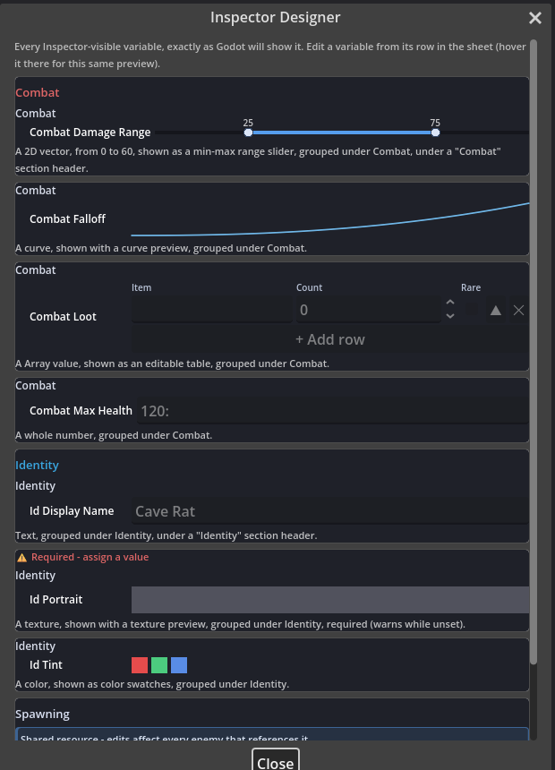
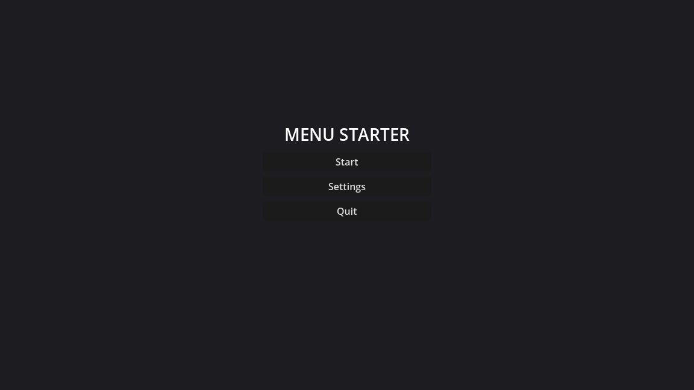

# Godot EventSheets

**Visual event sheets for Godot 4 that compile to plain, readable GDScript.**

The point is **speed-to-game**: whether you've never written code, want logic to pour out faster, or you're mid-jam - events get you from idea to *playing it* in minutes, and keep up when the project balloons to thousands of events.

> [!NOTE]
> **Early.** Every feature ships with tests (4,700+ CI-gated assertions, byte-exact round-trip gates, performance-parity contracts), but the project hasn't yet earned real-world mileage and may see sweeping changes between releases. Pin a release tag and report what you hit - issues are read and acted on.

Godot EventSheets (engine codename *EventForge*, the prefix on internal class names) brings the C3 event-sheet workflow into the Godot editor: a fast visual editor where events read like sentences, and a compiler that turns every sheet into **typed, idiomatic GDScript** - no runtime interpreter, no plugin dependency in your exported game, and **zero performance difference from hand-written code** (a tested contract).


## What it compiles to

A sheet isn't interpreted - it **compiles to a plain `.gd` script** you attach and ship. Rows like:

- **On Ready** → *Print* `"Spawned"`
- **Every tick** · *Is action pressed* `"ui_right"` → *Move by* `Vector2(speed * delta, 0)`
- **On Body Entered** *(body)* · *body is in group* `"enemy"` → *Add* `-10` *to health*

become exactly this - typed GDScript with zero references to the plugin:

```gdscript
extends CharacterBody2D

@export var speed: float = 200.0
@export var health: int = 100

func _ready() -> void:
	print("Spawned")

func _process(delta: float) -> void:
	if Input.is_action_pressed(&"ui_right"):
		position += Vector2(speed * delta, 0)

func _on_body_entered(body: Node) -> void:
	if body.is_in_group("enemy"):
		health += -10
```

Delete the plugin and this script still runs. The reverse works too: **open *any* `.gd` as a sheet** - the round-trip is lossless and byte-identical, so you edit visually or in Godot's script editor with the two in sync.

## Quick start

1. Copy `addons/eventforge/` and `addons/eventsheet/` into your Godot **4.5+** project (tested through **4.7 stable**). Optional: `eventsheet_addons/` for the 37 behavior packs. Removal is clean - see [uninstall](docs/GUIDE-UNINSTALL.md).
2. **Project Settings → Plugins** → enable **Godot EventSheets**.
3. Open the **EventSheet** tab in the main editor strip (next to 2D/3D/Script).
4. **New… → Platformer Starter**, add events (live search understands C3 phrases like *"every tick"*), and Run.

Coming from Construct? The [C3 migration guide](docs/GUIDE-C3-MIGRATION.md) maps every concept, behavior, and plugin to its home here. Extending the plugin? The [Custom ACEs guide](docs/GUIDE-CUSTOM-ACES.md) and [Custom Blocks guide](docs/GUIDE-CUSTOM-BLOCKS.md) cover both extension surfaces. Learning by building? The [recipes](docs/GUIDE-RECIPES.md) walk a platformer, health, pickups, and debugging end to end. Existing project? [Using EventSheets with your code](docs/GUIDE-USING-WITH-EXISTING-CODE.md) shows how sheets call (and are called by) your GDScript.

## Why event sheets in Godot? (honest pros & cons)

**Pros**

- **You ship GDScript, not a black box.** Delete the plugin and your game still runs. Performance parity is a permanent, test-enforced contract.
- **It teaches Godot while you use it.** Every action's tooltip shows the GDScript it generates; ƒx expressions *are* GDScript with live validation; the GDScript panel maps every row to its lines and back.
- **Debug it like any GDScript.** Output is plain code - real breakpoints, step through the generated `.gd`. F9 conditional breakpoints and a paused-at-row jump work from the sheet; Live Values / Event Trace are optional on top.
- **A sheet is just `.gd`.** No `.tres`. Open any `.gd` as a sheet, edit it either way, paste GDScript and it converts to events, call sheet-built classes from regular code.
- **C3 muscle memory works.** The grammar, the picker, behaviors-as-components, and the System/Keyboard/Mouse/Gamepad/Touch/Audio vocabularies are all designed against C3 conventions on purpose.
- **Scales.** A custom-drawn virtualized viewport keeps 10,000+ rows fluid with no per-row widgets.

**Cons**

- **It's a bridge, not a wall.** Complex logic eventually pulls you toward GDScript by design. Code-free authoring and the Helpers ACE set narrow the gap, but to *never* see code, C3 still hides it better.
- **2D-first.** Most packs target 2D; the 3D side has the Node3D/CharacterBody3D/Camera3D vocabularies, raycast/world-query ACEs, First/Third-Person starters, and Sine/Orbit/Bullet/Move To/Line of Sight 3D packs - deeper 3D still reaches for ƒx.
- **Some C3 plugins have no equivalent** (Multiplayer, Drawing Canvas, XML) - routed to the native Godot feature.
- **Experimental.** A large CI suite stands in for mileage it hasn't earned.

## Feature tour

**The editor** - Two-lane condition/action rows, object icons + labels, flat cells, drag/drop with insertion arrows, groups, colored BBCode comments, inline colour-swatch picking, drag-a-node-onto-a-param, multi-select, copy/paste, full undo/redo. **Find & Replace (Ctrl+F)**, script-editor shortcuts (F9 breakpoints, Ctrl+/ toggle, Alt+↑↓ move), a **Command Palette (Ctrl+P)**, **Simple Mode**, multi-view (split/detached/linked), themeable down to every token (Dracula, Nord, Gruvbox, Monokai, Solarized, Catppuccin, + a Godot-adaptive default).


**The language** - Events, sub-events, Else/Else-If, the **full C3 loop & picking set** (For / For Each / ordered / Repeat / While; pick by comparison, highest/lowest, nearest, nth, random), **functions** (typed params + custom return types, publishable as ACEs), stateful conditions (Every X Seconds), enums, signals, match rows, collection & combo variables, **Inspector-grouped `@export` variables** (drag one onto another for a folder, again for a subgroup), **every Godot inspector option** (range modifiers, flags, layer grids, file/folder pickers, node-path filters, password/expression/link, storage - chosen in plain language with a live "Ships as:" annotation strip), a **visually-designed Inspector** (a live editable view of every exported variable, eight drawers including min-max range sliders and editable tables, plus decor / required / inline-validation / field-button markers), GDScript blocks, includes, Wait / Wait For Signal (`await`), Autoload sheets, and a **Custom Block API** - register your own non-ACE row kinds (preloads, region markers, notes, pack-defined data blocks) with a 30-line script; each gets Add-menu + dialog UX and byte-exact round-trips automatically.

**450+ native ACEs** - Tween, Scene flow, Audio, sprites & cameras, Nav, Math & Random, Color, 2D/3D raycast & Collision queries, Nodes, Project/File utilities, runtime signal wiring, UI/menu, particles, AnimationTree, tilemaps, shaders, physics joints, input rebinding, and a **Helpers** escape hatch (Set/Get Property, Call Method, Run GDScript, Inline If) so unmapped code still stays an editable row.

**37 behavior packs**, all authored as event sheets - Platformer, 8-Direction, Timer, Flash, State Machine, Sine/Orbit/Bullet/Move To/Follow/Car/Tile Movement, Line of Sight (2D & 3D), a 3D quartet, Spring, Tween, Save System, plus C3-addon ports: Drag & Drop, Virtual Cursor, Health (absorption + shield pools), Weapon Kit, HTN Agent, Simple Abilities, a Juice pack (screenshake/zoom/squash/slowmo/hitstop), a Time Slicer, a Run In Background runner, a **Currency Ledger** economy (register currencies by name, then earn/spend/cap/format from any sheet), a **Loot Table** roller (weighted drops, guarantees, hard pity, nested tables, seeded), a **Storylet Weaver** (quality-based narrative: define storylets with requirements, then Draw the best eligible one), and the UI trio: a **HUD Kit** (menus and HUDs by name, zero wiring), **Scene Flow** (fades and scene changes), and a **Dialogue Kit** (typewriter conversations). Drop a `class_name` script in `eventsheet_addons/` and it becomes a provider - `@ace_*` annotations shape everything.

**Abstraction that grows with you** - a row earns its place when it does MORE than a line: multi-line ACEs show a quiet **→N** ("compiles to N lines") cue, function calls read as **ƒ named verbs**, and the picker **leads with featured intention verbs** (Wait, Play Sound, Destroy, Move Toward...). Select actions and **Extract to Function** turns the pile into one reusable verb - captured locals become typed parameters automatically - then **Teach a Verb** publishes it to every sheet's picker in the project, node-targeted and retargetable, exactly like a built-in behavior.

**Tooling** - A searchable node picker, export integrity + compile-on-save, git-`textconv` sheet diffs, a **Project Doctor** (dock/CLI/CI drift audit, extensible by packs), error→row deep-linking, live debugging (Live Values, Watch box, conditional breakpoints, Event Trace), a committed vocabulary doc, sheet backups, shareable snippets, a public **`EventSheets` API** for building plugins on top ([guide](docs/GUIDE-BUILDING-ON-EVENTSHEETS.md)), and an opt-in MCP server for external tooling.

## Current status

The latest release, **`v0.12.0` - "The Inspector Designer Update"**, makes the whole Godot Inspector something you design visually, right from the sheet:

- **Design the Inspector as a live, editable view** - a Sheet-menu dialog lays out every exported variable as a stacked preview card exactly as Godot will show it; edit a variable in place or reorder fields without leaving the picture. Hover any exported variable row and the same preview floats up as a tooltip.

  

- **Eight rich drawers**, all authored from the Variable dialog with no code and all round-tripping to plain `@export` GDScript: min-max **range sliders** (one handle per bound), an **editable table** (an `Array` becomes an add/remove/reorder grid), **toggle-button rows** (a `String` picks from buttons), plus the progress bar, direction dial, colour swatch, texture thumbnail, and inline curve.
- **Decor and guard rails from plain comments** - accent **section headers**, **info-note** panels, a **required** badge that lights when a field is empty, **inline validation** (a warning under a field), and **inline field buttons** (run a method from the Inspector). Every marker is a comment the importer reads back, so none of it costs you the byte-exact round-trip.
- **A Custom Resource showcase** - `EnemyStats` puts the drawers, decor, required fields, and a loot table together as one designer-tunable resource, and the Custom Block + `EventSheets` APIs gained the matching hooks (`build_inspector_preview`, `describe_inspector`, `variable_code`, block `hover_text`).
- **The UI trio of packs** - a **HUD Kit** (menus and HUDs addressed by name, buttons auto-wired, zero systems code), **Scene Flow** (scene changes behind a polished fade), and a **Dialogue Kit** (typewriter conversations), shipping alongside a ready-to-edit **Menu Starter** scene.

  

- **Born where you already right-click** - the FileSystem dock's native **Create New ▸ Event Sheet…** mints a new `.gd` sheet (Blank or a starter) straight into the clicked folder, and **2D overlap queries** ("what is HERE right now") land point / circle / rect checks without an Area2D.
- **A faster, lighter load** - the workspace editor is now built lazily on first use, so enabling the plugin (or a project that never opens a sheet) skips the whole dock construction at editor startup; the tab still appears instantly.

**Quality** - 4,700+ assertions, all green, CI-gated on every push; byte-exact golden round-trips guard the lossless rules. **Verified on Godot 4.7 stable.** Generated code never depends on the plugin, templates bake at apply-time, and output is performance-identical to hand-written GDScript - all test-enforced.

_Recent releases before this:_ **v0.11.0** (collapsible regions, the abstraction levers, localisation, any-node reflection, the public `EventSheets` API) and **v0.10.0** (the ACE Studio, per-function shell-lift, the Anatomy panel, the Custom Block API). The milestones table below and [CHANGELOG.md](CHANGELOG.md) have the full history.

## Milestones

| Milestone | Status |
|---|---|
| `v0.1` to `v0.5` - editor + compiler + lossless pairing, rich variables, C3 coverage, 3D vocabulary, breakpoints, Audio, node picker | ✅ shipped |
| `v0.6` - Inspector attributes, addon composition + policy, Live Values, Singleton sheets, Spring/Tween/Save packs; `.6.1`/`.6.2` maintenance + project usability (compile-on-save, diffs, Doctor) | ✅ shipped |
| `v0.7` - **The Native Workflow Update**: Rename Everywhere, snippets, bulk ops, Godot-native entry points, if/elif/else reverse-lift | ✅ shipped |
| `v0.8` - **The Team & Scale Update**: Godot 4.7 + Modern theme, merge driver, Find References, includes manager, new packs + 3D raycast, opt-in MCP | ✅ shipped |
| `v0.9.0` - **Performance & Game Feel**: frame-spreading, Juice pack, code-free authoring, first-class UI/raycast/particles/tilemaps/shaders, ACE safety audit | ✅ shipped |
| `v0.9.5` - **Code-Free Authoring & First-Class Variables**: `.gd`-default sheets, zero-block packs, `@export` variables + drawers, addon-author loop | ✅ shipped |
| `v0.10.0` - **The In-Sheet Authoring Update**: ACE Studio, per-function shell-lift (mid-file + custom-return helpers anchored in place), Anatomy panel, Ghost Row / Param Hop / bulk retune, error→row + paused-at-row, sheet diff, variable folders + subgroups, the Custom Block API, script-intent UX (custom resources + editor tools), full inspector-export coverage | ✅ shipped |
| `v0.11.0` - **The Structure & Vocabulary Update**: collapsible colored regions, Look Gallery + Inspector preview, localisation vocabulary, any-node reflection, terse providers (all 31 packs migrated + audit-gated), the abstraction levers (Extract/Teach/featured/compression cue), the public `EventSheets` API | ✅ shipped |
| `v0.12.0` - **The Inspector Designer Update**: the whole Inspector designed visually (a live editable view), 8 drawers (min-max sliders, editable tables, toggle buttons), decor + required + inline validation + field buttons, the EnemyStats Custom Resource showcase, the HUD Kit / Scene Flow / Dialogue Kit packs + Menu Starter scene, 2D overlap queries, FileSystem **Create New ▸ Event Sheet**, and a lazily-built (faster-loading) editor | ✅ shipped |
| _Roadmap_ - community feedback, polish, and whatever you ask for next | 🗺 planned |

## Project layout

| Path | What it is |
|---|---|
| `addons/eventforge/` | Data model, compiler, importer, builtin ACEs, runtime bridge |
| `addons/eventsheet/` | The editor: dock, virtualized viewport, renderer, picker, themes, lint, MCP server |
| `eventsheet_addons/` | Zero-config ACE addons + the 37 behavior packs |
| `demo/` | Demo sheets, themes, and golden compiled output |
| `tests/` | Headless suite - `run_tests.gd` (full) and `run_perf.gd` (fast gate) |
| `docs/` | Contract specs + guides (C3 migration, recipes, MCP, glossary, uninstall) |

## Verifying a change

```text
godot --headless --path . --script tests/run_perf.gd     # fast, headless-safe suite
godot --headless --path . --script tests/run_tests.gd    # full suite
```

Every feature lands with tests, a CHANGELOG entry, and its spec updated - see `docs/internal/SPEC-gdscript-pairing.md` for authoritative status. Pushes and PRs run the headless suite; pushing a `v*` tag stamps `plugin.cfg` and publishes a GitHub Release.

## Contributing & license

[CONTRIBUTING.md](CONTRIBUTING.md) has the dev setup, the compatibility covenant, and how to add ACEs, addons, packs, and themes. The project improves fastest through real-world reports - [open an issue](../../issues/new/choose) if something breaks or a C3 workflow feels wrong. MIT licensed (`LICENSE`).

## 🙏 Acknowledgments

This plugin stands on the shoulders of the tools that made visual, code-optional game logic mainstream:

- **[Construct](https://www.construct.net/)** - the direct inspiration. The event-sheet grammar, the ACE (Action / Condition / Expression) model, the picker, and behaviors-as-components are all designed against Construct 3's conventions on purpose, so C3 muscle memory carries over.
- **[Clickteam Fusion 2.5](https://www.clickteam.com/clickteam-fusion-2-5)** - a foundational event-editor whose event-grid lineage shaped the whole "events read like sentences" idea.
- **[Scratch](https://scratch.mit.edu/)** - for proving that visual, block-based programming is a real on-ramp to building software, not a toy.
- **[Godot Engine](https://godotengine.org/)** - the open-source engine this is built on and for; every sheet compiles to plain, idiomatic GDScript that runs with zero dependency on this plugin.

These are independent projects and trademarks of their respective owners; this plugin is not affiliated with or endorsed by any of them.
