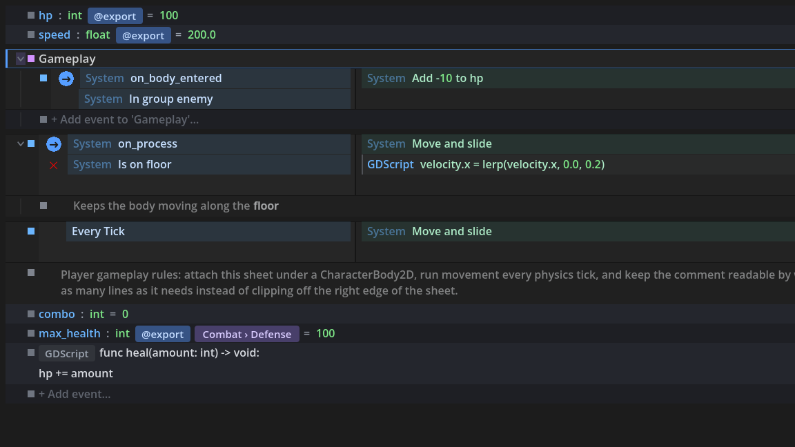
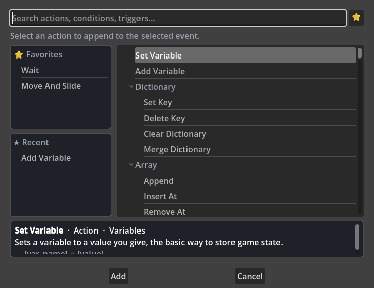

# Godot EventSheets

**Visual event sheets for Godot 4 that compile to plain, readable GDScript.**

**The point is speed-to-game.** Whether you've never written a line of code, you're an
experienced dev who wants game logic to pour out faster, or you're 6 hours into a 48-hour
jam — events get you from idea to *playing it* in minutes, and the tool keeps up when the
project balloons to thousands of events.

> [!WARNING]
> **Purely experimental — early, vibecoded, and not yet validated.** This plugin is an
> experiment, not a production tool: it has been built almost entirely through
> AI-assisted ("vibe") coding. The test suite is large (3,400+ CI-gated assertions)
> and every feature ships with regression tests, but the project has **not yet been
> validated by real-world use**. It is **very early in development** and **subject to
> large, sweeping changes** between releases — do not build anything you can't afford
> to rework on it yet. Pin a release tag if you experiment with it, expect rough
> edges, and please report what you hit.

Godot EventSheets (engine codename *EventForge* — you'll see that prefix on internal
class names) brings the event-sheet workflow C3 users love into the Godot editor: a fast
visual editor where events read like sentences, and a compiler that turns every sheet
into **typed, idiomatic GDScript** — no runtime interpreter, no plugin dependency in your
exported game, and **zero performance difference from hand-written code** (a guarded,
tested contract).





```text
Conditions                        | Actions
----------------------------------+--------------------------------
▶ Every tick                      |
   [icon] System  Is on floor     | [icon] System  Queue free
								  | GDScript  health -= 1
```

## What it compiles to

That sheet isn't interpreted at runtime — it **compiles to a plain `.gd` script** you attach and ship.
A handful of rows like:

- **On Ready** → *Print* `"Spawned"`
- **Every tick** · *Is action pressed* `"ui_right"` → *Move by* `Vector2(speed * delta, 0)`
- **On Body Entered** *(body)* · *body is in group* `"enemy"` → *Add* `-10` *to health*

become exactly this — typed, idiomatic GDScript with zero references to the plugin:

```gdscript
extends CharacterBody2D

@export var speed: float = 200.0
@export var health: int = 100

func _ready() -> void:
	print("Spawned")

func _process(delta: float) -> void:
	if Input.is_action_pressed(&"ui_right"):
		position += Vector2(speed * delta, 0)

func _on_body_entered(body: Node) -> void:
	if body.is_in_group("enemy"):
		health += -10
```

Delete the plugin and this script still runs — see [`demo/sheets/player_generated.gd`](demo/sheets/player_generated.gd)
for a full, regenerated example.

## Quick start

1. Copy `addons/eventforge/` and `addons/eventsheet/` into your Godot **4.5+** project
   (tested through **Godot 4.7 stable**; 4.6+ recommended for the native "Modern" theme look).
   Optional: `eventsheet_addons/` for the 31 behavior packs and demo ACEs. Removing the
   plugin later is clean and reversible — see the [uninstall guide](docs/UNINSTALL.md).
2. **Project → Project Settings → Plugins** → enable **Godot EventSheets**.
3. Open the **EventSheet** tab in the main editor strip (next to 2D/3D/Script).
4. **New…** → *Platformer Starter*. A sheet is just a plain **`.gd` file** by default (no
   `.tres` needed) — add events (live search understands C3 phrases like *"every tick"* or
   *"go to layout"*) and Run. Prefer code? **Open in Godot** edits the same `.gd` in Godot's
   own script editor, and the visual sheet and the code stay in sync.
5. Coming from Construct? Read the [C3 migration guide](docs/C3-MIGRATION-GUIDE.md) —
   it maps every C3 concept, behavior, and plugin to its home here.
6. Learning by building? The [recipes](docs/RECIPES.md) walk through a platformer, health,
   pickups, and debugging end to end; the [glossary](docs/GLOSSARY.md) is a one-page C3 ↔ Godot
   ↔ EventSheets Rosetta Stone.
7. Already have a Godot project? [Using EventSheets with your existing code](docs/USING-WITH-EXISTING-CODE.md)
   shows how sheets call (and are called by) the GDScript, autoloads, nodes, and signals you already have —
   no ACEs required.

## Why event sheets in Godot? (the honest pros & cons)

**Pros**

- **You ship GDScript, not a black box.** Delete the plugin and your game still runs —
  generated scripts are plain code with no runtime hooks ([clean-removal guide](docs/UNINSTALL.md),
  gated by `clean_removal_test`). Performance parity with hand-written GDScript is a
  permanent, test-enforced contract.
- **It teaches Godot while you use it.** Every action's tooltip shows the GDScript it
  generates; ƒx expressions *are* GDScript with live validation and autocomplete; the
  GDScript panel maps every row to its generated lines (and back).
- **Debug it like any GDScript.** Because the output is plain code, you set breakpoints and step
  through the generated `.gd` in Godot's own debugger — no bespoke runtime to learn. F9 conditional
  breakpoints work from the sheet, and the in-editor Live Values / Event Trace are an optional
  convenience layered on top, not the only way in.
- **A sheet is just `.gd` — no `.tres` needed.** New sheets save as plain GDScript by default;
  open *any* `.gd` as a sheet (lossless, byte-identical round-trips), edit it visually **or**
  directly in Godot's own script editor (**Open in Godot**) with the two kept in sync, paste
  GDScript and it converts to events, and write GDScript that calls sheet-built classes like any
  other class.
- **C3 muscle memory works.** The grammar, the picker, behaviors-as-components, combos,
  waits, press-a-key capture, the 31-pack addon set (including ports of custom C3 addons —
  Virtual Cursor, an event-driven Drag & Drop, a Health pack with absorption + shield
  pools, a Weapon Kit, and a utility-driven HTN planner), System/Keyboard/Mouse/Gamepad/
  Touch/Audio vocabularies — designed against C3 conventions on purpose.
- **Scales.** The custom-drawn virtualized viewport keeps 10,000+ rows fluid (no
  per-row widgets — a measured ~490 ms build for a 10k sheet, 8-row draw window).

**Cons (knowing them is part of trusting the tool)**

- **It's a bridge, not a wall.** Complex logic will eventually pull you toward writing
  GDScript directly — by design. **Code-free authoring** narrows that gap (a visual
  expression builder, reflection-driven Call Method / Set/Get Property pickers, a visual
  Array/Dictionary editor, promote-a-block-to-a-Function), and the **Helpers** ACE set
  softens the rest (Run GDScript, ternary, is-valid, connect signal, math/string idioms keep
  more logic as rows) — but if you want to *never* see code at all, C3 itself is still better
  at hiding it.
- **2D-first, but 3D is catching up.** Most behavior packs target 2D; the 3D side has the
  Node3D/CharacterBody3D/RigidBody3D/Camera3D vocabularies, **raycast / world-query ACEs**,
  First-Person & Third-Person starter templates, and the Sine/Orbit/Bullet/Move To/Line of
  Sight 3D packs — deeper 3D still reaches for ƒx/GDScript blocks.
- **Some C3 plugins intentionally have no equivalent** (Multiplayer, Drawing Canvas,
  XML): the migration guide points to the native Godot feature instead — that honesty
  keeps the project maintainable.
- **Purely experimental, vibecoded project.** Built AI-first with a large CI-gated suite (3,400+
  assertions) standing in for mileage it hasn't earned yet — real-world validation is
  still ahead, and large sweeping changes between releases are likely (see the warning
  up top).

### Scope — what's first-class, and what isn't (yet)

EventSheets covers **game logic** as first-class visual events: control flow, variables,
functions, signals, loops/picking, timers, movement & AI behaviors, audio, save/load,
scene flow, and the full math/string/array/dictionary/vector toolkit — all compiling to
clean typed GDScript. A few engine subsystems are deliberately **not** first-class event
vocabulary yet, and lean on Helper ACEs / GDScript blocks instead:

- **Now first-class (recently landed):** a **UI / menu** vocabulary (Button On Pressed /
  Toggled triggers + focus navigation), **particles**, **AnimationTree**, **tilemap** cell
  editing, **2D raycast** queries, **shader materials**, **physics joints**, **runtime input
  rebinding**, and a **Collision** query set (CharacterBody / Area / CollisionObject).
- **Still on the roadmap (escape-hatch for now):** 2D **point / shape overlap** queries
  (raycast is done), **dialogue / cutscene** systems, and scene-**transition** helpers.
- **Intentional non-goals** — routed to native Godot, not reimplemented: **networking /
  multiplayer** and **localization (i18n)**. The [C3 migration guide](docs/C3-MIGRATION-GUIDE.md)
  maps each to its native feature.

The sweet spot is logic-heavy 2D action / arcade / puzzle / RPG games; anything the
vocabulary doesn't cover is always reachable through the `ƒx`/GDScript escape hatch (and
still ships as plain GDScript).

## Feature tour

### The editor (C3-parity UX on a virtualized canvas)
- Two-lane condition/action rows, object icons + labels, flat cells, whole-cell click
  targets, drag/drop with insertion arrows, groups (with descriptions), comments
  (multiline, colored), **click-to-pick colour swatches** on Color params (opens an inline
  `ColorPicker` right on the cell — no dialog), **drag a Scene-dock node onto a param value**
  to fill it with the node's `%reference`, multi-select (box / Ctrl /
  Shift-range), copy/paste,
  enable/disable with strikethrough, full undo/redo.
- **Find & Replace (Ctrl+F)** — one undoable Replace All across comments, params,
  blocks and pick filters; script-editor shortcuts (**F9 real breakpoints** that pause
  the Godot debugger in debug compiles, **Ctrl+/** to toggle rows, Alt+Up/Down to move
  rows), slow-double-click rename, quick-add bar ("type to insert" with C3 synonyms),
  **BBCode** (`[b]`/`[i]`/`[color]`) in comments, **condition/action cell text, and hover
  descriptions**, **plain-language hover descriptions** on every ACE & function, per-ACE notes, **starter templates**
  (Platformer / Top-down / First-Person 3D / Third-Person 3D), a **Command Palette
  (Ctrl+P)**, a **Simple Mode** that hides advanced rows *and the advanced picker entries*
  (Run GDScript / Evaluate / Breakpoint / Assert) for newcomers, and multi-view
  (split / detached / linked panes).
- **Theming**: every color/metric is a token; bundled presets include **Dracula, Nord,
  Gruvbox Dark, Monokai, Solarized Light, Catppuccin Mocha**, plus a Godot-adaptive
  default derived from *your* editor theme. A live visual theme editor is built in, with a
  **Quick Style** mode that re-skins the whole sheet from a base + accent colour (no
  token-by-token tuning) and per-token fine-tuning below.
- Guardrails everywhere: invalid names auto-correct or block, broken GDScript never
  commits, renaming a variable refactors every reference (blocks, params, pick filters,
  templates) automatically.

### The language (GDScript constructs as first-class rows)
- Events, sub-events, Else/Else-If, **the full C3 loop & picking set** (For / For Each
  / ordered / Repeat / While; pick by comparison, highest/lowest, nearest, nth, random —
  all plain for/while loops), **functions** (params + **return types**, publishable as
  ACEs), **stateful conditions** (Every X Seconds via baked private members),
  **enums** (Inspector dropdowns for
  free), **signals** (declared as rows, validated connections), **match rows** (C3's
  switch), **collection variables** (`Array[int]`, `Dictionary[String, int]`, literal
  defaults with live validation), **combo variables** (`@export_enum` dropdowns),
  **Inspector-grouped `@export` variables** (`@export_group` / `@export_subgroup`, badged +
  "Group › Subgroup"-chipped on the row, lossless and editable across a `.gd` reopen),
  GDScript blocks (class-level and in-flow), local variables, includes (C3-style
  library sheets), **Wait / Wait For Signal** (`await`), and **Autoload (Singleton)
  sheets** — Game State / Event Bus / Save System built as sheets, registered
  project-wide in one click, their functions callable from everywhere.
- **Input vocabulary**: InputMap actions with dropdowns, plus **Keyboard / Mouse /
  Gamepad / Touch** groups — key params capture with C3's *press-a-key* workflow.
- **450+ native ACEs**: Tween (ease/transition combos, plus inline **Tween Callback**),
  Scene flow (multi-line **Spawn Scene At / (Full)** — position + rotation + group tag),
  **Audio** (fire-and-forget one-shots, player control, bus mixing — with ▶ sound preview
  in the dialog), AnimatedSprite2D, Camera2D (incl. limits), Label (incl. **Set Text
  formatted**), NavigationAgent2D, time scale & window control, the C3 System text
  functions, shader params, date/time/platform info, **Math & Random** (`choose()`, lerp /
  clamp / snapped, angle / rotate-toward, seeded RNG), **Color** (lighten / darken / lerp /
  HSV / alpha), **3D raycast / world-query** ACEs, **Collision** (CharacterBody/Area/
  CollisionObject layer/mask queries, shape enable/disable), **Dev helpers** (Debug
  print/assert, scene-tree Groups, node Metadata), **Nodes** (navigation — parent / child /
  find — plus manipulation + picking: add / remove / move child, free, duplicate, rename,
  find children, nodes-in-group), **Project utilities** (config-file settings, window /
  screen / clipboard, performance monitors, time formatting), **File management** (read /
  write / append text, file size / exists, copy / move / delete, plus make / remove / list
  directories — null-safe reads, guarded writes), runtime **signal wiring**
  (connect / disconnect / emit-on / is-connected), and a **Helpers** set — the structured
  escape hatch (Set/Get Property, Call Method, Run GDScript, Inline If, Is Valid, and the
  math/string idioms) so code that doesn't map to a specific ACE still stays an editable row.

### Behaviors & addons (zero configuration, no JSON)
- **31 addon packs**, all authored as event sheets: the C3 classics (**Platformer** —
  coyote time, jump buffering, variable jump height, double jump, wall slide + wall jump,
  accel/decel — 8-Direction, Timer, Flash, State Machine, Sine with wave shapes, Orbit,
  Bullet, Move To, Follow, Car, Tile Movement, Line of Sight **2D & 3D**), a 3D quartet
  (Sine/Orbit/Bullet/Move To), the motion duo (**Spring** — named numeric **and colour**
  springs, squash & stretch in one action — and **Tween** with Inspector combos), the
  **Save System** singleton, and five ports of custom C3 addons: an **event-driven
  Drag & Drop** (Start/Set Drag Point/Drop with follow-speed, direction lock, throw and
  snapping), a **Virtual Cursor** that can drive it for gamepad/touch, a **Health**
  pack (current/max HP, damage absorption, named **Health Pools** = decaying shields,
  death/revive), a **Weapon Kit** (ammo + reserve, fire-rate cooldown, single/auto/
  burst modes, timed + instant reload — Fire triggers, you spawn the bullet), and an
  **HTN Agent** (utility-driven Hierarchical Task Network: world-state blackboard +
  primitive/compound tasks whose methods carry preconditions, subtasks and a utility score), and a
  **Simple Abilities** manager (grant abilities by id, cooldowns, stack charges that auto-regen,
  temporary auto-expiring abilities, custom data, and tags for bulk ops — ported from the C3 addon
  with Godot extras: a Current Ability ID expression, a global cooldown multiplier, and a Ready
  Abilities list), and a **Juice** pack (trauma-based **screenshake**, smooth **zoom** by percent
  and zoom-onto-a-world-point, and volume-preserving **squash & stretch** — the camera is auto-found
  from the active viewport, so Shake/Zoom work from anywhere with no wiring), and a **Time Slicer**
  (a managed work queue that drains within a per-frame ms/count budget — enqueue heavy work, react to
  *On Process Item*, and it spreads across frames instead of hitching the game), and a **Run In
  Background** runner (hands a pure function to a worker thread and fires *On Done* with the result —
  for compute too heavy to even spread across frames).
- **Custom ACE addons**: drop a script in `res://eventsheet_addons/` — `class_name` is
  the provider, `@ace_*` annotations shape everything (`@ace_param_options` for fixed
  combos, `@ace_param_autocomplete` for an editable type-or-pick combo, `@ace_param_hint`
  for ƒx/color/signal pickers). Annotated signals become triggers. **Sheet ▸ New Behaviour
  Addon…** scaffolds a richly-commented skeleton that teaches these annotations by example;
  **`## @ace_deprecated("…")`** retires an ACE without breaking old sheets (keeps compiling,
  hidden from the picker, flagged on hover with its replacement). Full how-to (all three
  authoring paths, the template language, schema + widget tables, testing): the
  [Custom ACEs guide](docs/CUSTOM-ACES-GUIDE.md).
- **Export Addon…** turns the current behavior sheet into a published pack folder with
  one click. Custom node types (`class_name` + `@icon`) appear in Godot's Create Node
  dialog.

### Tooling
- **Scripting & automation API** (pure-GDScript MCP server): drive the plugin from
  external tools or AI assistants — list/read/compile/lint sheets and apply snippets,
  policy-bound and opt-in (toggle live in **View ▸ MCP Server**) — `docs/MCP-SERVER.md`.
- **Searchable node picker** on every expression param: filter the scene by name, class,
  `group:`, or `script:`, search *other* scenes with `scene:`, pin recents, and audit
  every node reference the sheet makes (missing ones flag red).
- **Export integrity**: every sheet recompiles when an export starts; stale scripts
  can never ship — and **compile-on-save** keeps F5 just as safe during development.
- **Reviewable sheet diffs**: a one-line git `textconv` setup makes `.tres` PRs show
  readable events instead of serialized-resource noise.
- **Project Doctor**: one audit (dock / CLI / CI) for cross-file drift — stale outputs,
  unregistered autoloads, unused vocabulary, unattached scripts.
- **Error → row deep-linking**: a bad ƒx expression or GDScript block flags the *offending
  row* (red marker + the reason in its tooltip) and the editor jumps to it — on save and via
  **Tools ▸ Check Sheet for Errors** — instead of a status-bar line you have to hunt down.
- **Live debugging**: editable **Live Values**, a **Watch** box (any expression over your
  variables, evaluated live), conditional **breakpoints**, and **Event Trace** — the rows whose
  events fire during a debug run highlight in real time, so "is this even running?" is obvious.
- **Vocabulary doc**: a generated, committed reference of everything your sheets and
  packs publish ([this repo's own](EVENTSHEETS-VOCABULARY.md) is the living example).
- **Sheet backups** (save-time ring + restore) and **project-local templates**
  (drop a sheet in `eventsheet_templates/`, it joins the New… menu).
- Shareable text snippets (paste events into another project or a forum post).

## Current status

- **Unreleased (since `v0.9.0`)** — **first-class variables, addon authoring & cell legibility.**
  **Variables** gained Inspector attributes that round-trip losslessly: an **`@export` badge** on the row,
  **`@export_group` / `@export_subgroup`** grouping (with "Group › Subgroup" chips) that now **survives
  reopening a `.gd` and stays editable** (the importer absorbs the group lines back onto the variable, gated
  by the verify-lift rule). **Authoring custom addons** got a UX pass — a **"New Behaviour Addon…"** scaffold
  that writes a richly-commented skeleton teaching the `@ace_*` vocabulary, **plain-language descriptions on
  hover for every built-in ACE** (authored *inline*, in the files, so behaviour packs are self-contained),
  and **ACE deprecation** (a Construct-style covenant: a deprecated ACE keeps compiling, is hidden from the
  picker, flagged on hover with its replacement, and warned at compile). **Cell legibility** — **BBCode**
  (`[b]`/`[i]`/`[color]`) now renders in condition/action cell text *and* hover descriptions (comments
  already did), an **inline colour picker** opens straight from the cell colour swatch (no dialog),
  **dragging a Scene-dock node onto a param value** fills it with the node's **`%reference`**
  (deep-node-friendly, prefers scene-unique `%Name`), and the confusing variable scope pill was removed. See
  [CHANGELOG.md](CHANGELOG.md).
- **Version**: **`v0.9.0` — “Performance & Game Feel”**: making games that **scale** and
  **feel good**. **Frame-spreading & time-budgeting** — a **Time Slicer** behavior (a managed work
  queue that drains within a per-frame ms/count budget — enqueue, react to *On Process Item*, no loop
  or `await`), an in-place **Budgeted For Each** (tick a budget on a loop and it spreads itself across
  frames), raw budget/coroutine ACEs, a **Run In Background** pack (off-thread pure compute via
  `WorkerThreadPool` → *On Done*), and a Project Doctor unbounded-loop advisory — with a runnable
  **Swarm** demo you can *watch* the spreading in. **Game feel** — a **Juice** pack: trauma
  **screenshake**, smooth/anchored **zoom**, volume-preserving **squash & stretch** (tween + spring),
  and **slow-mo** with easing, all auto-finding the camera. **AI/combat** — **Nearest/Furthest** picking
  that composes with **Line of Sight** for see-it-first auto-attack. **Adoption** — a self-contained
  *“Using EventSheets with your existing code”* guide: call your GDScript / autoloads / signals from
  sheets (and the reverse), no ACEs required. **Fewer errors** — on-save linting now covers For Each
  fields, the Doctor flags coroutines under *On Process*, *On Signal* can carry typed parameters, and
  the Juice pack restores `time_scale` on exit. A pre-release **ACE safety audit** compile-verifies all
  446 built-in ACEs in their host class (new test) and fixed nine runtime-safety bugs (null-derefs, a
  node leak, a wrong-host crash); **For Each** dialogs gained a commit guard (won't save a non-compiling
  loop) plus **ƒx autocomplete** on their Where/Order-by fields — on top of the editor-DX batch (error → row
  deep-linking, a Create-Node-parity **ACE picker**, a live **event-trace**, a shadowing-variable guard)
  and the code-free authoring set. **31 behavior packs.** Playable showcases: `showcase_carousel.tscn`
  (flagship), `starfall.tscn`, `quest_fsm.tscn`, `platformer_shooter.tscn`, and `swarm.tscn`.
  See [CHANGELOG.md](CHANGELOG.md).
- **Quality**: 3,400+ test assertions, all green, CI-gated on every push (any `[FAIL]`
  fails the build, and the Project Doctor gate fails it on sheet/output drift);
  byte-exact golden round-trips guard the lossless rules. **Verified on Godot 4.7 stable**
  (full suite + an in-editor smoke run).
- **Compatibility covenant**: generated code never depends on the plugin; templates bake
  at apply (updates never rewrite your sheets); upgrades can never corrupt a file; and the
  output is **performance-identical to hand-written GDScript** — a test-enforced contract.

## Milestones

| Milestone | Status |
|---|---|
| `v0.1.0` — editor + compiler + lossless GDScript pairing (virtualized viewport, parity contract) | ✅ shipped |
| `v0.2.0` — rich variables, C3 coverage (native ACEs + packs), input/Wait, MCP server, themes | ✅ shipped |
| `v0.3.0` — multi-view (split / detached / linked), tool sheets | ✅ shipped |
| `v0.4.0` — 3D vocabulary, addon tags, hardening sweeps, contributor docs | ✅ shipped |
| `v0.5.0` — C3 System ACEs, full loops & picking, real breakpoints, devices, Audio, node picker | ✅ shipped |
| `v0.6.0` — Inspector attributes (all tiers), addon composition + policy + MCP enforcement, **editable Live Values**, Singleton sheets + event-bus triggers, Spring & Tween & Save System packs, the addon-author loop, the C3-reflex UX arc | ✅ shipped |
| `v0.6.1` — maintenance: dock decomposed into subsystems, module split completed, repo hygiene (no behavior changes) | ✅ shipped |
| `v0.6.2` — project usability: compile-on-save, sheet diffs (textconv), Project Doctor (dock/CLI/CI), vocabulary doc, sheet backups + restore, project templates; C3 param parity completed; per-pack builders; issue templates | ✅ shipped |
| `v0.7.0` — **The Native Workflow Update**: Rename Everywhere, snippets, bulk ops, session restore, asset drops, attach + Run Scene; Godot-native entry points (Scene-dock attach, Inspector button, settings, rebindable shortcuts, go-to-sheet-row, docs links, welcome); if/elif/else reverse-lift + Lift Report | ✅ shipped |
| `v0.8.0` — **The Team & Scale Update**: Godot 4.7 support + Modern-theme visuals & onboarding declutter (Simple Mode, Command Palette, Export-GDScript eject); **team/VCS** — semantic 3-way **merge driver**, symbol-aware **Find References** + Go-to-Definition, **includes manager** + Extract-to-Include + **provenance**, **byte-stable regeneration**; new packs (Drag & Drop, Virtual Cursor, Health, Line of Sight 3D, **Weapon Kit**, utility-driven **HTN Agent** — 26 total) + **C3-addon parity** (Platformer juice, Spring colour springs); **3D raycast/world-query ACEs** + 3D starters; richer Array/Dict/Vector/String **Helper ACEs** + import "why-it-stayed-code" hints; behavior-declared **autocomplete**; theme **Quick Style**; clean-removal guide + gate; platformer-shooter showcase; opt-in MCP scripting/automation (off by default) | ✅ shipped |
| `v0.9.0` — **Performance & Game Feel**: frame-spreading & time-budgeting (**Time Slicer** pack, in-place **Budgeted For Each**, budget/coroutine ACEs, **Run In Background** off-thread pack, Doctor unbounded-loop advisory) + a runnable **Swarm** demo; a **Juice** pack (trauma screenshake, smooth/anchored zoom, squash & stretch tween+spring, **slow-mo** with easing); **Nearest/Furthest** picking (composes with Line of Sight); a self-contained **“using EventSheets with your existing code”** guide; **On Signal** typed parameters; an **error-prevention sweep** (on-save For-Each linting, coroutine-under-On-Process Doctor check, Juice `time_scale` teardown); plus the editor-DX batch — **error → row deep-linking** (jump to + mark the offending row), a **group editor popup** (name + description), a **Create-Node-parity ACE picker** (Favorites/Recent panes + description panel), a **Watch** box + **live event-trace** row highlighting, and a **shadowing-variable guard**; **code-free authoring** (visual expression builder, reflection method/property pickers, Promote-Block-to-Function, visual Array/Dictionary data editor, conditional breakpoints); first-class **UI/menu vocabulary** (Button On Pressed/Toggled + focus navigation), native **2D raycast** ACEs, **particles**, **AnimationTree**, **tilemaps**, **shader materials**, **runtime input rebinding**, **physics joints**, **24 Collision ACEs**, **loop** Break/Continue/Current-Item, **Else/Else-If** authoring + compiled Pick-Filter conditions; **Advanced Random** pack (27th), **ACE sub-categories**, read-only **.gd preview**, an **ACE safety audit** (a compile-coverage test for all 446 built-in ACEs + nine runtime-safety fixes), and **pick-filter authoring** (a commit guard + Where/Order-by ƒx autocomplete) | ✅ shipped |
| _Unreleased (since `v0.9.0`)_ — **first-class variables, authoring & legibility**: variable **`@export` badge** + **`@export_group`/`@export_subgroup`** grouping with **lossless, editable `.gd` round-trip**; **"New Behaviour Addon…"** scaffold + **plain-language descriptions on every built-in ACE** (inline, file-based) + **ACE deprecation** covenant; **BBCode in cell text + hover descriptions**, an **inline cell colour picker**, **drag a Scene node onto a param** (`%Name`-preferring), and removal of the scope pill | 🚧 in progress |
| _Roadmap_ — a Menu/HUD behavior pack + UI starter demo; 2D **point/shape overlap** queries; **scene-transition** + **dialogue** packs; a **loop-index** expression; community feedback rounds | 🗺 planned |

Full feature-by-feature ledger: [CHANGELOG.md](CHANGELOG.md).

## Project layout

| Path | What it is |
|---|---|
| `addons/eventforge/` | Data model, compiler, importer, builtin ACEs, runtime bridge |
| `addons/eventsheet/` | The editor: dock, virtualized viewport, renderer, picker, themes, lint, MCP server |
| `eventsheet_addons/` | Zero-config ACE addons + the 31 behavior packs |
| `demo/` | Demo sheets, themes, and the golden compiled output |
| `tests/` | Headless suite — `tests/run_tests.gd` (full) and `tests/run_perf.gd` (headless-safe gate) |
| `docs/` | Contract specs (GDScript pairing, inspector attributes, addon composition) + guides (C3 migration, recipes, performance, MCP, glossary, uninstall) |

## Verifying a change

```text
godot --headless --path . --script tests/run_perf.gd    # fast, headless-safe suite
godot --headless --path . --script tests/run_tests.gd   # full suite
```

Every feature lands with tests, a CHANGELOG entry, and its spec updated — see
`docs/GDSCRIPT-PAIRING-SPEC.md` for authoritative feature-by-feature status.

## Releases & CI

Pushes and PRs run the headless suite (`.github/workflows/ci.yml`). Pushing a tag like
`v0.2.0` runs the test gate, stamps `plugin.cfg`, and publishes a GitHub Release with
`godot-eventsheets-<v>.zip` (drop-in addons) and `godot-eventsheets-samples-<v>.zip`
(behavior packs + demo project).

## Feedback

This experiment lives or dies by real-world reports. If something breaks or a C3
workflow feels wrong here, [open an issue](../../issues/new/choose) — the bug template
asks for the two things that make fixes fast (your versions + a minimal sheet or text
snippet), and the feature template asks what you're trying to *make*, which is how
this project designs. Permanent non-goals are documented in the
[migration guide](docs/C3-MIGRATION-GUIDE.md) so nobody waits on something that isn't
coming.

## Contributing

[CONTRIBUTING.md](CONTRIBUTING.md) has the dev setup, the verification loop, the house
rules (compatibility covenant, canonical-emission rules, the gotcha list), and how to add
ACEs, addons, behavior packs, and theme presets.

## License

MIT. See `LICENSE`.
