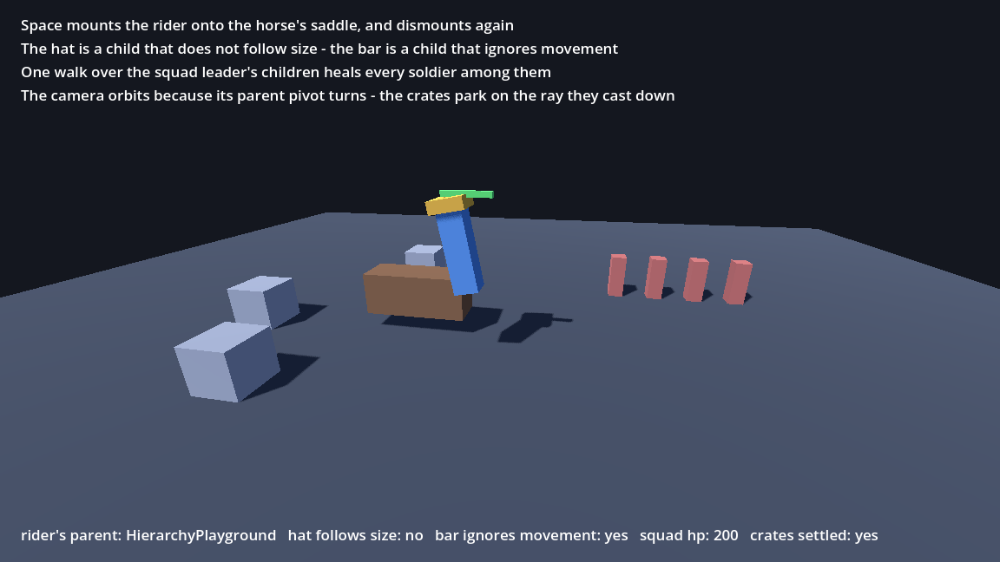

# Godot EventSheets - Demo & Showcase

The fastest way to *feel* what this plugin is: open one sheet, click around, and watch
plain GDScript fall out of it. This folder is the guided tour.

## The 60-second pitch

**If you're coming from another event-sheet editor:** events read exactly like home - two-lane rows,
a searchable picker that understands your vocabulary ("every tick", "go to layout",
"choose"), behaviors that attach to objects, Wait actions, combo dropdowns, color
pickers with swatches. **76 behavior packs** ship in the box - the classics (Platformer,
8-Direction, Sine with wave types, Orbit ellipses, Bullet, Move To with waypoints,
Follow with delay mode, **Drag & Drop** (event-driven: Start Drag / Set Drag Point / Drop
with follow-speed, direction lock, throw and snapping - drivable by the **Virtual Cursor**
pack for gamepad/touch), **Health** (max/current HP, damage absorption, temporary-health
shield pools, death/revive), Car with drift, Tile Movement, **Line of Sight (2D & 3D)**,
Timer, Flash, State Machine), a 3D starter quartet (Sine, Orbit, Bullet, Move To), and
the juice duo: **Spring** (named numeric springs - squash & stretch in one action) and
**Tween** (Godot Tweens with Inspector combos) - plus the 0.9.0 additions: **Juice** (screenshake /
zoom / squash & stretch / slow-mo), **Time Slicer** + **Run In Background** (frame-spreading), **Weapon
Kit**, **HTN Agent**, **Simple Abilities**, and **Advanced Random** - and the newer waves: the economy/narrative ports (Currency Ledger, Loot Table, Storylets, SkinVault, ProcRoom, UtilityBrain), the UI trio (HUD Kit / Scene Flow / Dialogue Kit), the incremental/idle kit, an **FPS Controller** with full movement tech, **Platformer Pathfinding** (2D jump graphs with portals) + **Nav Agent 3D** (navmesh, same verbs), and **Juice 3D** camera feel.

**If you're a Godot user:** there is no runtime, no interpreter, no lock-in. Every sheet
compiles to **typed, idiomatic GDScript** you could have written yourself - delete the
plugin and your game still runs. Signals are real signals, behaviors are child nodes,
exported variables get Inspector dropdowns, `@export_enum` combos and `Array[int]`
collections are first-class, and the editor inherits *your* theme by default.

**For both:** the sheet and GDScript are a two-way street. Open any `.gd` as a sheet.
Paste GDScript and it becomes events. Rename a variable and every reference refactors.
Ctrl+F finds rows even inside folded groups. Split the editor (or detach a pane to a
second monitor) like VSCode. An MCP server lets AI assistants read, lint, compile, and
extend your sheets.

## The interactive showcases (three minutes)

The playable demos live in `demo/showcase/` (one folder each), authored entirely as event
sheets and compiled to plain GDScript. The dock's **Open the playable showcase scene** button (and the
plugin's discovery) opens the flagship; the others are right there in the folder.

- **`showcase_carousel.tscn` - Carousel of Juice (flagship).** A ring of eight rainbow
  tiles that sine-sway and spring-pop on the beat through one reused `juice_tile()` function;
  a runtime-toggleable *Juice* group plus an if/elif/else keypress chain re-skin the board
  (**ui_accept** starts the party, **ui_cancel** calms it). Run it with **Live Values on**
  and watch `beat`/`intensity` stream - then edit them in the running game. Shows: reused
  functions, runtime groups, if/elif/else, Spring + Tween + Sine + Flash behaviors.
- **`starfall.tscn` - Starfall (arcade game).** A complete restartable mini-game: move the
  ship (ui_left/ui_right) to catch falling stars. Shows an **enum + match** state machine
  (PLAYING/GAME_OVER), a **group pick-filter** that scores & culls stars, an Every-2s
  spawner instancing `star.tscn`, and if/elif input branches. Miss three → GAME OVER,
  ui_accept restarts.
- **`quest_fsm.tscn` - Quest & Inventory FSM (software logic).** A self-driving quest engine
  (no input): the FSM walks OFFERED → ACTIVE → COMPLETE, a reused `grant_item()` fills a
  **Dictionary** inventory + **Array** quest log and emits **signals** that spring/tween the
  icon. Proof the sheet compiles real software logic - collections, signals, functions,
  match - not just movement.
- **`platformer_shooter.tscn` - Platformer Shooter (packs combined).** The **Platformer** and **Weapon
  Kit** packs on one `CharacterBody2D`: A/D + jump (coyote time, double-jump), hold to fire with
  auto-reload; shots cull targets via a group pick-filter. Shows two behavior packs composed on one node.
- **`raycast_lab/` - Raycast Lab (asking the physics world questions).** Six casts running at
  once, each drawn so you can SEE the question: a sweeping **RayCast2D node**, a **Cast Ray Into**
  beam that follows the cursor (one cast, then the **Ray Result** verbs read the point, the normal
  and whether it was a target), a **circle overlap**, a **point query** under the mouse, a **motion
  cast** showing where a disc would jam, and a **ShapeCast2D** - a ray with thickness - parked at its
  safe fraction. Every cast is a real ACE row, so the generated GDScript beside it is literally what
  the raycasting vocabulary emits.
- **`raycast_lab_3d/` - Raycast Lab 3D (the same questions, one dimension up).** The 2D room's six
  casts in the dimension where two of them only exist: **Cast Ray From Mouse Into** (the camera
  projects a ray through your cursor, which is the whole of click-to-select in 3D) and **Ray Result
  Face Index** (which mesh TRIANGLE the ray struck - the floor is deliberately a concave trimesh, the
  only kind of shape that has one). The camera orbits rather than being mouse-driven on purpose: a
  captured pointer has no screen position to project a picking ray through.
- **`hierarchy_playground/` - Hierarchy Playground (parenting as a first-class move).** Every change a
  game makes to the scene tree while it runs, in one room. **Space** mounts the rider onto the horse's
  **Saddle** (snapping to it) and dismounts again (keeping the place it stands in). The **hat** follows
  its wearer's position and angle but **not its size** - the flag Godot has no single property for, so
  the hat is detached and a `RemoteTransform3D` puts back exactly the parts that stayed on. The **health
  bar** is still a child and still dies with the rider, but ignores its movement, which is why it never
  tilts. One walk over the **squad** leader's children heals every soldier among them. The **camera**
  orbits because its parent pivot turns - it does nothing itself. The **crates** each cast a ray down
  and park on whatever it found.

  
- **`swarm.tscn` - Swarm (frame-spreading made visible).** 800 sprites spawn into a group; one **Budgeted
  For Each** (90/frame) wobbles them, so the colour refresh *sweeps* through the crowd - that visible wave
  **is** the frame-spreading, while the FPS stays pinned. Tick `frame_spread_count` on any For Each and a
  heavy loop spreads itself across frames - no behavior, no await.

Open any showcase's `.gd` as a sheet to see the whole thing as a handful of event rows - the `.gd` IS the sheet, there is no `.tres` companion.
Regenerate them all with `godot --headless --script tools/build_examples.gd`.

## Try it (five minutes)

1. Open the repository root project in Godot **4.5+** → open the **EventSheet** tab.
2. Open `demo/showcase/carousel/showcase_carousel.gd`. Double-click anything. Press Ctrl+F.
   Right-click a row → **Open in Split**.
3. Toolbar → **GDScript**: select a row and watch its generated lines highlight -
   click a line and the row that produced it selects back.
4. Toolbar → theme switcher: try **Dracula**, **Nord**, **Catppuccin Mocha**…
   then **Theme Editor…** to restyle any token live (the preview now shows enums,
   signals, and color swatches too).
5. Add a node in a scene → attach `SineBehavior` from the Create Node dialog → set
   *movement* and *wave* from their Inspector dropdowns. That dropdown **is** a sheet
   feature (`@export_enum` combos).
6. Compile. Read `showcase/carousel/showcase_carousel.gd` beside the sheet that made it. That's
   the whole trick - there is no step 7.

## What's in this folder

| Path | What it is |
|---|---|
| `showcase/carousel/showcase_carousel.{tscn,gd}` | **Flagship** - Carousel of Juice (functions, runtime group, if/elif/else, four behaviors) |
| `showcase/starfall/starfall.{tscn,gd}` + `star.tscn` | Starfall arcade game (enum/match FSM, pick-filter, spawner, Bullet behavior) |
| `showcase/quest_fsm/quest_fsm.{tscn,gd}` | Quest & Inventory FSM (Dictionary/Array collections, signals, reused function, match) |
| `showcase/platformer_shooter/platformer_shooter.{tscn,gd}` + `shot.tscn` + `target.tscn` | Platformer + Weapon Kit packs combined (coyote-time jump, hold-fire, group cull) |
| `showcase/swarm/swarm.{tscn,gd}` + `dot.tscn` | **Swarm** - frame-spreading: a Budgeted For Each sweeping a spawned crowd |
| `showcase/fps_arena/` | **FPS Arena** - the FPS Controller pack (mouse look, sprint, jump, crouch + slide, wall ride/jump, first/third person) + an orange Nav Agent 3D stalker that navmesh-paths to you |
| `showcase/menu_starter/` | **Menu Starter** - a complete menu flow on one HUD Kit behavior (zero connected signals) |
| `showcase/input_rebind/` | **Input Rebind** - a working rebind screen: click Rebind then press ANY key/mouse/gamepad input, live binding labels, gamepad name + vibration test |
| `showcase/path_chase/` | **Path Chase** - Platformer Pathfinding + Platformer Movement: the red Chaser routes to you through stairs, gaps, and platforms (green line = its live path) |
| `showcase/raycast_lab/` | **Raycast Lab** - all six kinds of cast at once (RayCast2D node, ShapeCast2D, Cast Ray Into + Ray Result readers, circle overlap, point query under the mouse, motion cast), each drawn live |
| `showcase/raycast_lab_3d/` | **Raycast Lab 3D** - the six casts in 3D, including the two that only exist there: camera picking (click-to-select) and the mesh-triangle face index |
| `showcase/hierarchy_playground/` | **Hierarchy Playground** - mounting, equipping with follow-flags, healing a squad per child, a bar that ignores movement, a camera orbiting its pivot, crates snapped to the ground |
| `showcase/draw_lab/` | **Draw Lab** - four Drawing Canvases at work: your live line-of-sight fan (walls carve it), an enemy telegraph cone, a comet ribbon, a persistent paint trail, and target-marker DRAWING PREFABS stamped from one .tres (Space stamps one where you stand) |
| `themes/` | Nine bundled themes: Dracula, Nord, Gruvbox Dark, Monokai, Solarized Light, Catppuccin Mocha, high-contrast, soft-light, + the designer template |
| `demo_project.godot` | Rename to `project.godot` only for standalone use (rename back afterwards) |

The **behavior packs** live in `res://eventsheet_addons/` - each one is an editable
sheet *plus* its compiled script, doubling as a zero-config addon example (tag yours
with `@ace_tags(...)` or the Sheet Type dialog's Tags field).

## Addon tags - example use cases

Tag any addon with a class-level `@ace_tags(movement, retro, jam)` annotation (or the
**Tags** field in the Sheet Type dialog for sheet-built addons). Tags ride on every ACE
the provider publishes and are **searchable in the picker** and **filterable over MCP**.
What they're for:

- **Library organization** - type `retro` or `movement` in the picker and only matching
  vocabularies surface; great once a project accumulates dozens of addons.
- **Jam kits** - tag a curated set `jam-ready` and find your trusted toolkit instantly
  at the next game jam.
- **Team conventions** - `approved`, `experimental`, `deprecated`: reviewers see at a
  glance which addons are production-blessed; search `approved` to stay on the path.
- **Compatibility labels** - `godot-4.5`, `mobile-safe`, `web-ok`: encode what an addon
  was validated against.
- **AI-assisted building** - MCP's `list_aces` matches tags, so an AI assistant can be
  told "only use addons tagged `approved`" and filter the vocabulary accordingly.
- **Sharing & marketplaces** - when packs travel (Export Addon… + zips), tags act as
  categories for whoever receives them - genre (`platformer`, `puzzle`), domain
  (`ui`, `audio`), or audience (`beginner-friendly`).

## Milestones at a glance

The release history runs through **v0.15.0** (Save Anything, Control Anything & BBcode it), with an unreleased wave on `main`. To keep
this page from drifting, the milestone table now lives in one place - the
[root README](../README.md#milestones) - with the feature-by-feature detail in the [CHANGELOG](../CHANGELOG.md).

Full ledger: [CHANGELOG.md](../CHANGELOG.md) · honest pros & cons: [README.md](../README.md)

## Compile manually / regenerate the golden

```gdscript
var sheet: EventSheetResource = EventSheets.open_gd_as_sheet("res://demo/showcase/carousel/showcase_carousel.gd")
var result: Dictionary = SheetCompiler.compile(sheet, "res://demo/showcase/carousel/showcase_carousel.gd")
print(result.get("warnings"))
```

After an intentional codegen change:
`godot --headless --script tools/regenerate_demo_golden.gd` (regenerates the compiler golden fixture in `tests/fixtures/`)

## Themes

All presets in `res://demo/themes/` are auto-discovered by the toolbar **theme
switcher** - no registration. The **Theme Editor…** dialog edits any of them live
(reflective token form - new tokens appear automatically - with preset saving), and its
sample preview exercises the full row vocabulary: events, groups, BBCode comments,
enums, signals, color-swatch actions, per-ACE notes, loop/pick rows, and disabled
rows. With no theme assigned, the sheet derives a
Godot-native look from **your** editor's base and accent colors.
