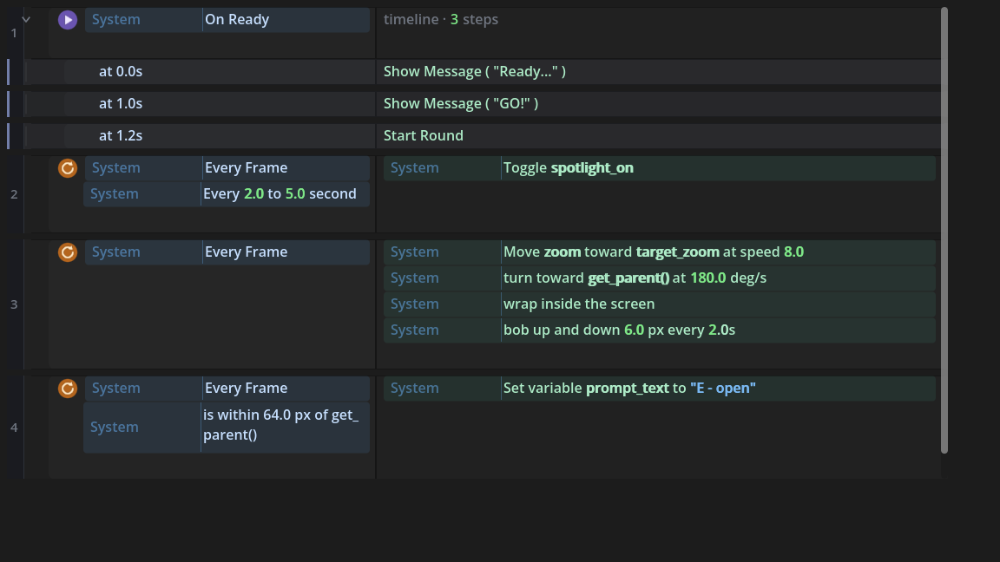
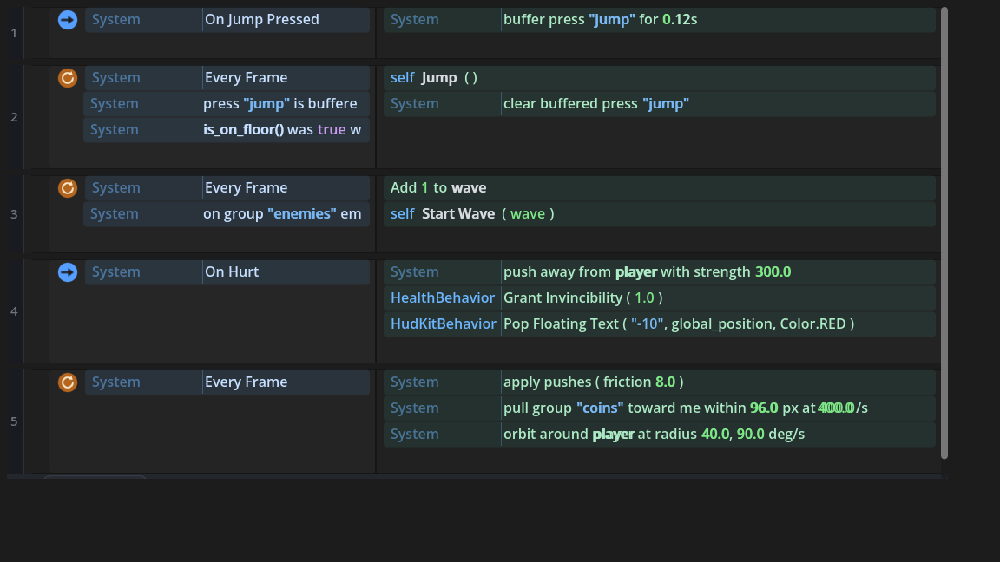

# Everyday Patterns As Vocabulary

*The linkable case for event-sheet visual scripting: what a beginner gets to skip, pattern by
pattern - and what an expert keeps.*

Every game needs the same two dozen patterns: a state machine, a cooldown, a spawner cadence,
knockback, a score popup. None of them are hard ideas. What makes them hard is the **spelling**:
scratch timer variables, prev/now comparisons that depend on frame order, `1.0 - exp(-k * dt)`,
`inverse_lerp`, four timestamps for one jump that feels right. A beginner does not struggle with
"the dash needs a cooldown" - they struggle with the eleven lines that idea costs, and with the
three bugs the first attempt always has.

Godot EventSheets' answer is not to hide the ideas. It is to give each one a **name**: one row
that says what it means, compiling to the exact GDScript an experienced developer would have
written - visible on hover, byte-for-byte in your project, still running if you delete the
plugin. The abstraction is vocabulary, never a black box.

## What the beginner skips (and the expert keeps)

Each row below names the code burden it deletes. In every case the emitted code is the honest
form - often *more* correct than the beginner's version, because the row compiles the spelling
people get wrong.

**Time and state** - the scratch-variable killers:

| The row | The code burden it deletes |
| --- | --- |
| `Every 0.5 seconds` | the `timer += delta` accumulator and its reset |
| `Every 2 to 5 seconds` | the same, plus the re-rolled `randf_range` |
| `score has changed` | the `previous_score` variable and frame-order reasoning |
| `Trigger once` / `Was recently true (is_on_floor(), 0.1s)` | edge detection - the second one IS coyote time |
| `Start cooldown "dash" for 1.5s` / `cooldown "dash" is ready` | `last_dash_time` and clock math |
| `Buffer press "jump" for 0.12s` / `press "jump" is buffered` | input buffering's timestamps |
| `Wait 1.0 s` / the **Timeline** block (`at 0.0s… at 1.0s…`) | await-chains; the Timeline compiles to exactly one |
| `5 times, 0.1s apart: …` | the for-await burst loop |
| `On group "enemies" emptied` | the wave director's "are they all dead yet" polling |

**Motion feel** - the math nobody writes correctly:

| The row | The code burden it deletes |
| --- | --- |
| `Move zoom toward target at speed 8` | `1.0 - exp(-k * dt)` - the frame-rate-independent damping, compiled correctly and proven at 60 vs 240 fps |
| the **Spring** pack | velocity + stiffness + damping integration, with real overshoot |
| `push away from Player with strength 300` + `apply pushes` | knockback that decays instead of teleporting or never stopping |
| `turn toward Player at 180 deg/s` | `rotate_toward` + angle math |
| `orbit around Player at radius 40, 90 deg/s` | the sin/cos pair |
| `pull group "coins" toward me within 96 px` | the vacuum-pickup loop |
| `wrap inside the screen` / `bob up and down 6 px every 2s` | the Asteroids ifs; `sin(ticks/period)` |

**Structure** - whole systems as rows:

| The row | The code burden it deletes |
| --- | --- |
| the **State Machine** pack + the `◆ State:` reading | enum + match + transition bookkeeping + enter/exit hooks |
| **Remember Between Runs** (one right-click) | fifteen lines of ConfigFile ritual |
| the **Object Pool** pack (+ its `reset()` seam) | instantiate/queue_free churn, the stutter, the reset checklist |
| `Grant invincibility 1s` / `is invincible` | i-frame timestamps, wired into damage so it cannot be forgotten |
| `Chance(10)` / shuffle bags / weighted tables | probability code, seeded for replayable runs |
| `Progress of hp from 0 to max_hp` | `inverse_lerp` (the function beginners never find) |
| `As Clock Time (seconds)` | `"%02d:%02d" %` formatting |
| `Pop floating text "+10" at position` | a label scene, a tween, and cleanup |

## Why this reads - the rules behind it

The catalog works because the sheet obeys a small set of enforced rules, not taste:

- **Branching is always a condition, an effect is always an action.** Even inside a lifted
  `match`, an `if` renders as a nested condition row - guard left, effect right. There is a
  test that fails if branching ever appears in an action lane.
- **Icons carry kind, words carry meaning.** ⟳ every tick, ▶ once, ➜ a signal, ◆ a state,
  ƒ a computed check - one symbol each, taught once, drawn crisp at any scale. No word-pills.
- **Structure mirrors the code.** Canvas nesting maps one-to-one onto the code's tabs; a
  hand-written `enum` + `match` machine opens as the machine it is, byte-exact both ways.
  ([The full reading grammar.](GUIDE-BLOCK-STYLES.md))
- **The expert loses nothing.** Hover shows the real line; the generated file is plain, typed
  GDScript with parity enforced by tests; a statement the vocabulary does not match stays an
  honest single-statement row. Measured across this repo's 206 hand-written files: every one
  of 25,974 code lines arrives as structure, round-tripping byte-for-byte.
- **The vocabulary teaches the code.** Every row is a GDScript lesson one hover away - the
  tool is a ramp into the language, not a wall around it.

## Where to go next

The hands-on version of this catalog - with authoring steps and screenshots - is
[Common Game Patterns Without Code](GUIDE-COMMON-GAME-PATTERNS.md). The reading rules are
[Block Styles](GUIDE-BLOCK-STYLES.md). Coming from Construct 3, the whole worldview maps over:
[the C3 migration guide](GUIDE-C3-MIGRATION.md).
