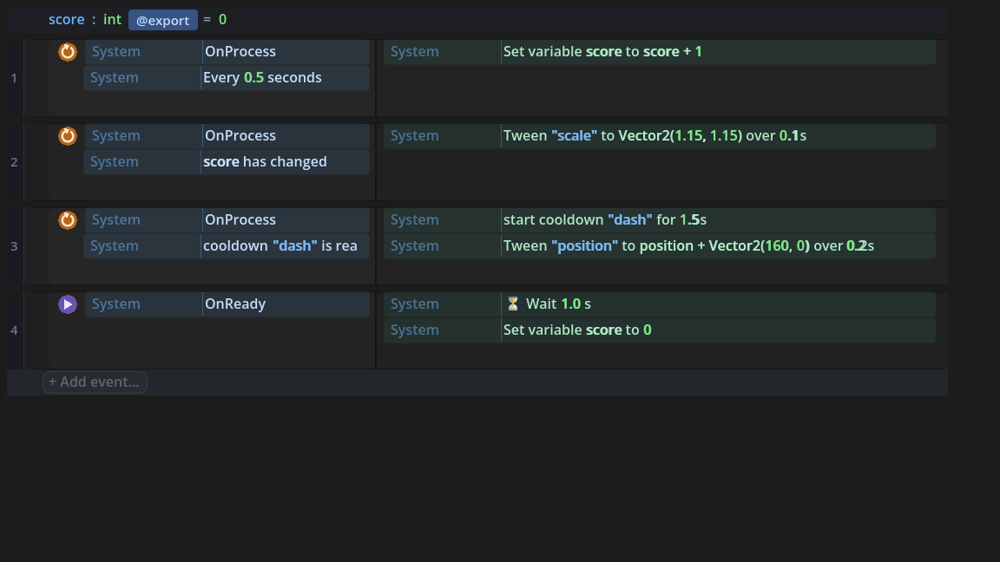
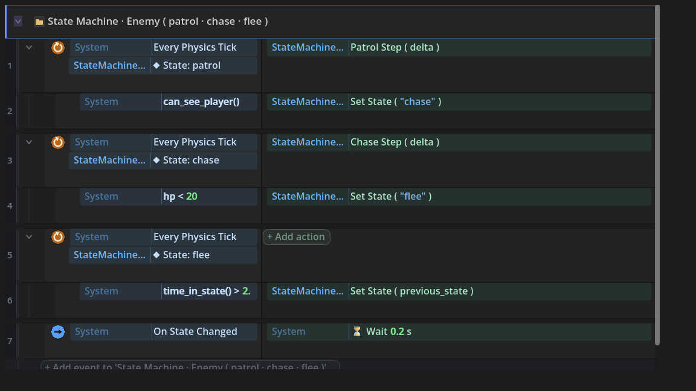

# Common Game Patterns Without Code

State machines, timers, cooldowns, saving, tweens, randomness - the patterns every game needs,
written as event rows instead of GDScript. Each section below shows the code pattern being
replaced, the rows that replace it, and where to find them in the picker. If you have never
written the code versions, even better: you are skipping them entirely.

## Run something every X seconds

The code version keeps a scratch timer variable, adds `delta` every frame, and resets it when it
overflows. The row version is one condition:

- Add a **Run every tick** event, then the condition **Every X Seconds** (System, Time).
- Everything in the actions column runs each time the interval elapses. No timer variable
  exists anywhere on your sheet.

## React only when a value changes

Updating a HUD every frame works, but juice ("pop the score label when it changes") needs to
know the exact tick a value became different. In code that is a `previous_value` variable and a
comparison you have to order correctly. As a row:

- Condition **Has Changed** (System, Run Context) watching `score` - true only on the tick the
  value becomes different.
- Pair it with a **Tween Property** action for one-row juice: score changes, label pops.

**Trigger Once** is its close cousin: Has Changed fires per change of a value, Trigger Once
fires once per time a whole condition set becomes true.

## Cooldowns by name

No `last_dash_time` variable, no clock math:

- **Start Cooldown** (System, Time) - `Start Cooldown "dash" for 1.5s`.
- **Cooldown Is Ready** (condition) - gate the dash event on it. A cooldown you never started
  counts as ready, so the first press always works.
- **Cooldown Time Left** (expression) - feed a progress bar or an ability icon sweep.

Cooldowns are per-node and keyed by the name string, so `"dash"` and `"attack"` never collide,
and two enemies' `"attack"` cooldowns are independent.

## Wait, then continue

**Wait** (System, Time) pauses the action list mid-flow: `Show message "Ready..."`, `Wait 1.0 s`,
`Show message "GO!"`. Everything below the Wait runs after the delay - the sheet reads top to
bottom exactly like the timeline it is. **Wait For Signal** does the same for "until something
happens" instead of "until time passes", and **Single Flight** (Run Context) keeps a waiting
event from stacking a second copy of itself while the first is still going.

## Remember a variable between runs

Right-click any sheet variable and choose **Remember Between Runs**. That is the whole feature:

- The variable loads its last saved value when the node enters the scene.
- Every remembered variable saves back automatically when the node leaves the tree (scene
  change or quitting the game), to `user://remembered.cfg`.
- A sheet with a class name saves under that name, so two sheets' variables never collide.

The fifteen lines of ConfigFile ritual this replaces are generated into your file where you can
read them - open the compiled script and look for `_ef_recall_remembered`. For whole save-game
systems (slots, versioning, migration), the Save Studio is the bigger tool; Remember Between
Runs is for "the high score should survive closing the game" and nothing heavier.

## A state machine you can read

Attach the **State Machine** behavior pack and the pattern that usually needs an enum, a match
statement, and transition bookkeeping becomes vocabulary:

- **Set State** switches state (and only fires on a real change).
- **Is In State** is the condition each behavior event sits behind.
- **On State Changed** triggers with `previous` and `next` - your enter/exit hook.
- **Time In State** tells how long the current state has been running: "flee for two seconds,
  then go back" is `Time In State > 2` then `Set State previous_state`.
- **previous_state** always holds where you came from.

The shape that reads best: one named group for the machine, one PARENT event per state (its
condition renders as the `◆ State:` header), and everything the state does or leaves through as
SUB-EVENTS beneath it - each transition gets its own condition lane, so piling on more guards
later ("and cooldown ready", "and player still visible") never means restructuring.

## Pick one node out of a group

The code version is a `for` loop with a `best` variable and a comparison - easy to get subtly
wrong. The expression version (Nodes, Picking) is one pick:

- **Nearest Node In Group** / **Furthest Node In Group** - by distance to this node.
- **Random Node In Group (empty-safe)** - uniform pick that returns nothing instead of crashing
  when the group is empty.
- **Group Member With Smallest/Largest Property** - weakest enemy (`hp`), slowest racer
  (`speed`), any property by name.

Set the result into a variable, then drive the following actions with it.

## Chance and randomness in plain words

The **Advanced Random** pack speaks probability the way designers do:

- **Chance** - a condition that is true 10% of the time when you write `Chance(10)`.
- **One In** - `One In(6)` for dice logic.
- **Pick From** - a random element of any list; **Shuffle Bag** draws every item once before
  any repeats (loot that feels fair); **Pick From Table** rolls a weighted `.tres` table you
  author as a data asset.

Because the pack is seeded, a run can be replayed exactly - set the seed once and your daily
challenge mode exists.

## Animate a property without a tween chain

**Tween Property** (System, Tween) is one action: the node, the property, the target value, the
duration, and easing dropdowns. Two Tween Property actions under the same event run as separate
one-shot tweens; **Tween Callback** runs something after a delay (the classic
"fade out, then free it").

## When a button is pressed

Signals connect themselves. The **HUD Kit** pack ships **On Button Pressed** (any descendant
button by name, no wiring), and **Connect Group Signal** (System, Signals) wires every current
member of a group to a handler in one action. Declaring your own signal on a sheet publishes an
**On <signal>** trigger for other sheets automatically.

## Where these live

Everything above except the State Machine, Advanced Random, and HUD Kit sections is built into
every sheet - open the picker and browse System's Time, Run Context, Tween, and Nodes: Picking
sections. The three packs install from the addon browser like any other behavior, and each is
itself an event sheet: open it, read it, extend it.
