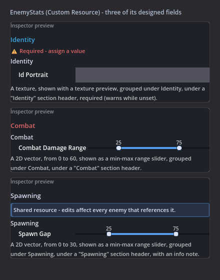
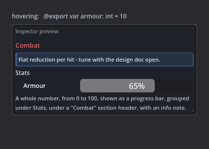

# Inspector Drawers & Export Options Guide

Make your event-sheet variables show up as **rich, designer-friendly controls in Godot's Inspector**: sliders, min-max ranges, direction dials, colour swatches, texture thumbnails, and inline curves, plus **decor** (accent section headers, info note panels) and every common `@export` option (ranges, dropdowns, multiline text, grouping, tooltips, read-only, alpha-free colours). It is a rich-inspector experience for Godot, authored entirely from the **Variable dialog** with no code, and it compiles to plain `@export` GDScript that round-trips losslessly. A teammate who never opens the event sheet still gets a tidy, tuned Inspector to play with - and **hovering any exported variable in the sheet shows a live preview** of exactly what they will get.


## Table of Contents

1. [Scenarios Where This Excels](#1-scenarios-where-this-excels)
2. [Core Concepts](#2-core-concepts)
3. [Getting Started](#3-getting-started)
4. [The Drawers (the rich controls)](#4-the-drawers-the-rich-controls)
5. [The Export Options](#5-the-export-options)
6. [The Behaviours (Tier-2 setters)](#6-the-behaviours-tier-2-setters)
7. [Reference: every option and the GDScript it emits](#7-reference-every-option-and-the-gdscript-it-emits)
8. [Use Cases](#8-use-cases)
9. [Tips and Common Mistakes](#9-tips-and-common-mistakes)

---

## 1. Scenarios Where This Excels

- **Tuning game feel without recompiling thoughts.** Turn `damage`, `jump_height`, or `knockback` into a **slider** with sensible min/max, then drag it in the Inspector while the game runs. No retyping numbers.
- **Handing a project to a non-programmer.** A level designer opens the scene, sees a clean grouped Inspector with labelled sliders and colour swatches, and tunes the level. They never touch the event sheet or a line of GDScript.
- **Direction and aim values.** A `wind` or `dash_direction` `Vector2` becomes a **dial** you point with the mouse, instead of two abstract X/Y number boxes.
- **Palette and theme work.** A `team_colour` is a **swatch row** with one-click presets plus a full picker, so colours stay on-brand and quick to set.
- **Easing and falloff curves.** A `damage_falloff` `Curve` shows its shape **inline** in the Inspector so you can read the ramp at a glance before opening the full curve editor.
- **Self-documenting, safe fields.** Tooltips explain each value on hover, **clamps** keep health between 0 and 100 no matter what code assigns, and **read-only** shows a computed value without letting anyone edit it.
- **Conditional Inspectors.** A `homing_strength` field that only appears when `is_homing` is ticked keeps the Inspector uncluttered and impossible to misuse.
- **"Between A and B" values.** A `spawn_interval` or `damage_range` is ONE **min-max slider** with two handles instead of two disconnected number fields that can cross.
- **Inspectors that explain themselves.** An accent **section header** breaks a long Inspector into readable chapters, and an **info note** puts the one sentence a designer must read ("Shared resource - edits affect every user.") right above the field it concerns.
- **Auditing without opening dialogs.** Hover any exported variable row in the sheet and a live preview card pops up showing its final Inspector - decor, grouping, and widget included.

## 2. Core Concepts

**The problem this solves.** Godot exposes a variable to the Inspector with `@export`, and richer controls need annotations like `@export_range(...)`, `@export_multiline`, or a hand-written `EditorInspectorPlugin` for anything custom. Writing those by hand is fiddly, easy to get wrong, and invisible to a visual author. This feature lets you pick the control from a dialog and generates the correct annotation for you.

**Key design decisions you should know:**

- **The parity covenant.** Every custom drawer compiles to an `@export_custom(PROPERTY_HINT_NONE, "eventsheet:<drawer>...")` marker. With the EventSheets editor plugin installed, the Inspector swaps in the rich control. **Without** the plugin, or in an **exported game**, the property quietly degrades to a plain field. Your shipped game never depends on the plugin and never breaks.
- **It is just GDScript.** Everything you author becomes a normal `@export` line (or a small generated setter / `_validate_property`). Open the `.gd` in Godot's script editor and it reads like hand-written code. Nothing is locked inside a proprietary format.
- **Lossless round-trip.** Reopening the `.gd` as a sheet recovers your choices. The drawers, ranges, and the no-alpha flag come back as **editable dialog fields** (re-tick them, they survive editing). The rest round-trips byte-for-byte even when it stays a verbatim annotation.
- **Inspector options apply to exported variables.** A control only matters for a value the Inspector shows, so the options appear once you tick **"Editable in the Inspector (a designer property)"**.

**Key concepts at a glance:**

| Term | What it means |
|---|---|
| **Variable** | A value your sheet owns (a global or a sheet-level variable). Exporting it puts it on the Inspector. |
| **Drawer** | A rich Inspector control (slider / range / dial / swatches / texture / curve), picked under "Show as". |
| **Export option** | A native Godot `@export_*` flavour (range, multiline, dropdown, colour-no-alpha, group, read-only). |
| **Behaviour** | A generated setter or property rule (clamp, on-changed callback, show-if, lock-unless). |
| **Parity** | The rule that generated games run identically with or without the editor plugin. |

## 3. Getting Started

1. In the EventSheets dock, add or edit a **variable** (the sheet's Variables area, then "Edit").
2. Tick **"Editable in the Inspector (a designer property)"** under **Access**. This is what makes the value an `@export` and unlocks the options.
3. Click **"More options (tooltip, range, drawer...)"** to expand the disclosure.
4. Fill in a **Tooltip**, set a **Range**, choose a drawer under **"Show as"**, and watch the live preview update.


The variable above compiles to exactly this:

```gdscript
## The player's current health (0-100).
@export_custom(PROPERTY_HINT_NONE, "eventsheet:progress_bar:0:100") var health: int = 100
```

The `##` line becomes the Inspector's hover tooltip, and the `eventsheet:progress_bar` marker is what the editor plugin turns into the draggable bar. In an exported game that same line is just an `int` with a plain spin box.

## 3b. Choosing by Picture (the Look Gallery + the Inspector preview)


You do not need to know any of the vocabulary below to design a property:

1. In the Variable dialog, tick **Editable in the Inspector** and open **More options**.
2. Press **Browse...** next to *Inspector look*. A gallery of picture tiles opens - each tile
   is a miniature of the real Inspector widget (checkbox flags, a layers grid, a file picker,
   an easing curve...) with a one-line explanation. Click the one that looks right.
3. Looks that need details (flag names, file filters) drop you straight into the **Details**
   field with an example placeholder.
4. Watch the **Inspector preview** card: it mocks the final Inspector live - the group
   heading, the sub-heading indent, the property name, and the chosen widget - and states
   your choices as one sentence ("A whole number, from 0 to 100, shown as a progress bar,
   grouped under Combat > Defense."). The **Ships as:** line under it shows the exact
   GDScript annotation the choice compiles to.

In **Simple Mode** the dialog hides the Advanced tier entirely (show-if, lock-unless,
on-changed, clamp, read-only, and the grouping text fields) - the gallery, the preview card,
and the common options stay. Attributes already set on a variable keep round-tripping
untouched; the tier returns when Simple Mode is turned off.

Grouping without the drag gesture: right-click a variable row (or a multi-selection of them)
and pick **Group Under a Heading...** - the same folder the drag creates, with the same
naming popup.

## 4. The Drawers (the rich controls)

A **drawer** replaces a variable's plain Inspector field with a richer control, offered in the **"Show as"** dropdown for the types that can host one (the default is always "Default field", so a drawer is opt-in). Most types host one drawer; `Vector2` hosts two (the dial and the min-max range). All six are shown in the image at the top of this guide.

### Progress bar (int / float)

**What it does.** Shows a horizontal bar you drag to set the value, bounded by the variable's **Range**. Ideal for any 0-to-N stat.

**How to use it.** Set a **Range** (for example `0, 100, 1`), then choose **Show as: Progress bar**. The bar reads its min and max from the Range.

**Emits** (the min and max ride inside the marker, so there is no separate `@export_range`):
```gdscript
@export_custom(PROPERTY_HINT_NONE, "eventsheet:progress_bar:0:100") var health: int = 100
```

**Use case.** A `stamina` value designers drain-test by dragging, or a `volume` from 0 to 1 with step `0.05`.

### Min-max range (Vector2)

**What it does.** One track with two draggable handles: the variable's `x` is the low end and `y` the high end. One control for "a range", instead of two disconnected number fields.

**How to use it.** Choose **Show as: Min-max range** on a `Vector2`. The slider's track bounds come from the **Range** (for example `0, 60`).

**Emits:**
```gdscript
@export_custom(PROPERTY_HINT_NONE, "eventsheet:min_max:0:60") var spawn_gap: Vector2 = Vector2(10, 40)
```

**Use case.** A `spawn_gap` of 10-40 seconds, a `damage_range` rolled per hit, or camera `zoom_bounds` - anywhere the design says "between A and B".

### Editable table (Array)

**What it does.** Turns an `Array` of `Dictionary` rows into an **editable grid**: one row per element, one typed cell per column (text, number, checkbox), with add / remove / move-up controls. The single most painful data-editing surface in Godot - loot tables, wave definitions, dialogue lines - becomes a spreadsheet.

**How to use it.** On an `Array` variable choose **Show as: Editable table**, then define the columns in the **Table columns** field as `name:type` pairs (`item:String, count:int, rare:bool`; types: String, int, float, bool).

**Emits** (the column schema rides the marker; each row is a plain Dictionary):
```gdscript
@export_custom(PROPERTY_HINT_NONE, "eventsheet:table:item=String,count=int,rare=bool") var loot: Array = []
```

**Use case.** A `loot` table designers fill row by row, a `waves` list (enemy, count, delay), or dialogue lines (speaker, text, portrait path) - all without touching Godot's generic array editor.

### Toggle buttons (String with Options)

**What it does.** Shows a String's fixed choices as **one row of toggle buttons** instead of a dropdown - every option visible at a glance, one click to switch. The pressed button is the value.

**How to use it.** Fill **Options** (`easy, normal, hard`), then choose **Show as: Toggle buttons**. The choices ride the drawer marker instead of `@export_enum` (one annotation slot), so without the plugin the field degrades to plain text - editor convenience only, like every drawer.

**Emits:**
```gdscript
@export_custom(PROPERTY_HINT_NONE, "eventsheet:toggle_row:easy,normal,hard") var difficulty: String = "normal"
```

**Use case.** A `difficulty`, `team`, or `weapon_slot` a designer flips constantly during playtesting - three visible buttons beat a three-item dropdown.

### Direction dial (Vector2)

**What it does.** A round dial with a draggable handle. The handle's angle sets the direction and its distance from the centre sets the magnitude, so one gesture sets both components.

**How to use it.** Choose **Show as: Direction dial**. The dial's reach (the magnitude at the rim) comes from the **Range** max (a bare number like `150` works).

**Emits:**
```gdscript
@export_custom(PROPERTY_HINT_NONE, "eventsheet:vector_dial:150") var wind: Vector2 = Vector2(60, -40)
```

**Use case.** `wind`, `gravity_direction`, or a default `dash_vector` that reads more naturally as an arrow than as `x` and `y` boxes.

### Swatch row (Color)

**What it does.** A row of one-click colour presets plus the full Godot colour picker, so common colours are a single click and custom ones are still one click away.

**How to use it.** Choose **Show as: Swatch row** on a `Color` variable.

**Emits:**
```gdscript
@export_custom(PROPERTY_HINT_NONE, "eventsheet:swatch_row") var team_colour: Color = Color("#e23b3b")
```

**Use case.** `team_colour`, `hit_flash_colour`, or a `ui_accent` that should stay within a small brand palette.

### Texture preview (Texture2D)

**What it does.** Shows a thumbnail of the assigned texture right in the Inspector instead of just a resource slot, so you can confirm the art at a glance.

**How to use it.** Choose **Show as: Texture preview** on a `Texture2D` variable.

**Emits:**
```gdscript
@export_custom(PROPERTY_HINT_NONE, "eventsheet:texture_preview") var icon: Texture2D
```

**Use case.** A `portrait`, `card_art`, or `pickup_icon` where a thumbnail saves a round-trip to the FileSystem dock.

### Curve preview (Curve)

**What it does.** Renders the shape of a `Curve` resource inline. You read the ramp directly; you still shape its points in Godot's stock Curve editor after assigning.

**How to use it.** Choose **Show as: Curve preview** on a `Curve` variable.

**Emits:**
```gdscript
@export_custom(PROPERTY_HINT_NONE, "eventsheet:curve_editor") var damage_falloff: Curve
```

**Use case.** `damage_falloff` over distance, a `spawn_rate` ramp over time, or an `ease` curve for a tween.

## 4b. The Inspector Designer (the whole sheet at once)

**Sheet ▸ Inspector Designer…** shows every Inspector-visible variable of the sheet as ONE live view - decor, grouping, and widgets, exactly as Godot will show them, with the plain-language sentence under each. It is the "what does my whole Inspector look like?" answer the per-variable dialogs cannot give - and you edit from it too: **✎** opens that variable in the Variable dialog (the Designer refreshes when you confirm), and **▲** moves a sheet variable up in the Inspector as one undo step. Top-level variables sort alphabetically, so only sheet variables reorder.


## 5. The Export Options

These are native Godot `@export_*` flavours, picked from the same "More options" disclosure. They work with or without the editor plugin because they are stock Godot annotations.

### Tooltip

A short hover description. Type it in the **Tooltip** field; it becomes a `##` doc comment above the variable, which Godot shows as the Inspector tooltip.

```gdscript
## How hard the screen shakes on a hit.
@export var shake_strength: float = 8.0
```

### Range (slider bounds)

Min, max, and step for a numeric variable. Type `min, max, step` (a bare `max` is also accepted). Drives both the Inspector slider and the progress-bar / dial drawers.

```gdscript
@export_range(0, 100, 1) var health: int = 100
```

### Easing curve (float)

An exponential-easing handle in the Inspector, for attenuation / falloff values that read better as a curve than a number. Tick **"Easing curve"** on a `float`.

```gdscript
@export_exp_easing var attenuation: float = 1.0
```

This round-trips **structured**: reopen the `.gd` and the tick is still checked.

### Multiline (String)

A big multi-line text box instead of a single line. Tick **"Multiline"** on a `String`.

```gdscript
@export_multiline var intro_text: String = "Welcome..."
```

### Placeholder (String)

Grey hint text shown while a `String` field is empty, so a designer knows what to type. Fill the **"Placeholder"** field on a `String`.


```gdscript
@export_placeholder("Enter your name") var player_name: String = ""
```

Round-trips **structured** (the hint text comes back into the dialog field). Skip a placeholder that contains a double-quote; it falls back to a plain `@export`.

### Options dropdown (combo / enum)

A fixed dropdown for a `String`. Fill the **"Options"** field with comma-separated values (or one-click "From enum"). Emits an `@export_enum`.

```gdscript
@export_enum("easy", "normal", "hard") var difficulty: String = "normal"
```

### Suggestions dropdown (String)

A dropdown of choices that **still accepts free typing** - unlike the Options dropdown, which locks the set. Pick **Inspector look: Dropdown with free typing (suggestions)** and list the choices in Details (`sword, bow, staff`).

```gdscript
@export_custom(PROPERTY_HINT_ENUM_SUGGESTION, "sword,bow,staff") var weapon_kind: String = "sword"
```

Round-trips **structured** (the choices come back into the Details field). Use it when the common values are known but designers may need a new one mid-jam.

### No alpha (Color)

A solid RGB swatch with the alpha slider hidden, for colours that should never be transparent. Tick **"No alpha"** on a `Color`.


```gdscript
@export_color_no_alpha var team_colour: Color = Color(1, 1, 1, 1)
```

This one round-trips **structured**: reopen the `.gd` and the "No alpha" tick is still checked, so you can untick it later. Note that "No alpha" and the swatch-row drawer are mutually exclusive on emit (leave "Show as" on "Default field" to use No alpha).

### Section header and Info note (decor)

Editor-only decoration drawn **above** a property: a **Section header** is an accent-colored label (end it with a `#rrggbb` to tint it, e.g. `Combat #e06666`), and an **Info note** is a quiet panel for a sentence the designer must read ("Shared resource - edits affect every user."). Fill either field under **Advanced**; they compose with any drawer.

```gdscript
# @inspector_header Combat #e06666
# @inspector_info Shared resource - edits affect every user.
@export var armour: int = 10
```

They emit as plain `#` comments (never `##`, which would merge into the hover tooltip), so without the editor plugin - or in an exported game - they are inert comments. Round-trips **structured**: reopen the `.gd` and the fields come back editable.

### Required

A red "⚠ Required - assign a value" badge above the field until it is set - for the Resource slot or String that must never ship empty. Tick **"Required"** under **Advanced**. Zero is a value, not missing; the badge watches for null resources and blank text.

```gdscript
# @inspector_required
@export var portrait: Texture2D = null
```

Editor-only, like all decor: an inert comment without the plugin. See it live in `demo/showcase/enemy_stats/enemy_stats_example.tres` - the portrait is deliberately unset.

The **Project Doctor** enforces it project-wide: every scene node and saved resource using the script is scanned, and any that leaves a required (and empty-by-default) property unset gets a warning naming the exact file and property - so a required field can't slip through in a scene nobody opened.



### Read-only

Shows the value in the Inspector but greys it out so nobody can edit it, for computed or status fields. Tick **"Read-only"** (Advanced).

```gdscript
@export_custom(PROPERTY_HINT_NONE, "", PROPERTY_USAGE_DEFAULT | PROPERTY_USAGE_READ_ONLY) var current_score: int = 0
```

### Group and Sub-heading

Collapsible Inspector sections so related variables sit together. Fill **"Group under heading"** and optionally **"Sub-heading"** (Advanced).

```gdscript
@export_group("Combat")
@export_subgroup("Defense")
@export var armour: int = 10
```

## 6. The Behaviours (Tier-2 setters)

These add a little generated logic to a variable. They live under **Advanced** and apply to exported variables.

### Clamp to range

Keeps assignments inside the Range no matter what code sets, by generating a setter. Tick **"Clamp to range"** (needs a numeric type and a Range).

```gdscript
@export_range(0, 100, 1) var health: int = 100:
	set(value):
		health = clampi(value, 0, 100)
```

**Use case.** `health` that can never display above 100 or below 0, even if a buff over-heals.

### On changed

Calls a sheet function every time the value is assigned, for keeping UI or derived state in sync. Fill **"On changed"** with a sheet function name.

```gdscript
@export var score: int = 0:
	set(value):
		score = value
		refresh_score_label()
```

**Use case.** A `score` that repaints its HUD label whenever it changes, with no polling.

### Validate with (inline validation)

The Inspector calls a sheet function **while the property is edited** and shows the returned warning above the field ("" = valid). Fill **"Validate with"** (Advanced) with the function's name; the sheet needs to be a `@tool` sheet for the check to run in-editor (it stays silent otherwise - never a false alarm).

```gdscript
# @inspector_validate check_spawn_gap
@export var spawn_gap: Vector2 = Vector2(8, 20)


func check_spawn_gap() -> String:
	return "" if spawn_gap.x <= spawn_gap.y else "Spawn gap: the low end exceeds the high end."
```

**Use case.** Cross-field rules a widget cannot enforce alone: "starting health must not exceed max health", "the drop table must not be empty on a boss".

### Field button

A small button rendered **with the property** that calls a sheet function on click - "Reroll" next to the seed, "Refresh preview" next to the path. Fill **"Field button"** (Advanced) with the function name and an optional label (`reroll_stats Reroll`). Needs a `@tool` sheet to act in-editor (the button disables itself with the reason otherwise). Unlike a [Tool button](#7-reference-every-option-and-the-gdscript-it-emits) - which is its own Inspector entry generated from a function - the field button sits with the variable it concerns.

```gdscript
# @inspector_action reroll_stats Reroll
@export var stats_seed: int = 0
```

### Show if / Lock unless

Conditional Inspector visibility or editability driven by another bool variable. Fill **"Show if"** (hide the field unless the bool is true) or **"Lock unless"** (grey it out unless true). These generate a `_validate_property`.

```gdscript
## Inspector conditions (Show If / Lock Unless) - generated; edit via the Variable dialog.
func _validate_property(property: Dictionary) -> void:
	if str(property.name) == "homing_strength" and not bool(is_homing):
		property.usage &= ~PROPERTY_USAGE_EDITOR
```

**Use case.** A `homing_strength` slider that only appears when `is_homing` is ticked.

## 7. Reference: every option and the GDScript it emits

| Option | Where | Applies to | Emits |
|---|---|---|---|
| Editable in the Inspector | Access | any | `@export` |
| Tooltip | More options | any | `## doc comment` |
| Range | More options | int / float / Vector2 | `@export_range(min, max, step)` |
| Multiline | More options | String | `@export_multiline` |
| Options (combo) | More options | String | `@export_enum("a", "b")` |
| Suggestions (free typing) | Inspector look | String | `@export_custom(PROPERTY_HINT_ENUM_SUGGESTION, "a,b")` |
| No alpha | More options | Color | `@export_color_no_alpha` |
| Easing curve | More options | float | `@export_exp_easing` |
| Placeholder | More options | String | `@export_placeholder("hint")` |
| Show as: Progress bar | More options | int / float | `@export_custom(... "eventsheet:progress_bar:min:max")` |
| Show as: Min-max range | More options | Vector2 | `@export_custom(... "eventsheet:min_max:min:max")` |
| Show as: Editable table | More options | Array | `@export_custom(... "eventsheet:table:name=type,...")` |
| Show as: Toggle buttons | More options | String + Options | `@export_custom(... "eventsheet:toggle_row:a,b,c")` |
| Show as: Direction dial | More options | Vector2 | `@export_custom(... "eventsheet:vector_dial:reach")` |
| Show as: Swatch row | More options | Color | `@export_custom(... "eventsheet:swatch_row")` |
| Show as: Texture preview | More options | Texture2D | `@export_custom(... "eventsheet:texture_preview")` |
| Show as: Curve preview | More options | Curve | `@export_custom(... "eventsheet:curve_editor")` |
| Section header | Advanced | any | `# @inspector_header Title #rrggbb` (editor decor comment) |
| Info note | Advanced | any | `# @inspector_info text` (editor decor comment) |
| Required | Advanced | any | `# @inspector_required` (editor decor comment) |
| Validate with | Advanced | any (@tool sheet) | `# @inspector_validate function_name` (editor decor comment) |
| Field button | Advanced | any (@tool sheet) | `# @inspector_action function_name Label` (editor decor comment) |
| Read-only | Advanced | any | `@export_custom(..., PROPERTY_USAGE_READ_ONLY)` |
| Group / Sub-heading | Advanced | any | `@export_group("...")` / `@export_subgroup("...")` |
| Clamp to range | Advanced | int / float + Range | a `set(value)` with `clampi` / `clampf` |
| On changed | Advanced | any | a `set(value)` that calls your function |
| Show if / Lock unless | Advanced | any (driven by a bool) | a generated `_validate_property` |
| Constant | Flags | any non-Variant | `const` (a green "const" pill on the row) |

## 8. Use Cases

### Use case 1: a health bar designers can drag

**Scenario:** the team wants to playtest different starting health values live.

```
Variable: health  (Number, Whole numbers only)
  Editable in the Inspector: on
  Range: 0, 100, 1
  Show as: Progress bar
  Clamp to range: on
```

Designers drag the bar in the Inspector; the clamp guarantees buffs never push it past 100. Emits an `@export_range` progress-bar with a `clampi` setter.

### Use case 2: a wind direction you point with the mouse

**Scenario:** a weather system needs a default wind vector that reads clearly.

```
Variable: wind  (Vector2)
  Editable in the Inspector: on
  Range: 150           // the dial's reach
  Show as: Direction dial
```

Set the arrow with one drag instead of typing X and Y.

### Use case 3: an on-brand team colour

**Scenario:** UI colours must stay within a small palette and be quick to set.

```
Variable: team_colour  (Color)
  Editable in the Inspector: on
  Show as: Swatch row
  // OR, for a guaranteed-opaque colour with no alpha slider:
  No alpha: on         (leave Show as on Default field)
```

### Use case 4: a score that repaints its HUD

**Scenario:** the score label should update the instant the score changes, with no per-frame polling.

```
Variable: score  (Number)
  Editable in the Inspector: on
  On changed: refresh_score_label
```

Every assignment to `score` calls `refresh_score_label()`.

### Use case 5: a conditional homing slider

**Scenario:** a projectile exposes `homing_strength`, but only when homing is enabled.

```
Variable: is_homing       (Yes-No)  -> Editable in the Inspector: on
Variable: homing_strength (Number)  -> Editable in the Inspector: on, Show if: is_homing
```

The `homing_strength` field hides itself in the Inspector until `is_homing` is ticked.

### Use case 6: a grouped, documented combat block

**Scenario:** a character has a dozen tunables and the Inspector is a wall of fields.

```
Variable: armour  (Number)
  Editable in the Inspector: on
  Group under heading: Combat
  Sub-heading: Defense
  Tooltip: Flat damage reduction per hit.
  Range: 0, 50, 1
```

Related variables under the same Group collapse into one tidy "Combat / Defense" section.

### Use case 7: a damage falloff curve

**Scenario:** ranged damage should taper with distance and the designer wants to see the ramp.

```
Variable: damage_falloff  (Curve)
  Editable in the Inspector: on
  Show as: Curve preview
```

The Inspector shows the curve's shape inline; shape the points in Godot's curve editor after assigning.

### Use case 8: a read-only debug readout

**Scenario:** show the live combo count in the Inspector without letting anyone edit it.

```
Variable: current_combo  (Number)
  Editable in the Inspector: on
  Read-only: on
```

### Use case 9: a spawn interval as one min-max slider

**Scenario:** enemies should spawn every 10 to 40 seconds, and the two bounds must never cross.

```
Variable: spawn_gap  (Vector2)
  Editable in the Inspector: on
  Range: 0, 60          // the slider's track
  Show as: Min-max range
```

One track, two handles; `spawn_gap.x` is the low end and `.y` the high end - `randf_range(spawn_gap.x, spawn_gap.y)` in the sheet.

### Use case 10: camera zoom limits that cannot invert

**Scenario:** the player can pinch-zoom, but design wants a hard floor and ceiling that a tired tuner cannot accidentally swap.

```
Variable: zoom_bounds  (Vector2)
  Editable in the Inspector: on
  Range: 0.5, 4
  Show as: Min-max range
```

The handles can meet but never cross, so min <= max holds by construction.

### Use case 11: a shared resource with a warning designers actually see

**Scenario:** one `.tres` is referenced by every enemy in the game; editing it silently changes all of them.

```
Variable: stats  (Resource type)
  Editable in the Inspector: on
  Info note: Shared resource - edits affect every enemy using it.
```

A quiet panel renders right above the field in the Inspector - the warning lives where the mistake happens, not in a wiki.

### Use case 12: a boss stat block with chapter headers

**Scenario:** a boss has 20 tunables and the Inspector reads as one grey wall.

```
Variable: phase_two_hp   (Number) -> Section header: Phase Two #e06666
Variable: enrage_timer   (Number) -> (no header - it sits under Phase Two)
Variable: loot_quality   (Number) -> Section header: Rewards #f4d03f
```

Accent-coloured labels break the wall into chapters. Headers are decor comments in the code - zero runtime effect.

### Use case 13: a name field that shows what to type

**Scenario:** an empty `String` field gives no clue whether it wants a name, a path, or an id.

```
Variable: save_slot_name  (Text)
  Editable in the Inspector: on
  Placeholder: e.g. Farm Save 1
```

Grey hint text shows while the field is empty and vanishes at the first keystroke.

### Use case 14: auditing a whole sheet's Inspector in seconds

**Scenario:** before handing the scene to the design team, you want to check every exported variable looks right - without opening 15 dialogs.

Hover each exported variable row in the sheet: a live preview card pops up with the decor, grouping, widget, and a one-sentence summary ("A whole number, from 0 to 100, shown as a progress bar, grouped under Combat."). Fix anything off via right-click > Edit, hover again to confirm.

### Use case 15: a loot table a designer fills like a spreadsheet

**Scenario:** a jam is on hour 30 and the designer needs to punch in twelve drops for the boss without wrestling Godot's generic array editor.

```
Variable: loot  (Array)
  Editable in the Inspector: on
  Show as: Editable table
  Table columns: item:String, weight:int, rare:bool
```

Each Dictionary row becomes a labelled grid line with add / remove / move-up controls; the designer types straight down the column and never opens a nested "Dictionary" fold.

### Use case 16: a difficulty picker with every option in view

**Scenario:** during playtesting a designer flips `difficulty` dozens of times a session and a dropdown that hides the other two choices behind a click is friction.

```
Variable: difficulty  (Text)
  Editable in the Inspector: on
  Options: easy, normal, hard
  Show as: Toggle buttons
```

All three sit as one row of buttons - the pressed one is the value - so switching is a single click with nothing hidden. Without the plugin it degrades to a plain text field, so nothing runtime depends on it.

### Use case 17: a portrait slot that cannot ship empty

**Scenario:** every enemy needs a `portrait`, and a scene nobody reopens before release is exactly where a null slot slips through.

```
Variable: portrait  (Resource type: Texture2D)
  Editable in the Inspector: on
  Required: on
  Show as: Texture preview
```

The red "Required - assign a value" badge sits above the field until it is set, and the **Project Doctor** scans every scene and saved resource using the script, naming any file that left the portrait unset - so the gap surfaces before ship, not after a bug report.

### Use case 18: a seed field with a Reroll button beside it

**Scenario:** a level author wants to try fresh random layouts from a `stats_seed` without hand-typing new numbers.

```
Variable: stats_seed  (Number)
  Editable in the Inspector: on
  Field button: reroll_stats Reroll
```

A small "Reroll" button renders right next to the seed and calls `reroll_stats()` on click. The sheet must be a `@tool` sheet for the button to act in-editor; otherwise it disables itself and states why.

### Use case 19: a spawn range that refuses to be entered backwards

**Scenario:** a `spawn_gap` Vector2 stores a low and high bound, and a tired tuner could type a low end above the high end and break spawning silently.

```
Variable: spawn_gap  (Vector2)
  Editable in the Inspector: on
  Validate with: check_spawn_gap
```

The Inspector calls `check_spawn_gap()` as the field is edited and shows its returned message above the property ("Spawn gap: the low end exceeds the high end.") until the values are sane. It is the cross-field rule a single widget cannot enforce on its own, and it stays silent on a non-`@tool` sheet rather than raising a false alarm.

### Other game scenarios

**Platformers.** Sliders for `jump_height`, `gravity`, and `coyote_time`; a dial for a `wall_jump_kick` vector; a curve for a variable-jump release ramp.

**Top-down shooters.** A `spread` slider, a `recoil` dial, a `muzzle_flash_colour` swatch, a `wave_gap` min-max range, and a `bullet_falloff` curve, all tuned live.

**RPGs.** Grouped stat blocks under accent chapter headers (Combat / Defense / Magic), clamped `hp`/`mp`, an `on_changed` that refreshes a stat sheet, info notes on shared class resources, and read-only derived totals.

**Puzzle games.** An `difficulty` dropdown, a `grid_size` range, and a `theme_colour` swatch per level.

**Tower defense.** Per-tower `range`, `fire_rate`, and `damage` sliders; a `projectile_arc` curve; a read-only `dps` readout.

**Racing.** `top_speed`, `grip`, and `boost` sliders; a `drift_falloff` curve; a `livery_colour` swatch row.

**Card / board games.** A `card_art` texture preview, a `rarity` dropdown, and a `frame_colour` swatch.

**Rhythm games.** A `bpm` range, a `beat_window` clamp, and a `lane_colour` swatch per lane.

## 9. Tips and Common Mistakes

- **Hover a variable row to see its Inspector.** In the sheet, hovering an exported variable pops the same live preview card the dialog shows - decor, grouping, and the chosen widget - so you can audit a whole sheet's Inspector without opening a single dialog.

  
- **Tick "Editable in the Inspector" first.** The drawers and most options only appear for an exported variable; they have no effect on a private value.
- **A drawer needs its type.** Each drawer is offered only for the type it fits (progress bar for numbers, dial or min-max range for Vector2, swatch for Color, and so on). Change the type and the "Show as" list updates.
- **Range feeds the drawers.** The progress bar and the min-max slider read their bounds, and the dial its reach, from the **Range**, so set the Range before (or alongside) the drawer.
- **No alpha vs the swatch drawer.** They both target Color and are mutually exclusive on emit. To use **No alpha**, leave "Show as" on **Default field**; to use the **Swatch row**, leave No alpha unticked.
- **Drawers degrade, they never break.** Without the editor plugin (or in an exported game) every drawer becomes a plain field. Do not rely on a drawer for runtime behaviour; it is an editor convenience only.
- **Clamp needs a Range.** "Clamp to range" only generates its setter when the variable is numeric and has a Range; without one it is ignored.
- **On changed names a sheet function.** The function must exist in the sheet, or the compiler warns that the target is unknown.
- **Show if / Lock unless point at a bool variable.** The predicate is another variable's name; misspell it and the compiler flags it.
- **Everything round-trips, but re-editability varies.** Drawers, ranges, No alpha, Easing curve, and Placeholder come back as live dialog fields you can re-edit. Some plainer annotations round-trip byte-for-byte yet reopen as a verbatim hint rather than a ticked box; the value is never lost either way.
