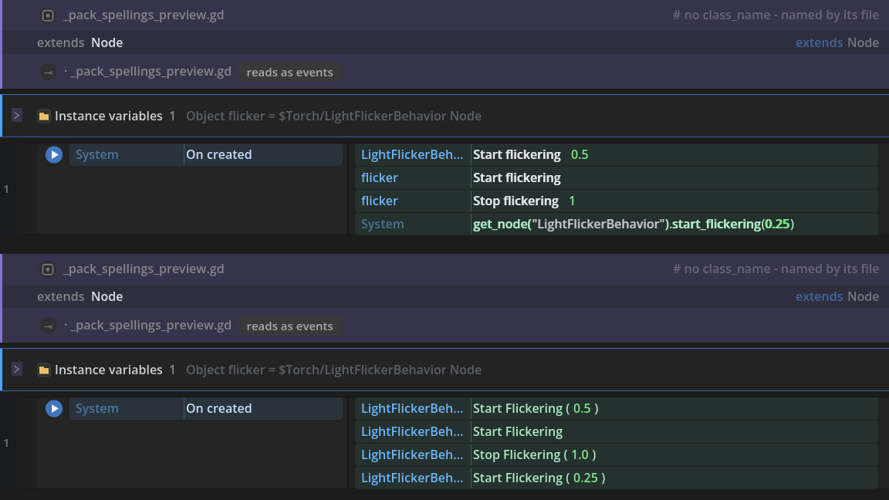

# How your code reads: curated sentences, derived rows, and honest code

Open a hand-written `.gd` as a sheet and every line of it arrives through one of three layers. One
of them is words a person sat down and wrote. One of them is words the engine's own API already
carries. One of them is no words at all - the line, standing as itself, counted out loud.

Knowing which layer you are looking at is the whole of reading an opened file confidently. A
polished sentence and a plainer one are not the same claim: the first says *somebody decided this is
what this line means*, the second says *this is what the class says this member is*, and the third
says *nothing here knows more than the code does*. This guide is those three layers, how to tell
them apart at a glance, where the middle one gets its words, the ledger that counts the bottom one,
and the boundary that the top one is never going to cross.

Nothing here is a mode you turn on. It is what already happens the moment a file is opened, and it
is the same on every machine: the layers are decided by the file's own bytes and the classes the
project declares, never by a setting, a history or a guess.

## Contents

- [The three layers](#the-three-layers)
- [Telling them apart at a glance](#telling-them-apart-at-a-glance)
- [Where the derived layer gets its words](#where-the-derived-layer-gets-its-words)
- [The ledger: Project Doctor - Reading](#the-ledger-project-doctor---reading)
- [Six idioms, before and after](#six-idioms-before-and-after)
- [The boundary: what stays code, and why that is right](#the-boundary-what-stays-code-and-why-that-is-right)
- [Raising the floor yourself](#raising-the-floor-yourself)

## The three layers

**The curated sentence.** Somebody wrote these words. A recogniser knows the exact spelling of a
line and knows what a person means by it, so `get_tree().create_timer(0.5).timeout.connect(queue_free)`
reads *Destroy after 0.5 seconds* rather than as the three calls it is made of. The verb carries the
row's bold weight, the parameters are the row's own fields, and no class name appears next to the
object - because the words are not the class's, they are ours. This is the top layer and it is the
smallest one, because every sentence in it cost somebody an afternoon.

**The derived row.** Nobody wrote these words; the API did. Wherever the sheet can work out what
class the receiver is, an ordinary call reads as an object-verb row and an ordinary property write
reads as *object, property, value* - the Inspector's own three columns. `beat.set_one_shot(true)`
reads *beat `Timer` ▸ Set one shot to true* because `beat` was declared a `Timer` and `Timer` has
that method. Nothing was curated and nothing had to be: the class already knew the member's name,
its parameter names and its description.

**Honest code.** No table claims the line and no class can be named for it, so the line reads as
itself: the row grammar where the shape allows it, a script block where it does not. This is not a
failure state. A project made entirely of these lines is a working project, and general purpose
includes the right to just be code. What matters is that it is *counted*, out loud, on the file's
own head bar and in the Doctor, rather than quietly rounded away.

The order between them is fixed and it only ever goes one way: **a curated table outranks a derived
reading, and a derived reading outranks honest code.** Landing a curated table later upgrades the
rows underneath it in place. The file is untouched, the bytes are identical, and the next time it is
opened the words are better. That is what makes it safe to ship the floor first.

## Telling them apart at a glance

You should never have to hover a row to know which layer wrote it. Two marks do it:

| | The curated sentence | The derived row |
|---|---|---|
| The verb | The row's bold weight - a written sentence | The plainer call style, drawn a shade back |
| Beside the object | Nothing. The words are not the class's | The class it was read off, muted: `Timer`, `Light2D` |
| Where the words came from | A person, in a recogniser table or an ACE descriptor | The class reference, or the `##` lines in your own script |
| What it promises | This is what this line MEANS | This is what this member IS |


The same two marks separate the two layers inside a single event. In the figure below, four ordinary
lines about a light become one event: `torch.energy = 1.2` reads *Set brightness to 1.2* with no
class beside it, because a word map claims `energy` on a light and *brightness* is the word somebody
chose for it; the two rows under it are read straight off `Light2D` on the spot and say so.


Honest code is the third look and the plainest: a single-statement row that shows the statement, or a
script block that shows the lines. Neither pretends to be a sentence, which is exactly what makes
them readable - a mangled sentence over a line nobody understood would be worse than the line.

## Where the derived layer gets its words

A derived row is only worth reading if it can say what the member does, and it can, from two places
that already existed.

**A built-in member reads out of the engine's own class reference.** The reference is harvested from
the engine itself rather than retyped, cached against the version it came from, and shown with the
credit its licence asks for. Hover a derived row and you get the member's own paragraph with the
exact line of code underneath it, where it always was. `F1` on a built-in member opens its page in
the Manual, beside these guides.

**A member of your own script reads out of your own file.** The `##` lines above a `func` or a `var`
are its description, exactly as Godot itself treats them - so the sentence a teammate wrote above
`take_damage` is the sentence the row shows, and an `@export` annotation sitting between the comment
and the declaration does not break the block. The parameter names come from the declaration too,
which is why `hero.take_damage(3)` reads with the author's own word for that 3 rather than with a
bare number.

The same reading drives the writing half. The picker's **Methods in this project** section is one
entry per method your scripts declare, filed under the object it belongs to, with the arguments
already answered from the declaration - a parameter's own default where the author wrote one, the
empty value of its declared type where they did not.

**What is never guessed at.** `get_parent().thing()`, a variable that only gets its value at run
time, an untyped local, a method the class does not actually have: the reading declines. The row
keeps whatever plainer view it already had and the line goes on being counted as code. A guessed
class would name the wrong member and describe it with somebody else's words, which is worse than
saying nothing - and there is no store of remembered guesses anywhere, so two people opening the
same file see the same rows.

## The ledger: Project Doctor - Reading

**Tools ▸ Project Doctor ▸ Reading** is the one section of the Doctor that reports nothing wrong. It
is a ledger: what the lines nothing claims actually look like, so that deciding where the next
curated table would pay is a matter of reading rather than of guessing.


**Two numbers, said apart on purpose.** The head number is the project's reads-as percentage: the
*drawing* question, how much of a file the canvas shows as rows rather than as a wall of code. On
real whole files it sits at or near 100%, because a function body is drawn as a body. The count
underneath it is the *naming* question: how many lines no vocabulary claims by name. Both are true,
they measure different things, and a page that printed only the first would publish a figure that is
true and misleading at once.

**A stays-code line has a shape.** The shape is the statement with the author's own words taken out.
Identifiers, numbers, strings and node paths are blanked; the language's own keywords, its
annotations and its punctuation are kept, because those are what make two lines the same *kind* of
line:

| The line | Its shape |
|---|---|
| `pop.chain().tween_callback(queue_free)` | `name.name().name(name)` |
| `enum State {CLOSED, OPENING, OPEN, LOCKED}` | `enum name{name,name,name,name}` |
| `velocity.y += JUMP_VELOCITY` | `name.name+=name` |
| `if not is_on_floor():` | `if not name():` |

Spacing is not part of a shape, so a project that writes `x = 1` and a project that writes `x=1`
land in one group rather than two. A comment inside a run of code holds no statement, so it shapes
to nothing and is counted apart.

**The commonest shapes are named; the rest are counted.** Six shapes are listed, each opening three
of its own lines as doors into the files they are in, and everything past that is a number. The
one-off tail - lines whose shape nothing else in the project repeats - is one entry saying how many
there are and nothing more. A line said once is nobody's table, and listing two hundred of them
would bury the handful that matter. The walk is capped at the first scripts in path order and says
how many it skipped, because reading a script means importing and re-emitting it.

**The same census, headless, over any folder:**

```text
godot --headless --path . --script tools/reading_shape_census.gd
godot --headless --path . --script tools/reading_shape_census.gd -- dir=res://demo top=40
```

It prints the ranked shapes as plain text with a sample line under each. Byte-stable across runs:
the walk is sorted and the ranking breaks ties on the shape's own text, never on the order a
filesystem handed the files back - so two runs on two machines produce the same ledger, and a diff
between two dates is a real change rather than filesystem noise.

The head number comes through the same reader the head bar's coverage chip uses and the same one the
suite's corpus pins measure with, so the Doctor, the canvas and the tests can never quote three
different percentages for the same bytes.

## Six idioms, before and after

The layers are a mechanism; what a reader feels is which of their own lines suddenly say something.
These six are the ones this pass named, each with the reading it used to get beside the reading it
gets now.

**1. Any call on a class the sheet can name.** This is the headline, because it is not one idiom but
all of them: it is the layer itself.

```gdscript
beat.set_one_shot(true)
```

| Before | Now |
|---|---|
| *Call method `set_one_shot` on `beat`* - the honest catch-all | *beat `Timer` ▸ Set one shot to true*, with the parameter named by the method's own declaration |

**2. Any property on a class the sheet can name.** The write, the comparison and the read, in the
Inspector's own three columns.

```gdscript
torch.shadow_filter_smooth = 0.5
if torch.shadow_filter_smooth > 1.0:
```

| Before | Now |
|---|---|
| The whole expression under System, with the object it is really about nowhere on the row | *torch `Light2D` ▸ Set shadow_filter_smooth to 0.5*, and the comparison as a question in the left lane |

**3. The input handler asks the event.** The commonest shape inside `_input` and
`_unhandled_input` there is.

```gdscript
func _unhandled_input(event: InputEvent) -> void:
	if event.is_action_pressed("jump"):
		jump()
```

| Before | Now |
|---|---|
| *Expression Is True* over the whole condition | *"jump" was pressed*, from the **Input Event** section, beside *was pressed or is repeating*, *was released* and *the event is "jump"* |

Both of Godot's quotings answer to the same row, because the `&` is a spelling rather than a value
and rides back out untouched, and the action names come from the project's own Input Map. These are
the rows for the inside of a handler; the **Input** section's rows ask the keyboard how things stand
right now, which is what an every-tick event wants.

**4. A property that names its accessors.** Godot has two spellings for a guarded value, and only
one of them used to read.

```gdscript
var health: int = 100:
	set = _set_health,
	get = _get_health
```

| Before | Now |
|---|---|
| A verbatim script block. Those two lines are not statements, so nothing could lift them and they took the declaration above them down with them | The variable row it is, with an *On health set ▸ `_set_health`* sub-row saying which function runs and when |

The accessor functions go on reading as the functions they are, where they were written, rather than
being copied under the declaration twice. Any shape the emitter would not write back identically -
the other order, a trailing comma with nothing after it, a name that is not one name - stays the
verbatim block it was.

**5. A connect that binds values.**

```gdscript
open_button.pressed.connect(_on_open.bind(3))
```

| Before | Now |
|---|---|
| Refused outright, which stranded `_on_open` as a helper function with no visible caller | The trigger it is, with the bound value landing on the payload chip it fills: `slot = 3` rather than a bare `slot` |

Godot appends bound values to the end of a handler's arguments, which is what makes that a pairing
rather than a guess. A function the file publishes as a verb is never re-read as a handler, however
it is wired: the verb says what it *is*, everywhere, and a trigger could only ever describe one of
its wirings.

**6. The four notifications a game reacts to.**

```gdscript
func _notification(what: int) -> void:
	match what:
		NOTIFICATION_PAUSED:
			music.stop()
```

| Before | Now |
|---|---|
| Lifted, but called by its constant - `NOTIFICATION_PAUSED` was the row's own name | **On paused**, **On unpaused**, **On object freed** and **On close**, pickable under **Notifications**, each compiling back into the same `match what:` |

`NOTIFICATION_PREDELETE` also stopped reading *On destroyed*. That is what a node leaving the tree
reads as, which can happen more than once; this happens exactly once and nothing follows it, so the
two moments stopped sharing one sentence.

## The boundary: what stays code, and why that is right

There is a line the top layer is not going to cross, and saying so plainly is more useful than
implying otherwise.

**A reading recognises spellings. It does not understand programs.** A recogniser knows that a
particular arrangement of characters is a particular row, and it knows it well enough to write the
author's own bytes back. What it cannot know is what a *program* means: whether this loop terminates,
whether these three statements are one idea, whether the name `_tick` is doing the job its author
thinks it is. Semantics stays code, and that is correct - not a gap waiting to be closed.

Two shapes are deliberately out of the recogniser tables for exactly that reason: a spelling that is
several statements only meaning something together, and a spelling that has to read the scene to know
what it is looking at. Both exist and both are handled, by matchers written by hand that say in a
comment why they are not a table entry.

So the honest floor is load bearing, and it is designed rather than tolerated:

- A statement no layer claims is still an **editable row**, not a wall. You can change it, move it,
  wrap it in a condition, and it saves back as itself.
- A shape the compiler could not reproduce byte for byte is left as a **script block** on purpose,
  rather than reformatted behind your back. Losing a byte of somebody's file to make a prettier row
  is not a trade this plugin makes.
- Both are **counted**, on the head bar and in the Doctor, so nobody has to take the reading's word
  for how well it did.

The measure of the layer model is not that the bottom layer is empty. It is that you always know
which layer you are in.

## Raising the floor yourself

Two doors, and both of them move words rather than bytes.

**If the lines are calls into a pack you ship**, teach the reader the spellings your verbs are
written as. `## @ace_lift_example` above a verb takes the line the way a person writes it with the
value spans marked - `[[target|node: $LightFlickerBehavior]].start_flickering([[after_seconds|argument: 0.5]])` -
and a hand-written file that calls your pack reads as your rows instead of as generic method calls.
The line the author wrote is stored on the row, so saving writes their file back exactly; an example
that cannot keep that promise fails the pack build by name rather than shipping. The full form, its
fragment words and the three rules it is held to are in the Custom ACEs guide.



**If the lines are your project's own**, the Doctor's Reading ledger is the input: the shape at the
top of it is the one that would pay first, and the three lines it opens are the real code that
motivated it. A curated ACE with a matching template claims those lines from then on, and every row
that was reading the plainer way upgrades in place the next time the file is opened - same bytes,
better words.

And when neither is worth doing, nothing is wrong. The lines stay code, the ledger goes on counting
them, and the file goes on running exactly as it always did.
