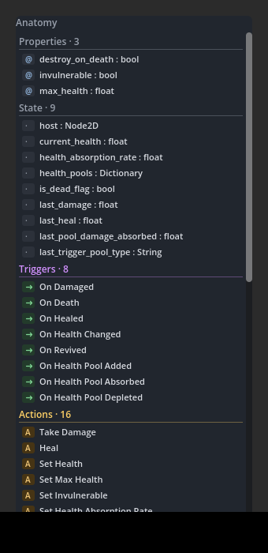
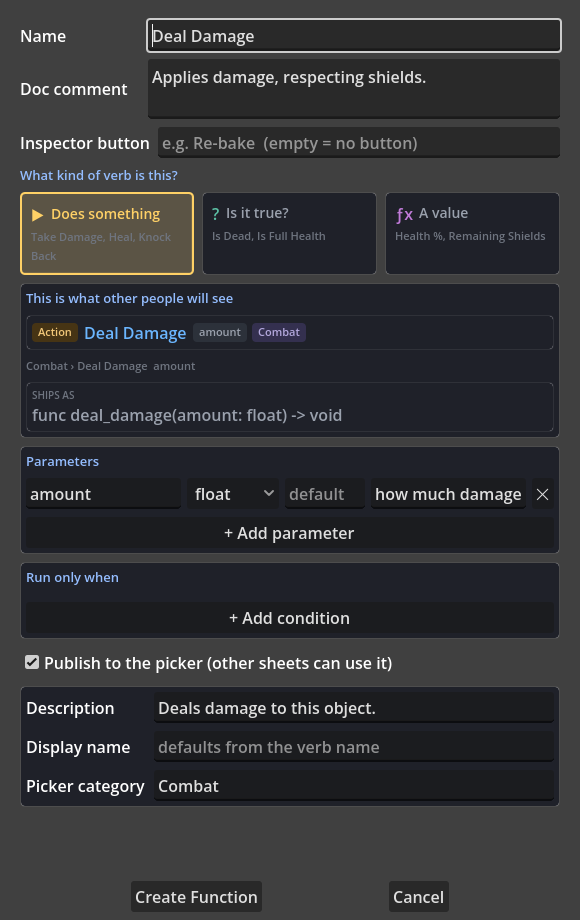
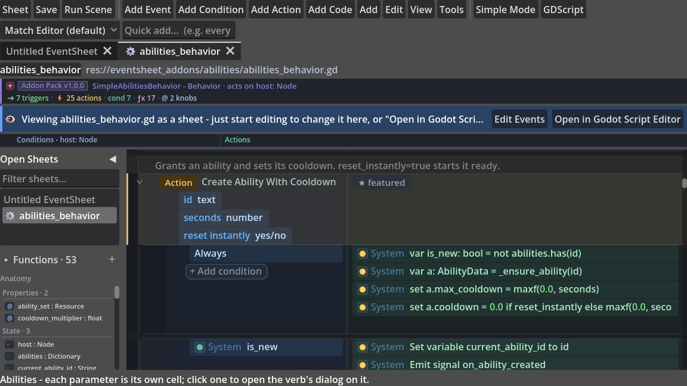

# Make a Behaviour Without Writing Code

You can build a whole reusable **behaviour** - the kind you attach under a node and reuse across a project, like Construct 3's behaviours - using **only event-sheet rows**. No GDScript blocks. This guide maps the vocabulary so you can find every piece: variables and designer knobs, triggers, conditions, actions, loops, and functions that publish as your behaviour's own ACEs - plus the honest line where a GDScript block is still the right tool.

## Table of Contents

1. [Scenarios Where Code-Free Behaviours Excel](#1-scenarios-where-code-free-behaviours-excel)
2. [The Bundled Examples](#2-the-bundled-examples)
3. [Start a Behaviour](#3-start-a-behaviour)
4. [React - Triggers](#4-react---triggers)
5. [Decide - Conditions](#5-decide---conditions)
6. [Act - Actions](#6-act---actions)
7. [Loop - Pick Filters](#7-loop---pick-filters)
8. [Reusable Logic - Functions](#8-reusable-logic---functions)
9. [Give Your Behaviour Save Support](#9-give-your-behaviour-save-support)
10. [When GDScript Is Still the Right Tool](#10-when-gdscript-is-still-the-right-tool)
11. [Use Cases](#11-use-cases)
12. [Tips and Common Mistakes](#12-tips-and-common-mistakes)

---

## 1. Scenarios Where Code-Free Behaviours Excel

- **A reusable node behaviour.** Flash, a timer, 8-direction movement: author it once as rows, attach it under any host node, reuse it across the whole project.
- **Designer-tunable gameplay.** Exported knobs (`move_speed`, `gravity`) show up in the Inspector with live typed drawers, so a designer tunes the behaviour without opening the sheet.
- **Behaviours that announce themselves.** A signal published as a trigger lets other sheets react (*On Flash Finished*) without any wiring code.
- **Acting on every enemy, child, or list item.** Pick Filters give you For Each / Repeat / While loops as rows, with break/continue control.
- **Publishing your own vocabulary.** A function exposed as an ACE becomes a picker entry in every sheet - your behaviour ships its own actions, conditions, and expressions.
- **Learning from working examples.** Every bundled code-free behaviour is a plain `.gd` file you can open as a sheet, study, and tweak.

---

## 2. The Bundled Examples

The bundled **Flash, 8-Direction Movement, Timer, State Machine, and Move To** behaviours are each authored this way (zero GDScript) - open their sheets to see real examples. Each pack is a single **`.gd` file** (no `.tres`), and the importer can open *any* `.gd` as events, so the examples read as sheets you can study and tweak.

---

## 3. Start a Behaviour

**New Behaviour** scaffolds a sheet in **behavior mode**: it compiles to a small node you attach under a host (a `CharacterBody2D`, `Node2D`, ...). Inside the sheet, **`host`** is that parent - node ACEs target it automatically (e.g. *Move And Slide* becomes `host.move_and_slide()`).

Where each kind of value lives:

| You need | Use | Example |
|---|---|---|
| **Designer knobs** | An **exported** variable (an **@export badge** shows on the row + in the Inspector) | `move_speed`, `gravity` |
| **Internal state** | A **non-exported** variable | `remaining`, `flashing`, a coyote timer |
| **Scratch values** inside one event | **Set Local Variable (typed)** | a loop-local distance |

Typed knobs get a live Inspector **drawer** (direction dial, colour swatch, curve, progress bar, texture preview); group many with `@export_group` / `@export_subgroup`.

---

## 4. React - Triggers

- **On Ready / On Process / On Physics Process** - lifecycle triggers (the tick of your behaviour).
- **A signal as a trigger** - add a **Signal row**, tick **"trigger"**, give it a name/category. It publishes as an *On ...* trigger other sheets can react to (this is how Flash fires *On Flash Finished*).

---

## 5. Decide - Conditions

- **Compare Variable**, **Expression Is True** (any boolean expression), **Is Valid** (null-safe), the **Array/Dictionary** conditions (*Is Empty*, *Contains*, *Has Key*), node conditions (*Is On Floor/Wall*), input (*Is Action Pressed*). Add several for AND, or switch the row to OR.
- **Else** - right-click a row → *Else* (or the chain keys) for if/else.

---

## 6. Act - Actions

- **Set / Add Variable**, **Set Property** (`host.visible = ...`), **Call Method**, **Emit Signal**.
- **Movement**: *Set Velocity (X/Y)*, *Apply Gravity*, *Accelerate Velocity Toward*, *Move And Slide*, *Read Input Axis Into*.
- **Collections** (a full set - no GDScript needed): *Append*, *Pop Front/Back*, *Push Front*, *Insert*, *Erase*, *Find*, *Sort*, *Clear*; *Set Key*, *Get (with default)*, *Has Key*, *Keys/Values*.

---

## 7. Loop - Pick Filters

**The bit people miss.** Loops live on an event as a **Pick Filter** (Construct's name). Right-click an event → **Add Pick Filter**, then choose the kind:

| Pick a kind | Compiles to | Use for |
|---|---|---|
| **For Each** (group / children / array) | `for item in ...:` | act on every enemy / child / list item |
| **Repeat N times** | `for i in range(n):` | do something N times |
| **While (condition)** | `while <expr>:` | loop until a condition flips |

Inside the loop body, **Current Loop Item** is the iterator; **Break Loop** / **Continue Loop** control it. *Budgeted For Each* spreads a big loop across frames.

---

## 8. Reusable Logic - Functions

Add a **Function** (name + typed parameters + a return type). The dialog is the **ACE Studio**: three plain-language cards replace return-type jargon, a live preview shows exactly what other people will see in the picker, and the "Ships as:" strip shows the GDScript signature it compiles to. The "Using the ACE Studio" guide walks through it field by field.

- **Does something** (returns nothing) → an **Action** (e.g. `jump()`, `start_timer(seconds)`)
- **Is it true?** (returns a bool) → a **Condition** (e.g. `is_in_state(name)`)
- **A value** (returns anything else) → an **Expression** (e.g. `health_percent()`)

Tick **"Publish to the picker"** and the function becomes a picker entry in every sheet - that's how your behaviour publishes its own vocabulary. Ticking it reveals the three fields that decide how it reads there: Description, Display name, and Picker category.

Each published verb reads on the canvas the same way every other event row does: a two-lane row with the **kind badge and the verb's name on the left**, and on the right what it **hands back** - `gives back <type>` for a Condition or Expression, plus markers like `waits`, `static` or `internal`. The `## @ace_description(...)` you wrote sits directly above it as a caption. It is an ordinary event row, drawn like any other - the kind badge is the cue, not a colour wash. (If you WANT each kind colour-coded, `verb_row_tint_strength` in the theme editor turns the wash back on.)

A verb's parameters render as condition-style cells beneath its name: click one and you get a small **Edit Parameter** dialog holding just that input - its name, type, optional default and description - with `Edit the whole verb…` inside it if the verb itself is what you meant. `+ Add parameter` opens the same small dialog, blank. A verb's body is **open by default** (only a verb nested inside a group or a `#region` starts folded), and a body row with no conditions reads **Always** - it runs whenever the verb is called, which is why it does not say "Every Tick" like a sheet-level event would. Hover a verb to read its full declaration, including its category and each parameter's type, default and blurb.

Verbs appear in the order the file declares them - after the sheet's own events, exactly where the compiler writes them - so an opened pack reads top to bottom like its GDScript. The left-rail **Anatomy panel** shows everything you've published at a glance, organ by organ:

---

## 9. Give Your Behaviour Save Support

If your behaviour holds state that should survive a save - a stat total, a cooldown, a level, an owned-items dictionary - it can join the project-wide save convention with two plain methods. Any node the Save System touches is checked for a pair of methods:

- `save_state() -> Dictionary` returns a plain-data snapshot of your behaviour's runtime state (numbers, text, booleans, dictionaries, arrays - never node or resource references).
- `load_state(state: Dictionary)` reads that snapshot back, tolerating missing keys so an old save still loads after you add a field.

There is no base class and no registration. The Save System duck-types the pair, so once your behaviour has it, a node carrying your behaviour is saved automatically when it sits in the persist group, or on demand with **Save Node State**. Your behaviour's own state travels with the rest of the game's save, in whatever format the project uses.

You do not have to hand-write the pair. Open **Tools > Save Studio > Add Save Support**, point it at your behaviour's script, and it lists every variable with a checkbox - plain data pre-ticked, node references left off. Tick what should persist and it generates the `save_state`/`load_state` methods in the exact convention (underscore-stripped keys, deep-copied collections, typed coercion on load). Copy them into your script and you are done. Every bundled stateful pack - StatForge, Health, the incremental packs, Weapon Kit, and more - already carries this pair, so they persist out of the box.

---

## 10. When GDScript Is Still the Right Tool

Some logic genuinely *is* code and reads better as a block (the escape hatch is always there): a typed **inner class**, continuous **numeric integration** (`cos`/`sin`/spring math), or a tight numeric kernel. The bundled `spring`, `juice`, and `bullet` packs keep those as GDScript on purpose. The goal is **zero *gratuitous* GDScript** - not dogmatic zero. Everything in sections 3-8 above is the discrete game logic that should be rows.

---

## 11. Use Cases

### 1. A coin magnet from events only

On Process + For Each coin in range + Move Toward host: a complete magnet behaviour, no code, reusable on any collector.

### 2. One patrol, three enemies

Author the patrol once (waypoints as exported variables), drop the behaviour under each enemy, and tune per-instance speed in the Inspector.

### 3. Teach the team your verbs

A behaviour sheet's published functions become picker verbs project-wide via Teach a Verb - your "Flash Red" is now everyone's Flash Red.

### 4. A shared cooldown gate

A tiny behaviour with `is_ready()` / `trigger(seconds)` gives every ability the same cooldown logic - and every sheet reads it as plain conditions.

### 5. Prototype to pack

The behaviour that started as an experiment exports as an addon pack (Sheet > Export Addon) when it earns a permanent home - same sheet, now shareable.

### 6. A jam-night health bar in rows

At hour two of a 48-hour jam you drop a health behaviour under the player: exported `max_hp`, a `take_damage(amount)` action, and an *On Died* signal-trigger. Every other sheet reacts to *On Died* to play a sound or respawn, and you never wrote a line of GDScript to wire it.

### 7. One knockback, tuned per enemy

Author a knockback behaviour with exported `force` and `duration`, then attach it under the grunt, the brute, and the boss. Each instance gets its own numbers in the Inspector drawer, so the brute shrugs off a hit that sends the grunt flying - one sheet, three feels.

### 8. A door that speaks its own condition

Build a door behaviour that publishes `is_locked()` as a Condition and `unlock(key_id)` as an Action. Now any puzzle sheet reads *Door > Is Locked* straight from the picker, and the interaction logic lives in plain rows instead of scattered `if` checks.

### 9. Spawner over a wave list

A spawner behaviour holds an exported array of enemy scenes and a Repeat N times Pick Filter that instances each one on a timer. Designers add or reorder waves entirely in the Inspector list drawer, and the loop body never needs a `for` written by hand.

### 10. Swap the input, keep the behaviour

Because *Read Input Axis Into* and *Is Action Pressed* are rows, remapping a movement behaviour from arrow keys to a gamepad stick is an Inspector or InputMap change, not a code edit. The same 8-direction sheet ships for keyboard and controller from one file.

### 11. Handing a behaviour to a non-coder teammate

Send an artist the Flash behaviour and they tune `flash_color` from a colour swatch and `flash_time` from a typed drawer, watching *On Flash Finished* fire in their own sheet. They ship polish without ever opening code or asking you to rebuild.

## 12. Tips and Common Mistakes

- **Loops are the bit people miss.** They are not a row you add from the picker - they live *on the event* as a Pick Filter. Right-click the event → Add Pick Filter.
- **`host` is already wired.** In behavior mode, node ACEs target the parent automatically; you do not select or path to the host node yourself.
- **Choose export vs non-export deliberately.** Exported variables are the designer's surface (badge + Inspector drawer); internal state like `remaining` or a coyote timer should stay non-exported so it does not clutter the Inspector.
- **Use Set Local Variable (typed) for scratch values.** A value that only matters inside one event does not need a sheet variable.
- **A Signal row is not a trigger until you tick "trigger".** Only then does it publish as an *On ...* entry other sheets can react to.
- **The return type decides how a function publishes.** void → Action, bool → Condition, anything else → Expression. Pick the return type for the ACE role you want, then tick "Publish to the picker" or it stays sheet-private.
- **Multiple conditions on a row are AND by default.** Switch the row to OR when you mean "any of these"; use Else (right-click or the chain keys) for if/else, not a duplicated inverted event.
- **Big loops can hitch.** Reach for *Budgeted For Each* to spread a heavy loop across frames instead of processing everything in one tick.
- **Do not force real code into rows.** Inner classes and continuous numeric math (`cos`/`sin`/spring kernels) read better as a GDScript block - the goal is zero *gratuitous* GDScript, not dogmatic zero.
