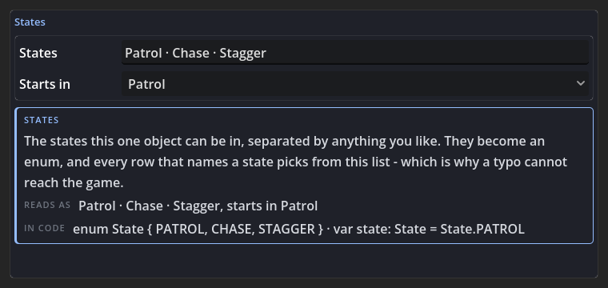
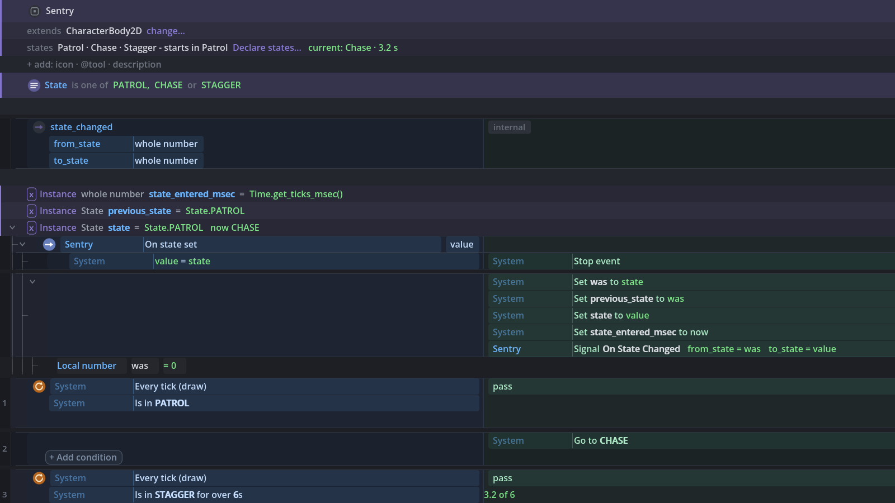
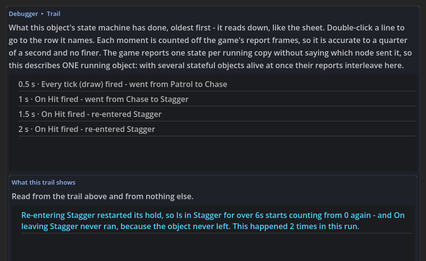

# States: What One Object Is Doing Right Now

An enemy is patrolling, or chasing, or staggered. A door is closed, opening, or open. A boss is in
phase one, two or three. That is the oldest pattern in game code, and this page is about writing it
here - where it is not a new kind of thing at all, but the variable pattern you already build: a
value compared in conditions and set in actions.

Everything below is that one idea followed through. There is no graph view, no boxes and arrows, no
canvas of nodes and no wires drawn over your rows, and there will not be: a state is a variable, so
the line on the sheet head that lists the states IS the diagram, and the rows underneath are the
machine.

## Table of Contents

1. [A state is a variable, and that is the whole design](#a-state-is-a-variable-and-that-is-the-whole-design)
2. [Declaring the states](#declaring-the-states)
3. [The four rows](#the-four-rows)
4. [The moment of a change: On entering and On leaving](#the-moment-of-a-change-on-entering-and-on-leaving)
5. [The timed question](#the-timed-question)
6. [A group named after a state - a convention, not a rule](#a-group-named-after-a-state---a-convention-not-a-rule)
7. [What it compiles to](#what-it-compiles-to)
8. [A machine somebody wrote by hand opens as these rows](#a-machine-somebody-wrote-by-hand-opens-as-these-rows)
9. [Watching it run: the band, the progress and the glow](#watching-it-run-the-band-the-progress-and-the-glow)
10. [The trail: what the machine just did](#the-trail-what-the-machine-just-did)
11. [Finding a state](#finding-a-state)
12. [What the Doctor knows about states](#what-the-doctor-knows-about-states)
13. [How this fits with the game's modes, and with the State Machine pack](#how-this-fits-with-the-games-modes-and-with-the-state-machine-pack)
14. [Tips and common mistakes](#tips-and-common-mistakes)

## A state is a variable, and that is the whole design

Ask a Godot programmer to write "this enemy is patrolling, chasing or staggered" and you get an
`enum` and a variable. Ask an event-sheet author the same thing and you get a variable compared in a
condition and set in an action. Those are the same answer, so this vocabulary is that answer and
nothing else:

| What you say | What your file says |
| --- | --- |
| the states this object can be in | `enum State { PATROL, CHASE, STAGGER }` |
| the state it is in now | `var state: State = State.PATROL` |
| **Is in CHASE** | `state == State.CHASE` |
| **Go to CHASE** | `state = State.CHASE` |

That has three consequences worth knowing before you start, because they are why the feature is
shaped the way it is:

- **Nothing is stored anywhere else.** Every part of a machine is a row you can see, edit and delete.
  There is no registry, no manager node, no runtime and no base class.
- **An object that was written by hand already has it.** Somebody who typed `enum State` and
  `var state` before this plugin existed gets the band, the rows and the readings with no conversion
  step - see [A machine somebody wrote by hand](#a-machine-somebody-wrote-by-hand-opens-as-these-rows).
- **Uninstalling takes none of it away.** The compiled file is plain typed GDScript that depends on
  nothing here, so deleting the plugin leaves a working state machine behind.

## Declaring the states

States are declared once, on the **states** band of the sheet head - the same place the game's modes
are declared one level up. A sheet that has none offers **states** in the `+ add` row under the head
stack; a sheet that has them shows them and opens the same dialog when you click it.


**Declare states…** asks the two questions a state machine really has, and no third one:

| Field | What it means |
| --- | --- |
| **States** | The names this one object can be in, separated by anything you like - commas, middots, plain spaces. `Patrol Chase Stagger` and `Patrol, Chase, Stagger` mean the same thing; the field is not a syntax to learn |
| **Starts in** | The state the object opens in. It is also the one state that needs no row going to it |



The strip at the foot of the dialog shows both halves of the answer as you type: what the head will
read as (`Patrol · Chase · Stagger - starts in Patrol`) and the code it stands for
(`enum State { PATROL, CHASE, STAGGER } · var state: State = State.PATROL`).

Pressing OK writes **five ordinary declarations** onto the sheet, as rows:

- `enum State { PATROL, CHASE, STAGGER }` - the states themselves.
- `var state: State = State.PATROL`, with the setter that announces a change.
- `var previous_state: State = State.PATROL` - what we came from.
- `var state_entered_msec: int = Time.get_ticks_msec()` - when this state began. The initialiser runs
  when the object is built, so the state it opens in has been held since the object existed, not
  since the game started.
- `signal state_changed(from_state: int, to_state: int)` - the announcement.

The announcement lives in the **state variable's own setter**, which is where Godot puts "and tell
everybody". That one decision is what makes going to a state a single plain assignment: nothing has
to remember to emit a signal, and a line that assigns the variable directly - yours, or a row's - is
already announcing itself. The same setter records the other two facts, which is why *Was in* and the
timed question need no bookkeeping row of their own.

**One declaration is one machine.** A second machine on the same object is a second declared state
variable, written by hand exactly as this writes the first. There is no "add machine" concept to
learn, because a machine was never a thing here.

## The four rows

Every state a row names is offered from **this object's own declarations** as you type, so a state is
picked rather than remembered. The field offers, it does not forbid: a name this object does not
declare yet is still typeable, because you may be about to declare it and a field that refused would
make writing the row first impossible. A row left naming a state nobody declares is what the Doctor
says out loud - see [What the Doctor knows](#what-the-doctor-knows-about-states). They live in the
picker under **Object State**.

| Row | Reads as | Ships as |
| --- | --- | --- |
| Is In State | **Is in PATROL** | `state == State.PATROL` |
| Is In State For Over | **Is in STAGGER for over 2s** | `state == State.STAGGER and (Time.get_ticks_msec() - state_entered_msec) / 1000.0 > 2.0` |
| Was In State | **Was in CHASE** | `previous_state == State.CHASE` |
| Go To State | **Go to CHASE** | `state = State.CHASE` |

A row shows the state as the **enum member it stores**, which is the value the dropdown wrote and the
value the line compiles to. The head band, the live readings, the trail and a lifted `match` arm say
the same state as a **word** - `Patrol` - because those are prose about the machine rather than the
row that is it.

Three of them are conditions and one is an action, which is the whole grammar of the family: you ask
in the condition lane and you move in the action lane. Branching never appears in the action lane,
here or anywhere else.

**Was in** answers "what did we come from", and it is worth more than it looks: the chase that began
from patrolling is a different chase from the one that began from being staggered, and a machine that
cannot ask which grows a second variable to remember it.

## The moment of a change: On entering and On leaving

Most of the real work of a machine happens at the moment it changes - drop the guard as the stagger
starts, raise it again after. Two triggers answer that moment:

- **On entering `<state>`** runs the moment this object enters that state.
- **On leaving `<state>`** runs the moment it leaves that state.

**For one change, leaving fires first.** The room is emptied before the next one is filled, so
whatever a state switched on can be put back before anything answering the new state starts. Both
rows are answers to the same one signal, and they compile into one
`_on_state_changed(from_state, to_state)` handler with every leaving arm written above every entering
arm - which is the order they run in, so the file reads the way it behaves.

Going to the state the object is already in **changes nothing and announces nothing**: neither
trigger fires. A signal that fired when nothing changed would be a signal every handler had to guard
itself against.

**A Go to inside one of these rows is a second change, and it happens straight away.** The setter
announces as it assigns - that is the whole reason *Go to* is one plain line - so a *Go to Stagger*
written under **On entering Chase** runs the whole of the Chase-to-Stagger change (its *On leaving
Chase*, then its *On entering Stagger*) before the rest of the *On entering Chase* rows resume. Those
remaining rows then run while the object is already in Stagger. Written out, the order is:

```
On leaving Patrol      the first change begins
On entering Chase      … and its rows run, one of which says Go to Stagger
  On leaving Chase       the second change runs to the end, here and now
  On entering Stagger
On entering Chase      the rest of the first row's rows, with the object already in Stagger
```

This is not a quirk of the plugin: it is what the same lines written by hand do, because a setter
that emits is a setter that emits. It is only worth knowing when you chain changes from inside a
change. The way to write that so it reads the way it runs is the ordinary one - make the second
change its own event, under **Is in Chase** and whatever else has to be true - and then each change
finishes before the next begins.

## The timed question

**Is in STAGGER for over 2s** is the timed half of *Is in*, and it is one row rather than two,
because "how long have we been here" is one question. It reads the clock the setter restarts, so:

- The clock **starts when the object is built**, because that is when the state it opens in began.
  An enemy spawned a minute into a run and standing in Patrol has been in Patrol for as long as it
  has existed, not for as long as the game has been running.
- The clock **restarts on every change of state**. A stagger that ends after a second and starts
  again is a fresh two seconds, not a continuation.
- The clock is `Time.get_ticks_msec()`, which is **wall time and does not stop when the tree is
  paused**. Going to the game's **Paused** mode freezes the objects, but every timed row keeps
  counting through the pause and answers the moment play resumes, and the band's `current: Stagger ·
  3.2 s` keeps rising over a frozen game. If a state's timer has to stop with the game, count it in a
  variable you add to under a **Not in mode Paused** condition, which is the ordinary shape and the
  one that says out loud which clock it is on.
- Going to the state you are already in restarts it too, which is the one thing a re-entry does. That
  is also what the trail says out loud when it happens - see
  [The trail](#the-trail-what-the-machine-just-did).
- The seconds field is an expression like every other number field, so `stagger_time` works where
  `2.0` does.

## A group named after a state - a convention, not a rule

Machines get long, and the shape that reads best is one **group per state**, named after it:

```
▾ Chase   What the sentry does while it is chasing.
    Every tick   ◆ Is in CHASE   →   Move Forward 120/s
    Every tick   ◆ Is in CHASE   ◆ Not Can See Player   →   Go to PATROL
```

That is **a convention and nothing more**. A group here is plain organisation - a folder with a name,
a colour and an on/off switch - and naming one after a state gives it no semantics whatsoever. The
group does not filter its rows by state, does not run only in that state, and does not know the state
exists. Every row inside it still asks **Is in CHASE** for itself, and that condition is the only
reason any of them run.

This is deliberate, and it is the difference between this and the game's modes one level up: a group
on the Game sheet CAN say which mode it runs in, because a game has exactly one mode and a group of
rules about the whole game is a real thing. A level holds fifty objects with a state each, so a group
that quietly meant "only while this object is chasing" would be a rule you could not see in the row
that obeys it.

## What it compiles to

Here is a whole small machine as the file it becomes. Nothing in it is plugin-shaped: this is the
code, and it is what a person writing the same enemy by hand would type.

<!-- caption: A sentry with three states, compiled -->
```gdscript
extends CharacterBody2D

enum State { PATROL, CHASE, STAGGER }

signal state_changed(from_state: int, to_state: int)

var state_entered_msec: int = Time.get_ticks_msec()
var previous_state: State = State.PATROL
var state: State = State.PATROL:
	set(value):
		if value == state:
			return
		var was: int = state
		previous_state = was
		state = value
		state_entered_msec = Time.get_ticks_msec()
		state_changed.emit(was, value)

func _ready() -> void:
	state_changed.connect(_on_state_changed)

func _process(delta: float) -> void:
	if state == State.PATROL:
		state = State.CHASE
	if state == State.STAGGER and (Time.get_ticks_msec() - state_entered_msec) / 1000.0 > 0.6:
		state = State.PATROL

func _on_state_changed(from_state: int, to_state: int) -> void:
	if from_state == State.CHASE:
		$Siren.stop()
	if to_state == State.CHASE:
		$Siren.play()
```

Read it against the rows and every line has an owner: the enum and the three variables are the
declarations the dialog wrote, the two `if`s in `_process` are two events with an **Is in** and a
**Go to**, and the handler is the two triggers with leaving above entering. The connect line in
`_ready` is the wiring, written once.

## A machine somebody wrote by hand opens as these rows

This is the headline of the whole feature, and it is why the vocabulary was chosen to be the shape it
is: **the machine in every Godot tutorial - an enum, a variable and a `match` on it - opens as these
rows with no conversion step, and saves back byte for byte.**

<!-- caption: A hand-written machine, opened as a sheet -->
```gdscript
extends CharacterBody2D

enum State { PATROL, CHASE, STAGGER }

var state: State = State.PATROL
var previous_state: State = State.PATROL
var speed: float = 40.0

func _physics_process(delta: float) -> void:
	match state:
		State.PATROL:
			velocity.x = speed
			if _sees_player():
				state = State.CHASE
		State.CHASE:
			velocity.x = speed * 3.0
			if not _sees_player():
				state = State.PATROL
		State.STAGGER:
			velocity.x = 0.0
	move_and_slide()

func _sees_player() -> bool:
	return $Sight.has_overlapping_bodies()
```

Opened as a sheet, the head grows its **states** band, each `match` arm reads as **Is in Patrol**,
**Is in Chase**, **Is in Stagger** - the *Is In State* row's own words, taken from that row rather
than spelled a second time - and a `state = State.CHASE` inside an arm reads as **Go to Chase**. The
arm's body stays verbatim, which is exactly what lets the whole `match` be written back the way you
wrote it.

The other shapes that open as states rows:

| What the file says | What the sheet reads |
| --- | --- |
| `enum State { PATROL, CHASE, STAGGER }` | the states on the head: `Patrol · Chase · Stagger` |
| `var state: State = State.PATROL` | ...` - starts in Patrol` |
| `state = State.CHASE`, and `self.state = State.CHASE` | **Go to Chase** |
| `if state == State.PATROL:`, and `self.state == …` | **Is in Patrol** |
| `if previous_state == State.CHASE:` | **Was in Chase** |
| `if state == State.STAGGER and (Time.get_ticks_msec() - state_entered_msec) / 1000.0 > 2.0:` | **Is in Stagger for over 2s** - one row, not a row plus a wall of arithmetic |
| `func _on_state_changed(from_state, to_state)` with `from_state` arms above `to_state` arms | **On leaving X** / **On entering X** |

**And what is not that shape stays code, precisely.** None of these are failures, and in every one of
them your file keeps its own bytes:

- **A `match` arm that binds a name** (`var pending:`) or destructures is doing something *Is in*
  cannot say. That arm keeps its pattern text.
- **A change handler that runs entering before leaving** is not the shape the compiler writes.
  Adopting it would silently reorder your code, so it keeps the plain signal-handler rows it had.
- **A machine reached through your own helper** (`_enter(State.OPEN)`) is a call to your function and
  reads as that call. Naming the `state = next` line inside that helper a **Go to** would be a guess.
- **A machine woven through several files** - the enum here, the variable there - is read one file at
  a time, like everything else here. Each file gets what it can say for itself.
- **A state that is a String rather than an enum** is the older State Machine behaviour pack's shape.
  It keeps that pack's own reading, and it is untouched.
- **A timed question with a third term in it** - `state == State.STAGGER and (Time.get_ticks_msec() -
  state_entered_msec) / 1000.0 > 2.0 and hp > 0` - is not the timed row: the timed row is exactly the
  two halves of "how long have we been here", and a line that asks something else as well is read as
  the several questions it is. The seconds field takes an expression, so a wait may be
  `stagger_time * 2`, but it stops where the expression does.

In all of those the door stays open: declare the states on the head and point the rows at them when
you are ready. Nothing forces the move, and nothing about your file changes until you make it.

## Watching it run: the band, the progress and the glow

Once the states are on the head, the sheet is also where you watch them. Run the game with the sheet
open and three things happen, all of them inside the sheet - there is no overlay on the running
game's viewport and no window in front of it:



- **The band carries the state the game is actually in.** `Patrol · Chase · Stagger - starts in Patrol`
  gains `current: Chase · 3.2 s` after it - after it, not instead of it, so the band still reads as
  the declaration it stands for. The state arrives as its NAME, not as a number you would have to
  count out.
- **A timed row shows its progress where the question is asked.** `Is in STAGGER for over 6s` gains
  `3.2 of 6` right after the cell. That left-hand number is not a second clock kept by the editor: it
  is the very quantity the row compares, so the progress and the row cannot disagree. A wait written
  as an expression shows no progress rather than one the editor invented.
- **The event that just fired is lit.** With **Event Trace** armed, a firing event wears a stripe down
  its left edge and a faint wash, pulsing: a one-shot reads as a flash that fades over about a second
  while a sustained fire holds near full. With **Reduced Motion** on it appears and disappears without
  animating.

Four things about the two readings are worth knowing, because each one is a promise the suite gates
rather than a paragraph:

| | |
| --- | --- |
| **It reads, it never writes** | Stop the game and the sheet is the document it was, to the byte. Nothing in the watch can reach a sheet, a row or a resource at all |
| **It costs nothing when nobody is watching** | Both facts ride the **Live Values** frame the game was already flushing. A sheet compiled without the debug switch carries no instrumentation at all - no timer, no message, no branch - and an object with no states adds nothing to a frame even with the switch on |
| **It ticks four times a second** | The game flushes a frame every 0.25 s and the band is written only when one arrives. Nothing is extrapolated on an editor frame, so a number on the band is a number the game reported. The band says so on hover |
| **Two games say which is which** | With **Run Multiple Instances**, each reading names the window it describes: `host · current: Chase · 3.2 s   client · current: Patrol · 0.5 s` |

## The trail: what the machine just did

The band says what the object **is**. The Debugger's **Trail** tab says what it **did**, in the same
grammar and in the past tense, reading down, oldest first, the way the sheet reads:

```
0.5 s · Every tick fired - went from Patrol to Chase
1 s   · On Hit fired - went from Chase to Stagger
1.5 s · On Hit fired - re-entered Stagger
2 s   · On Hit fired - re-entered Stagger
```

There is no timeline, no scrubber, no replay and no picture of a machine: a state is a variable, so
its history is a list of sentences about a variable. Double-click a line to go to the row it names.



**Under the sentences sit the patterns**, read from those same lines and from nothing else, so each
one is something that happened rather than something guessed at - and each names the rows it is
about:

| | |
| --- | --- |
| **The hold restarted** | The object was put into the state it was already in, so the clock went back to 0. `Is in Stagger for over 6s` starts counting again, and `On leaving Stagger` never ran, because the object never left. A timed row that never comes true is usually exactly this |
| **Twice in one frame** | The row that caused the change fired more than once inside a single game frame, and only the first of them changed anything - going to the state you are already in does nothing, which is the setter |

A pattern that happened again is said **once, with how often**: "This happened 11 times in this run"
is the half that explains the bug.

Three things it will not claim:

- **A row is named only when the run reported it firing.** The trail is the editor's own reading of
  two messages the game was already sending - the Live Values frame and, with **Event Trace** armed,
  the tally of rows that fired. Nothing new goes over the wire. With the trace off a line says what
  happened and claims no cause, and if two rows could both have done it, it names neither.
- **Each moment is counted off the game's report frames**, so it is accurate to a quarter of a second
  and to nothing finer. Nothing in the message carries a time, so the stamp is the editor's own count
  of frames received times the cadence: two changes inside one frame cannot be put in order by it,
  and a message the engine drops shifts every stamp after it earlier. It does not pretend otherwise.
- **It describes ONE running object.** The game reports its `state` once per running copy and the
  message does not say which node sent it, so a scene holding two enemies - or an enemy and a door -
  sends both under that one name and the trail interleaves them: a Patrol beside a Chase reads as a
  move between the two. Watch one stateful object at a time, and read a busy scene's trail as the
  interleaving it is. (The band above the rows has the same boundary, for the same reason.)
- **With two games running**, each line says which window it is and names no row at all: the
  fired-events message says which rows fired, not which window they fired in.
- **A line's door belongs to the sheet it was read in.** The row that caused a change is looked up in
  whatever sheet is in front when the frame arrives, so switching tabs mid-run leaves the earlier
  lines their sentences and takes away their double-click, rather than pointing you at a row of an
  object they were never about.

The trail belongs to the run. It is emptied when a new run starts, exactly where the Event Trace's
hit counts and timings are, and stopping the game leaves it standing - which is when it gets read.

## Finding a state

Two doors, both of them things you were already using:

- **The Quick Add field answers as well as adds.** Type two characters and the list under it holds
  the states, rows, variables, functions, signals, declared modes and Doctor findings that match,
  each labelled with what kind of thing it is and where it lives. Enter on an untouched list still
  adds the row by sentence exactly as it always did; Down reaches the answers and Enter opens the
  highlighted one. A state's own name puts the **States** group on top, and opening one reveals the
  `enum State` declaration on its own row.
- **A noun in a note is a door.** A comment beside an event that says "Patrol is where it starts"
  underlines `Patrol` with a hairline, and one click goes to that declaration. Only names the project
  can prove qualify: a word spelled like a state that is not one stays plain prose, with no mark and
  no hover, and a name of three letters or fewer is left alone whatever it is called - `Run`, `Hit`
  and `Die` are as much ordinary English as they are state names. The comment itself is never
  rewritten - a door is something a reader is shown, and the line the compiler emits is the line it
  always was.

## What the Doctor knows about states

**Tools ▸ Project Doctor** finds the three things that go wrong with an object's states. The first
two are not errors - the object compiles and runs - and both present as "nothing happened", which is
the worst kind of bug to find by playing. The third does not compile at all, and is here because it
is the one shape nothing else in the editor sees:

| Finding | What it means |
| --- | --- |
| **A state nothing reaches** | The state is declared, no **Go to** names it, and it is not the one the object starts in. It is written, and unreachable |
| **A state this object does not declare** | A row names a state this object's enum does not have. The field offers the declared ones and does not forbid the rest, so this catches hand-written code, a state borrowed from another object's family, and a name typed a moment before it was declared |
| **A row that names no state at all** | An *Is in* or *Go to* was dropped and its state cell left empty. That row compiles to `state == State.`, which is not GDScript, so this is the one state finding that stops the file building rather than making it behave oddly |

Both are asked of the project's own scripts rather than of its `.tres` sheets, because `.gd` is the
default sheet format: a check built on the sheet list would skip almost every real object while
looking like it worked.

## How this fits with the game's modes, and with the State Machine pack

Three things in this project are about states, and they are deliberately not three vocabularies.

**The game's modes are this exact idea one level up.** A game is in one mode - Playing, Paused,
Cutscene, Menu - declared on the **modes** band of the Game sheet's head, which is an Autoload,
because global state is what an Autoload is for. Declaration for declaration, the two are the same
machine:

| The game | This object |
| --- | --- |
| `enum Mode` | `enum State` |
| `var mode` | `var state` |
| `mode_changed` | `state_changed` |
| **In mode `<mode>`** | **Is in `<state>`** |
| **Go to mode `<mode>`** | **Go to `<state>`** |
| **On entering** / **On leaving**, leaving first | the same two triggers, in the same order |

They share the spelling rule that turns `GAVE_UP` into "Gave Up", the emitter that writes the change
handler, and the scale law that decides how many names a band shows - shared rather than copied, so
a reader can never meet two spellings of one idea. The bands are offered where each belongs: modes
only on an Autoload, states on every sheet that is not one.

Two differences are real, and both follow from what the two machines are about. A game has a **mode
stack** (**Push mode Menu** remembers what was underneath, **Go back** returns to it), because a menu
opening over a pause over playing is a stack whether or not a project admits it - an enemy has no
such thing. And a **group can say which mode it runs in**, which an object's states deliberately do
not do, for the reason in
[the convention section above](#a-group-named-after-a-state---a-convention-not-a-rule).

**The State Machine behaviour pack is the older answer to the same question**, and it is frozen and
keeps working exactly as it did: a child node holding a String state, with *Current state is*, *Go to
state* and *Time in state*. The difference is where the machine lives and what a state is. The pack
puts it in a child node with a string that a typo can spell wrong; this puts it in the object's own
script as an enum member a dropdown fills in, with no extra node in the scene. New work belongs here,
and nothing that uses the pack has to move.

## Tips and common mistakes

- **A state nothing goes to is the commonest bug**, and it is silent: the object simply never gets
  there. That is the Doctor finding above, and it is worth running before you go looking in the
  rows.
- **Do not add a "just changed" variable.** *Was in* already answers what you came from, and the two
  triggers already answer the moment itself.
- **Do not write your own "time in state" variable either.** The timed row reads a clock the setter
  keeps, and adding a second one gives you two clocks to keep in step.
- **Going to a state you are already in is a no-op**, not a re-run. If you meant "start the stagger
  again", the trail will show you the re-entry and tell you that *On leaving* never ran.
- **The seconds field takes an expression**, but a row whose wait is an expression shows no live
  progress while the game runs. Use a plain number while you are tuning it.
- **One object, one machine.** Two machines on one object means two declared state variables, written
  by hand the way the dialog writes the first. If you find yourself wanting five, ask whether some of
  those states belong to a child node with a machine of its own.
- **A group named after a state is a label.** Every row in it still asks *Is in* for itself. If a row
  in the Chase group runs during Patrol, that row is missing its condition - the group was never
  going to supply one.
