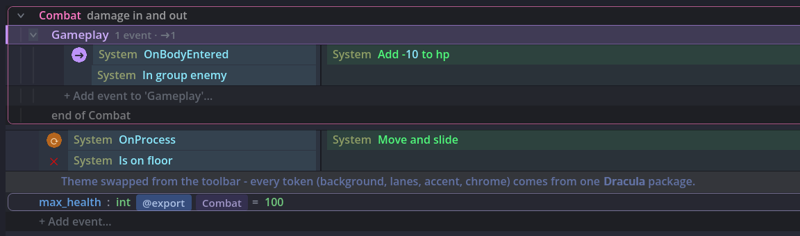

# EventSheet Theme + Editability Guide

> Updated 2026-06. A designer-friendly **visual theme editor** (live preview + grouped
> token controls) ships as the **Theme Editor dialog**.

This editor uses Godot-native resources instead of runtime CSS. The goal is still the same as a Construct-style theme.css workflow: designers can duplicate a theme package, tune tokens, reload the editor, and keep shipping reusable presets.

Current additions on top of the model below:

- A **toolbar theme switcher** lists "Default" plus the bundled presets - no file dialog
  needed for the common case.
- The built-in default is **Godot-adaptive** (`EventSheetGodotTheme.adapt_to_editor`):
  with no theme assigned, the sheet derives its colors from your editor theme so it looks
  native in any Godot skin.
- Newer semantic tokens include `object_label_color`, `value_highlight_color`,
  `cell_hover_color`, `invert_marker_color`, and `behavior_accent_color` (the ⚙ behavior
  banner/tab accent).

## Core model

- `EventSheetEditorStyle` (`.tres`) is the active installable theme package.
- `EventSheetEventStyle` owns sheet/event/group/comment/interaction tokens.
- `EventSheetElementStyle` owns condition/action entry tokens.
- The theme tokens above are the single source of truth: the live editor paints every row
  from them via the renderer (there are no per-row scenes to edit).

## Editing flow for designers

1. Duplicate `res://demo/themes/designer_template_theme.tres`.
2. Optionally duplicate `res://demo/themes/designer_template_theme_manifest.cfg` so the package keeps its token notes.
3. Edit the `.tres` resource in the Inspector for structural tokens such as sheet background, group/comment styling, and hover/selection fills.
4. Open one of the element `.tscn` files in Godot when you want a more visual preview for lane and chip styling.
5. Save the resource.
6. Assign the style to `EventSheetResource.editor_style` or load it through the dock toolbar.

## Switching themes

- Toolbar actions in the EventSheet dock:
  - **Load Theme**: pick an `EventSheetEditorStyle` resource.
  - **Default Theme**: clear the per-sheet override and use built-in defaults.
  - **Reload Theme**: reload the active style from disk.

### Bundled example themes

These themes are bundled in `res://demo/themes/`:

- `high_contrast_theme.tres` - accessibility-focused contrast preset
- `soft_light_theme.tres` - softer default for long authoring sessions
- `designer_template_theme.tres` - neutral starting point meant to be duplicated
- `designer_template_theme_manifest.cfg` - token/package template for designer installs
- plus popular presets: `catppuccin_mocha`, `dracula`, `gruvbox_dark`, `monokai`, `nord`, `solarized_light`

## Custom theme import/install

- Copy a custom `EventSheetEditorStyle` `.tres` into the project.
- Keep an optional sidecar manifest/config next to it if you want token notes or package metadata.
- Use **Load Theme** and pick the `.tres` file.
- Save the EventSheet resource so the chosen theme stays attached to that sheet.

## Hot-reload behavior

- When the active style resource changes in-editor, the dock refreshes the viewport.
- **Reload Theme** forces a disk reload for external edits.
- This is the closest practical equivalent to reloading a CSS theme file while staying fully native to Godot resources.

## Theme token spec

The Construct-inspired token list and field mapping now live in the **Theme Editor**
dialog (grouped token controls with live preview), which is the canonical reference for
every named token.

## Alignment controls

For layout and stacked-lane tuning details, see:

- `res://docs/internal/SPEC-layout-alignment.md`

## CSS-like template path

True CSS is not a practical runtime format for this editor pass, but the project now provides a CSS-like workflow:

- duplicate `designer_template_theme.tres`
- keep `designer_template_theme_manifest.cfg` beside it
- edit named tokens in the Inspector the way you would edit CSS variables/selectors

This preserves the user goal of designer-friendly theming while fitting Godot’s Resource/Scene workflow cleanly.

## Use cases

- **Match the game you're making.** A horror project edits three tokens (background, lane, accent) into a muted palette so the tool stops fighting the mood board.
- **A high-contrast accessibility preset.** Bump text/background contrast tokens once, save as a package, and every teammate who needs it installs the same preset.
- **Streaming and tutorials.** A big-font, high-contrast theme makes rows legible in a 720p video - switch from the toolbar before recording.
- **Ship the team preset in the repo.** The theme package is a folder of `.tres` files; commit it and everyone's editor matches after one toolbar pick.
- **Kill eye strain on a late jam night.** Duplicate `soft_light_theme.tres`, warm the background and lane tokens a few clicks, and Reload Theme - the glare drops without you leaving the sheet you were mid-edit on.
- **Client demo in the room's lighting.** A projector washes out the default palette, so you Load Theme the bundled `high_contrast_theme.tres` on the spot; the accent and cell hover tokens stay readable from the back row and you switch back to your normal preset afterward.
- **Tell regions apart at a glance.** A sheet with many stacked lanes gets confusing, so you tune `region_*` tint plus `behavior_accent_color` in the package so the behavior banner and its region chrome read as one color family - grouping becomes obvious without renaming anything.
- **Onboard a non-programmer designer.** Hand them the duplicated `designer_template_theme.tres` and its `_manifest.cfg` token notes; they edit named tokens in the Inspector like CSS variables, never touch a line of GDScript, and hand back a finished package.
- **Match the studio brand.** Marketing gives you a hex palette for screenshots and store pages, so you pour those exact values into background, accent, and `object_label_color` tokens once and every captured sheet is on-brand.
- **Two themes for two hats.** Keep a calm low-contrast package for authoring long sessions and a punchy high-contrast one for pair-review calls; the toolbar switcher flips between them in a click with no file dialog.
