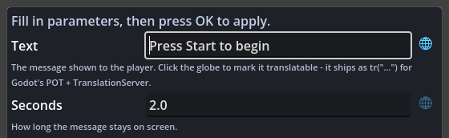

# Translating Your Game

Event sheets translate the Godot way: mark the text that players see, and Godot's own
localisation pipeline does everything else. There is no plugin string table and no export
step of its own - a sheet compiles to a plain `.gd`, Godot's POT generator reads the `tr()`
calls straight out of that file, translators fill in a catalog, and `TranslationServer`
swaps languages live. Delete the plugin and your translated game still runs.



Contents:

1. [Scenarios where this excels](#1-scenarios-where-this-excels)
2. [Mark the text players see](#2-mark-the-text-players-see)
3. [Generate the translation template (POT)](#3-generate-the-translation-template-pot)
4. [Add a language](#4-add-a-language)
5. [Switch languages from events](#5-switch-languages-from-events)
6. [The Translation vocabulary](#6-the-translation-vocabulary)
7. [Use cases](#7-use-cases)
8. [Tips and common mistakes](#8-tips-and-common-mistakes)

## 1. Scenarios where this excels

- **A jam game that ships in two languages**: mark five strings with the globe, paste a
  four-line CSV, add a language toggle button - done in minutes.
- **A dialogue-heavy game**: writers work in the sheet, the POT template collects every
  marked line automatically on regenerate, translators never open Godot.
- **A live language switcher in the options menu**: one Set Language action; every
  auto-translated Control and later `tr()` lookup follows instantly.

## 2. Mark the text players see

Any plain text field in the parameters dialog has a small globe button beside it. Toggle
it on and the value ships wrapped in `tr("...")` at its usage site:

```gdscript
print(tr("Spawned"))          # globe ON
label.text = str(tr("READY")) # globe ON, via Set Text
```

The globe stays dim until lit - most parameters (node paths, group names, amounts) are
not player-facing text and should stay unmarked. Reopening a marked value shows the plain
text with the globe lit; toggling it off unwraps it.

For text built at runtime (a variable holding a key, a formatted message), use the
**Translate** expression instead of the globe - it is the same `tr()` call with an
expression argument.

## 3. Generate the translation template (POT)

Godot extracts translatable strings from scripts - and a sheet IS a script:

1. Open **Project Settings > Localization > POT Generation**.
2. **Add** your compiled sheet files (the `.gd` the sheet saves to).
3. Press **Generate POT** and choose where to write the template.

The template lists every `tr("...")` string from your sheets. Regenerate it whenever you
add text; existing translations are unaffected.

## 4. Add a language

Two common routes, both plain Godot:

- **CSV (fastest)**: create `strings.csv` in your project:

  ```csv
  keys,en,es
  Spawned,Spawned,Aparecido
  READY,Ready!,Listo!
  ```

  Godot imports it automatically and produces one `.translation` file per column. Add
  those files under **Project Settings > Localization > Translations**.
- **gettext (.po)**: hand the generated POT to translators; import the returned `.po`
  files the same way.

That registration step is what makes `tr()` return translated text. The Project Doctor
reminds you if sheets translate text while the project has no catalog registered yet.

## 5. Switch languages from events

- **Set Language** action with a locale code (`"en"`, `"es"`, `"ja"`) switches the whole
  game live: auto-translated Controls re-render, and every later `tr()` lookup uses the
  new language.
- **On Language Changed** runs an event whenever the language switches - refresh any text
  you built manually there (re-assign labels from `tr()` expressions). The trigger adds
  its "Language Just Changed" gate condition for you; leave it in place.
- **Current Language** returns the active locale code, e.g. to highlight the current
  choice in an options menu.

## 6. The Translation vocabulary

| ACE | Kind | Emits |
|---|---|---|
| Set Language | Action | `TranslationServer.set_locale(locale)` |
| Current Language | Expression | `TranslationServer.get_locale()` |
| Translate | Expression | `tr(text)` |
| Translate With Context | Expression | `tr(text, context)` |
| Translate Plural | Expression | `tr_n(singular, plural, count)` |
| Language Just Changed | Condition | `what == NOTIFICATION_TRANSLATION_CHANGED` |
| On Language Changed | Trigger | the `_notification` virtual + the gate above |

Context disambiguates strings that read the same but translate differently ("May" the
month vs the verb). Plural picks the right form for a count per language, including
languages with more than two plural forms.

## 7. Use cases

### 1. A jam game in two languages by Sunday

Mark the dozen player-facing strings with the globe as you write them, export the POT, paste translations from a friend, done - the sheet logic never changes.

### 2. Dialogue marked translatable at author time

Every queued line or shown message gets the globe toggle when typed, so "we'll localise later" never becomes an archaeology project.

### 3. A language switcher in the pause menu

One Set Language action per button ("English", "Deutsch", "Espanol") - labels re-resolve live, no restart.

### 4. Plurals done right

"%d coin" vs "%d coins" (and languages with more than two forms) go through the plural-aware ACE instead of an `if count == 1` that only works in English.

### 5. One word, two meanings

"Close" the door vs "Close" the menu: contexts keep the two entries separate so translators see which is which.

### 6. Handing off mid-project

Export the POT at any point - the translator works while you keep adding events; new strings join the next export without disturbing finished entries.

### 7. A CJK build for a storefront launch

Shipping to a Japanese storefront means the menu, tutorial prompts, and item names all need `tr()` and a font that covers the glyphs; mark the strings once in the sheet and one `strings.csv` column carries every translated line without touching your event logic.

### 8. Community-sourced translations

Point your Discord volunteers at the exported POT and merge back the `.po` files they return - each language is just another catalog registered under Localization, so a Brazilian-Portuguese pack from a fan drops in without a single sheet edit.

### 9. Debug overlay stays in one language

Your FPS counter, coordinate readout, and console log are for you, not players, so you leave their globes dim - only the strings a real player reads get marked, and the POT never fills with developer noise.

### 10. Right-to-left languages for a jam theme

Adding Arabic or Hebrew as a stretch goal means registering an RTL catalog and letting Godot mirror layout; the sheet side is unchanged because every player string already flows through `tr()` and re-resolves on the Set Language switch.

### 11. Weekend patch adds a fifth language

A community offers a Polish translation after launch: you regenerate the POT, hand it over, register the returned catalog, and add one more Set Language button - the shipped game needs no recompile of hand-written systems because the sheet already emits plain `tr()` calls.

### 12. Plural and context in the same shop line

An in-game store shows "1 gem" versus "5 gems" and reuses "Free" for both price and shipping; the plural-aware ACE handles the count and Translate With Context keeps the two "Free" entries apart so translators are never guessing.

## 8. Tips and common mistakes

- **Never wrap a variable's DEFAULT in tr()**. Defaults initialize before translations
  load, and `@export` defaults are data, not display text. Mark the text where it is
  USED (the globe lives on usage-site parameters for exactly this reason).
- **The POT scan reads the compiled `.gd`** - add the sheet's saved script file to POT
  Generation, not a `.tres`.
- **Keys vs sentences**: both work. `tr("READY")` with catalog entries per language keeps
  source text stable; `tr("Press any key")` reads better in the sheet. Pick one style per
  project.
- **Controls often need no code at all**: Labels and Buttons with auto-translate enabled
  translate their `text` property by themselves - the globe is for text your EVENTS
  produce.
- **Do not mark node paths, group names, animation names, or action names** - translating
  identifiers breaks lookups. The globe defaults to off for a reason.
- **Test a language quickly**: add a Set Language action on a debug key press, or set
  Project Settings > Internationalization > Locale > Test to force one at startup.
