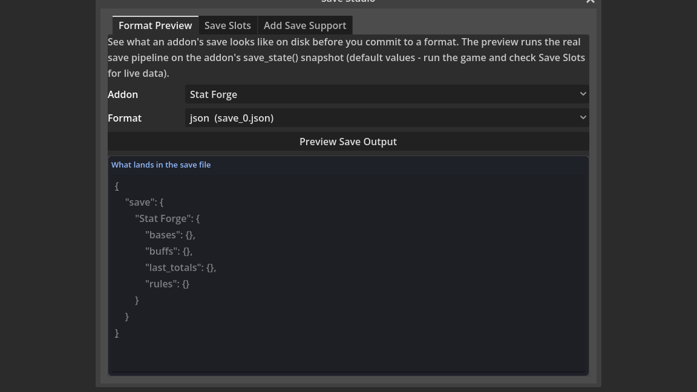

# Using the Save Studio

Working on a game's save files usually means running the game, saving, hunting for the file under `user://`, and opening it in a text editor to see what actually landed on disk. The Save Studio collapses that whole loop into one editor window. It is a panel with three tabs, titled "Save Studio", that lets you preview exactly what a save file will look like before you commit to a format, browse and export the real save files your project has already written, and generate the save-and-load plumbing for your own scripts in a few clicks. It is built directly on the Save System addon and the project-wide save-state seam, so everything it shows you is the real thing, not an approximation.

This guide walks through each tab in order, shows the matching code API for people who want to script it, and finishes with concrete use cases and a list of common pitfalls. For the bigger picture of how saving works across a whole project - the persist group, the lifecycle triggers, targeted versus whole-game saving - see the "Saving and Loading Your Game" guide, which is the companion to this one.

## Table of Contents

1. [Opening the Save Studio](#1-opening-the-save-studio)
2. [Background you need first](#2-background-you-need-first)
3. [Tab 1: Format Preview](#3-tab-1-format-preview)
4. [Tab 2: Save Slots](#4-tab-2-save-slots)
5. [Tab 3: Add Save Support](#5-tab-3-add-save-support)
6. [Doing it from code](#6-doing-it-from-code)
7. [Use Cases](#7-use-cases)
8. [Tips and Common Mistakes](#8-tips-and-common-mistakes)

## 1. Opening the Save Studio

There are two ways to open the window.

- In the event sheet dock, open the **Tools** menu and choose **Save Studio...**.
- Press **Ctrl+P** to open the Command Palette, type **Save Studio**, and run the matching command.

Either route opens the same window. It does not need the game to be running, and it does not modify your project just by being open. The three tabs across the top are **Format Preview**, **Save Slots**, and **Add Save Support**.

## 2. Background you need first

Two ideas make the rest of the window make sense.

The first is the **save-state seam**. A node takes part in saving by exposing two plain methods: `save_state() -> Dictionary`, which returns a plain-data snapshot of everything it is tracking, and `load_state(state: Dictionary)`, which puts that snapshot back. There is no base class to inherit and nothing to register. The Save System recognises the pair by duck typing - any node that has both methods participates automatically. Every stateful bundled behavior (StatForge, Health, Currency Ledger, and many more) already ships this pair.

The second is the set of **save formats**. The Save System writes its slot files to `user://`, and its `format` Inspector property picks how the data is laid out on disk. There are six choices, and all six preserve exact value types:

- **config** - a Godot ConfigFile, extension `.cfg`.
- **json** - readable JSON text, extension `.json`.
- **binary** - compact `store_var` bytes, extension `.sav`.
- **csv** - spreadsheet-style rows, extension `.csv`.
- **ini** - a portable `[section]` `key=value` file, extension `.ini`.
- **xml** - structured entry tags, extension `.xml`.

The Save Studio is largely about seeing and moving data between these six formats, and about wiring new scripts into the seam.

## 3. Tab 1: Format Preview

The Format Preview tab answers a single question: what will this addon's save file actually look like on disk, in a given format, before I commit to that format? It runs the real Save System backend on a real snapshot, so what you see is byte-for-byte what would ship.

Work through the controls top to bottom:

1. **Addon dropdown.** This lists the bundled addons that ship the save-state seam - StatForge, Health, Currency Ledger, and the rest. If you have a scene node selected in the editor, that node also appears in the list as **Selected node: &lt;name&gt;**, which lets you preview your own composition (the node together with its behavior children) instead of a bundled pack.
2. **Format dropdown.** This lists all six formats, each shown with the file it would produce so the mapping is obvious: config (`save_0.cfg`), json (`save_0.json`), binary (`save_0.sav`), csv (`save_0.csv`), ini (`save_0.ini`), and xml (`save_0.xml`).
3. **Preview Save Output button.** Press this to build the preview.
4. **The output panel, titled "What lands in the save file".** This shows the real on-disk save text produced by running the actual Save System backend on the addon's `save_state()` snapshot. For the binary format there is no readable text, so the panel shows a short hex preview instead.

One caveat is important enough to keep in mind every time you use this tab: the preview is built from the addon's **default values**, that is, a fresh snapshot. It shows you the shape and the types of the data, not the numbers from a live play session. If you want to see the actual coins, health, or buffs a player accumulated, run the game, let it save, and inspect the real file on the Save Slots tab instead.

## 4. Tab 2: Save Slots

The Save Slots tab browses, inspects, and exports the real save files your project has already written under `user://`.

- **The file list** shows every save file found under `user://`, with its filename, its size in KB, and its last-modified timestamp, so you can tell at a glance which slot is which and which one is newest.
- **Refresh** re-reads the folder from disk, which you press after the running game writes a new save.
- **Open Folder** opens the `user://` directory in your operating system's file browser, handy for backing up or clearing saves outside the editor.
- **Selecting a file** shows its contents in the **File contents** panel. A binary file has no readable text, so it shows a hex preview instead.
- **The section-name field** (default `save`) is the Save System section the file was written under. It matters only when you convert a file between formats, because the backend needs to know which section to read.
- **The convert dropdown** offers **keep format**, or one of **as config**, **as json**, **as binary**, **as csv**, **as ini**, or **as xml**.
- **Export...** opens a file dialog so you can save the selected slot anywhere on disk. If you picked a convert format, the file is read back through the Save System backend and rewritten in the new format on the way out, so this doubles as a converter between any two of the six formats. Encrypted saves are the one exception: they export with **keep format** only.

## 5. Tab 3: Add Save Support

The Add Save Support tab generates the `save_state` / `load_state` seam for one of your own scripts - an addon, an editor tool, or a plain node - so that it joins the exact same save convention the built-in behaviors use.

1. **Path field and Browse... button.** Type or pick the path to a `.gd` file.
2. **Scan Variables button.** Scanning fills a table with three columns: a **Save** checkbox, a **Variable** name, and its **Type**, with one row per top-level variable in the script. Plain-data variables (numbers, text, dictionaries, arrays, Vector2, Color, and so on) are pre-ticked. Object references - a Node, a Resource, a RandomNumberGenerator, anything that is a pointer rather than data - are left unticked, because a live object must never go into a save file.
3. **Generate save_state / load_state button.** This builds the method pair from the ticked rows only, following the repo convention: snapshot keys drop a leading underscore, collections are deep-copied so the save never aliases live data, and loads coerce each value by type and tolerate a missing key so an older save never crashes a newer build.
4. **The output panel, titled "Generated seam (paste into the script)".** The generated pair appears here.
5. **Copy to Clipboard button.** Copies the generated code so you can paste it straight into your script.

Once you paste the pair into your script, the Save System finds it automatically, either because the node is in the persist group or because a sheet calls the Save Node State verb on it. The two methods it generates are a solid, correct starting point, and because they are plain GDScript you are free to edit them afterwards.

## 6. Doing it from code

Everything the Save Studio does by hand is also available on the public `EventSheets` API, which is what build tools and tests call:

- `EventSheets.save_state_code(fields)` returns the generated `save_state` / `load_state` source, the same output as the Add Save Support tab.
- `EventSheets.persistable_fields(path)` scans a script and returns its variables with the plain-data / object-reference classification, the same data the scan table shows.
- `EventSheets.preview_save(data, format)` renders a snapshot in a chosen format, the same text the Format Preview tab shows.
- `EventSheets.save_capable_scripts()` lists the bundled addons that ship the seam, the same set the Addon dropdown offers.

If you want to fold any of this into your own build scripts or automated checks, the "Building on EventSheets" guide documents the full API surface.

## 7. Use Cases

1. **Compare JSON and binary before shipping.** Preview your main save composition once as json and once as binary on the Format Preview tab. You can then decide with your own eyes whether the readability of json is worth the extra bytes over binary, instead of guessing.

2. **Convert an existing config save to readable JSON for modders.** On the Save Slots tab, select a `.cfg` save, set the convert dropdown to **as json**, and Export. Modders get a clean JSON file they can read and edit, and you never had to touch the game code.

3. **Send a player's save to a bug report.** When a player hits a bug, ask for their save file, drop it under `user://`, Refresh, select it, and Export it somewhere you can attach it to the ticket. The exact save that reproduces the bug travels with the report.

4. **Check what a StatForge node actually stores.** Pick StatForge in the Addon dropdown and preview it. The output panel shows precisely which fields StatForge writes and in what shape, which is far faster than reading the pack source.

5. **Add save support to your own inventory script in three clicks.** On the Add Save Support tab, Browse to your inventory `.gd`, Scan Variables, and Generate. Paste the result in and your inventory now saves and loads exactly like the bundled behaviors, with no hand-written boilerplate.

6. **Preview an XML save for an external pipeline.** If a separate tool in your pipeline consumes XML, preview any addon as xml to see the exact tag structure it will receive. You can hand that sample to whoever writes the consumer.

7. **Browse and hand-inspect a live save file.** Run the game, save, come back to the Save Slots tab, Refresh, and select the newest slot to read its real contents in the File contents panel. This is how you confirm live gameplay data actually made it to disk.

8. **Open a save in a spreadsheet.** Select a save, convert **as csv**, and Export. Opening the CSV in a spreadsheet program lets you scan rows of saved values in a familiar grid, useful for balancing or sanity-checking numbers.

9. **Generate the seam for a tool script.** The Add Save Support tab works on any `.gd` file, not just gameplay nodes. Point it at an editor tool script, scan, and generate to give that tool the same save convention everything else uses.

10. **Pick the smallest format by eyeballing it.** Preview the same composition across binary and the text formats and note how compact the binary hex preview is next to the text. If save size matters for your target platform, this is the quickest way to choose.

11. **Verify a node's behaviors all persist.** Select your composed scene node in the editor so it shows up as **Selected node: &lt;name&gt;**, then preview it. Because the preview walks the node plus its behavior children, you can confirm every behavior you expected to save is present in the output.

12. **Open the save folder to back up or clear saves.** Use **Open Folder** on the Save Slots tab to jump straight to `user://` in your file browser, where you can copy the saves somewhere safe or delete them to test a fresh first-run.

## 8. Tips and Common Mistakes

- **The preview shows defaults, not live data.** The Format Preview tab builds its output from a fresh snapshot using each addon's default values. It is perfect for seeing the shape and types of a save, but it will not show the coins or health from an actual play session. For real numbers, run the game and use the Save Slots tab.

- **Object references are left out on purpose.** When Scan Variables leaves a Node, Resource, or RandomNumberGenerator unticked, that is correct behavior, not an oversight. Those are live pointers, not plain data, and forcing one into a save file would store something meaningless. Leave them unticked and save only the plain-data fields that describe state.

- **The section name must match to convert.** Converting a file between formats on the Save Slots tab reads it back through the Save System backend, which needs the section the file was written under. The field defaults to `save`; if your project writes under a different section, set it to match, or the conversion will not find the data.

- **Encrypted saves export with keep-format only.** An encrypted save cannot be read back and rewritten in a different format, so the convert options do not apply to it. Export it with **keep format** and it comes out intact.

- **The generated pair is a starting point.** The `save_state` / `load_state` methods the Add Save Support tab produces are plain, correct GDScript. If your script needs to save something the scanner could not infer, or to massage a value on the way in or out, edit the generated methods freely - they are yours once pasted.

- **Refresh after the game writes a save.** The Save Slots list reads the folder when you open it or press Refresh, not continuously. If you saved in a running game and do not see the file, press Refresh to re-read `user://`.
